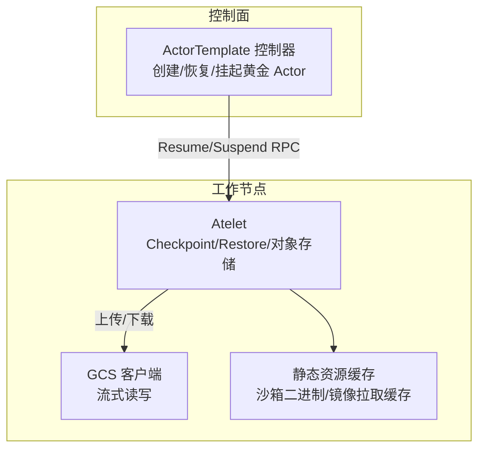
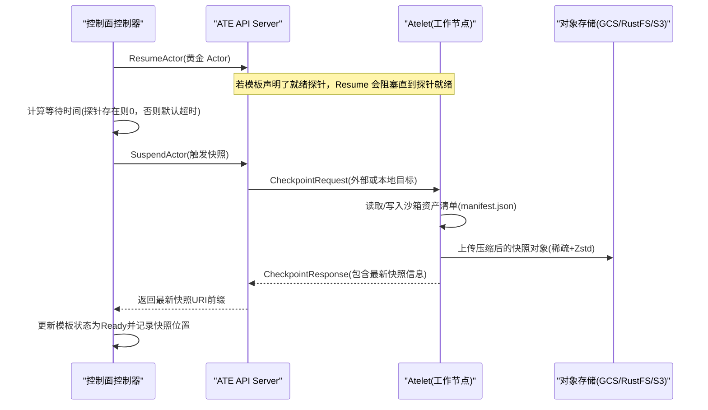
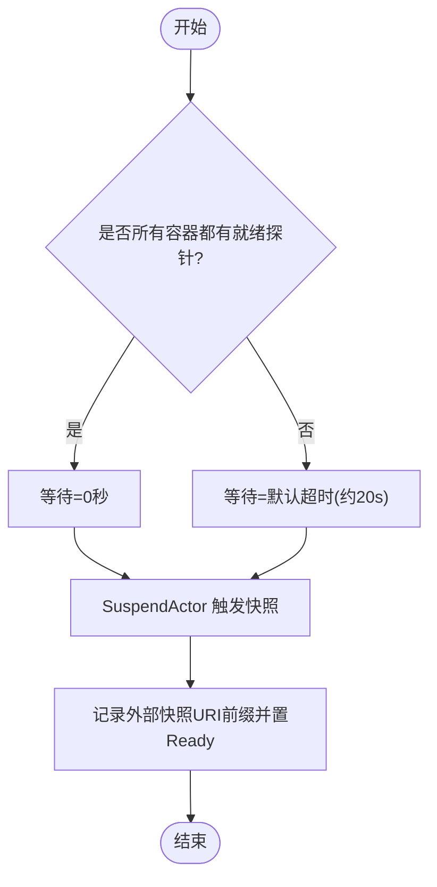
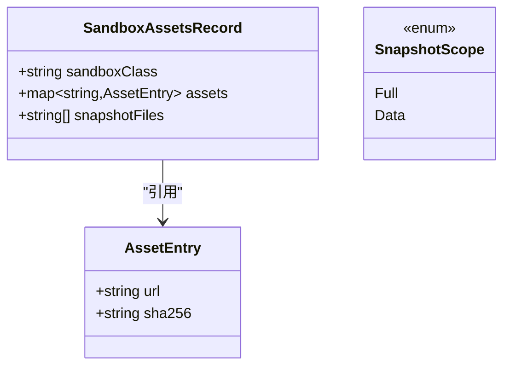
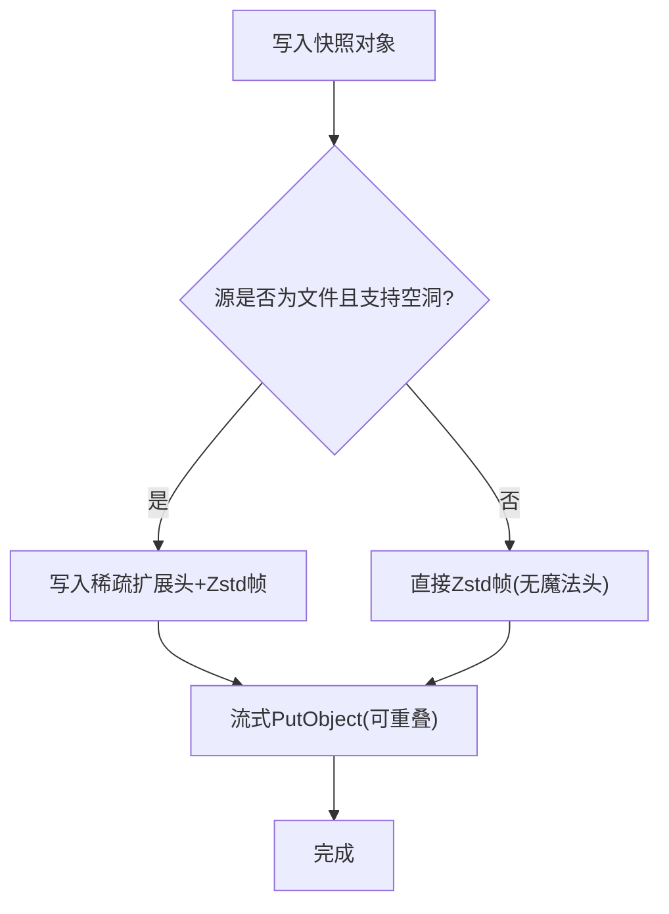
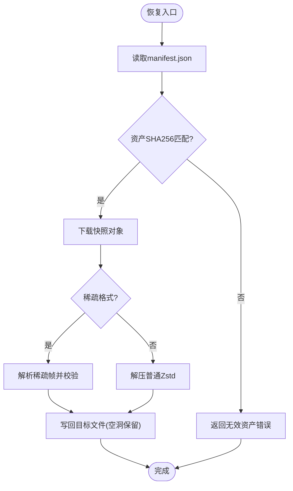
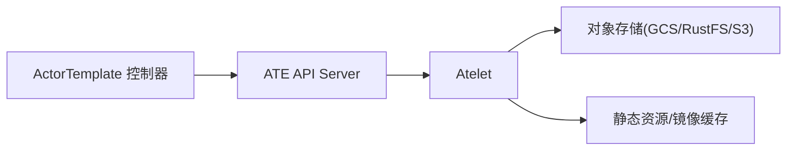

# 黄金快照管理

<cite>
**本文引用的文件**   
- [cmd/atecontroller/internal/controllers/actortemplate_controller.go](file://cmd/atecontroller/internal/controllers/actortemplate_controller.go)
- [cmd/atelet/main.go](file://cmd/atelet/main.go)
- [cmd/atelet/sandbox_assets.go](file://cmd/atelet/sandbox_assets.go)
- [cmd/atelet/internal/ategcs/gcs.go](file://cmd/atelet/internal/ategcs/gcs.go)
- [cmd/atelet/internal/ategcs/sparsezstd.go](file://cmd/atelet/internal/ategcs/sparsezstd.go)
- [cmd/atelet/internal/ategcs/objects_test.go](file://cmd/atelet/internal/ategcs/objects_test.go)
- [internal/proto/ateletpb/atelet.proto](file://internal/proto/ateletpb/atelet.proto)
- [pkg/api/v1alpha1/actortemplate_types.go](file://pkg/api/v1alpha1/actortemplate_types.go)
- [tools/setup-gcp/dashboards/ate-snapshot-dashboard.json](file://tools/setup-gcp/dashboards/ate-snapshot-dashboard.json)
</cite>

## 目录
1. [简介](#简介)
2. [项目结构](#项目结构)
3. [核心组件](#核心组件)
4. [架构总览](#架构总览)
5. [详细组件分析](#详细组件分析)
6. [依赖关系分析](#依赖关系分析)
7. [性能与优化](#性能与优化)
8. [监控与告警](#监控与告警)
9. [故障排查指南](#故障排查指南)
10. [结论](#结论)

## 简介
本文件系统性阐述“黄金快照”的创建与管理机制，覆盖以下关键主题：
- 快照生成时机选择：基于就绪探针的智能等待策略与默认超时兜底。
- 快照数据格式、外部存储集成与版本管理。
- 快照验证、完整性检查与损坏恢复。
- 快照优化策略：增量快照（按范围）、压缩传输与缓存机制。
- 快照管理的监控指标与告警配置建议。

## 项目结构
与黄金快照相关的代码主要分布在控制面与工作节点侧：
- 控制面控制器负责编排“黄金 Actor”生命周期，决定何时触发快照。
- 工作节点 atelet 负责执行 Checkpoint/Restore，处理对象存储上传下载、压缩与校验。
- 协议与类型定义位于 proto 与 pkg/api 中，描述快照作用域、沙箱资产清单等。

图表来源
- [cmd/atecontroller/internal/controllers/actortemplate_controller.go:119-187](file://cmd/atecontroller/internal/controllers/actortemplate_controller.go#L119-L187)
- [cmd/atelet/main.go:309-314](file://cmd/atelet/main.go#L309-L314)
- [cmd/atelet/internal/ategcs/gcs.go:35-66](file://cmd/atelet/internal/ategcs/gcs.go#L35-L66)

章节来源
- [cmd/atecontroller/internal/controllers/actortemplate_controller.go:119-187](file://cmd/atecontroller/internal/controllers/actortemplate_controller.go#L119-L187)
- [cmd/atelet/main.go:309-314](file://cmd/atelet/main.go#L309-L314)
- [cmd/atelet/internal/ategcs/gcs.go:35-66](file://cmd/atelet/internal/ategcs/gcs.go#L35-L66)

## 核心组件
- 黄金快照编排器（控制面）
  - 负责创建并恢复一个“黄金 Actor”，在合适的时机挂起以生成快照，并将快照位置写入模板状态。
- 快照执行器（工作节点 atelet）
  - 实现 Checkpoint/Restore，支持本地与外部两种快照目标；记录沙箱资产清单；对大文件进行稀疏+Zstandard 压缩；向对象存储上传/下载。
- 对象存储适配层
  - 提供统一的 Get/Put 接口，GCS 端点支持流式写入，便于边压边传。
- 快照元数据与类型
  - 通过 proto 与 API 类型定义快照作用域、沙箱资产清单、外部/本地快照前缀等。

章节来源
- [cmd/atecontroller/internal/controllers/actortemplate_controller.go:119-187](file://cmd/atecontroller/internal/controllers/actortemplate_controller.go#L119-L187)
- [cmd/atelet/main.go:309-314](file://cmd/atelet/main.go#L309-L314)
- [cmd/atelet/sandbox_assets.go:54-68](file://cmd/atelet/sandbox_assets.go#L54-L68)
- [internal/proto/ateletpb/atelet.proto:47-75](file://internal/proto/ateletpb/atelet.proto#L47-L75)
- [pkg/api/v1alpha1/actortemplate_types.go:236-276](file://pkg/api/v1alpha1/actortemplate_types.go#L236-L276)

## 架构总览
黄金快照从“准备—等待—挂起—落盘—持久化—可观测”的全链路如下：

图表来源
- [cmd/atecontroller/internal/controllers/actortemplate_controller.go:119-187](file://cmd/atecontroller/internal/controllers/actortemplate_controller.go#L119-L187)
- [cmd/atelet/main.go:309-314](file://cmd/atelet/main.go#L309-L314)
- [cmd/atelet/sandbox_assets.go:206-241](file://cmd/atelet/sandbox_assets.go#L206-L241)
- [cmd/atelet/internal/ategcs/gcs.go:55-66](file://cmd/atelet/internal/ategcs/gcs.go#L55-L66)

## 详细组件分析

### 快照生成时机与智能等待策略
- 就绪探针优先：当模板所有容器均声明 Readyz 探针时，ResumeActor 已阻塞到应用就绪，因此无需额外等待，直接发起挂起。
- 默认超时兜底：若无就绪探针或混合场景，控制器设置固定等待时长后再挂起，作为粗粒度的初始化缓冲。
- 状态机推进：控制器在 PhaseWaitGoldenActor 阶段根据 TakeGoldenSnapshotAt 定时重入，到期后调用 SuspendActor，成功后将外部快照 URI 前缀写入模板状态并置 Ready。

图表来源
- [cmd/atecontroller/internal/controllers/actortemplate_controller.go:195-200](file://cmd/atecontroller/internal/controllers/actortemplate_controller.go#L195-L200)
- [cmd/atecontroller/internal/controllers/actortemplate_controller.go:139-167](file://cmd/atecontroller/internal/controllers/actortemplate_controller.go#L139-L167)

章节来源
- [cmd/atecontroller/internal/controllers/actortemplate_controller.go:139-167](file://cmd/atecontroller/internal/controllers/actortemplate_controller.go#L139-L167)
- [cmd/atecontroller/internal/controllers/actortemplate_controller.go:195-200](file://cmd/atecontroller/internal/controllers/actortemplate_controller.go#L195-L200)

### 快照数据格式与元数据
- 自描述清单：每个快照旁保存 manifest.json，记录沙箱类、各架构下的资产 URL 与 SHA256，以及该快照对应的运行时产物文件名集合。
- 沙箱资产缓存：工作节点按内容寻址缓存沙箱二进制，避免重复下载；下载过程流式哈希校验，超限拒绝。
- 快照作用域：支持 Full（内存+文件系统增量）与 Data（仅卷数据），由请求参数指定。

图表来源
- [cmd/atelet/sandbox_assets.go:54-68](file://cmd/atelet/sandbox_assets.go#L54-L68)
- [pkg/api/v1alpha1/actortemplate_types.go:236-276](file://pkg/api/v1alpha1/actortemplate_types.go#L236-L276)

章节来源
- [cmd/atelet/sandbox_assets.go:54-68](file://cmd/atelet/sandbox_assets.go#L54-L68)
- [cmd/atelet/sandbox_assets.go:206-241](file://cmd/atelet/sandbox_assets.go#L206-L241)
- [pkg/api/v1alpha1/actortemplate_types.go:236-276](file://pkg/api/v1alpha1/actortemplate_types.go#L236-L276)

### 外部存储集成与版本管理
- 统一对象存储接口：GetObject/PutObject 抽象，GCS 端点支持流式写入，便于压缩与上传重叠。
- 兼容旧格式：下载路径自动检测是否为稀疏扩展格式，若非则回退为普通 Zstandard 流，保证向后兼容。
- 版本演进：稀疏格式带版本号头，解析时校验版本，不支持的版本直接报错，避免误用。

图表来源
- [cmd/atelet/internal/ategcs/gcs.go:55-66](file://cmd/atelet/internal/ategcs/gcs.go#L55-L66)
- [cmd/atelet/internal/ategcs/sparsezstd.go:137-165](file://cmd/atelet/internal/ategcs/sparsezstd.go#L137-L165)
- [cmd/atelet/internal/ategcs/objects_test.go:148-183](file://cmd/atelet/internal/ategcs/objects_test.go#L148-L183)

章节来源
- [cmd/atelet/internal/ategcs/gcs.go:35-66](file://cmd/atelet/internal/ategcs/gcs.go#L35-L66)
- [cmd/atelet/internal/ategcs/sparsezstd.go:137-165](file://cmd/atelet/internal/ategcs/sparsezstd.go#L137-L165)
- [cmd/atelet/internal/ategcs/objects_test.go:148-183](file://cmd/atelet/internal/ategcs/objects_test.go#L148-L183)

### 快照验证、完整性检查与损坏恢复
- 沙箱资产完整性：下载时按 SHA256 校验，超过大小上限拒绝，失败保留临时文件不污染缓存。
- 快照对象完整性：稀疏格式解析严格校验版本、总大小、区间越界等；非稀疏格式走通用解压流程。
- 错误分类：终端文件系统错误（不存在、权限不足、只读等）被标记为不可恢复，其他错误可重试。

图表来源
- [cmd/atelet/sandbox_assets.go:117-184](file://cmd/atelet/sandbox_assets.go#L117-L184)
- [cmd/atelet/internal/ategcs/sparsezstd.go:137-165](file://cmd/atelet/internal/ategcs/sparsezstd.go#L137-L165)
- [cmd/atelet/sandbox_assets.go:243-266](file://cmd/atelet/sandbox_assets.go#L243-L266)

章节来源
- [cmd/atelet/sandbox_assets.go:117-184](file://cmd/atelet/sandbox_assets.go#L117-L184)
- [cmd/atelet/sandbox_assets.go:243-266](file://cmd/atelet/sandbox_assets.go#L243-L266)
- [cmd/atelet/internal/ategcs/sparsezstd.go:137-165](file://cmd/atelet/internal/ategcs/sparsezstd.go#L137-L165)

### 快照优化策略
- 增量快照（按范围）：通过 SnapshotScope 控制 Full/Data，Data 仅捕获卷数据，显著降低体积与传输成本。
- 压缩传输：使用 Zstandard 压缩；针对大文件采用稀疏扩展格式，跳过空洞区域，进一步减少网络与存储占用。
- 缓存机制：
  - 沙箱二进制按内容地址缓存，命中即复用。
  - 镜像拉取具备内存 LRU 缓存，限制单镜像大小阈值，避免过大镜像常驻内存。

章节来源
- [pkg/api/v1alpha1/actortemplate_types.go:236-276](file://pkg/api/v1alpha1/actortemplate_types.go#L236-L276)
- [cmd/atelet/internal/ategcs/objects_test.go:229-273](file://cmd/atelet/internal/ategcs/objects_test.go#L229-L273)
- [cmd/atelet/sandbox_assets.go:91-111](file://cmd/atelet/sandbox_assets.go#L91-L111)

## 依赖关系分析
- 控制面与 atelet 通过 gRPC 交互，传递快照作用域与目标类型（外部/本地）。
- atelet 依赖对象存储抽象层，GCS 实现支持流式 Put，利于压缩与上传重叠。
- 快照清单与沙箱资产解耦，使 Restore 可在不同节点复现相同运行环境。

图表来源
- [cmd/atecontroller/internal/controllers/actortemplate_controller.go:119-187](file://cmd/atecontroller/internal/controllers/actortemplate_controller.go#L119-L187)
- [cmd/atelet/internal/ategcs/gcs.go:35-66](file://cmd/atelet/internal/ategcs/gcs.go#L35-L66)

章节来源
- [cmd/atecontroller/internal/controllers/actortemplate_controller.go:119-187](file://cmd/atecontroller/internal/controllers/actortemplate_controller.go#L119-L187)
- [cmd/atelet/internal/ategcs/gcs.go:35-66](file://cmd/atelet/internal/ategcs/gcs.go#L35-L66)

## 性能与优化
- 稀疏+Zstd 压缩：对含大量空洞的大文件（如内存页映射）显著降低体积与 I/O。
- 流式上传：GCS 端点支持非 seekable 流式写入，避免整块缓冲，提升吞吐。
- 作用域裁剪：Data 模式仅快照卷数据，适合频繁提交场景。
- 缓存命中：沙箱二进制与镜像拉取缓存减少重复网络开销。

[本节为通用性能讨论，不直接分析具体文件]

## 监控与告警
- 内置指标：快照图片大小直方图（按 kind 区分 pages 等维度），用于观察分布与 P50/P95/P99。
- 预置看板：提供“快照大小与 QPS”看板，聚合 histogram 分位与速率，便于容量规划与异常定位。
- 告警建议：
  - 快照大小 P99 突增（例如环比增长 > X%）。
  - 快照 QPS 异常波动（过高可能引发 IO 压力，过低可能影响恢复效率）。
  - 对象存储上传失败率上升（结合错误码与原因分类）。

章节来源
- [cmd/atelet/main.go:282-307](file://cmd/atelet/main.go#L282-L307)
- [tools/setup-gcp/dashboards/ate-snapshot-dashboard.json:1-137](file://tools/setup-gcp/dashboards/ate-snapshot-dashboard.json#L1-L137)

## 故障排查指南
- 常见错误分类
  - 终端文件系统错误：文件不存在、权限不足、只读等，通常不可恢复，需检查路径与权限。
  - 无效对象/资产：URL 非法、SHA256 不匹配、超出大小上限等，需核对对象存储与清单。
  - 快照作用域/类型非法：请求参数未指定或值不在枚举范围内，需修正请求。
- 定位步骤
  - 确认模板就绪探针与等待时间是否符合预期。
  - 检查 manifest.json 是否存在且可解析。
  - 校验沙箱资产下载与哈希一致性。
  - 观察对象存储上传/下载日志与错误码。
  - 查看快照大小与 QPS 看板，评估是否出现异常峰值。

章节来源
- [cmd/atelet/sandbox_assets.go:243-266](file://cmd/atelet/sandbox_assets.go#L243-L266)
- [cmd/atelet/main.go:894-968](file://cmd/atelet/main.go#L894-L968)

## 结论
黄金快照通过“就绪探针优先 + 默认超时兜底”的策略确保快照在稳定状态下生成；借助自描述清单、稀疏+Zstd 压缩、流式上传与多层缓存，实现了高可靠、低成本的快照能力；配合完善的验证与错误分类，以及直观的监控看板，为大规模生产环境的快速恢复与弹性伸缩提供了坚实基础。
