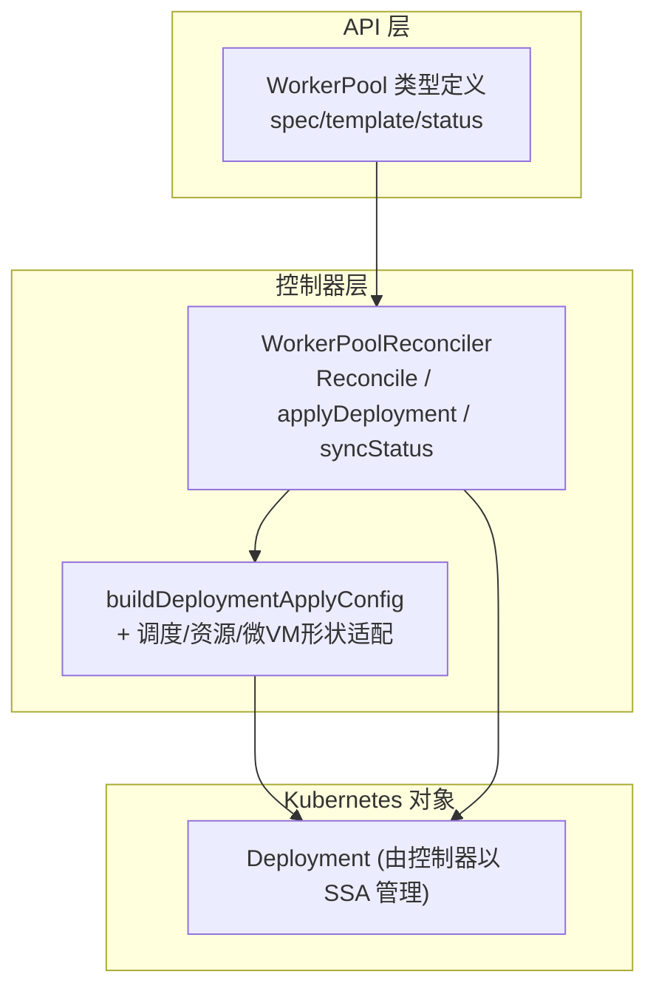
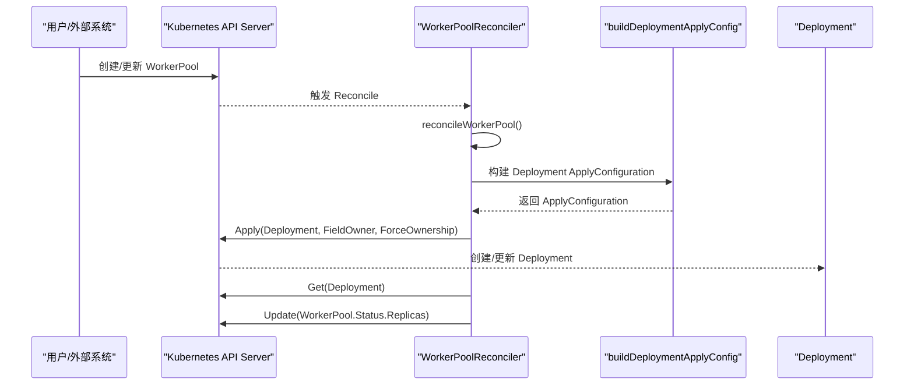
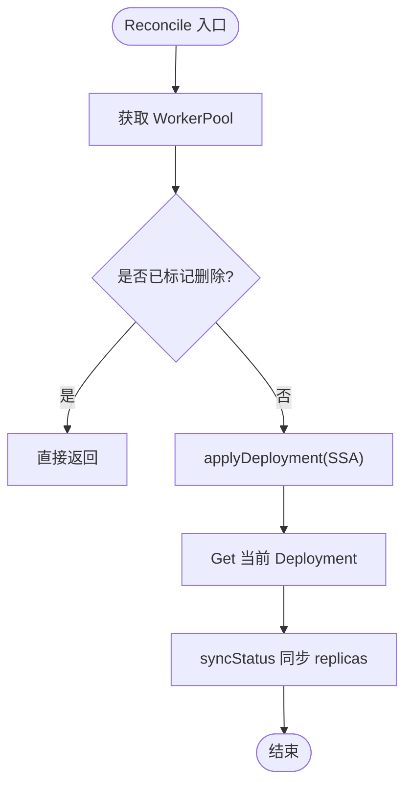
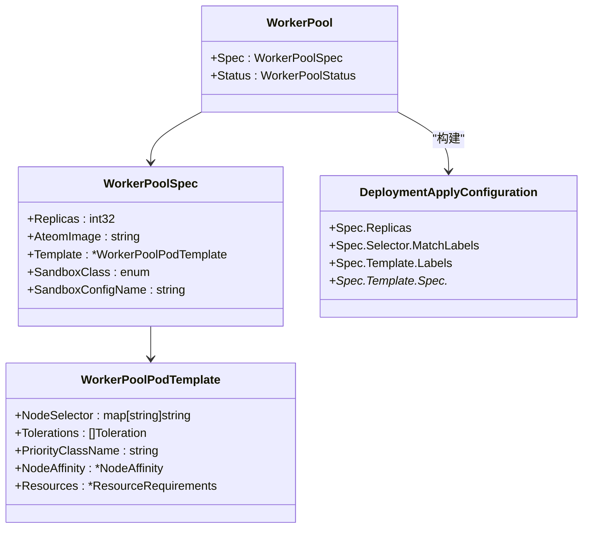
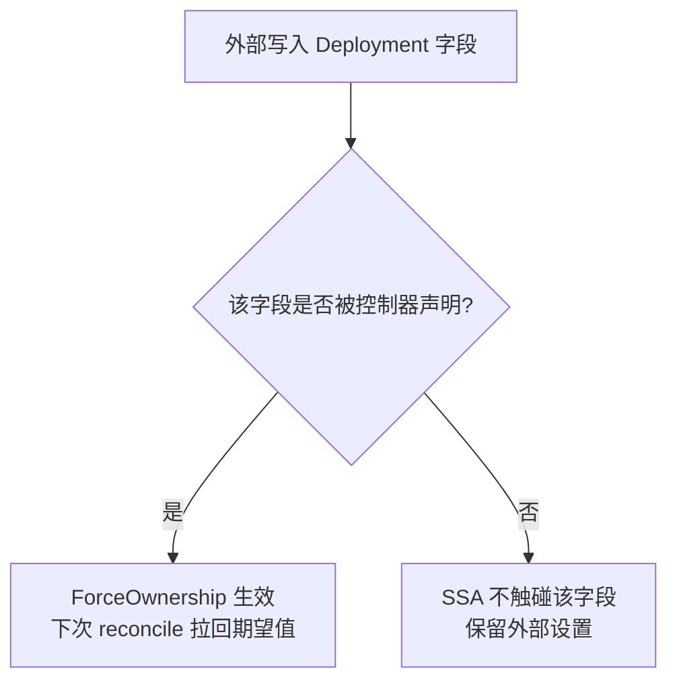
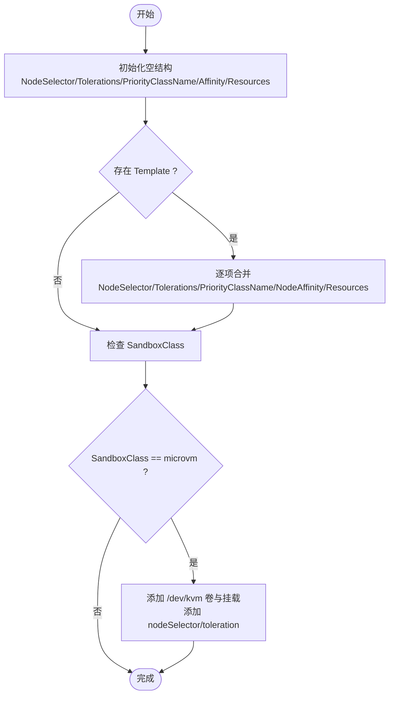
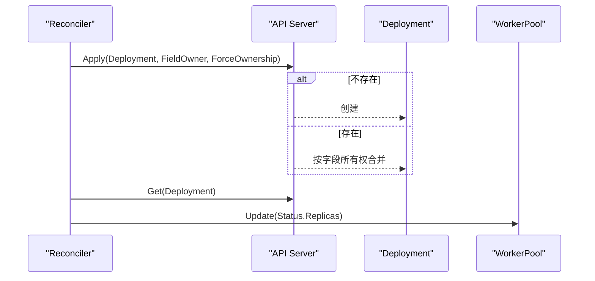
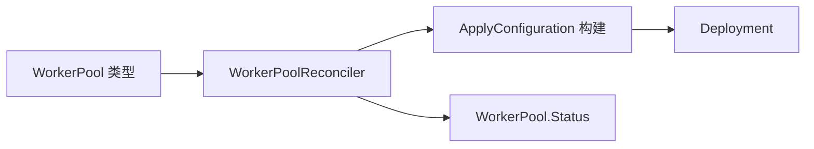

# Deployment管理

<cite>
**本文引用的文件**
- [workerpool_controller.go](file://cmd/atecontroller/internal/controllers/workerpool_controller.go)
- [workerpool_apply.go](file://cmd/atecontroller/internal/controllers/workerpool_apply.go)
- [workerpool_types.go](file://pkg/api/v1alpha1/workerpool_types.go)
- [workerpool_controller_test.go](file://cmd/atecontroller/internal/controllers/workerpool_controller_test.go)
- [workerpool_apply_test.go](file://cmd/atecontroller/internal/controllers/workerpool_apply_test.go)
</cite>

## 目录
1. [简介](#简介)
2. [项目结构](#项目结构)
3. [核心组件](#核心组件)
4. [架构总览](#架构总览)
5. [详细组件分析](#详细组件分析)
6. [依赖关系分析](#依赖关系分析)
7. [性能与一致性考量](#性能与一致性考量)
8. [故障排查指南](#故障排查指南)
9. [结论](#结论)
10. [附录：配置示例与最佳实践](#附录配置示例与最佳实践)

## 简介
本文件聚焦于 WorkerPool 到 Kubernetes Deployment 的转换与管理逻辑，重点解析 buildDeploymentApplyConfig 函数的实现细节（Pod 模板生成、资源配置、标签选择器），以及控制器如何使用 Server-Side Apply（SSA）进行字段所有权管理与强制覆盖策略。同时阐述 Deployment 的创建、更新、删除流程以及与 WorkerPool 状态的同步机制，并提供配置示例与最佳实践建议。

## 项目结构
与 WorkerPool 到 Deployment 的管理相关的关键代码位于控制器包与 API 类型定义中：
- API 类型定义：WorkerPool、WorkerPoolSpec、WorkerPoolStatus、WorkerPoolPodTemplate
- 控制器主循环与 SSA 应用逻辑
- 构建 Deployment ApplyConfiguration 的实现与辅助函数
- 单元测试覆盖关键路径与边界行为

图表来源
- [workerpool_controller.go:35-121](file://cmd/atecontroller/internal/controllers/workerpool_controller.go#L35-L121)
- [workerpool_apply.go:27-83](file://cmd/atecontroller/internal/controllers/workerpool_apply.go#L27-L83)
- [workerpool_types.go:22-96](file://pkg/api/v1alpha1/workerpool_types.go#L22-L96)

章节来源
- [workerpool_controller.go:35-121](file://cmd/atecontroller/internal/controllers/workerpool_controller.go#L35-L121)
- [workerpool_types.go:22-96](file://pkg/api/v1alpha1/workerpool_types.go#L22-L96)

## 核心组件
- WorkerPoolReconciler：负责监听 WorkerPool 变更，调用 applyDeployment 使用 SSA 声明式地创建或更新 Deployment，并同步状态。
- buildDeploymentApplyConfig：将 WorkerPool.Spec 转换为 Deployment 的 ApplyConfiguration，包含容器、卷、安全上下文、环境变量、调度与资源等。
- maybeApplyMicroVMPodShape：当 SandboxClass 为 microvm 时，注入 /dev/kvm 设备挂载及节点亲和约束。
- applyWorkerPoolPodTemplate：将用户可配置的 Pod 模板（NodeSelector、Tolerations、PriorityClassName、NodeAffinity、Resources）合并到 PodSpec。

章节来源
- [workerpool_controller.go:47-112](file://cmd/atecontroller/internal/controllers/workerpool_controller.go#L47-L112)
- [workerpool_apply.go:27-166](file://cmd/atecontroller/internal/controllers/workerpool_apply.go#L27-L166)
- [workerpool_types.go:22-96](file://pkg/api/v1alpha1/workerpool_types.go#L22-L96)

## 架构总览
控制器通过 controller-runtime 注册对 WorkerPool 的 For 与 Owns 事件，形成“声明式期望状态”驱动的实际状态收敛。

图表来源
- [workerpool_controller.go:47-112](file://cmd/atecontroller/internal/controllers/workerpool_controller.go#L47-L112)
- [workerpool_apply.go:27-83](file://cmd/atecontroller/internal/controllers/workerpool_apply.go#L27-L83)

## 详细组件分析

### WorkerPoolReconciler 控制流
- Reconcile：获取 WorkerPool，处理删除时间戳，进入 reconcileWorkerPool。
- reconcileWorkerPool：先 applyDeployment，再读取当前 Deployment，最后同步 status.replicas。
- applyDeployment：调用 buildDeploymentApplyConfig 生成 ApplyConfiguration，并以 client.FieldOwner + client.ForceOwnership 执行 Apply。
- syncStatus：比较期望与实际 status，仅当变化时更新 WorkerPool.Status.Replicas。

图表来源
- [workerpool_controller.go:47-112](file://cmd/atecontroller/internal/controllers/workerpool_controller.go#L47-L112)

章节来源
- [workerpool_controller.go:47-112](file://cmd/atecontroller/internal/controllers/workerpool_controller.go#L47-L112)

### buildDeploymentApplyConfig 实现要点
- 容器与卷
  - 容器名称固定为 ateom，镜像来自 spec.ateomImage，参数传入 --pod-uid=$(POD_UID)，并通过 fieldRef 注入 POD_UID 环境变量。
  - 容器与安全上下文：容器级别 privileged=true，runAsUser/runAsGroup=0；Pod 级别 runAsUser/runAsGroup=0。
  - 卷：HostPath 卷 run-ateom，挂载至 ateompath.BasePath，类型为 DirectoryOrCreate。
- 标签与选择器
  - Deployment.Spec.Selector.MatchLabels 与 PodTemplate.Labels 均设置 ate.dev/worker-pool=<WorkerPool.Name>。
- 所有者引用
  - OwnerReferences 指向 WorkerPool，并设置 controller=true、blockOwnerDeletion=true。
- 副本数
  - Spec.Replicas 直接取自 WorkerPool.Spec.Replicas。
- 调度与资源
  - 通过 applyWorkerPoolPodTemplate 合并 NodeSelector、Tolerations、PriorityClassName、NodeAffinity、Resources。
  - 若 SandboxClass=microvm，通过 maybeApplyMicroVMPodShape 追加 /dev/kvm 设备挂载与节点亲和/污点容忍。

图表来源
- [workerpool_types.go:22-96](file://pkg/api/v1alpha1/workerpool_types.go#L22-L96)
- [workerpool_apply.go:27-83](file://cmd/atecontroller/internal/controllers/workerpool_apply.go#L27-L83)

章节来源
- [workerpool_apply.go:27-83](file://cmd/atecontroller/internal/controllers/workerpool_apply.go#L27-L83)
- [workerpool_types.go:22-96](file://pkg/api/v1alpha1/workerpool_types.go#L22-L96)

### 字段所有权与强制覆盖策略（SSA）
- 字段所有权
  - 控制器以 FieldOwner="workerpool-controller" 声明其拥有的字段集合（即 ApplyConfiguration 中显式设置的字段）。
- 强制覆盖
  - 使用 ForceOwnership：当外部修改了控制器拥有字段时，下一次 reconcile 会将其拉回期望值。
- 非拥有字段保留
  - 未被控制器声明的字段（例如 revisionHistoryLimit）不会被覆盖，保持其他管理器设置的值。

图表来源
- [workerpool_controller.go:92-98](file://cmd/atecontroller/internal/controllers/workerpool_controller.go#L92-L98)
- [workerpool_controller_test.go:208-269](file://cmd/atecontroller/internal/controllers/workerpool_controller_test.go#L208-L269)

章节来源
- [workerpool_controller.go:92-98](file://cmd/atecontroller/internal/controllers/workerpool_controller.go#L92-L98)
- [workerpool_controller_test.go:208-269](file://cmd/atecontroller/internal/controllers/workerpool_controller_test.go#L208-L269)

### Pod 模板生成与调度/资源映射
- 默认清空与合并策略
  - 在应用模板前，先将 NodeSelector/Tolerations/PriorityClassName/Affinity/Resources 初始化为空结构，确保“清除”语义生效。
- 逐项映射
  - NodeSelector：直接覆盖。
  - Tolerations：完整映射，支持 TolerationSeconds。
  - PriorityClassName：字符串直传。
  - NodeAffinity：RequiredDuringSchedulingIgnoredDuringExecution 与 PreferredDuringSchedulingIgnoredDuringExecution 均支持。
  - Resources：Requests/Limits 分别映射到容器资源要求。
- 微 VM 形状增强
  - 当 SandboxClass=microvm 时，追加 HostPath 卷 dev-kvm（/dev/kvm，CharDevice）、容器挂载 /dev/kvm，并在 NodeSelector 与 Tolerations 上增加 ate.dev/sandboxClass=microvm 的亲和与容忍。

图表来源
- [workerpool_apply.go:132-166](file://cmd/atecontroller/internal/controllers/workerpool_apply.go#L132-L166)
- [workerpool_apply.go:94-130](file://cmd/atecontroller/internal/controllers/workerpool_apply.go#L94-L130)

章节来源
- [workerpool_apply.go:132-166](file://cmd/atecontroller/internal/controllers/workerpool_apply.go#L132-L166)
- [workerpool_apply.go:94-130](file://cmd/atecontroller/internal/controllers/workerpool_apply.go#L94-L130)

### Deployment 的创建、更新、删除与状态同步
- 创建/更新
  - 每次 reconcile 都会以 SSA 方式 apply Deployment，不存在则创建，存在则按字段所有权合并。
- 删除
  - 当 WorkerPool 被删除（DeletionTimestamp 非空），控制器直接返回，不做额外清理；由于设置了 OwnerReferences 且 blockOwnerDeletion=true，Kubernetes 会在合适时机级联删除 Deployment。
- 状态同步
  - 读取当前 Deployment.Status.Replicas，若与 WorkerPool.Status.Replicas 不同则更新。

图表来源
- [workerpool_controller.go:73-112](file://cmd/atecontroller/internal/controllers/workerpool_controller.go#L73-L112)

章节来源
- [workerpool_controller.go:73-112](file://cmd/atecontroller/internal/controllers/workerpool_controller.go#L73-L112)

## 依赖关系分析
- 控制器依赖
  - k8s.io/api/apps/v1.Deployment
  - k8s.io/client-go/applyconfigurations/apps/v1.DeploymentApplyConfiguration
  - k8s.io/client-go/applyconfigurations/core/v1.PodSpecApplyConfiguration 等
  - 内部 ateompath 常量用于宿主机路径
- 类型依赖
  - WorkerPool 类型定义提供 Replicas、AteomImage、Template、SandboxClass 等字段

图表来源
- [workerpool_controller.go:17-31](file://cmd/atecontroller/internal/controllers/workerpool_controller.go#L17-31)
- [workerpool_apply.go:17-25](file://cmd/atecontroller/internal/controllers/workerpool_apply.go#L17-25)
- [workerpool_types.go:17-21](file://pkg/api/v1alpha1/workerpool_types.go#L17-21)

章节来源
- [workerpool_controller.go:17-31](file://cmd/atecontroller/internal/controllers/workerpool_controller.go#L17-31)
- [workerpool_apply.go:17-25](file://cmd/atecontroller/internal/controllers/workerpool_apply.go#L17-25)
- [workerpool_types.go:17-21](file://pkg/api/v1alpha1/workerpool_types.go#L17-21)

## 性能与一致性考量
- SSA 的优势
  - 多管理器协作：未声明字段不被覆盖，避免冲突。
  - 幂等性：重复 apply 不会产生多余变更。
- ForceOwnership 的影响
  - 保证控制器对声明字段的最终一致性，但可能覆盖外部对受管字段的修改。
- 状态同步
  - 仅在差异存在时更新 WorkerPool.Status，减少不必要的写放大。

[本节为通用指导，无需具体文件引用]

## 故障排查指南
- 现象：外部修改了受管字段（如 replicas）后很快被拉回
  - 原因：ForceOwnership 导致控制器在下一次 reconcile 时恢复期望值。
  - 参考用例：测试覆盖了受管字段被外部篡改后的自动恢复行为。
- 现象：外部设置的非受管字段（如 revisionHistoryLimit）丢失
  - 原因：未在 ApplyConfiguration 中声明该字段，不会由控制器维护；若需要保留，请确保外部管理器也使用 SSA 并正确声明字段所有权。
- 现象：Pod 模板字段未生效或被意外清除
  - 排查：确认 WorkerPool.Spec.Template 对应字段是否正确设置；注意“清空”语义（如将 NodeSelector 置为 nil 会移除已有值）。
- 现象：microvm 类池无法调度
  - 排查：确认节点具备 /dev/kvm 且带有 ate.dev/sandboxClass=microvm 标签与相应污点容忍。

章节来源
- [workerpool_controller_test.go:208-269](file://cmd/atecontroller/internal/controllers/workerpool_controller_test.go#L208-L269)
- [workerpool_controller_test.go:433-463](file://cmd/atecontroller/internal/controllers/workerpool_controller_test.go#L433-L463)
- [workerpool_apply_test.go:212-262](file://cmd/atecontroller/internal/controllers/workerpool_apply_test.go#L212-L262)

## 结论
本方案通过 SSA 与字段所有权管理，实现了 WorkerPool 到 Deployment 的声明式、幂等、可协作的状态收敛。buildDeploymentApplyConfig 将用户意图清晰映射到 Deployment 的 Pod 模板与调度/资源属性，并在 microvm 场景下自动注入必要的设备与节点亲和。配合 ForceOwnership，控制器能稳定维持受管字段的期望值，同时尊重非受管字段的外部管理。

[本节为总结，无需具体文件引用]

## 附录：配置示例与最佳实践

- 最小可用示例（gvisor 默认沙箱）
  - 指定 replicas 与 ateomImage，其余使用默认值。
  - 参考：测试构造器与预期 ApplyConfiguration 的默认分支。
- 自定义调度与资源
  - 在 template.nodeSelector、template.tolerations、template.priorityClassName、template.nodeAffinity、template.resources 中按需配置。
  - 参考：组合调度字段与资源的单测用例。
- 清空模板字段
  - 将 template.nodeSelector 置为 nil 或移除整个 template，控制器会清除对应的受管字段。
  - 参考：模板清空与全量清空的单测用例。
- microvm 沙箱
  - 设置 sandboxClass=microvm，控制器会自动注入 /dev/kvm 设备与节点亲和/容忍。
  - 参考：microvm pod shape 的单测用例。
- 最佳实践
  - 明确区分“受管字段”和“非受管字段”，对外部管理的字段使用独立的 FieldOwner。
  - 谨慎使用 ForceOwnership，确保只有控制器应主导的字段被强制覆盖。
  - 利用 WorkerPool.Status.Replicas 监控实际运行副本数，结合 HPA 或其他编排工具做弹性伸缩。

章节来源
- [workerpool_apply_test.go:65-210](file://cmd/atecontroller/internal/controllers/workerpool_apply_test.go#L65-L210)
- [workerpool_controller_test.go:327-512](file://cmd/atecontroller/internal/controllers/workerpool_controller_test.go#L327-L512)
- [workerpool_apply_test.go:212-262](file://cmd/atecontroller/internal/controllers/workerpool_apply_test.go#L212-L262)
