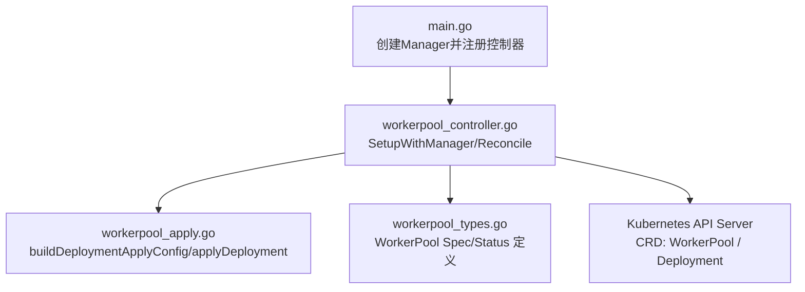
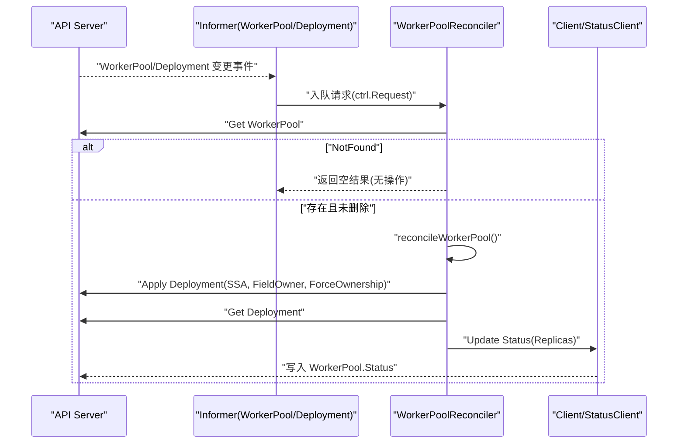
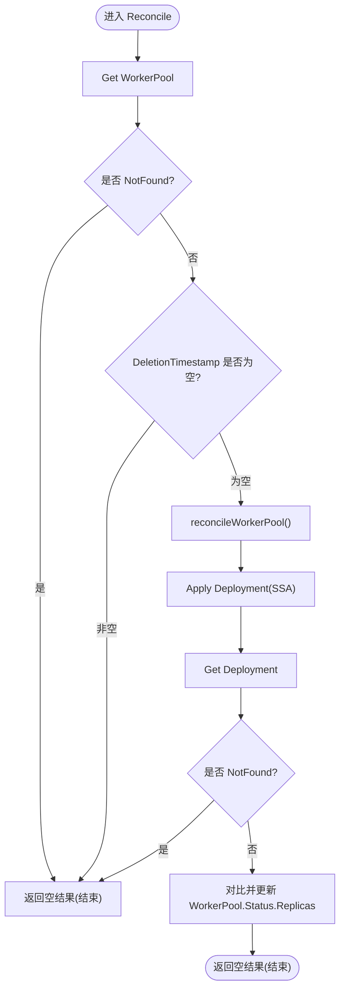
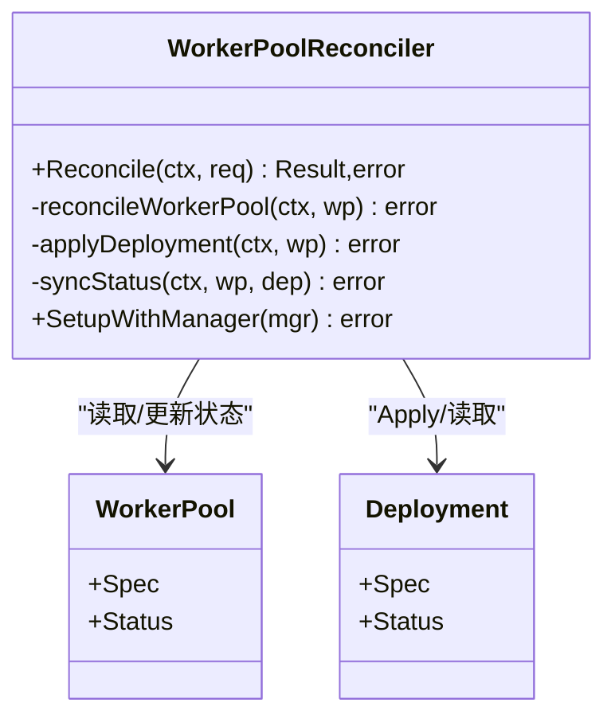

# Reconcile循环机制

<cite>
**本文引用的文件**   
- [workerpool_controller.go](file://cmd/atecontroller/internal/controllers/workerpool_controller.go)
- [workerpool_apply.go](file://cmd/atecontroller/internal/controllers/workerpool_apply.go)
- [workerpool_types.go](file://pkg/api/v1alpha1/workerpool_types.go)
- [main.go](file://cmd/atecontroller/main.go)
</cite>

## 目录
1. [简介](#简介)
2. [项目结构](#项目结构)
3. [核心组件](#核心组件)
4. [架构总览](#架构总览)
5. [详细组件分析](#详细组件分析)
6. [依赖关系分析](#依赖关系分析)
7. [性能与幂等性](#性能与幂等性)
8. [故障排查指南](#故障排查指南)
9. [结论](#结论)

## 简介
本文件聚焦于 WorkerPool 控制器的 Reconcile 循环实现机制，系统性阐述以下要点：
- Reconcile 方法的工作流程：资源获取、删除时间戳检查、错误处理策略。
- 控制器如何监听 WorkerPool 资源变化事件，以及如何处理 NotFound 错误和异常情况。
- Reconcile 循环的触发条件、执行频率与幂等性保证机制。
- 结合源码路径给出关键实现位置与示例说明（不直接粘贴代码）。

## 项目结构
WorkerPool 控制器位于 atecontroller 子命令中，核心逻辑由控制器定义、应用配置构建与类型定义三部分组成：
- 控制器入口与 Reconcile 主循环：[workerpool_controller.go](file://cmd/atecontroller/internal/controllers/workerpool_controller.go)
- Deployment 的 SSA Apply 配置构建与沙箱形状适配：[workerpool_apply.go](file://cmd/atecontroller/internal/controllers/workerpool_apply.go)
- WorkerPool CRD 类型定义（Spec/Status）：[workerpool_types.go](file://pkg/api/v1alpha1/workerpool_types.go)
- 控制器注册与 Manager 启动：[main.go](file://cmd/atecontroller/main.go)

图表来源
- [main.go:82-96](file://cmd/atecontroller/main.go#L82-L96)
- [workerpool_controller.go:115-120](file://cmd/atecontroller/internal/controllers/workerpool_controller.go#L115-L120)
- [workerpool_controller.go:47-71](file://cmd/atecontroller/internal/controllers/workerpool_controller.go#L47-L71)
- [workerpool_apply.go:27-83](file://cmd/atecontroller/internal/controllers/workerpool_apply.go#L27-L83)
- [workerpool_types.go:54-96](file://pkg/api/v1alpha1/workerpool_types.go#L54-L96)

章节来源
- [main.go:82-96](file://cmd/atecontroller/main.go#L82-L96)
- [workerpool_controller.go:115-120](file://cmd/atecontroller/internal/controllers/workerpool_controller.go#L115-L120)

## 核心组件
- WorkerPoolReconciler：实现 controller-runtime 的 Reconcile 接口，负责读取 WorkerPool、处理删除、调用 reconcileWorkerPool 完成状态收敛。
- applyDeployment：基于 WorkerPool 生成 Deployment 的 SSA Apply 配置，使用 FieldOwner 与 ForceOwnership 确保控制器对受管字段拥有权。
- syncStatus：将 Deployment 的实际副本数同步回 WorkerPool.Status.Replicas。
- SetupWithManager：声明 For(WorkerPool) 与 Owns(Deployment)，使控制器同时监听两类资源的事件。

章节来源
- [workerpool_controller.go:35-71](file://cmd/atecontroller/internal/controllers/workerpool_controller.go#L35-L71)
- [workerpool_controller.go:73-112](file://cmd/atecontroller/internal/controllers/workerpool_controller.go#L73-L112)
- [workerpool_apply.go:27-83](file://cmd/atecontroller/internal/controllers/workerpool_apply.go#L27-L83)

## 架构总览
下图展示了 WorkerPool 控制器在 Kubernetes 中的整体交互：控制器通过 Informer 监听 WorkerPool 与 Deployment 的变化，Reconcile 循环根据期望状态（spec.replicas、镜像、调度模板等）驱动 Deployment 的 SSA Apply，并将实际副本数写回 WorkerPool 状态。

图表来源
- [workerpool_controller.go:115-120](file://cmd/atecontroller/internal/controllers/workerpool_controller.go#L115-L120)
- [workerpool_controller.go:47-71](file://cmd/atecontroller/internal/controllers/workerpool_controller.go#L47-L71)
- [workerpool_controller.go:73-112](file://cmd/atecontroller/internal/controllers/workerpool_controller.go#L73-L112)
- [workerpool_apply.go:92-98](file://cmd/atecontroller/internal/controllers/workerpool_apply.go#L92-L98)

## 详细组件分析

### Reconcile 主循环工作流程
- 获取资源：从请求中解析 NamespacedName，调用 Get 获取 WorkerPool。若返回 NotFound，则直接返回空结果；其他错误则包装后返回，交由队列重试。
- 删除时间戳检查：若对象已设置 DeletionTimestamp，表示正在被删除，直接返回空结果，不做进一步处理（当前实现未包含 Finalizer 清理逻辑）。
- 业务收敛：调用 reconcileWorkerPool，内部会：
  - 构建并 Apply Deployment（SSA），使用 FieldOwner 与 ForceOwnership 确保控制器对受管字段拥有权。
  - 再次 Get Deployment，若 NotFound 则忽略（等待后续事件或下次 Reconcile）。
  - 同步状态：比较期望与实际 Replicas，若不同则更新 WorkerPool.Status。

图表来源
- [workerpool_controller.go:47-71](file://cmd/atecontroller/internal/controllers/workerpool_controller.go#L47-L71)
- [workerpool_controller.go:73-90](file://cmd/atecontroller/internal/controllers/workerpool_controller.go#L73-L90)
- [workerpool_controller.go:92-112](file://cmd/atecontroller/internal/controllers/workerpool_controller.go#L92-L112)

章节来源
- [workerpool_controller.go:47-71](file://cmd/atecontroller/internal/controllers/workerpool_controller.go#L47-L71)
- [workerpool_controller.go:73-112](file://cmd/atecontroller/internal/controllers/workerpool_controller.go#L73-L112)

### 事件监听与触发条件
- 监听范围：
  - For(&WorkerPool{})：当 WorkerPool 增删改时触发 Reconcile。
  - Owns(&Deployment{})：当该控制器拥有的 Deployment 发生变化时，也会触发对应 WorkerPool 的 Reconcile。
- 触发时机：
  - 首次启动时，Informer 会全量同步一次，所有现有 WorkerPool 都会入队。
  - 任何 spec/status 变更、所属 Deployment 的状态变更（如副本数变化）都会触发 Reconcile。
- 执行频率：
  - 由 controller-runtime 默认队列与重入退避策略决定；每次 Reconcile 返回空结果后，下一次触发取决于事件或默认 resync。
  - 本实现未显式设置 requeue/requeueAfter，因此主要依赖事件驱动与默认 resync。

章节来源
- [workerpool_controller.go:115-120](file://cmd/atecontroller/internal/controllers/workerpool_controller.go#L115-L120)
- [main.go:90-96](file://cmd/atecontroller/main.go#L90-L96)

### 错误处理策略
- NotFound 处理：
  - 获取 WorkerPool 时若 NotFound，立即返回空结果，避免不必要的重试。
  - 获取 Deployment 时若 NotFound，视为“尚未就绪”，本次跳过状态同步，等待后续事件。
- 其他错误：
  - 获取 WorkerPool 失败（非 NotFound）、Apply Deployment 失败、更新 Status 失败等，均返回 error，交由队列按退避策略重试。
- 幂等性保障：
  - 使用 SSA Apply + FieldOwner + ForceOwnership，确保控制器对受管字段拥有权，外部修改会被覆盖回期望值。
  - 状态更新前进行语义相等比较，仅在差异存在时才写入，减少不必要更新。

章节来源
- [workerpool_controller.go:52-57](file://cmd/atecontroller/internal/controllers/workerpool_controller.go#L52-L57)
- [workerpool_controller.go:82-87](file://cmd/atecontroller/internal/controllers/workerpool_controller.go#L82-L87)
- [workerpool_controller.go:92-98](file://cmd/atecontroller/internal/controllers/workerpool_controller.go#L92-L98)
- [workerpool_controller.go:100-112](file://cmd/atecontroller/internal/controllers/workerpool_controller.go#L100-L112)
- [workerpool_apply.go:92-98](file://cmd/atecontroller/internal/controllers/workerpool_apply.go#L92-L98)

### 删除时间戳检查与最终一致性
- 当前实现检测到 DeletionTimestamp 非空即直接返回，不进行额外清理。
- 这意味着如果未来需要扩展清理逻辑（例如释放外部资源），应引入 Finalizer 并在删除阶段执行清理后再移除 Finalizer。

章节来源
- [workerpool_controller.go:60-63](file://cmd/atecontroller/internal/controllers/workerpool_controller.go#L60-L63)

### 状态同步与幂等性细节
- 期望状态：WorkerPool.Spec.Replicas 与镜像、调度模板等。
- 观测状态：WorkerPool.Status.Replicas 来自 Deployment.Status.Replicas。
- 幂等性：
  - 使用 equality.Semantic.DeepEqual 比较前后状态，仅在不一致时更新。
  - 通过 SSA 的 FieldOwner 与 ForceOwnership 确保控制器对受管字段拥有权，防止外部漂移。

章节来源
- [workerpool_controller.go:100-112](file://cmd/atecontroller/internal/controllers/workerpool_controller.go#L100-L112)
- [workerpool_apply.go:27-83](file://cmd/atecontroller/internal/controllers/workerpool_apply.go#L27-L83)

## 依赖关系分析
- 控制器与资源：
  - 控制器依赖 WorkerPool CRD 与 Deployment 资源。
  - 通过 client-go 的 ApplyConfiguration 构建 SSA 配置。
- 控制器与 Manager：
  - 在 main 中创建 Manager，注册 WorkerPoolReconciler，并启动。

图表来源
- [workerpool_controller.go:35-112](file://cmd/atecontroller/internal/controllers/workerpool_controller.go#L35-L112)
- [workerpool_types.go:54-96](file://pkg/api/v1alpha1/workerpool_types.go#L54-L96)

章节来源
- [workerpool_controller.go:35-112](file://cmd/atecontroller/internal/controllers/workerpool_controller.go#L35-L112)
- [workerpool_types.go:54-96](file://pkg/api/v1alpha1/workerpool_types.go#L54-L96)

## 性能与幂等性
- 事件驱动为主：通过 For/Owns 精准订阅相关资源变更，避免轮询开销。
- SSA 与 FieldOwner：
  - 使用 SSA 可安全合并受管字段，减少冲突与重复更新。
  - ForceOwnership 确保控制器对受管字段拥有权，快速纠正外部漂移。
- 状态比较：
  - 在更新 Status 前进行深度比较，避免无意义写入，降低 API Server 压力。
- 重试与退避：
  - 非 NotFound 错误返回 error，controller-runtime 会按退避策略自动重试，提升鲁棒性。

章节来源
- [workerpool_controller.go:92-112](file://cmd/atecontroller/internal/controllers/workerpool_controller.go#L92-L112)
- [workerpool_apply.go:92-98](file://cmd/atecontroller/internal/controllers/workerpool_apply.go#L92-L98)

## 故障排查指南
- 现象：WorkerPool 创建后未生成 Deployment
  - 检查控制器日志中是否存在“failed to get worker pool”或“failed to apply Deployment”的错误信息。
  - 确认 RBAC 权限是否包含 WorkerPool 与 Deployment 的读写权限。
- 现象：Deployment 副本数异常
  - 观察 WorkerPool.Status.Replicas 是否与期望一致；若不一致，查看是否有外部修改导致漂移，控制器会通过 SSA 重新拉齐。
- 现象：删除 WorkerPool 后资源未清理
  - 当前实现未包含 Finalizer 清理逻辑，如需扩展，应在删除阶段添加清理步骤。

章节来源
- [workerpool_controller.go:52-57](file://cmd/atecontroller/internal/controllers/workerpool_controller.go#L52-L57)
- [workerpool_controller.go:92-98](file://cmd/atecontroller/internal/controllers/workerpool_controller.go#L92-L98)
- [workerpool_controller.go:60-63](file://cmd/atecontroller/internal/controllers/workerpool_controller.go#L60-L63)

## 结论
WorkerPool 控制器的 Reconcile 循环遵循标准的 controller-runtime 模式：以事件驱动为核心，通过 For/Owns 监听 WorkerPool 与其拥有的 Deployment 变化；在 Reconcile 中先做 NotFound 与删除时间戳的快速路径判断，再通过 SSA Apply 驱动 Deployment 达到期望状态，并以幂等方式同步状态到 WorkerPool.Status。该设计具备良好的可扩展性与鲁棒性，适合在生产环境中稳定运行。
