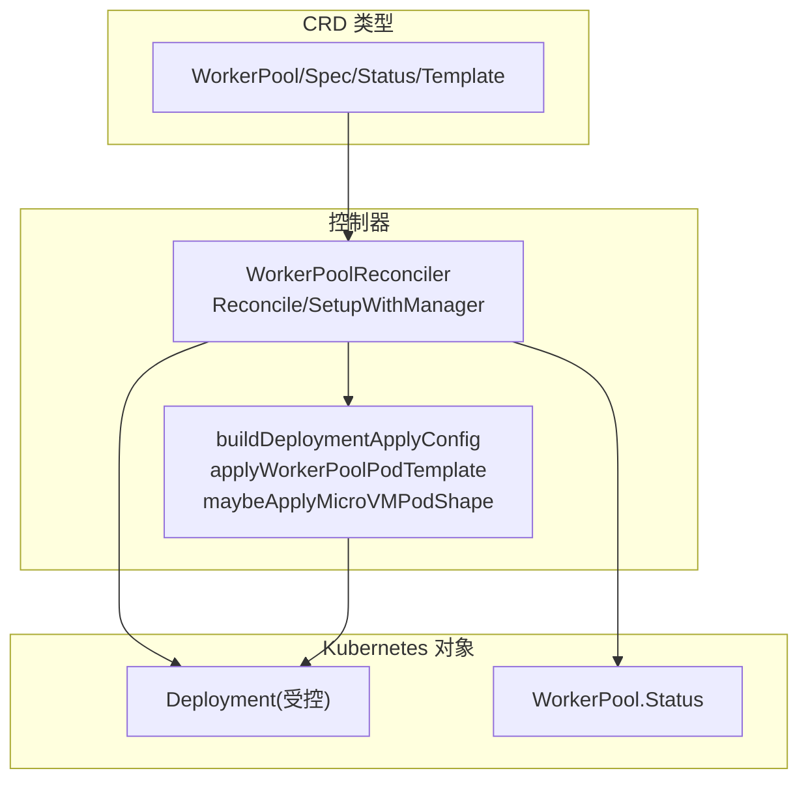
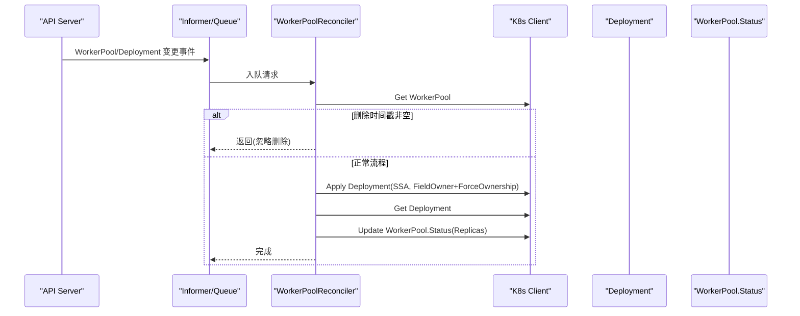
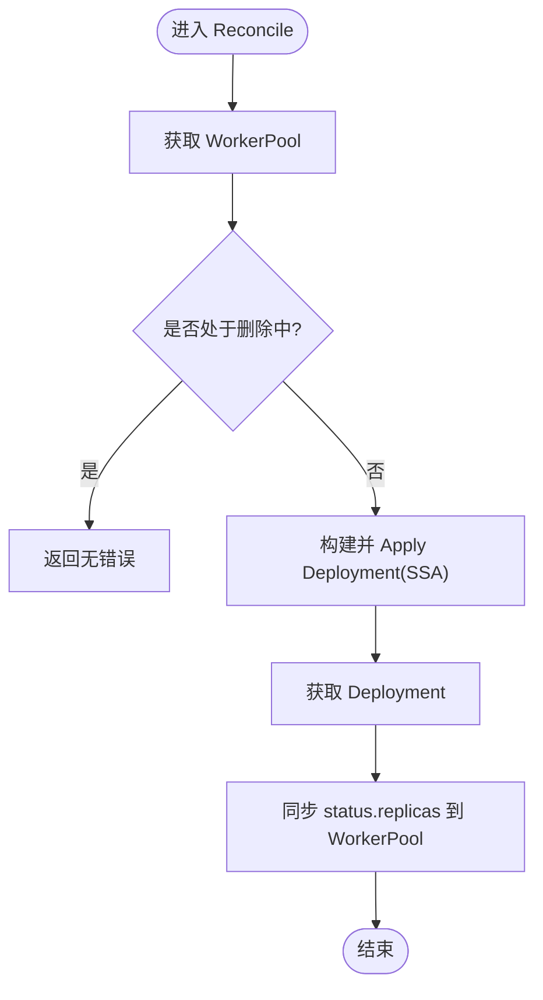
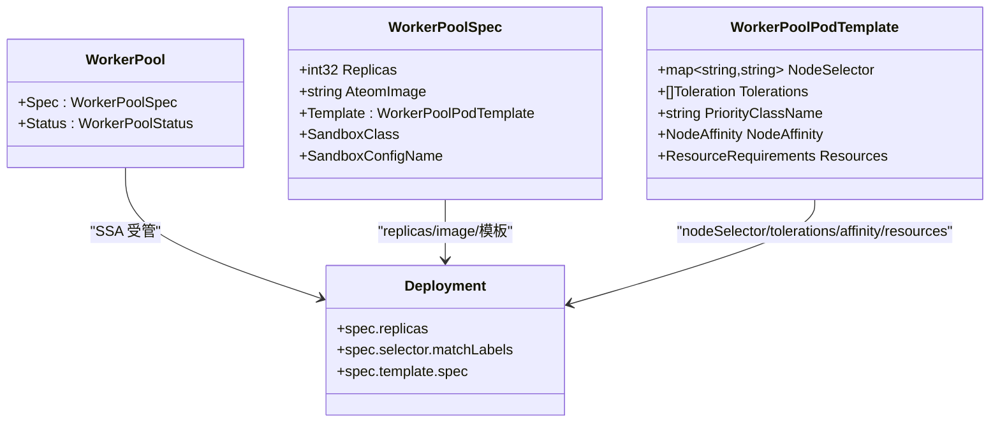
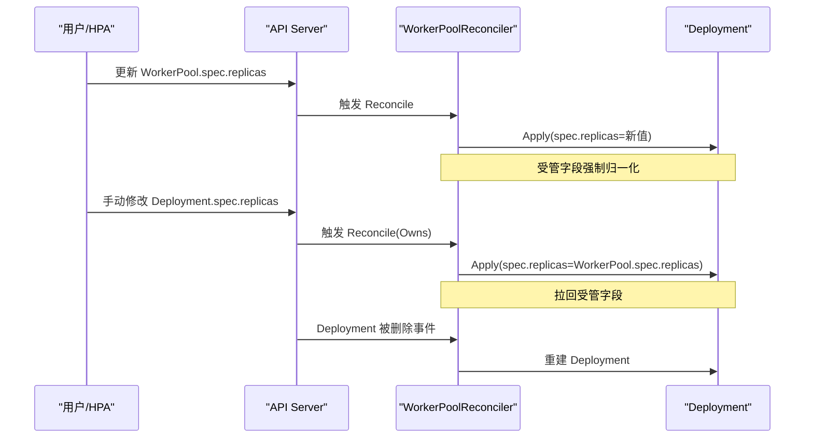
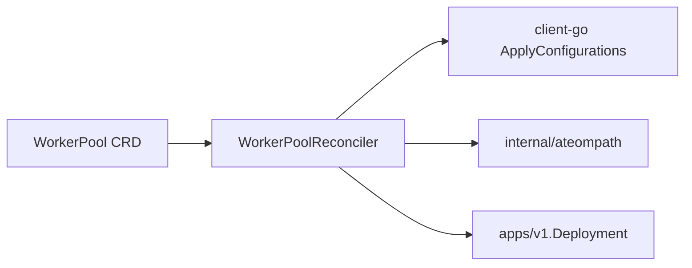

# WorkerPool控制器

<cite>
**本文引用的文件**   
- [workerpool_controller.go](file://cmd/atecontroller/internal/controllers/workerpool_controller.go)
- [workerpool_apply.go](file://cmd/atecontroller/internal/controllers/workerpool_apply.go)
- [workerpool_types.go](file://pkg/api/v1alpha1/workerpool_types.go)
- [workerpool_controller_test.go](file://cmd/atecontroller/internal/controllers/workerpool_controller_test.go)
- [workerpool_apply_test.go](file://cmd/atecontroller/internal/controllers/workerpool_apply_test.go)
</cite>

## 目录
1. [简介](#简介)
2. [项目结构](#项目结构)
3. [核心组件](#核心组件)
4. [架构总览](#架构总览)
5. [详细组件分析](#详细组件分析)
6. [依赖关系分析](#依赖关系分析)
7. [性能与扩缩容](#性能与扩缩容)
8. [故障排查指南](#故障排查指南)
9. [结论](#结论)
10. [附录：配置示例与最佳实践](#附录配置示例与最佳实践)

## 简介
本文件深入解析 WorkerPool 控制器的完整实现，围绕 Reconcile 循环、工作节点池生命周期管理（Pod 模板生成、副本数计算、资源分配）、调度策略（负载均衡、亲和性、污点容忍）、应用逻辑（Deployment 创建与更新、状态同步、故障恢复）展开。同时提供错误处理与重试机制说明、扩缩容策略与性能优化建议，并给出可操作的配置示例路径。

## 项目结构
WorkerPool 控制器位于 atecontroller 子模块中，包含以下关键文件：
- 控制器主循环与事件绑定：workerpool_controller.go
- Deployment 的 SSA Apply 配置构建与合并策略：workerpool_apply.go
- CRD 类型定义（Spec/Status/Template）：workerpool_types.go
- 端到端与单元测试覆盖：workerpool_controller_test.go、workerpool_apply_test.go

图表来源
- [workerpool_controller.go:35-121](file://cmd/atecontroller/internal/controllers/workerpool_controller.go#L35-L121)
- [workerpool_apply.go:27-83](file://cmd/atecontroller/internal/controllers/workerpool_apply.go#L27-L83)
- [workerpool_types.go:54-96](file://pkg/api/v1alpha1/workerpool_types.go#L54-L96)

章节来源
- [workerpool_controller.go:35-121](file://cmd/atecontroller/internal/controllers/workerpool_controller.go#L35-L121)
- [workerpool_apply.go:27-83](file://cmd/atecontroller/internal/controllers/workerpool_apply.go#L27-L83)
- [workerpool_types.go:54-96](file://pkg/api/v1alpha1/workerpool_types.go#L54-L96)

## 核心组件
- WorkerPoolReconciler：基于 controller-runtime 的 Reconcile 循环，负责监听 WorkerPool 及其拥有的 Deployment 事件，驱动期望态与实际态对齐。
- buildDeploymentApplyConfig：将 WorkerPool.Spec 转换为 Deployment 的 SSA Apply 配置，声明控制器“拥有”的字段，并通过 FieldOwner + ForceOwnership 确保字段所有权语义。
- applyWorkerPoolPodTemplate：将用户提供的 Pod 模板（NodeSelector/Tolerations/PriorityClassName/NodeAffinity/Resources）映射到 PodSpec。
- maybeApplyMicroVMPodShape：根据 SandboxClass 注入微虚拟机所需的设备挂载与节点选择/污点容忍规则。
- syncStatus：将 Deployment 的 status.replicas 回写到 WorkerPool.status.replicas。

章节来源
- [workerpool_controller.go:47-112](file://cmd/atecontroller/internal/controllers/workerpool_controller.go#L47-L112)
- [workerpool_apply.go:27-83](file://cmd/atecontroller/internal/controllers/workerpool_apply.go#L27-L83)
- [workerpool_apply.go:132-166](file://cmd/atecontroller/internal/controllers/workerpool_apply.go#L132-L166)
- [workerpool_apply.go:94-130](file://cmd/atecontroller/internal/controllers/workerpool_apply.go#L94-L130)

## 架构总览
WorkerPool 控制器通过 OwnerReference 与 Owns 建立对 Deployment 的所有权关系；使用 Server-Side Apply (SSA) 以字段级所有权方式声明式地维护 Deployment 的受管字段，避免覆盖其他管理器设置的字段。

图表来源
- [workerpool_controller.go:47-90](file://cmd/atecontroller/internal/controllers/workerpool_controller.go#L47-L90)
- [workerpool_controller.go:92-112](file://cmd/atecontroller/internal/controllers/workerpool_controller.go#L92-L112)
- [workerpool_controller.go:115-120](file://cmd/atecontroller/internal/controllers/workerpool_controller.go#L115-L120)
- [workerpool_apply.go:27-83](file://cmd/atecontroller/internal/controllers/workerpool_apply.go#L27-L83)

## 详细组件分析

### Reconcile 循环与工作节点池生命周期
- 事件触发：For(&WorkerPool{}) 监听 WorkerPool 增删改；Owns(&Deployment{}) 监听其拥有的 Deployment 变更。
- 删除处理：若 WorkerPool 存在 DeletionTimestamp，直接返回，不做清理（由 K8s GC 基于 OwnerReference 自动回收）。
- 期望态构建：调用 applyDeployment -> buildDeploymentApplyConfig 生成仅声明“受管字段”的 Apply 配置，并使用 FieldOwner + ForceOwnership 提交。
- 状态同步：读取当前 Deployment 的 status.replicas，写入 WorkerPool.status.replicas。

图表来源
- [workerpool_controller.go:47-90](file://cmd/atecontroller/internal/controllers/workerpool_controller.go#L47-L90)
- [workerpool_controller.go:92-112](file://cmd/atecontroller/internal/controllers/workerpool_controller.go#L92-L112)

章节来源
- [workerpool_controller.go:47-90](file://cmd/atecontroller/internal/controllers/workerpool_controller.go#L47-L90)
- [workerpool_controller.go:92-112](file://cmd/atecontroller/internal/controllers/workerpool_controller.go#L92-L112)
- [workerpool_controller.go:115-120](file://cmd/atecontroller/internal/controllers/workerpool_controller.go#L115-L120)

### Pod 模板生成与副本数计算
- 副本数：直接从 WorkerPool.spec.replicas 传入 Deployment.spec.replicas，由 Deployment 控制器负责实际 Pod 数量收敛。
- 容器与卷：
  - 容器名称固定为 ateom，镜像来自 spec.ateomImage，参数包含 --pod-uid=$(POD_UID)，并以环境变量注入 POD_UID。
  - 挂载宿主机目录 run-ateom 到容器内 ateompath.BasePath。
- 安全上下文：Pod 与 Container 均设置运行用户/组为 0，Container 启用特权模式。
- 模板映射：
  - NodeSelector、Tolerations、PriorityClassName、NodeAffinity、Resources 等按用户配置注入。
  - 当 spec.template 为空时，对应字段会被重置为默认值（空 map/空 slice/空字符串/空 Affinity/空 Resources），体现“受管字段清零”的语义。
- SandboxClass 影响：
  - gvisor：不额外注入设备或节点选择。
  - microvm：追加 /dev/kvm 设备挂载与 HostPath 卷，并在 NodeSelector 与 Tolerations 上叠加 ate.dev/sandboxClass=microvm 的规则，确保调度到具备嵌套虚拟化的节点。

图表来源
- [workerpool_types.go:54-96](file://pkg/api/v1alpha1/workerpool_types.go#L54-L96)
- [workerpool_types.go:24-52](file://pkg/api/v1alpha1/workerpool_types.go#L24-L52)
- [workerpool_apply.go:30-83](file://cmd/atecontroller/internal/controllers/workerpool_apply.go#L30-L83)

章节来源
- [workerpool_apply.go:30-83](file://cmd/atecontroller/internal/controllers/workerpool_apply.go#L30-L83)
- [workerpool_apply.go:132-166](file://cmd/atecontroller/internal/controllers/workerpool_apply.go#L132-L166)
- [workerpool_apply.go:94-130](file://cmd/atecontroller/internal/controllers/workerpool_apply.go#L94-L130)
- [workerpool_types.go:54-96](file://pkg/api/v1alpha1/workerpool_types.go#L54-L96)
- [workerpool_types.go:24-52](file://pkg/api/v1alpha1/workerpool_types.go#L24-L52)

### 调度算法与策略
- 节点选择与亲和性：
  - NodeSelector：精确匹配标签。
  - NodeAffinity：支持 RequiredDuringSchedulingIgnoredDuringExecution 与 PreferredDuringSchedulingIgnoredDuringExecution。
- 污点容忍：
  - 支持 Toleration 列表，包括 Key/Operator/Value/Effect/TolerationSeconds。
  - microvm 场景下会强制添加 ate.dev/sandboxClass=microvm 的 NoSchedule 容忍。
- 优先级：
  - 通过 PriorityClassName 指定调度优先级类。
- 资源约束：
  - Requests/Limits 限制 CPU/内存等资源，影响调度器放置决策。
- 负载均衡：
  - 未实现自定义均衡策略，依赖 Kubernetes 调度器默认行为。

章节来源
- [workerpool_apply.go:132-166](file://cmd/atecontroller/internal/controllers/workerpool_apply.go#L132-L166)
- [workerpool_apply.go:94-130](file://cmd/atecontroller/internal/controllers/workerpool_apply.go#L94-L130)
- [workerpool_types.go:24-52](file://pkg/api/v1alpha1/workerpool_types.go#L24-L52)

### 应用逻辑：创建、更新、状态同步与故障恢复
- 创建：首次创建 WorkerPool 后，控制器通过 SSA 创建对应的 Deployment，并设置 OwnerReference 与 BlockOwnerDeletion。
- 更新：任何 WorkerPool 字段变化都会触发重新 Apply，使 Deployment 的受管字段与期望一致。
- 外部修改保护：
  - 非受管字段（如 revisionHistoryLimit）不会被覆盖。
  - 受管字段被外部篡改时，下一次 Reconcile 会通过 ForceOwnership 拉回至期望值。
- 删除恢复：若 Deployment 被外部删除，控制器会在下一次事件后重建。
- 状态同步：每次 Reconcile 读取 Deployment.status.replicas 并写回 WorkerPool.status.replicas，供 HPA 或其他消费者观测。

图表来源
- [workerpool_controller.go:92-112](file://cmd/atecontroller/internal/controllers/workerpool_controller.go#L92-L112)
- [workerpool_controller_test.go:208-269](file://cmd/atecontroller/internal/controllers/workerpool_controller_test.go#L208-L269)
- [workerpool_controller_test.go:271-297](file://cmd/atecontroller/internal/controllers/workerpool_controller_test.go#L271-L297)

章节来源
- [workerpool_controller.go:92-112](file://cmd/atecontroller/internal/controllers/workerpool_controller.go#L92-L112)
- [workerpool_controller_test.go:208-269](file://cmd/atecontroller/internal/controllers/workerpool_controller_test.go#L208-L269)
- [workerpool_controller_test.go:271-297](file://cmd/atecontroller/internal/controllers/workerpool_controller_test.go#L271-L297)

## 依赖关系分析
- 控制器依赖：
  - client-go ApplyConfiguration 用于构建 SSA 配置。
  - internal/ateompath 提供宿主机共享目录常量。
  - pkg/api/v1alpha1 提供 WorkerPool CRD 类型。
- 运行时依赖：
  - controller-runtime Manager/Informer/Queue 驱动事件循环。
  - K8s Apps v1 Deployment 作为受控资源。

图表来源
- [workerpool_controller.go:17-31](file://cmd/atecontroller/internal/controllers/workerpool_controller.go#L17-31)
- [workerpool_apply.go:17-25](file://cmd/atecontroller/internal/controllers/workerpool_apply.go#L17-25)

章节来源
- [workerpool_controller.go:17-31](file://cmd/atecontroller/internal/controllers/workerpool_controller.go#L17-31)
- [workerpool_apply.go:17-25](file://cmd/atecontroller/internal/controllers/workerpool_apply.go#L17-25)

## 性能与扩缩容
- 扩缩容策略：
  - 直接调整 WorkerPool.spec.replicas，控制器通过 SSA 立即下发到 Deployment.spec.replicas，由 Deployment 控制器滚动更新。
  - 可通过 HPA 直接操作 WorkerPool 的 scale 子资源（由 CRD 注解启用），实现自动化弹性伸缩。
- 性能建议：
  - 合理设置副本数与资源 Requests/Limits，避免过度碎片化导致调度失败。
  - 使用 NodeSelector/NodeAffinity 精准定位节点池，减少无效调度尝试。
  - 在 microvm 场景下，确保目标节点具备 /dev/kvm 与相应 taint 容忍，避免反复驱逐。
  - 利用 SSA 的字段所有权语义，避免与其他管理器冲突导致的频繁重算。

[本节为通用指导，无需源码引用]

## 故障排查指南
- 常见错误与处理：
  - 获取 WorkerPool 失败：记录错误并返回，等待下次重试。
  - Apply Deployment 失败：包装错误并返回，控制器会在后续重试。
  - 获取 Deployment 失败：若非 NotFound，则返回错误；若 NotFound，跳过状态同步。
  - 更新 WorkerPool.Status 失败：返回错误，等待重试。
- 调试手段：
  - 查看控制器日志中的错误信息。
  - 检查 WorkerPool 与 Deployment 的事件与状态。
  - 验证节点标签/污点是否符合预期（尤其是 microvm 场景）。
- 测试用例参考：
  - 副本数/镜像/模板更新传播、SSA 保留非受管字段、受管字段回滚、删除重建、状态同步等。

章节来源
- [workerpool_controller.go:47-112](file://cmd/atecontroller/internal/controllers/workerpool_controller.go#L47-L112)
- [workerpool_controller_test.go:111-325](file://cmd/atecontroller/internal/controllers/workerpool_controller_test.go#L111-L325)

## 结论
WorkerPool 控制器采用简洁而稳健的设计：以 WorkerPool 为单一事实源，借助 SSA 的字段所有权语义声明式地管理 Deployment，保证受管字段的一致性与可恢复性；通过 WorkerPoolPodTemplate 暴露灵活的调度与资源配置能力，并结合 SandboxClass 适配不同沙箱运行时需求。配合完善的测试覆盖，该控制器在生产环境中具备良好的可维护性与可靠性。

[本节为总结，无需源码引用]

## 附录：配置示例与最佳实践
- 基础 WorkerPool 示例（最小可用）
  - 参考测试构造方法：makeWorkerPool
  - 路径：[workerpool_controller_test.go:559-567](file://cmd/atecontroller/internal/controllers/workerpool_controller_test.go#L559-L567)
- 带模板与资源的 WorkerPool 示例
  - 参考 sampleWorkerPoolPodTemplate
  - 路径：[workerpool_controller_test.go:327-360](file://cmd/atecontroller/internal/controllers/workerpool_controller_test.go#L327-L360)
- microvm 沙箱类示例
  - 参考 TestMicroVMPodShape 断言
  - 路径：[workerpool_apply_test.go:215-262](file://cmd/atecontroller/internal/controllers/workerpool_apply_test.go#L215-L262)
- 扩缩容与 HPA
  - 通过 HPA 直接操作 WorkerPool.scale（CRD 已启用 scale 子资源）
  - 参考类型注解位置：[workerpool_types.go:104](file://pkg/api/v1alpha1/workerpool_types.go#L104)
- 最佳实践
  - 明确设置 CPU/Memory 的 Requests/Limits，提升调度稳定性。
  - 使用 NodeSelector/NodeAffinity 将工作负载隔离到专用节点池。
  - 谨慎使用特权与宿主机挂载，仅在必要时启用。
  - 在 microvm 场景，确保节点具备 /dev/kvm 与 ate.dev/sandboxClass=microvm 标签/污点。

章节来源
- [workerpool_controller_test.go:327-360](file://cmd/atecontroller/internal/controllers/workerpool_controller_test.go#L327-L360)
- [workerpool_controller_test.go:559-567](file://cmd/atecontroller/internal/controllers/workerpool_controller_test.go#L559-L567)
- [workerpool_apply_test.go:215-262](file://cmd/atecontroller/internal/controllers/workerpool_apply_test.go#L215-L262)
- [workerpool_types.go:104](file://pkg/api/v1alpha1/workerpool_types.go#L104)
