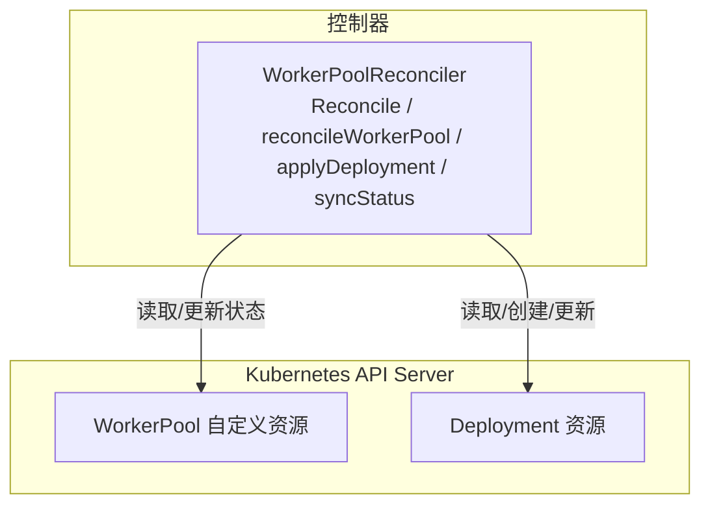
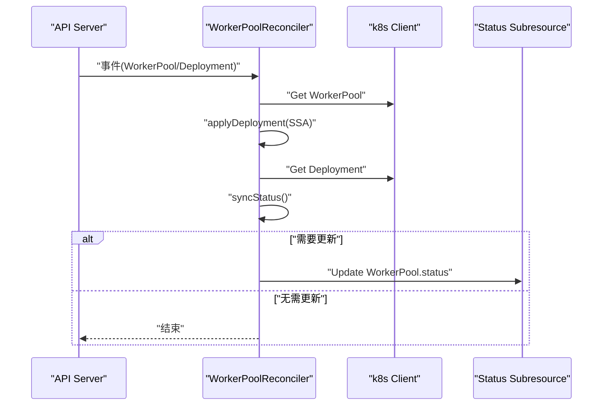
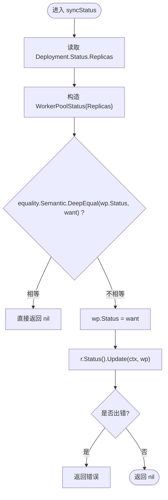
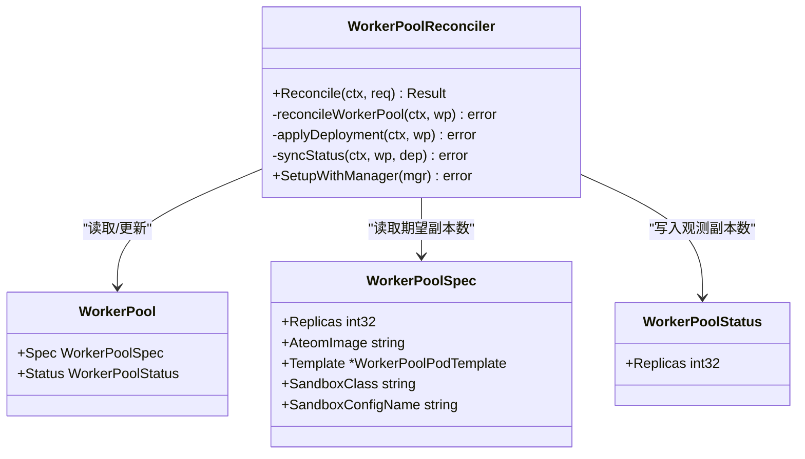
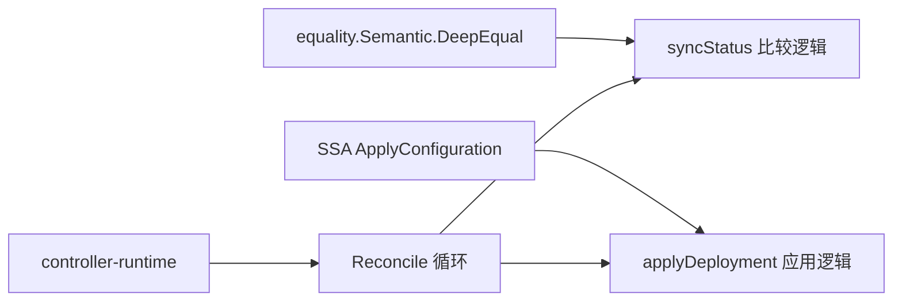

# 状态同步机制

<cite>
**本文引用的文件**   
- [workerpool_controller.go](file://cmd/atecontroller/internal/controllers/workerpool_controller.go)
- [workerpool_apply.go](file://cmd/atecontroller/internal/controllers/workerpool_apply.go)
- [workerpool_types.go](file://pkg/api/v1alpha1/workerpool_types.go)
- [workerpool_controller_test.go](file://cmd/atecontroller/internal/controllers/workerpool_controller_test.go)
</cite>

## 目录
1. [简介](#简介)
2. [项目结构](#项目结构)
3. [核心组件](#核心组件)
4. [架构总览](#架构总览)
5. [详细组件分析](#详细组件分析)
6. [依赖关系分析](#依赖关系分析)
7. [性能与幂等性](#性能与幂等性)
8. [错误处理与重试](#错误处理与重试)
9. [监控与调试](#监控与调试)
10. [结论](#结论)

## 简介
本文件聚焦于 WorkerPool 控制器的状态同步实现，重点阐述 syncStatus 函数的工作原理：如何读取 Deployment 的状态、计算副本数、比较并更新 WorkerPool 的 status.replicas。同时说明状态更新的触发条件、幂等性保证（使用 equality.Semantic.DeepEqual）、错误处理策略以及与 Kubernetes 组件的一致性保障，并提供监控与调试方法。

## 项目结构
WorkerPool 控制器位于 atecontroller 模块中，负责将用户声明的 WorkerPool 资源与实际运行的 Deployment 保持一致，并将实际运行副本数回写到 WorkerPool.status.replicas。

图表来源
- [workerpool_controller.go:47-90](file://cmd/atecontroller/internal/controllers/workerpool_controller.go#L47-L90)
- [workerpool_controller.go:92-112](file://cmd/atecontroller/internal/controllers/workerpool_controller.go#L92-L112)

章节来源
- [workerpool_controller.go:47-90](file://cmd/atecontroller/internal/controllers/workerpool_controller.go#L47-L90)
- [workerpool_controller.go:92-112](file://cmd/atecontroller/internal/controllers/workerpool_controller.go#L92-L112)

## 核心组件
- WorkerPoolReconciler：控制器主循环，协调 WorkerPool 与其管理的 Deployment 的生命周期与状态。
- applyDeployment：基于 SSA（Server-Side Apply）构建并应用 Deployment，确保只覆盖控制器拥有的字段。
- syncStatus：从 Deployment.Status.Replicas 读取实际副本数，与 WorkerPool.Status 比较，必要时更新 WorkerPool 的 status.replicas。
- WorkerPool 类型定义：包含 spec.replicas（期望副本数）和 status.replicas（观测副本数）。

章节来源
- [workerpool_controller.go:35-38](file://cmd/atecontroller/internal/controllers/workerpool_controller.go#L35-L38)
- [workerpool_controller.go:92-98](file://cmd/atecontroller/internal/controllers/workerpool_controller.go#L92-L98)
- [workerpool_controller.go:100-112](file://cmd/atecontroller/internal/controllers/workerpool_controller.go#L100-L112)
- [workerpool_types.go:54-96](file://pkg/api/v1alpha1/workerpool_types.go#L54-L96)

## 架构总览
WorkerPool 控制器通过 controller-runtime 管理 WorkerPool 资源，并通过 Owns 关联其创建的 Deployment。每次 WorkerPool 或 Deployment 变更都会触发 Reconcile，流程如下：

图表来源
- [workerpool_controller.go:47-90](file://cmd/atecontroller/internal/controllers/workerpool_controller.go#L47-L90)
- [workerpool_controller.go:92-112](file://cmd/atecontroller/internal/controllers/workerpool_controller.go#L92-L112)

## 详细组件分析

### syncStatus 工作原理
- 读取目标 Deployment 的 Status.Replicas，作为“期望值”写入 WorkerPoolStatus。
- 使用 equality.Semantic.DeepEqual 对当前 WorkerPool.Status 与期望值进行语义级深比较，避免无意义的更新。
- 若存在差异，则设置 wp.Status = want，并通过 r.Status().Update(ctx, wp) 更新 WorkerPool 的 status 子资源。
- 返回错误时由上层 Reconcile 记录日志并返回 error，交由控制器运行时决定是否重试。

图表来源
- [workerpool_controller.go:100-112](file://cmd/atecontroller/internal/controllers/workerpool_controller.go#L100-L112)

章节来源
- [workerpool_controller.go:100-112](file://cmd/atecontroller/internal/controllers/workerpool_controller.go#L100-L112)

### 触发条件
- WorkerPool 资源变更：Reconcile 被调度，执行 applyDeployment 后读取 Deployment 并调用 syncStatus。
- Deployment 资源变更：由于 SetupWithManager 中注册了 Owns(&appsv1.Deployment{})，当受管 Deployment 变化时会触发 Reconcile，从而再次执行 syncStatus。
- 删除场景：若 WorkerPool 处于删除阶段，Reconcile 会提前返回，不会继续同步状态。

章节来源
- [workerpool_controller.go:47-71](file://cmd/atecontroller/internal/controllers/workerpool_controller.go#L47-L71)
- [workerpool_controller.go:115-120](file://cmd/atecontroller/internal/controllers/workerpool_controller.go#L115-L120)

### 幂等性与一致性
- 幂等性：通过 equality.Semantic.DeepEqual 比较前后状态，仅在真正发生变化时才发起更新，避免重复写与不必要的竞争。
- 一致性：
  - 使用 SSA 管理 Deployment 的受控字段，外部修改会被下一次 reconcile 拉回。
  - 使用 OwnerReference 与 FieldOwner 明确所有权，减少多管理器冲突。
  - 使用 status 子资源更新，遵循 K8s 约定，降低与其他控制器的冲突概率。

章节来源
- [workerpool_controller.go:92-98](file://cmd/atecontroller/internal/controllers/workerpool_controller.go#L92-L98)
- [workerpool_controller.go:100-112](file://cmd/atecontroller/internal/controllers/workerpool_controller.go#L100-L112)
- [workerpool_apply.go:66-83](file://cmd/atecontroller/internal/controllers/workerpool_apply.go#L66-L83)

### 副本数计算与状态映射
- 期望副本数：来自 WorkerPool.Spec.Replicas，用于生成 Deployment.Spec.Replicas。
- 观测副本数：来自 Deployment.Status.Replicas，表示当前已就绪的 Pod 数量。
- 映射逻辑：syncStatus 直接将 Deployment.Status.Replicas 写入 WorkerPool.Status.Replicas，不做额外换算。

章节来源
- [workerpool_types.go:54-58](file://pkg/api/v1alpha1/workerpool_types.go#L54-L58)
- [workerpool_types.go:91-96](file://pkg/api/v1alpha1/workerpool_types.go#L91-L96)
- [workerpool_controller.go:100-102](file://cmd/atecontroller/internal/controllers/workerpool_controller.go#L100-L102)

### 关键类与方法关系

图表来源
- [workerpool_controller.go:35-38](file://cmd/atecontroller/internal/controllers/workerpool_controller.go#L35-L38)
- [workerpool_types.go:54-96](file://pkg/api/v1alpha1/workerpool_types.go#L54-L96)

## 依赖关系分析
- 控制器依赖 k8s.io/apimachinery/pkg/api/equality 提供的 Semantic.DeepEqual 做状态比较。
- 控制器通过 client-go 的 ApplyConfiguration 与 SSA 能力管理 Deployment 字段。
- 控制器通过 controller-runtime 的 Manager 与 Informer 机制监听资源变更。

图表来源
- [workerpool_controller.go:22-28](file://cmd/atecontroller/internal/controllers/workerpool_controller.go#L22-L28)
- [workerpool_apply.go:17-25](file://cmd/atecontroller/internal/controllers/workerpool_apply.go#L17-L25)

章节来源
- [workerpool_controller.go:22-28](file://cmd/atecontroller/internal/controllers/workerpool_controller.go#L22-L28)
- [workerpool_apply.go:17-25](file://cmd/atecontroller/internal/controllers/workerpool_apply.go#L17-L25)

## 性能与幂等性
- 幂等性：通过 deepEqual 避免无差异更新，显著降低 API Server 压力与竞争冲突。
- 性能：
  - 仅更新 status 子资源，开销较小。
  - SSA 增量合并，避免全量覆盖带来的额外成本。
- 建议：
  - 在大规模集群下关注 informer 缓存延迟，合理设置 resync 间隔。
  - 避免频繁手动修改受控字段，减少控制器重放成本。

[本节为通用指导，不直接分析具体文件]

## 错误处理与重试
- 错误传播：
  - applyDeployment 失败：返回错误，Reconcile 记录日志并返回 error，控制器运行时会根据错误类型决定是否重试。
  - syncStatus 失败：返回错误，同样交由控制器运行时处理。
- 重试机制：
  - 当前代码未显式封装指数退避或重试逻辑，依赖控制器运行时的默认行为。
  - 测试用例中使用 retry.RetryOnConflict 模拟并发冲突下的更新重试，体现对乐观锁冲突的处理思路。
- 一致性保障：
  - 使用 FieldOwner 与 ForceOwnership 确保控制器拥有权清晰，避免多管理器冲突。
  - 使用 OwnerReference 使 Deployment 随 WorkerPool 删除而级联清理。

章节来源
- [workerpool_controller.go:65-71](file://cmd/atecontroller/internal/controllers/workerpool_controller.go#L65-L71)
- [workerpool_controller.go:92-98](file://cmd/atecontroller/internal/controllers/workerpool_controller.go#L92-L98)
- [workerpool_controller.go:100-112](file://cmd/atecontroller/internal/controllers/workerpool_controller.go#L100-L112)
- [workerpool_controller_test.go:583-596](file://cmd/atecontroller/internal/controllers/workerpool_controller_test.go#L583-L596)

## 监控与调试
- 日志：
  - 控制器使用结构化日志记录关键步骤，便于定位问题。
- 指标与追踪：
  - 服务启动时初始化 Prometheus 与 OpenTelemetry，可用于采集控制器指标与链路追踪。
- 调试方法：
  - 查看 WorkerPool 的 status.replicas 是否与 Deployment 一致。
  - 检查 Deployment 的 ownerReferences 与 field manager 归属，确认 SSA 生效。
  - 使用测试中的 eventually 模式观察最终一致性。

章节来源
- [workerpool_controller.go:47-71](file://cmd/atecontroller/internal/controllers/workerpool_controller.go#L47-L71)
- [serverboot.go](file://internal/serverboot/serverboot.go)

## 结论
WorkerPool 的状态同步以简洁清晰的流程实现：通过 SSA 管理 Deployment，再读取其 Status.Replicas 并幂等地回写到 WorkerPool.Status.Replicas。使用 equality.Semantic.DeepEqual 确保只在真实变化时更新，结合 controller-runtime 的事件驱动模型，实现了高效且可靠的状态一致性。对于错误处理，当前采用标准错误传播并由控制器运行时决定重试；在并发冲突场景下，可参考测试中的 RetryOnConflict 模式增强健壮性。监控方面，借助结构化日志、Prometheus 与 OpenTelemetry，可有效支撑排障与性能分析。
