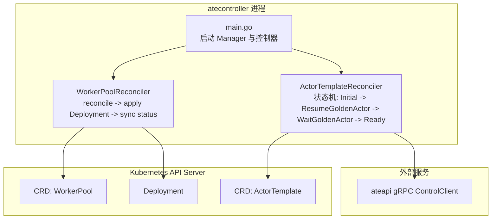
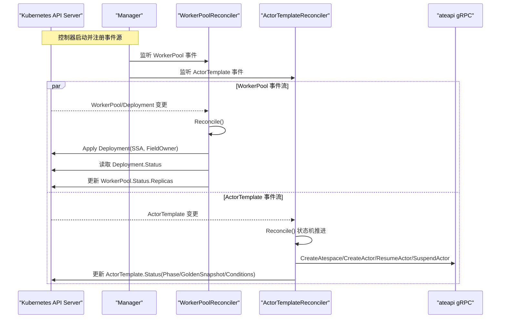
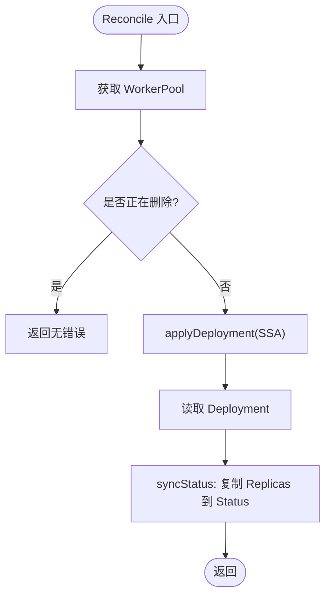
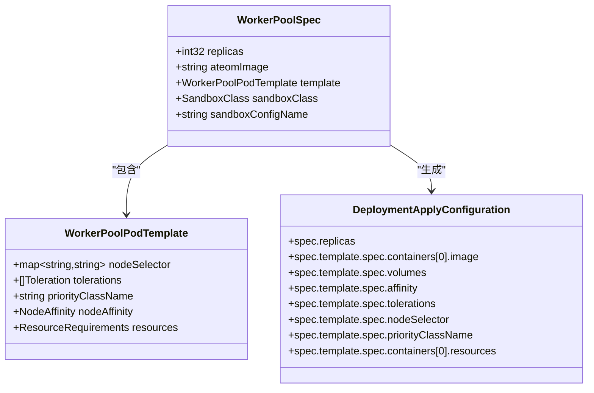
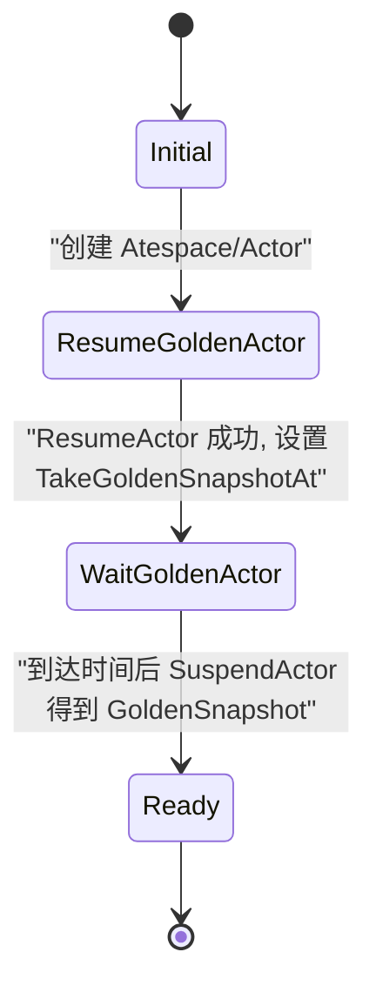
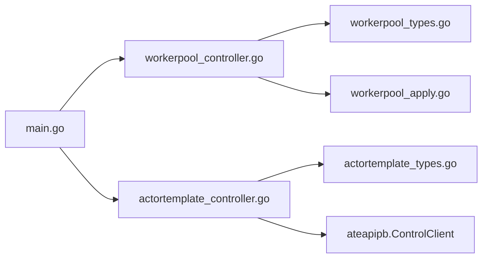

# 控制器 (atecontroller)

<cite>
**本文引用的文件**   
- [cmd/atecontroller/main.go](file://cmd/atecontroller/main.go)
- [cmd/atecontroller/internal/controllers/workerpool_controller.go](file://cmd/atecontroller/internal/controllers/workerpool_controller.go)
- [cmd/atecontroller/internal/controllers/workerpool_apply.go](file://cmd/atecontroller/internal/controllers/workerpool_apply.go)
- [cmd/atecontroller/internal/controllers/actortemplate_controller.go](file://cmd/atecontroller/internal/controllers/actortemplate_controller.go)
- [pkg/api/v1alpha1/workerpool_types.go](file://pkg/api/v1alpha1/workerpool_types.go)
- [pkg/api/v1alpha1/actortemplate_types.go](file://pkg/api/v1alpha1/actortemplate_types.go)
</cite>

## 目录
1. [简介](#简介)
2. [项目结构](#项目结构)
3. [核心组件](#核心组件)
4. [架构总览](#架构总览)
5. [详细组件分析](#详细组件分析)
6. [依赖关系分析](#依赖关系分析)
7. [性能与调优](#性能与调优)
8. [故障排查指南](#故障排查指南)
9. [结论](#结论)
10. [附录：配置参数与日志指标](#附录配置参数与日志指标)

## 简介
本文件系统性阐述 atecontroller 控制器的实现原理与工作机制，重点覆盖以下方面：
- 基于 controller-runtime 的控制器模式：Reconcile 循环、事件处理、冲突解决（SSA FieldOwner + ForceOwnership）
- WorkerPool 控制器：工作节点池生命周期管理、Pod 调度策略、资源分配算法
- ActorTemplate 控制器：模板初始化、Golden Actor 创建与快照、状态机推进
- 控制器间协调机制与数据一致性保证
- 配置参数、性能调优建议、故障排查要点
- 日志输出格式与监控指标说明

## 项目结构
atecontroller 由一个主进程启动两个控制器：WorkerPoolReconciler 与 ActorTemplateReconciler。前者负责将 WorkerPool CRD 映射为 Deployment 并维护副本数与状态；后者负责 ActorTemplate 的 Golden Snapshot 准备流程。

图表来源
- [cmd/atecontroller/main.go:82-105](file://cmd/atecontroller/main.go#L82-L105)
- [cmd/atecontroller/internal/controllers/workerpool_controller.go:115-120](file://cmd/atecontroller/internal/controllers/workerpool_controller.go#L115-L120)
- [cmd/atecontroller/internal/controllers/actortemplate_controller.go:191-193](file://cmd/atecontroller/internal/controllers/actortemplate_controller.go#L191-L193)

章节来源
- [cmd/atecontroller/main.go:36-124](file://cmd/atecontroller/main.go#L36-L124)

## 核心组件
- WorkerPoolReconciler：监听 WorkerPool 与其拥有的 Deployment，使用 SSA 声明式应用，确保只覆盖“拥有”的字段，其余字段不受影响；同步 Deployment.Status.Replicas 到 WorkerPool.Status.Replicas。
- ActorTemplateReconciler：驱动 ActorTemplate 的状态机，完成 Golden Actor 的创建、恢复、等待就绪、挂起并提取 Golden Snapshot，最终标记模板 Ready。

章节来源
- [cmd/atecontroller/internal/controllers/workerpool_controller.go:35-121](file://cmd/atecontroller/internal/controllers/workerpool_controller.go#L35-L121)
- [cmd/atecontroller/internal/controllers/actortemplate_controller.go:48-211](file://cmd/atecontroller/internal/controllers/actortemplate_controller.go#L48-L211)

## 架构总览
控制器通过 controller-runtime 的 Manager 注册，分别监听各自的 CRD 与子资源。WorkerPool 控制器还 Owns 了 Deployment，从而在 Deployment 变更时触发 Reconcile。ActorTemplate 控制器通过 gRPC 客户端调用 ateapi 完成 Golden Actor 的生命周期操作。

图表来源
- [cmd/atecontroller/main.go:90-105](file://cmd/atecontroller/main.go#L90-L105)
- [cmd/atecontroller/internal/controllers/workerpool_controller.go:115-120](file://cmd/atecontroller/internal/controllers/workerpool_controller.go#L115-L120)
- [cmd/atecontroller/internal/controllers/actortemplate_controller.go:191-193](file://cmd/atecontroller/internal/controllers/actortemplate_controller.go#L191-L193)

## 详细组件分析

### WorkerPool 控制器
职责
- 根据 WorkerPool.Spec 生成并应用 Deployment（含 Pod 调度与资源设置）。
- 使用 SSA + FieldOwner + ForceOwnership 确保“拥有字段”的一致性，同时保留其他管理器的字段。
- 同步 Deployment 的实际副本数到 WorkerPool.Status.Replicas。

关键流程
- Reconcile：获取对象、处理删除、调用 reconcileWorkerPool。
- reconcileWorkerPool：applyDeployment -> 读取 Deployment -> syncStatus。
- applyDeployment：构建 DeploymentApplyConfiguration 并通过 client.Apply 以 FieldOwner 方式写入。
- syncStatus：比较语义相等后更新 Status。

图表来源
- [cmd/atecontroller/internal/controllers/workerpool_controller.go:47-90](file://cmd/atecontroller/internal/controllers/workerpool_controller.go#L47-L90)
- [cmd/atecontroller/internal/controllers/workerpool_controller.go:92-112](file://cmd/atecontroller/internal/controllers/workerpool_controller.go#L92-L112)

#### 部署构建与调度策略
- 容器镜像与参数：从 WorkerPool.Spec.AteomImage 注入，容器名固定为 ateom，挂载宿主机路径用于运行时数据。
- 安全上下文：特权运行，UID/GID 为 0。
- 调度与亲和性：支持 NodeSelector、Tolerations、PriorityClassName、NodeAffinity；当 SandboxClass=microvm 时，额外注入 /dev/kvm 设备挂载与节点选择器/污点容忍，以定位具备 KVM 能力的节点。
- 资源限制：支持 Requests/Limits 透传到容器。

图表来源
- [pkg/api/v1alpha1/workerpool_types.go:54-96](file://pkg/api/v1alpha1/workerpool_types.go#L54-L96)
- [cmd/atecontroller/internal/controllers/workerpool_apply.go:30-83](file://cmd/atecontroller/internal/controllers/workerpool_apply.go#L30-L83)
- [cmd/atecontroller/internal/controllers/workerpool_apply.go:94-130](file://cmd/atecontroller/internal/controllers/workerpool_apply.go#L94-L130)
- [cmd/atecontroller/internal/controllers/workerpool_apply.go:132-166](file://cmd/atecontroller/internal/controllers/workerpool_apply.go#L132-L166)

冲突解决与一致性
- 使用 SSA 的 FieldOwner 与 ForceOwnership，仅覆盖声明的字段，避免覆盖其他管理器设置的字段。
- 若外部修改了被该控制器“拥有”的字段（如 replicas），下一次 Reconcile 会将其拉回期望值。
- 删除场景：若 Deployment 被外部删除，控制器会在下次 Reconcile 重建。

章节来源
- [cmd/atecontroller/internal/controllers/workerpool_controller.go:92-112](file://cmd/atecontroller/internal/controllers/workerpool_controller.go#L92-L112)
- [cmd/atecontroller/internal/controllers/workerpool_apply.go:30-83](file://cmd/atecontroller/internal/controllers/workerpool_apply.go#L30-L83)

### ActorTemplate 控制器
职责
- 驱动 ActorTemplate 的状态机，完成 Golden Snapshot 的准备。
- 状态包括：Initial -> ResumeGoldenActor -> WaitGoldenActor -> Ready。
- 通过 ateapi gRPC 创建 Atespace、创建 Actor、恢复 Actor、挂起并提取快照。

状态机与流程
- PhaseInitial：确保 ate-golden Atespace 存在，创建 Golden Actor，记录 ID，进入 ResumeGoldenActor。
- PhaseResumeGoldenActor：ResumeActor（若无快照则冷启动），计算 warmup 时间，进入 WaitGoldenActor。
- PhaseWaitGoldenActor：等待至 TakeGoldenSnapshotAt，随后 SuspendActor 获取 LatestSnapshotInfo.External.SnapshotUriPrefix，写入 GoldenSnapshot，进入 Ready。
- PhaseReady：稳定态，无需进一步动作。

图表来源
- [cmd/atecontroller/internal/controllers/actortemplate_controller.go:81-187](file://cmd/atecontroller/internal/controllers/actortemplate_controller.go#L81-L187)

Warmup 策略
- 若所有容器都定义了 Readyz，则 ResumeActor 已阻塞至就绪，warmup 时间为 0。
- 否则采用默认等待时长，作为兜底。

章节来源
- [cmd/atecontroller/internal/controllers/actortemplate_controller.go:195-210](file://cmd/atecontroller/internal/controllers/actortemplate_controller.go#L195-L210)

### 控制器间的协调与一致性
- WorkerPool 与 ActorTemplate 之间无直接耦合，但共享 SandboxClass 概念：ActorTemplate 指定其运行的沙箱类，WorkerPool 提供对应类的 worker 池。
- 一致性保障：
  - WorkerPool 使用 SSA + FieldOwner + ForceOwnership 确保“拥有字段”的强一致。
  - ActorTemplate 通过状态机与 ateapi 交互，持久化 GoldenSnapshot 到 Status，供上层编排消费。
- 事件传播：
  - WorkerPool 通过 Owns(Deployment) 感知下游变化，触发 Reconcile。
  - ActorTemplate 仅监听自身 CRD 变更，按状态机推进。

章节来源
- [cmd/atecontroller/internal/controllers/workerpool_controller.go:115-120](file://cmd/atecontroller/internal/controllers/workerpool_controller.go#L115-L120)
- [cmd/atecontroller/internal/controllers/actortemplate_controller.go:191-193](file://cmd/atecontroller/internal/controllers/actortemplate_controller.go#L191-L193)

## 依赖关系分析
- 主进程依赖：
  - controller-runtime Manager、健康检查端点、zap 日志。
  - ateapi gRPC 客户端（mtls/jwt 两种认证模式）。
- 控制器依赖：
  - Kubernetes Client、Scheme、RBAC 注解。
  - WorkerPool 控制器依赖 appsv1.Deployment 与 v1alpha1.WorkerPool。
  - ActorTemplate 控制器依赖 v1alpha1.ActorTemplate 与 ateapipb.ControlClient。

图表来源
- [cmd/atecontroller/main.go:82-105](file://cmd/atecontroller/main.go#L82-L105)
- [cmd/atecontroller/internal/controllers/workerpool_controller.go:17-31](file://cmd/atecontroller/internal/controllers/workerpool_controller.go#L17-L31)
- [cmd/atecontroller/internal/controllers/actortemplate_controller.go:17-34](file://cmd/atecontroller/internal/controllers/actortemplate_controller.go#L17-L34)

章节来源
- [cmd/atecontroller/main.go:36-124](file://cmd/atecontroller/main.go#L36-L124)

## 性能与调优
- 并发与队列
  - controller-runtime 默认对同一对象的请求串行化，不同对象可并行处理。可通过 Manager 的 MaxConcurrentReconciles 调整特定控制器的并发度（当前代码未显式设置，使用默认值）。
- SSA 与冲突
  - 使用 FieldOwner + ForceOwnership 减少全量覆盖带来的冲突概率；但仍需关注高并发下的版本冲突重试。
- 事件风暴
  - WorkerPool 通过 Owns(Deployment) 监听大量 Pod/ReplicaSet 变更，建议在大规模集群中合理设置 resync 间隔与队列速率限制。
- I/O 与超时
  - ActorTemplate 的 SuspendActor/ResumeActor 等远程 RPC 应结合超时与退避策略，避免长时间占用 Reconcile 线程。
- 资源配额
  - WorkerPool 的 Pod 资源 Request/Limit 直接影响调度与节点压力，建议依据实际负载进行压测与容量规划。

[本节为通用指导，不直接分析具体文件]

## 故障排查指南
- WorkerPool 未创建 Deployment
  - 检查 WorkerPool 是否存在且未被删除；查看控制器日志中的 Reconcile 错误信息。
  - 确认 RBAC 权限允许 get/list/watch/create/update/patch/delete Deployment。
- Deployment 副本数不一致
  - 若外部修改了 replicas，控制器会通过 SSA 拉回期望值；观察 Reconcile 日志确认是否发生覆盖。
  - 检查 WorkerPool.Spec.Replicas 与 Deployment.Spec.Replicas 是否一致。
- 调度失败或 Pod 无法启动
  - 检查 NodeSelector/Tolerations/Affinity 是否与节点标签匹配。
  - 若 SandboxClass=microvm，确认节点具备 /dev/kvm 且容忍相应污点。
- ActorTemplate 无法进入 Ready
  - 检查 ateapi 连通性与认证模式（mtls/jwt）是否正确。
  - 查看状态机阶段：是否卡在 ResumeGoldenActor 或 WaitGoldenActor。
  - 确认 Readyz 探针配置是否符合预期，warmup 时间是否过长。
- 日志定位
  - 使用 ctrl.Log.WithName("setup") 及 Reconcile 上下文日志，定位错误堆栈与关键步骤。

章节来源
- [cmd/atecontroller/internal/controllers/workerpool_controller.go:47-90](file://cmd/atecontroller/internal/controllers/workerpool_controller.go#L47-L90)
- [cmd/atecontroller/internal/controllers/actortemplate_controller.go:81-187](file://cmd/atecontroller/internal/controllers/actortemplate_controller.go#L81-L187)

## 结论
atecontroller 通过简洁而稳健的控制器模式实现了两类核心能力：
- WorkerPool 控制器利用 SSA 与 FieldOwner 确保 Deployment 的声明式一致性，并提供灵活的调度与资源配置。
- ActorTemplate 控制器以状态机驱动 Golden Snapshot 的准备工作，为后续 Actor 的快速激活奠定基础。
两者共同构成 substrate 平台中“模板-实例-执行环境”的关键基础设施。

[本节为总结，不直接分析具体文件]

## 附录：配置参数与日志指标

### 启动参数
- --ateapi-conn-spec：ateapi gRPC 连接地址，默认 dns:///api.ate-system.svc:443
- --ateapi-auth：认证模式 mtls 或 jwt
- --ateapi-ca-file：jwt 模式下验证服务器证书所需的 CA 文件
- --ateapi-server-name：可选的 SNI/主机名校验
- --ateapi-token-file：jwt 模式下使用的 SA Token 文件路径

章节来源
- [cmd/atecontroller/main.go:40-46](file://cmd/atecontroller/main.go#L40-L46)

### 日志
- 使用 zap 作为日志后端，开发模式启用。
- 关键日志点：
  - setup 阶段的 Manager 启动、控制器注册、健康检查设置。
  - WorkerPool Reconcile 的错误与状态同步。
  - ActorTemplate 状态机推进与 ateapi 调用结果。

章节来源
- [cmd/atecontroller/main.go:55-122](file://cmd/atecontroller/main.go#L55-L122)
- [cmd/atecontroller/internal/controllers/workerpool_controller.go:65-71](file://cmd/atecontroller/internal/controllers/workerpool_controller.go#L65-L71)
- [cmd/atecontroller/internal/controllers/actortemplate_controller.go:112-187](file://cmd/atecontroller/internal/controllers/actortemplate_controller.go#L112-L187)

### 监控指标
- 当前代码未显式暴露自定义 Prometheus 指标。
- 建议补充：
  - reconcile_total/reconcile_errors（按控制器与对象类型分桶）
  - workerpool_desired_replicas/workerpool_observed_replicas
  - actortemplate_phase_duration_seconds（各阶段耗时）
  - ateapi_rpc_calls_total/rpc_error_total（按方法分类）

[本节为通用建议，不直接分析具体文件]
