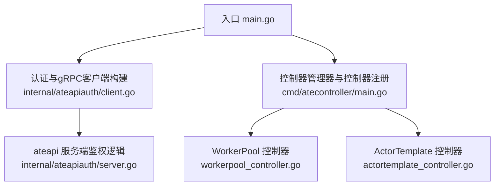
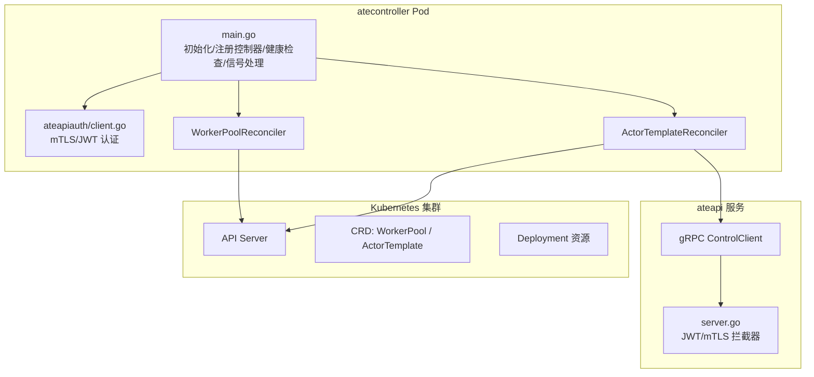
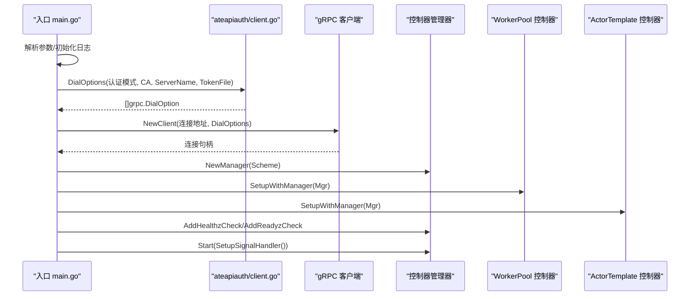
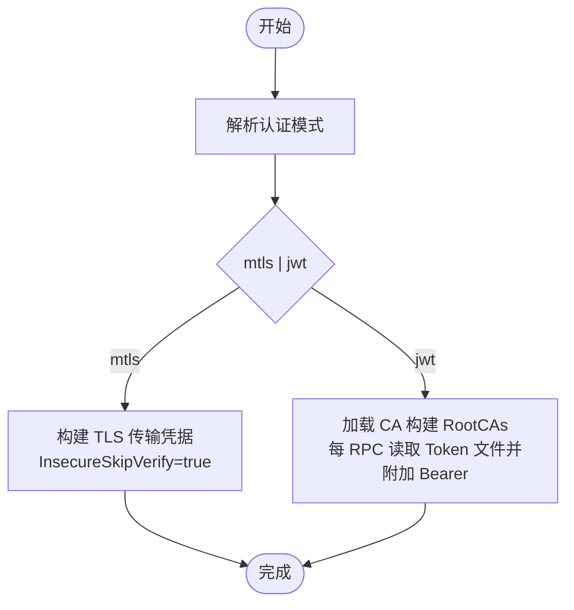
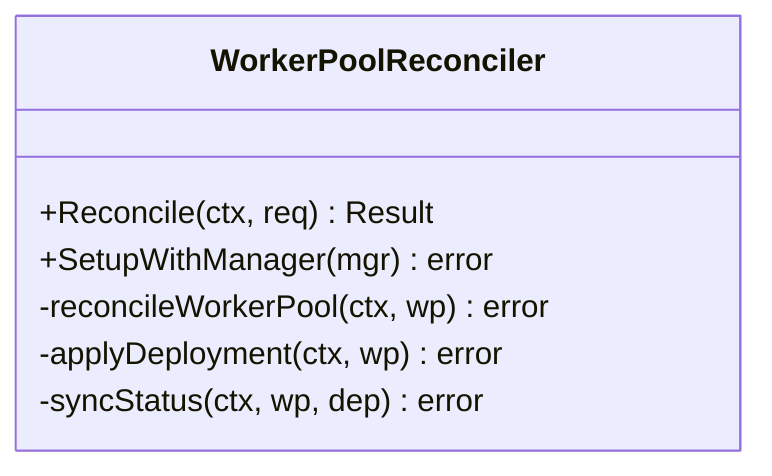
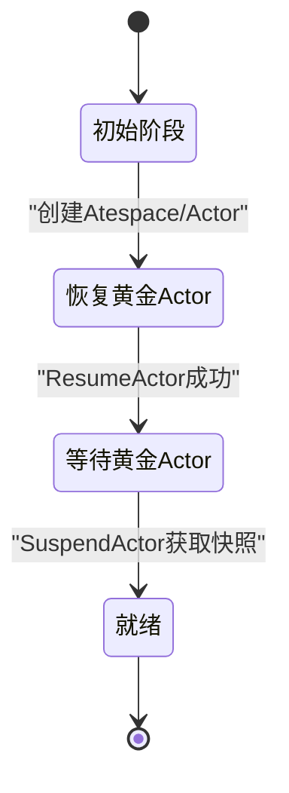
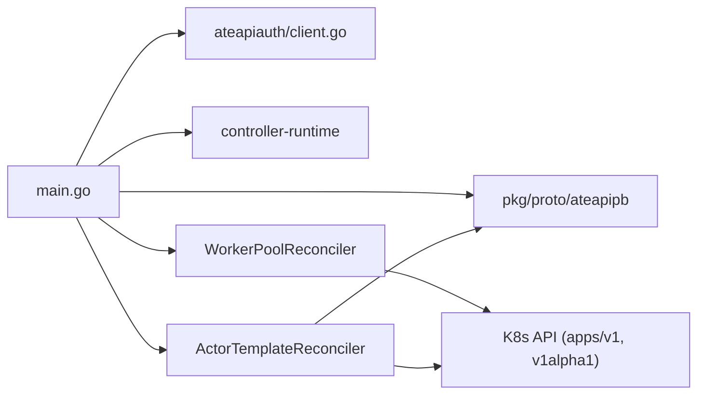

# 控制器框架

<cite>
**本文引用的文件**   
- [cmd/atecontroller/main.go](file://cmd/atecontroller/main.go)
- [internal/ateapiauth/client.go](file://internal/ateapiauth/client.go)
- [internal/ateapiauth/server.go](file://internal/ateapiauth/server.go)
- [cmd/atecontroller/internal/controllers/workerpool_controller.go](file://cmd/atecontroller/internal/controllers/workerpool_controller.go)
- [cmd/atecontroller/internal/controllers/actortemplate_controller.go](file://cmd/atecontroller/internal/controllers/actortemplate_controller.go)
</cite>

## 目录
1. [简介](#简介)
2. [项目结构](#项目结构)
3. [核心组件](#核心组件)
4. [架构总览](#架构总览)
5. [详细组件分析](#详细组件分析)
6. [依赖关系分析](#依赖关系分析)
7. [性能考虑](#性能考虑)
8. [故障排查指南](#故障排查指南)
9. [结论](#结论)
10. [附录](#附录)

## 简介
本文件聚焦于 atecontroller 控制器的基础框架实现，围绕基于 controller-runtime 的控制器管理器初始化、Kubernetes 客户端配置与认证（mTLS/JWT）、gRPC 连接到 ateapi 服务、启动流程与健康检查、信号处理机制，以及与 Kubernetes API Server 的交互模式（事件监听、资源同步、状态管理）进行系统性说明。同时提供关键配置参数说明与性能调优建议，帮助读者快速理解并高效运维该控制器。

## 项目结构
atecontroller 作为独立二进制入口，负责：
- 解析命令行参数与日志初始化
- 构建 gRPC 连接选项（支持 mTLS 与 JWT 两种认证模式）
- 创建到 ateapi 服务的 gRPC 客户端
- 初始化 controller-runtime Manager 并注册控制器
- 设置健康检查端点并启动主循环

图表来源
- [cmd/atecontroller/main.go:53-123](file://cmd/atecontroller/main.go#L53-L123)
- [internal/ateapiauth/client.go:57-95](file://internal/ateapiauth/client.go#L57-L95)
- [internal/ateapiauth/server.go:43-56](file://internal/ateapiauth/server.go#L43-L56)
- [cmd/atecontroller/internal/controllers/workerpool_controller.go:115-120](file://cmd/atecontroller/internal/controllers/workerpool_controller.go#L115-L120)
- [cmd/atecontroller/internal/controllers/actortemplate_controller.go:190-193](file://cmd/atecontroller/internal/controllers/actortemplate_controller.go#L190-L193)

章节来源
- [cmd/atecontroller/main.go:53-123](file://cmd/atecontroller/main.go#L53-L123)

## 核心组件
- 控制器管理器与入口
  - 使用 controller-runtime 的 NewManager 创建管理器，注入 Scheme 与 K8s 客户端配置
  - 注册 WorkerPool 与 ActorTemplate 两个控制器
  - 添加 healthz/readyz 健康检查，并通过 SetupSignalHandler 优雅退出
- gRPC 客户端与认证
  - 通过 ateapiauth.DialOptions 生成 grpc.DialOption，支持 mtls 与 jwt 两种模式
  - 在 jwt 模式下，从 ServiceAccount Token 文件读取 Bearer 令牌，并在每次 RPC 时携带
- 控制器实现
  - WorkerPoolReconciler：将 WorkerPool CRD 同步为 Deployment，并回写状态
  - ActorTemplateReconciler：驱动“黄金 Actor”生命周期（创建、恢复、等待快照、就绪），并与 ateapi 交互

章节来源
- [cmd/atecontroller/main.go:82-123](file://cmd/atecontroller/main.go#L82-L123)
- [internal/ateapiauth/client.go:57-95](file://internal/ateapiauth/client.go#L57-L95)
- [cmd/atecontroller/internal/controllers/workerpool_controller.go:47-120](file://cmd/atecontroller/internal/controllers/workerpool_controller.go#L47-L120)
- [cmd/atecontroller/internal/controllers/actortemplate_controller.go:66-193](file://cmd/atecontroller/internal/controllers/actortemplate_controller.go#L66-L193)

## 架构总览
下图展示了 atecontroller 的运行时架构：入口程序初始化认证与 gRPC 客户端，随后启动控制器管理器；控制器通过 K8s Informer 监听 CRD 变更，调用 K8s API 更新资源，并通过 gRPC 与 ateapi 服务交互。

图表来源
- [cmd/atecontroller/main.go:82-123](file://cmd/atecontroller/main.go#L82-L123)
- [internal/ateapiauth/client.go:57-95](file://internal/ateapiauth/client.go#L57-L95)
- [internal/ateapiauth/server.go:81-103](file://internal/ateapiauth/server.go#L81-L103)
- [cmd/atecontroller/internal/controllers/workerpool_controller.go:115-120](file://cmd/atecontroller/internal/controllers/workerpool_controller.go#L115-L120)
- [cmd/atecontroller/internal/controllers/actortemplate_controller.go:190-193](file://cmd/atecontroller/internal/controllers/actortemplate_controller.go#L190-L193)

## 详细组件分析

### 控制器管理器初始化与启动流程
- 参数解析与日志初始化
  - 解析 --ateapi-auth、--ateapi-ca-file、--ateapi-server-name、--ateapi-token-file 等参数
  - 使用 zap 初始化结构化日志
- gRPC 客户端建立
  - 根据认证模式生成 DialOptions，并创建 gRPC 连接
  - 构造 ateapipb.ControlClient 供控制器使用
- 控制器管理器创建与控制器注册
  - 使用 ctrl.NewManager 创建管理器，传入 Scheme
  - 注册 WorkerPoolReconciler 与 ActorTemplateReconciler
- 健康检查与信号处理
  - 注册 healthz 与 readyz 检查
  - 使用 SetupSignalHandler 监听系统信号，优雅关闭

图表来源
- [cmd/atecontroller/main.go:53-123](file://cmd/atecontroller/main.go#L53-L123)
- [internal/ateapiauth/client.go:57-95](file://internal/ateapiauth/client.go#L57-L95)

章节来源
- [cmd/atecontroller/main.go:53-123](file://cmd/atecontroller/main.go#L53-L123)

### 认证机制（mTLS 与 JWT）
- 客户端侧
  - mTLS 模式：跳过证书校验（InsecureSkipVerify=true），身份由 pod 投影的 mTLS 凭证提供
  - JWT 模式：校验服务器证书（CAFile），并为每个 RPC 附加 Bearer Token（从 SA Token 文件读取）
- 服务端侧（参考 server.go）
  - 支持 ModeMTLS 与 ModeJWT 两种模式
  - 在 JWT 模式下，通过拦截器校验 authorization 头中的 Bearer Token

图表来源
- [internal/ateapiauth/client.go:57-95](file://internal/ateapiauth/client.go#L57-L95)
- [internal/ateapiauth/server.go:43-56](file://internal/ateapiauth/server.go#L43-L56)

章节来源
- [internal/ateapiauth/client.go:57-95](file://internal/ateapiauth/client.go#L57-L95)
- [internal/ateapiauth/server.go:43-56](file://internal/ateapiauth/server.go#L43-L56)

### WorkerPool 控制器
- 职责
  - 监听 WorkerPool CRD 变更
  - 将期望状态应用为 Deployment（使用 Apply 策略与 FieldOwner）
  - 同步 Deployment 副本数到 WorkerPool.Status.Replicas
- 事件与同步
  - For(&WorkerPool{}) 监听源资源
  - Owns(&Deployment{}) 监听受控资源
- 状态管理
  - 使用 Status().Update 更新状态，避免覆盖其他字段

图表来源
- [cmd/atecontroller/internal/controllers/workerpool_controller.go:35-120](file://cmd/atecontroller/internal/controllers/workerpool_controller.go#L35-L120)

章节来源
- [cmd/atecontroller/internal/controllers/workerpool_controller.go:47-120](file://cmd/atecontroller/internal/controllers/workerpool_controller.go#L47-L120)

### ActorTemplate 控制器
- 职责
  - 驱动“黄金 Actor”生命周期：创建 Atespace/Actor、恢复 Actor、等待快照、标记 Ready
  - 与 ateapi 通过 gRPC 交互（CreateAtespace、CreateActor、ResumeActor、SuspendActor）
- 状态机
  - PhaseInitial → PhaseResumeGoldenActor → PhaseWaitGoldenActor → PhaseReady
- 快照时机
  - 若模板容器未声明 readiness probe，则等待固定预热时间后再挂起以取快照

图表来源
- [cmd/atecontroller/internal/controllers/actortemplate_controller.go:81-187](file://cmd/atecontroller/internal/controllers/actortemplate_controller.go#L81-L187)

章节来源
- [cmd/atecontroller/internal/controllers/actortemplate_controller.go:66-193](file://cmd/atecontroller/internal/controllers/actortemplate_controller.go#L66-L193)

### 与 Kubernetes API Server 的交互模式
- 事件监听
  - 通过 controller-runtime 的 Informer 机制监听 CRD 与受控资源（如 Deployment）
- 资源同步
  - 使用 Apply 策略与 FieldOwner 确保幂等更新
- 状态管理
  - 仅更新 Status 子资源，避免与其他控制器冲突
- 错误处理与重试
  - Reconcile 返回 error 会触发重入；对不可变错误可结合条件判断减少抖动

章节来源
- [cmd/atecontroller/internal/controllers/workerpool_controller.go:92-112](file://cmd/atecontroller/internal/controllers/workerpool_controller.go#L92-L112)
- [cmd/atecontroller/internal/controllers/actortemplate_controller.go:114-187](file://cmd/atecontroller/internal/controllers/actortemplate_controller.go#L114-L187)

## 依赖关系分析
- 入口 main.go 依赖
  - ateapiauth 客户端库用于构建 gRPC 连接选项
  - controller-runtime 用于创建与管理控制器
  - ateapipb 生成的 gRPC 客户端类型
- 控制器依赖
  - WorkerPoolReconciler 依赖 apps/v1 Deployment 与 atev1alpha1.WorkerPool
  - ActorTemplateReconciler 依赖 ateapipb.ControlClient 与 atev1alpha1.ActorTemplate

图表来源
- [cmd/atecontroller/main.go:82-123](file://cmd/atecontroller/main.go#L82-L123)
- [internal/ateapiauth/client.go:57-95](file://internal/ateapiauth/client.go#L57-L95)
- [cmd/atecontroller/internal/controllers/workerpool_controller.go:115-120](file://cmd/atecontroller/internal/controllers/workerpool_controller.go#L115-L120)
- [cmd/atecontroller/internal/controllers/actortemplate_controller.go:190-193](file://cmd/atecontroller/internal/controllers/actortemplate_controller.go#L190-L193)

章节来源
- [cmd/atecontroller/main.go:82-123](file://cmd/atecontroller/main.go#L82-L123)

## 性能考虑
- 控制器并发度
  - 可通过 controller-runtime Options 调整工作队列并发度与速率限制，避免大规模资源变更时的风暴
- 状态更新频率
  - 仅在状态实际变化时更新 Status，减少 API Server 压力
- gRPC 连接与认证开销
  - JWT 模式每次 RPC 读取 Token 文件，注意磁盘 I/O 与缓存策略；必要时可在进程内缓存并监控文件变更
- 健康检查
  - 合理设置 healthz/readyz，避免就绪探针误判导致流量调度异常

[本节为通用指导，不直接分析具体文件]

## 故障排查指南
- 启动失败
  - 检查 --ateapi-auth 是否合法；查看日志中关于无效模式的错误信息
  - 确认 CA 文件路径与内容正确；JWT 模式下需指定 Token 文件
- gRPC 连接问题
  - 确认 ateapi 服务可达性与端口；检查 SNI/ServerName 配置
  - 在 JWT 模式下，确认 Token 文件可读且非空
- 控制器无动作
  - 检查 CRD 是否正确安装；确认 RBAC 权限
  - 查看控制器日志中的 Reconcile 错误与重试行为
- 健康检查
  - 访问 /healthz 与 /readyz 验证服务可用性

章节来源
- [cmd/atecontroller/main.go:57-78](file://cmd/atecontroller/main.go#L57-L78)
- [internal/ateapiauth/client.go:70-95](file://internal/ateapiauth/client.go#L70-L95)
- [cmd/atecontroller/main.go:109-123](file://cmd/atecontroller/main.go#L109-L123)

## 结论
atecontroller 基于 controller-runtime 提供了清晰的控制器框架：入口负责认证与 gRPC 客户端初始化、控制器注册与健康检查；WorkerPool 与 ActorTemplate 控制器分别负责资源同步与业务编排。通过 mTLS/JWT 双模式认证，兼顾了安全与易用性。配合合理的参数与性能调优，可在生产环境中稳定运行。

[本节为总结性内容，不直接分析具体文件]

## 附录
- 关键配置参数（来自入口 main.go）
  - --ateapi-conn-spec：gRPC 连接目标（默认 dns:///api.ate-system.svc:443）
  - --ateapi-auth：认证模式（mtls|jwt，默认 mtls）
  - --ateapi-ca-file：CA 文件路径（JWT 模式必需）
  - --ateapi-server-name：SNI/主机名校验名（可选）
  - --ateapi-token-file：SA Token 文件路径（JWT 模式必需）

章节来源
- [cmd/atecontroller/main.go:40-46](file://cmd/atecontroller/main.go#L40-L46)
