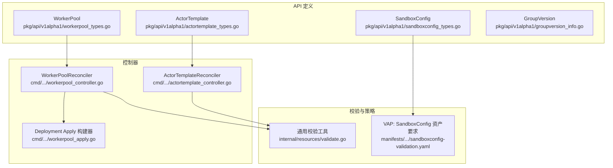
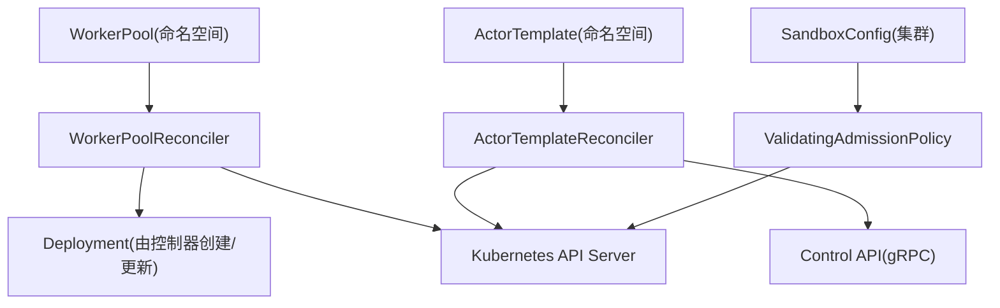
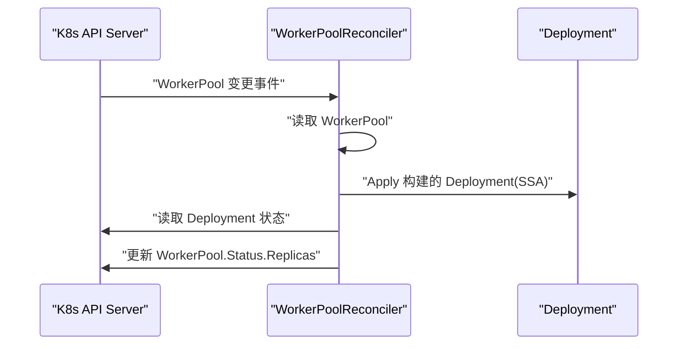
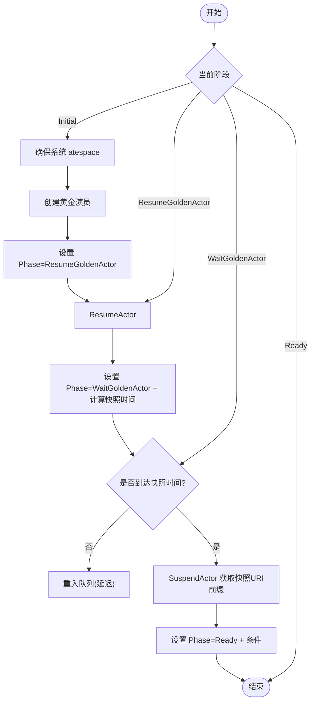
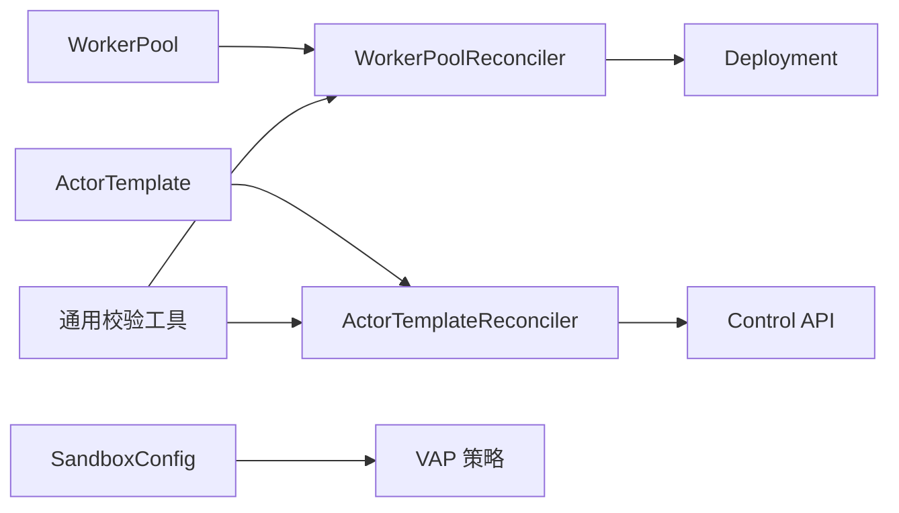

# CRD资源处理

<cite>
**本文引用的文件**   
- [workerpool_types.go](file://pkg/api/v1alpha1/workerpool_types.go)
- [actortemplate_types.go](file://pkg/api/v1alpha1/actortemplate_types.go)
- [sandboxconfig_types.go](file://pkg/api/v1alpha1/sandboxconfig_types.go)
- [groupversion_info.go](file://pkg/api/v1alpha1/groupversion_info.go)
- [workerpool_controller.go](file://cmd/atecontroller/internal/controllers/workerpool_controller.go)
- [workerpool_apply.go](file://cmd/atecontroller/internal/controllers/workerpool_apply.go)
- [actortemplate_controller.go](file://cmd/atecontroller/internal/controllers/actortemplate_controller.go)
- [validate.go](file://internal/resources/validate.go)
- [sandboxconfig-validation.yaml](file://manifests/ate-install/sandboxconfig-validation.yaml)
</cite>

## 目录
1. [简介](#简介)
2. [项目结构](#项目结构)
3. [核心组件](#核心组件)
4. [架构总览](#架构总览)
5. [详细组件分析](#详细组件分析)
6. [依赖关系分析](#依赖关系分析)
7. [性能与可扩展性](#性能与可扩展性)
8. [故障排查指南](#故障排查指南)
9. [结论](#结论)
10. [附录：使用示例与最佳实践](#附录使用示例与最佳实践)

## 简介
本文件系统性阐述 ateapi 对自定义资源定义（CRD）的处理机制，重点覆盖以下三类资源：WorkerPool、ActorTemplate、SandboxConfig。文档从资源模型、验证规则、控制器事件循环、状态同步、版本兼容与迁移策略、变更监听与冲突解决等维度展开，并提供使用示例与扩展建议，帮助读者快速理解并安全地扩展系统能力。

## 项目结构
- API 类型定义位于 pkg/api/v1alpha1，包含 WorkerPool、ActorTemplate、SandboxConfig 的 Go 类型与 kubebuilder 注解，用于生成 OpenAPI v3 schema、客户端代码与 deepcopy。
- 控制器位于 cmd/atecontroller/internal/controllers，分别实现 WorkerPool 与 ActorTemplate 的 Reconcile 逻辑。
- 通用校验工具位于 internal/resources/validate.go，提供名称、引用、IP、UUID 等结构化校验函数。
- 针对 SandboxConfig 的运行时强约束通过 ValidatingAdmissionPolicy 在 manifests/ate-install/sandboxconfig-validation.yaml 中声明。



图表来源
- [workerpool_types.go:1-136](file://pkg/api/v1alpha1/workerpool_types.go#L1-L136)
- [actortemplate_types.go:1-390](file://pkg/api/v1alpha1/actortemplate_types.go#L1-L390)
- [sandboxconfig_types.go:1-117](file://pkg/api/v1alpha1/sandboxconfig_types.go#L1-L117)
- [groupversion_info.go:1-42](file://pkg/api/v1alpha1/groupversion_info.go#L1-L42)
- [workerpool_controller.go:1-121](file://cmd/atecontroller/internal/controllers/workerpool_controller.go#L1-L121)
- [workerpool_apply.go:1-245](file://cmd/atecontroller/internal/controllers/workerpool_apply.go#L1-L245)
- [actortemplate_controller.go:1-211](file://cmd/atecontroller/internal/controllers/actortemplate_controller.go#L1-L211)
- [validate.go:1-321](file://internal/resources/validate.go#L1-L321)
- [sandboxconfig-validation.yaml:1-55](file://manifests/ate-install/sandboxconfig-validation.yaml#L1-L55)

章节来源
- [workerpool_types.go:1-136](file://pkg/api/v1alpha1/workerpool_types.go#L1-L136)
- [actortemplate_types.go:1-390](file://pkg/api/v1alpha1/actortemplate_types.go#L1-L390)
- [sandboxconfig_types.go:1-117](file://pkg/api/v1alpha1/sandboxconfig_types.go#L1-L117)
- [groupversion_info.go:1-42](file://pkg/api/v1alpha1/groupversion_info.go#L1-L42)
- [workerpool_controller.go:1-121](file://cmd/atecontroller/internal/controllers/workerpool_controller.go#L1-L121)
- [workerpool_apply.go:1-245](file://cmd/atecontroller/internal/controllers/workerpool_apply.go#L1-L245)
- [actortemplate_controller.go:1-211](file://cmd/atecontroller/internal/controllers/actortemplate_controller.go#L1-L211)
- [validate.go:1-321](file://internal/resources/validate.go#L1-L321)
- [sandboxconfig-validation.yaml:1-55](file://manifests/ate-install/sandboxconfig-validation.yaml#L1-L55)

## 核心组件
- WorkerPool：命名空间级资源，描述一组工作节点 Pod 的期望副本数、容器镜像、调度与资源模板、沙箱类及可选的沙箱配置引用。控制器将其映射为 Deployment，并通过 Status 同步实际副本数。
- ActorTemplate：命名空间级资源，描述可复用的“演员”运行模板，包括容器定义、快照策略、沙箱类、工作池选择器、卷挂载等。控制器驱动“黄金演员”生命周期以产出初始快照。
- SandboxConfig：集群级资源，描述不同沙箱运行时族所需的二进制或内核等资产集合，按架构索引。通过 ValidatingAdmissionPolicy 强制每类沙箱的必需资产完整性。

章节来源
- [workerpool_types.go:1-136](file://pkg/api/v1alpha1/workerpool_types.go#L1-L136)
- [actortemplate_types.go:1-390](file://pkg/api/v1alpha1/actortemplate_types.go#L1-L390)
- [sandboxconfig_types.go:1-117](file://pkg/api/v1alpha1/sandboxconfig_types.go#L1-L117)

## 架构总览
下图展示了三类 CRD 与其控制器、外部依赖和校验策略之间的交互关系。



图表来源
- [workerpool_controller.go:1-121](file://cmd/atecontroller/internal/controllers/workerpool_controller.go#L1-L121)
- [workerpool_apply.go:1-245](file://cmd/atecontroller/internal/controllers/workerpool_apply.go#L1-L245)
- [actortemplate_controller.go:1-211](file://cmd/atecontroller/internal/controllers/actortemplate_controller.go#L1-L211)
- [sandboxconfig-validation.yaml:1-55](file://manifests/ate-install/sandboxconfig-validation.yaml#L1-L55)

## 详细组件分析

### WorkerPool 资源模型与处理流程
- 字段与约束
  - spec.replicas：期望副本数，最小值为 0。
  - spec.ateomImage：工作进程容器镜像，必填且长度至少为 1。
  - spec.template：可选的 Pod 调度与资源模板，支持 NodeSelector、Tolerations、PriorityClassName、NodeAffinity、Resources。
  - spec.sandboxClass：沙箱类，枚举 gvisor/microvm，默认 gvisor。
  - spec.sandboxConfigName：可选，指向同类的 SandboxConfig，覆盖集群默认。
  - status.replicas：观测到的副本数。
- 控制器行为
  - 读取 WorkerPool，若删除则直接返回。
  - 调用 apply 构建并应用 Deployment（SSA），随后读取 Deployment 状态并回写 WorkerPool.Status.Replicas。
  - 使用 FieldOwner 与 ForceOwnership 管理字段所有权，避免与其他控制器冲突。
- 部署构建细节
  - 根据 sandboxClass 注入微 VM 所需设备与节点亲和（如 /dev/kvm、节点标签与污点容忍）。
  - 将 WorkerPoolPodTemplate 合并到 PodSpec，不覆盖已有值而是叠加。



图表来源
- [workerpool_controller.go:1-121](file://cmd/atecontroller/internal/controllers/workerpool_controller.go#L1-L121)
- [workerpool_apply.go:1-245](file://cmd/atecontroller/internal/controllers/workerpool_apply.go#L1-L245)

章节来源
- [workerpool_types.go:1-136](file://pkg/api/v1alpha1/workerpool_types.go#L1-L136)
- [workerpool_controller.go:1-121](file://cmd/atecontroller/internal/controllers/workerpool_controller.go#L1-L121)
- [workerpool_apply.go:1-245](file://cmd/atecontroller/internal/controllers/workerpool_apply.go#L1-L245)

### ActorTemplate 资源模型与处理流程
- 字段与约束
  - spec.pauseImage：暂停容器镜像，必填且必须被哈希固定（含 @sha256）。
  - spec.containers：最多 10 个容器，每个容器 name/image/command/args/env/readyz/volumeMounts 均有严格校验。
  - spec.snapshotsConfig：必填，包含 location、onPause/onCommit 子集约束。
  - spec.sandboxClass：枚举 gvisor/microvm，默认 gvisor。
  - spec.workerSelector：限制可用的 WorkerPool 集合。
  - spec.volumes：最多 32 个卷，仅支持 durableDir 类型，且模板内至多一个；单个容器至多挂载一个 durableDir。
  - spec 不可变（XValidation 自比较）。
- 控制器行为（黄金演员流水线）
  - PhaseInitial：确保系统 atespace，创建“黄金演员”，记录 actorID，进入 Resume 阶段。
  - PhaseResumeGoldenActor：恢复黄金演员，等待就绪（若未声明 readyz，则增加预热时间），进入 Wait 阶段。
  - PhaseWaitGoldenActor：到达时间后挂起演员，提取最新快照 URI 前缀，标记 Ready，设置条件。
  - PhaseReady：稳定态，无需进一步操作。
- 关键校验
  - 所有镜像必须被哈希固定，防止快照失效。
  - onCommit 必须是 onPause 的子集。
  - durableDir 数量与挂载路径合法性（绝对路径、非根、无 .. 等）。



图表来源
- [actortemplate_controller.go:1-211](file://cmd/atecontroller/internal/controllers/actortemplate_controller.go#L1-L211)
- [actortemplate_types.go:1-390](file://pkg/api/v1alpha1/actortemplate_types.go#L1-L390)

章节来源
- [actortemplate_types.go:1-390](file://pkg/api/v1alpha1/actortemplate_types.go#L1-L390)
- [actortemplate_controller.go:1-211](file://cmd/atecontroller/internal/controllers/actortemplate_controller.go#L1-L211)

### SandboxConfig 资源模型与校验策略
- 字段与约束
  - spec.sandboxClass：枚举 gvisor/microvm，默认 gvisor。
  - spec.default：是否为该类默认配置。
  - spec.assets：按架构索引的资产映射，每项包含 url 与 sha256。
- 运行时强约束（ValidatingAdmissionPolicy）
  - gvisor：每个架构必须包含 runsc 资产。
  - microvm：每个架构必须包含 cloud-hypervisor、virtiofsd、kata-kernel、kata-image、kata-config 五类资产。
  - 失败策略 Fail，绑定动作 Deny。

```mermaid
classDiagram
class SandboxConfig {
+spec.sandboxClass
+spec.default
+spec.assets[arch][name] = {url, sha256}
}
class ValidatingAdmissionPolicy {
+gvisor : 每个架构需有 runsc
+microvm : 每个架构需有完整资产集
}
SandboxConfig --> ValidatingAdmissionPolicy : "提交时校验"
```

图表来源
- [sandboxconfig_types.go:1-117](file://pkg/api/v1alpha1/sandboxconfig_types.go#L1-L117)
- [sandboxconfig-validation.yaml:1-55](file://manifests/ate-install/sandboxconfig-validation.yaml#L1-L55)

章节来源
- [sandboxconfig_types.go:1-117](file://pkg/api/v1alpha1/sandboxconfig_types.go#L1-L117)
- [sandboxconfig-validation.yaml:1-55](file://manifests/ate-install/sandboxconfig-validation.yaml#L1-L55)

## 依赖关系分析
- 控制器与对象
  - WorkerPoolReconciler 依赖 apps/v1.Deployment，使用 SSA 进行幂等更新，并通过 OwnerReference 建立拥有关系。
  - ActorTemplateReconciler 依赖 ateapipb.ControlClient 与 Kubernetes 资源（Atespace、Actor、Secret、ConfigMap 等）。
- 校验与策略
  - 通用校验工具 internal/resources/validate.go 提供 DNS 标签/子域、IP、UUID、对象引用等校验函数，供控制面与 RPC 层复用。
  - SandboxConfig 的跨架构资产完整性由 VAP 在 API 层拒绝非法配置。



图表来源
- [workerpool_controller.go:1-121](file://cmd/atecontroller/internal/controllers/workerpool_controller.go#L1-L121)
- [workerpool_apply.go:1-245](file://cmd/atecontroller/internal/controllers/workerpool_apply.go#L1-L245)
- [actortemplate_controller.go:1-211](file://cmd/atecontroller/internal/controllers/actortemplate_controller.go#L1-L211)
- [validate.go:1-321](file://internal/resources/validate.go#L1-L321)
- [sandboxconfig-validation.yaml:1-55](file://manifests/ate-install/sandboxconfig-validation.yaml#L1-L55)

章节来源
- [workerpool_controller.go:1-121](file://cmd/atecontroller/internal/controllers/workerpool_controller.go#L1-L121)
- [workerpool_apply.go:1-245](file://cmd/atecontroller/internal/controllers/workerpool_apply.go#L1-L245)
- [actortemplate_controller.go:1-211](file://cmd/atecontroller/internal/controllers/actortemplate_controller.go#L1-L211)
- [validate.go:1-321](file://internal/resources/validate.go#L1-L321)
- [sandboxconfig-validation.yaml:1-55](file://manifests/ate-install/sandboxconfig-validation.yaml#L1-L55)

## 性能与可扩展性
- 增量更新与幂等
  - WorkerPool 使用 SSA 与 FieldOwner 进行增量字段更新，减少不必要的滚动重启与冲突。
  - ActorTemplate 的状态机基于阶段推进，配合 RequeueAfter 避免忙轮询。
- 批量处理
  - 控制器采用 controller-runtime 的事件队列，天然具备去抖与批处理能力；可通过调整并发度提升吞吐。
- 冲突解决
  - SSA 自动合并字段，结合 OwnerReference 与 BlockOwnerDeletion 保障一致性。
  - 对于 ActorTemplate 的黄金快照流程，若出现竞态或冲突，应通过重试与错误码判断进行恢复。
- 可扩展性建议
  - 新增沙箱类时，优先通过 SandboxConfig 与 VAP 表达约束，尽量避免在控制器中硬编码分支。
  - 将更多业务规则下沉到 CEL/XValidation 或 VAP，降低控制器复杂度。

[本节为通用指导，不直接分析具体文件]

## 故障排查指南
- WorkerPool 无法扩缩容
  - 检查 Deployment 是否存在以及副本数是否与期望一致。
  - 确认 WorkerPool.spec.template 的资源与调度参数是否合法。
  - 查看控制器日志中的 Apply 与 Status 更新错误。
- ActorTemplate 无法进入 Ready
  - 确认 PauseImage 与容器镜像均被哈希固定。
  - 若未声明 Readyz，注意预热时间是否足够。
  - 检查 Control API 可达性与权限。
- SandboxConfig 被拒绝
  - 确认已安装 VAP 且处于激活状态。
  - 核对每个架构下的必需资产是否齐全，URL 与 SHA256 格式是否正确。

章节来源
- [workerpool_controller.go:1-121](file://cmd/atecontroller/internal/controllers/workerpool_controller.go#L1-L121)
- [actortemplate_controller.go:1-211](file://cmd/atecontroller/internal/controllers/actortemplate_controller.go#L1-L211)
- [sandboxconfig-validation.yaml:1-55](file://manifests/ate-install/sandboxconfig-validation.yaml#L1-L55)

## 结论
本项目通过清晰的 CRD 分层设计、严格的声明式校验与控制器状态机，实现了 WorkerPool、ActorTemplate、SandboxConfig 的高可靠处理。WorkerPool 负责基础设施编排，ActorTemplate 封装可复用的工作负载模板并产出黄金快照，SandboxConfig 集中管理运行时资产并受 VAP 强约束。整体方案具备良好的可扩展性与运维友好性。

[本节为总结性内容，不直接分析具体文件]

## 附录：使用示例与最佳实践

- 资源配置模板
  - WorkerPool：指定 ateomImage、replicas、可选 template（NodeSelector/Tolerations/Affinity/Resources）、sandboxClass 与可选 sandboxConfigName。
  - ActorTemplate：声明 pauseImage、containers（含 image 哈希、readyz）、snapshotsConfig（location、onPause/onCommit 子集）、workerSelector、volumes（至多一个 durableDir）。
  - SandboxConfig：按架构声明必需资产，确保 gvisor 的 runsc 与 microvm 的五件套齐全。
- 常见模式
  - 多环境隔离：通过不同的 WorkerPool 与 SandboxConfig 组合，区分开发/测试/生产。
  - 快照优化：将 onCommit 设置为 Data 以减少快照体积，但需保证 onPause 与之匹配。
  - 节点亲和：为 microvm 类池添加专用节点标签与污点容忍，确保宿主机具备 KVM 能力。
- 性能考虑
  - 合理设置 replicas 与资源请求/限制，避免过度分配。
  - 使用 Readyz 探针缩短启动等待，提高快照质量与可用性。
  - 利用 SSA 与只读字段（如 spec 不可变）减少不必要更新。
- CRD 扩展指南
  - 新增字段：在对应 *_types.go 中添加字段与 kubebuilder 注解，必要时补充 XValidation 或 VAP 规则。
  - 新增校验：优先使用 CEL/XValidation 或 VAP；复杂跨资源校验可在控制器中实现。
  - 版本兼容：保持向后兼容，新增字段默认值明确；如需破坏性变更，通过新 API 版本与迁移脚本逐步过渡。
  - 迁移策略：提供迁移工具或 Job，将旧资源转换为新结构；在控制器中兼容旧字段并逐步弃用。

[本节为概念性指导，不直接分析具体文件]
