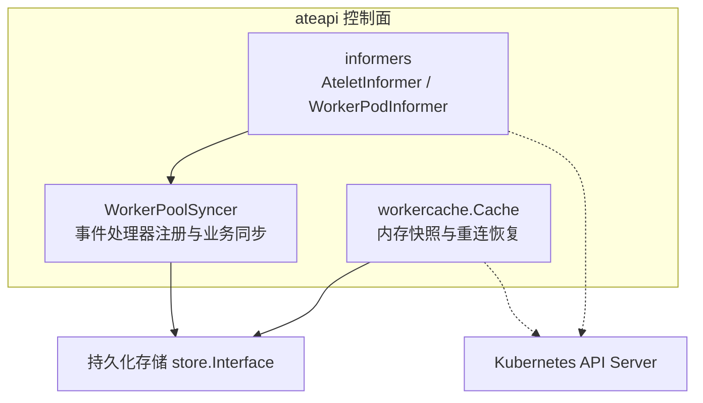
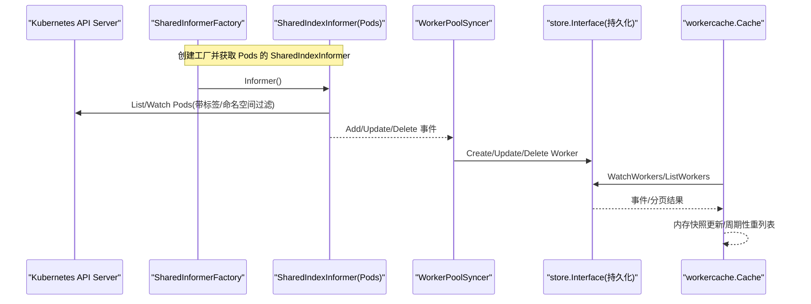
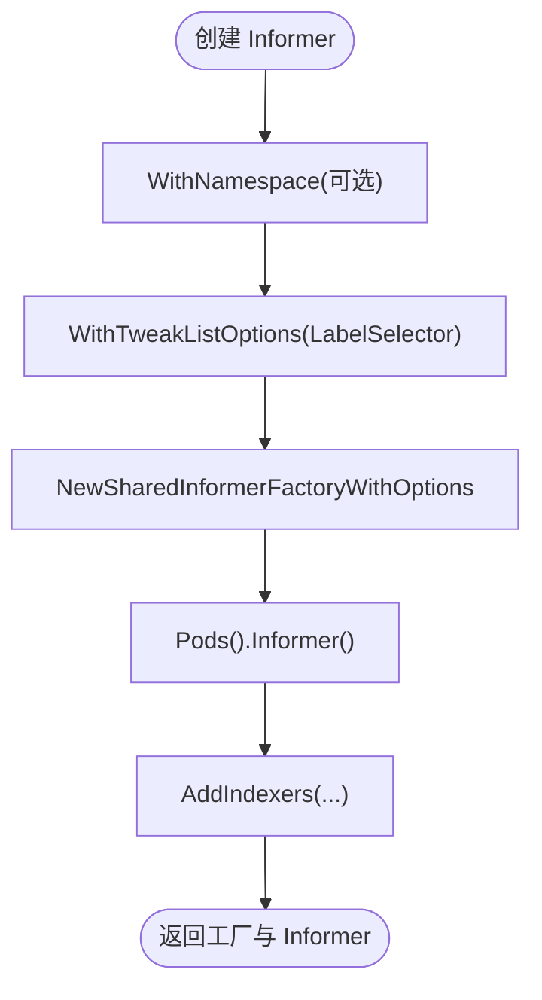
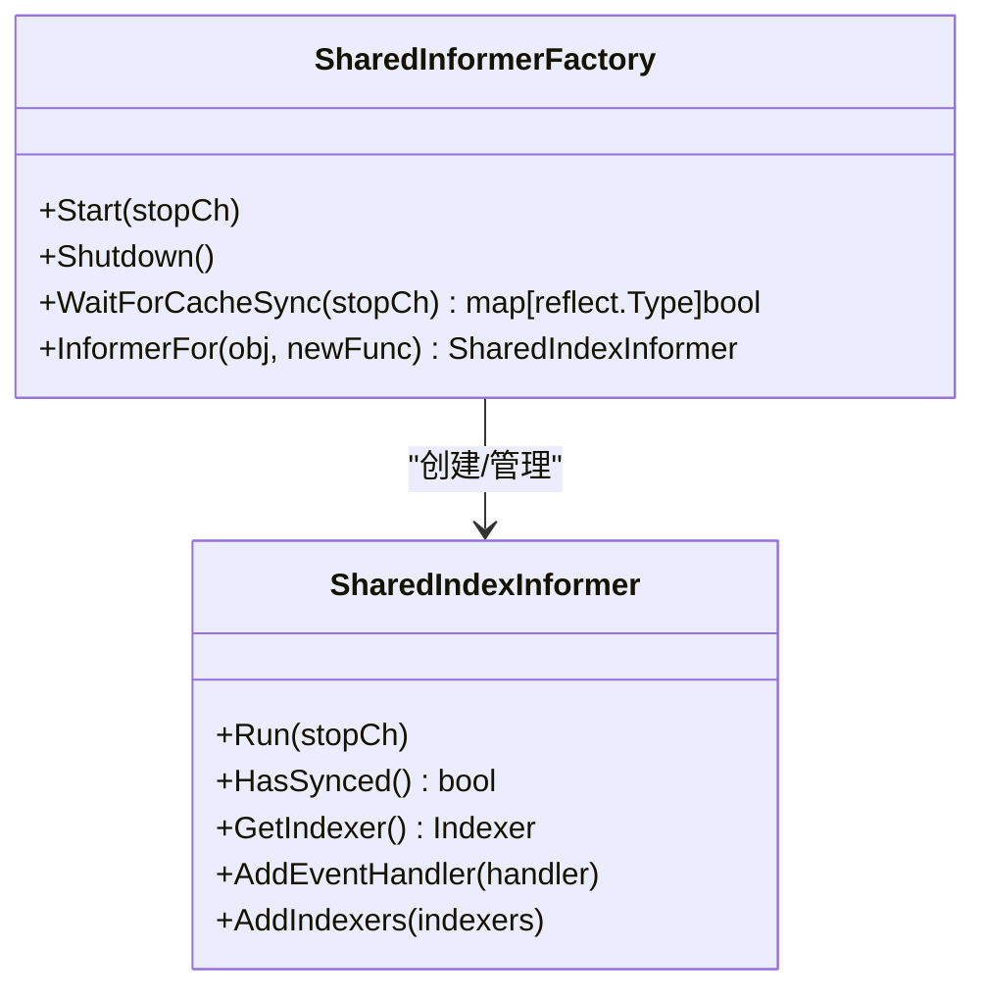
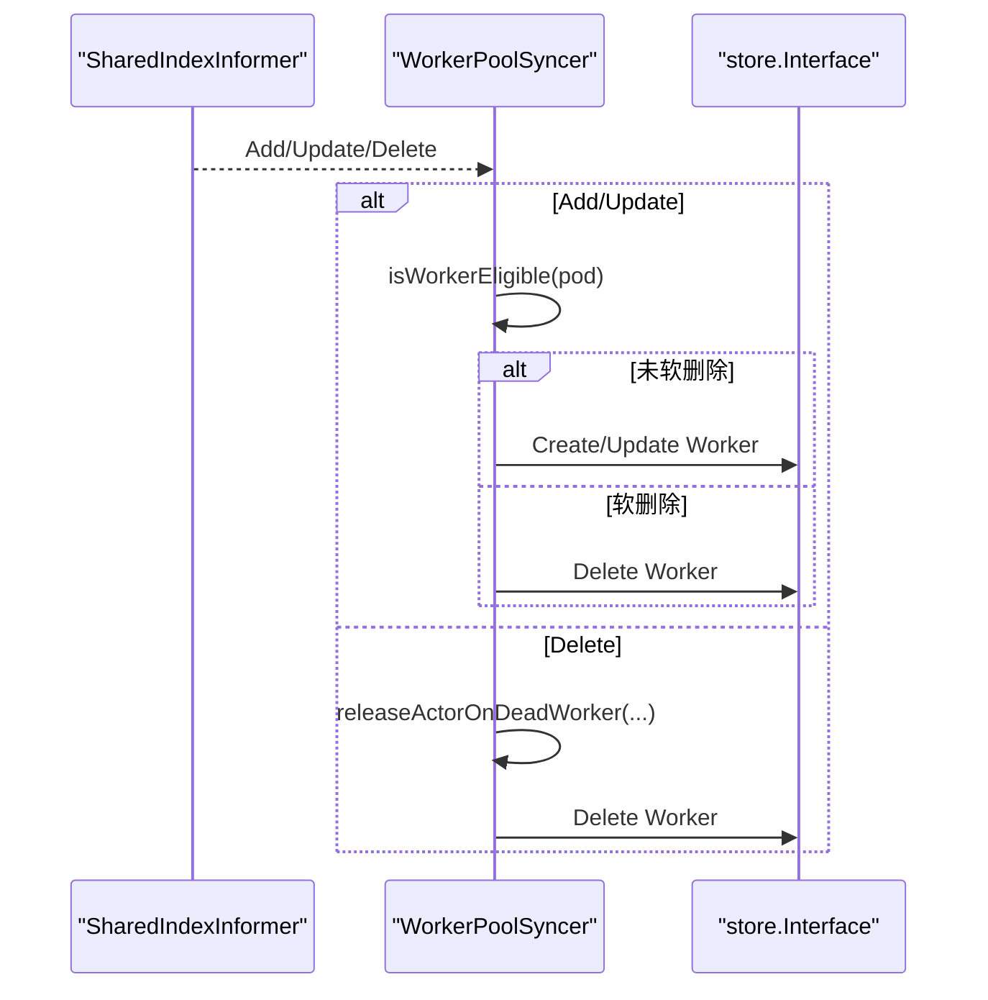
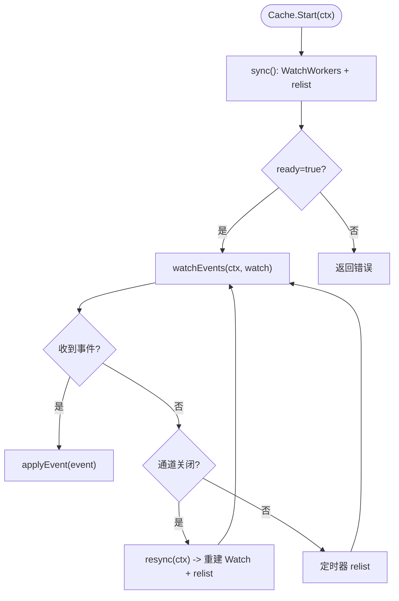
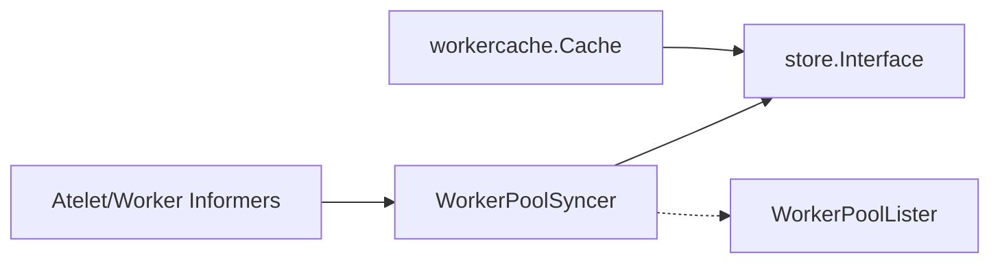

# Informers机制

<cite>
**本文引用的文件**   
- [informer.go](file://cmd/ateapi/internal/controlapi/informer.go)
- [syncer.go](file://cmd/ateapi/internal/controlapi/syncer.go)
- [workercache.go](file://cmd/ateapi/internal/workercache/workercache.go)
- [factory.go](file://pkg/client/informers/externalversions/factory.go)
</cite>

## 目录
1. [简介](#简介)
2. [项目结构](#项目结构)
3. [核心组件](#核心组件)
4. [架构总览](#架构总览)
5. [详细组件分析](#详细组件分析)
6. [依赖关系分析](#依赖关系分析)
7. [性能考量](#性能考量)
8. [故障排查指南](#故障排查指南)
9. [结论](#结论)
10. [附录](#附录)

## 简介
本文聚焦于 ateapi 中 Kubernetes Informers 的实现机制，重点阐述 WorkerPodInformer 与 AteletInformer 的创建、配置与生命周期管理；解释 SharedIndexInformer 的缓存同步、索引构建与增量更新等核心机制；详述事件处理器的注册与回调实现（AddFunc、UpdateFunc、DeleteFunc）；总结资源监听的性能优化策略（选择性监听、标签过滤、命名空间隔离）；给出 Informers 的配置选项与最佳实践（重试机制、错误处理、监控指标），并提供常见问题排查与性能调优建议。

## 项目结构
本主题涉及的核心代码位于 ateapi 控制面模块：
- 控制器侧通过工厂函数创建并配置 Informers，并在启动后等待缓存同步，随后进行初始全量同步与增量事件处理。
- 工作节点缓存 workercache 用于维护 Worker 的内存快照，配合周期性重列表与断线重连恢复一致性。

图表来源
- [informer.go:35-75](file://cmd/ateapi/internal/controlapi/informer.go#L35-L75)
- [syncer.go:33-101](file://cmd/ateapi/internal/controlapi/syncer.go#L33-L101)
- [workercache.go:37-73](file://cmd/ateapi/internal/workercache/workercache.go#L37-L73)

章节来源
- [informer.go:1-76](file://cmd/ateapi/internal/controlapi/informer.go#L1-L76)
- [syncer.go:1-237](file://cmd/ateapi/internal/controlapi/syncer.go#L1-L237)
- [workercache.go:1-200](file://cmd/ateapi/internal/workercache/workercache.go#L1-L200)

## 核心组件
- AteletInformer：为 Atelet Pod 创建 SharedInformerFactory 与 SharedIndexInformer，限定命名空间与标签选择器，并增加按节点名的索引。
- WorkerPodInformer：为 Worker Pod 创建 SharedInformerFactory 与 SharedIndexInformer，设置合理的 resync 周期，使用标签选择器仅监听带 worker-pool 标签的 Pod，并建立“命名空间+名称”和“worker-pool 引用”两个索引。
- WorkerPoolSyncer：注册事件处理器，将 Pod 状态变更同步到持久化层，并在删除时释放绑定 Actor。
- workercache.Cache：维护 Worker 的内存快照，支持 Watch 流式更新、周期性全量重列表与断线指数退避重连。

章节来源
- [informer.go:35-75](file://cmd/ateapi/internal/controlapi/informer.go#L35-L75)
- [syncer.go:33-101](file://cmd/ateapi/internal/controlapi/syncer.go#L33-L101)
- [workercache.go:37-73](file://cmd/ateapi/internal/workercache/workercache.go#L37-L73)

## 架构总览
下图展示了从 Informers 到业务同步与缓存的整体数据流与控制流。

图表来源
- [informer.go:35-75](file://cmd/ateapi/internal/controlapi/informer.go#L35-L75)
- [syncer.go:50-101](file://cmd/ateapi/internal/controlapi/syncer.go#L50-L101)
- [workercache.go:92-127](file://cmd/ateapi/internal/workercache/workercache.go#L92-L127)

## 详细组件分析

### AteletInformer 与 WorkerPodInformer 的创建与配置
- 命名空间隔离：AteletInformer 通过 WithNamespace 限制在 ate-system 命名空间，减少不必要的数据传输与内存占用。
- 标签过滤：两者均通过 WithTweakListOptions 注入 LabelSelector，仅拉取目标 Pod，降低 API Server 压力与客户端缓存体积。
- Resync 周期：WorkerPodInformer 设置了 5 分钟的重同步间隔，有助于在丢失事件或网络抖动后恢复一致性；AteletInformer 使用 0（不主动重同步）。
- 索引构建：
  - AteletInformer：按 NodeName 建索引，便于后续按节点维度查询。
  - WorkerPodInformer：按“命名空间/名称”与“worker-pool 引用”建索引，便于快速定位与聚合。

图表来源
- [informer.go:35-75](file://cmd/ateapi/internal/controlapi/informer.go#L35-L75)
- [factory.go:104-121](file://pkg/client/informers/externalversions/factory.go#L104-L121)

章节来源
- [informer.go:35-75](file://cmd/ateapi/internal/controlapi/informer.go#L35-L75)
- [factory.go:104-121](file://pkg/client/informers/externalversions/factory.go#L104-L121)

### SharedIndexInformer 工作原理（缓存同步、索引构建、增量更新）
- 缓存同步：工厂的 Start 会为每个已创建的 Informer 启动独立 goroutine 调用 Run(stopCh)，内部由 client-go cache 驱动 List/Watch 循环，并将对象写入本地缓存。WaitForCacheSync 可阻塞等待 HasSynced 完成。
- 索引构建：通过 AddIndexers 注册自定义索引键函数，cache 会在对象入缓存时计算索引值，支持后续按索引高效查询。
- 增量更新：API Server 推送的增删改事件被转换为 Add/Update/Delete 回调，依次应用到本地缓存，避免全量拉取。

图表来源
- [factory.go:123-175](file://pkg/client/informers/externalversions/factory.go#L123-L175)
- [informer.go:43-72](file://cmd/ateapi/internal/controlapi/informer.go#L43-L72)

章节来源
- [factory.go:123-175](file://pkg/client/informers/externalversions/factory.go#L123-L175)
- [informer.go:43-72](file://cmd/ateapi/internal/controlapi/informer.go#L43-L72)

### 事件处理器注册与回调逻辑
- 注册方式：WorkerPoolSyncer 通过 AddEventHandler 注册 ResourceEventHandlerFuncs，分别处理 Add、Update、Delete。
- Add/Update：对具备有效 IP 的 Pod 执行 isWorkerEligible 检查，若 Pod 未软删除，则根据 Pod 所属 WorkerPool 信息构造或更新持久化层的 Worker 记录。
- Delete：兼容 DeletedFinalStateUnknown，确保能正确提取 Pod 元信息；先尝试释放绑定 Actor（置为 SUSPENDED 并清空关联字段），再删除持久化层中的 Worker。
- 启动流程：先 WaitForCacheSync 保证缓存就绪，再进行初始全量遍历（GetIndexer().List()）以补齐历史状态。

图表来源
- [syncer.go:50-101](file://cmd/ateapi/internal/controlapi/syncer.go#L50-L101)
- [syncer.go:103-182](file://cmd/ateapi/internal/controlapi/syncer.go#L103-L182)
- [syncer.go:188-236](file://cmd/ateapi/internal/controlapi/syncer.go#L188-L236)

章节来源
- [syncer.go:50-101](file://cmd/ateapi/internal/controlapi/syncer.go#L50-L101)
- [syncer.go:103-182](file://cmd/ateapi/internal/controlapi/syncer.go#L103-L182)
- [syncer.go:188-236](file://cmd/ateapi/internal/controlapi/syncer.go#L188-L236)

### workercache 的工作机制（内存快照与一致性保障）
- 初始化与启动：Start 先执行一次 sync（WatchWorkers + relist 全量拉取），成功后标记 ready，并后台运行 watchEvents。
- 事件处理：watchEvents 监听 Store 的 Worker 事件流，应用 create/update/delete 到内存映射；当通道关闭时触发 resync。
- 周期性重列表：定时 relist 以修复可能的漏事件或状态漂移。
- 断线重连：resync 使用指数退避策略反复尝试重新建立 Watch 并完成全量同步，直至成功或上下文取消。

图表来源
- [workercache.go:65-73](file://cmd/ateapi/internal/workercache/workercache.go#L65-L73)
- [workercache.go:129-180](file://cmd/ateapi/internal/workercache/workercache.go#L129-L180)
- [workercache.go:182-195](file://cmd/ateapi/internal/workercache/workercache.go#L182-L195)

章节来源
- [workercache.go:65-73](file://cmd/ateapi/internal/workercache/workercache.go#L65-L73)
- [workercache.go:129-180](file://cmd/ateapi/internal/workercache/workercache.go#L129-L180)
- [workercache.go:182-195](file://cmd/ateapi/internal/workercache/workercache.go#L182-L195)

## 依赖关系分析
- Informer 与工厂：AteletInformer/WorkerPodInformer 基于 SharedInformerFactory 创建 Pods 的 SharedIndexInformer，并通过 WithNamespace/WithTweakListOptions 实现命名空间与标签过滤。
- 事件处理与持久化：WorkerPoolSyncer 消费 Informer 事件，读写 store.Interface，同时读取 WorkerPool 列表以获取模板与标签信息。
- 内存缓存与持久化：workercache 通过 store.Interface 的 WatchWorkers/ListWorkers 维持内存快照，与 Informer 路径互补，提供 O(1) 读能力与容错恢复。

图表来源
- [informer.go:35-75](file://cmd/ateapi/internal/controlapi/informer.go#L35-L75)
- [syncer.go:33-48](file://cmd/ateapi/internal/controlapi/syncer.go#L33-L48)
- [workercache.go:37-73](file://cmd/ateapi/internal/workercache/workercache.go#L37-L73)

章节来源
- [informer.go:35-75](file://cmd/ateapi/internal/controlapi/informer.go#L35-L75)
- [syncer.go:33-48](file://cmd/ateapi/internal/controlapi/syncer.go#L33-L48)
- [workercache.go:37-73](file://cmd/ateapi/internal/workercache/workercache.go#L37-L73)

## 性能考量
- 选择性监听与标签过滤：
  - AteletInformer 使用 app in (atelet) 的表达式级标签选择器，精准匹配目标 Pod。
  - WorkerPodInformer 使用存在性标签选择器“ate.dev/worker-pool”，避免无关 Pod 进入缓存。
- 命名空间隔离：AteletInformer 限定在 ate-system，显著降低跨命名空间扫描开销。
- Resync 周期：WorkerPodInformer 设置 5 分钟重同步，平衡一致性与负载；AteletInformer 设为 0，适用于静态或低频变更场景。
- 索引设计：
  - by-node：便于按节点维度统计与调度。
  - by-namespace-and-name：唯一键，便于快速定位。
  - by-worker-pool：按池聚合，提升批量操作效率。
- 内存快照与并发读：workercache 使用 RWMutex 保护内存映射，Workers() 返回只读快照，适合高频读取路径。
- 断线恢复与背压：workercache 采用指数退避重连，避免雪崩；周期性 relist 修复漏事件。

章节来源
- [informer.go:35-75](file://cmd/ateapi/internal/controlapi/informer.go#L35-L75)
- [workercache.go:129-180](file://cmd/ateapi/internal/workercache/workercache.go#L129-L180)

## 故障排查指南
- 缓存不同步
  - 现象：启动后无法立即看到预期资源。
  - 排查：确认是否调用 WaitForCacheSync 且 HasSynced 返回 true；检查 Informer 的 LabelSelector 与命名空间是否正确。
  - 参考：同步等待与初始全量遍历逻辑。
- 事件丢失或状态漂移
  - 现象：内存快照与 API 不一致。
  - 排查：观察周期性 relist 是否生效；检查 watch 通道关闭后的 resync 是否成功；关注指数退避日志。
- 删除事件处理异常
  - 现象：删除后仍残留 Worker 记录或 Actor 未释放。
  - 排查：确认 DeleteFunc 中对 DeletedFinalStateUnknown 的处理分支；检查 releaseActorOnDeadWorker 的版本冲突与乐观锁重试。
- 性能瓶颈
  - 现象：CPU/内存偏高或 API 请求过多。
  - 排查：评估 LabelSelector 是否足够精确；适当调整 resync 周期；检查索引是否满足查询需求，避免全表扫描。

章节来源
- [syncer.go:50-101](file://cmd/ateapi/internal/controlapi/syncer.go#L50-L101)
- [workercache.go:129-180](file://cmd/ateapi/internal/workercache/workercache.go#L129-L180)
- [syncer.go:188-236](file://cmd/ateapi/internal/controlapi/syncer.go#L188-L236)

## 结论
ateapi 的 Informers 实现遵循 Kubernetes 生态的最佳实践：通过命名空间与标签选择器进行选择性监听，利用 SharedIndexInformer 的索引能力提升查询效率，结合事件驱动的增量更新与周期性重同步保障最终一致性。WorkerPoolSyncer 将 Pod 状态可靠地同步至持久化层，并在删除时妥善处理 Actor 回收；workercache 提供高性能内存快照与稳健的断线恢复机制。整体方案在可扩展性、一致性与性能之间取得良好平衡。

## 附录

### Informers 配置选项与最佳实践
- 命名空间隔离：优先使用 WithNamespace 缩小监听范围。
- 标签过滤：尽量使用精确的 LabelSelector，必要时使用表达式语法。
- Resync 周期：对频繁变更的资源设置合理周期，对静态资源可设为 0。
- 索引设计：为常用查询维度建立索引，避免运行时全表扫描。
- 启动顺序：先 Start，再 WaitForCacheSync，最后进行初始全量同步。
- 错误处理：对 Delete 事件兼容 DeletedFinalStateUnknown；对持久化失败进行幂等处理与必要重试。
- 监控指标：建议暴露缓存大小、重同步次数、事件处理延迟、重连次数等指标以便观测。

章节来源
- [informer.go:35-75](file://cmd/ateapi/internal/controlapi/informer.go#L35-L75)
- [syncer.go:50-101](file://cmd/ateapi/internal/controlapi/syncer.go#L50-L101)
- [workercache.go:129-180](file://cmd/ateapi/internal/workercache/workercache.go#L129-L180)
