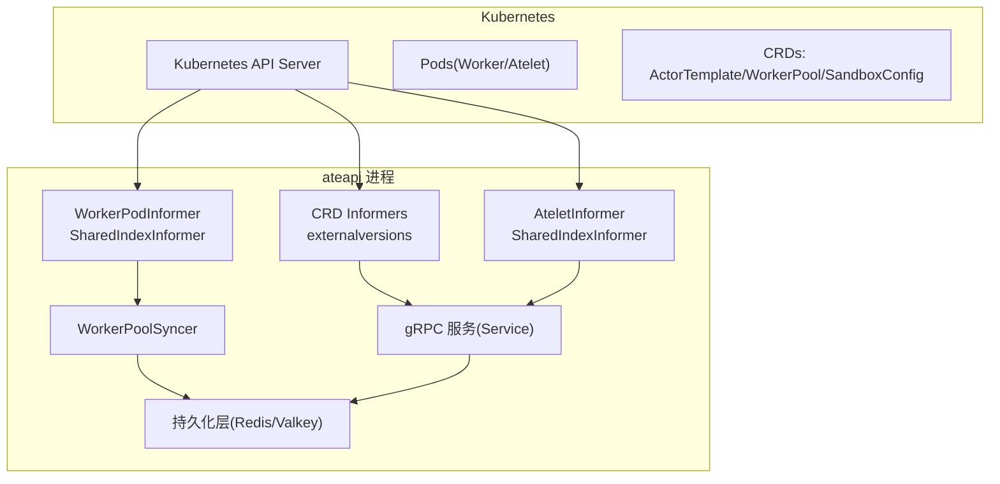
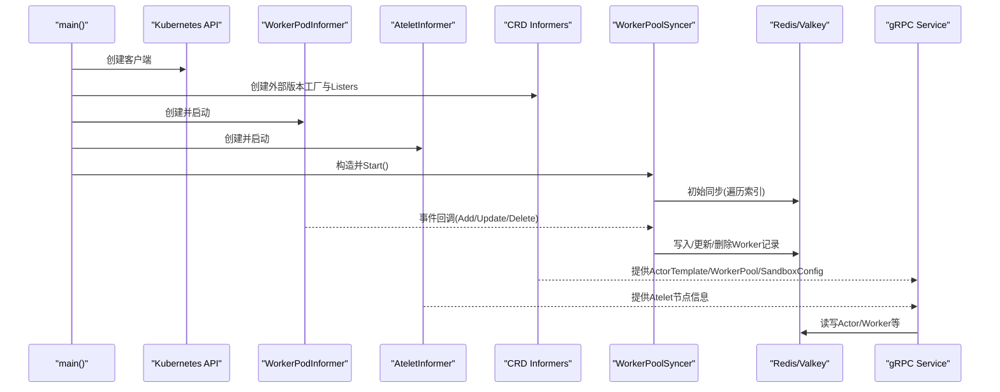
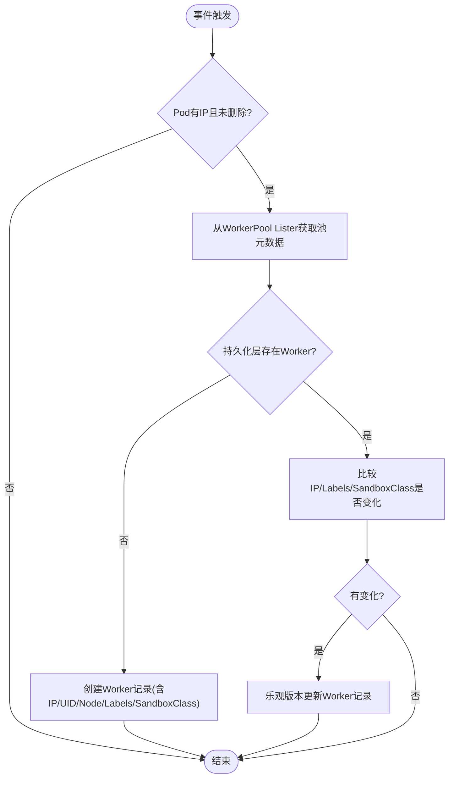
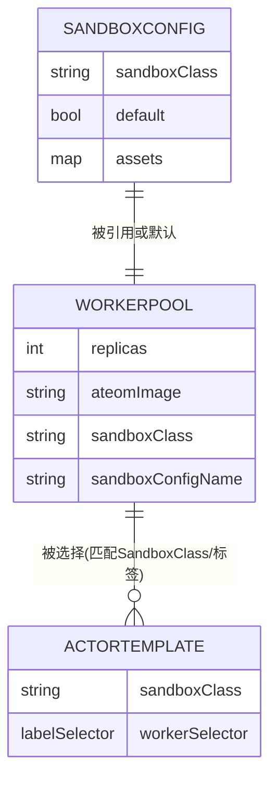
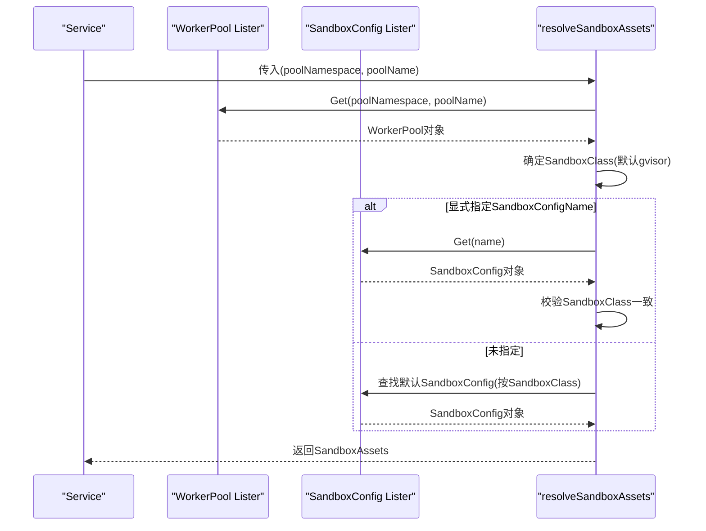
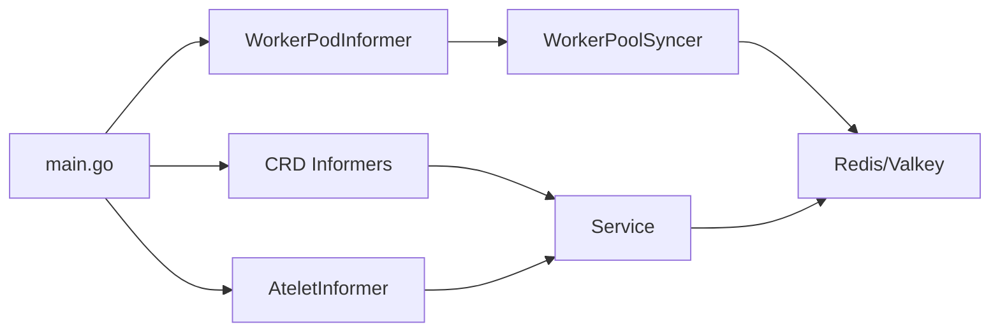

# Kubernetes集成

<cite>
**本文引用的文件**   
- [cmd/ateapi/main.go](file://cmd/ateapi/main.go)
- [cmd/ateapi/internal/controlapi/informer.go](file://cmd/ateapi/internal/controlapi/informer.go)
- [cmd/ateapi/internal/controlapi/syncer.go](file://cmd/ateapi/internal/controlapi/syncer.go)
- [pkg/api/v1alpha1/workerpool_types.go](file://pkg/api/v1alpha1/workerpool_types.go)
- [pkg/api/v1alpha1/actortemplate_types.go](file://pkg/api/v1alpha1/actortemplate_types.go)
- [pkg/api/v1alpha1/sandboxconfig_types.go](file://pkg/api/v1alpha1/sandboxconfig_types.go)
- [cmd/ateapi/internal/controlapi/sandbox_assets.go](file://cmd/ateapi/internal/controlapi/sandbox_assets.go)
- [cmd/atecontroller/internal/controllers/workerpool_controller.go](file://cmd/atecontroller/internal/controllers/workerpool_controller.go)
- [pkg/client/informers/externalversions/factory.go](file://pkg/client/informers/externalversions/factory.go)
</cite>

## 目录
1. [简介](#简介)
2. [项目结构](#项目结构)
3. [核心组件](#核心组件)
4. [架构总览](#架构总览)
5. [详细组件分析](#详细组件分析)
6. [依赖关系分析](#依赖关系分析)
7. [性能与调优](#性能与调优)
8. [故障排查指南](#故障排查指南)
9. [结论](#结论)

## 简介
本章节聚焦于 ateapi 与 Kubernetes 的深度集成实现，重点说明 Informers 的使用模式、资源监听机制、事件处理流程；阐述 WorkerPodInformer 与 AteletInformer 的实现原理（索引构建、缓存同步、增量更新）；详解 WorkerPoolSyncer 的资源同步、状态协调与冲突解决策略；解释与 CRD 资源的交互方式（ActorTemplate、WorkerPool、SandboxConfig）；并提供配置选项、最佳实践、常见问题排查与性能调优建议。

## 项目结构
ateapi 作为控制面服务，通过 client-go 的 SharedInformerFactory 订阅两类 Pod：
- Worker 工作节点 Pod（带标签“ate.dev/worker-pool”）
- Atelet 系统 Pod（位于 ate-system 命名空间，标签 app=atelet）

同时，ateapi 使用外部版本工厂 externalversions 订阅自定义 CRD（ActorTemplate、WorkerPool、SandboxConfig），并通过 Listers 提供本地缓存读取能力。WorkerPoolSyncer 将 Pod 生命周期事件转换为内部持久化层（Redis/Valkey）中的 Worker 记录，并维护 Actor 绑定状态的一致性。



图表来源
- [cmd/ateapi/main.go:133-155](file://cmd/ateapi/main.go#L133-L155)
- [cmd/ateapi/internal/controlapi/informer.go:35-75](file://cmd/ateapi/internal/controlapi/informer.go#L35-L75)
- [pkg/client/informers/externalversions/factory.go:233-261](file://pkg/client/informers/externalversions/factory.go#L233-L261)

章节来源
- [cmd/ateapi/main.go:133-155](file://cmd/ateapi/main.go#L133-L155)
- [cmd/ateapi/internal/controlapi/informer.go:35-75](file://cmd/ateapi/internal/controlapi/informer.go#L35-L75)
- [pkg/client/informers/externalversions/factory.go:233-261](file://pkg/client/informers/externalversions/factory.go#L233-L261)

## 核心组件
- Informers 与 Indexers
  - AteletInformer：按命名空间与标签过滤 Atelet Pod，建立 by-node 索引，便于按节点快速查找运行时的 atelet 实例。
  - WorkerPodInformer：按标签过滤所有 Worker Pod，建立 by-namespace-and-name 与 by-worker-pool 两个索引，支持按池聚合查询。
- WorkerPoolSyncer
  - 监听 Worker Pod 的 Add/Update/Delete 事件，结合 WorkerPool Lister 获取池元数据，将 Pod 状态同步到持久化层，并在删除时释放绑定的 Actor。
- CRD Lister
  - 通过 externalversions 工厂创建 ActorTemplate、WorkerPool、SandboxConfig 的 Lister，供服务在请求路径中读取模板、池与沙箱配置。

章节来源
- [cmd/ateapi/internal/controlapi/informer.go:35-75](file://cmd/ateapi/internal/controlapi/informer.go#L35-L75)
- [cmd/ateapi/internal/controlapi/syncer.go:33-101](file://cmd/ateapi/internal/controlapi/syncer.go#L33-L101)
- [cmd/ateapi/main.go:133-155](file://cmd/ateapi/main.go#L133-L155)

## 架构总览
ateapi 启动流程关键步骤：
- 初始化日志、追踪、指标
- 连接 Redis/Valkey 并启动 worker 缓存
- 创建 Kubernetes Clientset 与 CRD Clientset
- 构建 CRD Informers 与 Pod Informers
- 启动 WorkerPoolSyncer 并等待缓存同步
- 构造 gRPC 服务并注册处理器



图表来源
- [cmd/ateapi/main.go:116-155](file://cmd/ateapi/main.go#L116-L155)
- [cmd/ateapi/internal/controlapi/syncer.go:50-101](file://cmd/ateapi/internal/controlapi/syncer.go#L50-L101)

章节来源
- [cmd/ateapi/main.go:116-155](file://cmd/ateapi/main.go#L116-L155)

## 详细组件分析

### Informers 与索引构建
- AteletInformer
  - 命名空间限制为 ate-system
  - 标签选择器 app in (atelet)
  - 索引 by-node：以 Pod.Spec.NodeName 为键，便于按节点路由或统计
- WorkerPodInformer
  - 全局范围，标签选择器包含 ate.dev/worker-pool
  - 索引 by-namespace-and-name：用于唯一标识 Pod
  - 索引 by-worker-pool：以 namespace/name 形式的池引用为键，便于按池聚合

```mermaid
classDiagram
class AteletInformer {
+factory : SharedInformerFactory
+informer : SharedIndexInformer
+indexers : ["by-node"]
}
class WorkerPodInformer {
+factory : SharedInformerFactory
+informer : SharedIndexInformer
+indexers : ["by-namespace-and-name","by-worker-pool"]
}
AteletInformer --> "uses" k8s.io/client-go/informers.SharedInformerFactory
WorkerPodInformer --> "uses" k8s.io/client-go/informers.SharedInformerFactory
```

图表来源
- [cmd/ateapi/internal/controlapi/informer.go:35-75](file://cmd/ateapi/internal/controlapi/informer.go#L35-L75)

章节来源
- [cmd/ateapi/internal/controlapi/informer.go:35-75](file://cmd/ateapi/internal/controlapi/informer.go#L35-L75)

### WorkerPoolSyncer 工作机制
- 事件处理
  - Add/Update：若 Pod 具备 IP 且未被标记删除，则根据池元数据创建或更新持久化层的 Worker 记录
  - Delete：释放与 Worker 绑定的 Actor（回退至 SUSPENDED），并从持久化层删除 Worker
- 初始同步
  - 等待缓存同步后，遍历索引中的所有 Pod，逐个执行同步逻辑
- 冲突与一致性
  - 使用乐观版本字段进行更新，避免并发覆盖
  - 对已软删除的 Pod 优先清理关联 Actor，再删除 Worker 记录



图表来源
- [cmd/ateapi/internal/controlapi/syncer.go:103-186](file://cmd/ateapi/internal/controlapi/syncer.go#L103-L186)

章节来源
- [cmd/ateapi/internal/controlapi/syncer.go:50-101](file://cmd/ateapi/internal/controlapi/syncer.go#L50-L101)
- [cmd/ateapi/internal/controlapi/syncer.go:103-186](file://cmd/ateapi/internal/controlapi/syncer.go#L103-L186)

### 与 CRD 资源的交互
- WorkerPool
  - 定义副本数、镜像、调度与资源模板、SandboxClass、SandboxConfig 引用等
  - Controller 负责将其映射为 Deployment，并同步 status.replicas
- ActorTemplate
  - 描述容器镜像、环境变量、卷挂载、快照策略、SandboxClass、WorkerSelector 等
  - 用于运行时选择合适的工作池与沙箱配置
- SandboxConfig
  - 集群级配置，声明不同架构下的沙箱二进制资产（如 runsc、microvm 内核/固件）
  - 支持默认配置标记，WorkerPool 可显式指定或继承默认



图表来源
- [pkg/api/v1alpha1/workerpool_types.go:54-89](file://pkg/api/v1alpha1/workerpool_types.go#L54-L89)
- [pkg/api/v1alpha1/actortemplate_types.go:283-340](file://pkg/api/v1alpha1/actortemplate_types.go#L283-L340)
- [pkg/api/v1alpha1/sandboxconfig_types.go:52-79](file://pkg/api/v1alpha1/sandboxconfig_types.go#L52-L79)

章节来源
- [pkg/api/v1alpha1/workerpool_types.go:54-89](file://pkg/api/v1alpha1/workerpool_types.go#L54-L89)
- [pkg/api/v1alpha1/actortemplate_types.go:283-340](file://pkg/api/v1alpha1/actortemplate_types.go#L283-L340)
- [pkg/api/v1alpha1/sandboxconfig_types.go:52-79](file://pkg/api/v1alpha1/sandboxconfig_types.go#L52-L79)
- [cmd/atecontroller/internal/controllers/workerpool_controller.go:73-112](file://cmd/atecontroller/internal/controllers/workerpool_controller.go#L73-L112)

### 沙箱资产解析流程
- resolveSandboxAssets 依据 WorkerPool 的 SandboxClass 与可选的 SandboxConfigName 决定最终使用的沙箱配置
- 若未显式指定，则选择对应 SandboxClass 的默认 SandboxConfig
- 校验所选 SandboxConfig 的 SandboxClass 必须与 WorkerPool 一致



图表来源
- [cmd/ateapi/internal/controlapi/sandbox_assets.go:26-63](file://cmd/ateapi/internal/controlapi/sandbox_assets.go#L26-L63)

章节来源
- [cmd/ateapi/internal/controlapi/sandbox_assets.go:26-63](file://cmd/ateapi/internal/controlapi/sandbox_assets.go#L26-L63)

## 依赖关系分析
- ateapi 主进程依赖
  - Kubernetes Core V1 Pods（通过 informers）
  - CRD v1alpha1（ActorTemplate、WorkerPool、SandboxConfig，通过 externalversions）
  - Redis/Valkey（持久化层）
- 组件耦合
  - WorkerPoolSyncer 强依赖 WorkerPodInformer 与 WorkerPool Lister
  - Service 依赖多个 Lister 与 Atelet 索引进行路由与资源解析
- 外部依赖
  - controller-runtime 控制器（atecontroller）仅管理 WorkerPool 对应的 Deployment 与 status 同步，不直接操作 ateapi 的内部状态



图表来源
- [cmd/ateapi/main.go:133-155](file://cmd/ateapi/main.go#L133-L155)
- [cmd/ateapi/internal/controlapi/informer.go:35-75](file://cmd/ateapi/internal/controlapi/informer.go#L35-L75)
- [pkg/client/informers/externalversions/factory.go:233-261](file://pkg/client/informers/externalversions/factory.go#L233-L261)

章节来源
- [cmd/ateapi/main.go:133-155](file://cmd/ateapi/main.go#L133-L155)
- [pkg/client/informers/externalversions/factory.go:233-261](file://pkg/client/informers/externalversions/factory.go#L233-L261)

## 性能与调优
- Informer 重同步周期
  - WorkerPodInformer 设置 5 分钟重同步，适合大规模 Pod 场景，降低 API Server 压力
  - AteletInformer 设置为 0（按需重同步），适用于小范围系统命名空间
- 索引设计
  - by-worker-pool 索引支持按池聚合查询，减少全量扫描
  - by-node 索引便于按节点维度进行负载均衡与故障隔离
- 事件去抖与幂等
  - syncWorkerToStore 基于现有记录差异判断是否需要更新，避免不必要的写放大
  - 删除路径先释放 Actor 再删除 Worker，保证一致性
- 缓存预热
  - 启动后等待缓存同步，再进行初始同步，确保首次请求命中本地缓存
- 建议
  - 合理设置 WorkerPool 的副本数与标签粒度，避免单池过大导致索引膨胀
  - 监控 API Server 列表/watch QPS，必要时调整重同步周期或缩小监听范围
  - 关注 Redis/Valkey 写入热点，必要时引入分片或批量合并策略

[本节为通用指导，无需特定文件来源]

## 故障排查指南
- 常见现象
  - Worker 记录缺失：检查 Pod 是否具备 IP 且标签正确；确认 WorkerPool 是否存在
  - Actor 绑定异常：Pod 删除后 Actor 应回退至 SUSPENDED；若仍指向已删除 Pod，需人工干预恢复
  - 沙箱配置不一致：WorkerPool 的 SandboxClass 与 SandboxConfig 不匹配会导致解析失败
- 定位步骤
  - 查看 WorkerPoolSyncer 日志，确认事件处理与同步结果
  - 核对 WorkerPodInformer 索引项是否符合预期（by-worker-pool）
  - 验证 CRD 资源（WorkerPool、SandboxConfig）的 spec 与默认值
- 恢复建议
  - 对于残留绑定，调用暂停/恢复接口重置 Actor 状态
  - 修正 SandboxConfig 的 SandboxClass 或 WorkerPool 的引用
  - 重启 ateapi 以重新触发初始同步

章节来源
- [cmd/ateapi/internal/controlapi/syncer.go:188-236](file://cmd/ateapi/internal/controlapi/syncer.go#L188-L236)
- [cmd/ateapi/internal/controlapi/sandbox_assets.go:26-63](file://cmd/ateapi/internal/controlapi/sandbox_assets.go#L26-L63)

## 结论
ateapi 通过 Informers 与 Lister 的组合，实现了高效、可扩展的 Kubernetes 资源监听与本地缓存访问。WorkerPoolSyncer 将 Pod 生命周期事件转化为稳定的内部状态，配合乐观版本更新与 Actor 释放策略，保障了一致性与可用性。CRD 资源（ActorTemplate、WorkerPool、SandboxConfig）提供了灵活的运行时编排能力，使系统能够在多种沙箱环境间平滑切换。通过合理的索引设计与重同步策略，系统在大规模集群下仍能保持良好性能。

[本节为总结性内容，无需特定文件来源]
