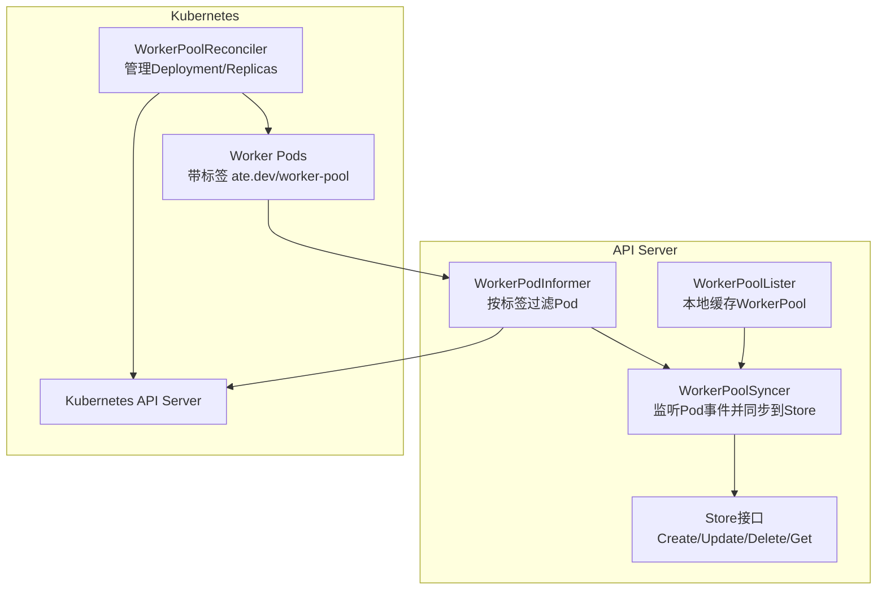
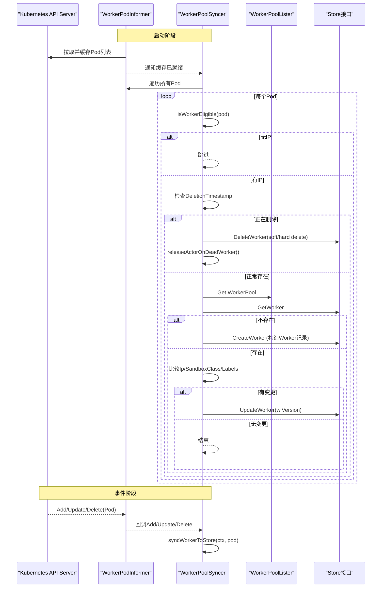
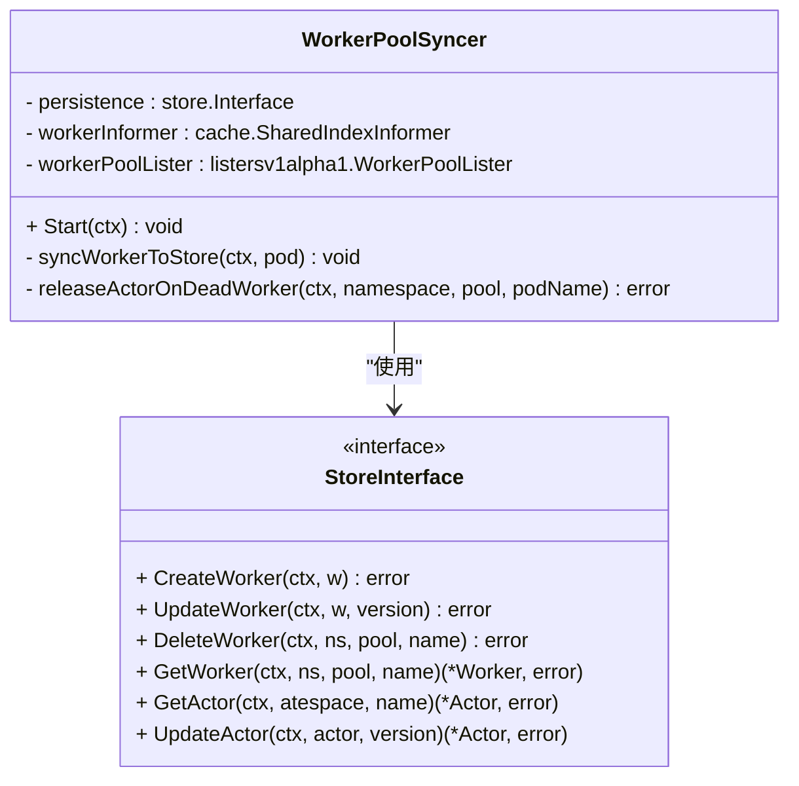
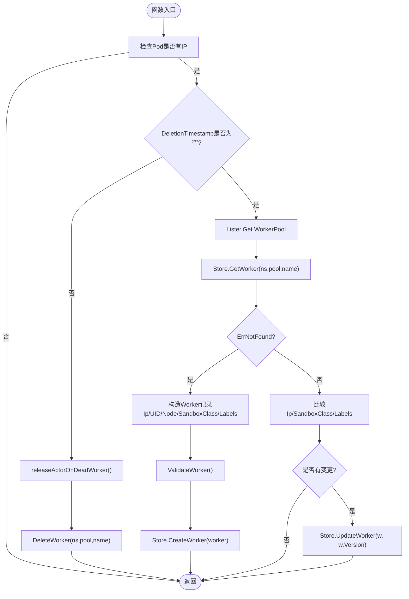
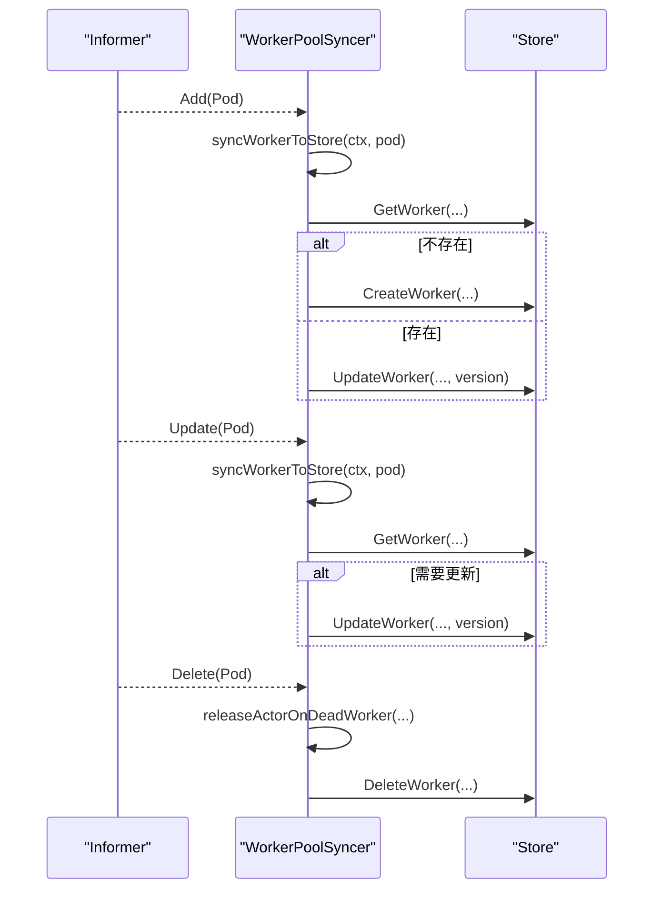
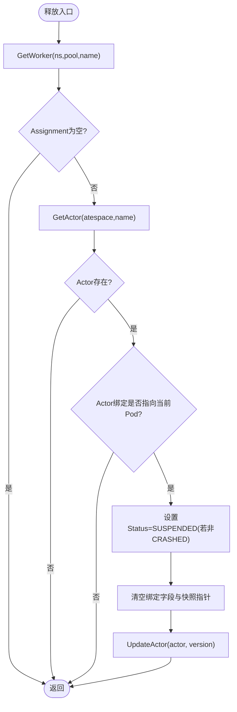
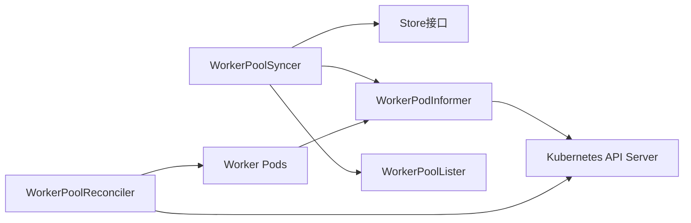

# WorkerPool同步器

<cite>
**本文引用的文件**
- [syncer.go](file://cmd/ateapi/internal/controlapi/syncer.go)
- [informer.go](file://cmd/ateapi/internal/controlapi/informer.go)
- [workerpool_controller.go](file://cmd/atecontroller/internal/controllers/workerpool_controller.go)
- [workerpool_types.go](file://pkg/api/v1alpha1/workerpool_types.go)
- [store.go](file://cmd/ateapi/internal/store/store.go)
- [syncer_test.go](file://cmd/ateapi/internal/controlapi/syncer_test.go)
</cite>

## 目录
1. [简介](#简介)
2. [项目结构](#项目结构)
3. [核心组件](#核心组件)
4. [架构总览](#架构总览)
5. [详细组件分析](#详细组件分析)
6. [依赖关系分析](#依赖关系分析)
7. [性能与并发控制](#性能与并发控制)
8. [故障排查指南](#故障排查指南)
9. [结论](#结论)

## 简介
WorkerPoolSyncer 是 ATE API Server 中的一个后台同步器，负责将 Kubernetes 中由 WorkerPool 控制器创建的 Worker Pod 的状态镜像到持久化存储（Store）中。其职责包括：
- 监听 Worker Pod 的新增、更新、删除事件
- 将 Pod 的运行时信息（IP、节点、沙箱类型等）映射为 Store 中的 Worker 记录
- 在 Worker 失效时释放与其绑定的 Actor，重置状态并清理绑定字段
- 启动时进行全量初始同步，保证 Store 与集群实际状态一致

该同步器通过 Kubernetes Informer 获取事件，结合本地 Lister 读取 WorkerPool 配置，最终调用 Store 接口完成数据一致性维护。

## 项目结构
本功能涉及以下关键位置：
- 同步器实现：cmd/ateapi/internal/controlapi/syncer.go
- Informer 构建与索引：cmd/ateapi/internal/controlapi/informer.go
- WorkerPool 控制器（创建 Deployment 驱动 Pod 生命周期）：cmd/atecontroller/internal/controllers/workerpool_controller.go
- WorkerPool CRD 定义：pkg/api/v1alpha1/workerpool_types.go
- Store 接口与错误语义：cmd/ateapi/internal/store/store.go
- 同步器行为测试用例：cmd/ateapi/internal/controlapi/syncer_test.go

图表来源
- [syncer.go:50-101](file://cmd/ateapi/internal/controlapi/syncer.go#L50-L101)
- [informer.go:53-75](file://cmd/ateapi/internal/controlapi/informer.go#L53-L75)
- [workerpool_controller.go:73-112](file://cmd/atecontroller/internal/controllers/workerpool_controller.go#L73-L112)
- [workerpool_types.go:54-89](file://pkg/api/v1alpha1/workerpool_types.go#L54-L89)

章节来源
- [syncer.go:50-101](file://cmd/ateapi/internal/controlapi/syncer.go#L50-L101)
- [informer.go:53-75](file://cmd/ateapi/internal/controlapi/informer.go#L53-L75)
- [workerpool_controller.go:73-112](file://cmd/atecontroller/internal/controllers/workerpool_controller.go#L73-L112)
- [workerpool_types.go:54-89](file://pkg/api/v1alpha1/workerpool_types.go#L54-L89)

## 核心组件
- WorkerPoolSyncer：接收 Pod 事件，协调 Worker 记录的创建、更新、删除；在 Pod 软删除或硬删除时释放关联 Actor。
- WorkerPodInformer：基于标签选择器“ate.dev/worker-pool”过滤 Worker Pod，提供 SharedIndexInformer 与自定义索引。
- WorkerPoolLister：本地缓存 WorkerPool 资源，用于读取 SandboxClass 与 Labels 等元数据。
- Store 接口：提供 CreateWorker/UpdateWorker/DeleteWorker/GetWorker 等操作，支持版本冲突重试语义。

章节来源
- [syncer.go:35-48](file://cmd/ateapi/internal/controlapi/syncer.go#L35-L48)
- [informer.go:53-75](file://cmd/ateapi/internal/controlapi/informer.go#L53-L75)
- [workerpool_types.go:54-89](file://pkg/api/v1alpha1/workerpool_types.go#L54-L89)
- [store.go](file://cmd/ateapi/internal/store/store.go)

## 架构总览
WorkerPoolSyncer 的工作流如下：
- 启动阶段：等待 Informer 缓存同步后，遍历所有已知的 Worker Pod，执行一次初始同步。
- 事件处理：新增/更新/删除 Pod 时触发回调，进入 syncWorkerToStore 流程。
- 状态协调：根据 Pod 是否具备 IP、是否处于 DeletionTimestamp、是否存在于 Store 来决定创建、更新或删除 Worker 记录。
- Actor 释放：当 Pod 被删除或即将删除时，尝试将绑定的 Actor 重置为 SUSPENDED，并清空绑定字段。

图表来源
- [syncer.go:50-101](file://cmd/ateapi/internal/controlapi/syncer.go#L50-L101)
- [syncer.go:103-182](file://cmd/ateapi/internal/controlapi/syncer.go#L103-L182)
- [informer.go:53-75](file://cmd/ateapi/internal/controlapi/informer.go#L53-L75)

## 详细组件分析

### WorkerPoolSyncer 类与方法
- Start：注册事件处理器，并在缓存就绪后进行初始全量同步。
- syncWorkerToStore：核心同步逻辑，包含筛选、删除分支、创建与更新分支。
- releaseActorOnDeadWorker：在 Worker 失效时释放 Actor，重置状态与绑定字段。

图表来源
- [syncer.go:35-48](file://cmd/ateapi/internal/controlapi/syncer.go#L35-L48)
- [syncer.go:50-101](file://cmd/ateapi/internal/controlapi/syncer.go#L50-L101)
- [syncer.go:103-182](file://cmd/ateapi/internal/controlapi/syncer.go#L103-L182)
- [syncer.go:202-236](file://cmd/ateapi/internal/controlapi/syncer.go#L202-L236)
- [store.go](file://cmd/ateapi/internal/store/store.go)

章节来源
- [syncer.go:50-101](file://cmd/ateapi/internal/controlapi/syncer.go#L50-L101)
- [syncer.go:103-182](file://cmd/ateapi/internal/controlapi/syncer.go#L103-L182)
- [syncer.go:202-236](file://cmd/ateapi/internal/controlapi/syncer.go#L202-L236)

### WorkerPod 到 Store 的同步流程
- 筛选条件：仅当 Pod.Status.PodIP 非空时才视为有效 Worker。
- 删除分支：若 Pod.DeletionTimestamp 非空，则先尝试释放 Actor，再删除 Store 中的 Worker 记录。
- 新建分支：若 Store 中不存在对应 Worker，则从 Pod 与 WorkerPool 构造 Worker 记录并写入 Store。
- 更新分支：比较 Ip、SandboxClass、Labels 三个关键字段，任一变化则调用 UpdateWorker，并传入当前 Version 以支持乐观锁。

图表来源
- [syncer.go:103-182](file://cmd/ateapi/internal/controlapi/syncer.go#L103-L182)

章节来源
- [syncer.go:103-182](file://cmd/ateapi/internal/controlapi/syncer.go#L103-L182)

### 事件处理逻辑
- 新增 Worker：Pod 加入且具备 IP，触发 AddFunc，进入 syncWorkerToStore，若 Store 不存在则创建 Worker。
- 更新 Worker：Pod 状态变化（如 IP 分配、SandboxClass 或 Labels 变更），触发 UpdateFunc，进入 syncWorkerToStore，必要时更新 Worker。
- 删除 Worker：Pod 删除或软删除，触发 DeleteFunc，先尝试释放 Actor，再删除 Store 中的 Worker。

图表来源
- [syncer.go:50-101](file://cmd/ateapi/internal/controlapi/syncer.go#L50-L101)
- [syncer.go:103-182](file://cmd/ateapi/internal/controlapi/syncer.go#L103-L182)

章节来源
- [syncer.go:50-101](file://cmd/ateapi/internal/controlapi/syncer.go#L50-L101)
- [syncer.go:103-182](file://cmd/ateapi/internal/controlapi/syncer.go#L103-L182)

### Worker 状态与 Kubernetes Pod 状态的映射关系
- IP 地址：Worker.Ip 来源于 Pod.Status.PodIP。
- 节点信息：Worker.NodeName 来源于 Pod.Spec.NodeName。
- 沙箱类型：Worker.SandboxClass 来源于 WorkerPool.Spec.SandboxClass。
- 标签：Worker.Labels 来源于 WorkerPool.GetLabels()。
- 唯一标识：Worker.WorkerPodUid 来源于 Pod.UID。

章节来源
- [syncer.go:131-140](file://cmd/ateapi/internal/controlapi/syncer.go#L131-L140)
- [workerpool_types.go:70-89](file://pkg/api/v1alpha1/workerpool_types.go#L70-L89)

### Actor 在 Worker 失效时的释放机制
- 触发时机：Pod 软删除（DeletionTimestamp 非空）或硬删除（DeleteFunc）。
- 动作：
  - 查找 Worker 对应的 Assignment，定位 Actor。
  - 若 Actor 指向当前 Pod，则将状态置为 SUSPENDED（除非已是 CRASHED），并清空 AteomPodNamespace/AteomPodName/AteomPodIp/InProgressSnapshot/WorkerPoolName。
  - 使用乐观版本更新 Actor，忽略 ErrPersistenceRetry 以外的错误。
- 设计说明：此操作为尽力而为，后续仍会删除 Worker；若失败可能导致 Actor 悬挂，需人工干预。

图表来源
- [syncer.go:202-236](file://cmd/ateapi/internal/controlapi/syncer.go#L202-L236)

章节来源
- [syncer.go:202-236](file://cmd/ateapi/internal/controlapi/syncer.go#L202-L236)

### 版本控制与冲突解决
- Worker 更新：调用 UpdateWorker 时传入 w.Version，利用乐观锁避免并发覆盖。
- Actor 更新：调用 UpdateActor 时传入 actor.Metadata.Version，忽略 ErrPersistenceRetry 表示可重试的持久层冲突。
- 删除路径：删除 Worker 前优先释放 Actor，确保状态一致性。

章节来源
- [syncer.go:177-181](file://cmd/ateapi/internal/controlapi/syncer.go#L177-L181)
- [syncer.go:232-235](file://cmd/ateapi/internal/controlapi/syncer.go#L232-L235)

## 依赖关系分析
- WorkerPoolSyncer 依赖：
  - Store 接口：读写 Worker 与 Actor 数据。
  - WorkerPodInformer：提供 Pod 事件与缓存。
  - WorkerPoolLister：提供 WorkerPool 配置（SandboxClass、Labels）。
- Informer 配置：
  - 标签选择器：ate.dev/worker-pool，仅关注 Worker Pod。
  - 自定义索引：byNamespaceAndName、byWorkerPool，便于高效查询。
- WorkerPool 控制器：
  - 根据 WorkerPool 的 Replicas 创建/更新 Deployment，从而驱动 Pod 生命周期。

图表来源
- [syncer.go:50-101](file://cmd/ateapi/internal/controlapi/syncer.go#L50-L101)
- [informer.go:53-75](file://cmd/ateapi/internal/controlapi/informer.go#L53-L75)
- [workerpool_controller.go:73-112](file://cmd/atecontroller/internal/controllers/workerpool_controller.go#L73-L112)

章节来源
- [syncer.go:50-101](file://cmd/ateapi/internal/controlapi/syncer.go#L50-L101)
- [informer.go:53-75](file://cmd/ateapi/internal/controlapi/informer.go#L53-L75)
- [workerpool_controller.go:73-112](file://cmd/atecontroller/internal/controllers/workerpool_controller.go#L73-L112)

## 性能与并发控制
- 事件处理模型：单 goroutine 顺序处理事件，避免同一 Pod 的多事件并发竞争。
- 初始同步：缓存就绪后一次性遍历所有 Pod，减少热路径上的不一致窗口。
- 选择性更新：仅在 Ip、SandboxClass、Labels 发生变化时调用 UpdateWorker，降低写放大。
- 乐观锁：通过 Version 字段避免并发覆盖，提升一致性。
- 建议调优：
  - 合理设置 Informer 的 resyncPeriod（默认 5 分钟），平衡实时性与负载。
  - 监控 Store 的 UpdateWorker 冲突率，必要时引入指数退避重试策略。
  - 对大量 Pod 场景，考虑增加日志采样与指标上报，避免 I/O 抖动。

[本节为通用指导，不直接分析具体文件]

## 故障排查指南
- 现象：Worker 未出现在 Store
  - 检查 Pod 是否具备 IP（isWorkerEligible 判断）
  - 确认 Pod 标签包含 ate.dev/worker-pool
  - 查看 Informer 是否成功缓存与事件回调
- 现象：Worker 状态未更新
  - 核对 Ip、SandboxClass、Labels 是否确实发生变化
  - 检查 Store 的 UpdateWorker 是否返回错误
- 现象：Actor 未被释放
  - 确认 Pod 是否进入 DeletionTimestamp 或被删除
  - 检查 releaseActorOnDeadWorker 是否成功更新 Actor 状态
  - 观察是否存在并发 SuspendActor 导致指针已被清除
- 调试方法：
  - 启用详细日志，关注“Syncer: ...”相关条目
  - 使用测试用例思路验证：创建 Pod -> 等待 Store 出现 -> 修改状态 -> 删除 Pod -> 验证 Store 清理

章节来源
- [syncer.go:103-182](file://cmd/ateapi/internal/controlapi/syncer.go#L103-L182)
- [syncer.go:202-236](file://cmd/ateapi/internal/controlapi/syncer.go#L202-L236)
- [syncer_test.go:68-193](file://cmd/ateapi/internal/controlapi/syncer_test.go#L68-L193)
- [syncer_test.go:195-289](file://cmd/ateapi/internal/controlapi/syncer_test.go#L195-L289)

## 结论
WorkerPoolSyncer 通过事件驱动的 Informer 机制，将 Kubernetes 中 Worker Pod 的运行态可靠地镜像到 Store，并在 Worker 失效时及时释放 Actor，保障系统整体一致性。其设计采用轻量级同步与乐观锁，兼顾性能与正确性。生产环境中应关注 Informer 缓存健康、Store 冲突率与日志指标，以便快速定位与优化问题。
