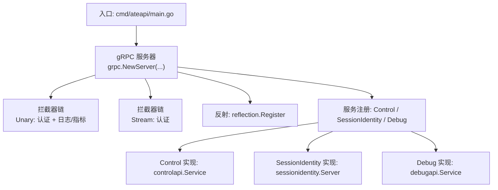
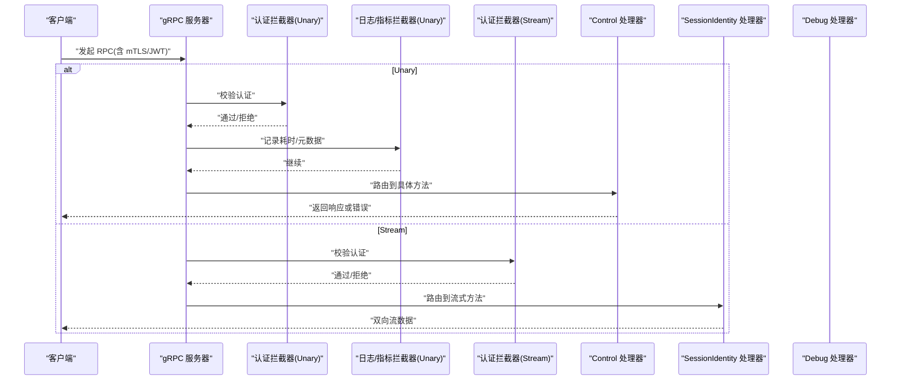
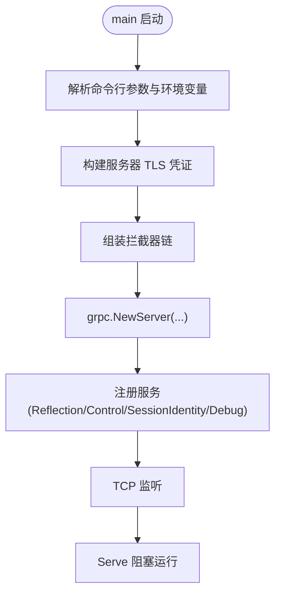
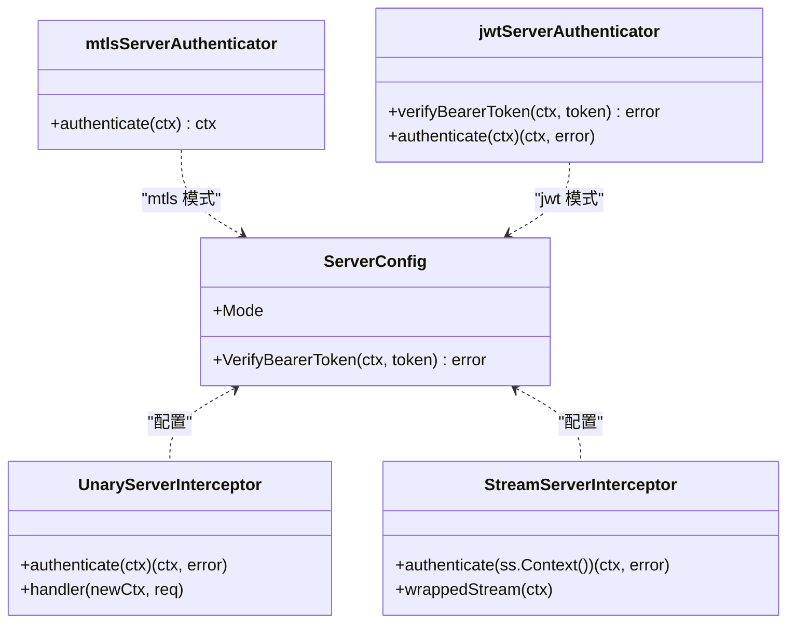
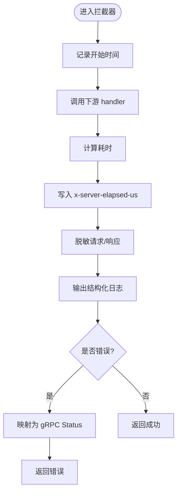
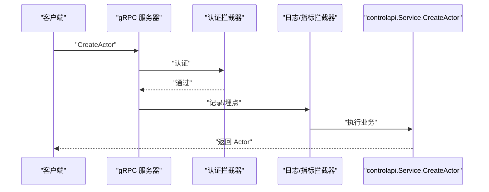
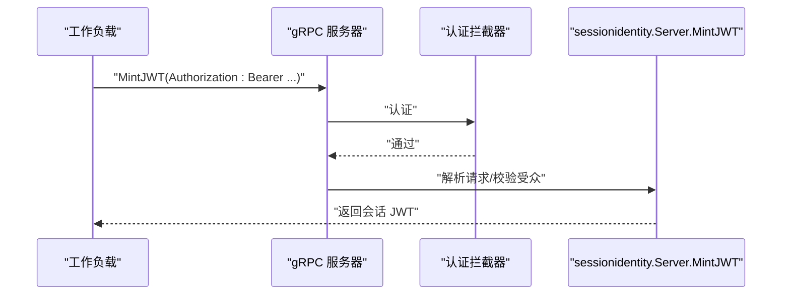
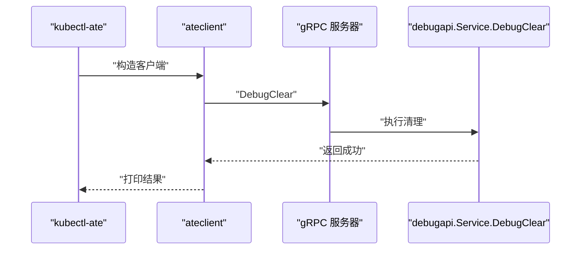
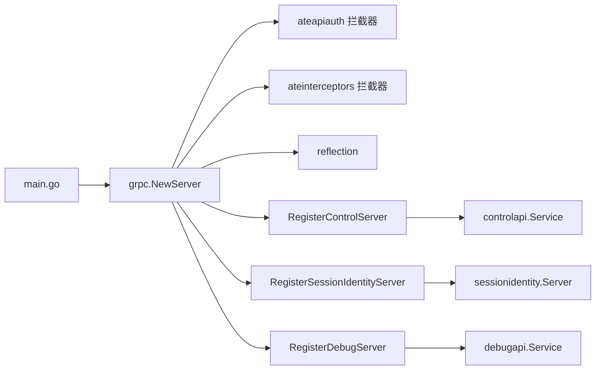

# gRPC服务层

<cite>
**本文引用的文件**   
- [cmd/ateapi/main.go](file://cmd/ateapi/main.go)
- [pkg/proto/ateapipb/ateapi.proto](file://pkg/proto/ateapipb/ateapi.proto)
- [pkg/proto/ateapipb/ateapi_grpc.pb.go](file://pkg/proto/ateapipb/ateapi_grpc.pb.go)
- [internal/ateinterceptors/ateinterceptors.go](file://internal/ateinterceptors/ateinterceptors.go)
- [internal/ateapiauth/server.go](file://internal/ateapiauth/server.go)
- [cmd/ateapi/internal/controlapi/service.go](file://cmd/ateapi/internal/controlapi/service.go)
- [cmd/ateapi/internal/sessionidentity/sessionidentity.go](file://cmd/ateapi/internal/sessionidentity/sessionidentity.go)
- [cmd/ateapi/internal/debugapi/service.go](file://cmd/ateapi/internal/debugapi/service.go)
- [cmd/ateapi/internal/debugapi/debug_clear.go](file://cmd/ateapi/internal/debugapi/debug_clear.go)
</cite>

## 目录
1. [简介](#简介)
2. [项目结构](#项目结构)
3. [核心组件](#核心组件)
4. [架构总览](#架构总览)
5. [详细组件分析](#详细组件分析)
6. [依赖关系分析](#依赖关系分析)
7. [性能考量](#性能考量)
8. [故障排查指南](#故障排查指南)
9. [结论](#结论)
10. [附录](#附录)

## 简介
本文件系统性梳理 ateapi 的 gRPC 服务层实现，覆盖服务器启动流程、服务注册机制、请求处理管道与拦截器链设计；深入解析 Unary 与 Stream 拦截器的认证、日志与指标收集；详细说明 ControlServer、SessionIdentityServer 与 DebugServer 的服务接口定义与方法实现；并给出配置选项、TLS 证书管理、连接池设置、API 调用示例与错误处理模式，以及性能优化建议与调试技巧。

## 项目结构
ateapi 的 gRPC 服务由入口 main 负责初始化与装配：加载配置、建立 TLS、创建 gRPC Server、安装拦截器、注册服务、启动监听与指标服务。gRPC 服务定义位于 proto 文件，生成代码提供服务端接口与注册函数。业务逻辑按服务拆分到独立包：Control（控制面）、SessionIdentity（会话身份签发）、Debug（调试清理）。

图表来源
- [cmd/ateapi/main.go:182-196](file://cmd/ateapi/main.go#L182-L196)
- [pkg/proto/ateapipb/ateapi_grpc.pb.go:561-623](file://pkg/proto/ateapipb/ateapi_grpc.pb.go#L561-L623)
- [pkg/proto/ateapipb/ateapi_grpc.pb.go:690-733](file://pkg/proto/ateapipb/ateapi_grpc.pb.go#L690-L733)
- [pkg/proto/ateapipb/ateapi_grpc.pb.go:854-919](file://pkg/proto/ateapipb/ateapi_grpc.pb.go#L854-L919)

章节来源
- [cmd/ateapi/main.go:79-206](file://cmd/ateapi/main.go#L79-L206)
- [pkg/proto/ateapipb/ateapi.proto:25-65](file://pkg/proto/ateapipb/ateapi.proto#L25-L65)
- [pkg/proto/ateapipb/ateapi.proto:331-368](file://pkg/proto/ateapipb/ateapi.proto#L331-L368)

## 核心组件
- gRPC 服务器与监听
  - 通过 grpc.NewServer 创建，注入传输凭证、StatsHandler、拦截器链，随后在 TCP 监听上 Serve。
- 拦截器链
  - Unary 链：认证拦截器 → 通用日志/指标拦截器。
  - Stream 链：认证拦截器。
- 服务实现
  - Control：Actor/Atespace/Worker 等控制面操作。
  - SessionIdentity：为工作负载签发会话级 JWT/Cert。
  - Debug：开发期数据清理能力。

章节来源
- [cmd/ateapi/main.go:182-206](file://cmd/ateapi/main.go#L182-L206)
- [internal/ateinterceptors/ateinterceptors.go:36-72](file://internal/ateinterceptors/ateinterceptors.go#L36-L72)
- [internal/ateapiauth/server.go:81-103](file://internal/ateapiauth/server.go#L81-L103)
- [cmd/ateapi/internal/controlapi/service.go:25-56](file://cmd/ateapi/internal/controlapi/service.go#L25-L56)
- [cmd/ateapi/internal/sessionidentity/sessionidentity.go:43-69](file://cmd/ateapi/internal/sessionidentity/sessionidentity.go#L43-L69)
- [cmd/ateapi/internal/debugapi/service.go:22-35](file://cmd/ateapi/internal/debugapi/service.go#L22-L35)

## 架构总览
下图展示从客户端到服务实现的完整调用路径，包括拦截器链与服务注册。

图表来源
- [cmd/ateapi/main.go:182-196](file://cmd/ateapi/main.go#L182-L196)
- [internal/ateinterceptors/ateinterceptors.go:36-72](file://internal/ateinterceptors/ateinterceptors.go#L36-L72)
- [internal/ateapiauth/server.go:81-103](file://internal/ateapiauth/server.go#L81-L103)
- [pkg/proto/ateapipb/ateapi_grpc.pb.go:561-623](file://pkg/proto/ateapipb/ateapi_grpc.pb.go#L561-L623)
- [pkg/proto/ateapipb/ateapi_grpc.pb.go:854-919](file://pkg/proto/ateapipb/ateapi_grpc.pb.go#L854-L919)

## 详细组件分析

### gRPC 服务器启动与配置
- 监听地址与指标端口
  - --grpc-listen-addr、--metrics-listen-addr 控制 gRPC 与 Prometheus 暴露端口。
- TLS 与 mTLS
  - 使用 credbundle 动态加载服务器证书；可选加载 workerpool CA 以验证客户端证书。
- StatsHandler
  - 集成 OpenTelemetry gRPC 统计，用于链路追踪与指标采集。
- 拦截器链
  - Unary：认证拦截器在前，日志/指标拦截器在后。
  - Stream：仅认证拦截器。
- 服务注册
  - 反射启用后，注册 Control、SessionIdentity、Debug 三个服务。

图表来源
- [cmd/ateapi/main.go:56-77](file://cmd/ateapi/main.go#L56-L77)
- [cmd/ateapi/main.go:121-124](file://cmd/ateapi/main.go#L121-L124)
- [cmd/ateapi/main.go:182-196](file://cmd/ateapi/main.go#L182-L196)
- [cmd/ateapi/main.go:198-206](file://cmd/ateapi/main.go#L198-L206)

章节来源
- [cmd/ateapi/main.go:79-206](file://cmd/ateapi/main.go#L79-L206)

### 认证拦截器（Unary/Stream）
- 模式
  - mtls：基于传输层 mTLS 建立身份，不做应用层检查。
  - jwt：额外要求 Authorization: Bearer <Kubernetes ServiceAccount Token>，并通过可插拔回调进行校验。
- 实现要点
  - UnaryServerInterceptor：在每个 Unary 调用前执行认证。
  - StreamServerInterceptor：在流握手时执行认证，并将新上下文包装进流。
  - bearerToken 提取：从 incoming metadata 中读取 authorization 头，去除 Bearer 前缀并校验非空。
- 集成位置
  - 在 grpc.NewServer 中通过 ChainUnaryInterceptor/ChainStreamInterceptor 挂载。

图表来源
- [internal/ateapiauth/server.go:72-103](file://internal/ateapiauth/server.go#L72-L103)
- [internal/ateapiauth/server.go:116-152](file://internal/ateapiauth/server.go#L116-L152)
- [internal/ateapiauth/server.go:162-181](file://internal/ateapiauth/server.go#L162-L181)
- [cmd/ateapi/main.go:171-192](file://cmd/ateapi/main.go#L171-L192)

章节来源
- [internal/ateapiauth/server.go:35-181](file://internal/ateapiauth/server.go#L35-L181)
- [cmd/ateapi/main.go:171-192](file://cmd/ateapi/main.go#L171-L192)

### 日志与指标拦截器（Unary）
- 功能
  - 记录方法名、请求/响应摘要、错误与耗时。
  - 将“服务器侧处理耗时”写入 Trailer，便于客户端准确度量。
  - 对敏感字段（如 env）进行脱敏处理。
- 错误处理
  - 若上游返回 gRPC status，则透传；否则包装为 Internal 错误。
- 集成位置
  - 作为 Unary 链的第二环，位于认证之后。

图表来源
- [internal/ateinterceptors/ateinterceptors.go:36-72](file://internal/ateinterceptors/ateinterceptors.go#L36-L72)
- [internal/ateinterceptors/ateinterceptors.go:104-138](file://internal/ateinterceptors/ateinterceptors.go#L104-L138)

章节来源
- [internal/ateinterceptors/ateinterceptors.go:36-138](file://internal/ateinterceptors/ateinterceptors.go#L36-L138)

### Control 服务
- 接口定义
  - 包含 Actor/Atespace/Worker 的 CRUD 与生命周期操作（Get/Create/Update/Suspend/Pause/Resume/Delete/List）。
- 实现要点
  - Service 持有持久化、dialer、listers 与工作流编排对象，组合完成复杂业务流程。
- 典型调用序列（以 CreateActor 为例）

图表来源
- [pkg/proto/ateapipb/ateapi.proto:25-65](file://pkg/proto/ateapipb/ateapi.proto#L25-L65)
- [pkg/proto/ateapipb/ateapi_grpc.pb.go:561-623](file://pkg/proto/ateapipb/ateapi_grpc.pb.go#L561-L623)
- [cmd/ateapi/internal/controlapi/service.go:25-56](file://cmd/ateapi/internal/controlapi/service.go#L25-L56)

章节来源
- [pkg/proto/ateapipb/ateapi.proto:25-65](file://pkg/proto/ateapipb/ateapi.proto#L25-L65)
- [cmd/ateapi/internal/controlapi/service.go:25-56](file://cmd/ateapi/internal/controlapi/service.go#L25-L56)

### SessionIdentity 服务
- 目标
  - 将基础设施级身份（Kubernetes SA Token/mTLS）转换为会话级身份（JWT/Cert），供工作负载跨 Worker 迁移时使用。
- 关键方法
  - MintJWT：校验客户端 JWT（Bearer），签发会话 JWT（带受众绑定与扩展声明）。
  - MintCert：基于 mTLS 客户端证书，校验 CSR 并使用本地 CA 签发会话证书链。
- 安全要点
  - 严格校验请求头/证书信息；对签名密钥/CA 文件读取失败返回内部错误。

图表来源
- [pkg/proto/ateapipb/ateapi.proto:358-398](file://pkg/proto/ateapipb/ateapi.proto#L358-L398)
- [pkg/proto/ateapipb/ateapi_grpc.pb.go:854-919](file://pkg/proto/ateapipb/ateapi_grpc.pb.go#L854-L919)
- [cmd/ateapi/internal/sessionidentity/sessionidentity.go:71-142](file://cmd/ateapi/internal/sessionidentity/sessionidentity.go#L71-L142)

章节来源
- [pkg/proto/ateapipb/ateapi.proto:358-398](file://pkg/proto/ateapipb/ateapi.proto#L358-L398)
- [cmd/ateapi/internal/sessionidentity/sessionidentity.go:43-142](file://cmd/ateapi/internal/sessionidentity/sessionidentity.go#L43-L142)

### Debug 服务
- 目标
  - 提供开发期危险操作（清空存储），生产环境应谨慎使用。
- 关键方法
  - DebugClear：调用底层持久化接口的清理能力。
- 调用示例（kubectl 子命令）
  - kubectl-ate admin debug-flush-redis 通过 ateclient 调用 DebugClear。

图表来源
- [pkg/proto/ateapipb/ateapi.proto:331-340](file://pkg/proto/ateapipb/ateapi.proto#L331-L340)
- [pkg/proto/ateapipb/ateapi_grpc.pb.go:690-733](file://pkg/proto/ateapipb/ateapi_grpc.pb.go#L690-L733)
- [cmd/ateapi/internal/debugapi/service.go:22-35](file://cmd/ateapi/internal/debugapi/service.go#L22-L35)
- [cmd/ateapi/internal/debugapi/debug_clear.go:24-32](file://cmd/ateapi/internal/debugapi/debug_clear.go#L24-L32)

章节来源
- [pkg/proto/ateapipb/ateapi.proto:331-340](file://pkg/proto/ateapipb/ateapi.proto#L331-L340)
- [cmd/ateapi/internal/debugapi/service.go:22-35](file://cmd/ateapi/internal/debugapi/service.go#L22-L35)
- [cmd/ateapi/internal/debugapi/debug_clear.go:24-32](file://cmd/ateapi/internal/debugapi/debug_clear.go#L24-L32)

## 依赖关系分析
- 服务与实现
  - ControlService ↔ controlapi.Service
  - SessionIdentityService ↔ sessionidentity.Server
  - DebugService ↔ debugapi.Service
- 拦截器与服务器
  - 认证拦截器与日志/指标拦截器通过 Chain 组合注入到 gRPC Server。
- 外部依赖
  - Redis/Valkey：持久化与缓存。
  - Kubernetes Informers：获取资源状态。
  - OpenTelemetry：StatsHandler 上报指标与追踪。

图表来源
- [cmd/ateapi/main.go:182-196](file://cmd/ateapi/main.go#L182-L196)
- [pkg/proto/ateapipb/ateapi_grpc.pb.go:561-623](file://pkg/proto/ateapipb/ateapi_grpc.pb.go#L561-L623)
- [pkg/proto/ateapipb/ateapi_grpc.pb.go:690-733](file://pkg/proto/ateapipb/ateapi_grpc.pb.go#L690-L733)
- [pkg/proto/ateapipb/ateapi_grpc.pb.go:854-919](file://pkg/proto/ateapipb/ateapi_grpc.pb.go#L854-L919)

章节来源
- [cmd/ateapi/main.go:182-196](file://cmd/ateapi/main.go#L182-L196)

## 性能考量
- 拦截器开销
  - 认证拦截器仅在握手阶段（Unary 每次、Stream 首次）执行，成本可控。
  - 日志/指标拦截器避免打印敏感字段，减少序列化开销。
- 指标与追踪
  - 使用 StatsHandler 与 Trailer 上报服务器端耗时，有助于端到端延迟归因。
- 并发与背压
  - gRPC 默认并发模型良好，建议结合业务限流与超时控制。
- 证书与密钥
  - 证书按需加载，避免频繁 IO；签名密钥/CA 文件读取存在 TODO 缓存优化空间。
- 网络与 TLS
  - 合理设置 KeepAlive、压缩策略与最大消息大小，降低带宽与 CPU 占用。

[本节为通用指导，不直接分析具体文件]

## 故障排查指南
- 认证失败
  - 现象：Unauthenticated 错误。
  - 排查：确认 mTLS 证书有效；若使用 JWT，检查 Authorization 头格式与 K8s SA Token 有效性。
- 内部错误
  - 现象：Internal 错误码。
  - 排查：查看日志中的错误堆栈；注意证书/CA 文件读取失败的分支。
- 调试工具
  - 使用 reflection 导出服务描述；通过 DebugClear 清理测试数据。
- 指标与追踪
  - 检查 Metrics 端口与 OTel 导出是否正常；利用 Trailer 中的服务器耗时定位瓶颈。

章节来源
- [internal/ateinterceptors/ateinterceptors.go:57-72](file://internal/ateinterceptors/ateinterceptors.go#L57-L72)
- [cmd/ateapi/internal/sessionidentity/sessionidentity.go:168-189](file://cmd/ateapi/internal/sessionidentity/sessionidentity.go#L168-L189)
- [cmd/ateapi/internal/debugapi/debug_clear.go:24-32](file://cmd/ateapi/internal/debugapi/debug_clear.go#L24-L32)

## 结论
ateapi 的 gRPC 服务层采用清晰的启动与装配流程，通过认证与日志/指标拦截器形成统一的横切关注点；三大服务职责明确，分别承担控制面、会话身份与调试能力。整体架构具备良好的可扩展性与可观测性，配合合理的配置与优化策略，可满足高吞吐与低延迟的生产需求。

[本节为总结，不直接分析具体文件]

## 附录

### API 方法清单（节选）
- Control
  - GetActor、CreateActor、UpdateActor、SuspendActor、PauseActor、ResumeActor、DeleteActor
  - ListWorkers、ListActors
  - CreateAtespace、GetAtespace、ListAtespaces、DeleteAtespace
- SessionIdentity
  - MintJWT、MintCert
- Debug
  - DebugClear

章节来源
- [pkg/proto/ateapipb/ateapi.proto:25-65](file://pkg/proto/ateapipb/ateapi.proto#L25-L65)
- [pkg/proto/ateapipb/ateapi.proto:358-398](file://pkg/proto/ateapipb/ateapi.proto#L358-L398)
- [pkg/proto/ateapipb/ateapi.proto:331-340](file://pkg/proto/ateapipb/ateapi.proto#L331-L340)

### 配置选项与证书管理
- gRPC 与指标
  - --grpc-listen-addr、--metrics-listen-addr
- TLS 与 mTLS
  - --grpc-server-cred-bundle（服务器证书 bundle）
  - --workerpool-ca-certs（可选，验证客户端证书）
- Redis/Valkey
  - --redis-cluster-address、--redis-ca-certs、--redis-use-iam-auth、--redis-tls-server-name、--redis-client-cert
- JWT 认证
  - --auth-mode（mtls|jwt）
  - --client-jwt-issuer、--client-jwt-audience、--client-jwt-ca-cert
  - --session-id-jwt-pool、--session-id-ca-pool

章节来源
- [cmd/ateapi/main.go:56-77](file://cmd/ateapi/main.go#L56-L77)
- [cmd/ateapi/main.go:121-124](file://cmd/ateapi/main.go#L121-L124)
- [cmd/ateapi/main.go:248-331](file://cmd/ateapi/main.go#L248-L331)
- [cmd/ateapi/main.go:351-373](file://cmd/ateapi/main.go#L351-L373)

### 错误处理模式
- 认证失败：返回 Unauthenticated。
- 参数非法：返回 InvalidArgument。
- 未实现：返回 Unimplemented（由生成的 Unimplemented*Server 提供）。
- 内部错误：返回 Internal，并附带错误详情。

章节来源
- [internal/ateinterceptors/ateinterceptors.go:57-72](file://internal/ateinterceptors/ateinterceptors.go#L57-L72)
- [pkg/proto/ateapipb/ateapi_grpc.pb.go:286-306](file://pkg/proto/ateapipb/ateapi_grpc.pb.go#L286-L306)
- [cmd/ateapi/internal/sessionidentity/sessionidentity.go:164-166](file://cmd/ateapi/internal/sessionidentity/sessionidentity.go#L164-L166)
