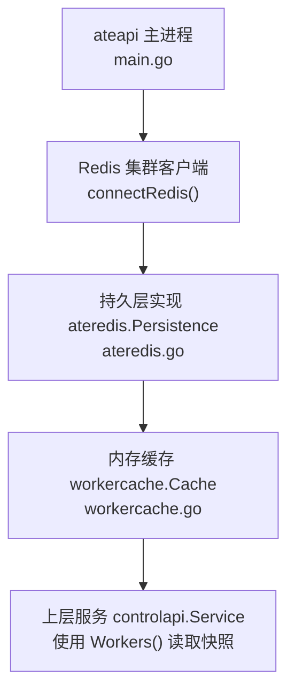
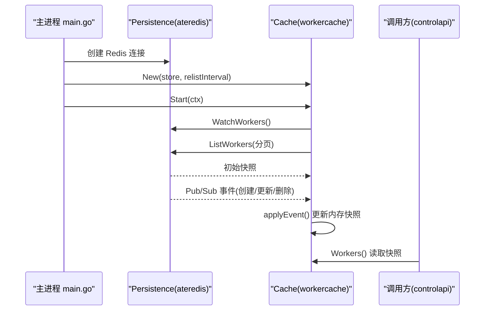
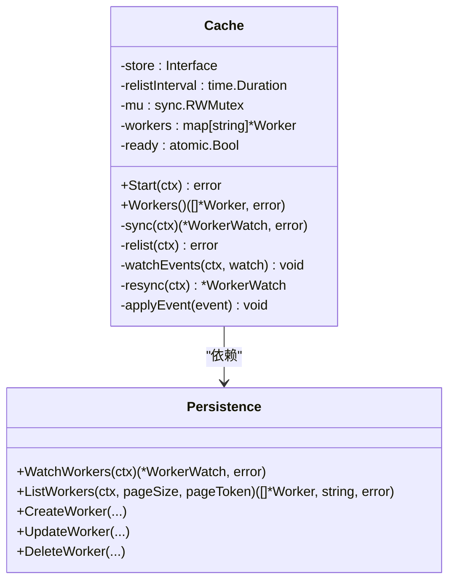
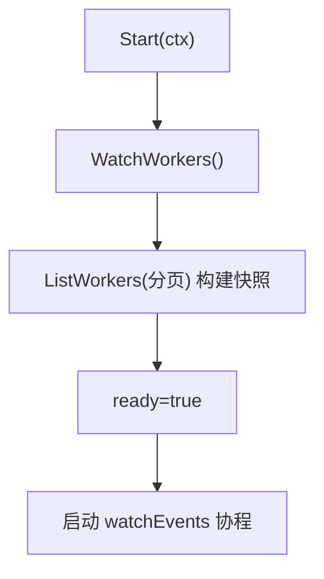
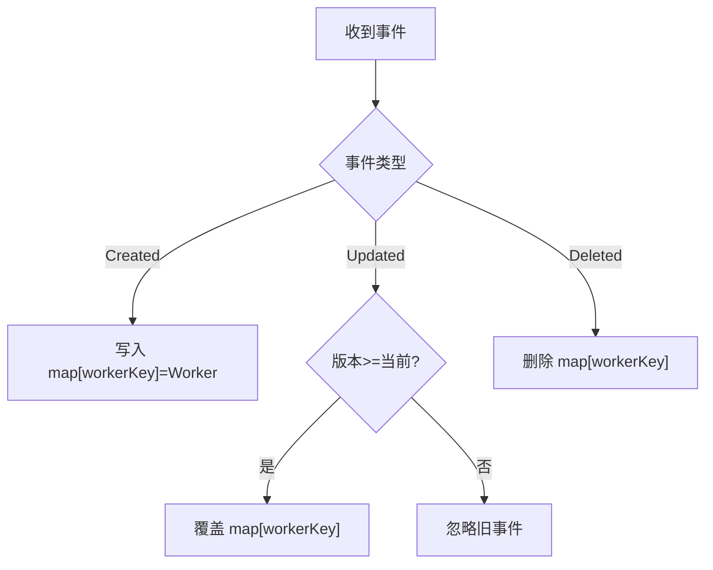
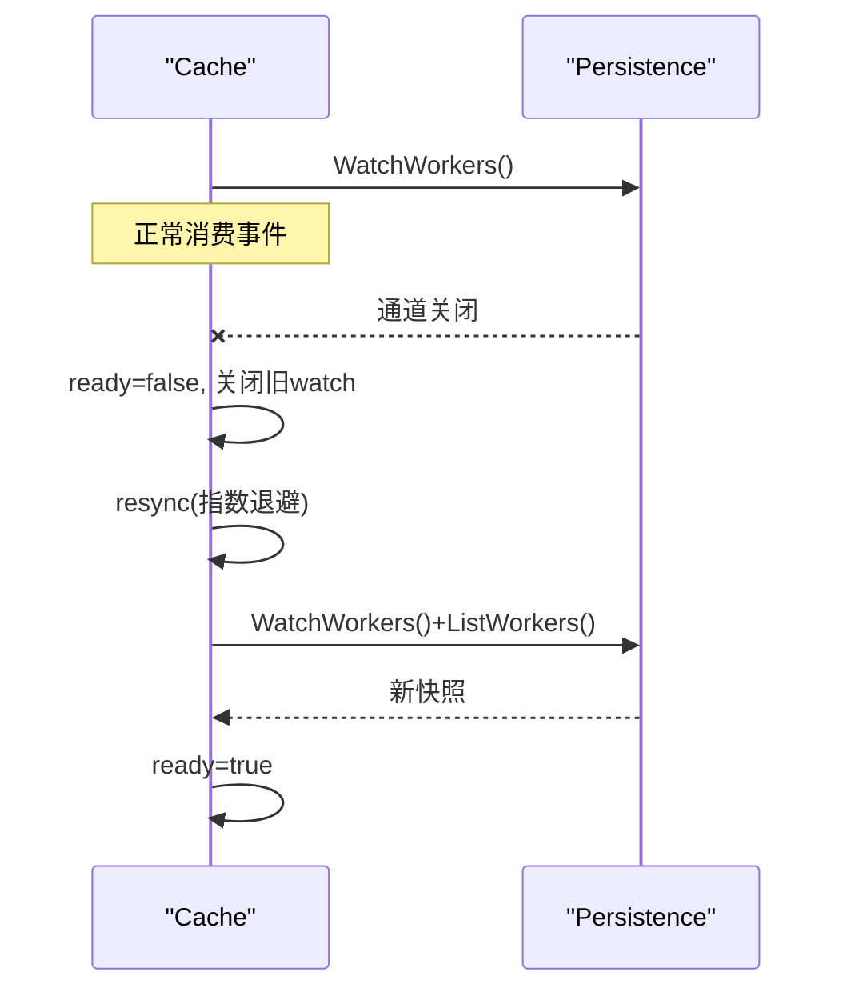
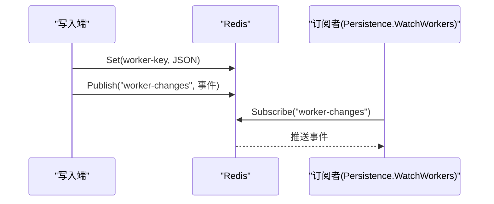
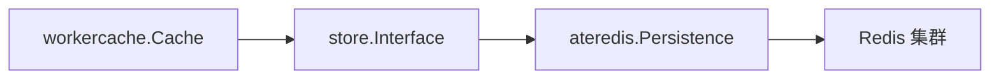

# 工作节点缓存管理

<cite>
**本文引用的文件**   
- [workercache.go](file://cmd/ateapi/internal/workercache/workercache.go)
- [workercache_test.go](file://cmd/ateapi/internal/workercache/workercache_test.go)
- [store.go](file://cmd/ateapi/internal/store/store.go)
- [ateredis.go](file://cmd/ateapi/internal/store/ateredis/ateredis.go)
- [main.go](file://cmd/ateapi/main.go)
</cite>

## 目录
1. [简介](#简介)
2. [项目结构](#项目结构)
3. [核心组件](#核心组件)
4. [架构总览](#架构总览)
5. [详细组件分析](#详细组件分析)
6. [依赖关系分析](#依赖关系分析)
7. [性能与内存管理](#性能与内存管理)
8. [健康检查、故障检测与自动恢复](#健康检查故障检测与自动恢复)
9. [配置调优与监控指标](#配置调优与监控指标)
10. [一致性排查与性能分析方法](#一致性排查与性能分析方法)
11. [结论](#结论)

## 简介
本文件系统性阐述 ateapi 的工作节点（Worker）缓存管理系统，覆盖以下方面：
- 缓存数据结构设计与并发访问控制
- 缓存失效策略与数据同步机制（基于 Redis Pub/Sub + 定期全量重放）
- 工作节点信息的获取、更新与清理流程
- 与 Redis 的交互逻辑（键空间、事务、订阅确认）
- 缓存预热、并发安全、内存管理等优化点
- 健康检查、故障检测与自动恢复
- 配置参数与可观测性建议
- 一致性问题排查与性能分析方法

## 项目结构
该子系统位于 ateapi 进程内，由“持久层接口”、“Redis 实现”和“内存缓存”三层组成。启动时先连接 Redis，再初始化缓存并启动后台事件流；业务侧通过缓存提供的只读快照进行调度决策。

图表来源
- [main.go:111-131](file://cmd/ateapi/main.go#L111-L131)
- [ateredis.go:76-88](file://cmd/ateapi/internal/store/ateredis/ateredis.go#L76-L88)
- [workercache.go:37-60](file://cmd/ateapi/internal/workercache/workercache.go#L37-L60)

章节来源
- [main.go:111-131](file://cmd/ateapi/main.go#L111-L131)

## 核心组件
- 持久层接口 store.Interface：定义 Worker 的增删改查、分页扫描、WatchWorkers 等能力。
- Redis 实现 ateredis.Persistence：以 Redis 为后端，提供 WatchWorkers（Pub/Sub）、ListWorkers（SCAN 分页）、原子更新（Watch+Tx）。
- 内存缓存 workercache.Cache：维护所有 Worker 的内存快照，提供 O(1) 读取，并通过事件流与定期重放保证最终一致。

章节来源
- [store.go:40-118](file://cmd/ateapi/internal/store/store.go#L40-L118)
- [ateredis.go:254-297](file://cmd/ateapi/internal/store/ateredis/ateredis.go#L254-L297)
- [workercache.go:37-90](file://cmd/ateapi/internal/workercache/workercache.go#L37-L90)

## 架构总览
下图展示了从 Redis 到内存缓存的数据流与控制流。

图表来源
- [main.go:126-131](file://cmd/ateapi/main.go#L126-L131)
- [workercache.go:65-102](file://cmd/ateapi/internal/workercache/workercache.go#L65-L102)
- [ateredis.go:254-297](file://cmd/ateapi/internal/store/ateredis/ateredis.go#L254-L297)

## 详细组件分析

### 缓存数据结构与并发模型
- 数据结构
  - 内存中维护一个 map[string]*Worker，key 为 “命名空间:Pod名”，用于 O(1) 定位。
  - ready 原子标志位表示缓存是否完成首次同步并可对外提供服务。
- 并发控制
  - 读写分离：读路径使用 RWMutex 的读锁，写路径使用写锁。
  - 事件处理串行化：watchEvents 单协程消费事件，避免竞争。
- 版本冲突处理
  - 应用更新事件时，仅当新事件的版本大于等于当前内存版本才覆盖，避免旧值覆盖新值。

图表来源
- [workercache.go:37-90](file://cmd/ateapi/internal/workercache/workercache.go#L37-L90)
- [store.go:40-118](file://cmd/ateapi/internal/store/store.go#L40-L118)
- [ateredis.go:360-479](file://cmd/ateapi/internal/store/ateredis/ateredis.go#L360-L479)

章节来源
- [workercache.go:37-90](file://cmd/ateapi/internal/workercache/workercache.go#L37-L90)
- [workercache.go:182-195](file://cmd/ateapi/internal/workercache/workercache.go#L182-L195)

### 缓存预热与初始同步
- 启动流程
  - Start 先执行一次完整同步：建立 WatchWorkers 订阅，随后立即执行一次 ListWorkers 全量拉取，构建初始快照，然后标记 ready=true，并启动后台 watchEvents 协程。
- 预热效果
  - 在第一次 Workers() 调用前即拥有完整快照，避免冷启动抖动。

图表来源
- [workercache.go:65-102](file://cmd/ateapi/internal/workercache/workercache.go#L65-L102)

章节来源
- [workercache.go:65-102](file://cmd/ateapi/internal/workercache/workercache.go#L65-L102)

### 事件驱动更新与失效策略
- 事件类型
  - Created/Updated/Deleted 三种事件，分别对应新增、更新与删除。
- 更新规则
  - Updated 事件按版本比较，仅新版本覆盖旧版本，避免乱序导致的回退。
- 失效策略
  - Deleted 事件直接移除内存条目。
  - 周期性 relist 作为兜底，修复因消息丢失或网络问题导致的状态漂移。

图表来源
- [workercache.go:182-195](file://cmd/ateapi/internal/workercache/workercache.go#L182-L195)

章节来源
- [workercache.go:182-195](file://cmd/ateapi/internal/workercache/workercache.go#L182-L195)

### 定期重放与断线重连
- 定期重放
  - 定时器周期触发 relist，重新从 Redis 拉取全量快照并替换内存映射，确保最终一致。
- 断线重连
  - 当 Watch channel 关闭时，将 ready=false，关闭旧 watch，指数退避重试 resync，成功后恢复 ready=true。
- 非致命错误
  - 定时 relist 失败不会中断服务，仅记录告警日志，继续使用上次快照。

图表来源
- [workercache.go:129-180](file://cmd/ateapi/internal/workercache/workercache.go#L129-L180)

章节来源
- [workercache.go:129-180](file://cmd/ateapi/internal/workercache/workercache.go#L129-L180)

### 与 Redis 的交互逻辑
- 键空间设计
  - Worker 键形如 worker:<namespace>:<pool-name>:<pod-name>，值为 JSON 序列化的 Worker 对象。
- 变更通知
  - 通过固定频道 worker-changes 发布事件，事件体包含类型与 protojson 编码的 Worker。
- 订阅确认
  - WatchWorkers 在返回前等待 SUBSCRIBE 确认，确保后续事件不丢失。
- 列表与分页
  - ListWorkers 使用 SCAN 模式 worker:*，跨分片有序遍历，支持页码 token。
- 原子更新
  - UpdateWorker 使用 WATCH+事务校验版本号，防止并发覆盖。

图表来源
- [ateredis.go:214-253](file://cmd/ateapi/internal/store/ateredis/ateredis.go#L214-L253)
- [ateredis.go:254-297](file://cmd/ateapi/internal/store/ateredis/ateredis.go#L254-L297)
- [ateredis.go:360-479](file://cmd/ateapi/internal/store/ateredis/ateredis.go#L360-L479)
- [ateredis.go:586-600](file://cmd/ateapi/internal/store/ateredis/ateredis.go#L586-L600)

章节来源
- [ateredis.go:214-253](file://cmd/ateapi/internal/store/ateredis/ateredis.go#L214-L253)
- [ateredis.go:254-297](file://cmd/ateapi/internal/store/ateredis/ateredis.go#L254-L297)
- [ateredis.go:586-600](file://cmd/ateapi/internal/store/ateredis/ateredis.go#L586-L600)

### 工作节点信息获取、更新与清理流程
- 获取
  - 调用方通过 Cache.Workers() 获取不可变快照切片，O(1) 读取。
- 更新
  - 写入端通过 CreateWorker/UpdateWorker/DeleteWorker 修改 Redis，同时发布事件。
  - 缓存接收事件后按版本策略更新内存快照。
- 清理
  - 删除事件直接移除内存项；若事件丢失，定时 relist 会修正。

章节来源
- [workercache.go:75-90](file://cmd/ateapi/internal/workercache/workercache.go#L75-L90)
- [ateredis.go:360-479](file://cmd/ateapi/internal/store/ateredis/ateredis.go#L360-L479)
- [workercache.go:182-195](file://cmd/ateapi/internal/workercache/workercache.go#L182-L195)

## 依赖关系分析
- 模块耦合
  - workercache 仅依赖 store.Interface，屏蔽底层存储差异。
  - ateredis 实现 store.Interface，封装 Redis 操作细节。
- 外部依赖
  - Redis 集群客户端、Pub/Sub、WATCH+事务、SCAN 分页。
- 潜在循环依赖
  - 无循环依赖；单向依赖清晰。

图表来源
- [store.go:40-118](file://cmd/ateapi/internal/store/store.go#L40-L118)
- [ateredis.go:76-88](file://cmd/ateapi/internal/store/ateredis/ateredis.go#L76-L88)
- [workercache.go:37-60](file://cmd/ateapi/internal/workercache/workercache.go#L37-L60)

章节来源
- [store.go:40-118](file://cmd/ateapi/internal/store/store.go#L40-L118)

## 性能与内存管理
- 时间复杂度
  - Workers() 读取：O(n) 复制快照（n 为 Worker 数量），但内部 map 查找为 O(1)。
  - 事件处理：O(1) 插入/更新/删除。
  - 定期重放：O(n) 重建 map。
- 并发安全
  - 读多写少场景下，RWMutex 读锁并行，提升吞吐。
  - 事件处理串行化，避免写锁频繁竞争。
- 内存管理
  - 内存快照为指针切片，注意大对象引用；可通过减少 Worker 字段体积降低内存占用。
  - 定期重放会分配新的 map 并替换，旧 map 被 GC 回收。
- 网络与序列化
  - Redis 事件采用 protojson，兼顾可读性与兼容性；在高吞吐场景可评估二进制协议以降低开销。
- 分页与扫描
  - ListWorkers 使用 SCAN 分页，避免一次性加载全部键，降低延迟峰值。

章节来源
- [workercache.go:75-90](file://cmd/ateapi/internal/workercache/workercache.go#L75-L90)
- [workercache.go:104-127](file://cmd/ateapi/internal/workercache/workercache.go#L104-L127)
- [ateredis.go:586-600](file://cmd/ateapi/internal/store/ateredis/ateredis.go#L586-L600)

## 健康检查、故障检测与自动恢复
- 就绪状态
  - ready 标志位指示缓存是否可用；未就绪时 Workers() 返回错误，调用方可重试。
- 故障检测
  - Watch channel 关闭视为连接丢失；定时 relist 失败仅告警，不影响现有快照。
- 自动恢复
  - 断线后指数退避重连并重放全量快照；成功恢复后重新标记 ready=true。
- 优雅关闭
  - 上下文取消时关闭 watch 并释放资源。

章节来源
- [workercache.go:65-73](file://cmd/ateapi/internal/workercache/workercache.go#L65-L73)
- [workercache.go:129-180](file://cmd/ateapi/internal/workercache/workercache.go#L129-L180)

## 配置调优与监控指标
- 关键配置
  - relistInterval：控制定期重放频率，默认 5 分钟（见主进程构造处）。较短间隔提升一致性但增加 Redis 压力；较长间隔降低开销但可能延长不一致窗口。
  - Redis 连接参数：地址、TLS、IAM 认证等，影响稳定性与延迟。
- 建议监控指标
  - 缓存大小：内存中 Worker 数量（map 长度）。
  - 同步事件计数：Created/Updated/Deleted 事件数。
  - 重放次数与耗时：relist 触发次数与平均耗时。
  - 订阅断开与重连次数：Watch channel 关闭与 resync 次数。
  - Redis 相关：Pub/Sub 发布失败计数、SCAN 分页耗时。
- 可观测性增强建议
  - 在 workercache 中暴露 Prometheus 指标（注释 TODO 已提示需添加）。
  - 对 WatchWorkers 订阅确认超时、事件反序列化失败等异常进行计数与采样。

章节来源
- [main.go:126-131](file://cmd/ateapi/main.go#L126-L131)
- [workercache.go:39-41](file://cmd/ateapi/internal/workercache/workercache.go#L39-L41)

## 一致性排查与性能分析方法
- 常见问题定位
  - 事件丢失：观察 relist 是否生效；若长时间未收敛，检查 Redis Pub/Sub 是否正常。
  - 版本回退：确认更新事件版本单调递增；若出现旧事件覆盖，检查上游写入逻辑。
  - 连接抖动：统计 resync 次数与耗时，评估网络质量与 Redis 可用性。
- 诊断步骤
  - 对比 Redis 快照与内存快照：临时开启调试接口或直接查询 Redis 键空间，核对差异。
  - 抓取事件流：在 ateredis 层记录发布与订阅事件，定位丢包或乱序。
  - 压测验证：模拟高并发更新与删除，观察缓存稳定时间与 CPU/内存占用。
- 性能分析方法
  - 热点路径：Workers() 快照复制、relist 全量重建、事件反序列化。
  - 瓶颈识别：Redis 网络 RTT、SCAN 分页效率、protojson 编解码成本。
  - 容量规划：根据 Worker 规模估算内存占用与 GC 压力，调整 relistInterval 与分页大小。

章节来源
- [workercache_test.go:275-354](file://cmd/ateapi/internal/workercache/workercache_test.go#L275-L354)
- [ateredis.go:254-297](file://cmd/ateapi/internal/store/ateredis/ateredis.go#L254-L297)

## 结论
该工作节点缓存系统通过“事件驱动 + 定期重放”的组合策略，在保证低延迟读的同时实现了最终一致性。其设计简洁、扩展性强，具备完善的断线重连与幂等更新机制。建议在运行环境中补充必要的监控指标，并结合业务负载动态调整 relistInterval 与 Redis 连接参数，以获得更佳的稳定性与性能表现。
