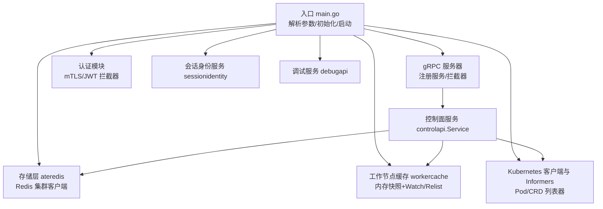
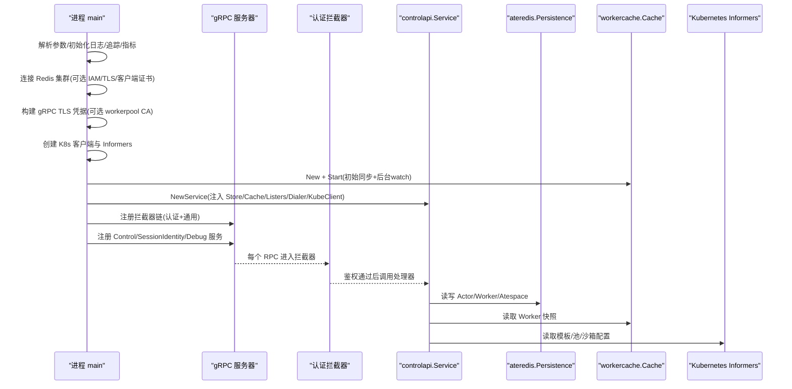
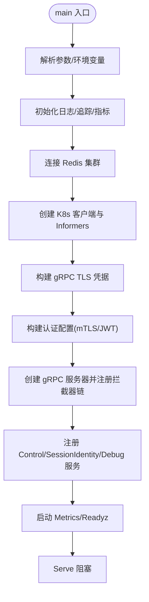
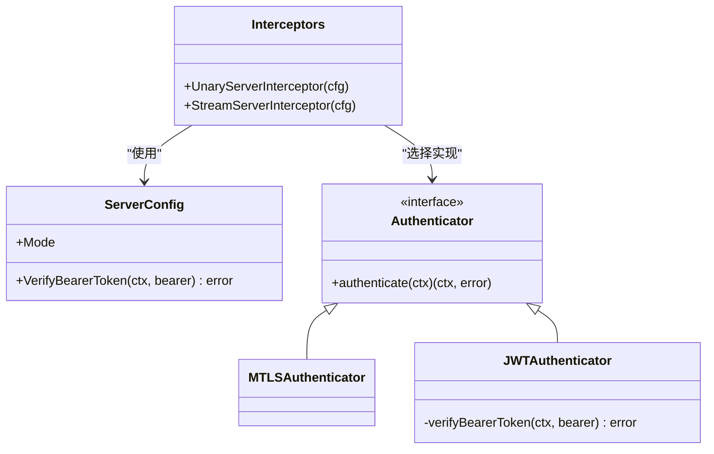
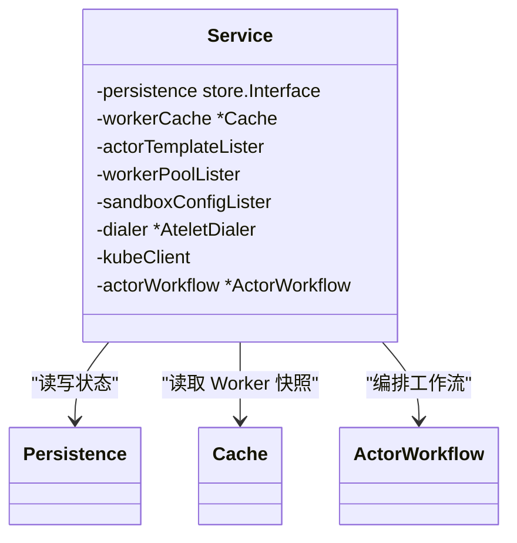
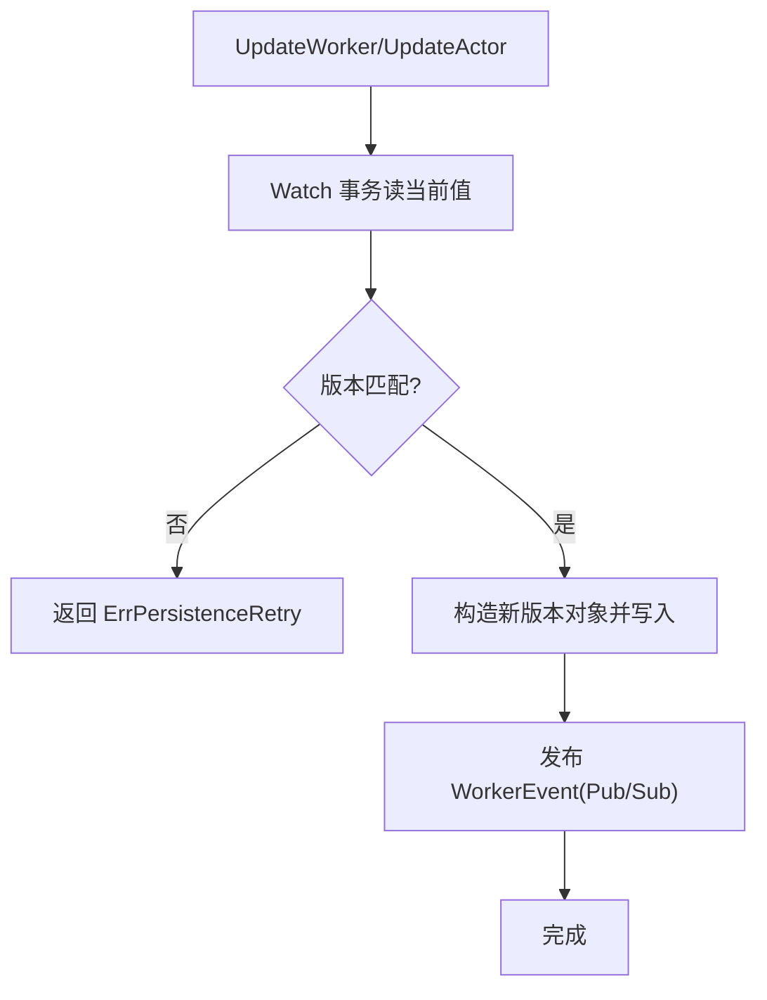
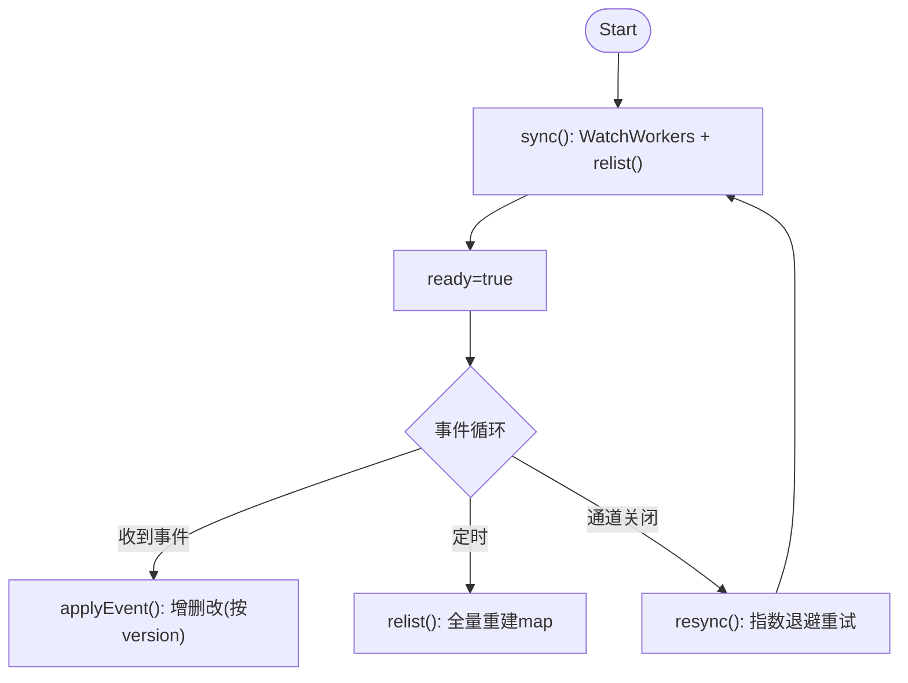
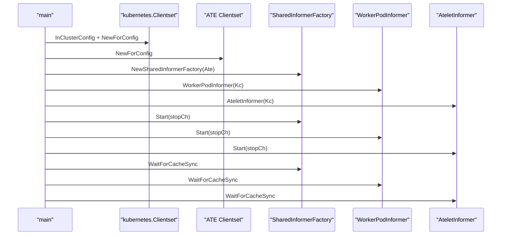
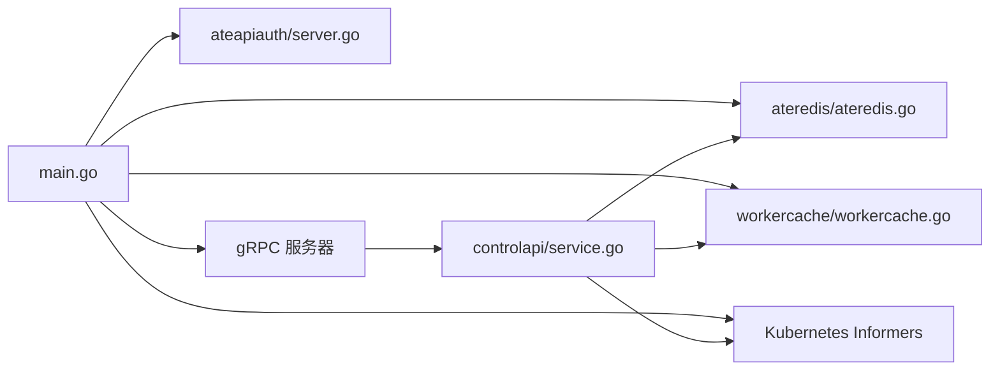

# 控制平面 (ateapi)

<cite>
**本文引用的文件**   
- [cmd/ateapi/main.go](file://cmd/ateapi/main.go)
- [internal/ateapiauth/server.go](file://internal/ateapiauth/server.go)
- [cmd/ateapi/internal/controlapi/service.go](file://cmd/ateapi/internal/controlapi/service.go)
- [cmd/ateapi/internal/store/ateredis/ateredis.go](file://cmd/ateapi/internal/store/ateredis/ateredis.go)
- [cmd/ateapi/internal/workercache/workercache.go](file://cmd/ateapi/internal/workercache/workercache.go)
</cite>

## 目录
1. [简介](#简介)
2. [项目结构](#项目结构)
3. [核心组件](#核心组件)
4. [架构总览](#架构总览)
5. [详细组件分析](#详细组件分析)
6. [依赖关系分析](#依赖关系分析)
7. [性能考量](#性能考量)
8. [故障排查指南](#故障排查指南)
9. [结论](#结论)
10. [附录](#附录)

## 简介
本文件系统性阐述 ateapi 控制平面 API 服务器的架构设计与实现细节，覆盖 gRPC 服务器启动流程、认证授权（mTLS 与 JWT）、请求处理管道与拦截器链、状态存储层（Redis 集群连接、持久化策略、缓存机制）、工作节点缓存（失效策略、数据同步）、与 Kubernetes API 的集成（Informers、资源监听与事件处理），并给出配置选项说明、监控指标定义与日志格式规范、错误处理策略、重试机制与故障恢复方案。

## 项目结构
ateapi 服务由入口程序组装各子系统：gRPC 服务器、认证拦截器、存储后端（Redis）、工作节点缓存、Kubernetes Informers、会话身份与调试服务等。整体采用分层组织：入口装配、业务服务、存储抽象、缓存与外部系统集成。

图表来源
- [cmd/ateapi/main.go:171-206](file://cmd/ateapi/main.go#L171-L206)
- [cmd/ateapi/internal/controlapi/service.go:25-57](file://cmd/ateapi/internal/controlapi/service.go#L25-L57)
- [cmd/ateapi/internal/store/ateredis/ateredis.go:76-88](file://cmd/ateapi/internal/store/ateredis/ateredis.go#L76-L88)
- [cmd/ateapi/internal/workercache/workercache.go:37-60](file://cmd/ateapi/internal/workercache/workercache.go#L37-L60)
- [internal/ateapiauth/server.go:81-103](file://internal/ateapiauth/server.go#L81-L103)

章节来源
- [cmd/ateapi/main.go:79-206](file://cmd/ateapi/main.go#L79-L206)
- [cmd/ateapi/internal/controlapi/service.go:25-57](file://cmd/ateapi/internal/controlapi/service.go#L25-L57)

## 核心组件
- gRPC 服务器与拦截器链：统一承载 Control、SessionIdentity、Debug 三个服务；通过 ChainUnaryInterceptor/ChainStreamInterceptor 组合认证与通用拦截器。
- 认证授权：支持 mTLS 与 JWT 两种模式；JWT 模式下校验 K8s ServiceAccount Bearer Token。
- 状态存储层：基于 Redis 集群，提供 Actor/Worker/Atespace 等资源的 CRUD、分页扫描、事务更新、Pub/Sub 事件发布。
- 工作节点缓存：维护所有 Worker 的内存快照，通过 WatchWorkers 增量更新，周期性 Relist 全量重建以纠偏。
- Kubernetes 集成：使用 client-go 创建标准与自定义 CRD 客户端，建立 SharedInformerFactory 与 Pod Informer，用于调度与资源监听。
- 会话身份与调试服务：提供会话身份签发与调试能力。

章节来源
- [cmd/ateapi/main.go:171-206](file://cmd/ateapi/main.go#L171-L206)
- [internal/ateapiauth/server.go:81-103](file://internal/ateapiauth/server.go#L81-L103)
- [cmd/ateapi/internal/store/ateredis/ateredis.go:76-88](file://cmd/ateapi/internal/store/ateredis/ateredis.go#L76-L88)
- [cmd/ateapi/internal/workercache/workercache.go:37-60](file://cmd/ateapi/internal/workercache/workercache.go#L37-L60)
- [cmd/ateapi/internal/controlapi/service.go:25-57](file://cmd/ateapi/internal/controlapi/service.go#L25-L57)

## 架构总览
下图展示 ateapi 从进程启动到对外暴露 gRPC 服务的完整链路，包括认证拦截器、存储与缓存、Kubernetes Informers 的协作关系。

图表来源
- [cmd/ateapi/main.go:171-206](file://cmd/ateapi/main.go#L171-L206)
- [cmd/ateapi/internal/controlapi/service.go:25-57](file://cmd/ateapi/internal/controlapi/service.go#L25-L57)
- [cmd/ateapi/internal/store/ateredis/ateredis.go:76-88](file://cmd/ateapi/internal/store/ateredis/ateredis.go#L76-L88)
- [cmd/ateapi/internal/workercache/workercache.go:62-73](file://cmd/ateapi/internal/workercache/workercache.go#L62-L73)
- [internal/ateapiauth/server.go:81-103](file://internal/ateapiauth/server.go#L81-L103)

## 详细组件分析

### gRPC 服务器启动流程与拦截器链
- 启动步骤
  - 解析命令行参数与环境变量覆盖。
  - 初始化日志、Tracing、Metrics。
  - 连接 Redis 集群（支持 TLS、自定义 CA、ServerName、客户端证书、IAM 认证）。
  - 构建 gRPC 传输凭据（服务端证书包 + 可选 workerpool 客户端 CA）。
  - 创建 K8s 客户端与 Informers，启动并等待缓存同步。
  - 构建认证配置（mTLS/JWT），组装 gRPC 服务器与拦截器链。
  - 注册 Control、SessionIdentity、Debug 服务，启动 Metrics 与 Readyz。
  - 阻塞于 Serve。
- 拦截器链
  - Unary：认证拦截器 → 通用拦截器。
  - Stream：认证拦截器。
  - 认证拦截器根据 Mode 选择 mTLS 或 JWT 校验逻辑。

图表来源
- [cmd/ateapi/main.go:79-206](file://cmd/ateapi/main.go#L79-L206)
- [internal/ateapiauth/server.go:81-103](file://internal/ateapiauth/server.go#L81-L103)

章节来源
- [cmd/ateapi/main.go:79-206](file://cmd/ateapi/main.go#L79-L206)
- [internal/ateapiauth/server.go:81-103](file://internal/ateapiauth/server.go#L81-L103)

### 认证与授权（mTLS 与 JWT）
- 模式
  - mTLS：身份由传输层证书建立，不强制应用层令牌。
  - JWT：在 mTLS 基础上，要求每个 RPC 携带 K8s ServiceAccount Bearer Token，服务端进行校验。
- 实现要点
  - 通过 ServerConfig.Mode 与 VerifyBearerToken 回调驱动。
  - 在 gRPC 中通过 Unary/Stream 拦截器执行认证。
  - JWT 校验委托给 k8sjwt.Verify，结合 OIDC Discovery 与 JWKS。

图表来源
- [internal/ateapiauth/server.go:72-103](file://internal/ateapiauth/server.go#L72-L103)
- [internal/ateapiauth/server.go:116-127](file://internal/ateapiauth/server.go#L116-L127)
- [internal/ateapiauth/server.go:137-152](file://internal/ateapiauth/server.go#L137-L152)

章节来源
- [internal/ateapiauth/server.go:35-70](file://internal/ateapiauth/server.go#L35-70)
- [internal/ateapiauth/server.go:81-103](file://internal/ateapiauth/server.go#L81-L103)
- [cmd/ateapi/main.go:171-180](file://cmd/ateapi/main.go#L171-L180)

### 请求处理管道与服务
- 服务装配
  - controlapi.Service 持有持久化接口、工作节点缓存、模板/池/沙箱配置 Listers、Atelet 拨号器与 K8s 客户端。
  - 内部 ActorWorkflow 编排生命周期操作（创建、暂停、恢复、挂起、删除等）。
- 处理路径
  - gRPC 请求经认证拦截器后进入具体处理器，处理器访问 store.Interface 与 workercache.Cache，必要时查询 K8s 资源。

图表来源
- [cmd/ateapi/internal/controlapi/service.go:25-57](file://cmd/ateapi/internal/controlapi/service.go#L25-L57)

章节来源
- [cmd/ateapi/internal/controlapi/service.go:25-57](file://cmd/ateapi/internal/controlapi/service.go#L25-L57)

### 状态存储层（Redis 集群）
- 连接与认证
  - 支持 TLS 1.2+、自定义 CA、ServerName、客户端证书。
  - 可选 Google IAM 认证（CredentialsProvider 动态获取 AccessToken）。
  - 启动时带重试的 Ping 探测。
- 数据模型与键空间
  - atespace: atespace:<name>
  - actor: actor:<atespace>:<name>
  - worker: worker:<namespace>:<pool>:<pod>
- 一致性策略
  - 使用 Redis Watch 事务保证版本冲突时的回退与重试（ErrPersistenceRetry）。
  - 不可变字段校验（如 namespace/pool/pod/ip 等）。
- 分页与跨分片遍历
  - listPage 基于 SCAN 与页码 token（包含分片哈希与游标），按主节点地址排序稳定遍历。
- 事件发布
  - Worker 变更通过 Pub/Sub 通道 worker-changes 广播，供缓存订阅。

图表来源
- [cmd/ateapi/internal/store/ateredis/ateredis.go:408-466](file://cmd/ateapi/internal/store/ateredis/ateredis.go#L408-L466)
- [cmd/ateapi/internal/store/ateredis/ateredis.go:523-584](file://cmd/ateapi/internal/store/ateredis/ateredis.go#L523-L584)
- [cmd/ateapi/internal/store/ateredis/ateredis.go:244-253](file://cmd/ateapi/internal/store/ateredis/ateredis.go#L244-L253)
- [cmd/ateapi/internal/store/ateredis/ateredis.go:650-702](file://cmd/ateapi/internal/store/ateredis/ateredis.go#L650-L702)

章节来源
- [cmd/ateapi/main.go:248-331](file://cmd/ateapi/main.go#L248-L331)
- [cmd/ateapi/internal/store/ateredis/ateredis.go:76-88](file://cmd/ateapi/internal/store/ateredis/ateredis.go#L76-L88)
- [cmd/ateapi/internal/store/ateredis/ateredis.go:244-253](file://cmd/ateapi/internal/store/ateredis/ateredis.go#L244-L253)
- [cmd/ateapi/internal/store/ateredis/ateredis.go:408-466](file://cmd/ateapi/internal/store/ateredis/ateredis.go#L408-L466)
- [cmd/ateapi/internal/store/ateredis/ateredis.go:523-584](file://cmd/ateapi/internal/store/ateredis/ateredis.go#L523-L584)
- [cmd/ateapi/internal/store/ateredis/ateredis.go:650-702](file://cmd/ateapi/internal/store/ateredis/ateredis.go#L650-L702)

### 工作节点缓存（workercache）
- 目标
  - 为调度路径提供 O(1) 的 Worker 快照读取。
- 初始化与运行
  - Start 先同步一次全量（relist），再启动后台协程监听 WatchEvents。
  - 每 relistInterval 周期触发一次全量重同步，修复丢失事件导致的漂移。
- 失效与恢复
  - Watch 通道关闭时标记 not ready，指数退避 resync 并重试。
  - 事件应用时按 version 去抖，忽略旧版本更新。
- 数据结构
  - 内存 map[namespace:pod] -> Worker。

图表来源
- [cmd/ateapi/internal/workercache/workercache.go:62-73](file://cmd/ateapi/internal/workercache/workercache.go#L62-L73)
- [cmd/ateapi/internal/workercache/workercache.go:104-127](file://cmd/ateapi/internal/workercache/workercache.go#L104-L127)
- [cmd/ateapi/internal/workercache/workercache.go:129-180](file://cmd/ateapi/internal/workercache/workercache.go#L129-L180)
- [cmd/ateapi/internal/workercache/workercache.go:182-199](file://cmd/ateapi/internal/workercache/workercache.go#L182-L199)

章节来源
- [cmd/ateapi/internal/workercache/workercache.go:37-60](file://cmd/ateapi/internal/workercache/workercache.go#L37-L60)
- [cmd/ateapi/internal/workercache/workercache.go:62-73](file://cmd/ateapi/internal/workercache/workercache.go#L62-L73)
- [cmd/ateapi/internal/workercache/workercache.go:104-127](file://cmd/ateapi/internal/workercache/workercache.go#L104-L127)
- [cmd/ateapi/internal/workercache/workercache.go:129-180](file://cmd/ateapi/internal/workercache/workercache.go#L129-L180)
- [cmd/ateapi/internal/workercache/workercache.go:182-199](file://cmd/ateapi/internal/workercache/workercache.go#L182-L199)

### 与 Kubernetes API 的集成
- 客户端
  - 使用 rest.InClusterConfig 创建标准 kubernetes.Clientset 与自定义 CRD 客户端。
- Informers
  - 使用 externalversions.NewSharedInformerFactory 创建 ActorTemplate/WorkerPool/SandboxConfig 的 Lister。
  - 通过 controlapi.WorkerPodInformer 与 AteletInformer 监听 Pod 变化，用于拨号与调度。
- 同步
  - 启动后 WaitForCacheSync 确保本地缓存就绪后再提供服务。

图表来源
- [cmd/ateapi/main.go:116-152](file://cmd/ateapi/main.go#L116-L152)

章节来源
- [cmd/ateapi/main.go:116-152](file://cmd/ateapi/main.go#L116-L152)

## 依赖关系分析
- 组件耦合
  - main 负责装配，低内聚高内聚清晰。
  - controlapi.Service 依赖 store.Interface 与 workercache.Cache，屏蔽底层差异。
  - ateredis 直接依赖 go-redis ClusterClient，封装事务与事件。
  - workercache 仅依赖 store.Interface，解耦存储实现。
- 外部依赖
  - Redis/Valkey 集群（TLS/IAM/客户端证书）。
  - Kubernetes API（client-go、Informers）。
  - OpenTelemetry（Tracing/Metrics）。
  - gRPC 生态（StatsHandler、反射）。

图表来源
- [cmd/ateapi/main.go:171-206](file://cmd/ateapi/main.go#L171-L206)
- [cmd/ateapi/internal/controlapi/service.go:25-57](file://cmd/ateapi/internal/controlapi/service.go#L25-L57)
- [cmd/ateapi/internal/store/ateredis/ateredis.go:76-88](file://cmd/ateapi/internal/store/ateredis/ateredis.go#L76-L88)
- [cmd/ateapi/internal/workercache/workercache.go:37-60](file://cmd/ateapi/internal/workercache/workercache.go#L37-L60)
- [internal/ateapiauth/server.go:81-103](file://internal/ateapiauth/server.go#L81-L103)

章节来源
- [cmd/ateapi/main.go:171-206](file://cmd/ateapi/main.go#L171-L206)
- [cmd/ateapi/internal/controlapi/service.go:25-57](file://cmd/ateapi/internal/controlapi/service.go#L25-L57)

## 性能考量
- 存储层
  - 使用 WATCH 事务避免竞态，失败时返回可重试错误，上层需具备幂等与重试。
  - 分页 SCAN 跨分片遍历，避免大结果集一次性加载。
- 缓存层
  - 内存快照 O(1) 读取；周期性全量重建保障最终一致。
  - Watch 通道关闭时指数退避重连，降低抖动影响。
- 网络与序列化
  - gRPC 使用 StatsHandler 接入 OTel，便于观测延迟与吞吐。
  - 使用 protojson 序列化，兼顾可读性与兼容性。

## 故障排查指南
- 常见错误与定位
  - 认证失败：检查 auth-mode、Bearer Token、OIDC Discovery/JWKS 可达性。
  - Redis 连接失败：确认 TLS/CA/ServerName/客户端证书与 IAM 权限；查看重试日志。
  - 缓存未就绪：关注 ready 标志与 resync 日志；检查 Watch 通道是否关闭。
  - 版本冲突：Update 返回 ErrPersistenceRetry，需在上层重试。
- 建议日志关键字
  - “Failed to connect to Redis/Valkey, retrying...”
  - “worker cache: watch channel closed, resyncing”
  - “worker cache: periodic relist failed”
  - “worker cache resync failed”
  - “invalid bearer token” / “missing bearer token”

章节来源
- [cmd/ateapi/main.go:316-331](file://cmd/ateapi/main.go#L316-L331)
- [cmd/ateapi/internal/workercache/workercache.go:129-180](file://cmd/ateapi/internal/workercache/workercache.go#L129-L180)
- [internal/ateapiauth/server.go:141-152](file://internal/ateapiauth/server.go#L141-L152)

## 结论
ateapi 控制平面以清晰的装配边界与分层设计，将认证、存储、缓存与 K8s 集成解耦。通过 mTLS/JWT 双模式认证、Redis 事务与 Pub/Sub、以及内存快照缓存，实现了高可用、可扩展的控制面能力。配合完善的日志与可观测性，便于在生产环境进行排障与优化。

## 附录

### 配置选项说明
- gRPC 与认证
  - grpc-listen-addr：gRPC 监听地址与端口。
  - metrics-listen-addr：Prometheus 指标监听地址与端口。
  - grpc-server-cred-bundle：服务端 TLS 证书包文件路径。
  - auth-mode：认证模式 mtls|jwt。
  - client-jwt-ca-cert：用于 OIDC Discovery/JWKS 的 CA 证书文件。
  - client-jwt-issuer：期望的客户端 JWT Issuer URL。
  - client-jwt-audience：期望的客户端 JWT Audience。
  - session-id-jwt-pool：会话 ID JWT 签名密钥池文件。
  - session-id-ca-pool：会话 ID 签发 CA 池文件。
  - workerpool-ca-certs：验证 workerpool 客户端证书的 CA 文件。
- Redis/Valkey
  - redis-cluster-address：Redis 集群地址。
  - redis-ca-certs：Redis CA 证书文件。
  - redis-use-iam-auth：是否启用 Google IAM 认证（默认 true）。
  - redis-tls-server-name：Redis TLS 主机名校验名。
  - redis-client-cert：Redis 客户端 TLS 证书/私钥打包文件。
- 其他
  - version：打印版本并退出。

章节来源
- [cmd/ateapi/main.go:56-77](file://cmd/ateapi/main.go#L56-L77)
- [cmd/ateapi/main.go:208-246](file://cmd/ateapi/main.go#L208-L246)

### 监控指标与可观测性
- Tracing
  - 使用 OpenTelemetry SDK 初始化 TracerProvider，gRPC 侧挂载 otelgrpc.ServerHandler。
- Metrics
  - 通过 serverboot.StartMetricsServer 暴露 Prometheus 指标端点，并启用 Readyz。
- 日志
  - 使用 slog 结构化日志，关键路径均记录上下文信息（如尝试次数、错误详情、路径等）。

章节来源
- [cmd/ateapi/main.go:86-101](file://cmd/ateapi/main.go#L86-L101)
- [cmd/ateapi/main.go:182-206](file://cmd/ateapi/main.go#L182-L206)
- [cmd/ateapi/main.go:230-246](file://cmd/ateapi/main.go#L230-L246)

### 错误处理与重试机制
- 存储层
  - Update/Delete 使用 WATCH 事务，版本不一致或事务失败返回 ErrPersistenceRetry，调用方应重试。
- 缓存层
  - Watch 关闭后指数退避 resync；周期性 relist 修正漂移；relist 失败不影响现有快照可用性。
- 启动阶段
  - Redis 连接带重试（最多 30 次，间隔 2 秒），失败则终止进程。

章节来源
- [cmd/ateapi/internal/store/ateredis/ateredis.go:408-466](file://cmd/ateapi/internal/store/ateredis/ateredis.go#L408-L466)
- [cmd/ateapi/internal/store/ateredis/ateredis.go:481-521](file://cmd/ateapi/internal/store/ateredis/ateredis.go#L481-L521)
- [cmd/ateapi/internal/workercache/workercache.go:162-180](file://cmd/ateapi/internal/workercache/workercache.go#L162-L180)
- [cmd/ateapi/main.go:316-331](file://cmd/ateapi/main.go#L316-L331)
