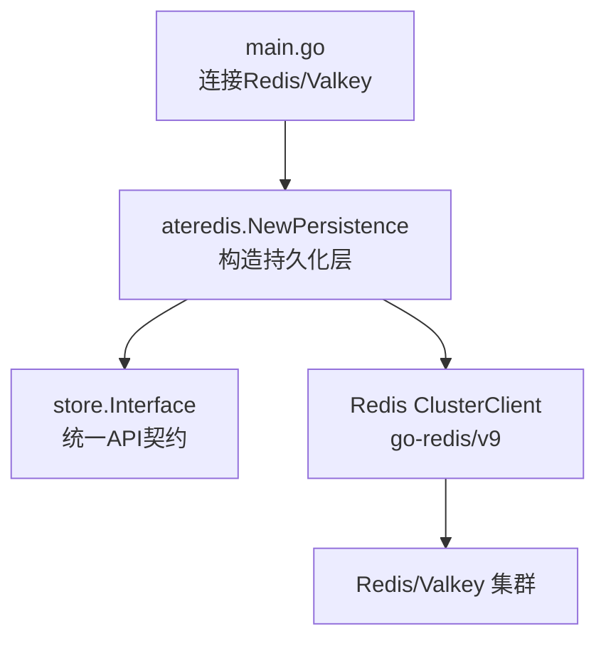
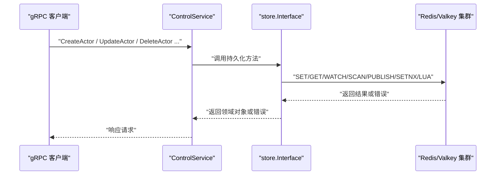
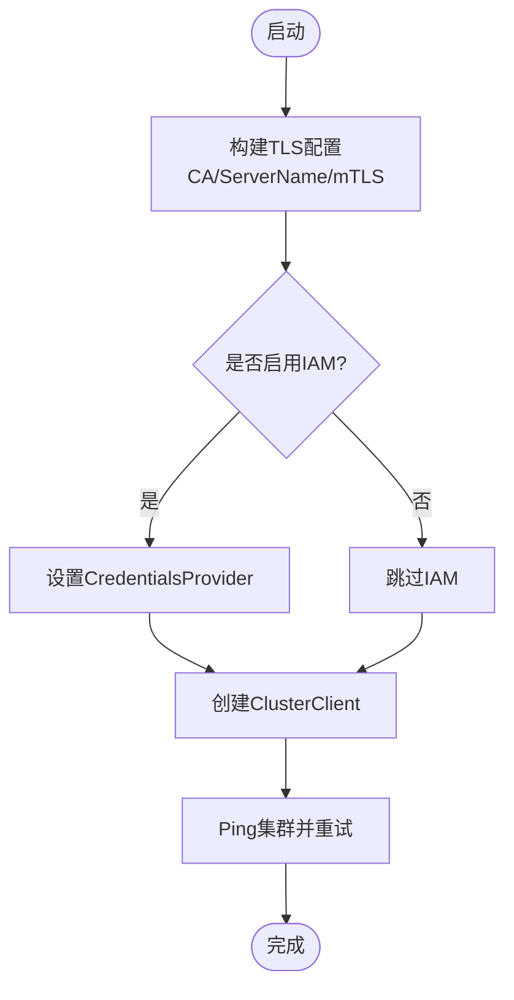
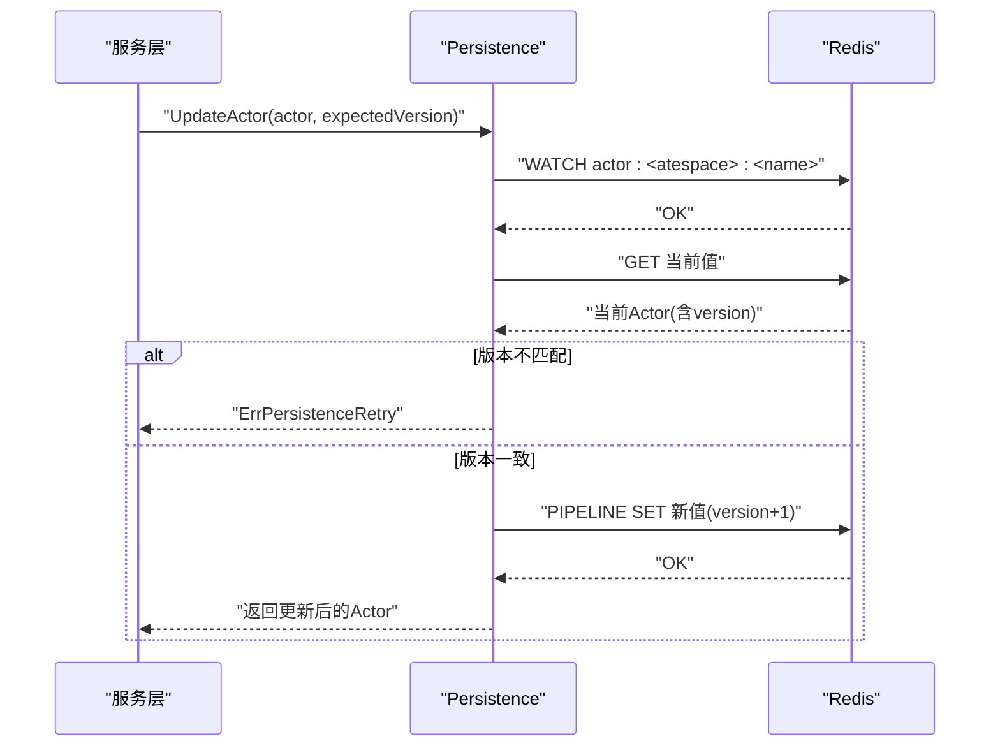
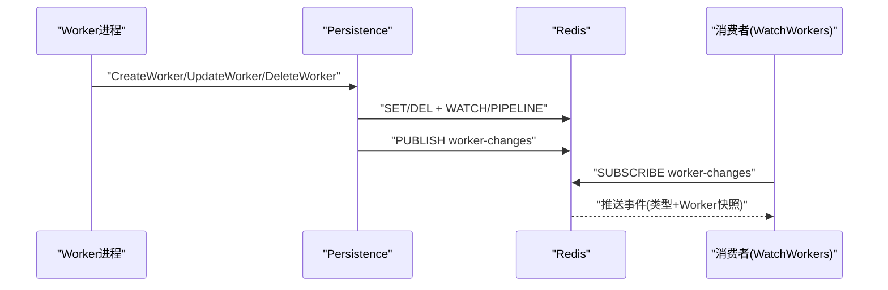
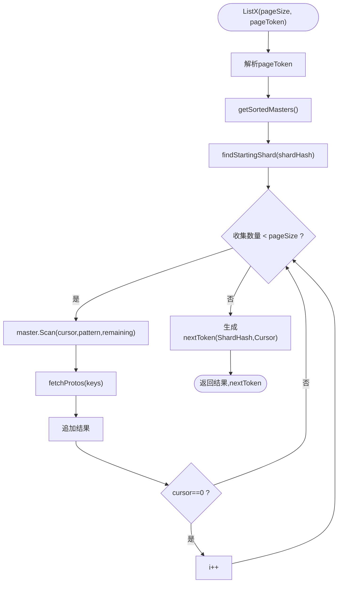
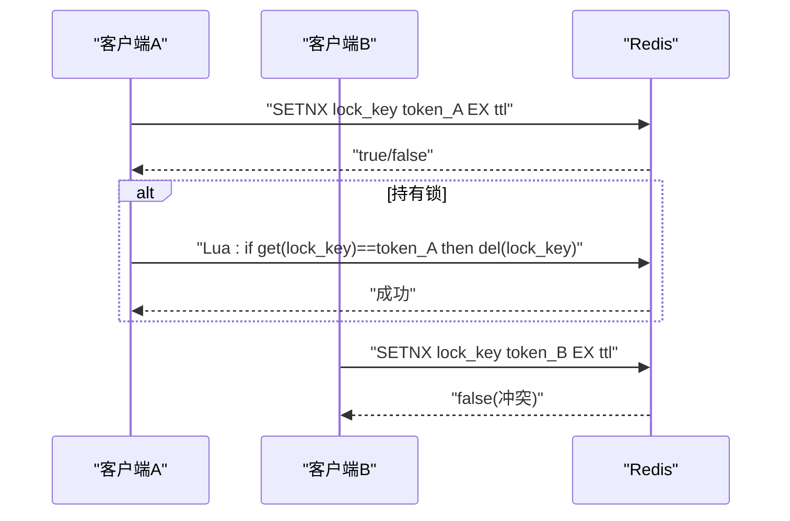
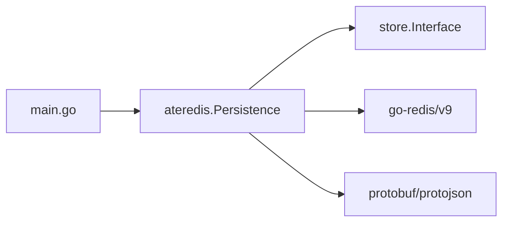

# 状态存储层

<cite>
**本文引用的文件**   
- [cmd/ateapi/internal/store/store.go](file://cmd/ateapi/internal/store/store.go)
- [cmd/ateapi/internal/store/ateredis/ateredis.go](file://cmd/ateapi/internal/store/ateredis/ateredis.go)
- [cmd/ateapi/main.go](file://cmd/ateapi/main.go)
- [cmd/ateapi/internal/store/storetest/storetest.go](file://cmd/ateapi/internal/store/storetest/storetest.go)
- [cmd/ateapi/internal/store/ateredis/ateredis_test.go](file://cmd/ateapi/internal/store/ateredis/ateredis_test.go)
</cite>

## 目录
1. [简介](#简介)
2. [项目结构](#项目结构)
3. [核心组件](#核心组件)
4. [架构总览](#架构总览)
5. [详细组件分析](#详细组件分析)
6. [依赖关系分析](#依赖关系分析)
7. [性能与一致性](#性能与一致性)
8. [安全特性](#安全特性)
9. [故障排查指南](#故障排查指南)
10. [结论](#结论)
11. [附录：数据模型与键空间](#附录数据模型与键空间)

## 简介
本文件系统性阐述 ateapi 的状态存储层设计与实现，重点覆盖以下方面：
- Redis 集群连接管理、TLS 加密通信与 IAM 认证集成
- Actor 状态、工作节点（Worker）信息、Atespace 元数据的存储结构与访问模式
- 分布式锁的实现与使用约束
- 乐观并发控制、事务处理与数据一致性保证
- 分页扫描与跨分片遍历策略
- 缓存机制与工作节点变更订阅
- 最佳实践、性能优化建议、备份恢复与故障转移方案

## 项目结构
状态存储层位于 cmd/ateapi/internal/store 包中，采用接口抽象 + Redis 实现的解耦设计：
- store.Interface：定义持久化层的统一契约（Actor、Atespace、Worker、锁、分页等）
- ateredis.Persistence：基于 Redis/Valkey 的完整实现，包含键空间设计、事务、Pub/Sub、分页扫描、分布式锁等
- main.go：负责构建 Redis 集群客户端（TLS、IAM）、注入到 Persistence 并启动服务

图表来源
- [cmd/ateapi/main.go:111-126](file://cmd/ateapi/main.go#L111-L126)
- [cmd/ateapi/internal/store/ateredis/ateredis.go:76-88](file://cmd/ateapi/internal/store/ateredis/ateredis.go#L76-L88)
- [cmd/ateapi/internal/store/store.go:40-118](file://cmd/ateapi/internal/store/store.go#L40-L118)

章节来源
- [cmd/ateapi/internal/store/store.go:1-155](file://cmd/ateapi/internal/store/store.go#L1-L155)
- [cmd/ateapi/internal/store/ateredis/ateredis.go:1-120](file://cmd/ateapi/internal/store/ateredis/ateredis.go#L1-L120)
- [cmd/ateapi/main.go:111-126](file://cmd/ateapi/main.go#L111-L126)

## 核心组件
- 持久化接口 store.Interface
  - 提供 Actor、Atespace、Worker 的 CRUD 与分页查询
  - 提供 WatchWorkers 订阅 Worker 变更事件
  - 提供 AcquireLock/ReleaseLock 分布式锁能力
  - 提供 DebugClearAll 调试清理能力
- Redis 实现 ateredis.Persistence
  - 以 protojson 序列化 protobuf 对象为字符串值
  - 使用 WATCH + PIPELINE 实现乐观并发更新
  - 使用 SCAN + 多主遍历实现跨分片分页
  - 使用 Pub/Sub 广播 Worker 变更
  - 使用 SETNX + Lua 脚本实现分布式锁

章节来源
- [cmd/ateapi/internal/store/store.go:40-118](file://cmd/ateapi/internal/store/store.go#L40-L118)
- [cmd/ateapi/internal/store/ateredis/ateredis.go:76-88](file://cmd/ateapi/internal/store/ateredis/ateredis.go#L76-L88)

## 架构总览
整体调用链从 gRPC 服务进入，经由控制器逻辑调用 store.Interface，最终由 ateredis.Persistence 落盘至 Redis。

图表来源
- [cmd/ateapi/main.go:155-156](file://cmd/ateapi/main.go#L155-L156)
- [cmd/ateapi/internal/store/store.go:40-118](file://cmd/ateapi/internal/store/store.go#L40-L118)
- [cmd/ateapi/internal/store/ateredis/ateredis.go:313-584](file://cmd/ateapi/internal/store/ateredis/ateredis.go#L313-L584)

## 详细组件分析

### 连接管理与初始化
- TLS 配置
  - 支持自定义 CA、ServerName、双向证书（mTLS）
  - 最小 TLS 版本限制为 1.2
- IAM 认证
  - 可选启用 Google IAM 作为 Redis 连接凭据提供者
- 集群客户端
  - 使用 go-redis v9 的 ClusterClient
  - 启动时执行 ping 重试以确保连通性

图表来源
- [cmd/ateapi/main.go:287-314](file://cmd/ateapi/main.go#L287-L314)
- [cmd/ateapi/main.go:256-285](file://cmd/ateapi/main.go#L256-L285)

章节来源
- [cmd/ateapi/main.go:230-314](file://cmd/ateapi/main.go#L230-L314)

### 数据模型与键空间
- Atespace
  - 键名：atespace:<name>
  - 值：protojson 序列化的 atespace 对象
- Actor
  - 键名：actor:<atespace>:<name>
  - 值：protojson 序列化的 actor 对象
- Worker
  - 键名：worker:<namespace>:<pool>:<pod>
  - 值：protojson 序列化的 worker 对象
- 备注
  - 由于 Redis Lua 在集群模式下对跨槽原子性的限制，关键状态（如 Worker 状态）内联于 Actor 中，避免跨键原子操作

章节来源
- [cmd/ateapi/internal/store/ateredis/ateredis.go:17-39](file://cmd/ateapi/internal/store/ateredis/ateredis.go#L17-L39)
- [cmd/ateapi/internal/store/ateredis/ateredis.go:90-106](file://cmd/ateapi/internal/store/ateredis/ateredis.go#L90-L106)
- [cmd/ateapi/internal/store/ateredis/ateredis.go:210-212](file://cmd/ateapi/internal/store/ateredis/ateredis.go#L210-L212)

### Actor 生命周期与乐观并发
- CreateActor
  - 使用 SetNX 确保幂等创建，不存在则写入，已存在返回“已存在”
- GetActor
  - 直接读取并按 key 校验元数据一致性
- UpdateActor
  - 使用 WATCH + PIPELINE 实现乐观并发：比较 expectedVersion，不一致返回“需重试”
  - 不可变字段校验（名称、atespace、模板命名空间/名称）
  - 自动递增 version 与更新时间
- DeleteActor
  - 仅允许删除处于 SUSPENDED 或 CRASHED 状态的 Actor
  - 使用 WATCH + DEL 保证条件删除

图表来源
- [cmd/ateapi/internal/store/ateredis/ateredis.go:523-584](file://cmd/ateapi/internal/store/ateredis/ateredis.go#L523-L584)

章节来源
- [cmd/ateapi/internal/store/ateredis/ateredis.go:336-358](file://cmd/ateapi/internal/store/ateredis/ateredis.go#L336-L358)
- [cmd/ateapi/internal/store/ateredis/ateredis.go:313-334](file://cmd/ateapi/internal/store/ateredis/ateredis.go#L313-L334)
- [cmd/ateapi/internal/store/ateredis/ateredis.go:481-521](file://cmd/ateapi/internal/store/ateredis/ateredis.go#L481-L521)

### Worker 状态与变更订阅
- CreateWorker
  - SetNX 创建，初始 version=1，发布 Created 事件
- GetWorker / UpdateWorker / DeleteWorker
  - UpdateWorker 使用 WATCH + PIPELINE 进行乐观并发更新，不可变字段校验
  - DeleteWorker 删除后发布 Deleted 事件
- WatchWorkers
  - 通过 Redis Pub/Sub 订阅 worker-changes 频道
  - 返回带缓冲的事件通道，支持 Close 释放订阅

图表来源
- [cmd/ateapi/internal/store/ateredis/ateredis.go:360-479](file://cmd/ateapi/internal/store/ateredis/ateredis.go#L360-L479)
- [cmd/ateapi/internal/store/ateredis/ateredis.go:255-297](file://cmd/ateapi/internal/store/ateredis/ateredis.go#L255-L297)

章节来源
- [cmd/ateapi/internal/store/ateredis/ateredis.go:214-236](file://cmd/ateapi/internal/store/ateredis/ateredis.go#L214-L236)
- [cmd/ateapi/internal/store/ateredis/ateredis.go:244-253](file://cmd/ateapi/internal/store/ateredis/ateredis.go#L244-L253)

### 分页与跨分片扫描
- ListActors / ListAtespaces / ListWorkers
  - 使用 SCAN 按模式迭代键集合
  - 通过 encodePageToken/decodePageToken 记录 ShardHash 与 Cursor
  - getSortedMasters 获取所有 Master 并排序，findStartingShard 定位起始分片
  - fetchProtos 批量 GET 并反序列化为 protobuf 对象

图表来源
- [cmd/ateapi/internal/store/ateredis/ateredis.go:630-702](file://cmd/ateapi/internal/store/ateredis/ateredis.go#L630-L702)
- [cmd/ateapi/internal/store/ateredis/ateredis.go:704-734](file://cmd/ateapi/internal/store/ateredis/ateredis.go#L704-L734)
- [cmd/ateapi/internal/store/ateredis/ateredis.go:736-768](file://cmd/ateapi/internal/store/ateredis/ateredis.go#L736-L768)

章节来源
- [cmd/ateapi/internal/store/ateredis/ateredis.go:158-172](file://cmd/ateapi/internal/store/ateredis/ateredis.go#L158-L172)
- [cmd/ateapi/internal/store/ateredis/ateredis.go:586-600](file://cmd/ateapi/internal/store/ateredis/ateredis.go#L586-L600)

### 分布式锁
- AcquireLock
  - 使用 SETNX + TTL 获取锁，成功返回 true，冲突返回 false
- ReleaseLock
  - 使用 Lua 脚本原子比较并删除，仅当 value 匹配时才释放

图表来源
- [cmd/ateapi/internal/store/ateredis/ateredis.go:770-792](file://cmd/ateapi/internal/store/ateredis/ateredis.go#L770-L792)

章节来源
- [cmd/ateapi/internal/store/ateredis/ateredis_test.go:810-930](file://cmd/ateapi/internal/store/ateredis/ateredis_test.go#L810-L930)

### 调试与测试支撑
- DebugClearAll
  - 遍历每个 Master 执行 FlushAllAsync，用于本地调试清空数据
- 测试环境
  - 使用 miniredis 模拟单实例/多分片集群
  - concurrentMasterClient 模拟 ForEachMaster 并发行为

章节来源
- [cmd/ateapi/internal/store/ateredis/ateredis.go:299-311](file://cmd/ateapi/internal/store/ateredis/ateredis.go#L299-L311)
- [cmd/ateapi/internal/store/storetest/storetest.go:26-47](file://cmd/ateapi/internal/store/storetest/storetest.go#L26-L47)
- [cmd/ateapi/internal/store/ateredis/ateredis_test.go:1252-1436](file://cmd/ateapi/internal/store/ateredis/ateredis_test.go#L1252-L1436)

## 依赖关系分析
- 外部依赖
  - go-redis/v9：Redis/Valkey 集群客户端
  - google.golang.org/protobuf：protojson 编解码
  - google.golang.org/grpc：gRPC 服务入口（间接）
- 内部依赖
  - store.Interface：对外暴露的统一 API
  - workercache：基于 Redis 的工作节点缓存（上层组合）

图表来源
- [cmd/ateapi/main.go:126-128](file://cmd/ateapi/main.go#L126-L128)
- [cmd/ateapi/internal/store/ateredis/ateredis.go:55-62](file://cmd/ateapi/internal/store/ateredis/ateredis.go#L55-L62)
- [cmd/ateapi/internal/store/store.go:18-24](file://cmd/ateapi/internal/store/store.go#L18-L24)

章节来源
- [cmd/ateapi/main.go:111-128](file://cmd/ateapi/main.go#L111-L128)
- [cmd/ateapi/internal/store/ateredis/ateredis.go:42-62](file://cmd/ateapi/internal/store/ateredis/ateredis.go#L42-L62)

## 性能与一致性
- 乐观并发控制
  - 通过 WATCH + PIPELINE 减少锁竞争，提高吞吐；版本不匹配返回 ErrPersistenceRetry，由上层重试
- 批量与流水线
  - fetchProtos 使用 Pipelined 批量 GET，降低网络往返
- 分页与跨分片
  - SCAN 配合页令牌，避免全量扫描；按 Master 地址哈希稳定起始位置，提升可恢复性
- 事件驱动
  - Worker 变更通过 Pub/Sub 异步通知，降低轮询开销
- 注意事项
  - Redis Lua 非 ACID，极端情况下可能出现半写；应避免跨槽原子操作，将相关状态内联（如 Actor 中的 Worker 状态）

章节来源
- [cmd/ateapi/internal/store/ateredis/ateredis.go:17-39](file://cmd/ateapi/internal/store/ateredis/ateredis.go#L17-L39)
- [cmd/ateapi/internal/store/ateredis/ateredis.go:736-768](file://cmd/ateapi/internal/store/ateredis/ateredis.go#L736-L768)
- [cmd/ateapi/internal/store/ateredis/ateredis.go:630-702](file://cmd/ateapi/internal/store/ateredis/ateredis.go#L630-L702)

## 安全特性
- TLS 加密通信
  - 支持自定义 CA、ServerName、双向证书（mTLS），最低 TLS 版本 1.2
- IAM 认证
  - 可选启用 Google IAM 作为 Redis 连接凭据提供者，动态刷新 Access Token
- 鉴权与审计
  - gRPC 层支持 mTLS/JWT 两种认证模式（与存储层无直接耦合）

章节来源
- [cmd/ateapi/main.go:287-314](file://cmd/ateapi/main.go#L287-L314)
- [cmd/ateapi/main.go:256-285](file://cmd/ateapi/main.go#L256-L285)
- [cmd/ateapi/main.go:171-180](file://cmd/ateapi/main.go#L171-L180)

## 故障排查指南
- 常见错误映射
  - redis.Nil → 对应 store.ErrNotFound
  - 版本不匹配/事务失败 → store.ErrPersistenceRetry（应触发重试）
  - 预条件失败（如删除非挂起 Actor）→ store.ErrFailedPrecondition
- 定位步骤
  - 检查键是否存在与格式是否符合约定（前缀、分隔符）
  - 确认 WATCH 事务是否因并发被中止（TxFailedErr）
  - 验证 Pub/Sub 订阅是否建立成功（Receive 超时）
  - 使用 DebugClearAll 清理测试环境数据
- 测试辅助
  - 使用 miniredis 模拟多分片场景，验证跨分片分页与并发行为

章节来源
- [cmd/ateapi/internal/store/store.go:26-38](file://cmd/ateapi/internal/store/store.go#L26-L38)
- [cmd/ateapi/internal/store/ateredis/ateredis.go:313-334](file://cmd/ateapi/internal/store/ateredis/ateredis.go#L313-L334)
- [cmd/ateapi/internal/store/ateredis/ateredis.go:481-521](file://cmd/ateapi/internal/store/ateredis/ateredis.go#L481-L521)
- [cmd/ateapi/internal/store/ateredis/ateredis.go:255-297](file://cmd/ateapi/internal/store/ateredis/ateredis.go#L255-L297)
- [cmd/ateapi/internal/store/ateredis/ateredis.go:299-311](file://cmd/ateapi/internal/store/ateredis/ateredis.go#L299-L311)
- [cmd/ateapi/internal/store/storetest/storetest.go:26-47](file://cmd/ateapi/internal/store/storetest/storetest.go#L26-L47)

## 结论
该状态存储层以 Redis/Valkey 为后端，通过清晰的键空间设计、乐观并发控制、跨分片分页与事件订阅，实现了高可用、可扩展且易于维护的 Actor/Worker/Atespace 状态管理。结合 TLS 与 IAM 的安全能力，满足生产环境的合规与可靠性要求。建议在大规模部署中关注分片拓扑变化、重试退避与监控指标，以进一步提升稳定性与可观测性。

## 附录：数据模型与键空间
- 键空间
  - atespace:<name>
  - actor:<atespace>:<name>
  - worker:<namespace>:<pool>:<pod>
- 序列化
  - 全部使用 protojson 编码，便于人类可读与工具链处理
- 元数据
  - ResourceMetadata 包含 atespace/name/uid/version/create_time/update_time
  - 更新时自动递增 version 与 update_time

章节来源
- [cmd/ateapi/internal/store/ateredis/ateredis.go:90-106](file://cmd/ateapi/internal/store/ateredis/ateredis.go#L90-L106)
- [cmd/ateapi/internal/store/ateredis/ateredis.go:210-212](file://cmd/ateapi/internal/store/ateredis/ateredis.go#L210-L212)
- [cmd/ateapi/internal/store/ateredis/ateredis.go:794-811](file://cmd/ateapi/internal/store/ateredis/ateredis.go#L794-L811)
