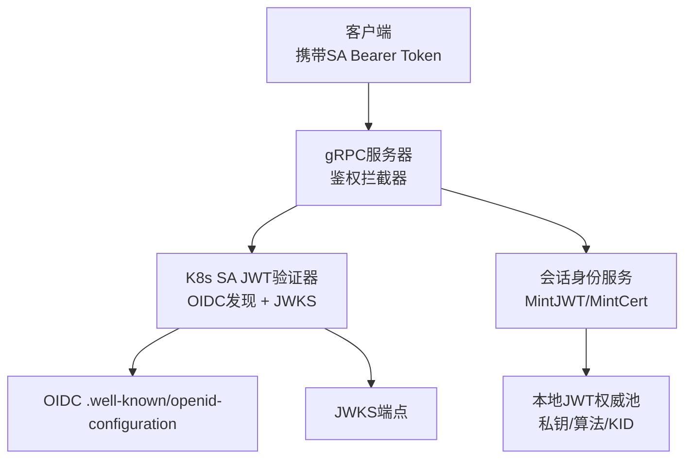
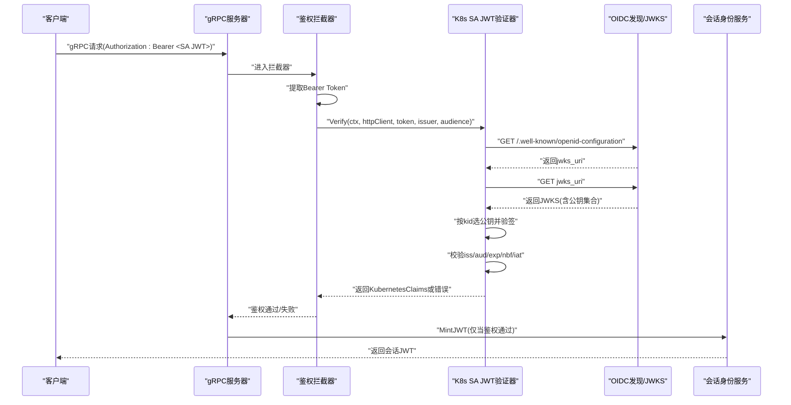
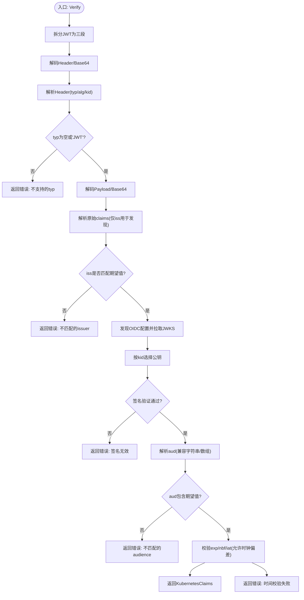
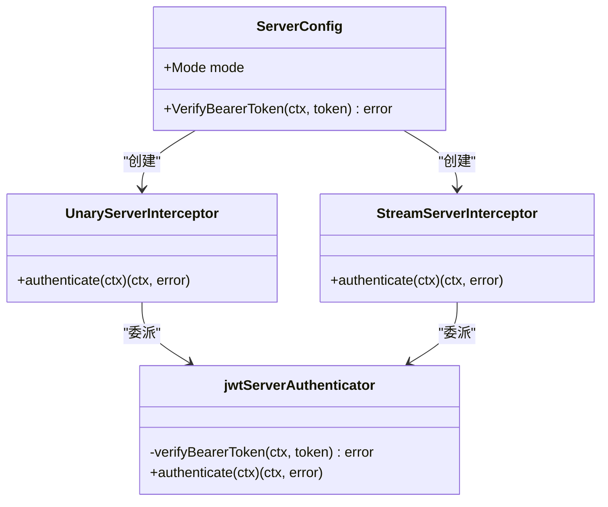
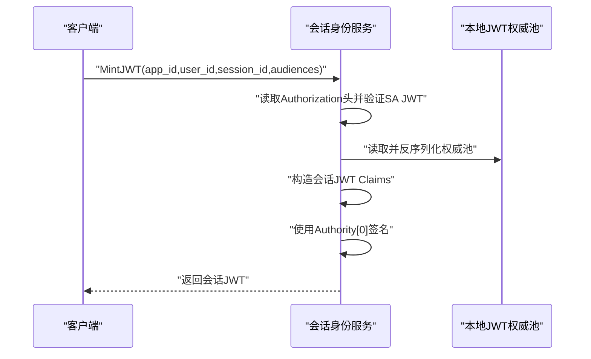
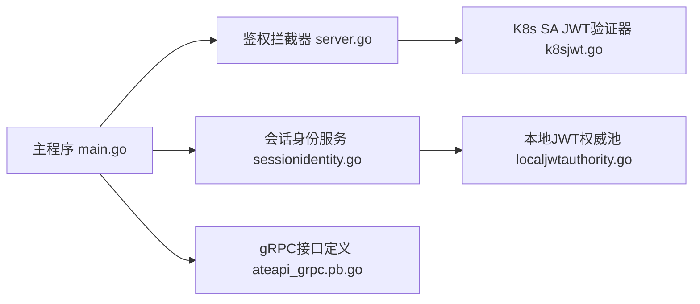

# JWT令牌认证

<cite>
**本文引用的文件列表**
- [k8sjwt.go](file://cmd/ateapi/internal/k8sjwt/k8sjwt.go)
- [server.go](file://internal/ateapiauth/server.go)
- [main.go](file://cmd/ateapi/main.go)
- [sessionidentity.go](file://cmd/ateapi/internal/sessionidentity/sessionidentity.go)
- [localjwtauthority.go](file://internal/localjwtauthority/localjwtauthority.go)
- [admin_make_jwt_pool.go](file://cmd/kubectl-ate/internal/cmd/admin_make_jwt_pool.go)
- [ateapi_grpc.pb.go](file://pkg/proto/ateapipb/ateapi_grpc.pb.go)
</cite>

## 目录
1. [简介](#简介)
2. [项目结构](#项目结构)
3. [核心组件](#核心组件)
4. [架构总览](#架构总览)
5. [详细组件分析](#详细组件分析)
6. [依赖关系分析](#依赖关系分析)
7. [性能考虑](#性能考虑)
8. [故障排查指南](#故障排查指南)
9. [结论](#结论)
10. [附录](#附录)

## 简介
本文件围绕Kubernetes ServiceAccount JWT令牌的签发、验证与解析，以及Bearer Token的提取、校验和错误处理机制进行深入说明。文档结合代码仓库中的实现，解释JWT签名验证、过期时间检查、权限声明解析等关键流程，并提供JWT认证模式的配置示例与集成指南，同时给出安全最佳实践、常见攻击防护与性能优化建议。

## 项目结构
与JWT认证相关的核心位置如下：
- 服务端gRPC鉴权拦截器：负责从请求元数据中抽取Authorization头并调用自定义验签逻辑
- Kubernetes SA JWT验证器：基于OIDC发现与JWKS动态获取公钥，完成签名与时序校验
- 会话身份服务：在已认证的客户端基础上签发“会话JWT”，用于后续短生命周期访问
- 本地JWT密钥池管理：提供生成、序列化与反序列化的能力，便于部署期准备密钥材料
- 命令行工具：一键生成JWT权威池并写入Kubernetes Secret，供运行时加载

图表来源
- [server.go:81-103](file://internal/ateapiauth/server.go#L81-L103)
- [k8sjwt.go:118-261](file://cmd/ateapi/internal/k8sjwt/k8sjwt.go#L118-L261)
- [sessionidentity.go:71-142](file://cmd/ateapi/internal/sessionidentity/sessionidentity.go#L71-L142)
- [localjwtauthority.go:29-101](file://internal/localjwtauthority/localjwtauthority.go#L29-L101)

章节来源
- [server.go:1-182](file://internal/ateapiauth/server.go#L1-L182)
- [k8sjwt.go:1-459](file://cmd/ateapi/internal/k8sjwt/k8sjwt.go#L1-L459)
- [sessionidentity.go:1-226](file://cmd/ateapi/internal/sessionidentity/sessionidentity.go#L1-L226)
- [localjwtauthority.go:1-138](file://internal/localjwtauthority/localjwtauthority.go#L1-L138)

## 核心组件
- gRPC鉴权拦截器（Mode=jwt）
  - 从请求元数据中提取Authorization头，要求形如“Bearer <token>”
  - 将Bearer token交由可插拔的VerifyBearerToken函数进行验证
- Kubernetes SA JWT验证器
  - 解析JWT三段式结构，解码Header/Payload
  - 通过Issuer发现OIDC配置，拉取JWKS，按kid选择公钥
  - 支持RS256/384/512与ES256/384/512签名算法
  - 校验iss、aud、exp/nbf/iat时序，允许一定时钟偏差
  - 返回结构化KubernetesClaims，包含绑定对象信息（namespace、pod、serviceaccount等）
- 会话身份服务
  - 在成功验证客户端SA JWT后，使用本地JWT权威池签发短期会话JWT
  - 支持基于mTLS的证书签发路径（非本文重点）
- 本地JWT权威池
  - 提供ECDSA P256密钥对生成、JSON序列化/反序列化
  - 支持PKCS#8/PEM多种私钥格式

章节来源
- [server.go:35-79](file://internal/ateapiauth/server.go#L35-L79)
- [k8sjwt.go:118-261](file://cmd/ateapi/internal/k8sjwt/k8sjwt.go#L118-L261)
- [sessionidentity.go:71-142](file://cmd/ateapi/internal/sessionidentity/sessionidentity.go#L71-L142)
- [localjwtauthority.go:29-101](file://internal/localjwtauthority/localjwtauthority.go#L29-L101)

## 架构总览
下图展示了从客户端发起gRPC请求到完成JWT验证与签发会话JWT的整体流程。

图表来源
- [server.go:81-103](file://internal/ateapiauth/server.go#L81-L103)
- [k8sjwt.go:118-261](file://cmd/ateapi/internal/k8sjwt/k8sjwt.go#L118-L261)
- [sessionidentity.go:71-142](file://cmd/ateapi/internal/sessionidentity/sessionidentity.go#L71-L142)

## 详细组件分析

### 组件一：Kubernetes SA JWT验证器
职责
- 解析JWT头部与载荷，严格限制在未验签前不信任载荷内容
- 根据issuer发现OIDC配置并拉取JWKS，按kid匹配公钥
- 支持RSA与ECDSA多算法签名验证
- 校验iss、aud、exp/nbf/iat，并返回标准化KubernetesClaims

关键流程
- 分段拆分与Base64RawURL解码
- 仅读取iss以决定发现与JWKS地址
- 选择公钥后进行签名验证
- 验签通过后，再解析aud、时间戳等字段并进行校验

图表来源
- [k8sjwt.go:118-261](file://cmd/ateapi/internal/k8sjwt/k8sjwt.go#L118-L261)
- [k8sjwt.go:263-339](file://cmd/ateapi/internal/k8sjwt/k8sjwt.go#L263-L339)
- [k8sjwt.go:367-431](file://cmd/ateapi/internal/k8sjwt/k8sjwt.go#L367-L431)

章节来源
- [k8sjwt.go:118-261](file://cmd/ateapi/internal/k8sjwt/k8sjwt.go#L118-L261)
- [k8sjwt.go:263-339](file://cmd/ateapi/internal/k8sjwt/k8sjwt.go#L263-L339)
- [k8sjwt.go:367-431](file://cmd/ateapi/internal/k8sjwt/k8sjwt.go#L367-L431)

### 组件二：gRPC鉴权拦截器（Mode=jwt）
职责
- 在mtls与jwt两种模式间切换
- jwt模式下强制要求每个RPC携带有效的SA Bearer Token
- 统一错误码与消息，便于客户端识别未认证状态

要点
- 从metadata中读取authorization头，要求“Bearer ”前缀且token非空
- 调用可插拔的VerifyBearerToken回调执行实际验证
- 未通过时返回Unauthenticated错误码

图表来源
- [server.go:72-103](file://internal/ateapiauth/server.go#L72-L103)
- [server.go:137-152](file://internal/ateapiauth/server.go#L137-L152)

章节来源
- [server.go:35-79](file://internal/ateapiauth/server.go#L35-L79)
- [server.go:81-103](file://internal/ateapiauth/server.go#L81-L103)
- [server.go:137-152](file://internal/ateapiauth/server.go#L137-L152)

### 组件三：会话身份服务（MintJWT）
职责
- 在客户端已通过SA JWT验证的前提下，签发短期会话JWT
- 从本地JWT权威池加载私钥与算法，按策略选择首个Authority进行签名
- 构造包含应用/用户/会话标识的自定义Substrate Claims

要点
- 再次从请求元数据中读取Authorization头并验证客户端SA JWT
- 读取并反序列化本地JWT权威池文件
- 设置合理的Expiration/NotBefore/IssuedAt与随机JTI
- 返回会话JWT给调用方

图表来源
- [sessionidentity.go:71-142](file://cmd/ateapi/internal/sessionidentity/sessionidentity.go#L71-L142)
- [localjwtauthority.go:77-101](file://internal/localjwtauthority/localjwtauthority.go#L77-L101)

章节来源
- [sessionidentity.go:71-142](file://cmd/ateapi/internal/sessionidentity/sessionidentity.go#L71-L142)
- [localjwtauthority.go:77-101](file://internal/localjwtauthority/localjwtauthority.go#L77-L101)

### 组件四：本地JWT权威池与CLI工具
职责
- 生成ECDSA P256密钥对，封装为Authority并序列化为JSON
- 提供kubectl子命令生成权威池Secret，供运行期加载

要点
- 支持PKCS#8与多种PEM私钥格式解析
- CLI命令参数化key-id、secret命名空间与名称
- 将pool数据写入Kubernetes Secret的data.pool字段

章节来源
- [localjwtauthority.go:29-101](file://internal/localjwtauthority/localjwtauthority.go#L29-L101)
- [admin_make_jwt_pool.go:30-77](file://cmd/kubectl-ate/internal/cmd/admin_make_jwt_pool.go#L30-L77)

## 依赖关系分析
- 主进程组装gRPC服务器，注入鉴权拦截器与业务服务
- 鉴权拦截器在jwt模式下调用k8sjwt.Verify进行验证
- 会话身份服务依赖本地JWT权威池进行签名

图表来源
- [main.go:171-196](file://cmd/ateapi/main.go#L171-L196)
- [server.go:81-103](file://internal/ateapiauth/server.go#L81-L103)
- [k8sjwt.go:118-261](file://cmd/ateapi/internal/k8sjwt/k8sjwt.go#L118-L261)
- [sessionidentity.go:71-142](file://cmd/ateapi/internal/sessionidentity/sessionidentity.go#L71-L142)
- [ateapi_grpc.pb.go:762-797](file://pkg/proto/ateapipb/ateapi_grpc.pb.go#L762-L797)

章节来源
- [main.go:171-196](file://cmd/ateapi/main.go#L171-L196)
- [server.go:81-103](file://internal/ateapiauth/server.go#L81-L103)
- [k8sjwt.go:118-261](file://cmd/ateapi/internal/k8sjwt/k8sjwt.go#L118-L261)
- [sessionidentity.go:71-142](file://cmd/ateapi/internal/sessionidentity/sessionidentity.go#L71-L142)
- [ateapi_grpc.pb.go:762-797](file://pkg/proto/ateapipb/ateapi_grpc.pb.go#L762-L797)

## 性能考虑
- OIDC发现与JWKS拉取开销
  - 当前实现每次验证均可能触发HTTP请求；建议在内存中缓存JWKS并按kid命中，减少网络往返
  - 参考实现注释提示需要缓存签名密钥
- HTTP客户端超时
  - 默认HTTP客户端设置了整体请求超时，避免长时间阻塞
- 本地权威池文件I/O
  - 会话JWT签发路径每次从磁盘读取并反序列化权威池，建议引入内存缓存并在必要时热更新
- 算法选择
  - ECDSA相比RSA通常具有更小的密钥尺寸与更快的运算，适合高并发场景

章节来源
- [k8sjwt.go:113-116](file://cmd/ateapi/internal/k8sjwt/k8sjwt.go#L113-L116)
- [sessionidentity.go:50-56](file://cmd/ateapi/internal/sessionidentity/sessionidentity.go#L50-L56)

## 故障排查指南
常见问题与定位方法
- 未携带或格式错误的Authorization头
  - 现象：返回Unauthenticated
  - 定位：检查拦截器是否正确提取“Bearer ”前缀与token
- 签名无效或未知kid
  - 现象：返回签名错误或未知key ID
  - 定位：核对JWKS是否可用、kid是否匹配、算法是否受支持
- iss/aud不匹配
  - 现象：返回issuer或audience校验失败
  - 定位：确认client-jwt-issuer与client-jwt-audience配置正确
- 时间戳异常
  - 现象：返回过期或未生效或未来签发
  - 定位：检查系统时钟偏差与permittedSkew配置
- 无法拉取OIDC/JWKS
  - 现象：发现或JWKS拉取失败
  - 定位：检查网络连通性、CA证书配置与内嵌token注入逻辑

章节来源
- [server.go:141-152](file://internal/ateapiauth/server.go#L141-L152)
- [k8sjwt.go:173-238](file://cmd/ateapi/internal/k8sjwt/k8sjwt.go#L173-L238)
- [k8sjwt.go:367-431](file://cmd/ateapi/internal/k8sjwt/k8sjwt.go#L367-L431)

## 结论
本项目实现了面向Kubernetes ServiceAccount的JWT认证链路：服务端通过gRPC拦截器强制启用Bearer Token校验，验证器基于OIDC发现与JWKS动态获取公钥，完成严格的签名与时序校验，并返回标准化的KubernetesClaims。在此基础上，会话身份服务可签发短期会话JWT，满足细粒度与短生命周期的访问控制需求。配合本地JWT权威池与CLI工具，可实现灵活的密钥管理与部署。

## 附录

### 配置与集成指南（JWT模式）
- 启动参数
  - auth-mode：设置为jwt以启用Bearer Token校验
  - client-jwt-issuer：期望的Kubernetes SA Issuer URL
  - client-jwt-audience：期望的audience
  - client-jwt-ca-cert：用于OIDC发现的CA证书文件（可选）
- 构建gRPC服务器
  - 使用鉴权拦截器链，将VerifyBearerToken指向k8sjwt.Verify
- 签发会话JWT
  - 确保已传入正确的client-jwt-issuer与client-jwt-audience
  - 准备本地JWT权威池文件，并通过命令行工具生成并写入Kubernetes Secret
  - 在会话身份服务中加载权威池并签发会话JWT

章节来源
- [main.go:74-77](file://cmd/ateapi/main.go#L74-L77)
- [main.go:171-196](file://cmd/ateapi/main.go#L171-L196)
- [admin_make_jwt_pool.go:30-77](file://cmd/kubectl-ate/internal/cmd/admin_make_jwt_pool.go#L30-L77)

### 安全最佳实践与防护建议
- 最小权限原则
  - 仅授予必要的ServiceAccount与RBAC权限，避免过度授权
- 强密钥与算法
  - 优先使用ECDSA P256，定期轮换密钥，保持kid唯一性与可见性
- 严格的iss/aud校验
  - 确保只接受来自可信Issuer的令牌，且aud必须精确匹配
- 时间窗口控制
  - 合理设置令牌有效期，缩短会话JWT的生命周期
- 防重放与幂等
  - 利用JTI进行去重与限流，防止令牌重用
- 传输安全
  - 始终使用TLS/mTLS，避免明文传输Bearer Token
- 资源保护
  - 对OIDC/JWKS访问进行速率限制与超时控制，避免被滥用

### 常见攻击防护
- 伪造签名与kid劫持
  - 通过JWKS严格校验与kid白名单匹配，拒绝未知或不受支持的算法
- 时间漂移与重放
  - 严格校验exp/nbf/iat，结合JTI与后端记录进行重复检测
- 跨域/越权访问
  - 基于KubernetesClaims中的namespace、serviceaccount、pod等信息做精细化授权
