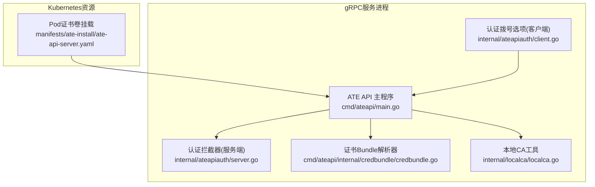
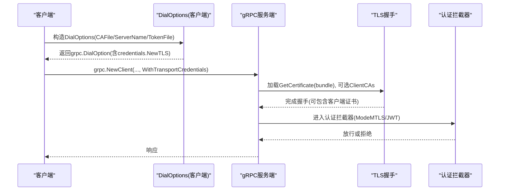
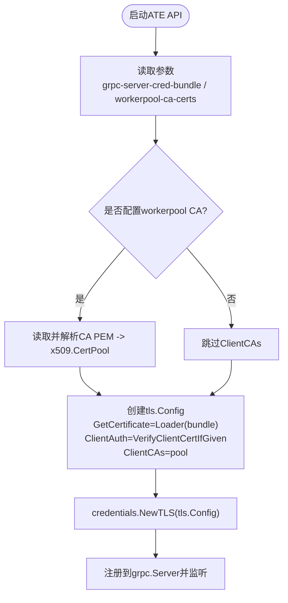
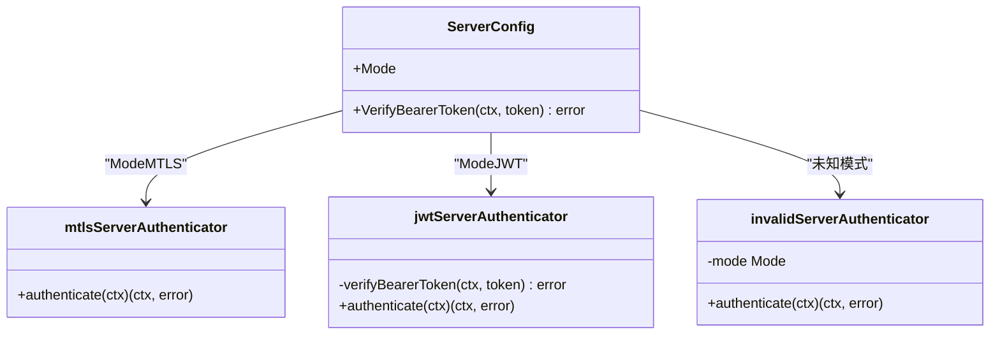
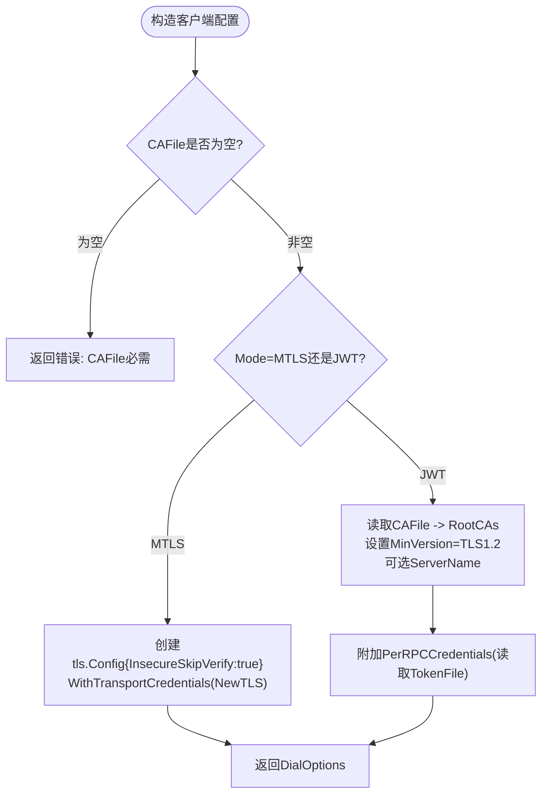
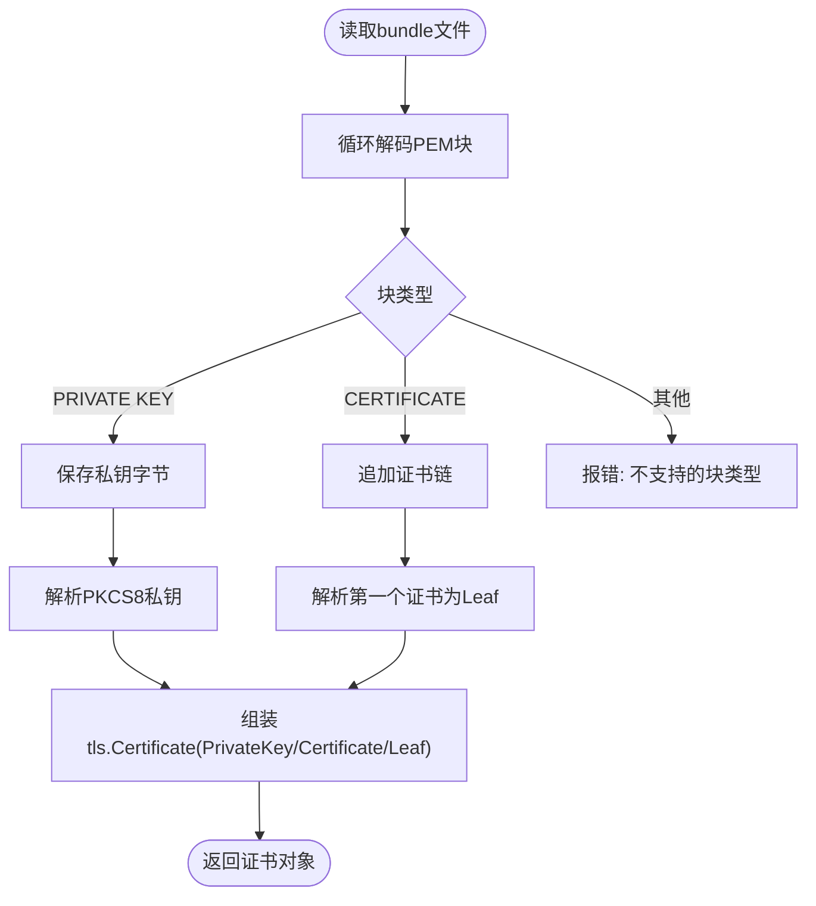
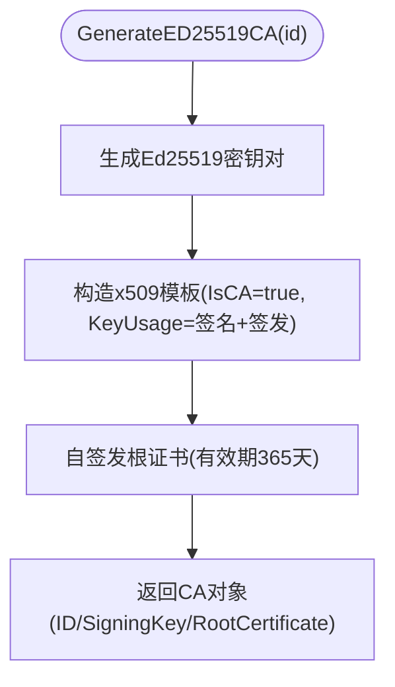
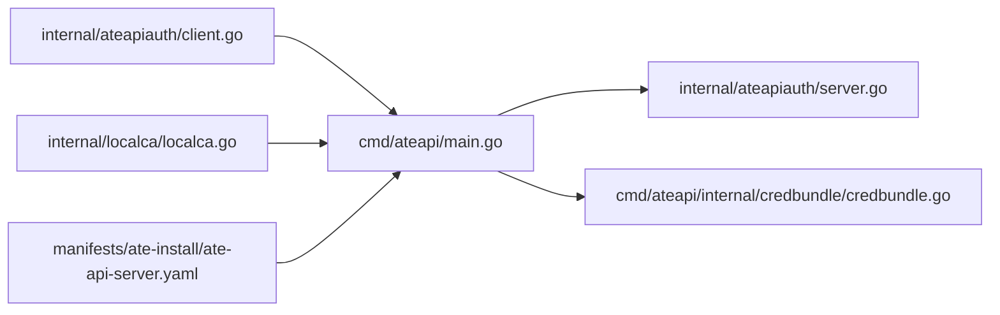

# mTLS双向认证

<cite>
**本文引用的文件**   
- [cmd/ateapi/main.go](file://cmd/ateapi/main.go)
- [internal/ateapiauth/server.go](file://internal/ateapiauth/server.go)
- [internal/ateapiauth/client.go](file://internal/ateapiauth/client.go)
- [cmd/ateapi/internal/credbundle/credbundle.go](file://cmd/ateapi/internal/credbundle/credbundle.go)
- [internal/localca/localca.go](file://internal/localca/localca.go)
- [manifests/ate-install/ate-api-server.yaml](file://manifests/ate-install/ate-api-server.yaml)
</cite>

## 目录
1. [简介](#简介)
2. [项目结构](#项目结构)
3. [核心组件](#核心组件)
4. [架构总览](#架构总览)
5. [详细组件分析](#详细组件分析)
6. [依赖关系分析](#依赖关系分析)
7. [性能与可扩展性](#性能与可扩展性)
8. [故障排查指南](#故障排查指南)
9. [结论](#结论)
10. [附录：配置示例与最佳实践](#附录配置示例与最佳实践)

## 简介
本文件系统性阐述在该项目中如何实现和配置mTLS（双向TLS）认证，覆盖以下要点：
- gRPC传输层凭证的启用方式（客户端与服务端）
- 服务端证书加载、可选的客户端证书校验策略
- CA证书管理与本地CA工具能力
- 认证模式（默认mTLS与可选JWT叠加）
- 证书生命周期管理、轮换与安全注意事项
- 常见问题定位方法

## 项目结构
与mTLS实现直接相关的代码主要分布在以下位置：
- gRPC服务器启动与TransportCredentials构建：cmd/ateapi/main.go
- 认证拦截器（支持mtls/jwt两种模式）：internal/ateapiauth/server.go, internal/ateapiauth/client.go
- 服务端证书bundle解析：cmd/ateapi/internal/credbundle/credbundle.go
- 本地CA生成与序列化：internal/localca/localca.go
- Kubernetes部署清单中的证书挂载与参数注入：manifests/ate-install/ate-api-server.yaml

图表来源
- [cmd/ateapi/main.go:351-373](file://cmd/ateapi/main.go#L351-L373)
- [internal/ateapiauth/server.go:81-127](file://internal/ateapiauth/server.go#L81-L127)
- [internal/ateapiauth/client.go:57-95](file://internal/ateapiauth/client.go#L57-L95)
- [cmd/ateapi/internal/credbundle/credbundle.go:30-92](file://cmd/ateapi/internal/credbundle/credbundle.go#L30-L92)
- [internal/localca/localca.go:159-192](file://internal/localca/localca.go#L159-L192)
- [manifests/ate-install/ate-api-server.yaml:82-92](file://manifests/ate-install/ate-api-server.yaml#L82-L92)

章节来源
- [cmd/ateapi/main.go:56-77](file://cmd/ateapi/main.go#L56-L77)
- [manifests/ate-install/ate-api-server.yaml:82-92](file://manifests/ate-install/ate-api-server.yaml#L82-L92)

## 核心组件
- gRPC服务器TransportCredentials构建
  - 从“证书bundle”文件动态加载服务端私钥与证书链
  - 可选配置客户端CA池，以启用对客户端证书的验证（按需开启）
- 认证拦截器
  - 支持两种模式：ModeMTLS（默认，身份由传输层mTLS建立）、ModeJWT（额外要求Bearer令牌）
  - 提供Unary与Stream拦截器，将认证结果透传到处理逻辑
- 客户端拨号选项
  - 根据模式返回DialOptions；在JWT模式下读取CA并设置RootCAs，同时附加每请求Bearer令牌
- 证书bundle解析器
  - 解析Kubernetes Pod Certificates机制输出的bundle文件（首块为私钥，后续为证书链）
- 本地CA工具
  - 生成ED25519根CA、序列化和反序列化CA池，便于开发与测试环境使用

章节来源
- [cmd/ateapi/main.go:351-373](file://cmd/ateapi/main.go#L351-L373)
- [internal/ateapiauth/server.go:35-70](file://internal/ateapiauth/server.go#L35-L70)
- [internal/ateapiauth/client.go:34-95](file://internal/ateapiauth/client.go#L34-L95)
- [cmd/ateapi/internal/credbundle/credbundle.go:30-92](file://cmd/ateapi/internal/credbundle/credbundle.go#L30-L92)
- [internal/localca/localca.go:30-51](file://internal/localca/localca.go#L30-L51)

## 架构总览
下图展示了mTLS在gRPC连接中的端到端流程：客户端通过DialOptions配置传输层凭证，服务端通过TransportCredentials加载自身证书，并在可选情况下校验客户端证书。

图表来源
- [internal/ateapiauth/client.go:57-95](file://internal/ateapiauth/client.go#L57-L95)
- [cmd/ateapi/main.go:351-373](file://cmd/ateapi/main.go#L351-L373)
- [internal/ateapiauth/server.go:81-127](file://internal/ateapiauth/server.go#L81-L127)

## 详细组件分析

### 服务端TransportCredentials与证书加载
- 关键行为
  - 从命令行参数指定的bundle文件加载私钥与证书链（用于GetCertificate回调）
  - 可选加载workerpool CA池，作为ClientCAs，配合ClientAuth=tls.VerifyClientCertIfGiven实现对客户端证书的可选校验
- 安全要点
  - 生产环境建议开启客户端证书校验，仅信任受控CA签发的客户端证书
  - bundle文件应通过安全卷挂载，避免明文泄露

图表来源
- [cmd/ateapi/main.go:351-373](file://cmd/ateapi/main.go#L351-L373)
- [cmd/ateapi/internal/credbundle/credbundle.go:30-92](file://cmd/ateapi/internal/credbundle/credbundle.go#L30-L92)

章节来源
- [cmd/ateapi/main.go:351-373](file://cmd/ateapi/main.go#L351-L373)
- [cmd/ateapi/internal/credbundle/credbundle.go:30-92](file://cmd/ateapi/internal/credbundle/credbundle.go#L30-L92)

### 认证拦截器（ModeMTLS与ModeJWT）
- ModeMTLS（默认）
  - 不执行应用层鉴权，身份由传输层mTLS建立
- ModeJWT
  - 要求每个RPC携带Authorization: Bearer <token>，并通过外部验证器校验
- 拦截器类型
  - UnaryServerInterceptor与StreamServerInterceptor均基于同一认证器工厂选择具体实现

图表来源
- [internal/ateapiauth/server.go:72-127](file://internal/ateapiauth/server.go#L72-L127)

章节来源
- [internal/ateapiauth/server.go:35-70](file://internal/ateapiauth/server.go#L35-L70)
- [internal/ateapiauth/server.go:81-127](file://internal/ateapiauth/server.go#L81-L127)

### 客户端DialOptions与传输层凭证
- ModeMTLS（当前实现）
  - 使用InsecureSkipVerify=true的TLS配置（开发/内网场景），暂不强制校验服务端证书
  - 注意：该模式仅适用于可信网络或已具备其他边界防护的场景
- ModeJWT
  - 读取CAFile构建RootCAs，设置MinVersion=TLS1.2，并可指定ServerName进行主机名校验
  - 附加PerRPCCredentials，每次请求从磁盘读取最新ServiceAccount Token（支持自动轮换）

图表来源
- [internal/ateapiauth/client.go:57-95](file://internal/ateapiauth/client.go#L57-L95)
- [internal/ateapiauth/client.go:97-117](file://internal/ateapiauth/client.go#L97-L117)

章节来源
- [internal/ateapiauth/client.go:34-95](file://internal/ateapiauth/client.go#L34-L95)
- [internal/ateapiauth/client.go:97-117](file://internal/ateapiauth/client.go#L97-L117)

### 证书Bundle解析器
- 功能
  - 解析Kubernetes Pod Certificates输出的bundle文件：首个PEM块为私钥，其余为证书链（叶子到根顺序）
  - 返回可用于tls.Config.GetCertificate的tls.Certificate对象
- 用途
  - 在服务端动态加载证书，无需重启即可随卷更新生效

图表来源
- [cmd/ateapi/internal/credbundle/credbundle.go:30-92](file://cmd/ateapi/internal/credbundle/credbundle.go#L30-L92)

章节来源
- [cmd/ateapi/internal/credbundle/credbundle.go:30-92](file://cmd/ateapi/internal/credbundle/credbundle.go#L30-L92)

### 本地CA工具（开发与测试）
- 功能
  - 生成ED25519根CA（IsCA=true，有效期一年）
  - 支持将CA池序列化为JSON（含私钥与证书DER/PEM），以及反序列化恢复
- 适用场景
  - 快速搭建本地mTLS链路，生成根CA与中间证书，供开发/测试使用

图表来源
- [internal/localca/localca.go:159-192](file://internal/localca/localca.go#L159-L192)

章节来源
- [internal/localca/localca.go:30-51](file://internal/localca/localca.go#L30-L51)
- [internal/localca/localca.go:159-192](file://internal/localca/localca.go#L159-L192)

## 依赖关系分析
- 模块耦合
  - main.go依赖认证拦截器与证书bundle解析器，负责组装gRPC服务器与TransportCredentials
  - client.go提供客户端DialOptions，按模式组合TLS与PerRPCCredentials
  - credbundle.go被main.go用于动态加载服务端证书
  - localca.go提供本地CA能力，便于生成根CA与中间证书
- 外部集成点
  - Kubernetes Pod Certificates卷挂载（bundle文件路径）
  - ServiceAccount Token文件（JWT模式下的Bearer令牌来源）

图表来源
- [cmd/ateapi/main.go:351-373](file://cmd/ateapi/main.go#L351-L373)
- [internal/ateapiauth/server.go:81-127](file://internal/ateapiauth/server.go#L81-L127)
- [internal/ateapiauth/client.go:57-95](file://internal/ateapiauth/client.go#L57-L95)
- [cmd/ateapi/internal/credbundle/credbundle.go:30-92](file://cmd/ateapi/internal/credbundle/credbundle.go#L30-L92)
- [internal/localca/localca.go:159-192](file://internal/localca/localca.go#L159-L192)
- [manifests/ate-install/ate-api-server.yaml:82-92](file://manifests/ate-install/ate-api-server.yaml#L82-L92)

章节来源
- [cmd/ateapi/main.go:56-77](file://cmd/ateapi/main.go#L56-L77)
- [manifests/ate-install/ate-api-server.yaml:82-92](file://manifests/ate-install/ate-api-server.yaml#L82-L92)

## 性能与可扩展性
- 证书加载
  - GetCertificate回调每次握手时读取bundle文件，存在I/O开销；在生产环境中建议引入缓存机制以减少频繁读取
- 客户端证书校验
  - 仅在需要强身份控制时开启ClientCAs与VerifyClientCertIfGiven，避免不必要的握手失败与日志噪声
- 令牌读取
  - JWT模式下每次请求读取TokenFile，利用Kubernetes原地刷新特性，兼顾安全性与可用性

[本节为通用指导，不涉及特定文件分析]

## 故障排查指南
- 常见症状与定位
  - 握手失败（证书链不完整或根不受信）
    - 检查服务端bundle文件是否包含完整的证书链（叶子到根）
    - 确认客户端RootCAs是否正确配置（JWT模式）
  - 客户端证书校验失败
    - 确认服务端是否配置了ClientCAs，且客户端证书由受信任CA签发
  - JWT模式认证失败
    - 检查TokenFile是否存在且非空
    - 确认Authorization头格式为“Bearer <token>”
  - 证书未生效
    - 确认bundle文件路径正确挂载，且进程能读取新内容
- 建议步骤
  - 打印最终flag值与证书路径，确认配置一致
  - 使用本地CA工具生成测试证书，逐步验证链路
  - 在JWT模式下，确保CAFile可读且包含有效证书

章节来源
- [internal/ateapiauth/client.go:97-117](file://internal/ateapiauth/client.go#L97-L117)
- [cmd/ateapi/main.go:230-246](file://cmd/ateapi/main.go#L230-L246)

## 结论
本项目在gRPC层面实现了灵活的mTLS与可选JWT叠加认证：
- 默认ModeMTLS下，身份由传输层建立，服务端可选择性地校验客户端证书
- ModeJWT下，结合CA校验与Bearer令牌，满足更严格的身份与授权需求
- 通过bundle文件与本地CA工具，简化证书管理与开发体验
- 生产环境建议开启客户端证书校验、最小化权限与严格的主机名校验，并完善证书轮换策略

[本节为总结性内容，不涉及特定文件分析]

## 附录：配置示例与最佳实践

### 服务端配置（生产环境）
- 启用mTLS并校验客户端证书
  - 设置grpc-server-cred-bundle指向bundle文件
  - 设置workerpool-ca-certs指向客户端CA信任束
  - 保持ClientAuth=tls.VerifyClientCertIfGiven，确保仅当客户端提供证书时才校验
- 参考清单片段
  - 证书卷挂载与参数注入见清单文件

章节来源
- [cmd/ateapi/main.go:351-373](file://cmd/ateapi/main.go#L351-L373)
- [manifests/ate-install/ate-api-server.yaml:82-92](file://manifests/ate-install/ate-api-server.yaml#L82-L92)

### 客户端配置（开发环境）
- ModeMTLS（快速连通）
  - 使用InsecureSkipVerify=true的TLS配置，仅用于可信网络或本地调试
- ModeJWT（带令牌）
  - 配置CAFile与TokenFile，启用RootCAs与PerRPCCredentials

章节来源
- [internal/ateapiauth/client.go:57-95](file://internal/ateapiauth/client.go#L57-L95)
- [internal/ateapiauth/client.go:97-117](file://internal/ateapiauth/client.go#L97-L117)

### 证书生命周期管理与轮换策略
- 服务端证书
  - 使用Kubernetes Pod Certificates机制输出bundle文件，进程通过GetCertificate动态加载，无需重启
- 客户端证书
  - 由受控CA签发，定期轮换；服务端维护受信任CA列表（ClientCAs）
- 令牌轮换
  - JWT模式下，TokenFile由Kubernetes原地刷新，客户端每次请求重新读取，自动生效

章节来源
- [cmd/ateapi/internal/credbundle/credbundle.go:30-92](file://cmd/ateapi/internal/credbundle/credbundle.go#L30-L92)
- [internal/ateapiauth/client.go:97-117](file://internal/ateapiauth/client.go#L97-L117)

### 安全注意事项
- 禁止在生产环境使用InsecureSkipVerify
- 严格限制bundle文件与CA文件的访问权限
- 启用TLS最低版本（至少TLS1.2）
- 合理设置ServerName进行主机名校验
- 谨慎开启客户端证书校验，并确保仅信任受控CA

[本节为通用安全建议，不涉及特定文件分析]
