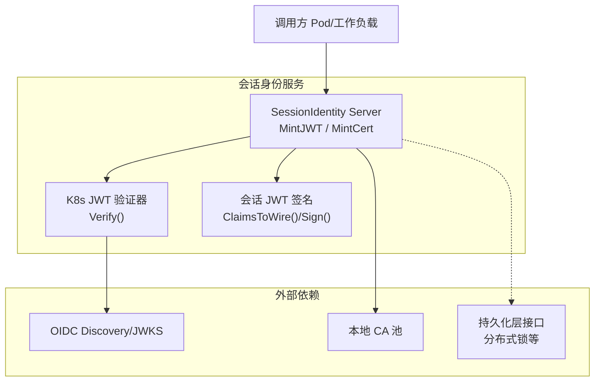
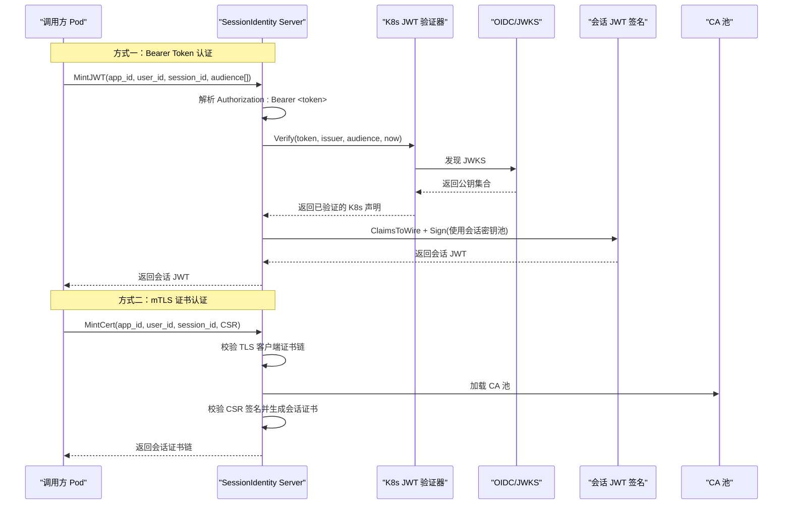
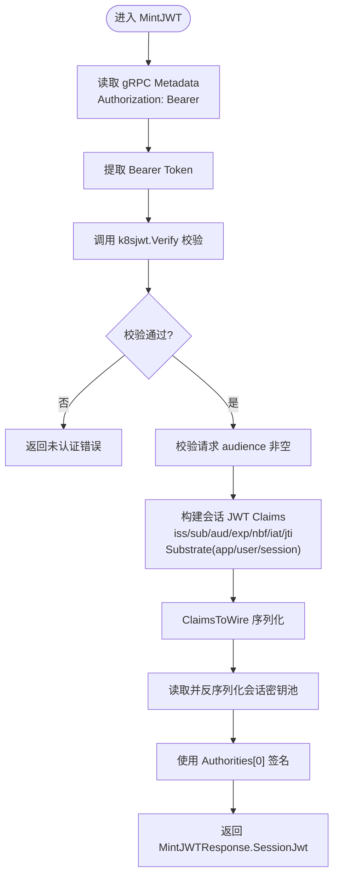
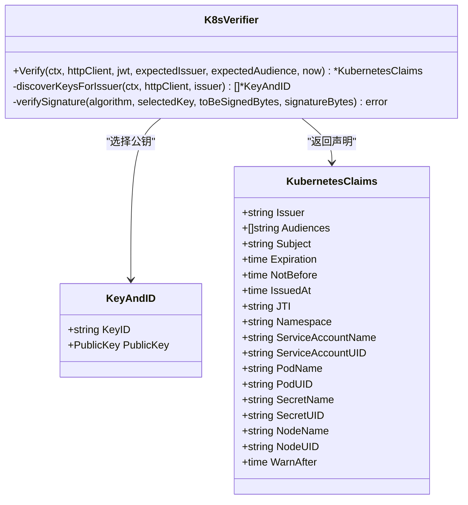
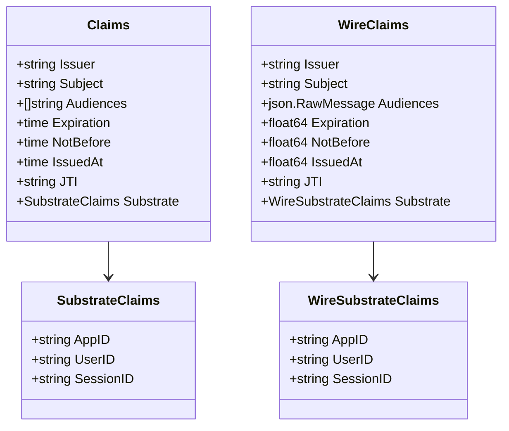
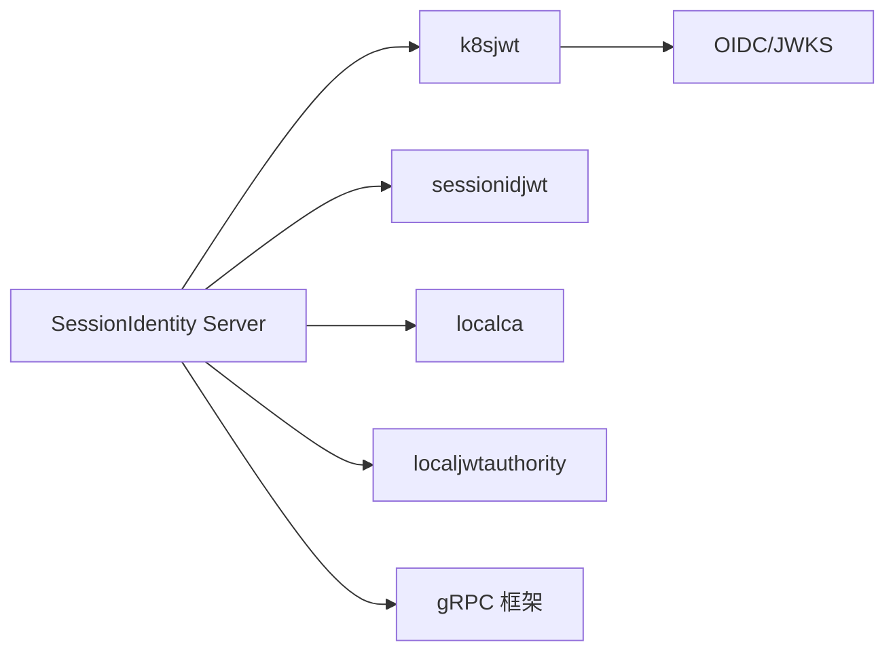

# 会话身份管理

<cite>
**本文引用的文件列表**
- [sessionidentity.go](file://cmd/ateapi/internal/sessionidentity/sessionidentity.go)
- [sessionidjwt.go](file://cmd/ateapi/internal/sessionidjwt/sessionidjwt.go)
- [k8sjwt.go](file://cmd/ateapi/internal/k8sjwt/k8sjwt.go)
- [ateapi_grpc.pb.go](file://pkg/proto/ateapipb/ateapi_grpc.pb.go)
- [ateapi.pb.go](file://pkg/proto/ateapipb/ateapi.pb.go)
- [store.go](file://cmd/ateapi/internal/store/store.go)
</cite>

## 目录
1. [简介](#简介)
2. [项目结构](#项目结构)
3. [核心组件](#核心组件)
4. [架构总览](#架构总览)
5. [详细组件分析](#详细组件分析)
6. [依赖关系分析](#依赖关系分析)
7. [性能考虑](#性能考虑)
8. [故障排查指南](#故障排查指南)
9. [结论](#结论)
10. [附录：API 使用与集成示例](#附录api-使用与集成示例)

## 简介
本文件围绕“会话身份管理”的设计与实现，系统阐述以下方面：
- 会话 JWT 的签发流程、身份信息封装与传递机制
- 会话生命周期（创建、更新、续期、销毁）在现有代码中的现状与扩展点
- 会话状态存储、并发访问控制与安全策略
- API 接口定义与调用方式
- 安全最佳实践、防重放措施与性能调优建议

当前仓库实现了基于 gRPC 的 SessionIdentity 服务，提供两类会话凭证：
- 会话级 JWT（MintJWT）
- 会话级证书（MintCert，mTLS 场景）

同时提供了 Kubernetes 绑定令牌验证器，用于校验调用方的 Pod 身份。

## 项目结构
与“会话身份管理”直接相关的核心位置如下：
- cmd/ateapi/internal/sessionidentity：SessionIdentity 服务端实现（MintJWT/MintCert）
- cmd/ateapi/internal/sessionidjwt：会话 JWT 的 Claims 结构与签名实现
- cmd/ateapi/internal/k8sjwt：Kubernetes 绑定令牌的解析与验签
- pkg/proto/ateapipb：gRPC 接口与消息定义（MintJWT/MintCert）
- cmd/ateapi/internal/store：持久化层通用接口（含分布式锁能力）

图表来源
- [sessionidentity.go:70-142](file://cmd/ateapi/internal/sessionidentity/sessionidentity.go#L70-L142)
- [sessionidentity.go:144-225](file://cmd/ateapi/internal/sessionidentity/sessionidentity.go#L144-L225)
- [k8sjwt.go:118-261](file://cmd/ateapi/internal/k8sjwt/k8sjwt.go#L118-L261)
- [sessionidjwt.go:76-164](file://cmd/ateapi/internal/sessionidjwt/sessionidjwt.go#L76-L164)
- [ateapi_grpc.pb.go:799-829](file://pkg/proto/ateapipb/ateapi_grpc.pb.go#L799-L829)

章节来源
- [sessionidentity.go:1-226](file://cmd/ateapi/internal/sessionidentity/sessionidentity.go#L1-L226)
- [sessionidjwt.go:1-171](file://cmd/ateapi/internal/sessionidjwt/sessionidjwt.go#L1-L171)
- [k8sjwt.go:1-459](file://cmd/ateapi/internal/k8sjwt/k8sjwt.go#L1-L459)
- [ateapi_grpc.pb.go:799-881](file://pkg/proto/ateapipb/ateapi_grpc.pb.go#L799-L881)
- [ateapi.pb.go:1947-2077](file://pkg/proto/ateapipb/ateapi.pb.go#L1947-L2077)

## 核心组件
- SessionIdentity Server
  - 负责鉴权调用方（支持 Bearer Token 或 mTLS），并签发会话级 JWT 或证书
  - 关键方法：MintJWT、MintCert
- Kubernetes JWT 验证器
  - 从 OIDC Discovery 获取 JWKS，按 kid 选择公钥，完成签名校验与时序检查
- 会话 JWT 模块
  - 定义标准 RFC7519 字段及自定义 Substrate 字段，提供 Claims 到 Wire 的转换与签名
- gRPC 接口定义
  - SessionIdentityServer 暴露 MintJWT 与 MintCert 两个 RPC
- 持久化层接口
  - 提供 Actor/Atespace/Worker 等资源的 CRUD、Watch 以及分布式锁能力（可用于会话状态与并发控制）

章节来源
- [sessionidentity.go:43-69](file://cmd/ateapi/internal/sessionidentity/sessionidentity.go#L43-L69)
- [k8sjwt.go:118-261](file://cmd/ateapi/internal/k8sjwt/k8sjwt.go#L118-L261)
- [sessionidjwt.go:30-98](file://cmd/ateapi/internal/sessionidjwt/sessionidjwt.go#L30-L98)
- [ateapi_grpc.pb.go:799-829](file://pkg/proto/ateapipb/ateapi_grpc.pb.go#L799-L829)
- [store.go:40-118](file://cmd/ateapi/internal/store/store.go#L40-L118)

## 架构总览
下图展示了会话身份服务的端到端交互：调用方以 K8s 绑定令牌或 mTLS 证书认证，请求会话级凭证；服务端校验后签发 JWT 或证书。

图表来源
- [sessionidentity.go:70-142](file://cmd/ateapi/internal/sessionidentity/sessionidentity.go#L70-L142)
- [sessionidentity.go:144-225](file://cmd/ateapi/internal/sessionidentity/sessionidentity.go#L144-L225)
- [k8sjwt.go:118-261](file://cmd/ateapi/internal/k8sjwt/k8sjwt.go#L118-L261)
- [sessionidjwt.go:76-164](file://cmd/ateapi/internal/sessionidjwt/sessionidjwt.go#L76-L164)

## 详细组件分析

### 组件一：SessionIdentity 服务（MintJWT/MintCert）
- 认证入口
  - Bearer Token：从 gRPC metadata 中读取 Authorization，提取 Bearer token，交由 k8sjwt.Verify 校验
  - mTLS：从 peer.AuthInfo 中提取 TLSInfo，校验对端证书存在
- MintJWT 流程要点
  - 校验调用方 K8s 绑定令牌有效且受众匹配
  - 校验请求参数至少包含一个 audience
  - 构造会话 JWT Claims（包含 app/user/session 标识），设置 exp/nbf/iat/jti
  - 使用本地会话密钥池中的第一个 Authority 进行签名，返回会话 JWT
- MintCert 流程要点
  - 校验 mTLS 客户端证书
  - 校验 app_id/user_id/session_id 必填
  - 加载本地 CA 池，解析并校验 CSR 签名
  - 基于 CSR 公钥与模板生成会话证书（SPiffe URI 主题），返回证书链

图表来源
- [sessionidentity.go:70-142](file://cmd/ateapi/internal/sessionidentity/sessionidentity.go#L70-L142)
- [sessionidjwt.go:76-164](file://cmd/ateapi/internal/sessionidjwt/sessionidjwt.go#L76-L164)

章节来源
- [sessionidentity.go:70-142](file://cmd/ateapi/internal/sessionidentity/sessionidentity.go#L70-L142)
- [sessionidentity.go:144-225](file://cmd/ateapi/internal/sessionidentity/sessionidentity.go#L144-L225)

### 组件二：Kubernetes JWT 验证器
- 功能
  - 解析 JWT 三段式结构，解码 header/payload
  - 根据 iss 发现 OIDC 配置，拉取 JWKS，按 kid 选择公钥
  - 校验签名（支持 RS256/RS384/RS512 与 ES256/ES384/ES512）
  - 校验受众、时间窗口（exp/nbf/iat）
- 输出
  - 返回结构化 KubernetesClaims，包含命名空间、ServiceAccount、Pod、Secret、Node 等绑定信息

图表来源
- [k8sjwt.go:118-261](file://cmd/ateapi/internal/k8sjwt/k8sjwt.go#L118-L261)
- [k8sjwt.go:367-431](file://cmd/ateapi/internal/k8sjwt/k8sjwt.go#L367-L431)
- [k8sjwt.go:263-339](file://cmd/ateapi/internal/k8sjwt/k8sjwt.go#L263-L339)

章节来源
- [k8sjwt.go:118-261](file://cmd/ateapi/internal/k8sjwt/k8sjwt.go#L118-L261)
- [k8sjwt.go:367-431](file://cmd/ateapi/internal/k8sjwt/k8sjwt.go#L367-L431)

### 组件三：会话 JWT 模块
- 数据结构
  - Claims：标准 RFC7519 字段 + Substrate 自定义字段（appID/userID/sessionID）
  - WireClaims/WireSubstrateClaims：JSON 序列化形态
- 行为
  - ClaimsToWire：将内部 Claims 转换为可序列化的 WireClaims
  - Sign：根据算法（RS256/RS384/RS512/ES256）计算签名并拼接成 JWT 字符串

图表来源
- [sessionidjwt.go:30-98](file://cmd/ateapi/internal/sessionidjwt/sessionidjwt.go#L30-L98)

章节来源
- [sessionidjwt.go:30-98](file://cmd/ateapi/internal/sessionidjwt/sessionidjwt.go#L30-L98)
- [sessionidjwt.go:100-164](file://cmd/ateapi/internal/sessionidjwt/sessionidjwt.go#L100-L164)

### 组件四：gRPC 接口定义
- SessionIdentityServer
  - MintJWT：请求会话级 JWT
  - MintCert：请求会话级证书（mTLS）
- 消息类型
  - MintJWTRequest：包含 audience、app_id、user_id、session_id
  - MintJWTResponse：返回 session_jwt
  - MintCertRequest：包含 app_id、user_id、session_id、CSR
  - MintCertResponse：返回证书链

章节来源
- [ateapi_grpc.pb.go:799-829](file://pkg/proto/ateapipb/ateapi_grpc.pb.go#L799-L829)
- [ateapi.pb.go:1947-2077](file://pkg/proto/ateapipb/ateapi.pb.go#L1947-L2077)

### 组件五：持久化与并发控制
- 接口能力
  - 资源 CRUD、分页、监听事件
  - 分布式锁 AcquireLock/ReleaseLock（带 TTL 与值匹配释放）
- 与会话管理的结合点
  - 可将“会话-工作节点映射”、“会话状态机”、“会话续期/销毁”等逻辑落盘
  - 利用分布式锁保证跨实例的互斥操作（如会话迁移、续期原子性）

章节来源
- [store.go:40-118](file://cmd/ateapi/internal/store/store.go#L40-L118)

## 依赖关系分析
- SessionIdentity Server 依赖
  - k8sjwt：验证调用方 K8s 绑定令牌
  - sessionidjwt：构造并签名会话 JWT
  - localca/localjwtauthority：加载 CA 池与密钥池（由外部文件提供）
  - gRPC 框架：注册与处理 RPC
- 外部依赖
  - OIDC/JWKS：动态获取 K8s 公钥
  - 文件系统：会话密钥池与 CA 池文件
  - 可选：持久化层（用于会话状态与并发控制）

图表来源
- [sessionidentity.go:70-142](file://cmd/ateapi/internal/sessionidentity/sessionidentity.go#L70-L142)
- [sessionidentity.go:144-225](file://cmd/ateapi/internal/sessionidentity/sessionidentity.go#L144-L225)
- [k8sjwt.go:367-431](file://cmd/ateapi/internal/k8sjwt/k8sjwt.go#L367-L431)

章节来源
- [sessionidentity.go:1-226](file://cmd/ateapi/internal/sessionidentity/sessionidentity.go#L1-L226)
- [k8sjwt.go:1-459](file://cmd/ateapi/internal/k8sjwt/k8sjwt.go#L1-L459)

## 性能考虑
- 密钥缓存
  - 代码中存在 TODO：缓存签名密钥，避免每次从磁盘读取
  - 建议：在进程内维护会话密钥池与 CA 池的内存缓存，并支持热更新与版本切换
- OIDC/JWKS 缓存
  - 当前每次校验可能触发网络请求
  - 建议：按 kid 缓存公钥，并在发现文档变更时刷新
- 并发与锁
  - 若引入会话状态存储，建议使用 store.AcquireLock/ReleaseLock 实现跨实例互斥
  - 合理设置 TTL，避免死锁与长时间持有
- 证书签发
  - 证书链组装与 X509 操作开销较大，建议批量预热与复用模板对象

[本节为通用性能建议，不直接分析具体文件]

## 故障排查指南
- 常见错误定位
  - 未认证：检查 Authorization 头格式与内容，确认 issuer/audience 匹配
  - 未知 key ID：核对 OIDC/JWKS 是否可用，kid 是否与 JWT header 一致
  - 时间窗口异常：检查系统时钟同步与 nbf/exp/iat 设置
  - CSR 校验失败：确认 CSR 签名与公钥匹配，CA 池正确加载
- 日志与上下文
  - 使用 slog 记录关键步骤（如“Verified client JWT”、“Failed to load session CA”）
  - 结合 gRPC 拦截器记录请求元数据与耗时

章节来源
- [sessionidentity.go:84-90](file://cmd/ateapi/internal/sessionidentity/sessionidentity.go#L84-L90)
- [sessionidentity.go:168-178](file://cmd/ateapi/internal/sessionidentity/sessionidentity.go#L168-L178)
- [k8sjwt.go:173-238](file://cmd/ateapi/internal/k8sjwt/k8sjwt.go#L173-L238)

## 结论
当前实现提供了完整的会话身份签发能力：
- 支持两种认证方式（K8s 绑定令牌与 mTLS）
- 签发会话级 JWT（含 app/user/session 标识）与会话级证书（SPiffe URI）
- 具备可扩展的持久化与并发控制接口，便于后续完善会话状态管理与生命周期

下一步建议：
- 实现会话数据库与状态机（创建/更新/续期/销毁）
- 增加密钥与 OIDC/JWKS 缓存
- 补充审计与遥测，完善安全边界与威胁模型落地

[本节为总结性内容，不直接分析具体文件]

## 附录：API 使用与集成示例

### gRPC 接口概览
- 服务名：SessionIdentityServer
- 方法：
  - MintJWT：请求会话级 JWT
  - MintCert：请求会话级证书（mTLS）

章节来源
- [ateapi_grpc.pb.go:799-829](file://pkg/proto/ateapipb/ateapi_grpc.pb.go#L799-L829)

### MintJWT 调用流程（Bearer Token）
- 客户端准备
  - 使用 K8s 绑定令牌作为 Authorization: Bearer <token>
  - 构造 MintJWTRequest：指定 audience、app_id、user_id、session_id
- 服务端处理
  - 校验 K8s 令牌（issuer/audience/时间窗口）
  - 构造会话 JWT Claims 并签名
  - 返回 MintJWTResponse.session_jwt

章节来源
- [sessionidentity.go:70-142](file://cmd/ateapi/internal/sessionidentity/sessionidentity.go#L70-L142)
- [ateapi.pb.go:1947-2077](file://pkg/proto/ateapipb/ateapi.pb.go#L1947-L2077)

### MintCert 调用流程（mTLS）
- 客户端准备
  - 建立 mTLS 连接，携带客户端证书
  - 构造 MintCertRequest：指定 app_id、user_id、session_id、CSR
- 服务端处理
  - 校验对端证书链
  - 加载 CA 池，校验 CSR 签名
  - 生成会话证书（SPiffe URI 主题），返回证书链

章节来源
- [sessionidentity.go:144-225](file://cmd/ateapi/internal/sessionidentity/sessionidentity.go#L144-L225)
- [ateapi.pb.go:2079-2103](file://pkg/proto/ateapipb/ateapi.pb.go#L2079-L2103)

### 会话生命周期管理（设计建议）
- 创建
  - 在持久化层写入会话初始状态（app/user/session 映射、创建时间、TTL）
  - 使用分布式锁确保幂等创建
- 更新/续期
  - 在接近过期前发起续期，原子更新 TTL 与版本号
  - 使用乐观锁或分布式锁防止竞态
- 销毁
  - 清理会话状态与相关资源（如证书吊销列表、缓存条目）
  - 记录审计日志

章节来源
- [store.go:104-118](file://cmd/ateapi/internal/store/store.go#L104-L118)

### 安全性与防重放建议
- 最小权限原则
  - 严格限制 audience，仅允许必要服务消费会话 JWT
- 时间窗口与 JTI
  - 使用合理的 exp/nbf/iat 窗口；利用 jti 做短期去重（需配合存储）
- 密钥轮换
  - 多 Authority 支持，平滑轮换；客户端侧按 kid 选择公钥
- 防重放
  - 在服务端维护最近使用的 jti 黑名单（带 TTL），拒绝重复请求
- 传输安全
  - 优先使用 mTLS；Bearer Token 仅在受控通道内使用

[本节为通用安全建议，不直接分析具体文件]
