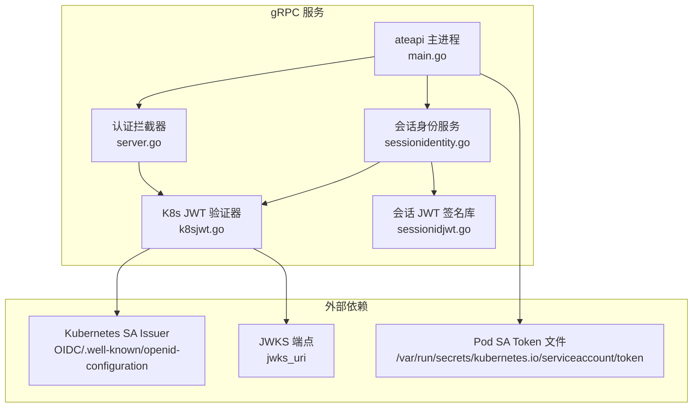
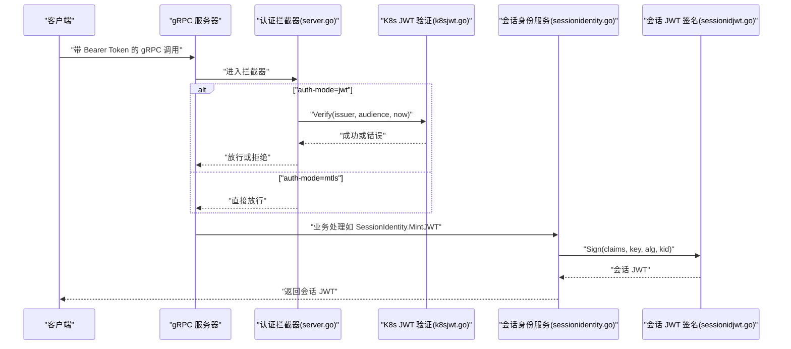
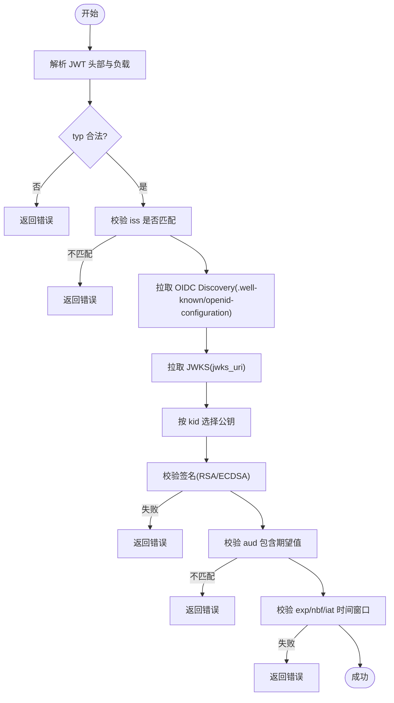
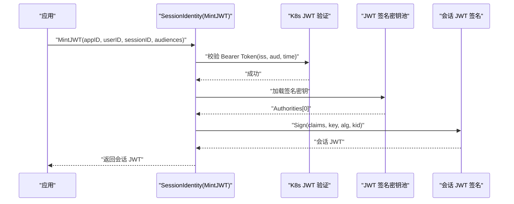
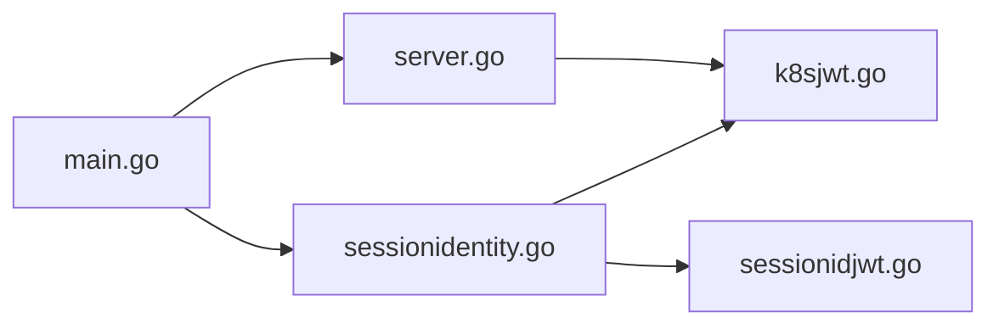

# 认证与授权

<cite>
**本文引用的文件列表**
- [cmd/ateapi/main.go](file://cmd/ateapi/main.go)
- [internal/ateapiauth/server.go](file://internal/ateapiauth/server.go)
- [internal/ateapiauth/client.go](file://internal/ateapiauth/client.go)
- [cmd/ateapi/internal/k8sjwt/k8sjwt.go](file://cmd/ateapi/internal/k8sjwt/k8sjwt.go)
- [cmd/ateapi/internal/sessionidentity/sessionidentity.go](file://cmd/ateapi/internal/sessionidentity/sessionidentity.go)
- [cmd/ateapi/internal/sessionidjwt/sessionidjwt.go](file://cmd/ateapi/internal/sessionidjwt/sessionidjwt.go)
- [pkg/proto/ateapipb/ateapi_grpc.pb.go](file://pkg/proto/ateapipb/ateapi_grpc.pb.go)
</cite>

## 目录
1. [简介](#简介)
2. [项目结构](#项目结构)
3. [核心组件](#核心组件)
4. [架构总览](#架构总览)
5. [详细组件分析](#详细组件分析)
6. [依赖关系分析](#依赖关系分析)
7. [性能与安全考量](#性能与安全考量)
8. [故障排查指南](#故障排查指南)
9. [结论](#结论)
10. [附录：配置示例与最佳实践](#附录配置示例与最佳实践)

## 简介
本文件系统性阐述 ateapi 的认证与授权机制，覆盖以下主题：
- mTLS 与 JWT 两种认证模式的实现原理与配置方式
- 客户端证书验证、JWT 令牌解析与验证流程
- Kubernetes ServiceAccount 集成（含 OIDC 发现与 JWKS 获取）
- 会话身份管理：会话 JWT 的签发、验证与生命周期
- 工作节点池 CA 证书验证与 Bearer Token 校验逻辑
- 不同认证模式的配置示例与安全最佳实践
- 常见认证问题的排查方法与故障恢复策略

## 项目结构
与认证相关的关键代码位于以下位置：
- gRPC 服务入口与 TLS/JWT 模式装配：cmd/ateapi/main.go
- 服务端认证拦截器（mTLS/JWT 模式选择与鉴权）：internal/ateapiauth/server.go
- 客户端拨号与 Bearer Token 注入：internal/ateapiauth/client.go
- Kubernetes JWT 验证（OIDC 发现、JWKS 拉取、签名校验、时间/受众校验）：cmd/ateapi/internal/k8sjwt/k8sjwt.go
- 会话身份服务（MintJWT/MintCert）：cmd/ateapi/internal/sessionidentity/sessionidentity.go
- 会话 JWT 数据结构与签名实现：cmd/ateapi/internal/sessionidjwt/sessionidjwt.go
- gRPC 服务注册（SessionIdentity 等）：pkg/proto/ateapipb/ateapi_grpc.pb.go

图表来源
- [cmd/ateapi/main.go:171-196](file://cmd/ateapi/main.go#L171-L196)
- [internal/ateapiauth/server.go:81-103](file://internal/ateapiauth/server.go#L81-L103)
- [cmd/ateapi/internal/k8sjwt/k8sjwt.go:118-261](file://cmd/ateapi/internal/k8sjwt/k8sjwt.go#L118-L261)
- [cmd/ateapi/internal/sessionidentity/sessionidentity.go:71-142](file://cmd/ateapi/internal/sessionidentity/sessionidentity.go#L71-L142)
- [cmd/ateapi/internal/sessionidjwt/sessionidjwt.go:100-164](file://cmd/ateapi/internal/sessionidjwt/sessionidjwt.go#L100-L164)

章节来源
- [cmd/ateapi/main.go:56-77](file://cmd/ateapi/main.go#L56-L77)
- [cmd/ateapi/main.go:171-196](file://cmd/ateapi/main.go#L171-L196)

## 核心组件
- 认证模式与拦截器
  - 支持 mtls 与 jwt 两种模式。mtls 模式下由传输层 mTLS 建立客户端身份；jwt 模式要求每个 RPC 携带 K8s ServiceAccount Bearer Token，并由服务端拦截器校验。
  - 通过 grpc.UnaryServerInterceptor 和 grpc.StreamServerInterceptor 在请求进入业务处理前完成鉴权。
- Kubernetes JWT 验证器
  - 基于 OIDC Discovery 文档定位 jwks_uri，拉取公钥集合，按 kid 选择对应公钥进行签名校验，并校验 iss、aud、exp/nbf/iat 等标准字段。
- 会话身份服务
  - MintJWT：使用本地 JWT 签名密钥池对会话 JWT 进行签名，返回给调用方用于后续访问受保护资源。
  - MintCert：基于 mTLS 客户端证书与 CSR 签发短期会话证书（SPKI SPIFFE URI），用于应用内短生命周期凭证交换。
- 客户端拨号与 Bearer Token 注入
  - 在 jwt 模式下，客户端从 Pod 挂载的 SA token 文件读取 Bearer Token，并通过 per-RPC credentials 自动注入到每次 gRPC 调用。

章节来源
- [internal/ateapiauth/server.go:35-70](file://internal/ateapiauth/server.go#L35-L70)
- [internal/ateapiauth/server.go:81-103](file://internal/ateapiauth/server.go#L81-L103)
- [cmd/ateapi/internal/k8sjwt/k8sjwt.go:118-261](file://cmd/ateapi/internal/k8sjwt/k8sjwt.go#L118-L261)
- [cmd/ateapi/internal/sessionidentity/sessionidentity.go:71-142](file://cmd/ateapi/internal/sessionidentity/sessionidentity.go#L71-L142)
- [internal/ateapiauth/client.go:34-95](file://internal/ateapiauth/client.go#L34-L95)

## 架构总览
下图展示了 gRPC 请求在服务端的认证路径，以及会话身份服务的交互。

图表来源
- [cmd/ateapi/main.go:171-196](file://cmd/ateapi/main.go#L171-L196)
- [internal/ateapiauth/server.go:81-103](file://internal/ateapiauth/server.go#L81-L103)
- [cmd/ateapi/internal/k8sjwt/k8sjwt.go:118-261](file://cmd/ateapi/internal/k8sjwt/k8sjwt.go#L118-L261)
- [cmd/ateapi/internal/sessionidentity/sessionidentity.go:71-142](file://cmd/ateapi/internal/sessionidentity/sessionidentity.go#L71-L142)
- [cmd/ateapi/internal/sessionidjwt/sessionidjwt.go:100-164](file://cmd/ateapi/internal/sessionidjwt/sessionidjwt.go#L100-L164)

## 详细组件分析

### mTLS 认证模式
- 服务端 TLS 配置
  - 加载服务器证书束，可选加载工作节点池 CA 以验证客户端证书。
  - 设置 ClientAuth 为“按需验证”，当提供客户端证书时进行校验。
- 客户端证书验证
  - 若配置了 workerpool-ca-certs，则将其作为 ClientCAs 参与证书链校验。
  - 未配置时仍允许连接，但不强制校验客户端证书。
- 适用场景
  - 适用于内部可信网络或服务间通信，结合工作节点池 CA 可实现强双向认证。

章节来源
- [cmd/ateapi/main.go:351-373](file://cmd/ateapi/main.go#L351-L373)

### JWT 认证模式（Kubernetes ServiceAccount）
- 服务端拦截器
  - 从元数据中解析 authorization 头，提取 Bearer Token。
  - 调用 VerifyBearerToken 回调执行 JWT 校验；失败返回 Unauthenticated。
- Kubernetes JWT 验证流程
  - 解析 JWT 头部与负载，校验 typ 字段。
  - 根据 iss 构造 OIDC Discovery URL，拉取 .well-known/openid-configuration，得到 jwks_uri。
  - 拉取 JWKS，按 kid 选择公钥，进行签名校验（支持 RSA/ECDSA）。
  - 校验 aud 是否包含期望值，校验 exp/nbf/iat 时间窗口。
- 与 Kubernetes 集成
  - 构建 HTTP 客户端时，针对 in-cluster issuer 且提供了 caFile 的情况，使用自定义 Transport 向 issuer 域及 /openid/v1/jwks 注入 Pod SA Token，以便访问受限的 JWKS。
  - 默认 SA Token 文件路径与 CA 文件路径来自常量定义。

图表来源
- [cmd/ateapi/internal/k8sjwt/k8sjwt.go:118-261](file://cmd/ateapi/internal/k8sjwt/k8sjwt.go#L118-L261)

章节来源
- [internal/ateapiauth/server.go:141-152](file://internal/ateapiauth/server.go#L141-L152)
- [cmd/ateapi/internal/k8sjwt/k8sjwt.go:118-261](file://cmd/ateapi/internal/k8sjwt/k8sjwt.go#L118-L261)
- [cmd/ateapi/main.go:375-412](file://cmd/ateapi/main.go#L375-L412)
- [internal/ateapiauth/client.go:29-32](file://internal/ateapiauth/client.go#L29-L32)

### 会话身份管理（会话 JWT 与证书）
- 会话 JWT 签发（MintJWT）
  - 要求调用方携带有效的 K8s SA Bearer Token，服务端先校验该 Token。
  - 从本地 JWT 签名密钥池文件加载签名密钥，使用第一个 Authority 进行签名。
  - 构造会话 Claims（iss/sub/aud/exp/nbf/iat/jti 及 Substrate 扩展），生成会话 JWT 返回。
- 会话证书签发（MintCert）
  - 仅接受 mTLS 客户端，校验对端证书存在。
  - 从本地 CA 池文件加载根/中间证书，校验 CSR 签名后签发短期客户端证书，附带 SPIFFE URI。
- 会话 JWT 生命周期
  - 默认有效期约 15 分钟，nbf 提前 5 分钟，确保时钟偏差容忍。
  - JTI 随机生成，便于去重与审计。

图表来源
- [cmd/ateapi/internal/sessionidentity/sessionidentity.go:71-142](file://cmd/ateapi/internal/sessionidentity/sessionidentity.go#L71-L142)
- [cmd/ateapi/internal/sessionidjwt/sessionidjwt.go:100-164](file://cmd/ateapi/internal/sessionidjwt/sessionidjwt.go#L100-L164)

章节来源
- [cmd/ateapi/internal/sessionidentity/sessionidentity.go:71-142](file://cmd/ateapi/internal/sessionidentity/sessionidentity.go#L71-L142)
- [cmd/ateapi/internal/sessionidentity/sessionidentity.go:144-225](file://cmd/ateapi/internal/sessionidentity/sessionidentity.go#L144-L225)
- [cmd/ateapi/internal/sessionidjwt/sessionidjwt.go:30-98](file://cmd/ateapi/internal/sessionidjwt/sessionidjwt.go#L30-L98)

### 客户端拨号与 Bearer Token 注入
- 客户端配置
  - Mode=ModeMTLS：使用 InsecureSkipVerify 的 TLS 拨号，身份由 mTLS 证书提供。
  - Mode=ModeJWT：校验服务器证书 CA，每 RPC 从 TokenFile 读取 Bearer Token 注入。
- 自动旋转
  - 每次请求重新读取 Token 文件，利用 Kubernetes 投影卷的原地刷新能力，无需重启即可生效。

章节来源
- [internal/ateapiauth/client.go:34-95](file://internal/ateapiauth/client.go#L34-L95)
- [internal/ateapiauth/client.go:97-116](file://internal/ateapiauth/client.go#L97-L116)

## 依赖关系分析
- 模块耦合
  - main.go 负责组装 gRPC 服务器、认证拦截器与会话身份服务。
  - server.go 提供通用认证拦截器，依据 auth-mode 选择行为。
  - k8sjwt.go 独立于业务，专注 K8s JWT 验证。
  - sessionidentity.go 依赖 k8sjwt.go 与 sessionidjwt.go。
- 外部依赖
  - Kubernetes SA Issuer 与 JWKS 端点用于验证客户端 Bearer Token。
  - 本地文件：JWT 签名密钥池、CA 池、服务器证书束、workerpool CA。

图表来源
- [cmd/ateapi/main.go:171-196](file://cmd/ateapi/main.go#L171-L196)
- [internal/ateapiauth/server.go:81-103](file://internal/ateapiauth/server.go#L81-L103)
- [cmd/ateapi/internal/sessionidentity/sessionidentity.go:71-142](file://cmd/ateapi/internal/sessionidentity/sessionidentity.go#L71-L142)

章节来源
- [cmd/ateapi/main.go:171-196](file://cmd/ateapi/main.go#L171-L196)
- [internal/ateapiauth/server.go:81-103](file://internal/ateapiauth/server.go#L81-L103)
- [cmd/ateapi/internal/sessionidentity/sessionidentity.go:71-142](file://cmd/ateapi/internal/sessionidentity/sessionidentity.go#L71-L142)

## 性能与安全考量
- 性能
  - JWT 验证涉及网络拉取 OIDC Discovery 与 JWKS，建议在生产环境引入键缓存以减少重复 IO。
  - 会话 JWT 签名与证书签发均为 CPU 密集操作，需关注并发下的密钥池与 CA 池加载开销。
- 安全
  - 严格限制 iss 与 aud，避免跨租户误用。
  - 合理设置 exp/nbf/iat 时间窗口，防止重放与过期滥用。
  - 启用 mTLS 并结合 workerpool CA 可增强双向认证强度。
  - 定期轮换签名密钥与 CA，并确保客户端与服务端同步更新。

## 故障排查指南
- 无法连接到 Redis/Valkey
  - 检查 redis-cluster-address、redis-ca-certs、redis-tls-server-name、redis-client-cert 配置是否正确。
  - 确认 IAM 认证开关与凭据可用。
- JWT 验证失败
  - 检查 client-jwt-issuer 与 client-jwt-audience 是否与 K8s SA Token 一致。
  - 确认 OIDC Discovery 与 JWKS 可达，必要时检查自定义 CA 与 SA Token 注入。
- 缺少 Bearer Token
  - 确认客户端使用 Mode=ModeJWT 并正确配置 TokenFile。
  - 检查 authorization 头格式是否为 "Bearer <token>"。
- 客户端证书无效
  - 确认 workerpool-ca-certs 已正确加载，且客户端证书链完整。
- 会话 JWT 签发失败
  - 检查 session-id-jwt-pool 文件可读且内容有效。
  - 确认传入的 audiences 非空。
- 会话证书签发失败
  - 检查 session-id-ca-pool 文件可读且包含有效 CA。
  - 确认 CSR 签名与参数 app_id/user_id/session_id 齐全。

章节来源
- [cmd/ateapi/main.go:248-331](file://cmd/ateapi/main.go#L248-L331)
- [cmd/ateapi/main.go:351-373](file://cmd/ateapi/main.go#L351-L373)
- [cmd/ateapi/internal/k8sjwt/k8sjwt.go:118-261](file://cmd/ateapi/internal/k8sjwt/k8sjwt.go#L118-L261)
- [cmd/ateapi/internal/sessionidentity/sessionidentity.go:71-142](file://cmd/ateapi/internal/sessionidentity/sessionidentity.go#L71-L142)
- [cmd/ateapi/internal/sessionidentity/sessionidentity.go:144-225](file://cmd/ateapi/internal/sessionidentity/sessionidentity.go#L144-L225)

## 结论
ateapi 通过灵活的认证模式（mTLS 与 JWT）满足多种部署场景：
- mTLS 适合强信任边界内的服务间通信，结合工作节点池 CA 可实现严格的客户端证书校验。
- JWT 模式深度集成 Kubernetes ServiceAccount，借助 OIDC 发现与 JWKS 实现无状态、可扩展的身份验证。
- 会话身份服务提供短期会话凭证（JWT 与证书），便于在应用内安全传递用户与上下文信息。
生产环境应重视密钥与 CA 轮换、网络可达性与时钟同步，并配合完善的监控与日志进行问题定位。

## 附录：配置示例与最佳实践
- 启动参数（节选）
  - --grpc-listen-addr：gRPC 监听地址
  - --grpc-server-cred-bundle：服务器 TLS 证书束文件
  - --workerpool-ca-certs：工作节点池 CA 证书文件（可选）
  - --client-jwt-issuer：客户端 JWT 的 iss（K8s SA Issuer）
  - --client-jwt-audience：客户端 JWT 的 aud
  - --session-id-jwt-pool：会话 JWT 签名密钥池文件
  - --session-id-ca-pool：会话 CA 池文件
  - --auth-mode：mtls 或 jwt
  - --client-jwt-ca-cert：用于 OIDC 发现的 CA 文件（in-cluster 场景）
- 客户端配置（Mode=ModeJWT）
  - 设置 CAFile 指向集群 CA，TokenFile 指向 Pod SA Token 文件路径。
  - 每 RPC 自动注入 authorization: Bearer <token>。
- 最佳实践
  - 始终校验 iss 与 aud，避免跨租户访问。
  - 使用短期会话凭证（会话 JWT/证书），降低泄露风险。
  - 定期轮换签名密钥与 CA，并采用灰度发布策略。
  - 开启 mTLS 并在关键路径启用客户端证书校验。
  - 对 OIDC 发现与 JWKS 拉取进行超时与重试控制，避免雪崩。

章节来源
- [cmd/ateapi/main.go:56-77](file://cmd/ateapi/main.go#L56-L77)
- [internal/ateapiauth/client.go:34-95](file://internal/ateapiauth/client.go#L34-L95)
- [internal/ateapiauth/client.go:29-32](file://internal/ateapiauth/client.go#L29-L32)
