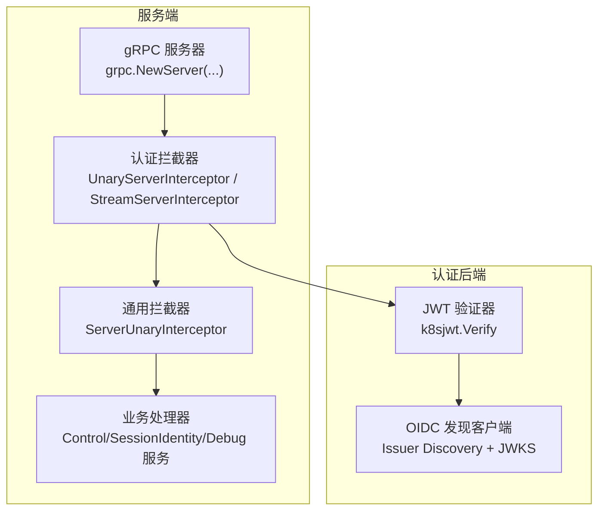
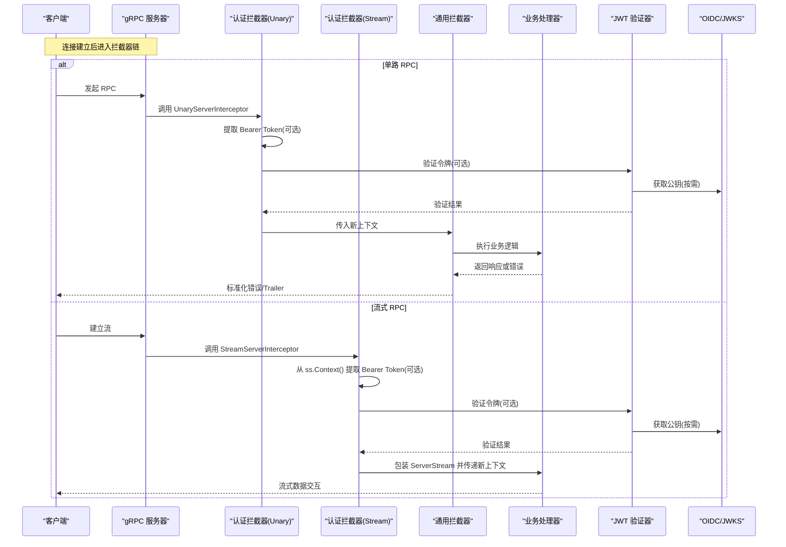
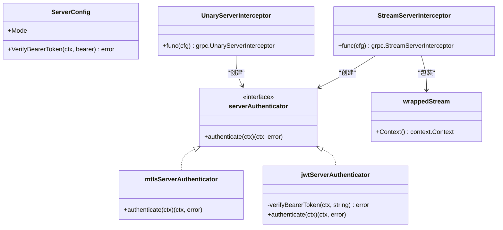
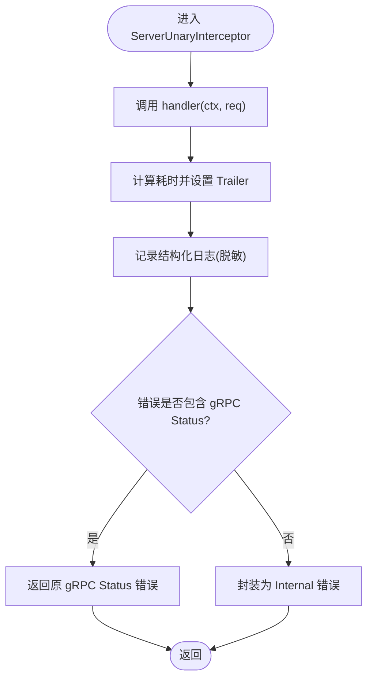
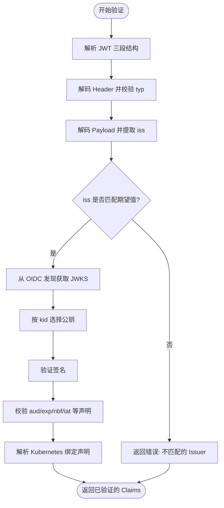
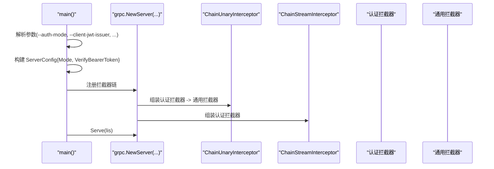
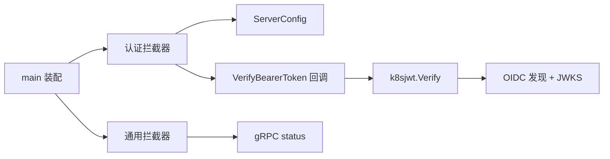

# 认证拦截器

<cite>
**本文引用的文件**   
- [internal/ateapiauth/server.go](file://internal/ateapiauth/server.go)
- [internal/ateinterceptors/ateinterceptors.go](file://internal/ateinterceptors/ateinterceptors.go)
- [cmd/ateapi/main.go](file://cmd/ateapi/main.go)
- [cmd/ateapi/internal/k8sjwt/k8sjwt.go](file://cmd/ateapi/internal/k8sjwt/k8sjwt.go)
</cite>

## 目录
1. [简介](#简介)
2. [项目结构](#项目结构)
3. [核心组件](#核心组件)
4. [架构总览](#架构总览)
5. [详细组件分析](#详细组件分析)
6. [依赖关系分析](#依赖关系分析)
7. [性能考虑](#性能考虑)
8. [故障排查指南](#故障排查指南)
9. [结论](#结论)
10. [附录](#附录)

## 简介
本文件围绕 gRPC 认证拦截器的实现架构与工作原理展开，重点说明：
- UnaryServerInterceptor 与 StreamServerInterceptor 的设计模式与使用方法
- 认证拦截器的链式调用机制、上下文传递与错误处理策略
- 如何自定义认证拦截器、扩展认证逻辑与集成第三方认证服务
- 拦截器的配置示例与最佳实践
- 性能优化、调试技巧与常见问题解决方案

本项目在 ateapi 服务中实现了基于 mTLS 与 Kubernetes ServiceAccount JWT 的认证能力，并通过 gRPC 拦截器链统一接入。

## 项目结构
与认证拦截器相关的代码主要分布在以下位置：
- internal/ateapiauth：认证拦截器实现（mTLS/JWT）
- internal/ateinterceptors：通用服务器拦截器（日志、Trailer、错误标准化）
- cmd/ateapi/main.go：gRPC 服务器启动与拦截器链装配
- cmd/ateapi/internal/k8sjwt：Kubernetes JWT 验证器（OIDC 发现、JWKS 获取、签名校验）

图表来源
- [cmd/ateapi/main.go:182-196](file://cmd/ateapi/main.go#L182-L196)
- [internal/ateapiauth/server.go:81-103](file://internal/ateapiauth/server.go#L81-L103)
- [internal/ateinterceptors/ateinterceptors.go:36-72](file://internal/ateinterceptors/ateinterceptors.go#L36-L72)
- [cmd/ateapi/internal/k8sjwt/k8sjwt.go:118-261](file://cmd/ateapi/internal/k8sjwt/k8sjwt.go#L118-L261)

章节来源
- [cmd/ateapi/main.go:182-196](file://cmd/ateapi/main.go#L182-L196)
- [internal/ateapiauth/server.go:81-103](file://internal/ateapiauth/server.go#L81-L103)
- [internal/ateinterceptors/ateinterceptors.go:36-72](file://internal/ateinterceptors/ateinterceptors.go#L36-L72)
- [cmd/ateapi/internal/k8sjwt/k8sjwt.go:118-261](file://cmd/ateapi/internal/k8sjwt/k8sjwt.go#L118-L261)

## 核心组件
- 认证拦截器（Unary/Stream）
  - 提供 UnaryServerInterceptor 与 StreamServerInterceptor，支持两种认证模式：
    - ModeMTLS：仅依赖传输层 mTLS 建立身份，不做应用层检查
    - ModeJWT：额外要求每个 RPC 携带 authorization: Bearer <SA token>，并进行 JWT 校验
  - 通过 ServerConfig 注入 VerifyBearerToken 回调以完成具体令牌验证
- 通用服务器拦截器
  - 记录请求方法、耗时、请求/响应摘要（脱敏），并将错误标准化为 gRPC status
  - 设置 Trailer 字段 x-server-elapsed-us，便于客户端统计纯服务端耗时
- JWT 验证器
  - 对接 OIDC 发现文档与 JWKS，按 kid 选择公钥进行签名校验
  - 校验 Issuer、Audience、时间窗口等标准声明，并解析 Kubernetes 绑定令牌相关声明

章节来源
- [internal/ateapiauth/server.go:35-79](file://internal/ateapiauth/server.go#L35-L79)
- [internal/ateinterceptors/ateinterceptors.go:32-72](file://internal/ateinterceptors/ateinterceptors.go#L32-L72)
- [cmd/ateapi/internal/k8sjwt/k8sjwt.go:118-261](file://cmd/ateapi/internal/k8sjwt/k8sjwt.go#L118-L261)

## 架构总览
下图展示了从客户端到业务处理的完整链路，包括认证拦截器与通用拦截器的协作方式。

图表来源
- [cmd/ateapi/main.go:182-196](file://cmd/ateapi/main.go#L182-L196)
- [internal/ateapiauth/server.go:81-103](file://internal/ateapiauth/server.go#L81-L103)
- [internal/ateinterceptors/ateinterceptors.go:36-72](file://internal/ateinterceptors/ateinterceptors.go#L36-L72)
- [cmd/ateapi/internal/k8sjwt/k8sjwt.go:118-261](file://cmd/ateapi/internal/k8sjwt/k8sjwt.go#L118-L261)

## 详细组件分析

### 认证拦截器（Unary/Stream）
- 设计要点
  - 通过 serverAuthenticatorFor 根据配置选择不同认证策略（mTLS 或 JWT）
  - Unary 与 Stream 均先执行认证，再调用后续处理器；失败时直接返回 Unauthenticated/Internal 错误
  - Stream 场景下使用 wrappedStream 包装原始 ServerStream，确保后续读取/写入使用新的上下文
- 关键流程
  - 从 incoming metadata 中提取 authorization 头，解析 Bearer token
  - 调用 VerifyBearerToken 回调完成令牌校验（例如 k8sjwt.Verify）
  - 将认证后的上下文传递给下游拦截器与处理器

图表来源
- [internal/ateapiauth/server.go:72-127](file://internal/ateapiauth/server.go#L72-L127)
- [internal/ateapiauth/server.go:105-110](file://internal/ateapiauth/server.go#L105-L110)

章节来源
- [internal/ateapiauth/server.go:81-103](file://internal/ateapiauth/server.go#L81-L103)
- [internal/ateapiauth/server.go:116-127](file://internal/ateapiauth/server.go#L116-L127)
- [internal/ateapiauth/server.go:141-152](file://internal/ateapiauth/server.go#L141-L152)
- [internal/ateapiauth/server.go:162-181](file://internal/ateapiauth/server.go#L162-L181)

### 通用服务器拦截器（日志、Trailer、错误标准化）
- 功能
  - 记录方法名、请求/响应摘要（对 proto.Message 中的 env 字段进行清理）、错误信息、耗时
  - 设置 Trailer x-server-elapsed-us，供客户端统计服务端耗时
  - 错误标准化：若错误链中包含 gRPC status，则透传；否则封装为 Internal 错误
- 适用场景
  - 作为认证之后的“横切关注点”，统一观测与错误输出

图表来源
- [internal/ateinterceptors/ateinterceptors.go:36-72](file://internal/ateinterceptors/ateinterceptors.go#L36-L72)
- [internal/ateinterceptors/ateinterceptors.go:104-138](file://internal/ateinterceptors/ateinterceptors.go#L104-L138)

章节来源
- [internal/ateinterceptors/ateinterceptors.go:32-72](file://internal/ateinterceptors/ateinterceptors.go#L32-L72)
- [internal/ateinterceptors/ateinterceptors.go:104-138](file://internal/ateinterceptors/ateinterceptors.go#L104-L138)

### JWT 验证器（Kubernetes SA JWT）
- 功能
  - 解析 JWT 三段结构，解码头部与负载
  - 校验算法类型，按 kid 从 JWKS 中选择对应公钥进行签名验证
  - 校验 Issuer、Audience、时间窗口（exp/nbf/iat）等标准声明
  - 解析 Kubernetes 绑定令牌相关声明（命名空间、Pod、ServiceAccount、Secret、Node 等）
- 外部依赖
  - 通过 OIDC 发现文档获取 JWKS URI，再拉取公钥集合
  - 支持自定义 HTTP 客户端（如注入 InCluster 的 SA Token 用于访问受保护的 JWKS）

图表来源
- [cmd/ateapi/internal/k8sjwt/k8sjwt.go:118-261](file://cmd/ateapi/internal/k8sjwt/k8sjwt.go#L118-L261)
- [cmd/ateapi/internal/k8sjwt/k8sjwt.go:367-431](file://cmd/ateapi/internal/k8sjwt/k8sjwt.go#L367-L431)

章节来源
- [cmd/ateapi/internal/k8sjwt/k8sjwt.go:118-261](file://cmd/ateapi/internal/k8sjwt/k8sjwt.go#L118-L261)
- [cmd/ateapi/internal/k8sjwt/k8sjwt.go:367-431](file://cmd/ateapi/internal/k8sjwt/k8sjwt.go#L367-L431)

### 拦截器链装配与配置
- 装配位置
  - 在 gRPC 服务器初始化时，通过 grpc.ChainUnaryInterceptor 与 grpc.ChainStreamInterceptor 组合多个拦截器
  - 认证拦截器优先于通用拦截器执行，确保鉴权通过后才进行日志与错误标准化
- 配置项
  - --auth-mode：mtls（默认）或 jwt
  - --client-jwt-ca-cert：用于 OIDC 发现的 CA 证书文件
  - --client-jwt-issuer / --client-jwt-audience：JWT 签发者与受众
  - VerifyBearerToken：由主程序注入 k8sjwt.Verify 回调

图表来源
- [cmd/ateapi/main.go:171-196](file://cmd/ateapi/main.go#L171-L196)
- [cmd/ateapi/main.go:106-110](file://cmd/ateapi/main.go#L106-L110)

章节来源
- [cmd/ateapi/main.go:171-196](file://cmd/ateapi/main.go#L171-L196)
- [cmd/ateapi/main.go:106-110](file://cmd/ateapi/main.go#L106-L110)

## 依赖关系分析
- 模块耦合
  - 认证拦截器依赖 ServerConfig 与 VerifyBearerToken 回调，解耦了具体的令牌验证实现
  - 通用拦截器依赖 gRPC status 接口，兼容各种错误来源
  - JWT 验证器依赖 OIDC 发现与 JWKS 拉取，可注入自定义 http.Client
- 外部依赖
  - gRPC 库（拦截器接口、metadata、status）
  - Kubernetes SA 的 OIDC 发现与 JWKS（HTTP 客户端）
  - Prometheus/OpenTelemetry（通过 StatsHandler 与指标采集，非认证核心）

图表来源
- [internal/ateapiauth/server.go:72-79](file://internal/ateapiauth/server.go#L72-L79)
- [cmd/ateapi/main.go:171-196](file://cmd/ateapi/main.go#L171-L196)
- [cmd/ateapi/internal/k8sjwt/k8sjwt.go:118-261](file://cmd/ateapi/internal/k8sjwt/k8sjwt.go#L118-L261)

章节来源
- [internal/ateapiauth/server.go:72-79](file://internal/ateapiauth/server.go#L72-L79)
- [cmd/ateapi/main.go:171-196](file://cmd/ateapi/main.go#L171-L196)
- [cmd/ateapi/internal/k8sjwt/k8sjwt.go:118-261](file://cmd/ateapi/internal/k8sjwt/k8sjwt.go#L118-L261)

## 性能考虑
- 避免重复网络开销
  - 建议缓存 OIDC 发现文档与 JWKS，仅在 kid 变化或过期时刷新
  - 当前实现未内置缓存，可在 VerifyBearerToken 回调外层增加缓存层
- 减少序列化与日志成本
  - 通用拦截器会对 proto.Message 进行克隆与字段清理，建议在高频路径上评估日志级别与采样率
- 合理设置超时
  - OIDC 发现与 JWKS 拉取应设置合理的超时与重试策略，避免阻塞认证路径
- 流式场景
  - 认证仅在握手阶段执行一次，后续消息复用同一上下文，注意不要在流中重复执行昂贵操作

[本节为通用指导，无需特定文件引用]

## 故障排查指南
- 常见错误码
  - Unauthenticated：缺少 Bearer token 或令牌无效
  - Internal：认证模式非法或内部错误
- 定位步骤
  - 确认 --auth-mode 与 --client-jwt-issuer/--client-jwt-audience 配置正确
  - 检查 authorization 头格式是否为 "Bearer <token>"
  - 查看通用拦截器日志，确认方法名、耗时与错误信息
  - 验证 OIDC 发现与 JWKS 可达性，必要时启用更详细的日志
- 调试技巧
  - 在 VerifyBearerToken 回调中加入断点或日志，观察输入 token 与返回错误
  - 使用 gRPC 客户端打印 Trailer x-server-elapsed-us，区分客户端调度与服务端处理耗时
  - 针对流式 RPC，确认握手阶段的认证已通过，后续消息不会触发重复认证

章节来源
- [internal/ateinterceptors/ateinterceptors.go:36-72](file://internal/ateinterceptors/ateinterceptors.go#L36-L72)
- [internal/ateapiauth/server.go:141-160](file://internal/ateapiauth/server.go#L141-L160)

## 结论
本项目通过统一的认证拦截器与通用拦截器，构建了可扩展、可观测的 gRPC 认证体系。认证拦截器支持 mTLS 与 JWT 两种模式，结合 Kubernetes SA 的 OIDC/JWKS 验证，满足生产环境的安全需求。通用拦截器提供了标准化的日志与错误处理，便于问题定位与性能分析。通过合理的配置与优化策略，可以在保证安全性的同时获得良好的性能表现。

[本节为总结，无需特定文件引用]

## 附录

### 自定义认证拦截器与扩展认证逻辑
- 自定义认证策略
  - 实现 serverAuthenticator 接口，并在 serverAuthenticatorFor 中根据配置返回你的实现
  - 在 Authenticate 中从 metadata 提取凭证，调用外部认证服务或本地策略，返回带身份信息的新上下文
- 集成第三方认证服务
  - 在 ServerConfig.VerifyBearerToken 中调用第三方 API（如 OAuth2/OIDC 服务端），校验令牌并返回错误
  - 为第三方调用添加超时、重试与缓存，避免影响主路径性能
- 上下文传递
  - 在认证成功后，将用户标识、角色、租户等信息放入 context，供下游处理器读取
  - 对于流式 RPC，确保 wrappedStream 的 Context 返回新上下文，使后续消息共享认证结果

章节来源
- [internal/ateapiauth/server.go:112-127](file://internal/ateapiauth/server.go#L112-L127)
- [internal/ateapiauth/server.go:141-152](file://internal/ateapiauth/server.go#L141-L152)
- [internal/ateapiauth/server.go:105-110](file://internal/ateapiauth/server.go#L105-L110)

### 配置示例与最佳实践
- 最小可用配置（mTLS 模式）
  - --auth-mode=mtls
  - 配置服务器 TLS 证书与可选客户端证书校验
- 启用 JWT 模式
  - --auth-mode=jwt
  - --client-jwt-issuer=<Kubernetes SA Issuer URL>
  - --client-jwt-audience=<预期 Audience>
  - --client-jwt-ca-cert=<CA 证书文件>（可选，用于 OIDC 发现）
- 最佳实践
  - 在生产环境优先使用 mTLS，JWT 作为附加的应用层校验
  - 对 OIDC/JWKS 拉取进行缓存与超时控制
  - 使用通用拦截器记录结构化日志，避免泄露敏感字段
  - 定期轮换证书与密钥，监控认证失败率与延迟

章节来源
- [cmd/ateapi/main.go:171-196](file://cmd/ateapi/main.go#L171-L196)
- [cmd/ateapi/main.go:106-110](file://cmd/ateapi/main.go#L106-L110)
- [internal/ateinterceptors/ateinterceptors.go:32-72](file://internal/ateinterceptors/ateinterceptors.go#L32-L72)
