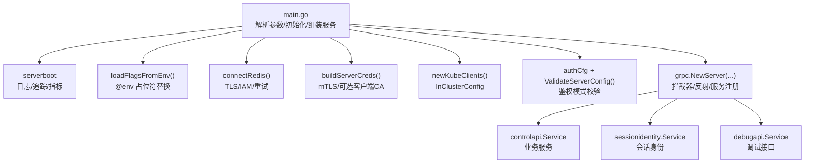
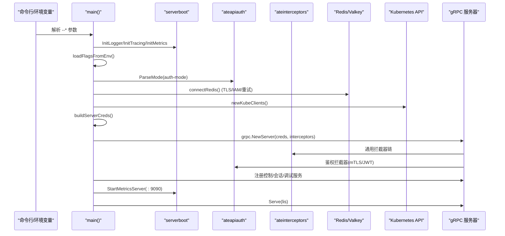
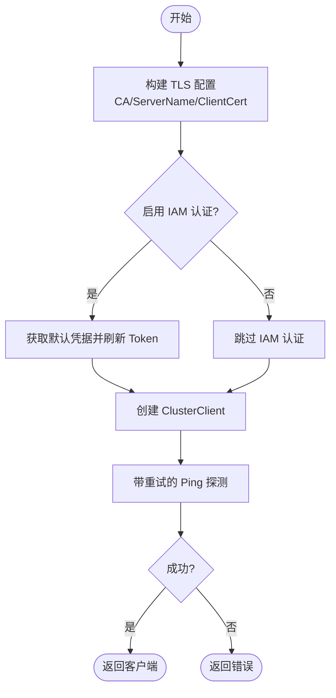
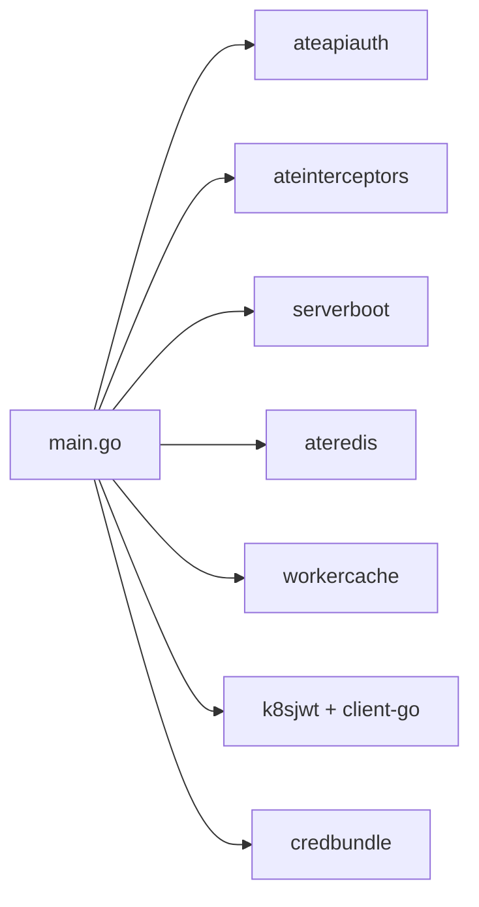

# 配置管理

<cite>
**本文引用的文件**
- [cmd/ateapi/main.go](file://cmd/ateapi/main.go)
- [internal/ateapiauth/server.go](file://internal/ateapiauth/server.go)
- [internal/ateinterceptors/ateinterceptors.go](file://internal/ateinterceptors/ateinterceptors.go)
- [internal/serverboot/serverboot.go](file://internal/serverboot/serverboot.go)
- [cmd/ateapi/internal/store/ateredis/store.go](file://cmd/ateapi/internal/store/ateredis/store.go)
- [cmd/ateapi/internal/workercache/workercache.go](file://cmd/ateapi/internal/workercache/workercache.go)
</cite>

## 目录
1. [简介](#简介)
2. [项目结构](#项目结构)
3. [核心组件](#核心组件)
4. [架构总览](#架构总览)
5. [详细组件分析](#详细组件分析)
6. [依赖关系分析](#依赖关系分析)
7. [性能考量](#性能考量)
8. [故障排除指南](#故障排除指南)
9. [结论](#结论)
10. [附录](#附录)

## 简介
本章节面向 ateapi 的配置管理系统，聚焦以下方面：
- 命令行参数定义与默认值
- 环境变量覆盖机制
- 配置文件加载（证书、密钥等）
- 认证与网络、存储、监控相关配置项
- 配置校验逻辑
- 热重载现状与建议
- 不同部署环境的差异与最佳实践
- 安全注意事项与敏感信息管理方法

## 项目结构
ateapi 的配置入口位于主程序 main 中，通过 pflag 解析命令行参数，并在启动早期进行日志、追踪、指标初始化后，执行“从环境变量覆盖标志”的逻辑，随后完成 Redis 连接、Kubernetes 客户端、gRPC 服务器凭据构建、鉴权中间件装配以及服务注册。

图表来源
- [cmd/ateapi/main.go:79-206](file://cmd/ateapi/main.go#L79-L206)
- [internal/serverboot/serverboot.go](file://internal/serverboot/serverboot.go)

章节来源
- [cmd/ateapi/main.go:79-206](file://cmd/ateapi/main.go#L79-L206)

## 核心组件
- 命令行参数与默认值
  - 监听地址与端口：--grpc-listen-addr（默认 :443）、--metrics-listen-addr（默认 :9090）
  - gRPC 服务器凭据包：--grpc-server-cred-bundle（空表示不启用 mTLS 证书）
  - 认证模式：--auth-mode（mtls|jwt，默认 mtls）
  - 客户端 JWT 校验：--client-jwt-issuer、--client-jwt-audience、--client-jwt-ca-cert（默认使用集群 SA CA 文件路径）
  - 会话身份签发：--session-id-jwt-pool、--session-id-ca-pool、--workerpool-ca-certs
  - Redis/Valkey 连接：--redis-cluster-address、--redis-ca-certs、--redis-use-iam-auth（默认 true）、--redis-tls-server-name、--redis-client-cert
- 环境变量覆盖
  - 支持将特定 flag 的值设为 @env，在启动时自动从对应环境变量读取并覆盖
  - 覆盖映射包括 Redis 地址、IAM 开关、TLS ServerName、客户端证书、JWT Issuer 等
- 配置校验
  - 对 auth-mode 进行解析与校验；当选择 jwt 模式且无法获取 Kubernetes ServiceAccount Issuer 发现客户端时，直接终止启动
- 运行时初始化顺序
  - 日志 → 追踪 → 指标 → 环境变量覆盖 → 解析并校验认证模式 → 连接 Redis → 创建 K8s 客户端 → 构建 gRPC 凭据 → 启动 Informers/缓存 → 组装 gRPC 服务与拦截器 → 启动指标 HTTP 服务 → 监听 gRPC

章节来源
- [cmd/ateapi/main.go:56-77](file://cmd/ateapi/main.go#L56-L77)
- [cmd/ateapi/main.go:208-228](file://cmd/ateapi/main.go#L208-L228)
- [cmd/ateapi/main.go:106-110](file://cmd/ateapi/main.go#L106-L110)
- [cmd/ateapi/main.go:157-160](file://cmd/ateapi/main.go#L157-L160)
- [cmd/ateapi/main.go:171-180](file://cmd/ateapi/main.go#L171-L180)

## 架构总览
下图展示了 ateapi 启动时的关键配置与依赖关系，包括网络、认证、存储与监控的交互。

图表来源
- [cmd/ateapi/main.go:79-206](file://cmd/ateapi/main.go#L79-L206)
- [internal/ateinterceptors/ateinterceptors.go](file://internal/ateinterceptors/ateinterceptors.go)
- [internal/serverboot/serverboot.go](file://internal/serverboot/serverboot.go)

## 详细组件分析

### 命令行参数与环境变量覆盖
- 参数定义与默认值
  - 网络与监听：--grpc-listen-addr、--metrics-listen-addr
  - 认证与凭据：--auth-mode、--grpc-server-cred-bundle、--client-jwt-issuer、--client-jwt-audience、--client-jwt-ca-cert、--session-id-jwt-pool、--session-id-ca-pool、--workerpool-ca-certs
  - 存储（Redis/Valkey）：--redis-cluster-address、--redis-ca-certs、--redis-use-iam-auth、--redis-tls-server-name、--redis-client-cert
- 环境变量覆盖规则
  - 当某 flag 值为 @env 时，会从指定环境变量读取真实值并覆盖
  - 覆盖项包含 Redis 地址、IAM 开关、TLS ServerName、客户端证书、JWT Issuer 等
- 日志记录
  - 启动时会输出最终生效的参数值，便于审计与排障

章节来源
- [cmd/ateapi/main.go:56-77](file://cmd/ateapi/main.go#L56-L77)
- [cmd/ateapi/main.go:208-228](file://cmd/ateapi/main.go#L208-L228)
- [cmd/ateapi/main.go:230-246](file://cmd/ateapi/main.go#L230-L246)

### 认证配置与校验
- 支持的认证模式
  - mtls：基于传输层双向 TLS 验证客户端身份
  - jwt：额外要求每个 RPC 携带 Kubernetes ServiceAccount Bearer Token，并进行 OIDC 发现与 JWKS 校验
- 校验流程
  - 解析 --auth-mode 并调用 ValidateServerConfig 进行一致性检查
  - 若为 jwt 模式，需要可用的 Kubernetes ServiceAccount Issuer 发现客户端；否则启动失败
- 客户端 JWT 校验细节
  - 支持外部 Issuer 或集群内 Issuer；后者可注入 Pod ServiceAccount Token 访问受保护的 OIDC 端点
  - 支持自定义 CA 用于 OIDC 发现的 TLS 校验

章节来源
- [cmd/ateapi/main.go:106-110](file://cmd/ateapi/main.go#L106-L110)
- [cmd/ateapi/main.go:157-160](file://cmd/ateapi/main.go#L157-L160)
- [cmd/ateapi/main.go:171-180](file://cmd/ateapi/main.go#L171-L180)
- [cmd/ateapi/main.go:375-412](file://cmd/ateapi/main.go#L375-L412)
- [internal/ateapiauth/server.go](file://internal/ateapiauth/server.go)

### 网络与 TLS 配置
- gRPC 监听
  - 通过 --grpc-listen-addr 指定 TCP 监听地址与端口
- 服务器凭据
  - 通过 --grpc-server-cred-bundle 提供 mTLS 证书包
  - 可选通过 --workerpool-ca-certs 配置客户端 CA，以选择性验证 workerpool 客户端证书
- 客户端证书验证策略
  - 采用“仅在给出证书时验证”的策略，兼容仅服务端 mTLS 的场景

章节来源
- [cmd/ateapi/main.go:56-77](file://cmd/ateapi/main.go#L56-L77)
- [cmd/ateapi/main.go:351-373](file://cmd/ateapi/main.go#L351-L373)

### 存储配置（Redis/Valkey）
- 连接选项
  - --redis-cluster-address：集群地址
  - --redis-ca-certs：自定义 CA 证书文件
  - --redis-tls-server-name：TLS 主机名校验名
  - --redis-client-cert：客户端证书/私钥 bundle
  - --redis-use-iam-auth：是否启用 Google IAM 认证（默认 true）
- IAM 认证
  - 默认启用时，动态获取访问令牌作为 Redis 认证凭据
- 连接健壮性
  - 带退避的重试 Ping，最多 30 次，间隔 2 秒

图表来源
- [cmd/ateapi/main.go:248-331](file://cmd/ateapi/main.go#L248-L331)

章节来源
- [cmd/ateapi/main.go:248-331](file://cmd/ateapi/main.go#L248-L331)
- [cmd/ateapi/internal/store/ateredis/store.go](file://cmd/ateapi/internal/store/ateredis/store.go)

### 监控与可观测性
- 指标服务
  - 通过 --metrics-listen-addr 暴露 Prometheus 指标，默认 :9090
  - 开启 Readyz 探针，便于健康检查
- 追踪与日志
  - 启动时初始化 TracerProvider 与 MeterProvider，并统一在错误路径使用 Fatal 快速失败

章节来源
- [cmd/ateapi/main.go:88-101](file://cmd/ateapi/main.go#L88-L101)
- [cmd/ateapi/main.go:198-201](file://cmd/ateapi/main.go#L198-L201)
- [internal/serverboot/serverboot.go](file://internal/serverboot/serverboot.go)

### 工作池缓存与会话身份
- 工作池缓存
  - 基于 Redis 持久化，结合定时清理策略，减少跨节点状态不一致
- 会话身份服务
  - 负责签发与验证会话 JWT，依赖 JWT Pool 与 CA Pool，并与 workerpool CA 配合实现端到端信任链

章节来源
- [cmd/ateapi/main.go:126-131](file://cmd/ateapi/main.go#L126-L131)
- [cmd/ateapi/internal/workercache/workercache.go](file://cmd/ateapi/internal/workercache/workercache.go)
- [cmd/ateapi/main.go:162-163](file://cmd/ateapi/main.go#L162-L163)

## 依赖关系分析
- 模块耦合
  - main 依赖 serverboot（日志/追踪/指标）、ateapiauth（鉴权）、ateinterceptors（通用拦截器）、k8sjwt（JWT 校验）、credbundle（证书包解析）、ateredis（Redis 持久化）、workercache（工作池缓存）
- 外部依赖
  - Redis/Valkey 集群、Google IAM（可选）、Kubernetes API（Informer/CRD）
- 潜在循环依赖
  - 当前未见循环导入；各子模块职责清晰

图表来源
- [cmd/ateapi/main.go:17-54](file://cmd/ateapi/main.go#L17-L54)

章节来源
- [cmd/ateapi/main.go:17-54](file://cmd/ateapi/main.go#L17-L54)

## 性能考量
- Redis 连接
  - 使用集群客户端与 TLS；建议合理设置超时与连接池参数（由 go-redis 默认值决定）
  - IAM Token 刷新开销较小，但应避免频繁拉取；当前实现按需刷新
- 指标与追踪
  - 指标采集与 OpenTelemetry 采样策略会影响 CPU 与 IO；生产环境建议调整采样率
- 缓存
  - 工作池缓存具备过期策略，避免无限增长；需根据负载调优 TTL

[本节为通用指导，无需源码引用]

## 故障排除指南
- 常见启动失败原因
  - 无效 --auth-mode：请确保为 mtls 或 jwt
  - JWT 模式下缺少可用 Issuer 发现客户端：检查 --client-jwt-issuer 与 --client-jwt-ca-cert
  - Redis 连接失败：检查地址、CA、ServerName、客户端证书与 IAM 凭据；关注重试日志
  - 证书文件不可读或格式错误：确认路径与权限，PEM 内容完整
- 定位手段
  - 查看启动日志中的“最终参数值”，确认覆盖是否正确
  - 观察 Redis 重试日志，判断网络连通性与认证问题
  - 使用 /readyz 探针验证指标服务可用性

章节来源
- [cmd/ateapi/main.go:106-110](file://cmd/ateapi/main.go#L106-L110)
- [cmd/ateapi/main.go:157-160](file://cmd/ateapi/main.go#L157-L160)
- [cmd/ateapi/main.go:230-246](file://cmd/ateapi/main.go#L230-L246)
- [cmd/ateapi/main.go:316-331](file://cmd/ateapi/main.go#L316-L331)

## 结论
ateapi 的配置管理以命令行参数为核心，辅以轻量级的环境变量覆盖机制，满足多环境部署需求。认证、网络、存储与监控配置均围绕启动期一次性加载与校验，保证运行期稳定。当前未实现配置热重载，建议在后续版本引入基于文件监听或 API 的动态更新能力，以提升运维灵活性。

[本节为总结，无需源码引用]

## 附录

### 配置项清单与默认值
- 网络与监听
  - --grpc-listen-addr: 默认 :443
  - --metrics-listen-addr: 默认 :9090
- 认证与凭据
  - --auth-mode: 默认 mtls
  - --grpc-server-cred-bundle: 空
  - --client-jwt-issuer: 空
  - --client-jwt-audience: 空
  - --client-jwt-ca-cert: 默认使用集群 SA CA 文件路径
  - --session-id-jwt-pool: 空
  - --session-id-ca-pool: 空
  - --workerpool-ca-certs: 空
- 存储（Redis/Valkey）
  - --redis-cluster-address: 空
  - --redis-ca-certs: 空
  - --redis-use-iam-auth: 默认 true
  - --redis-tls-server-name: 空
  - --redis-client-cert: 空

章节来源
- [cmd/ateapi/main.go:56-77](file://cmd/ateapi/main.go#L56-L77)

### 环境变量覆盖映射
- ATE_API_REDIS_ADDRESS → --redis-cluster-address
- ATE_API_K8SJWT_ISSUER → --client-jwt-issuer
- ATE_API_REDIS_USE_IAM_AUTH → --redis-use-iam-auth
- ATE_API_REDIS_TLS_SERVER_NAME → --redis-tls-server-name
- ATE_API_REDIS_CLIENT_CERT → --redis-client-cert

章节来源
- [cmd/ateapi/main.go:208-228](file://cmd/ateapi/main.go#L208-L228)

### 不同部署环境的差异与最佳实践
- 开发环境
  - 可使用本地 Redis 与自签证书；关闭 IAM 认证以便快速验证
  - 使用 --auth-mode=mtls 简化认证链路
- 测试环境
  - 启用 Redis TLS 与自定义 CA；保留 IAM 开关以便对比
  - 开启指标与追踪，便于问题定位
- 生产环境
  - 强制 mTLS，必要时启用 JWT 模式并严格限定 Issuer/Audience
  - 使用专用 CA 与证书轮换流程；定期校验证书有效性
  - 限制指标暴露范围，结合 RBAC 与网络策略保护

[本节为通用指导，无需源码引用]

### 安全注意事项与敏感信息管理
- 证书与密钥
  - 通过文件路径传入，建议使用只读挂载卷与最小权限原则
  - 避免在日志中打印敏感信息（当前实现仅记录路径与名称）
- 环境变量
  - 使用平台级 Secret 管理敏感值，并通过 @env 机制注入
- IAM 认证
  - 确保运行环境具备必要权限；注意 Token 生命周期与刷新频率
- 网络与 TLS
  - 强制 TLS 1.2+；在生产环境启用严格的证书校验与主机名校验

章节来源
- [cmd/ateapi/main.go:287-314](file://cmd/ateapi/main.go#L287-L314)
- [cmd/ateapi/main.go:351-373](file://cmd/ateapi/main.go#L351-L373)
- [cmd/ateapi/main.go:230-246](file://cmd/ateapi/main.go#L230-L246)

### 热重载与配置迁移
- 热重载
  - 当前未实现运行时配置热重载；证书加载采用启动期一次性读取
  - 建议未来引入文件监听或 API 触发式更新，并保证并发安全
- 配置迁移
  - 新增或废弃配置项时，应维护向后兼容的默认值与弃用提示
  - 通过日志记录最终参数值，辅助迁移验证

[本节为通用指导，无需源码引用]
