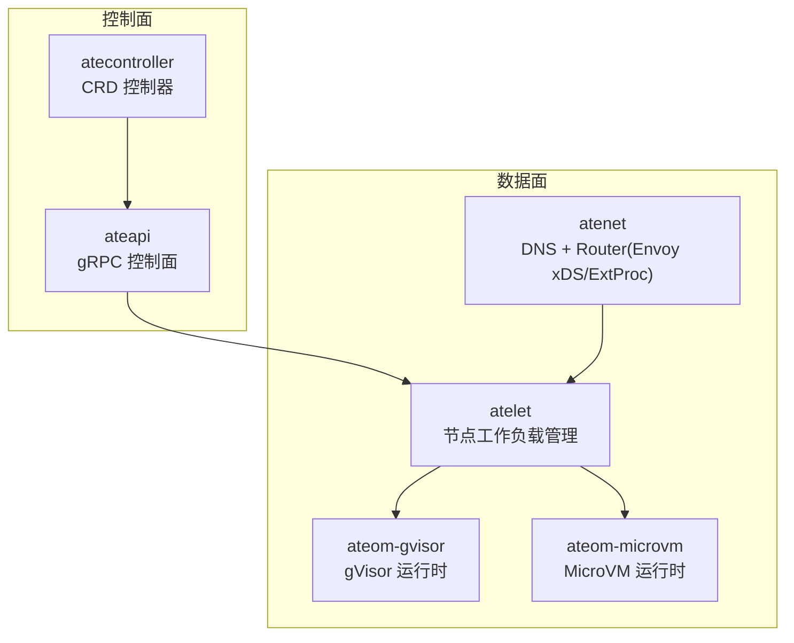
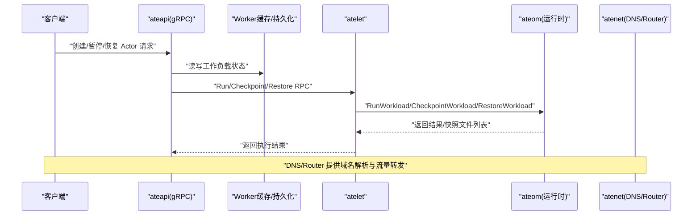
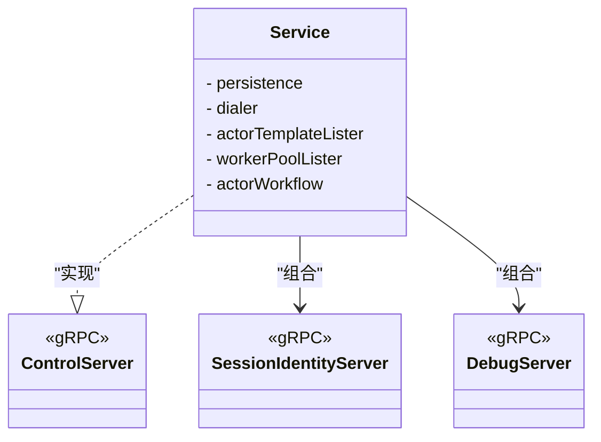
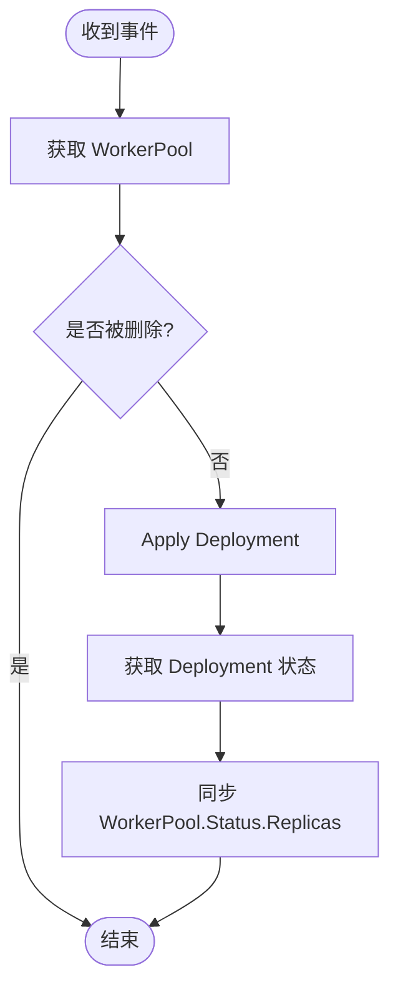
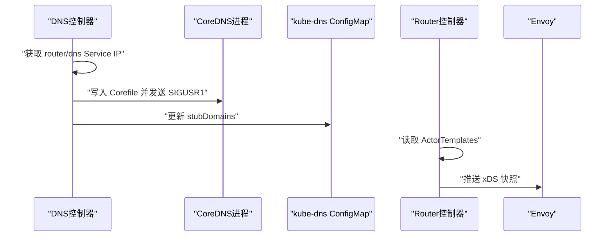
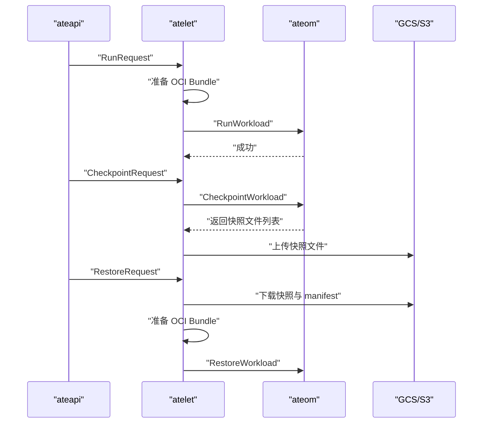
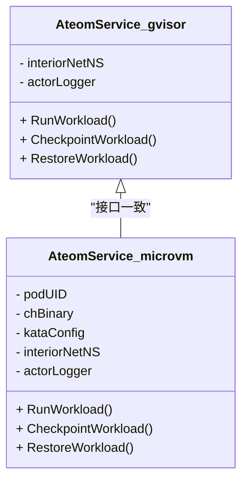
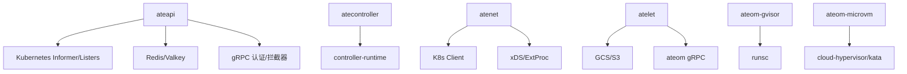

# 核心组件

<cite>
**本文引用的文件**   
- [cmd/ateapi/main.go](file://cmd/ateapi/main.go)
- [cmd/ateapi/internal/controlapi/service.go](file://cmd/ateapi/internal/controlapi/service.go)
- [cmd/atecontroller/main.go](file://cmd/atecontroller/main.go)
- [cmd/atecontroller/internal/controllers/workerpool_controller.go](file://cmd/atecontroller/internal/controllers/workerpool_controller.go)
- [cmd/atenet/main.go](file://cmd/atenet/main.go)
- [cmd/atenet/internal/root.go](file://cmd/atenet/internal/root.go)
- [cmd/atenet/internal/router/controller.go](file://cmd/atenet/internal/router/controller.go)
- [cmd/atenet/internal/dns/dns.go](file://cmd/atenet/internal/dns/dns.go)
- [cmd/atelet/main.go](file://cmd/atelet/main.go)
- [cmd/atelet/oci.go](file://cmd/atelet/oci.go)
- [cmd/ateom-gvisor/main.go](file://cmd/ateom-gvisor/main.go)
- [cmd/ateom-microvm/main.go](file://cmd/ateom-microvm/main.go)
- [internal/serverboot/serverboot.go](file://internal/serverboot/serverboot.go)
</cite>

## 目录
1. [简介](#简介)
2. [项目结构](#项目结构)
3. [核心组件](#核心组件)
4. [架构总览](#架构总览)
5. [详细组件分析](#详细组件分析)
6. [依赖关系分析](#依赖关系分析)
7. [性能考量](#性能考量)
8. [故障排查指南](#故障排查指南)
9. [结论](#结论)
10. [附录](#附录)

## 简介
本文件系统性梳理 Agent Substrate 的核心组件与实现细节，覆盖控制平面 API 服务器（ateapi）、控制器（atecontroller）、网络层（atenet：DNS 与 Envoy 集成）、节点代理（atelet）以及沙箱运行时（gVisor 与 MicroVM）。文档重点阐述请求处理流程、状态管理、并发控制、Kubernetes 资源同步、事件处理、冲突解决、动态路由配置、负载均衡与健康检查、工作负载生命周期管理、快照与恢复、镜像准备与 OCI Bundle 生成、以及各组件的配置项、监控指标与日志格式。同时给出组件间通信协议与数据交换格式的概览说明。

## 项目结构
Agent Substrate 采用多进程微服务架构，按职责拆分为以下主要二进制：
- ateapi：控制平面 gRPC 服务，提供 Actor/WorkerPool 等资源的控制面 API，并协调 Worker 缓存与持久化。
- atecontroller：基于 controller-runtime 的控制器，将 CRD 状态同步到实际集群资源（如 Deployment）。
- atenet：网络守护进程，包含 DNS 与 Router（Envoy xDS + ExtProc）子命令。
- atelet：节点侧工作负载管理器，负责镜像拉取、OCI Bundle 准备、与 ateom 交互执行 Run/Checkpoint/Restore。
- ateom-gvisor / ateom-microvm：节点侧沙箱运行时，分别基于 gVisor（runsc）与 Kata+Cloud-Hypervisor 实现。

图表来源
- [cmd/ateapi/main.go:182-196](file://cmd/ateapi/main.go#L182-L196)
- [cmd/atecontroller/main.go:82-105](file://cmd/atecontroller/main.go#L82-L105)
- [cmd/atenet/main.go:19-21](file://cmd/atenet/main.go#L19-L21)
- [cmd/atenet/internal/root.go:39-42](file://cmd/atenet/internal/root.go#L39-L42)
- [cmd/atelet/main.go:171-182](file://cmd/atelet/main.go#L171-L182)
- [cmd/ateom-gvisor/main.go:142-152](file://cmd/ateom-gvisor/main.go#L142-L152)
- [cmd/ateom-microvm/main.go:142-152](file://cmd/ateom-microvm/main.go#L142-L152)

章节来源
- [cmd/ateapi/main.go:1-206](file://cmd/ateapi/main.go#L1-L206)
- [cmd/atecontroller/main.go:1-124](file://cmd/atecontroller/main.go#L1-L124)
- [cmd/atenet/main.go:1-22](file://cmd/atenet/main.go#L1-L22)
- [cmd/atenet/internal/root.go:1-43](file://cmd/atenet/internal/root.go#L1-L43)
- [cmd/atelet/main.go:1-183](file://cmd/atelet/main.go#L1-L183)
- [cmd/ateom-gvisor/main.go:72-155](file://cmd/ateom-gvisor/main.go#L72-L155)
- [cmd/ateom-microvm/main.go:59-154](file://cmd/ateom-microvm/main.go#L59-L154)

## 核心组件
本节概述各组件的职责与关键能力，后续章节深入展开。

- ateapi（控制平面 API 服务器）
  - 提供 gRPC 控制面接口，支持 mTLS/JWT 认证、OpenTelemetry 追踪与 Prometheus 指标。
  - 通过 Informer 监听 Kubernetes Pod/CRD 变更，维护 Worker 缓存与持久化（Redis/Valkey）。
  - 编排 Actor 工作流，调用 atelet 执行工作负载生命周期操作。

- atecontroller（控制器）
  - 使用 controller-runtime 管理 CRD（如 WorkerPool），将其期望状态同步为 Deployment。
  - 使用 Apply 策略与 FieldOwner 进行幂等更新，避免外部修改冲突。

- atenet（网络层）
  - DNS：动态生成 CoreDNS Corefile，注入 ate-system 命名空间下的解析规则，并更新 kube-dns stubDomains。
  - Router：周期性从 K8s/文件读取 ActorTemplate，生成 xDS 快照并推送给 Envoy；可选地管理 Envoy Deployment。

- atelet（节点代理）
  - 接收 ateapi 指令，准备 OCI Bundle（含 pause 与应用容器），与 ateom 交互执行 Run/Checkpoint/Restore。
  - 支持 GCS/S3 对象存储后端，内存镜像拉取缓存，本地/外部快照上传与恢复。

- 沙箱运行时（ateom-gvisor / ateom-microvm）
  - 暴露统一的 ateompb.Ateom 服务，封装 runsc 或 Kata+CH 的启动、快照与恢复。
  - 在节点上创建独立网络命名空间，建立 veth 对与 nftables 规则，完成入站 DNAT 与出站 SNAT/Masquerade。

章节来源
- [cmd/ateapi/internal/controlapi/service.go:25-56](file://cmd/ateapi/internal/controlapi/service.go#L25-L56)
- [cmd/atecontroller/internal/controllers/workerpool_controller.go:35-121](file://cmd/atecontroller/internal/controllers/workerpool_controller.go#L35-L121)
- [cmd/atenet/internal/router/controller.go:26-111](file://cmd/atenet/internal/router/controller.go#L26-L111)
- [cmd/atenet/internal/dns/dns.go:42-117](file://cmd/atenet/internal/dns/dns.go#L42-L117)
- [cmd/atelet/main.go:185-271](file://cmd/atelet/main.go#L185-L271)
- [cmd/ateom-gvisor/main.go:157-237](file://cmd/ateom-gvisor/main.go#L157-L237)
- [cmd/ateom-microvm/main.go:184-226](file://cmd/ateom-microvm/main.go#L184-L226)

## 架构总览
下图展示 ateapi 作为控制面入口，协调 atelet 与 ateom 运行时的整体交互，以及 atenet 提供的网络能力。

图表来源
- [cmd/ateapi/main.go:182-196](file://cmd/ateapi/main.go#L182-L196)
- [cmd/atelet/main.go:215-271](file://cmd/atelet/main.go#L215-L271)
- [cmd/ateom-gvisor/main.go:180-237](file://cmd/ateom-gvisor/main.go#L180-L237)
- [cmd/atenet/internal/dns/dns.go:51-117](file://cmd/atenet/internal/dns/dns.go#L51-L117)
- [cmd/atenet/internal/router/controller.go:67-111](file://cmd/atenet/internal/router/controller.go#L67-L111)

## 详细组件分析

### ateapi 控制平面 API 服务器
- 启动与初始化
  - 解析命令行参数，初始化日志、Tracing、Metrics，构建 gRPC Server 并注册 Control/SessionIdentity/Debug 服务。
  - 连接 Redis/Valkey 集群，初始化 Worker 缓存，启动 Informer 监听 Pod 与 CRD。
  - 根据 auth-mode 选择 mTLS 或 JWT 认证模式，并配置拦截器链。

- 请求处理流程
  - 所有 gRPC 请求经过认证拦截器与通用拦截器，随后进入 Service 编排的工作流。
  - Service 组合了持久化、缓存、Lister、Dialer 与工作流编排器，统一对外暴露控制面能力。

- 状态管理与并发控制
  - 使用 Lister 缓存减少直接访问 etcd 的压力。
  - Worker 缓存定期刷新，结合持久化层保证跨实例一致性。
  - 工作流内部对关键路径加锁，避免并发竞态。

- 配置选项
  - gRPC 监听地址、证书包、认证模式、JWT Issuer/Audience、会话 ID JWT 池、WorkerPool CA 等。
  - Redis 集群地址、CA、IAM 认证开关、TLS ServerName、客户端证书等。

- 监控指标与日志
  - 通过 serverboot 初始化 OTel Tracing 与 Prometheus Metrics，暴露 /metrics。
  - 日志采用 JSON 格式，带上下文字段，便于链路追踪。

图表来源
- [cmd/ateapi/internal/controlapi/service.go:25-56](file://cmd/ateapi/internal/controlapi/service.go#L25-L56)
- [cmd/ateapi/main.go:182-196](file://cmd/ateapi/main.go#L182-L196)

章节来源
- [cmd/ateapi/main.go:79-206](file://cmd/ateapi/main.go#L79-L206)
- [cmd/ateapi/internal/controlapi/service.go:25-56](file://cmd/ateapi/internal/controlapi/service.go#L25-L56)
- [internal/serverboot/serverboot.go:44-55](file://internal/serverboot/serverboot.go#L44-L55)
- [internal/serverboot/serverboot.go:166-192](file://internal/serverboot/serverboot.go#L166-L192)

### atecontroller 控制器
- 控制器类型
  - WorkerPoolReconciler：监听 WorkerPool CRD，应用对应的 Deployment，并同步状态。

- 同步与冲突解决
  - 使用 Apply 策略与 FieldOwner 进行幂等更新，避免与其他控制器冲突。
  - 删除时间戳检测确保优雅删除。

- 事件处理
  - SetupWithManager 绑定 For(Owning) 资源，自动触发 Reconcile。

图表来源
- [cmd/atecontroller/internal/controllers/workerpool_controller.go:47-112](file://cmd/atecontroller/internal/controllers/workerpool_controller.go#L47-L112)

章节来源
- [cmd/atecontroller/main.go:53-123](file://cmd/atecontroller/main.go#L53-L123)
- [cmd/atecontroller/internal/controllers/workerpool_controller.go:35-121](file://cmd/atecontroller/internal/controllers/workerpool_controller.go#L35-L121)

### atenet 网络层（DNS 与 Envoy 集成）
- DNS 控制器
  - 周期 reconcile，获取 atenet-router 与 dns 服务的 ClusterIP。
  - 生成 Corefile 写入共享卷，并向 CoreDNS 进程发送信号以热重载。
  - 更新 kube-dns ConfigMap 的 stubDomains，使 ate-system 域名解析指向自定义 DNS。

- Router 控制器
  - 从 K8s 或文件加载 ActorTemplate，生成 xDS 快照并推送至 Envoy。
  - 在非 Standalone 模式下，管理 Envoy Deployment 与相关集群实体。

图表来源
- [cmd/atenet/internal/dns/dns.go:51-117](file://cmd/atenet/internal/dns/dns.go#L51-L117)
- [cmd/atenet/internal/router/controller.go:67-111](file://cmd/atenet/internal/router/controller.go#L67-L111)

章节来源
- [cmd/atenet/main.go:19-21](file://cmd/atenet/main.go#L19-L21)
- [cmd/atenet/internal/root.go:39-42](file://cmd/atenet/internal/root.go#L39-L42)
- [cmd/atenet/internal/dns/dns.go:42-117](file://cmd/atenet/internal/dns/dns.go#L42-L117)
- [cmd/atenet/internal/router/controller.go:26-111](file://cmd/atenet/internal/router/controller.go#L26-L111)

### atelet 节点代理
- 工作负载管理
  - 接收 ateapi 的 Run/Checkpoint/Restore 请求，校验参数并准备 OCI Bundle。
  - 通过 ateom 的 gRPC 接口驱动 runsc 或 Kata+CH 执行具体操作。

- 快照操作
  - Checkpoint：调用 ateom 生成快照，记录快照文件列表，上传至 GCS/S3 或移动到本地目录，并写入 manifest。
  - Restore：下载快照与 manifest，并行准备 OCI Bundle 与镜像，调用 ateom 恢复。

- 资源清理
  - 每次操作前后重置 actor 目录，确保干净状态。
  - 失败路径中清理中间产物，避免残留。

- 镜像与 OCI Bundle 准备
  - 使用内存拉取缓存加速镜像获取，支持 GCP ADC 与本地替换。
  - 解压镜像层到 rootfs，生成 config.json，挂载身份目录与持久卷。

图表来源
- [cmd/atelet/main.go:215-271](file://cmd/atelet/main.go#L215-L271)
- [cmd/atelet/main.go:309-380](file://cmd/atelet/main.go#L309-L380)
- [cmd/atelet/main.go:454-583](file://cmd/atelet/main.go#L454-L583)
- [cmd/atelet/oci.go:60-116](file://cmd/atelet/oci.go#L60-L116)

章节来源
- [cmd/atelet/main.go:74-183](file://cmd/atelet/main.go#L74-L183)
- [cmd/atelet/oci.go:60-116](file://cmd/atelet/oci.go#L60-L116)
- [cmd/atelet/oci.go:177-300](file://cmd/atelet/oci.go#L177-L300)

### 沙箱运行时（gVisor 与 MicroVM）
- ateom-gvisor
  - 在节点上创建 interior netns，建立 veth 对，安装 nftables 规则实现 DNAT/Masquerade。
  - 通过 runsc 启动 pause 与应用容器，等待 readyz 探针成功后返回。
  - 支持全量与数据快照范围，列出 runsc 生成的快照文件供 atelet 上传。

- ateom-microvm
  - 基于 Kata 与 Cloud-Hypervisor，提供与 gVisor 一致的 ateompb.Ateom 接口。
  - 确保 mount propagation 为 rshared，以便 virtio-fs 正确传播根文件系统。
  - 同样支持 Run/Checkpoint/Restore，并通过 reaper 回收子进程。

图表来源
- [cmd/ateom-gvisor/main.go:157-237](file://cmd/ateom-gvisor/main.go#L157-L237)
- [cmd/ateom-microvm/main.go:184-226](file://cmd/ateom-microvm/main.go#L184-L226)

章节来源
- [cmd/ateom-gvisor/main.go:72-155](file://cmd/ateom-gvisor/main.go#L72-L155)
- [cmd/ateom-gvisor/main.go:439-521](file://cmd/ateom-gvisor/main.go#L439-L521)
- [cmd/ateom-microvm/main.go:59-154](file://cmd/ateom-microvm/main.go#L59-L154)

## 依赖关系分析
- ateapi 依赖：
  - Kubernetes Informer 与 Listers（Pod、CRD）。
  - Redis/Valkey 集群用于持久化与缓存。
  - gRPC 认证与拦截器链（mTLS/JWT）。
- atecontroller 依赖：
  - controller-runtime Manager、CRD Scheme、K8s Client。
- atenet 依赖：
  - K8s Client（Service、ConfigMap）。
  - Envoy xDS 与 ExtProc 服务端。
- atelet 依赖：
  - GCS/S3 对象存储、镜像拉取缓存、ateom gRPC 客户端。
- ateom 依赖：
  - 系统网络命名空间、nftables、netlink。
  - runsc 或 Kata+CH 二进制。

图表来源
- [cmd/ateapi/main.go:111-155](file://cmd/ateapi/main.go#L111-L155)
- [cmd/atecontroller/main.go:82-105](file://cmd/atecontroller/main.go#L82-L105)
- [cmd/atenet/internal/router/controller.go:39-65](file://cmd/atenet/internal/router/controller.go#L39-L65)
- [cmd/atenet/internal/dns/dns.go:71-117](file://cmd/atenet/internal/dns/dns.go#L71-L117)
- [cmd/atelet/main.go:126-169](file://cmd/atelet/main.go#L126-L169)
- [cmd/ateom-gvisor/main.go:180-237](file://cmd/ateom-gvisor/main.go#L180-L237)
- [cmd/ateom-microvm/main.go:184-226](file://cmd/ateom-microvm/main.go#L184-L226)

章节来源
- [cmd/ateapi/main.go:111-155](file://cmd/ateapi/main.go#L111-L155)
- [cmd/atecontroller/main.go:82-105](file://cmd/atecontroller/main.go#L82-L105)
- [cmd/atenet/internal/router/controller.go:39-65](file://cmd/atenet/internal/router/controller.go#L39-L65)
- [cmd/atenet/internal/dns/dns.go:71-117](file://cmd/atenet/internal/dns/dns.go#L71-L117)
- [cmd/atelet/main.go:126-169](file://cmd/atelet/main.go#L126-L169)
- [cmd/ateom-gvisor/main.go:180-237](file://cmd/ateom-gvisor/main.go#L180-L237)
- [cmd/ateom-microvm/main.go:184-226](file://cmd/ateom-microvm/main.go#L184-L226)

## 性能考量
- 缓存与批处理
  - ateapi 使用 Lister 与 Worker 缓存降低 etcd 压力，配合定时刷新与持久化保证一致性。
- 并行 I/O
  - atelet 在 Restore 时并行下载快照与准备 OCI Bundle，缩短冷启动延迟。
- 镜像拉取优化
  - 内存拉取缓存与本地替换端点提升开发体验与拉取速度。
- 网络转发效率
  - nftables 规则集中管理，仅针对活跃 actor 生效，减少无关开销。

[本节为通用指导，不直接分析具体文件]

## 故障排查指南
- 认证与 TLS
  - 确认 mTLS/JWT 配置正确，CA 与 Token 文件可读，Issuer/Audience 匹配。
- 连接性
  - Redis/Valkey 连通性与 IAM 认证开关；Kubernetes InCluster 配置可用。
- 镜像与存储
  - GCS/S3 凭据与环境变量；本地替换端点可达。
- 网络与 DNS
  - CoreDNS 热重载是否成功；kube-dns stubDomains 是否更新；router Service ClusterIP 是否存在。
- 运行时
  - ateom 日志输出是否包含生命周期事件；nftables 表是否安装/清理；readyz 探针是否通过。

章节来源
- [cmd/ateapi/main.go:171-196](file://cmd/ateapi/main.go#L171-L196)
- [cmd/ateapi/main.go:248-331](file://cmd/ateapi/main.go#L248-L331)
- [cmd/atenet/internal/dns/dns.go:119-141](file://cmd/atenet/internal/dns/dns.go#L119-L141)
- [cmd/ateom-gvisor/main.go:229-237](file://cmd/ateom-gvisor/main.go#L229-L237)

## 结论
Agent Substrate 通过清晰的分层与职责划分，实现了高可扩展的控制面与数据面。ateapi 提供统一控制面，atecontroller 保障声明式状态同步，atenet 提供灵活的网络能力，atelet 与 ateom 协同完成工作负载的生命周期与快照恢复。gVisor 与 MicroVM 两种运行时满足不同的安全与性能需求。整体设计强调可观测性、幂等性与容错性，适合大规模生产环境部署。

[本节为总结，不直接分析具体文件]

## 附录

### 配置选项汇总
- ateapi
  - gRPC 监听地址、证书包、认证模式、JWT Issuer/Audience、会话 ID JWT 池、WorkerPool CA。
  - Redis 集群地址、CA、IAM 认证开关、TLS ServerName、客户端证书。
- atecontroller
  - ateapi 连接规格、认证模式、CA 文件、ServerName、Token 文件。
- atenet
  - DNS 控制器间隔、Corefile 路径、Router 模板源（K8s/文件）、Standalone 模式、端口配置。
- atelet
  - 监听端口、指标端口、GCP 镜像拉取认证、本地替换端点。
- ateom-gvisor / ateom-microvm
  - pod UID、云超管二进制路径、kata 配置文件、调试开关。

章节来源
- [cmd/ateapi/main.go:56-77](file://cmd/ateapi/main.go#L56-L77)
- [cmd/atecontroller/main.go:36-46](file://cmd/atecontroller/main.go#L36-L46)
- [cmd/atenet/internal/root.go:25-30](file://cmd/atenet/internal/root.go#L25-L30)
- [cmd/atenet/internal/dns/dns.go:42-48](file://cmd/atenet/internal/dns/dns.go#L42-L48)
- [cmd/atenet/internal/router/controller.go:39-65](file://cmd/atenet/internal/router/controller.go#L39-L65)
- [cmd/atelet/main.go:64-72](file://cmd/atelet/main.go#L64-L72)
- [cmd/ateom-gvisor/main.go:53-57](file://cmd/ateom-gvisor/main.go#L53-L57)
- [cmd/ateom-microvm/main.go:51-57](file://cmd/ateom-microvm/main.go#L51-L57)

### 监控指标与日志格式
- 指标
  - Prometheus /metrics 端点由 serverboot 统一提供。
  - atelet 额外记录快照大小直方图指标。
- 日志
  - JSON 格式，带上下文字段（服务名、实例 ID、trace/span 信息）。
  - ateom 输出结构化 actor 生命周期日志。

章节来源
- [internal/serverboot/serverboot.go:166-192](file://internal/serverboot/serverboot.go#L166-L192)
- [cmd/atelet/main.go:273-307](file://cmd/atelet/main.go#L273-L307)
- [cmd/ateom-gvisor/main.go:91-95](file://cmd/ateom-gvisor/main.go#L91-L95)
- [cmd/ateom-microvm/main.go:77-82](file://cmd/ateom-microvm/main.go#L77-L82)

### 组件间通信协议与数据交换格式
- ateapi ↔ atelet
  - 协议：gRPC（ateletpb）。
  - 主要方法：Run、Checkpoint、Restore（请求/响应结构见 atelet.proto）。
- atelet ↔ ateom
  - 协议：gRPC（ateompb）。
  - 主要方法：RunWorkload、CheckpointWorkload、RestoreWorkload（请求/响应结构见 ateom.proto）。
- atecontroller ↔ ateapi
  - 协议：gRPC（ateapipb）。
  - 主要方法：Control 服务（请求/响应结构见 ateapi.proto）。
- atenet → Envoy
  - 协议：xDS（RDS/CDS/LDS/EDS）与 ExtProc。
  - 数据交换：ActorTemplate 转换为 xDS 快照。

章节来源
- [cmd/ateapi/main.go:194-196](file://cmd/ateapi/main.go#L194-L196)
- [cmd/atelet/main.go:176-178](file://cmd/atelet/main.go#L176-L178)
- [cmd/ateom-gvisor/main.go:142-147](file://cmd/ateom-gvisor/main.go#L142-L147)
- [cmd/atenet/internal/router/controller.go:88-111](file://cmd/atenet/internal/router/controller.go#L88-L111)
