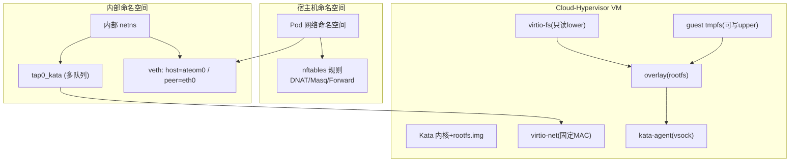
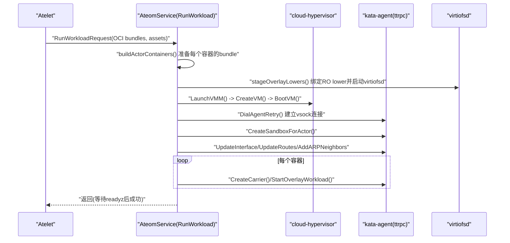
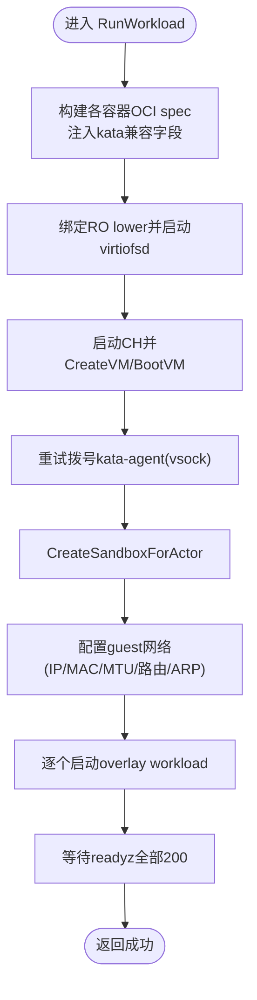
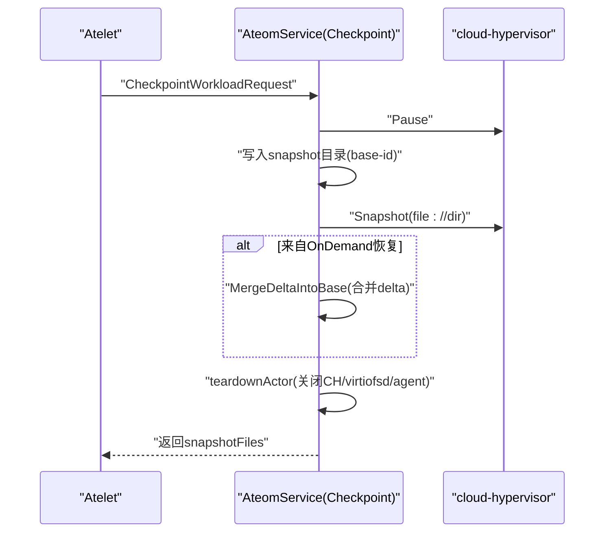
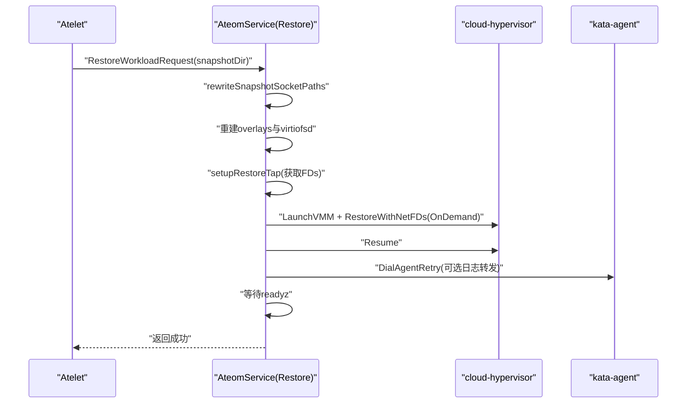
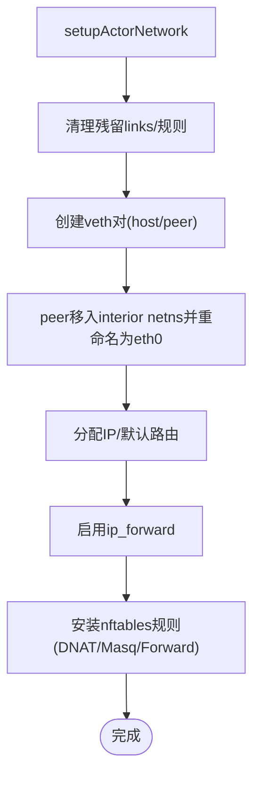
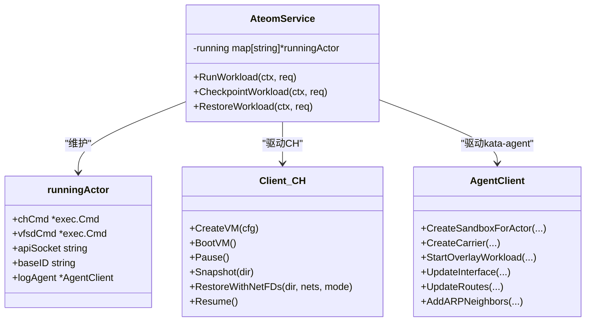

# MicroVM运行时

<cite>
**本文引用的文件**   
- [README.md](file://README.md)
- [main.go](file://cmd/ateom-microvm/main.go)
- [run.go](file://cmd/ateom-microvm/run.go)
- [checkpoint.go](file://cmd/ateom-microvm/checkpoint.go)
- [restore.go](file://cmd/ateom-microvm/restore.go)
- [net.go](file://cmd/ateom-microvm/net.go)
- [spec.go](file://cmd/ateom-microvm/spec.go)
- [kata.go](file://cmd/ateom-microvm/internal/kata/kata.go)
- [config.go](file://cmd/ateom-microvm/internal/kata/config.go)
- [specconv.go](file://cmd/ateom-microvm/internal/kata/specconv.go)
- [api.go](file://cmd/ateom-microvm/internal/ch/api.go)
- [createvm.go](file://cmd/ateom-microvm/internal/ch/createvm.go)
- [README.md](file://hack/microvm-assets/README.md)
</cite>

## 目录
1. [简介](#简介)
2. [项目结构](#项目结构)
3. [核心组件](#核心组件)
4. [架构总览](#架构总览)
5. [详细组件分析](#详细组件分析)
6. [依赖关系分析](#依赖关系分析)
7. [性能考量](#性能考量)
8. [故障诊断指南](#故障诊断指南)
9. [结论](#结论)
10. [附录](#附录)

## 简介
本文件系统性阐述 Agent Substrate 中基于 Kata Containers + Cloud-Hypervisor 的 MicroVM 运行时实现，覆盖以下关键主题：
- 虚拟机管理：直接驱动 cloud-hypervisor（CH）与 kata-agent，完成 VM 创建、配置生成、资源限制与安全隔离。
- OCI 适配层：将 atelet 生成的 OCI bundle 转换为 kata 兼容 spec，处理容器镜像、挂载与 overlay rootfs。
- 检查点与恢复：通过 CH 快照/恢复实现内存状态捕获、磁盘快照与快速启动（OnDemand）。
- 网络虚拟化：veth/tap 模型、nftables 转发、固定 MAC/IP 保证跨节点恢复一致性。
- 对比分析：MicroVM 与 gVisor 在安全性、性能与兼容性方面的差异。
- 部署与运维：资产准备、监控指标、API 调用示例与排障方法。

## 项目结构
MicroVM 运行时位于 cmd/ateom-microvm，围绕 Ateom gRPC 服务实现，核心模块包括：
- 进程与生命周期：主进程初始化、gRPC 服务、子进程回收、日志与追踪。
- 运行路径：RunWorkload 负责冷启动 VM、构建 overlay rootfs、启动容器并等待就绪。
- 检查点/恢复：CheckpointWorkload 与 RestoreWorkload 实现快照与 OnDemand 恢复。
- 网络栈：veth/tap/nftables 转发，固定地址与 MAC 保障可迁移性。
- OCI 适配：确保 kata 兼容 spec、挂载集与资源约束。
- 外部依赖：internal/ch 封装 CH REST API；internal/kata 提供 kata 配置解析、agent 通信与 overlay 操作。

图表来源
- [net.go:119-198](file://cmd/ateom-microvm/net.go#L119-L198)
- [run.go:449-476](file://cmd/ateom-microvm/run.go#L449-L476)
- [createvm.go:22-52](file://cmd/ateom-microvm/internal/ch/createvm.go#L22-L52)

章节来源
- [main.go:59-154](file://cmd/ateom-microvm/main.go#L59-L154)
- [run.go:174-368](file://cmd/ateom-microvm/run.go#L174-L368)
- [net.go:119-198](file://cmd/ateom-microvm/net.go#L119-L198)
- [spec.go:29-107](file://cmd/ateom-microvm/spec.go#L29-L107)

## 核心组件
- AteomService：实现 ateompb.AteomServer，串行化 Run/Checkpoint/Restore 生命周期，维护 runningActor 映射。
- runningActor：持有 CH 进程、virtiofsd 进程、API socket、baseID、日志代理等运行时信息。
- ch.Client：通过 unix socket 访问 CH REST API，执行 vm.create/boot/pause/snapshot/restore/resume 等操作。
- kata.AgentClient：通过 vsock ttrpc 与 guest kata-agent 交互，用于 CreateSandbox、CreateContainer/StartContainer、UpdateInterface/UpdateRoutes 等。
- 网络组件：veth/tap 桥接、nftables NAT/转发、固定 MAC/IP 策略。
- OCI 适配：ensureKataCompatibleSpec 注入 Linux.Resources/CgroupsPath/Namespaces/Mounts，重写注解以适配 kata。

章节来源
- [main.go:184-226](file://cmd/ateom-microvm/main.go#L184-L226)
- [run.go:41-76](file://cmd/ateom-microvm/run.go#L41-L76)
- [api.go:31-57](file://cmd/ateom-microvm/internal/ch/api.go#L31-L57)
- [createvm.go:107-123](file://cmd/ateom-microvm/internal/ch/createvm.go#L107-L123)
- [spec.go:29-107](file://cmd/ateom-microvm/spec.go#L29-L107)

## 架构总览
下图展示从 atelet 到 MicroVM 的关键调用链与数据流：

图表来源
- [run.go:174-368](file://cmd/ateom-microvm/run.go#L174-L368)
- [createvm.go:107-123](file://cmd/ateom-microvm/internal/ch/createvm.go#L107-L123)
- [specconv.go:24-135](file://cmd/ateom-microvm/internal/kata/specconv.go#L24-L135)

## 详细组件分析

### 虚拟机创建与启动（RunWorkload）
- 资源与配置：从 runtime asset paths 解析 CH 二进制与 kata 配置，读取 guest 内存/vCPU 与 kernel_params。
- 网络前置：为每次激活创建 veth pair，host 端在 pod netns，peer 移入 interior netns 并重命名为 eth0，安装 nftables 规则。
- 文件系统：将每个容器的 OCI rootfs 作为 RO lower 通过 virtiofsd 共享，guest 侧使用 tmpfs 作为 upper，形成 overlay rootfs。
- VM 引导：构造 VmConfig（kernel/image/disks/fs/vsock/console），CreateVM 后 BootVM。
- 容器编排：通过 kata-agent 建立 sandbox、配置 guest 网络（IP/MAC/MTU/路由/ARP），逐个启动 overlay workload。
- 就绪检测：等待所有 readyz 端点返回 200 后认为启动完成。

图表来源
- [run.go:174-368](file://cmd/ateom-microvm/run.go#L174-L368)
- [run.go:449-476](file://cmd/ateom-microvm/run.go#L449-L476)
- [run.go:595-623](file://cmd/ateom-microvm/run.go#L595-L623)

章节来源
- [run.go:174-368](file://cmd/ateom-microvm/run.go#L174-L368)
- [run.go:449-476](file://cmd/ateom-microvm/run.go#L449-L476)
- [run.go:595-623](file://cmd/ateom-microvm/run.go#L595-L623)

### OCI 规范适配层
- 目标：使 atelet 生成的 OCI bundle 能直接被 kata 接受。
- 主要动作：
  - 注入 Linux.Resources（设备白名单、CPU shares）、Linux.CgroupsPath。
  - 清理 CRI pause-model 注解，避免 kata 等待不存在的 pause sandbox。
  - 替换 Mounts 为 kata 已知集合（/proc,/dev,/dev/pts,/dev/shm,/dev/mqueue,/sys,/run）。
  - 设置 NetworkNamespace 指向 interior netns，使 kata 发现 eth0。
  - 写入 /etc/resolv.conf 到 lower，使 guest 具备集群 DNS。
- 注意：当前未暴露宿主路径身份卷到 guest，需后续通过 volume 机制支持。

章节来源
- [spec.go:29-107](file://cmd/ateom-microvm/spec.go#L29-L107)
- [run.go:376-397](file://cmd/ateom-microvm/run.go#L376-L397)

### 检查点与恢复（Checkpoint/Restore）
- CheckpointWorkload：
  - 暂停 VM，将快照写入本地目录（config.json/state.json/memory-ranges），记录 base-id。
  - 若来自 OnDemand 恢复，则合并 delta 到 restore source，得到完整 memory-ranges。
  - 关闭 CH、virtiofsd、清理网络，上报 snapshotFiles。
- RestoreWorkload：
  - 重写快照 config.json 中的 vsock/serial/fs socket 路径至当前 actor 的 VMDir。
  - 重建 overlay lowers 与 virtiofsd，重建 tap 并获取 FDs。
  - 以 OnDemand 模式恢复 VM（userfaultfd），附带 net_fds，随后 resume。
  - 重连 kata-agent 恢复日志转发，等待 readyz 成功后返回。

图表来源
- [checkpoint.go:44-154](file://cmd/ateom-microvm/checkpoint.go#L44-L154)
- [run.go:174-368](file://cmd/ateom-microvm/run.go#L174-L368)

图表来源
- [restore.go:52-207](file://cmd/ateom-microvm/restore.go#L52-L207)
- [run.go:174-368](file://cmd/ateom-microvm/run.go#L174-L368)

章节来源
- [checkpoint.go:44-154](file://cmd/ateom-microvm/checkpoint.go#L44-L154)
- [restore.go:52-207](file://cmd/ateom-microvm/restore.go#L52-L207)

### 网络虚拟化实现
- 模型：每激活一个 actor，创建一对 veth（host=ateom0，peer=eth0），peer 放入 interior netns 并重命名为 eth0。
- 固定标识：
  - hostVethMAC 与 actorGuestMAC 固定，避免恢复时 ARP 失效导致 egress 黑盒。
  - actorVethIP/网关固定于 /30 点对点网段，guest 网络配置冻结后可跨节点复用。
- 转发：nftables 表内 prerouting DNAT pod-IP:80 到 actorVethIP，postrouting Masq 源地址为 actorVethIP，forward 放行。
- 恢复链路：setupRestoreTap 重建 tap 并通过 TC mirred 双向重定向，将 FDs 传给 CH 的 restore。

图表来源
- [net.go:119-198](file://cmd/ateom-microvm/net.go#L119-L198)
- [net.go:336-416](file://cmd/ateom-microvm/net.go#L336-L416)
- [net.go:531-600](file://cmd/ateom-microvm/net.go#L531-L600)

章节来源
- [net.go:119-198](file://cmd/ateom-microvm/net.go#L119-L198)
- [net.go:336-416](file://cmd/ateom-microvm/net.go#L336-L416)
- [net.go:531-600](file://cmd/ateom-microvm/net.go#L531-L600)

### 安全隔离与资源限制
- 隔离边界：actor 运行在独立 micro-VM 中，拥有独立内核态与内存空间；rootfs 采用 overlay（RO lower + guest tmpfs upper），无宿主磁盘直写。
- 资源控制：kata 配置决定 guest 内存/vCPU；OCI spec 注入 Linux.Resources（设备白名单、CPU shares）与 CgroupsPath。
- 安全加固：仅允许必要设备（/dev/null,/random,/full,/tty,/zero,/urandom,/console,/pts,/ptmx），屏蔽/只读系统路径，禁用不必要命名空间。
- 日志与调试：可选开启 agent.debug_console 与 debug log，便于问题定位。

章节来源
- [spec.go:109-153](file://cmd/ateom-microvm/spec.go#L109-L153)
- [config.go:56-73](file://cmd/ateom-microvm/internal/kata/config.go#L56-L73)
- [run.go:427-441](file://cmd/ateom-microvm/run.go#L427-L441)

### 与 gVisor 的对比分析
- 安全性：
  - MicroVM：强隔离，独立内核与内存，攻击面更小；但需要 KVM 与硬件虚拟化能力。
  - gVisor：用户态沙箱，轻量且无需 KVM，隔离强度弱于 VM。
- 性能：
  - MicroVM：启动开销较大，但快照/恢复（尤其 OnDemand）可实现亚秒级热迁移；I/O 经 virtio 通道，吞吐良好。
  - gVisor：启动更快，适合短生命周期任务；但在高 I/O 或复杂系统调用场景下存在额外开销。
- 兼容性：
  - MicroVM：通过 kata-agent 与标准 OCI bundle 对接，兼容大多数 Linux 应用；但对某些内核特性/设备有要求。
  - gVisor：对 Linux ABI 的模拟可能带来行为差异，部分内核敏感型应用需适配。

[本节为概念性对比，不直接分析具体源码文件]

## 依赖关系分析
- 进程与接口：
  - main.go 注册 AteomService 并提供 gRPC 服务。
  - run.go 实现 RunWorkload，协调 ch.Client 与 kata.AgentClient。
  - checkpoint.go/restore.go 分别实现快照与恢复流程。
  - net.go 负责网络拓扑与转发。
  - spec.go 完成 OCI spec 到 kata 兼容形态的转换。
- 外部库：
  - internal/ch：封装 CH REST API（unix socket），提供 vm.create/boot/pause/snapshot/restore/resume 等。
  - internal/kata：解析 kata configuration.toml、构造 kernel_params、与 kata-agent 通信、overlay 操作。

图表来源
- [main.go:184-226](file://cmd/ateom-microvm/main.go#L184-L226)
- [run.go:41-76](file://cmd/ateom-microvm/run.go#L41-L76)
- [createvm.go:107-123](file://cmd/ateom-microvm/internal/ch/createvm.go#L107-L123)
- [specconv.go:24-135](file://cmd/ateom-microvm/internal/kata/specconv.go#L24-L135)

章节来源
- [main.go:184-226](file://cmd/ateom-microvm/main.go#L184-L226)
- [run.go:41-76](file://cmd/ateom-microvm/run.go#L41-L76)
- [createvm.go:107-123](file://cmd/ateom-microvm/internal/ch/createvm.go#L107-L123)
- [specconv.go:24-135](file://cmd/ateom-microvm/internal/kata/specconv.go#L24-L135)

## 性能考量
- 启动优化：
  - 预取 runtime assets（cloud-hypervisor、virtiofsd、kernel、image、config）以减少冷启动延迟。
  - 使用 OnDemand 恢复（userfaultfd）显著降低恢复时间，同时保持 sparse 内存布局，利于后续快照。
- I/O 优化：
  - virtio-blk 与 virtio-fs 队列数与队列大小按 vCPU 配置，提升并发吞吐。
  - 关闭 HTTP keep-alive 以避免 CH API 连接被换出导致的阻塞。
- 网络优化：
  - 固定 MAC/IP 避免 ARP 刷新；TC mirred 低开销转发。
  - 合理 MTU 传递到 guest，避免分片。

[本节为通用指导，不直接分析具体源码文件]

## 故障诊断指南
- 常见错误与定位：
  - kata-agent vsock 未就绪：等待超时，查看 serial.log 尾部输出。
  - 网络配置失败：抓取 guest ip addr/route/neigh 诊断信息。
  - 快照不完整：确认是否合并 OnDemand delta 到 base。
  - 恢复失败：检查 config.json 中 socket 路径重写是否正确。
- 建议步骤：
  - 启用 kata-debug 参数，提高 guest agent 日志级别。
  - 打开 debug console（vsock 端口 1026）进行 in-guest 诊断。
  - 核对 nftables 表与 veth/tap 状态，确认转发规则生效。
  - 验证 /etc/resolv.conf 已注入 lower，确保 DNS 解析正常。

章节来源
- [run.go:319-343](file://cmd/ateom-microvm/run.go#L319-L343)
- [run.go:495-502](file://cmd/ateom-microvm/run.go#L495-L502)
- [checkpoint.go:105-123](file://cmd/ateom-microvm/checkpoint.go#L105-L123)
- [restore.go:209-254](file://cmd/ateom-microvm/restore.go#L209-L254)
- [config.go:75-91](file://cmd/ateom-microvm/internal/kata/config.go#L75-L91)

## 结论
MicroVM 运行时通过直接驱动 cloud-hypervisor 与 kata-agent，结合 overlay rootfs 与固定网络标识，实现了强隔离、可迁移、可快照的高密度执行环境。其 OCI 适配层确保了与现有工具链的兼容，OnDemand 恢复大幅提升了热迁移效率。相较 gVisor，MicroVM 在安全性与可移植性方面更具优势，适用于对隔离与状态持久性要求较高的场景。

[本节为总结性内容，不直接分析具体源码文件]

## 附录

### 部署与资产准备
- 资产清单：cloud-hypervisor、virtiofsd、kata-kernel、kata-image、kata-config。
- 构建与分发：按节点架构组装资产，上传至 rustfs（S3/GCS），并在 SandboxConfig 中指定 assets。
- 节点要求：具备 /dev/kvm，标记标签以选择 microvm 沙箱类。

章节来源
- [README.md](file://hack/microvm-assets/README.md)

### 监控指标与可观测性
- 日志：统一通过 actorlog 同步写入 pod stdout，标注 ate.dev/* 标签。
- 追踪：gRPC 服务集成 OpenTelemetry StatsHandler。
- 健康检查：等待容器 readyz 端点返回 200。

章节来源
- [main.go:84-91](file://cmd/ateom-microvm/main.go#L84-L91)
- [run.go:349-352](file://cmd/ateom-microvm/run.go#L349-L352)

### API 调用示例（概念性）
- 启动工作负载：
  - 调用 RunWorkload，传入 OCI bundles、runtime asset paths、容器 spec。
  - 成功后等待 readyz 返回 200。
- 检查点：
  - 调用 CheckpointWorkload，返回 snapshotFiles（config.json/state.json/memory-ranges/base-id）。
- 恢复：
  - 调用 RestoreWorkload，传入 snapshotDir 与 spec，OnDemand 恢复后等待 readyz。

[本节为概念性说明，不直接分析具体源码文件]
