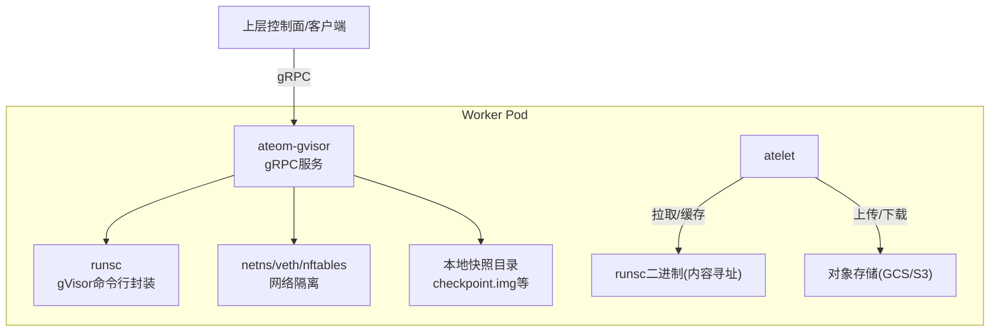
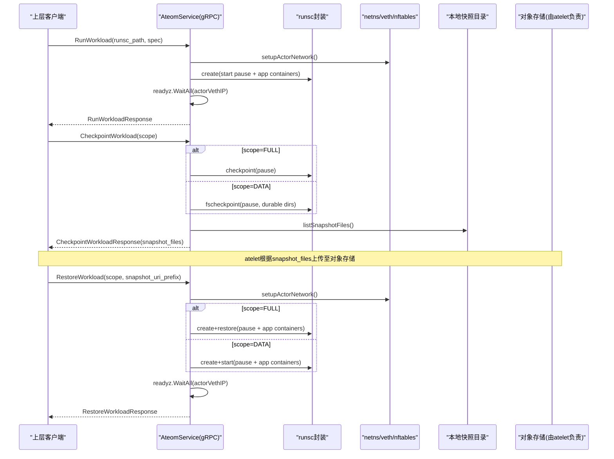
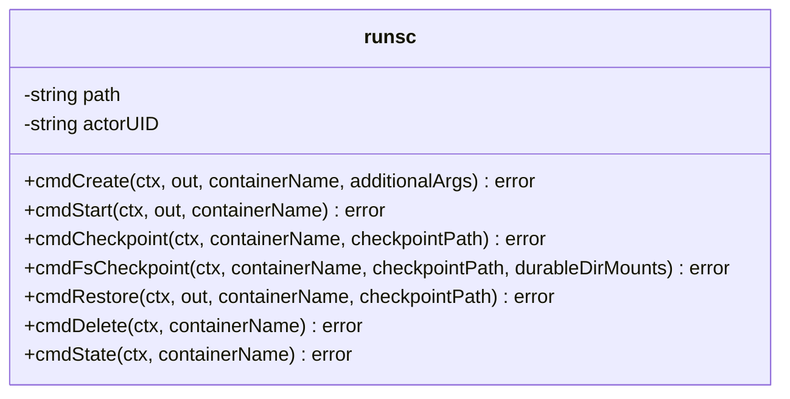
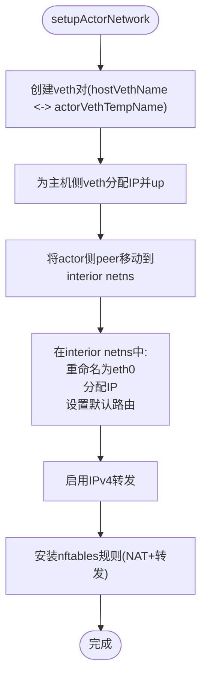
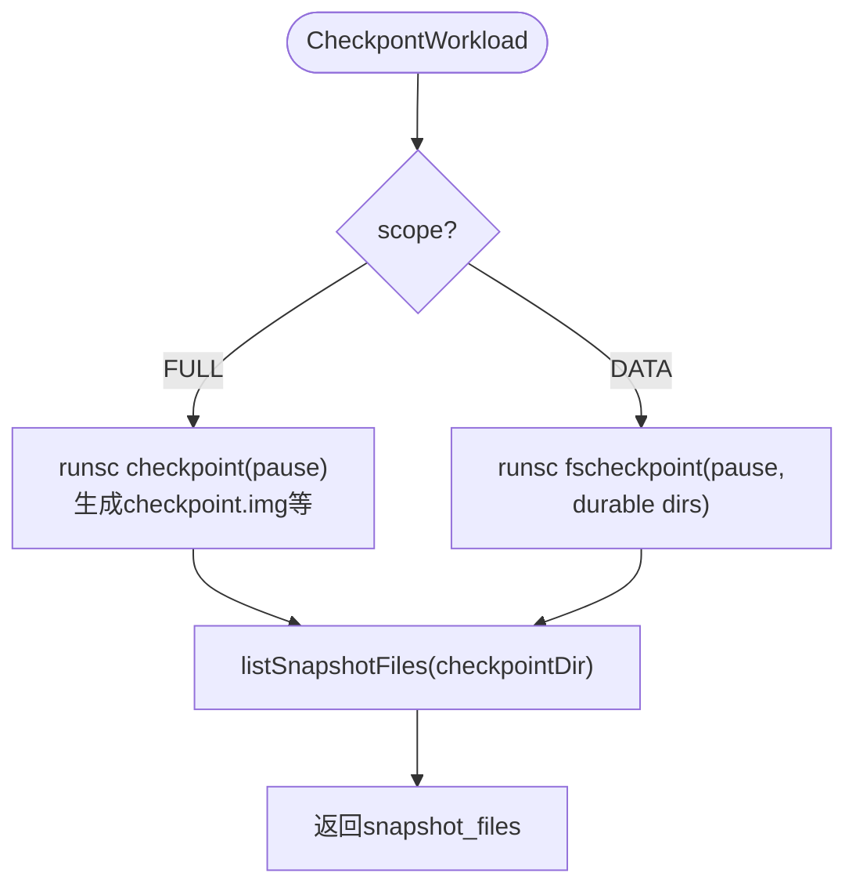
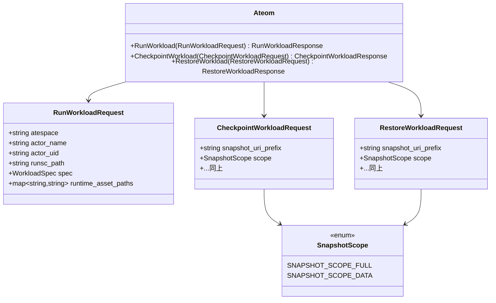
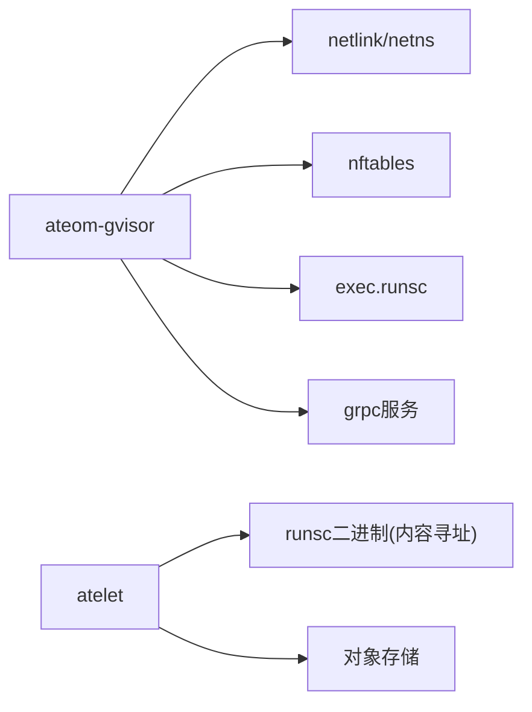

# gVisor运行时

<cite>
**本文引用的文件列表**
- [cmd/ateom-gvisor/main.go](file://cmd/ateom-gvisor/main.go)
- [cmd/ateom-gvisor/runsc.go](file://cmd/ateom-gvisor/runsc.go)
- [internal/proto/ateompb/ateom.proto](file://internal/proto/ateompb/ateom.proto)
- [cmd/atelet/sandbox_assets.go](file://cmd/atelet/sandbox_assets.go)
- [internal/ateerrors/ateerrors.go](file://internal/ateerrors/ateerrors.go)
- [internal/ateinterceptors/ateinterceptors.go](file://internal/ateinterceptors/ateinterceptors.go)
</cite>

## 目录
1. [简介](#简介)
2. [项目结构](#项目结构)
3. [核心组件](#核心组件)
4. [架构总览](#架构总览)
5. [详细组件分析](#详细组件分析)
6. [依赖关系分析](#依赖关系分析)
7. [性能考量](#性能考量)
8. [故障排除指南](#故障排除指南)
9. [结论](#结论)
10. [附录](#附录)

## 简介
本文件聚焦于Agent Substrate中gVisor运行时的实现与使用方式，围绕以下目标展开：
- runsc命令的封装与调用机制（创建、启动、检查点保存与恢复）
- 网络命名空间隔离（veth对、IP分配、路由、nftables规则）
- 快照机制（内存状态转储、文件系统增量备份、持久化存储）
- 与上层组件的通信协议（gRPC接口定义、消息格式、错误处理）
- 性能优化建议、故障排除指南与最佳实践

## 项目结构
gVisor运行时由一个独立的进程提供本地控制面服务，负责在worker Pod内编排gVisor实例。关键位置如下：
- ateom-gvisor：gVisor运行时服务，暴露gRPC接口，管理runsc子进程、网络命名空间与快照生命周期
- atelet：负责拉取并缓存runsc等静态资源，协调工作节点上的容器镜像与快照上传下载
- ateom.proto：定义Ateom服务接口与工作负载规格

图表来源
- [cmd/ateom-gvisor/main.go:140-155](file://cmd/ateom-gvisor/main.go#L140-L155)
- [cmd/ateom-gvisor/runsc.go:35-103](file://cmd/ateom-gvisor/runsc.go#L35-L103)
- [cmd/atelet/sandbox_assets.go:91-115](file://cmd/atelet/sandbox_assets.go#L91-L115)

章节来源
- [cmd/ateom-gvisor/main.go:72-155](file://cmd/ateom-gvisor/main.go#L72-L155)
- [cmd/atelet/sandbox_assets.go:44-115](file://cmd/atelet/sandbox_assets.go#L44-L115)

## 核心组件
- AteomService：gRPC服务端实现，负责RunWorkload、CheckpointWorkload、RestoreWorkload三大生命周期操作，内部维护互斥锁保证同一时刻仅执行一次runsc相关操作，避免并发冲突。
- runsc封装：将runsc子命令（create/start/checkpoint/fscheckpoint/restore/delete/state）统一封装为方法，注入必要的参数（如-root、-bundle、-image-path、-pid-file等），并通过exec.CommandContext执行。
- 网络子系统：在worker Pod netns与gVisor interior netns之间建立veth对，配置主机侧与actor侧地址、默认路由，启用IPv4转发，并通过nftables安装NAT与转发策略。
- 快照与持久化：根据SnapshotScope选择FULL或DATA路径；FULL通过runsc checkpoint生成包含内存与文件系统delta的镜像；DATA通过fscheckpoint仅持久化DurableDir卷；完成后列出实际写入的文件名供上层归档。

章节来源
- [cmd/ateom-gvisor/main.go:157-178](file://cmd/ateom-gvisor/main.go#L157-L178)
- [cmd/ateom-gvisor/runsc.go:30-103](file://cmd/ateom-gvisor/runsc.go#L30-L103)
- [cmd/ateom-gvisor/main.go:239-324](file://cmd/ateom-gvisor/main.go#L239-L324)
- [cmd/ateom-gvisor/main.go:439-521](file://cmd/ateom-gvisor/main.go#L439-L521)
- [cmd/ateom-gvisor/main.go:672-771](file://cmd/ateom-gvisor/main.go#L672-L771)

## 架构总览
下图展示了从上层到gVisor运行时的端到端流程，包括网络准备、容器编排、就绪探测、快照与恢复。

图表来源
- [cmd/ateom-gvisor/main.go:180-237](file://cmd/ateom-gvisor/main.go#L180-L237)
- [cmd/ateom-gvisor/main.go:239-324](file://cmd/ateom-gvisor/main.go#L239-L324)
- [cmd/ateom-gvisor/main.go:352-437](file://cmd/ateom-gvisor/main.go#L352-L437)
- [cmd/atelet/sandbox_assets.go:91-115](file://cmd/atelet/sandbox_assets.go#L91-L115)

## 详细组件分析

### runsc命令封装与调用机制
- 封装要点
  - 统一入口：runsc结构体持有path与actorUID，所有子命令均通过exec.CommandContext执行，确保上下文取消可传播。
  - 参数注入：-root指向runsc状态目录；-bundle指向OCI bundle；-pid-file用于PID记录；-image-path用于checkpoint/restore镜像路径；-allow-connected-on-save允许保存时保持连接。
  - 日志输出：标准输出/错误输出重定向到调用方提供的Writer，便于按容器维度聚合日志。
- 关键子命令
  - create：创建容器（pause与应用容器）
  - start：启动已创建的容器
  - checkpoint：对pause容器进行完整快照（内存+文件系统delta）
  - fscheckpoint：仅对DurableDir卷进行文件系统增量快照
  - restore：基于镜像恢复pause与应用容器
  - delete/state：清理与状态查询

图表来源
- [cmd/ateom-gvisor/runsc.go:30-103](file://cmd/ateom-gvisor/runsc.go#L30-L103)
- [cmd/ateom-gvisor/runsc.go:105-172](file://cmd/ateom-gvisor/runsc.go#L105-L172)
- [cmd/ateom-gvisor/runsc.go:176-208](file://cmd/ateom-gvisor/runsc.go#L176-L208)
- [cmd/ateom-gvisor/runsc.go:210-258](file://cmd/ateom-gvisor/runsc.go#L210-L258)

章节来源
- [cmd/ateom-gvisor/runsc.go:35-103](file://cmd/ateom-gvisor/runsc.go#L35-L103)
- [cmd/ateom-gvisor/runsc.go:105-172](file://cmd/ateom-gvisor/runsc.go#L105-L172)
- [cmd/ateom-gvisor/runsc.go:176-208](file://cmd/ateom-gvisor/runsc.go#L176-L208)
- [cmd/ateom-gvisor/runsc.go:210-258](file://cmd/ateom-gvisor/runsc.go#L210-L258)

### 网络命名空间隔离机制
- veth对与命名空间
  - 在worker Pod netns创建veth对，一端命名为hostVethName，另一端临时命名为actorVethTempName后移动到gVisor interior netns。
  - 在interior netns中将peer重命名为actorVethName，配置lo、IP地址与默认路由。
- IP与路由
  - hostVethCIDR与actorVethCIDR为点对点网段，分别分配给主机侧与actor侧。
  - actor侧默认网关指向host侧veth地址。
- IPv4转发
  - 启用/proc/sys/net/ipv4/ip_forward以允许数据包在host veth与pod eth0之间转发。
- nftables规则
  - 新建专用表actorNftTableName，包含prerouting/postrouting/forward链。
  - prerouting：DNAT访问worker Pod IP TCP/80的流量到actorVethIP TCP/80。
  - postrouting：对actorVethIP出向流量进行Masquerade，使回包能回到Pod IP。
  - forward：接受转发流量（兼容当前阶段）。
- 清理与幂等性
  - cleanupActorNetwork会删除nftables表、host veth以及interior netns中的actor veth（支持最终名称或临时名称），保证失败重试与切换场景下的幂等。

图表来源
- [cmd/ateom-gvisor/main.go:439-521](file://cmd/ateom-gvisor/main.go#L439-L521)
- [cmd/ateom-gvisor/main.go:523-576](file://cmd/ateom-gvisor/main.go#L523-L576)
- [cmd/ateom-gvisor/main.go:661-670](file://cmd/ateom-gvisor/main.go#L661-L670)
- [cmd/ateom-gvisor/main.go:672-771](file://cmd/ateom-gvisor/main.go#L672-L771)
- [cmd/ateom-gvisor/main.go:578-628](file://cmd/ateom-gvisor/main.go#L578-L628)

章节来源
- [cmd/ateom-gvisor/main.go:439-521](file://cmd/ateom-gvisor/main.go#L439-L521)
- [cmd/ateom-gvisor/main.go:523-576](file://cmd/ateom-gvisor/main.go#L523-L576)
- [cmd/ateom-gvisor/main.go:672-771](file://cmd/ateom-gvisor/main.go#L672-L771)
- [cmd/ateom-gvisor/main.go:578-628](file://cmd/ateom-gvisor/main.go#L578-L628)

### 快照机制实现原理
- 快照范围
  - FULL：对pause容器执行完整快照，包含内存状态与文件系统delta（含DurableDir卷）。
  - DATA：仅对DurableDir卷执行文件系统增量快照，不捕获内存与根文件系统delta。
- 实现细节
  - FULL：调用runsc checkpoint，指定-image-path为快照目录；完成后列出该目录下所有常规文件作为snapshot_files返回。
  - DATA：调用runsc fscheckpoint，传入-durable-dir挂载路径集合，仅持久化这些卷的数据。
- 持久化与恢复
  - 快照目录由ateom创建，文件名由runsc决定；上层（atelet）根据snapshot_files精确上传/下载。
  - Restore时，FULL路径先create再restore应用容器；DATA路径直接create+start，随后等待readyz就绪。

图表来源
- [cmd/ateom-gvisor/main.go:239-324](file://cmd/ateom-gvisor/main.go#L239-L324)
- [cmd/ateom-gvisor/runsc.go:105-172](file://cmd/ateom-gvisor/runsc.go#L105-L172)

章节来源
- [cmd/ateom-gvisor/main.go:239-324](file://cmd/ateom-gvisor/main.go#L239-L324)
- [cmd/ateom-gvisor/runsc.go:105-172](file://cmd/ateom-gvisor/runsc.go#L105-L172)

### 与上层组件的通信协议
- gRPC服务定义
  - Ateom服务提供RunWorkload、CheckpointWorkload、RestoreWorkload三个RPC。
  - WorkloadSpec描述容器集合；Container包含name、readyz探针与durable_dir_volumes。
  - SnapshotScope枚举区分FULL与DATA两种快照范围。
- 消息字段要点
  - runsc_path：指向本地已下载的runsc二进制路径（由atelet按架构与内容寻址放置）。
  - runtime_asset_paths：gVisor为空（microVM会使用其他资产）。
  - snapshot_uri_prefix：快照在对象存储中的URI前缀（由上层传递，具体上传/下载由atelet负责）。
- 错误处理
  - 使用统一的NewGRPCError构造带ErrorInfo详情的gRPC状态错误，Reason与Metadata可用于上层决策（例如是否触发崩溃）。
  - 服务端拦截器InternalServerUnaryInterceptor对错误进行标准化处理。

图表来源
- [internal/proto/ateompb/ateom.proto:34-171](file://internal/proto/ateompb/ateom.proto#L34-L171)

章节来源
- [internal/proto/ateompb/ateom.proto:34-171](file://internal/proto/ateompb/ateom.proto#L34-L171)
- [internal/ateerrors/ateerrors.go:68-99](file://internal/ateerrors/ateerrors.go#L68-L99)
- [internal/ateinterceptors/ateinterceptors.go](file://internal/ateinterceptors/ateinterceptors.go)

## 依赖关系分析
- ateom-gvisor依赖
  - netlink/netns：创建与操作网络命名空间、veth对、地址与路由
  - nftables：安装NAT与转发规则
  - exec.CommandContext：调用runsc子命令
  - grpc/reflection：提供gRPC服务与反射能力
  - serverboot/tracing：初始化追踪与优雅关闭
- atelet依赖
  - 内容寻址的资源拉取与缓存（runsc二进制）
  - 与对象存储交互（上传/下载快照）

图表来源
- [cmd/ateom-gvisor/main.go:140-155](file://cmd/ateom-gvisor/main.go#L140-L155)
- [cmd/atelet/sandbox_assets.go:91-115](file://cmd/atelet/sandbox_assets.go#L91-L115)

章节来源
- [cmd/ateom-gvisor/main.go:140-155](file://cmd/ateom-gvisor/main.go#L140-L155)
- [cmd/atelet/sandbox_assets.go:91-115](file://cmd/atelet/sandbox_assets.go#L91-L115)

## 性能考量
- 并行与串行
  - AteomService对涉及runsc的操作加全局互斥锁，避免并发导致的竞态与状态不一致。这保证了正确性但限制了吞吐，适合单actor场景。
- 快照路径选择
  - 对于频繁数据变更且需要快速恢复的场景，优先使用DATA快照以减少I/O与CPU开销；FULL快照适用于需要完全一致性的冷迁移。
- 网络转发与NAT
  - 当前采用Masquerade与DNAT的兼容路径，后续应逐步替换为更细粒度的透明TCP捕获与默认拒绝策略，以降低NAT开销并提升安全性。
- 就绪探测
  - readyz.WaitAll阻塞直到所有容器就绪，建议在应用层合理设计就绪逻辑，避免长轮询影响整体启动时延。

[本节为通用指导，无需特定文件引用]

## 故障排除指南
- 常见错误定位
  - 网络配置失败：检查veth对是否存在、interior netns是否正确、默认路由与nftables规则是否生效。
  - 快照失败：确认checkpoint目录权限、runsc版本与镜像兼容性、DurableDir卷是否挂载。
  - 恢复失败：核对snapshot_files完整性、runsc二进制路径与bundle一致性。
- 错误处理规范
  - 使用NewGRPCError构造结构化错误，携带Reason与Metadata，便于上层分类与告警。
  - 服务端拦截器会将错误转换为标准gRPC状态码与消息，便于客户端统一处理。
- 调试建议
  - 启用trace与日志，结合dumpNetInfo输出查看网络状态。
  - 在runsc封装中按需开启-debug/-log-packets等选项（生产环境谨慎使用）。

章节来源
- [internal/ateerrors/ateerrors.go:68-99](file://internal/ateerrors/ateerrors.go#L68-L99)
- [cmd/ateom-gvisor/main.go:894-901](file://cmd/ateom-gvisor/main.go#L894-L901)

## 结论
gVisor运行时通过简洁清晰的gRPC接口与runsc封装，实现了容器级沙箱的生命周期管理、网络隔离与快照恢复。其设计强调幂等性与可观测性，配合atelet的内容寻址与对象存储，形成完整的可迁移执行环境。未来可在网络策略精细化、快照合并与增量优化等方面持续演进。

[本节为总结性内容，无需特定文件引用]

## 附录

### 配置参数说明（示例）
- pod-uid：当前Pod UID，用于隔离ateom目录与socket路径
- version：打印版本信息并退出
- runsc_path：runsc二进制本地路径（由atelet按架构与内容寻址放置）
- snapshot_uri_prefix：快照在对象存储中的URI前缀（由上层传递）
- SnapshotScope：FULL或DATA，控制快照范围

章节来源
- [cmd/ateom-gvisor/main.go:53-70](file://cmd/ateom-gvisor/main.go#L53-L70)
- [internal/proto/ateompb/ateom.proto:97-107](file://internal/proto/ateompb/ateom.proto#L97-L107)
