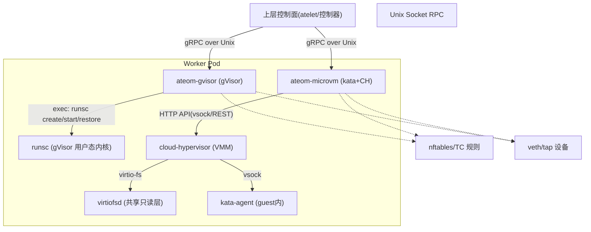
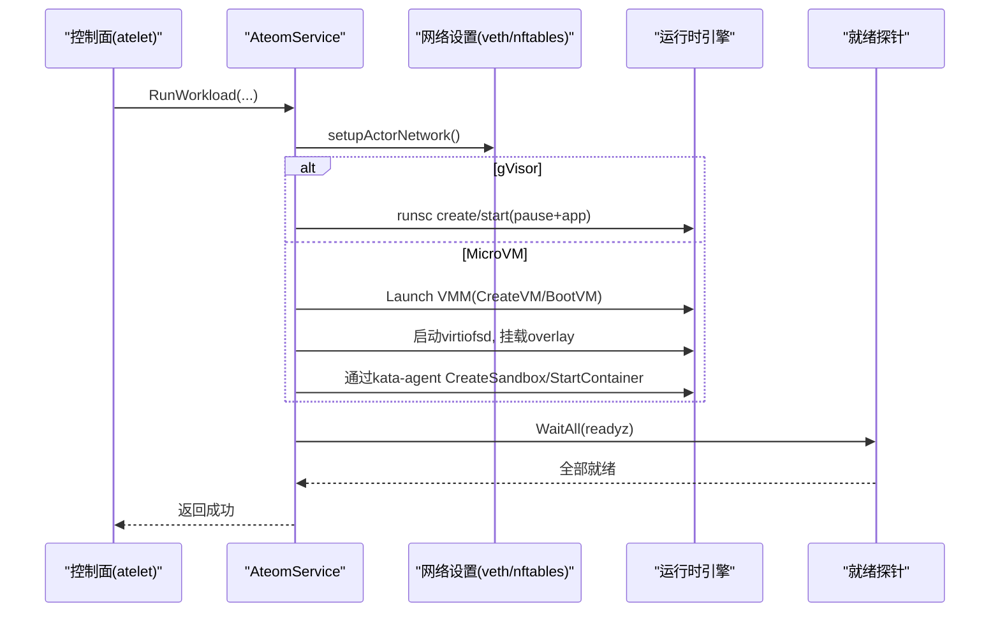
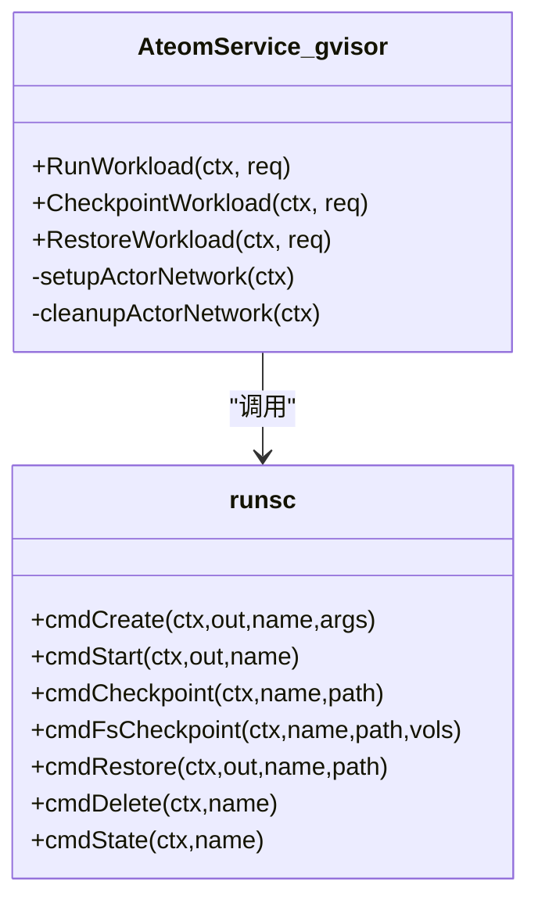
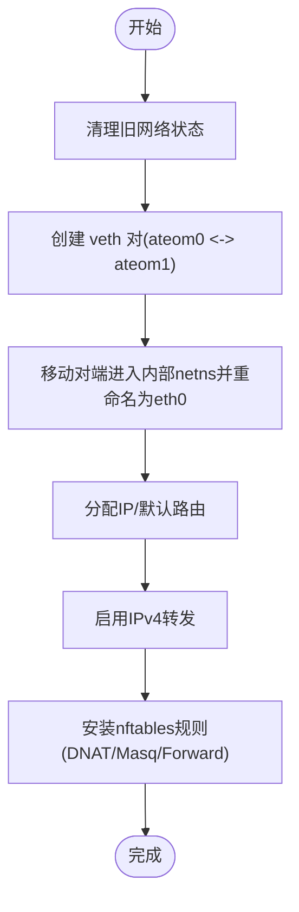
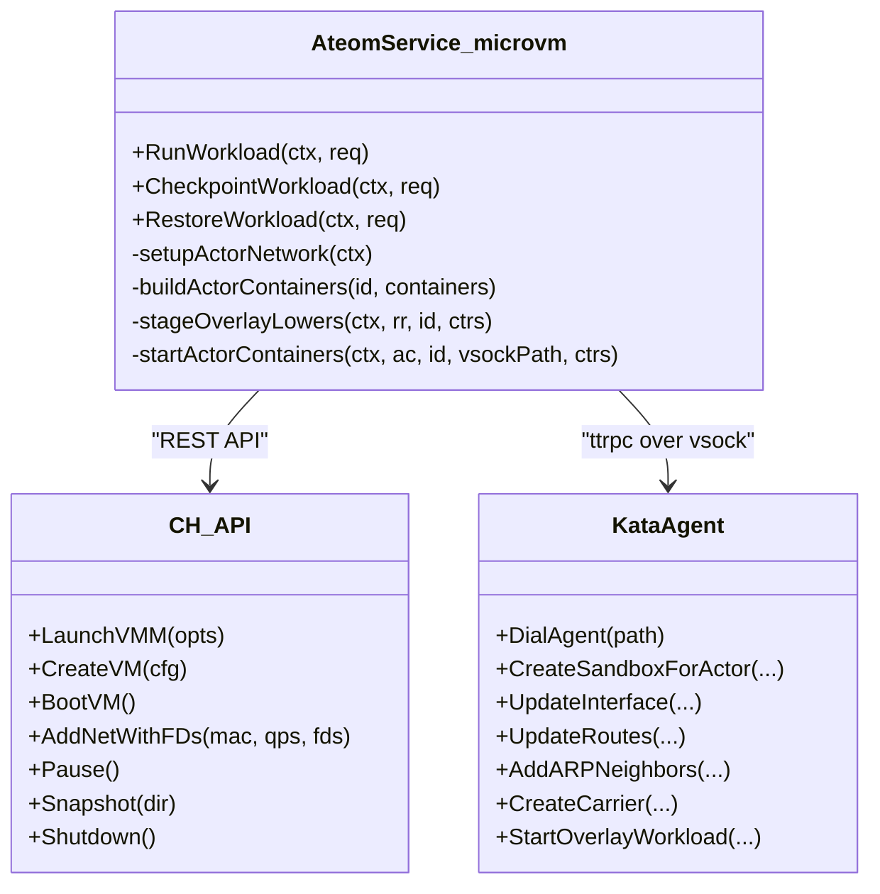
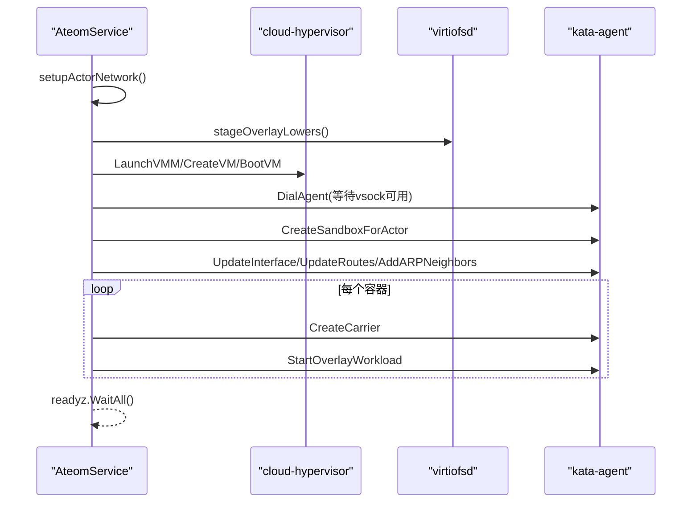
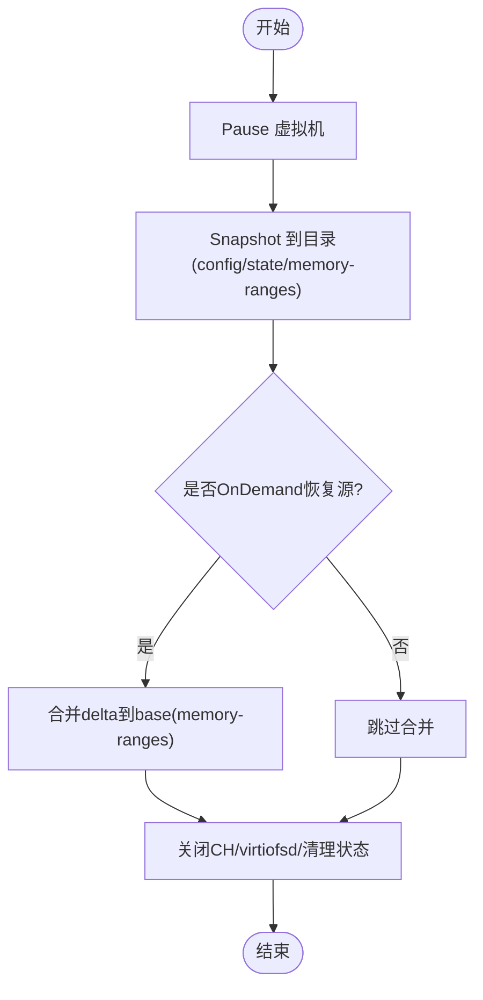
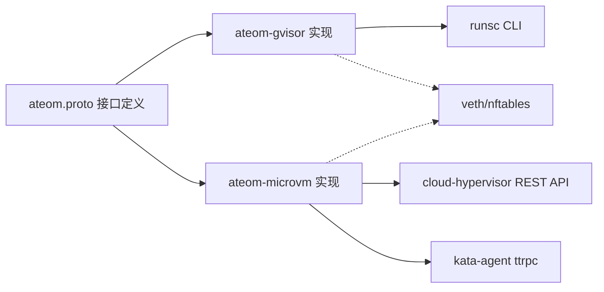

# 沙箱运行时

<cite>
**本文引用的文件列表**
- [cmd/ateom-gvisor/main.go](file://cmd/ateom-gvisor/main.go)
- [cmd/ateom-gvisor/runsc.go](file://cmd/ateom-gvisor/runsc.go)
- [cmd/ateom-microvm/main.go](file://cmd/ateom-microvm/main.go)
- [cmd/ateom-microvm/run.go](file://cmd/ateom-microvm/run.go)
- [cmd/ateom-microvm/checkpoint.go](file://cmd/ateom-microvm/checkpoint.go)
- [cmd/ateom-microvm/net.go](file://cmd/ateom-microvm/net.go)
- [cmd/ateom-microvm/spec.go](file://cmd/ateom-microvm/spec.go)
- [cmd/ateom-microvm/internal/ch/api.go](file://cmd/ateom-microvm/internal/ch/api.go)
- [cmd/ateom-microvm/internal/ch/createvm.go](file://cmd/ateom-microvm/internal/ch/createvm.go)
- [cmd/ateom-microvm/internal/kata/config.go](file://cmd/ateom-microvm/internal/kata/config.go)
- [internal/proto/ateompb/ateom.proto](file://internal/proto/ateompb/ateom.proto)
</cite>

## 目录
1. [简介](#简介)
2. [项目结构](#项目结构)
3. [核心组件](#核心组件)
4. [架构总览](#架构总览)
5. [详细组件分析](#详细组件分析)
6. [依赖关系分析](#依赖关系分析)
7. [性能与安全性考量](#性能与安全性考量)
8. [配置、部署与运维指南](#配置部署与运维指南)
9. [故障排查指南](#故障排查指南)
10. [结论](#结论)
11. [附录：接口规范与通信协议](#附录接口规范与通信协议)

## 简介
本文件系统性阐述 Agent Substrate 的沙箱运行时架构与实现，重点覆盖两类运行时：
- gVisor 运行时（基于 runsc）
- MicroVM 运行时（kata + cloud-hypervisor）

文档深入说明两种运行时的集成方式、网络模型、快照与恢复机制、资源限制策略、选择与切换机制、配置项与部署要求、以及上层控制面与运行时之间的接口规范和通信协议。

## 项目结构
仓库中与沙箱运行时直接相关的代码主要位于 cmd 目录下两个独立的二进制：
- ateom-gvisor：gVisor 运行时实现，通过调用 runsc 管理容器生命周期
- ateom-microvm：MicroVM 运行时实现，直接驱动 cloud-hypervisor 并借助 kata-agent 完成容器编排

图表来源
- [cmd/ateom-gvisor/main.go:1-200](file://cmd/ateom-gvisor/main.go#L1-L200)
- [cmd/ateom-microvm/main.go:1-120](file://cmd/ateom-microvm/main.go#L1-L120)
- [cmd/ateom-microvm/run.go:260-320](file://cmd/ateom-microvm/run.go#L260-L320)
- [cmd/ateom-microvm/net.go:120-200](file://cmd/ateom-microvm/net.go#L120-L200)

章节来源
- [cmd/ateom-gvisor/main.go:1-200](file://cmd/ateom-gvisor/main.go#L1-L200)
- [cmd/ateom-microvm/main.go:1-120](file://cmd/ateom-microvm/main.go#L1-L120)

## 核心组件
- AteomService（gVisor/MicroVM 两套实现）：暴露统一的 gRPC 服务，提供 RunWorkload、CheckpointWorkload、RestoreWorkload 三个 RPC。
- 网络子系统：为每个激活周期创建 veth 对，将宿主机侧接口留在 Pod netns，对端移入“内部 netns”，并通过 nftables/TC 建立转发与镜像。
- 快照与恢复：
  - gVisor：使用 runsc checkpoint/fscheckpoint/restore 命令。
  - MicroVM：通过 cloud-hypervisor REST API 执行 pause/snapshot/merge/shutdown，并结合 kata-agent 进行 guest 网络与 overlay rootfs 组装。
- 日志与可观测性：统一 JSON 结构化日志，OpenTelemetry 追踪注入。

章节来源
- [internal/proto/ateompb/ateom.proto:34-171](file://internal/proto/ateompb/ateom.proto#L34-L171)
- [cmd/ateom-gvisor/main.go:140-170](file://cmd/ateom-gvisor/main.go#L140-L170)
- [cmd/ateom-microvm/main.go:140-170](file://cmd/ateom-microvm/main.go#L140-L170)

## 架构总览
两类运行时均遵循相同的上层接口契约，差异在底层实现：
- gVisor 路径：ateom-gvisor -> runsc（用户态内核），OCI bundle 由 atelet 准备，网络通过 veth + nftables 桥接。
- MicroVM 路径：ateom-microvm -> cloud-hypervisor（VMM）-> kata-agent（guest），rootfs 采用 virtio-fs 只读下卷 + 内存 tmpfs 上卷的 overlay。

图表来源
- [cmd/ateom-gvisor/main.go:180-237](file://cmd/ateom-gvisor/main.go#L180-L237)
- [cmd/ateom-microvm/run.go:187-368](file://cmd/ateom-microvm/run.go#L187-L368)
- [cmd/ateom-microvm/net.go:120-198](file://cmd/ateom-microvm/net.go#L120-L198)

## 详细组件分析

### gVisor 运行时（runsc）
- 进程模型：以子进程方式调用 runsc，分别创建 pause 与应用容器；每个应用容器独立日志管道，便于按容器名标注输出。
- 网络模型：在 worker pod netns 与 gVisor 内部 netns 之间建立 veth 点对点链路，启用 IPv4 转发，安装 nftables 规则实现 DNAT/Masquerade。
- 快照与恢复：
  - 全量：runsc checkpoint/pause 根容器，再 restore 到各容器。
  - 数据：runsc fscheckpoint 仅持久化 durable-dir 卷。
- 资源限制：由 OCI bundle 中的 Linux.resources 决定（由 atelet 生成）。

图表来源
- [cmd/ateom-gvisor/main.go:157-237](file://cmd/ateom-gvisor/main.go#L157-L237)
- [cmd/ateom-gvisor/runsc.go:30-259](file://cmd/ateom-gvisor/runsc.go#L30-L259)

章节来源
- [cmd/ateom-gvisor/main.go:180-437](file://cmd/ateom-gvisor/main.go#L180-L437)
- [cmd/ateom-gvisor/runsc.go:35-259](file://cmd/ateom-gvisor/runsc.go#L35-L259)

#### gVisor 网络流程

图表来源
- [cmd/ateom-gvisor/main.go:439-521](file://cmd/ateom-gvisor/main.go#L439-L521)

### MicroVM 运行时（kata + cloud-hypervisor）
- 进程模型：直接拉起 cloud-hypervisor（VMM），通过其 REST API 管理 VM 生命周期；启动 virtiofsd 提供只读下卷；通过 hybrid-vsock 连接 kata-agent 完成 sandbox 与容器启动。
- 网络模型：与 gVisor 一致的 veth 模型，但需要固定 host 与 guest MAC，确保快照冻结的 ARP 表项跨重启有效；kata 的 tcfilter 模型通过 tap + TC mirred 交叉连接 eth0 与 tap。
- 快照与恢复：
  - 暂停并 snapshot 到本地目录（config.json/state.json/memory-ranges），必要时合并 OnDemand delta 形成完整快照。
  - 恢复时重建网络与 tap FD，重启 CH，通过 agent 重新建立 overlay rootfs 与网络。
- 资源限制：从 kata configuration.toml 解析 guest 内存/vCPU，并在 VM 配置中体现。

图表来源
- [cmd/ateom-microvm/run.go:187-368](file://cmd/ateom-microvm/run.go#L187-L368)
- [cmd/ateom-microvm/internal/ch/createvm.go:107-123](file://cmd/ateom-microvm/internal/ch/createvm.go#L107-L123)
- [cmd/ateom-microvm/internal/ch/api.go:39-57](file://cmd/ateom-microvm/internal/ch/api.go#L39-L57)
- [cmd/ateom-microvm/checkpoint.go:44-154](file://cmd/ateom-microvm/checkpoint.go#L44-L154)

#### MicroVM 启动序列

图表来源
- [cmd/ateom-microvm/run.go:260-368](file://cmd/ateom-microvm/run.go#L260-L368)
- [cmd/ateom-microvm/net.go:531-600](file://cmd/ateom-microvm/net.go#L531-L600)

#### MicroVM 快照流程

图表来源
- [cmd/ateom-microvm/checkpoint.go:44-154](file://cmd/ateom-microvm/checkpoint.go#L44-L154)

章节来源
- [cmd/ateom-microvm/main.go:184-226](file://cmd/ateom-microvm/main.go#L184-L226)
- [cmd/ateom-microvm/run.go:187-368](file://cmd/ateom-microvm/run.go#L187-L368)
- [cmd/ateom-microvm/checkpoint.go:44-154](file://cmd/ateom-microvm/checkpoint.go#L44-L154)
- [cmd/ateom-microvm/net.go:119-198](file://cmd/ateom-microvm/net.go#L119-L198)
- [cmd/ateom-microvm/spec.go:29-107](file://cmd/ateom-microvm/spec.go#L29-L107)
- [cmd/ateom-microvm/internal/kata/config.go:24-73](file://cmd/ateom-microvm/internal/kata/config.go#L24-L73)

## 依赖关系分析
- 运行时对外暴露统一的 Ateom gRPC 服务，上层通过 Unix socket 调用。
- gVisor 运行时依赖 runsc CLI 与 OCI bundle；MicroVM 运行时依赖 cloud-hypervisor、virtiofsd 与 kata-agent。
- 两者共用网络抽象（veth + nftables/TC），MicroVM 额外需要固定 MAC 与 tap FD 传递。

图表来源
- [internal/proto/ateompb/ateom.proto:34-171](file://internal/proto/ateompb/ateom.proto#L34-L171)
- [cmd/ateom-gvisor/main.go:140-170](file://cmd/ateom-gvisor/main.go#L140-L170)
- [cmd/ateom-microvm/main.go:140-170](file://cmd/ateom-microvm/main.go#L140-L170)

章节来源
- [internal/proto/ateompb/ateom.proto:34-171](file://internal/proto/ateompb/ateom.proto#L34-L171)

## 性能与安全性考量
- 性能特征
  - gVisor：用户态内核，启动开销较低，适合短生命周期工作负载；快照体积取决于内存与文件系统增量。
  - MicroVM：具备更强的隔离性与兼容性，启动与快照涉及 VMM 与 guest 初始化，开销更高；但支持更完整的系统调用与驱动。
- 安全性
  - MicroVM 提供硬件级隔离边界，更适合多租户强隔离场景。
  - gVisor 通过 seccomp/过滤降低攻击面，但仍共享宿主内核。
- 兼容性
  - MicroVM 能运行更多原生二进制与内核特性；gVisor 对部分内核功能存在兼容限制。
- 网络与快照稳定性
  - MicroVM 使用固定 MAC 与 tap FD 保证快照后网络一致性；gVisor 依赖 AF_PACKET 注入，需确保 nftables 规则正确。

[本节为通用讨论，不直接分析具体文件]

## 配置、部署与运维指南
- 运行时选择与切换
  - 上层通过 RunWorkloadRequest.runtime_asset_paths 指定 MicroVM 所需资产（cloud-hypervisor、virtiofsd、kata-kernel、kata-image、kata-config）。若为空则走 gVisor 路径（使用 runsc_path）。
  - 切换逻辑：当 runtime_asset_paths 包含必要键值时，按 MicroVM 流程处理；否则按 gVisor 流程处理。
- 关键配置项
  - gVisor：runsc 版本与路径由 atelet 下载并传入；OCI bundle 由 atelet 准备。
  - MicroVM：kata configuration.toml 决定 guest 内存/vCPU 与 kernel_params；ateom 会追加调试参数（可选）。
- 部署要点
  - 确保宿主机具备 nftables/TC 能力，且 /proc/sys/net/ipv4/ip_forward 可写。
  - MicroVM 需要 cloud-hypervisor、virtiofsd、kata guest 镜像与内核，并由 atelet 拉取至本地内容寻址目录。
  - 确保 /run/kata-containers 挂载传播为 rshared，以便 virtio-fs 共享目录生效。
- 运维建议
  - 监控 runsc/cloud-hypervisor 进程与日志。
  - 关注 nftables 表 ateom_actor 是否存在与是否正确清理。
  - 快照完成后确认 snapshot_files 列表完整性，避免上传不完整快照。

章节来源
- [internal/proto/ateompb/ateom.proto:50-67](file://internal/proto/ateompb/ateom.proto#L50-L67)
- [cmd/ateom-microvm/main.go:106-116](file://cmd/ateom-microvm/main.go#L106-L116)
- [cmd/ateom-microvm/run.go:427-441](file://cmd/ateom-microvm/run.go#L427-L441)

## 故障排查指南
- 常见错误定位
  - 网络问题：检查 veth 对、内部 netns 的 eth0 地址与默认路由、nftables 表是否安装成功。
  - 就绪失败：确认容器 HTTP readyz 端口可达，且 nftables DNAT 规则指向正确的 actor veth IP。
  - MicroVM 无法连接 agent：等待 vsock socket 出现，查看 serial.log 与 guest 控制台输出。
  - 快照失败：确认 CH API socket 可达，snapshot 目录可写，memory-ranges 合并是否成功。
- 诊断手段
  - 打开 kata-debug 参数提升 agent 日志级别。
  - 读取 guest serial 日志与 overlay 状态（upper/lower/mounts）。
  - 打印 interior netns 与 pod netns 的网络信息（links/routes）。

章节来源
- [cmd/ateom-microvm/run.go:323-343](file://cmd/ateom-microvm/run.go#L323-L343)
- [cmd/ateom-microvm/checkpoint.go:64-103](file://cmd/ateom-microvm/checkpoint.go#L64-L103)
- [cmd/ateom-microvm/net.go:120-198](file://cmd/ateom-microvm/net.go#L120-L198)

## 结论
两类运行时在统一接口下提供了不同的隔离与兼容性权衡：gVisor 轻量高效，MicroVM 强隔离与高兼容。通过清晰的网络模型与快照/恢复机制，二者均可满足 Agent Substrate 的工作负载需求。上层可通过 runtime_asset_paths 灵活选择运行时，结合资源限制与可观测性配置，实现稳定高效的沙箱执行环境。

[本节为总结性内容，不直接分析具体文件]

## 附录：接口规范与通信协议
- 服务与 RPC
  - 服务：Ateom
  - 方法：
    - RunWorkload(RunWorkloadRequest) -> RunWorkloadResponse
    - CheckpointWorkload(CheckpointWorkloadRequest) -> CheckpointWorkloadResponse
    - RestoreWorkload(RestoreWorkloadRequest) -> RestoreWorkloadResponse
- 请求关键字段
  - atespace/actor_name/actor_uid/模板命名空间与名称：用于标识与审计
  - runsc_path：gVisor 运行时二进制路径（MicroVM 可为空）
  - runtime_asset_paths：MicroVM 运行时资产映射（cloud-hypervisor、virtiofsd、kata-kernel、kata-image、kata-config）
  - spec：WorkloadSpec，包含容器列表与 readyz 探测
  - snapshot_uri_prefix：快照对象存储前缀（供 atelet 使用）
  - scope：SNAPSHOT_SCOPE_FULL 或 SNAPSHOT_SCOPE_DATA
- 响应关键字段
  - CheckpointWorkloadResponse.snapshot_files：运行时写入的快照文件相对名集合（由 atelet 上传）

章节来源
- [internal/proto/ateompb/ateom.proto:34-171](file://internal/proto/ateompb/ateom.proto#L34-L171)
