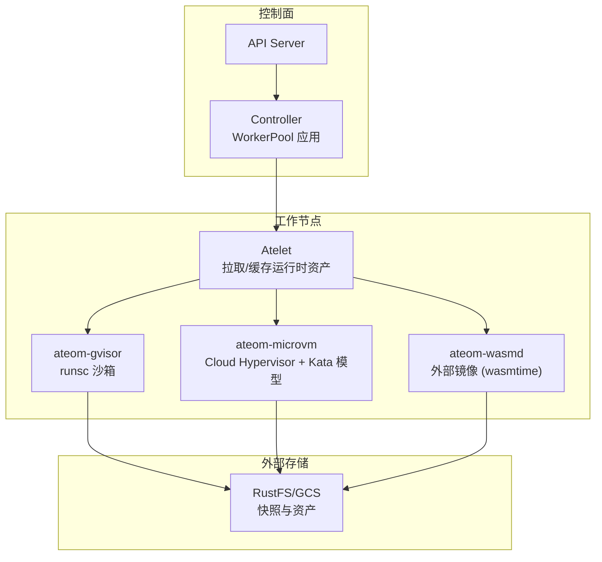
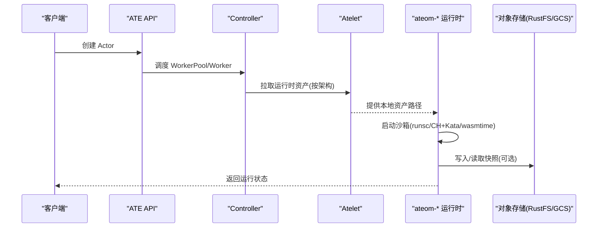
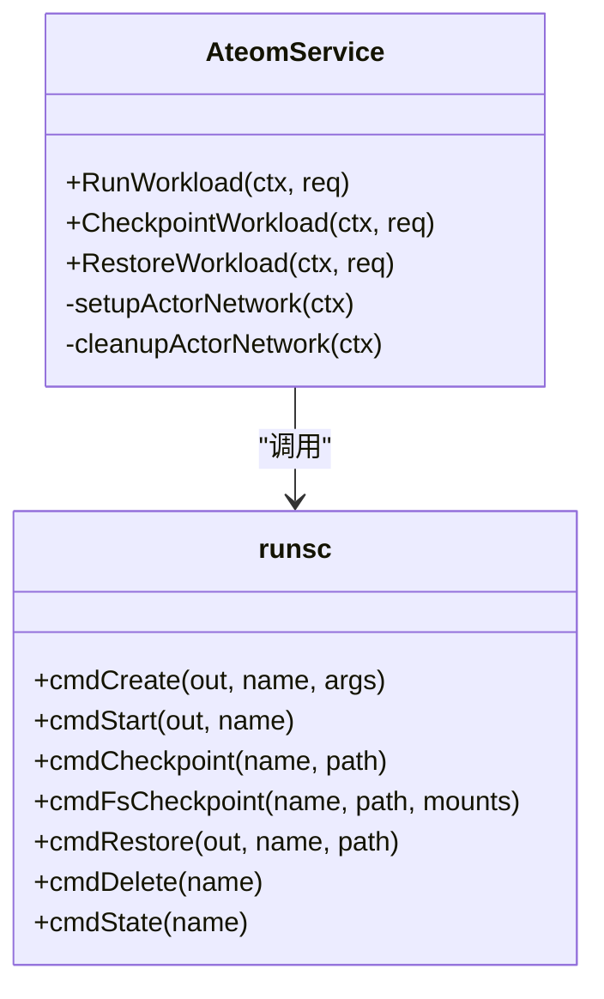
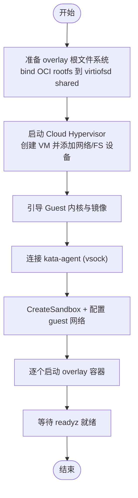
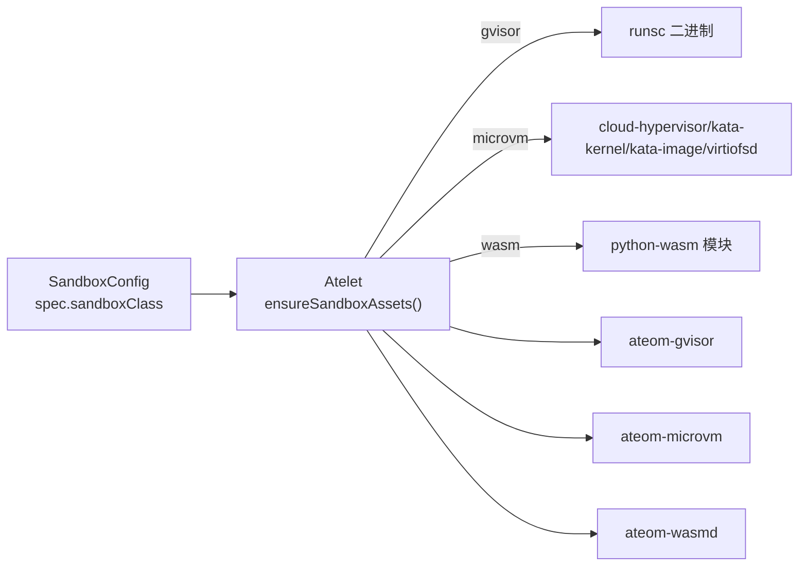

# 运行时对比分析

<cite>
**本文引用的文件列表**
- [cmd/ateom-gvisor/main.go](file://cmd/ateom-gvisor/main.go)
- [cmd/ateom-gvisor/runsc.go](file://cmd/ateom-gvisor/runsc.go)
- [cmd/ateom-microvm/main.go](file://cmd/ateom-microvm/main.go)
- [cmd/ateom-microvm/run.go](file://cmd/ateom-microvm/run.go)
- [pkg/api/v1alpha1/sandboxconfig_types.go](file://pkg/api/v1alpha1/sandboxconfig_types.go)
- [pkg/api/v1alpha1/workerpool_types.go](file://pkg/api/v1alpha1/workerpool_types.go)
- [manifests/xuanji/wasm-example.yaml](file://manifests/xuanji/wasm-example.yaml)
- [XUANJI.md](file://XUANJI.md)
- [.specify/memory/features/014.md](file://.specify/memory/features/014.md)
- [cmd/atelet/sandbox_assets.go](file://cmd/atelet/sandbox_assets.go)
- [internal/proto/ateletpb/atelet.pb.go](file://internal/proto/ateletpb/atelet.pb.go)
- [docs/architecture.md](file://docs/architecture.md)
- [hack/microvm-assets/README.md](file://hack/microvm-assets/README.md)
- [hack/run-microvm-demo.sh](file://hack/run-microvm-demo.sh)
- [cmd/atecontroller/internal/controllers/workerpool_apply.go](file://cmd/atecontroller/internal/controllers/workerpool_apply.go)
- [benchmarking/README.md](file://benchmarking/README.md)
- [demos/counter/counter.go](file://demos/counter/counter.go)
- [docs/threat-model.md](file://docs/threat-model.md)
</cite>

## 更新摘要
**所做更改**
- 新增 WebAssembly（wasm）沙箱运行时的完整对比分析章节
- 扩展架构总览，包含 ateom-wasmd 外部运行时集成
- 更新性能考量、安全特性与适用场景分析
- 增强运行时选择决策矩阵，纳入 wasm 选项
- 补充迁移指南，涵盖 wasm 与其他运行时的切换

## 目录
1. [简介](#简介)
2. [项目结构](#项目结构)
3. [核心组件](#核心组件)
4. [架构总览](#架构总览)
5. [详细组件分析](#详细组件分析)
6. [依赖关系分析](#依赖关系分析)
7. [性能考量](#性能考量)
8. [故障排查指南](#故障排查指南)
9. [结论](#结论)
10. [附录](#附录)

## 简介
本文件对 Agent Substrate 支持的三种沙箱运行时——gVisor（runsc）、MicroVM（基于 Cloud Hypervisor + Kata Containers 模型）与 WebAssembly（ateom-wasmd）进行系统性对比，涵盖架构差异、安全边界、资源开销、启动延迟、内存/CPU/I/O 表现、兼容性生态、运行时选择决策矩阵、基准测试方法、成本分析与迁移指南，并说明运行时切换机制与动态配置更新。

**更新** 新增 WebAssembly 运行时作为第三种沙箱类型，提供轻量级、高并发的工作负载执行环境。

## 项目结构
- 控制面与调度：WorkerPool 通过 SandboxConfig 指定"沙箱类"（gvisor、microvm 或 wasm），由控制器生成 Worker Pod，并在节点上运行对应的 ateom-* 运行时守护进程。
- 数据面运行时：
  - gVisor：ateom-gvisor 通过 runsc 管理容器生命周期，支持进程级快照/恢复。
  - MicroVM：ateom-microvm 直接驱动 Cloud Hypervisor，使用 Kata 模型在微 VM 中运行容器，支持内存快照与按需分页恢复。
  - WebAssembly：ateom-wasmd 作为外部镜像运行，以 wasmtime 实例执行 WASM 字节码，无需 KVM 或内核沙箱功能。
- 资产分发：atelet 负责按架构拉取并缓存运行时资产（如 runsc、cloud-hypervisor、virtiofsd、kata 镜像、python-wasm 模块等）。

**图表来源**
- [docs/architecture.md:335-341](file://docs/architecture.md#L335-L341)
- [cmd/atelet/sandbox_assets.go:91-115](file://cmd/atelet/sandbox_assets.go#L91-L115)
- [cmd/ateom-gvisor/main.go:180-237](file://cmd/ateom-gvisor/main.go#L180-L237)
- [cmd/ateom-microvm/run.go:174-368](file://cmd/ateom-microvm/run.go#L174-368)
- [manifests/xuanji/wasm-example.yaml:20-39](file://manifests/xuanji/wasm-example.yaml#L20-L39)

**章节来源**
- [docs/architecture.md:335-341](file://docs/architecture.md#L335-L341)
- [pkg/api/v1alpha1/sandboxconfig_types.go:21-35](file://pkg/api/v1alpha1/sandboxconfig_types.go#L21-L35)
- [pkg/api/v1alpha1/workerpool_types.go:70-80](file://pkg/api/v1alpha1/workerpool_types.go#L70-L80)

## 核心组件
- SandboxConfig（沙箱配置）：声明运行时家族（gvisor/microvm/wasm）、默认配置、以及按架构分发的内容寻址资产集合。
- Atelet（资产管理器）：根据 SandboxAssets 描述下载并缓存二进制/镜像，供 ateom-* 运行时使用。
- ateom-gvisor：实现 ateompb.AteomServer，调用 runsc 创建/启动/检查点/恢复容器，并维护网络命名空间与 nftables 规则。
- ateom-microvm：实现 ateompb.AteomServer，直接启动 Cloud Hypervisor，准备 virtio-fs 共享目录，建立 guest 网络并通过 kata-agent 启动 overlay rootfs 的容器。
- ateom-wasmd：外部 Rust 实现的 ateompb.AteomServer，以 wasmtime 实例执行 WASM 字节码，支持进程内隔离与快速启动。

**更新** 新增 ateom-wasmd 组件，作为 WebAssembly 运行时，提供轻量级隔离环境。

**章节来源**
- [pkg/api/v1alpha1/sandboxconfig_types.go:56-86](file://pkg/api/v1alpha1/sandboxconfig_types.go#L56-L86)
- [internal/proto/ateletpb/atelet.pb.go:396-406](file://internal/proto/ateletpb/atelet.pb.go#L396-L406)
- [cmd/atelet/sandbox_assets.go:91-115](file://cmd/atelet/sandbox_assets.go#L91-L115)
- [cmd/ateom-gvisor/main.go:157-178](file://cmd/ateom-gvisor/main.go#L157-L178)
- [cmd/ateom-microvm/main.go:184-226](file://cmd/ateom-microvm/main.go#L184-L226)
- [XUANJI.md:33-35](file://XUANJI.md#L33-L35)

## 架构总览
- 虚拟化层次与安全边界
  - gVisor：用户态内核沙箱，隔离强度高于普通容器但低于完整虚拟机；攻击面相对较小，但仍需关注 runsc 漏洞影响范围。
  - MicroVM：基于 Cloud Hypervisor 的轻量虚拟机，具备更强的隔离性；攻击面包含 VMM、guest 内核与 virtio 栈，但跨进程/跨节点逃逸难度更高。
  - WebAssembly：进程内隔离，通过 WASI 能力限制访问系统资源；隔离强度低于虚拟机但启动速度极快，适合短生命周期任务。
- 资源与启动路径
  - gVisor：无需 KVM，启动路径短，主要开销为 runsc 进程与网络命名空间/nftables 规则。
  - MicroVM：需要 /dev/kvm 与 vhost 设备，启动路径更长，涉及 VMM 启动、guest 引导、kata-agent 就绪与 overlay 根文件系统装配。
  - WebAssembly：无需 KVM 或内核沙箱功能，启动路径最短，仅需加载 WASM 模块到 wasmtime 实例。
- 快照/恢复
  - gVisor：原生进程树快照/恢复，支持仅数据卷快照与全量快照。
  - MicroVM：基于 CH 的内存快照，结合 userfaultfd 按需分页恢复；写时复制通过 guest tmpfs overlay 实现。
  - WebAssembly：当前版本仅支持 ColdBoot，不支持 Golden 快照（microvm 专属）。

**图表来源**
- [docs/architecture.md:335-341](file://docs/architecture.md#L335-L341)
- [cmd/atelet/sandbox_assets.go:91-115](file://cmd/atelet/sandbox_assets.go#L91-L115)
- [cmd/ateom-gvisor/main.go:180-237](file://cmd/ateom-gvisor/main.go#L180-L237)
- [cmd/ateom-microvm/run.go:174-368](file://cmd/ateom-microvm/run.go#L174-L368)
- [manifests/xuanji/wasm-example.yaml:56-84](file://manifests/xuanji/wasm-example.yaml#L56-L84)

## 详细组件分析

### gVisor 运行时（ateom-gvisor）
- 职责与流程
  - 监听本地 Unix Socket，暴露 ateompb.AteomServer。
  - RunWorkload：创建并启动 pause 与应用容器，等待 readyz 就绪。
  - CheckpointWorkload：对 pause 容器执行进程快照，或对数据卷执行 fscheckpoint。
  - RestoreWorkload：从快照恢复 pause 与应用容器，再次等待 readyz。
  - 网络：在 worker pod 与 gVisor 内部 netns 之间建立 veth，安装 nftables 规则实现 DNAT/Masquerade。
- 关键实现要点
  - 通过 runsc 子进程完成 create/start/checkpoint/fscheckpoint/restore/delete/state。
  - 使用独立的 interior netns 承载 actor 网络接口 eth0，配合 nftables 表隔离转发。
  - 日志与追踪集成，统一输出到 pod stdout。

**图表来源**
- [cmd/ateom-gvisor/main.go:157-178](file://cmd/ateom-gvisor/main.go#L157-L178)
- [cmd/ateom-gvisor/runsc.go:30-259](file://cmd/ateom-gvisor/runsc.go#L30-L259)

**章节来源**
- [cmd/ateom-gvisor/main.go:180-237](file://cmd/ateom-gvisor/main.go#L180-L237)
- [cmd/ateom-gvisor/main.go:239-307](file://cmd/ateom-gvisor/main.go#L239-L307)
- [cmd/ateom-gvisor/main.go:352-437](file://cmd/ateom-gvisor/main.go#L352-L437)
- [cmd/ateom-gvisor/main.go:439-521](file://cmd/ateom-gvisor/main.go#L439-L521)
- [cmd/ateom-gvisor/runsc.go:35-259](file://cmd/ateom-gvisor/runsc.go#L35-L259)

### MicroVM 运行时（ateom-microvm）
- 职责与流程
  - 监听本地 Unix Socket，暴露 ateompb.AteomServer。
  - RunWorkload：准备 overlay 根文件系统（virtio-fs lower + guest tmpfs upper），启动 Cloud Hypervisor，挂载网络 tap，引导 guest，连接 kata-agent，创建 sandbox 与每个容器的 overlay workload。
  - CheckpointWorkload：对当前 VM 做内存快照（可叠加 base-id 以维持只读基线一致性）。
  - RestoreWorkload：按需恢复 VM，重建网络与 agent 会话，继续服务。
- 关键实现要点
  - 直接驱动 CH API（不经过 kata shim），自行组装 VmConfig（CPU/内存/磁盘/FS/Vsock/Console）。
  - 通过 virtiofsd 提供只读 lower，overlay 上层为 guest tmpfs，避免宿主机磁盘写入。
  - 将宿主 resolv.conf 注入 guest 以便 DNS 解析。
  - 通过 kata-agent ttrpc 流式转发容器 stdout/stderr。

**图表来源**
- [cmd/ateom-microvm/run.go:174-368](file://cmd/ateom-microvm/run.go#L174-368)
- [cmd/ateom-microvm/run.go:449-476](file://cmd/ateom-microvm/run.go#L449-L476)
- [cmd/ateom-microvm/run.go:478-538](file://cmd/ateom-microvm/run.go#L478-L538)

**章节来源**
- [cmd/ateom-microvm/main.go:73-154](file://cmd/ateom-microvm/main.go#L73-L154)
- [cmd/ateom-microvm/run.go:174-368](file://cmd/ateom-microvm/run.go#L174-L368)
- [cmd/ateom-microvm/run.go:399-422](file://cmd/ateom-microvm/run.go#L399-L422)
- [cmd/ateom-microvm/run.go:424-441](file://cmd/ateom-microvm/run.go#L424-L441)
- [cmd/ateom-microvm/run.go:478-538](file://cmd/ateom-microvm/run.go#L478-L538)

### WebAssembly 运行时（ateom-wasmd）
- 职责与流程
  - 作为外部镜像部署，实现 ateompb.AteomServer 接口。
  - RunWorkload：加载 python-wasm 资产到 wasmtime 实例，初始化 WASI 环境，执行 Python 解释器。
  - CheckpointWorkload：当前版本不支持快照（仅支持 ColdBoot）。
  - RestoreWorkload：重新加载 WASM 模块并恢复执行上下文。
- 关键实现要点
  - 无需 KVM 或内核沙箱功能，在进程内运行 WASM 字节码。
  - 通过 WASI 能力限制文件系统、网络等系统调用。
  - 资产约定：必须提供 `python-wasm` 资产（CPython 解释器 wasm 模块）。
  - 非特权运行，复用 gvisor 分支的安全上下文。

**更新** 新增 WebAssembly 运行时分析，提供轻量级隔离与快速启动能力。

**章节来源**
- [XUANJI.md:33-39](file://XUANJI.md#L33-L39)
- [manifests/xuanji/wasm-example.yaml:20-39](file://manifests/xuanji/wasm-example.yaml#L20-L39)
- [manifests/xuanji/wasm-example.yaml:56-84](file://manifests/xuanji/wasm-example.yaml#L56-L84)
- [.specify/memory/features/014.md:12-17](file://.specify/memory/features/014.md#L12-L17)

## 依赖关系分析
- 运行时选择与约束
  - SandboxClass 枚举定义 gvisor、microvm 与 wasm 三类。
  - microvm 需要 /dev/kvm 与 vhost 设备，控制器会为 microvm 工作节点打上标签并挂载设备。
  - wasm 无需特殊硬件要求，可在任意 Linux 节点运行。
- 资产分发
  - SandboxAssets 按架构映射到具体资产名：gVisor 期望 "runsc"；microvm 期望 cloud-hypervisor、kata-kernel、kata-image、virtiofsd 等；wasm 期望 "python-wasm"。
  - Atelet 确保这些资产被下载到本地缓存并按需传递给 ateom-*。

**图表来源**
- [pkg/api/v1alpha1/sandboxconfig_types.go:21-35](file://pkg/api/v1alpha1/sandboxconfig_types.go#L21-L35)
- [internal/proto/ateletpb/atelet.pb.go:396-406](file://internal/proto/ateletpb/atelet.pb.go#L396-L406)
- [cmd/atelet/sandbox_assets.go:91-115](file://cmd/atelet/sandbox_assets.go#L91-L115)
- [cmd/atecontroller/internal/controllers/workerpool_apply.go:103-130](file://cmd/atecontroller/internal/controllers/workerpool_apply.go#L103-130)
- [manifests/xuanji/wasm-example.yaml:30-38](file://manifests/xuanji/wasm-example.yaml#L30-L38)

**章节来源**
- [pkg/api/v1alpha1/sandboxconfig_types.go:56-86](file://pkg/api/v1alpha1/sandboxconfig_types.go#L56-L86)
- [pkg/api/v1alpha1/workerpool_types.go:70-80](file://pkg/api/v1alpha1/workerpool_types.go#L70-L80)
- [cmd/atecontroller/internal/controllers/workerpool_apply.go:103-130](file://cmd/atecontroller/internal/controllers/workerpool_apply.go#L103-130)

## 性能考量
- 启动延迟
  - gVisor：路径较短，无 guest 引导，通常更快冷启动。
  - MicroVM：需要 VMM 启动、guest 引导、agent 就绪与 overlay 装配，冷启动更慢；热恢复可通过内存快照显著缩短。
  - WebAssembly：启动路径最短，仅需加载 WASM 模块到 wasmtime 实例，适合极高并发短任务。
- 内存占用
  - gVisor：额外开销主要为 runsc 与内核态模拟层，整体较低。
  - MicroVM：需要分配 guest 内存与 VMM 开销，且 virtiofsd 常驻；但写路径走 guest tmpfs，减少宿主机 IO 压力。
  - WebAssembly：内存占用最低，仅在进程内维护 WASM 实例状态。
- CPU 使用率
  - gVisor：系统调用拦截与用户态内核存在一定开销，但总体接近容器。
  - MicroVM：VMM 与 virtio 栈带来额外开销，但在高隔离需求场景下可接受。
  - WebAssembly：WASI 能力检查与字节码解释开销最小，CPU 效率最高。
- I/O 性能
  - gVisor：直接访问宿主文件系统，I/O 路径短。
  - MicroVM：通过 virtio-fs 访问只读 lower，写操作在 guest tmpfs，适合读多写少或写后落盘策略。
  - WebAssembly：通过 WASI 文件系统接口访问，性能取决于底层实现。
- 快照/恢复
  - gVisor：进程快照大小与恢复时间取决于进程集与内存页；支持仅数据卷快照。
  - MicroVM：内存快照体积较大，但借助按需分页可在不同节点快速恢复。
  - WebAssembly：当前版本仅支持 ColdBoot，不支持 Golden 快照。

**更新** 新增 WebAssembly 运行时的性能特征分析。

## 故障排查指南
- 常见错误定位
  - gVisor：检查 runsc 子进程日志、nftables 规则是否生效、interior netns 接口与路由是否正确。
  - MicroVM：检查 CH 进程与 serial.log、kata-agent vsock 是否就绪、virtiofsd 共享目录是否挂载成功、guest 网络配置与 ARP 项。
  - WebAssembly：检查 python-wasm 资产完整性、wasmtimed 进程状态、WASI 权限配置。
- 验证工具与脚本
  - 使用 demo 计数器应用 /readyz 端点确认服务就绪。
  - 使用 benchmarking 套件与 Locust UI 发起负载测试，观察端到端延迟与吞吐。
  - 使用 hack/run-microvm-demo.sh 编排 microvm 资产构建与部署，辅助复现问题。

**更新** 新增 WebAssembly 运行时的故障排查指导。

**章节来源**
- [demos/counter/counter.go:64-102](file://demos/counter/counter.go#L64-L102)
- [benchmarking/README.md:1-90](file://benchmarking/README.md#L1-L90)
- [hack/run-microvm-demo.sh:80-118](file://hack/run-microvm-demo.sh#L80-L118)
- [XUANJI.md:33-39](file://XUANJI.md#L33-L39)

## 结论
- 若追求低延迟、低资源开销与简单运维，优先选择 gVisor。
- 若强调强隔离、合规性与跨节点弹性恢复，MicroVM 更具优势。
- 若需要极致启动速度与高并发处理能力，WebAssembly 是最佳选择。
- 三者均通过 SandboxConfig 与 Atelet 解耦了运行时选择与资产分发，便于在生产环境平滑切换与灰度升级。

**更新** 新增 WebAssembly 运行时的结论建议。

## 附录

### 安全性特征对比
- 隔离强度
  - gVisor：用户态内核沙箱，隔离优于容器，弱于虚拟机。
  - MicroVM：完整虚拟机隔离，更强。
  - WebAssembly：进程内隔离，通过 WASI 能力限制，隔离强度适中。
- 攻击面与漏洞影响
  - gVisor：runsc 漏洞可能影响同节点其他进程；建议最小权限与网络/文件系统策略限制。
  - MicroVM：VMM/guest 内核漏洞影响范围限于该 VM；跨 VM 逃逸更难。
  - WebAssembly：WASM 运行时漏洞影响范围限于单个进程；WASI 限制进一步缩小攻击面。
- 威胁建模参考
  - 参见威胁模型文档中的攻击向量与缓解措施。

**更新** 新增 WebAssembly 运行时的安全特性分析。

**章节来源**
- [docs/threat-model.md:93-117](file://docs/threat-model.md#L93-L117)
- [XUANJI.md:33-39](file://XUANJI.md#L33-L39)

### 兼容性与生态系统支持
- 操作系统与硬件要求
  - gVisor：Linux 内核，无需 KVM。
  - MicroVM：Linux 内核，需要 /dev/kvm 与 vhost 设备；控制器会挂载设备并打标签。
  - WebAssembly：任意 Linux 内核，无需特殊硬件要求。
- 第三方工具链
  - gVisor：runsc 二进制，OCI bundle 标准。
  - MicroVM：Cloud Hypervisor、virtiofsd、Kata 镜像与配置。
  - WebAssembly：wasmtime 运行时、WASI 标准、python-wasm 模块。
- 演示与部署
  - 使用 hack/microvm-assets/README.md 指引构建与上传 microvm 资产。
  - 使用 demos/counter 验证跨节点恢复连续性。
  - 使用 manifests/xuanji/wasm-example.yaml 部署 wasm 工作负载。

**更新** 新增 WebAssembly 运行时的兼容性说明。

**章节来源**
- [cmd/atecontroller/internal/controllers/workerpool_apply.go:103-130](file://cmd/atecontroller/internal/controllers/workerpool_apply.go#L103-130)
- [hack/microvm-assets/README.md:26-56](file://hack/microvm-assets/README.md#L26-L56)
- [demos/counter/README.md:104-116](file://demos/counter/README.md#L104-L116)
- [manifests/xuanji/wasm-example.yaml:20-84](file://manifests/xuanji/wasm-example.yaml#L20-L84)

### 运行时选择决策矩阵
- 工作负载类型
  - 高吞吐、低延迟、IO 密集：gVisor 更合适。
  - 强隔离、合规敏感、跨节点弹性：MicroVM 更合适。
  - 超高并发、短生命周期、计算密集型：WebAssembly 更合适。
- 性能要求
  - 冷启动敏感：WebAssembly > gVisor > MicroVM。
  - 热恢复敏感：MicroVM（内存快照 + 按需分页）> gVisor > WebAssembly（仅 ColdBoot）。
- 合规性考虑
  - 需要强隔离与审计：MicroVM。
  - 可接受用户态内核隔离：gVisor。
  - 可接受进程内隔离：WebAssembly。

**更新** 新增 WebAssembly 运行时的决策建议。

### 基准测试结果与成本分析
- 基准套件
  - 使用 benchmarking/README.md 提供的 Locust 工作负载与监控面板进行压测。
- 成本因素
  - gVisor：更低资源开销，单位节点可容纳更多实例。
  - MicroVM：更高的内存与 CPU 开销，但提供更强的隔离与合规保障。
  - WebAssembly：最低资源开销，单位节点可容纳大量并发实例，但功能受限。

**更新** 新增 WebAssembly 运行时的成本分析。

**章节来源**
- [benchmarking/README.md:1-90](file://benchmarking/README.md#L1-L90)
- [XUANJI.md:33-39](file://XUANJI.md#L33-L39)

### 迁移指南
- 从 gVisor 迁移到 MicroVM
  - 准备 microvm 资产（cloud-hypervisor、virtiofsd、kata-kernel、kata-image、kata-config），按架构构建并上传至 rustfs/GCS。
  - 在 SandboxConfig 中声明 microvm 类与对应资产，确保校验策略通过。
  - 调整 WorkerPool 调度至带 KVM 标签的节点，控制器会自动挂载 /dev/kvm。
  - 逐步切流验证：先小流量，再扩大比例，观察启动延迟、内存/CPU 与 I/O 指标。
- 从 MicroVM 迁移到 gVisor
  - 在 SandboxConfig 中切换为 gvisor 类并确保 runsc 资产可用。
  - 重新部署 WorkerPool，验证 readyz 与业务逻辑。
  - 清理不再使用的 microvm 资产与节点标签。
- 迁移到 WebAssembly
  - 准备 python-wasm 资产（CPython 解释器 wasm 模块），上传至对象存储。
  - 在 SandboxConfig 中声明 wasm 类与 python-wasm 资产。
  - 部署 ateom-wasmd 镜像到 WorkerPool。
  - 验证 WASI 权限配置与业务逻辑兼容性。

**更新** 新增 WebAssembly 运行时的迁移指导。

**章节来源**
- [pkg/api/v1alpha1/sandboxconfig_types.go:56-86](file://pkg/api/v1alpha1/sandboxconfig_types.go#L56-L86)
- [pkg/api/v1alpha1/workerpool_types.go:70-80](file://pkg/api/v1alpha1/workerpool_types.go#L70-L80)
- [manifests/xuanji/wasm-example.yaml:20-84](file://manifests/xuanji/wasm-example.yaml#L20-L84)
- [XUANJI.md:33-39](file://XUANJI.md#L33-L39)

### 运行时切换机制与动态配置更新
- 运行时切换
  - 通过修改 SandboxConfig 的 spec.sandboxClass 与 assets，触发 WorkerPool 重新拉起对应 ateom-* 运行时。
  - Atelet 根据新的 SandboxAssets 拉取并缓存所需资产，确保新运行时可用。
- 动态配置更新
  - 网络与路由：gVisor 通过 nftables 表管理转发规则；MicroVM 通过 kata-agent 配置 guest 网络；WebAssembly 通过 WASI 文件系统接口。
  - 日志与追踪：三个运行时均集成 OpenTelemetry 与结构化日志，便于观测。
  - 快照与恢复：gVisor 支持 DATA/FULL 范围快照；MicroVM 支持内存快照与 base-id 链式恢复；WebAssembly 仅支持 ColdBoot。

**更新** 新增 WebAssembly 运行时的切换机制说明。

**章节来源**
- [internal/proto/ateletpb/atelet.pb.go:396-406](file://internal/proto/ateletpb/atelet.pb.go#L396-L406)
- [cmd/atelet/sandbox_assets.go:91-115](file://cmd/atelet/sandbox_assets.go#L91-L115)
- [cmd/ateom-gvisor/main.go:439-521](file://cmd/ateom-gvisor/main.go#L439-L521)
- [cmd/ateom-microvm/run.go:478-538](file://cmd/ateom-microvm/run.go#L478-L538)
- [XUANJI.md:33-39](file://XUANJI.md#L33-L39)