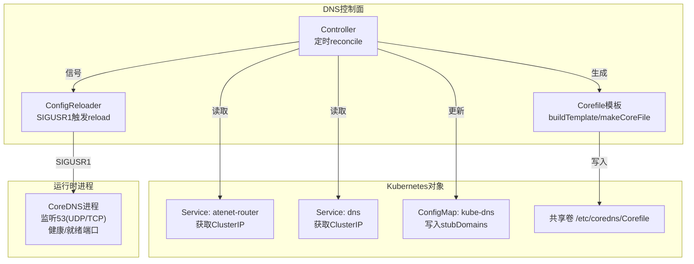
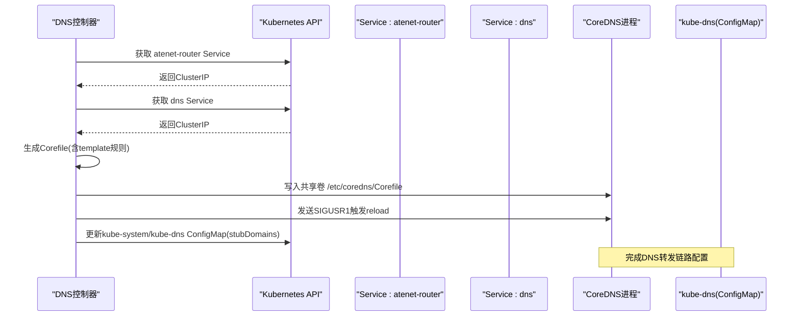
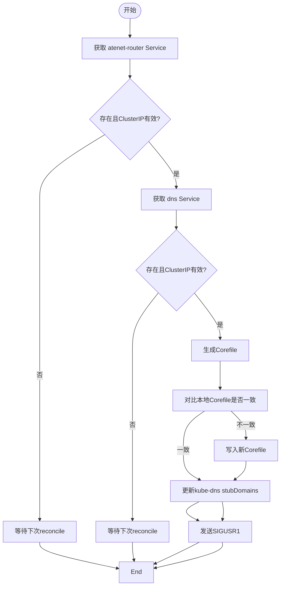
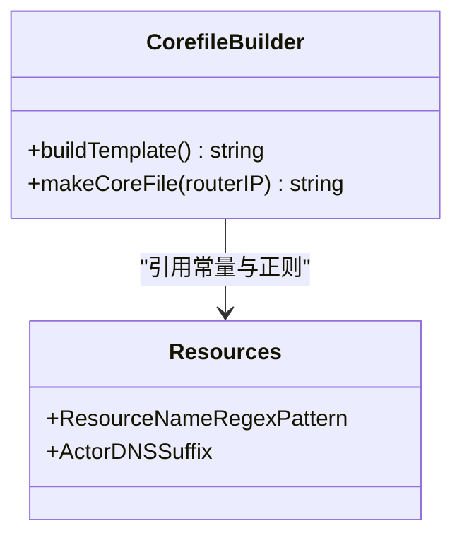
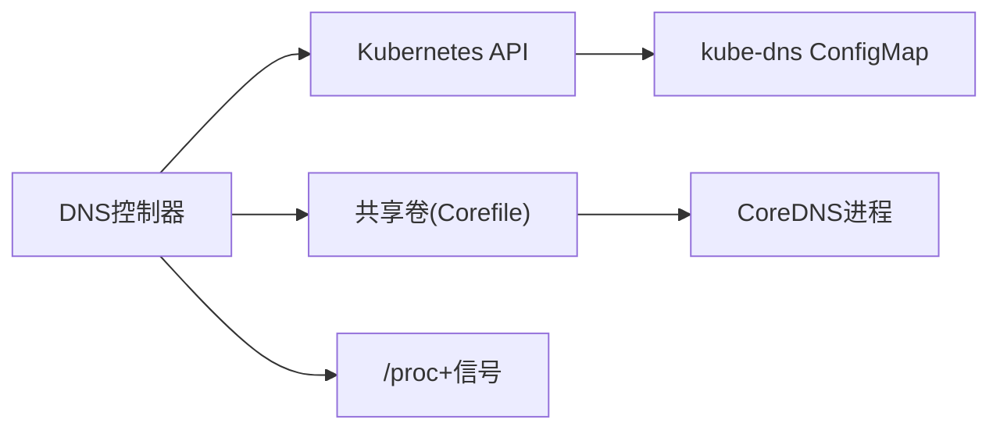
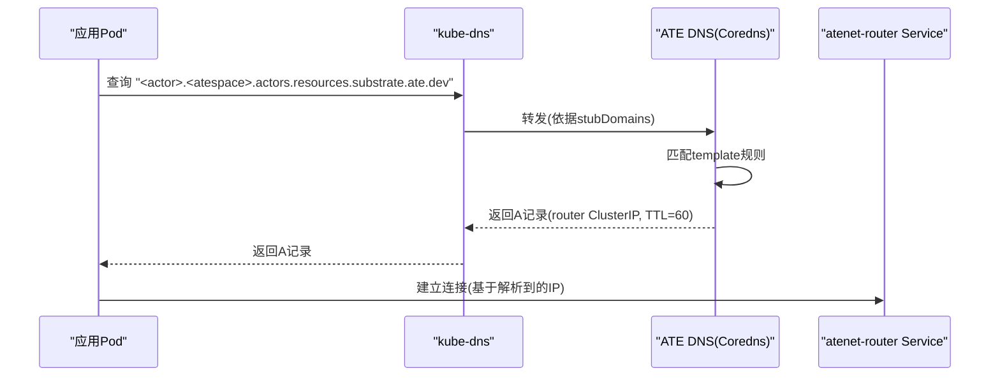

# DNS服务

<cite>
**本文引用的文件列表**
- [cmd/atenet/internal/dns/README.md](file://cmd/atenet/internal/dns/README.md)
- [cmd/atenet/internal/dns/corefile.go](file://cmd/atenet/internal/dns/corefile.go)
- [cmd/atenet/internal/dns/corefile_test.go](file://cmd/atenet/internal/dns/corefile_test.go)
- [cmd/atenet/internal/dns/dns.go](file://cmd/atenet/internal/dns/dns.go)
- [internal/resources/actor.go](file://internal/resources/actor.go)
- [manifests/ate-install/atenet-dns.yaml](file://manifests/ate-install/atenet-dns.yaml)
</cite>

## 目录
1. [简介](#简介)
2. [项目结构](#项目结构)
3. [核心组件](#核心组件)
4. [架构总览](#架构总览)
5. [详细组件分析](#详细组件分析)
6. [依赖关系分析](#依赖关系分析)
7. [性能与缓存策略](#性能与缓存策略)
8. [配置选项与调优](#配置选项与调优)
9. [故障排查指南](#故障排查指南)
10. [结论](#结论)
11. [附录：DNS查询流程图与示例](#附录dns查询流程图与示例)

## 简介
本章节介绍 atenet 中 DNS 服务的实现原理与配置管理。该服务通过一个控制器动态生成并下发 CoreDNS 的 Corefile，将 Actor 域名解析到路由服务地址；同时更新集群 kube-dns 的 stubDomains，使自定义后缀的解析指向 ATE 的 DNS 服务。其目标是让形如 <actor-name>.<atespace>.actors.resources.substrate.ate.dev 的域名统一解析到 atenet-router 的 ClusterIP，从而为 Actor 提供稳定的内部访问入口。

## 项目结构
DNS 相关代码位于 cmd/atenet/internal/dns 目录下，包含控制器主逻辑、Corefile 模板生成、以及说明文档；资源命名与域名后缀常量定义在 internal/resources/actor.go；Kubernetes 部署清单在 manifests/ate-install/atenet-dns.yaml。

图表来源
- [cmd/atenet/internal/dns/dns.go:51-117](file://cmd/atenet/internal/dns/dns.go#L51-L117)
- [cmd/atenet/internal/dns/corefile.go:32-64](file://cmd/atenet/internal/dns/corefile.go#L32-L64)
- [manifests/ate-install/atenet-dns.yaml:112-131](file://manifests/ate-install/atenet-dns.yaml#L112-L131)

章节来源
- [cmd/atenet/internal/dns/README.md:1-37](file://cmd/atenet/internal/dns/README.md#L1-L37)
- [cmd/atenet/internal/dns/dns.go:51-117](file://cmd/atenet/internal/dns/dns.go#L51-L117)
- [cmd/atenet/internal/dns/corefile.go:32-64](file://cmd/atenet/internal/dns/corefile.go#L32-L64)
- [manifests/ate-install/atenet-dns.yaml:112-131](file://manifests/ate-install/atenet-dns.yaml#L112-L131)

## 核心组件
- Controller：周期性 reconcile，负责获取 atenet-router 与 dns 服务的 ClusterIP，生成 Corefile 并写入共享卷，必要时向 CoreDNS 进程发送 reload 信号；同时更新 kube-system/kube-dns ConfigMap 的 stubDomains，将自定义后缀解析到 dns 服务 IP。
- Corefile 模板：根据 ActorDNSSuffix 与资源名正则模式，动态构建 template IN A 规则，匹配 <actor>.<atespace>.actors.resources.substrate.ate.dev 的 A 记录请求，返回固定答案（TTL=60）。
- ConfigReloader：通过扫描 /proc 找到 coredns 进程 PID，并向其发送 SIGUSR1 以触发热重载。

章节来源
- [cmd/atenet/internal/dns/dns.go:43-69](file://cmd/atenet/internal/dns/dns.go#L43-L69)
- [cmd/atenet/internal/dns/dns.go:119-141](file://cmd/atenet/internal/dns/dns.go#L119-L141)
- [cmd/atenet/internal/dns/dns.go:192-221](file://cmd/atenet/internal/dns/dns.go#L192-L221)
- [cmd/atenet/internal/dns/corefile.go:32-64](file://cmd/atenet/internal/dns/corefile.go#L32-L64)

## 架构总览
下图展示了 DNS 控制器、CoreDNS、kube-dns 与 Kubernetes Service 之间的交互关系。

图表来源
- [cmd/atenet/internal/dns/dns.go:71-117](file://cmd/atenet/internal/dns/dns.go#L71-L117)
- [cmd/atenet/internal/dns/dns.go:119-141](file://cmd/atenet/internal/dns/dns.go#L119-L141)
- [cmd/atenet/internal/dns/dns.go:144-189](file://cmd/atenet/internal/dns/dns.go#L144-L189)
- [manifests/ate-install/atenet-dns.yaml:112-131](file://manifests/ate-install/atenet-dns.yaml#L112-L131)

## 详细组件分析

### DNS控制器（Controller）
- 启动与调度：Run 方法使用定时器周期执行 reconcile。
- 关键步骤：
  - 获取 atenet-router 的 ClusterIP，若未就绪则跳过等待。
  - 获取 dns 服务的 ClusterIP，若未就绪则跳过等待。
  - 生成期望的 Corefile 并与本地共享卷中的内容比较，仅在变更时覆盖写入。
  - 调用 Reloader.Reload 向 coredns 进程发送 SIGUSR1 触发热重载。
  - 更新 kube-system/kube-dns ConfigMap 的 stubDomains，将 actors.resources.substrate.ate.dev 指向 dns 服务 IP。
- 错误处理：对缺失对象或无 ClusterIP 的情况采用警告日志并跳过；其他错误直接返回以便上层重试。

图表来源
- [cmd/atenet/internal/dns/dns.go:71-117](file://cmd/atenet/internal/dns/dns.go#L71-L117)
- [cmd/atenet/internal/dns/dns.go:119-141](file://cmd/atenet/internal/dns/dns.go#L119-L141)
- [cmd/atenet/internal/dns/dns.go:144-189](file://cmd/atenet/internal/dns/dns.go#L144-L189)

章节来源
- [cmd/atenet/internal/dns/dns.go:51-69](file://cmd/atenet/internal/dns/dns.go#L51-L69)
- [cmd/atenet/internal/dns/dns.go:71-117](file://cmd/atenet/internal/dns/dns.go#L71-L117)
- [cmd/atenet/internal/dns/dns.go:119-141](file://cmd/atenet/internal/dns/dns.go#L119-L141)
- [cmd/atenet/internal/dns/dns.go:144-189](file://cmd/atenet/internal/dns/dns.go#L144-L189)

### Corefile 模板与动态规则
- 模板构建：
  - 启用插件：log、errors、health :8080、ready :8181、reload。
  - 监听域：actors.resources.substrate.ate.dev:53。
  - 规则：template IN A actors.resources.substrate.ate.dev { match ...; answer "{{ .Name }} 60 IN A <routerIP>" }。
- 匹配模式：
  - 使用 ResourceNameRegexPattern 构造 actor 与 atespace 的正则，确保符合 DNS-1123 标签规范。
  - 最终匹配 FQDN 形式：<actor>.<atespace>.actors.resources.substrate.ate.dev.
- 响应行为：
  - 对所有匹配的 A 记录请求返回 router 的 ClusterIP，TTL=60。
- 测试验证：corefile_test.go 校验生成的 Corefile 片段包含预期关键字段。

图表来源
- [cmd/atenet/internal/dns/corefile.go:32-64](file://cmd/atenet/internal/dns/corefile.go#L32-L64)
- [internal/resources/actor.go:22-32](file://internal/resources/actor.go#L22-L32)

章节来源
- [cmd/atenet/internal/dns/corefile.go:32-64](file://cmd/atenet/internal/dns/corefile.go#L32-L64)
- [cmd/atenet/internal/dns/corefile_test.go:24-65](file://cmd/atenet/internal/dns/corefile_test.go#L24-L65)
- [internal/resources/actor.go:22-32](file://internal/resources/actor.go#L22-L32)

### 配置热重载（ConfigReloader）
- 实现方式：
  - 遍历 /proc 子目录，读取 comm 字段定位 coredns 进程 PID。
  - 使用 os.FindProcess 获取进程句柄，发送 syscall.SIGUSR1 触发 CoreDNS 热重载。
- 健壮性：
  - 找不到进程时记录错误但不中断流程。
  - 发送失败时返回错误供上层处理。

章节来源
- [cmd/atenet/internal/dns/dns.go:192-221](file://cmd/atenet/internal/dns/dns.go#L192-L221)
- [cmd/atenet/internal/dns/dns.go:223-252](file://cmd/atenet/internal/dns/dns.go#L223-L252)

### 集群集成与 kube-dns 注入
- 目标：在 kube-system/kube-dns ConfigMap 的 stubDomains 中写入 actors.resources.substrate.ate.dev -> dns 服务 IP，使集群内所有 Pod 对该后缀的解析都走 ATE 的 DNS 服务。
- 行为：
  - 若不存在 ConfigMap 则跳过（兼容非 GKE 环境）。
  - 若已存在且值一致则跳过。
  - 否则序列化新的 JSON 并更新。

章节来源
- [cmd/atenet/internal/dns/dns.go:144-189](file://cmd/atenet/internal/dns/dns.go#L144-L189)

### 部署与监听端口
- 部署清单：
  - Deployment: ate-system/dns，包含 initContainer 初始化 Corefile，容器运行 coredns/coredns:1.11.1。
  - 共享卷挂载 /etc/coredns，由控制器写入 Corefile。
  - 暴露端口 53 UDP/TCP，健康检查 :8080，就绪检查 :8181。
- 协议支持：
  - 同时监听 UDP 与 TCP 53 端口，满足标准 DNS 客户端与服务端需求。

章节来源
- [manifests/ate-install/atenet-dns.yaml:74-131](file://manifests/ate-install/atenet-dns.yaml#L74-L131)
- [cmd/atenet/internal/dns/README.md:17-31](file://cmd/atenet/internal/dns/README.md#L17-L31)

## 依赖关系分析
- 控制器依赖：
  - Kubernetes client：读取 Service、更新 ConfigMap。
  - 文件系统：读写共享卷 Corefile。
  - 操作系统：/proc 枚举进程、发送信号。
- 外部依赖：
  - CoreDNS：作为实际 DNS 服务器，遵循 Corefile 配置。
  - kube-dns：通过 stubDomains 将自定义后缀转发至 ATE DNS。

图表来源
- [cmd/atenet/internal/dns/dns.go:71-117](file://cmd/atenet/internal/dns/dns.go#L71-L117)
- [cmd/atenet/internal/dns/dns.go:119-141](file://cmd/atenet/internal/dns/dns.go#L119-L141)
- [cmd/atenet/internal/dns/dns.go:144-189](file://cmd/atenet/internal/dns/dns.go#L144-L189)
- [cmd/atenet/internal/dns/dns.go:223-252](file://cmd/atenet/internal/dns/dns.go#L223-L252)

章节来源
- [cmd/atenet/internal/dns/dns.go:71-117](file://cmd/atenet/internal/dns/dns.go#L71-L117)
- [cmd/atenet/internal/dns/dns.go:119-141](file://cmd/atenet/internal/dns/dns.go#L119-L141)
- [cmd/atenet/internal/dns/dns.go:144-189](file://cmd/atenet/internal/dns/dns.go#L144-L189)
- [cmd/atenet/internal/dns/dns.go:223-252](file://cmd/atenet/internal/dns/dns.go#L223-L252)

## 性能与缓存策略
- 控制器侧：
  - 使用定时器轮询，避免频繁 API 调用；仅在 Corefile 内容变化时写入与 reload。
  - 对缺失对象或无 ClusterIP 的场景采用“跳过等待”策略，减少无效重试。
- CoreDNS 侧：
  - 模板规则 TTL=60，平衡了稳定性与变更时效。
  - 启用 health/ready 探针，便于编排层进行可用性判断。
- kube-dns 侧：
  - 通过 stubDomains 将特定后缀解析集中到 ATE DNS，降低上游解析压力。

[本节为通用指导，不直接分析具体文件]

## 配置选项与调优
- 控制器参数：
  - Interval：reconcile 间隔，影响配置同步延迟与 API 负载。
  - CorefilePath：共享卷路径，需与部署清单一致。
  - Reloader：热重载实现，默认基于 SIGUSR1。
- CoreDNS 插件：
  - log/errors：基础日志与错误统计。
  - health :8080、ready :8181：健康与就绪探测。
  - reload：允许热重载。
- 端口与协议：
  - 53 UDP/TCP：标准 DNS 端口。
- 调优建议：
  - 合理设置 Interval，兼顾实时性与开销。
  - 监控 CoreDNS 的日志与指标，关注 match 命中与 answer 数量。
  - 观察 kube-dns 的 stubDomains 变更频率，避免频繁更新导致抖动。

章节来源
- [cmd/atenet/internal/dns/dns.go:43-48](file://cmd/atenet/internal/dns/dns.go#L43-L48)
- [cmd/atenet/internal/dns/corefile.go:32-64](file://cmd/atenet/internal/dns/corefile.go#L32-L64)
- [manifests/ate-install/atenet-dns.yaml:112-131](file://manifests/ate-install/atenet-dns.yaml#L112-L131)

## 故障排查指南
- 常见问题与定位：
  - atenet-router Service 未就绪：控制器会记录警告并跳过，待其分配 ClusterIP 后自动继续。
  - dns Service 未就绪：同上，等待后再重试。
  - Corefile 未生效：检查共享卷路径是否正确、权限是否为 0644；确认 CoreDNS 是否收到 SIGUSR1。
  - kube-dns 未更新：确认 kube-system/kube-dns ConfigMap 是否存在与可写权限；查看 stubDomains 是否被覆盖。
- 诊断手段：
  - 查看控制器日志，关注 “Error during DNS reconciliation”、“CoreDNS Corefile updated”、“Successfully signaled reload” 等关键信息。
  - 检查 CoreDNS 健康与就绪端口（:8080/:8181）是否可达。
  - 在 Pod 内执行 nslookup dig 验证解析结果与 TTL。

章节来源
- [cmd/atenet/internal/dns/dns.go:71-117](file://cmd/atenet/internal/dns/dns.go#L71-L117)
- [cmd/atenet/internal/dns/dns.go:119-141](file://cmd/atenet/internal/dns/dns.go#L119-L141)
- [cmd/atenet/internal/dns/dns.go:144-189](file://cmd/atenet/internal/dns/dns.go#L144-L189)

## 结论
atenet 的 DNS 服务通过控制器动态生成 Corefile 并注入 kube-dns 的 stubDomains，实现了 Actor 域名的集中解析与稳定路由。其设计简洁可靠，具备热重载能力与完善的健康检查，适合在生产环境中稳定运行。

[本节为总结，不直接分析具体文件]

## 附录：DNS查询流程图与示例

### 完整解析流程

图表来源
- [cmd/atenet/internal/dns/dns.go:144-189](file://cmd/atenet/internal/dns/dns.go#L144-L189)
- [cmd/atenet/internal/dns/corefile.go:32-64](file://cmd/atenet/internal/dns/corefile.go#L32-L64)
- [manifests/ate-install/atenet-dns.yaml:112-131](file://manifests/ate-install/atenet-dns.yaml#L112-L131)

### 配置示例要点
- Corefile 模板包含：
  - 监听域：actors.resources.substrate.ate.dev:53
  - 规则：template IN A ... { match ...; answer "{{ .Name }} 60 IN A <routerIP>" }
- kube-dns stubDomains：
  - actors.resources.substrate.ate.dev -> dns 服务 IP

章节来源
- [cmd/atenet/internal/dns/corefile.go:32-64](file://cmd/atenet/internal/dns/corefile.go#L32-L64)
- [cmd/atenet/internal/dns/dns.go:144-189](file://cmd/atenet/internal/dns/dns.go#L144-L189)
- [cmd/atenet/internal/dns/README.md:23-31](file://cmd/atenet/internal/dns/README.md#L23-L31)
