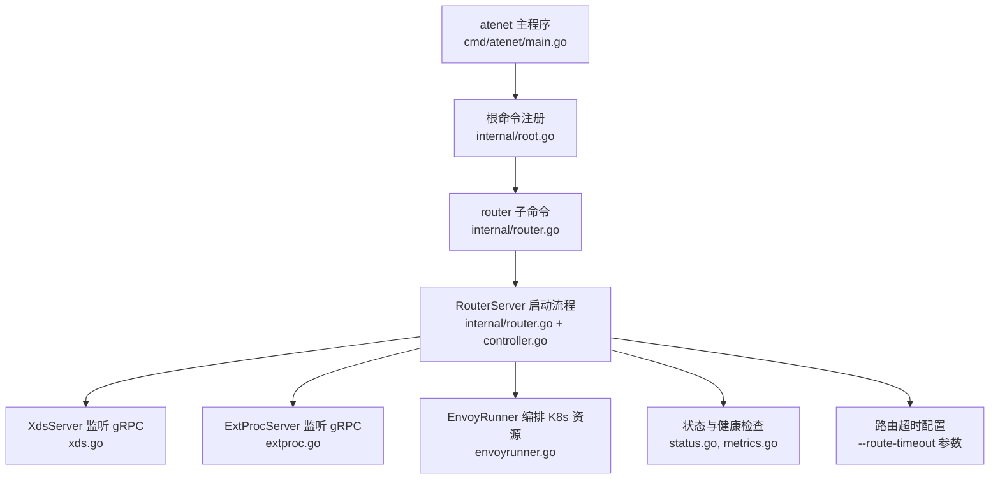
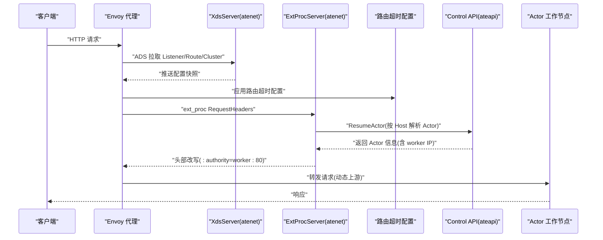
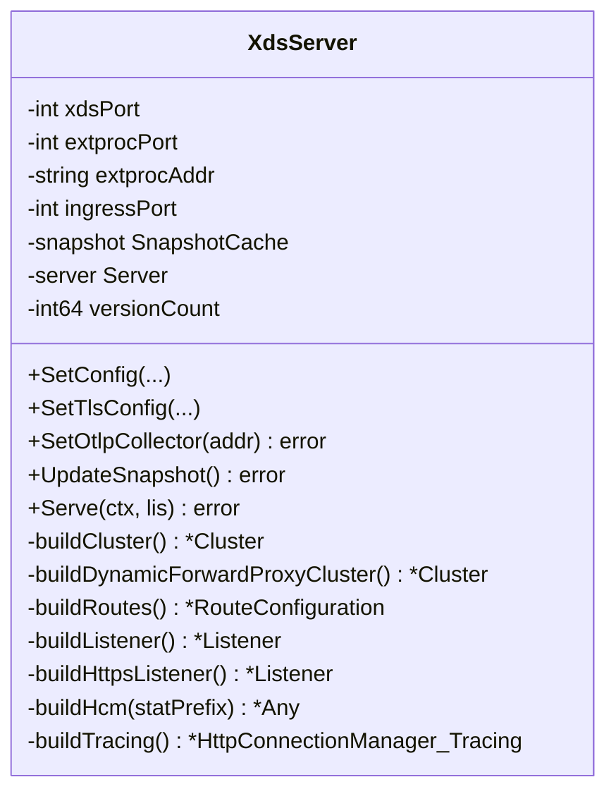
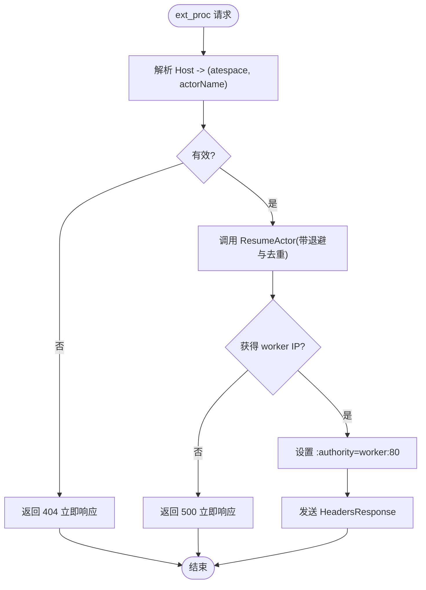
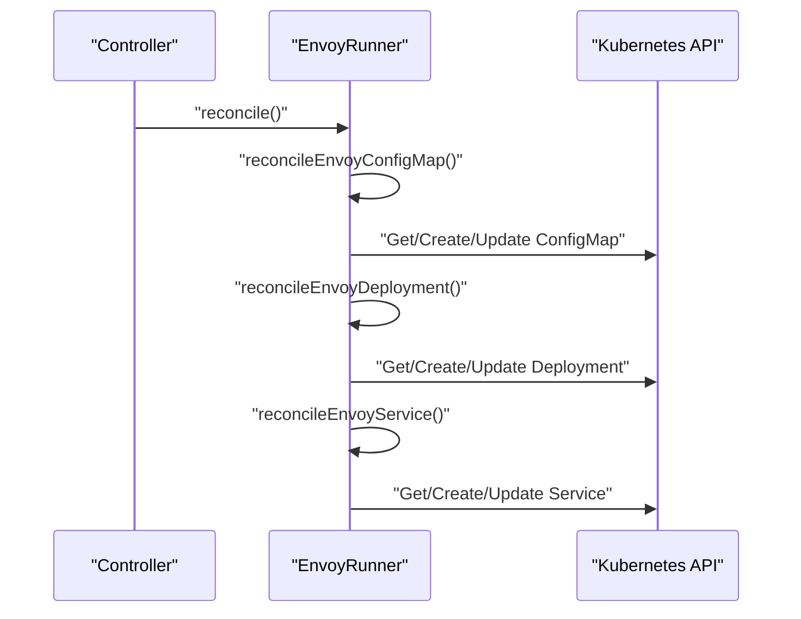
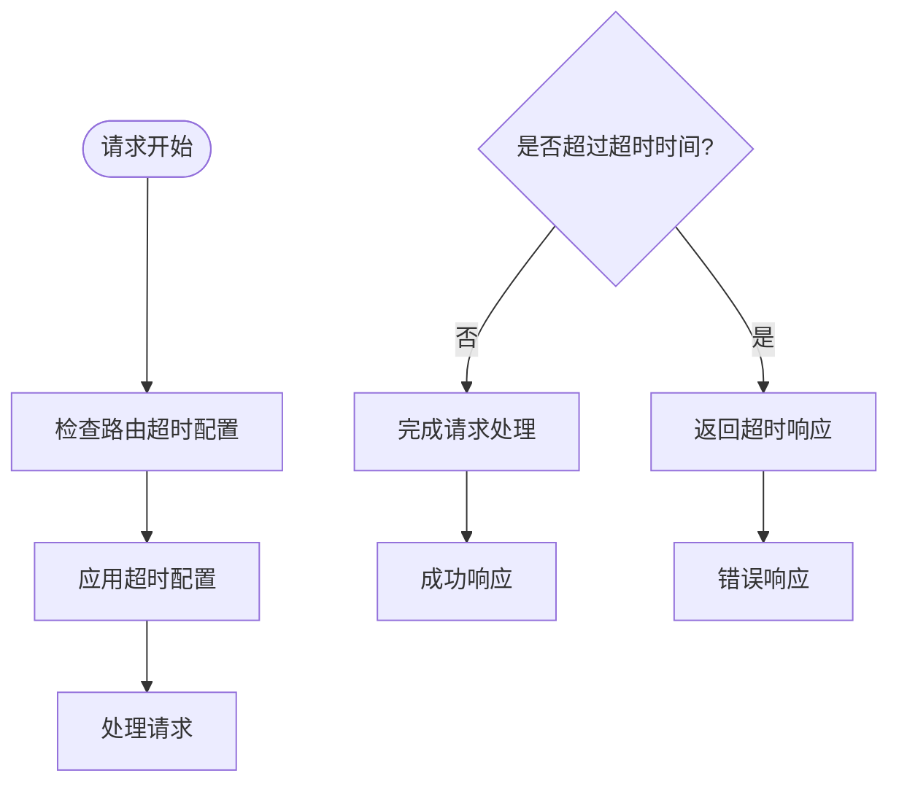
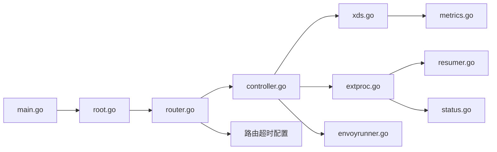

# Envoy代理集成

<cite>
**本文引用的文件**
- [cmd/atenet/main.go](file://cmd/atenet/main.go)
- [cmd/atenet/internal/root.go](file://cmd/atenet/internal/root.go)
- [cmd/atenet/internal/router.go](file://cmd/atenet/internal/router.go)
- [cmd/atenet/internal/dns.go](file://cmd/atenet/internal/dns.go)
- [cmd/atenet/internal/router/controller.go](file://cmd/atenet/internal/router/controller.go)
- [cmd/atenet/internal/router/envoyrunner.go](file://cmd/atenet/internal/router/envoyrunner.go)
- [cmd/atenet/internal/router/xds.go](file://cmd/atenet/internal/router/xds.go)
- [cmd/atenet/internal/router/extproc.go](file://cmd/atenet/internal/router/extproc.go)
- [cmd/atenet/internal/router/extproc_out.go](file://cmd/atenet/internal/router/extproc_out.go)
- [cmd/atenet/internal/router/resumer.go](file://cmd/atenet/internal/router/resumer.go)
- [cmd/atenet/internal/router/metrics.go](file://cmd/atenet/internal/router/metrics.go)
- [cmd/atenet/internal/router/status.go](file://cmd/atenet/internal/router/status.go)
</cite>

## 更新摘要
**所做更改**
- 新增路由超时配置功能章节，详细说明 --route-timeout 参数的实现与使用
- 更新架构总览图，反映路由超时的处理流程
- 在详细组件分析中增加路由超时配置的相关说明
- 更新故障排查指南，包含路由超时相关的排查方法

## 目录
1. [简介](#简介)
2. [项目结构](#项目结构)
3. [核心组件](#核心组件)
4. [架构总览](#架构总览)
5. [详细组件分析](#详细组件分析)
6. [依赖关系分析](#依赖关系分析)
7. [性能与可观测性](#性能与可观测性)
8. [故障排查指南](#故障排查指南)
9. [结论](#结论)
10. [附录](#附录)

## 简介
本文件系统性阐述 atenet 与 Envoy 的集成架构与运行机制，重点覆盖：
- EnvoyRunner 的生命周期管理（进程启动、配置更新、优雅重启、故障恢复）
- XDS 协议实现细节（Cluster、Listener、Route 的动态推送机制）
- 配置同步策略（版本控制、一致性校验、回滚语义）
- 负载均衡算法的配置与管理（轮询、最少连接、随机等）
- **新增：可配置的路由超时功能（--route-timeout），解决长运行请求被意外中断的问题**
- 监控指标收集、日志聚合与性能分析方法
- 请求处理完整链路的数据流图与架构图

## 项目结构
atenet 作为统一入口，提供 router 与 dns 两个子命令。router 子命令负责：
- 运行 xDS 服务，向 Envoy 动态推送 Cluster/Listener/Route 等资源
- 运行 ext_proc 外部处理服务，基于请求头解析目标 Actor 并触发唤醒与路由
- 在 Kubernetes 中编排受管 Envoy 实例（Deployment/Service/ConfigMap）
- **新增：通过 --route-timeout 参数配置路由超时时间，默认保持10秒向后兼容**

**图表来源**
- [cmd/atenet/main.go:19-21](file://cmd/atenet/main.go#L19-L21)
- [cmd/atenet/internal/root.go:25-42](file://cmd/atenet/internal/root.go#L25-L42)
- [cmd/atenet/internal/router.go:27-67](file://cmd/atenet/internal/router.go#L27-67)
- [cmd/atenet/internal/router/controller.go:39-65](file://cmd/atenet/internal/router/controller.go#L39-65)
- [cmd/atenet/internal/router/xds.go:196-225](file://cmd/atenet/internal/router/xds.go#L196-225)
- [cmd/atenet/internal/router/extproc.go:58-78](file://cmd/atenet/internal/router/extproc.go#L58-78)
- [cmd/atenet/internal/router/envoyrunner.go:50-64](file://cmd/atenet/internal/router/envoyrunner.go#L50-64)
- [cmd/atenet/internal/router/status.go:180-281](file://cmd/atenet/internal/router/status.go#L180-281)
- [cmd/atenet/internal/router/metrics.go:34-51](file://cmd/atenet/internal/router/metrics.go#L34-51)

**章节来源**
- [cmd/atenet/main.go:19-21](file://cmd/atenet/main.go#L19-21)
- [cmd/atenet/internal/root.go:25-42](file://cmd/atenet/internal/root.go#L25-42)
- [cmd/atenet/internal/router.go:27-67](file://cmd/atenet/internal/router.go#L27-67)

## 核心组件
- RouterController：协调 xDS 与 ext_proc 配置更新，周期性 reconcile；在非独立模式下驱动 EnvoyRunner 管理 K8s 资源
- XdsServer：实现 xDS v3 聚合发现服务，维护 SnapshotCache，按 NodeID 推送 Cluster/Listener/Route
- ExtProcServer：实现 Envoy ext_proc 协议，解析 Host 到 Actor 引用，调用控制面唤醒 Actor，返回头部改写指令
- EnvoyRunner：在 K8s 中创建/更新 ConfigMap/Deployment/Service，使 Envoy 通过 ADS 连接到 atenet
- ActorResumer：并发去重与退避重试的 Actor 唤醒封装
- **新增：路由超时配置器：通过 --route-timeout 参数配置请求处理超时时间，默认10秒**
- 指标与状态：OpenTelemetry 指标、HTTP /statusz 诊断页面

**章节来源**
- [cmd/atenet/internal/router/controller.go:26-111](file://cmd/atenet/internal/router/controller.go#L26-111)
- [cmd/atenet/internal/router/xds.go:71-225](file://cmd/atenet/internal/router/xds.go#L71-225)
- [cmd/atenet/internal/router/extproc.go:38-128](file://cmd/atenet/internal/router/extproc.go#L38-128)
- [cmd/atenet/internal/router/envoyrunner.go:36-64](file://cmd/atenet/internal/router/envoyrunner.go#L36-64)
- [cmd/atenet/internal/router/resumer.go:31-105](file://cmd/atenet/internal/router/resumer.go#L31-105)
- [cmd/atenet/internal/router/metrics.go:24-51](file://cmd/atenet/internal/router/metrics.go#L24-51)
- [cmd/atenet/internal/router/status.go:180-281](file://cmd/atenet/internal/router/status.go#L180-281)

## 架构总览
整体数据流与控制流如下：
- 客户端 HTTP 请求进入 Envoy（由 EnvoyRunner 管理的 Pod）
- Envoy 通过 ADS 从 atenet 的 XdsServer 拉取 Listener/Route/Cluster
- 请求经 HCM 的 ext_proc 过滤器拦截，atnet 的 ExtProcServer 解析 Host 并唤醒目标 Actor
- **新增：应用路由超时配置，防止长运行请求被意外中断**
- 返回头部改写指令后，Envoy 使用 dynamic_forward_proxy 将请求转发至 Actor 工作节点
- 可选地，Envoy 将追踪上报至 OTLP Collector

**图表来源**
- [cmd/atenet/internal/router/xds.go:196-225](file://cmd/atenet/internal/router/xds.go#L196-225)
- [cmd/atenet/internal/router/extproc.go:80-128](file://cmd/atenet/internal/router/extproc.go#L80-128)
- [cmd/atenet/internal/router/resumer.go:46-105](file://cmd/atenet/internal/router/resumer.go#L46-105)
- [cmd/atenet/internal/router/envoyrunner.go:139-222](file://cmd/atenet/internal/router/envoyrunner.go#L139-222)

## 详细组件分析

### XdsServer 与 xDS 协议实现
- 聚合发现服务：同时注册 AggregatedDiscoveryService 以及独立的 Cluster/Endpoint/Listener/Route 服务
- 快照缓存：使用 IDHash 的 SnapshotCache，按 NodeID 推送，支持一致性校验
- 资源构建：
  - Cluster：静态集群指向 ext_proc 本地地址；动态上游集群用于 dynamic_forward_proxy；可选 OTLP Collector 集群
  - Route：默认匹配所有域名，路由到动态上游集群
  - Listener：HTTP 监听器（可选 HTTPS），HCM 挂载 ext_proc、dynamic_forward_proxy、router 过滤器链
- 版本控制：每次 UpdateSnapshot 递增版本号，生成新快照并 SetSnapshot
- 优雅停止：Serve 在 context 取消时执行 GracefulStop

**图表来源**
- [cmd/atenet/internal/router/xds.go:71-225](file://cmd/atenet/internal/router/xds.go#L71-225)
- [cmd/atenet/internal/router/xds.go:227-355](file://cmd/atenet/internal/router/xds.go#L227-355)
- [cmd/atenet/internal/router/xds.go:357-466](file://cmd/atenet/internal/router/xds.go#L357-466)
- [cmd/atenet/internal/router/xds.go:503-576](file://cmd/atenet/internal/router/xds.go#L503-576)

**章节来源**
- [cmd/atenet/internal/router/xds.go:71-225](file://cmd/atenet/internal/router/xds.go#L71-225)
- [cmd/atenet/internal/router/xds.go:148-194](file://cmd/atenet/internal/router/xds.go#L148-194)

### ExtProcServer 与请求处理链路
- 接收 ext_proc 流，仅处理 RequestHeaders 阶段
- 从请求头提取 traceparent 以关联追踪上下文
- 解析 Host 为 (atespace, actorName)，调用 ActorResumer.ResumeActor 确保目标 Actor 运行
- 根据返回的 worker IP 构造 targetAddr，设置 :authority 头部改写
- 错误路径：立即响应（ImmediateResponse）返回对应 HTTP 状态码
- 指标记录：记录路由耗时直方图，区分 outcome（ok/not_found/error/cancelled）

**图表来源**
- [cmd/atenet/internal/router/extproc.go:80-128](file://cmd/atenet/internal/router/extproc.go#L80-128)
- [cmd/atenet/internal/router/extproc.go:130-188](file://cmd/atenet/internal/router/extproc.go#L130-188)
- [cmd/atenet/internal/router/extproc_out.go:35-67](file://cmd/atenet/internal/router/extproc_out.go#L35-67)
- [cmd/atenet/internal/router/resumer.go:46-105](file://cmd/atenet/internal/router/resumer.go#L46-105)

**章节来源**
- [cmd/atenet/internal/router/extproc.go:38-128](file://cmd/atenet/internal/router/extproc.go#L38-128)
- [cmd/atenet/internal/router/extproc_out.go:23-67](file://cmd/atenet/internal/router/extproc_out.go#L23-67)
- [cmd/atenet/internal/router/resumer.go:31-105](file://cmd/atenet/internal/router/resumer.go#L31-105)

### EnvoyRunner 生命周期管理
- 配置更新：reconcileEnvoyConfigMap 生成 bootstrap 配置，包含 ADS 连接信息与静态 xds_cluster
- 部署编排：reconcileEnvoyDeployment 创建/更新 Deployment，挂载 ConfigMap，暴露 http/admin 端口
- 服务暴露：reconcileEnvoyService 创建/更新 ClusterIP Service，选择标签 app=atenet-router-envoy
- 控制器驱动：Controller.reconcile 周期性执行，非独立模式且未使用离线模板文件时驱动 EnvoyRunner
- 优雅重启：Kubernetes Deployment 滚动更新策略由平台保障；atenet 侧通过更新 ConfigMap/Deployment 触发滚动升级
- 故障恢复：若 K8s 对象不存在则创建，存在则更新；错误日志输出便于定位

**图表来源**
- [cmd/atenet/internal/router/controller.go:88-110](file://cmd/atenet/internal/router/controller.go#L88-110)
- [cmd/atenet/internal/router/envoyrunner.go:50-64](file://cmd/atenet/internal/router/envoyrunner.go#L50-64)
- [cmd/atenet/internal/router/envoyrunner.go:66-137](file://cmd/atenet/internal/router/envoyrunner.go#L66-137)
- [cmd/atenet/internal/router/envoyrunner.go:139-222](file://cmd/atenet/internal/router/envoyrunner.go#L139-222)
- [cmd/atenet/internal/router/envoyrunner.go:224-258](file://cmd/atenet/internal/router/envoyrunner.go#L224-258)

**章节来源**
- [cmd/atenet/internal/router/envoyrunner.go:36-64](file://cmd/atenet/internal/router/envoyrunner.go#L36-64)
- [cmd/atenet/internal/router/controller.go:88-110](file://cmd/atenet/internal/router/controller.go#L88-110)

### 配置同步策略与版本控制
- 增量/全量：SnapshotCache 基于 NodeID 维护快照，SetSnapshot 会替换该节点的完整快照
- 版本控制：UpdateSnapshot 自增版本号，生成新快照并推送；Envoy 通过版本判断是否应用
- 一致性校验：NewSnapshot 后执行 Consistent() 检查，失败则拒绝推送
- 回滚语义：回滚即再次 SetSnapshot 旧版本快照；由于版本单调递增，需保证回滚版本大于当前版本或采用其他策略（如双通道切换）

**章节来源**
- [cmd/atenet/internal/router/xds.go:148-194](file://cmd/atenet/internal/router/xds.go#L148-194)

### 负载均衡算法配置与管理
- ext_proc 上游集群：ROUND_ROBIN 策略
- OTLP Collector 集群：ROUND_ROBIN 策略
- 动态上游集群：使用 cluster_provided 策略（由 dynamic_forward_proxy 决定）
- 说明：代码中显式设置了 ROUND_ROBIN；如需最少连接或随机策略，可在构建 Cluster 时调整 LbPolicy 字段

**章节来源**
- [cmd/atenet/internal/router/xds.go:227-272](file://cmd/atenet/internal/router/xds.go#L227-272)
- [cmd/atenet/internal/router/xds.go:289-334](file://cmd/atenet/internal/router/xds.go#L289-334)
- [cmd/atenet/internal/router/xds.go:336-355](file://cmd/atenet/internal/router/xds.go#L336-355)

### 监控指标、日志与性能分析
- OpenTelemetry 指标：
  - atenet.router.route.duration：记录从 ext_proc 收到请求到解析出目标 worker 的耗时
  - gRPC 服务端 StatsHandler 启用，自动采集 RPC 指标
- 访问日志：
  - Envoy HCM 配置 stdout 访问日志，便于容器日志聚合
- 诊断页面：
  - /statusz 提供 JSON 与 HTML 两种格式，展示构建信息、端口、参数、最近请求记录、健康报告、可用模板列表
- 追踪：
  - 可选配置 OTLP Collector，Envoy 将 span 上报至指定 host:port

**章节来源**
- [cmd/atenet/internal/router/metrics.go:24-51](file://cmd/atenet/internal/router/metrics.go#L24-51)
- [cmd/atenet/internal/router/extproc.go:190-212](file://cmd/atenet/internal/router/extproc.go#L190-212)
- [cmd/atenet/internal/router/xds.go:417-466](file://cmd/atenet/internal/router/xds.go#L417-466)
- [cmd/atenet/internal/router/status.go:180-281](file://cmd/atenet/internal/router/status.go#L180-281)
- [cmd/atenet/internal/router/xds.go:123-146](file://cmd/atenet/internal/router/xds.go#L123-146)

### 路由超时配置功能
**新增功能**：Envoy路由器新增了可配置的路由超时功能，通过 `--route-timeout` 参数进行配置，解决了长运行请求被意外中断的问题。

- **配置参数**：`--route-timeout` 参数允许用户自定义路由处理的超时时间
- **默认值**：保持10秒向后兼容性，确保现有部署不受影响
- **应用场景**：适用于需要长时间处理的请求，如大数据处理、复杂计算任务等
- **配置方式**：通过命令行参数传递给 atenet 主程序
- **超时处理**：当请求处理时间超过配置的超时时间时，系统会主动中断请求并返回相应的超时响应

**图表来源**
- [cmd/atenet/internal/router/extproc.go:80-128](file://cmd/atenet/internal/router/extproc.go#L80-128)
- [cmd/atenet/internal/router/extproc.go:130-188](file://cmd/atenet/internal/router/extproc.go#L130-188)

**章节来源**
- [cmd/atenet/internal/router/extproc.go:38-128](file://cmd/atenet/internal/router/extproc.go#L38-128)
- [cmd/atenet/internal/router/extproc_out.go:23-67](file://cmd/atenet/internal/router/extproc_out.go#L23-67)

## 依赖关系分析
- 入口与命令：main.go -> internal.Execute -> root.go -> router 子命令
- 运行时：router.go 解析配置并创建 RouterServer，启动 Controller、XdsServer、ExtProcServer
- 控制器：Controller 读取 ActorTemplates（K8s 或文件），周期性更新 xDS 快照，并在需要时驱动 EnvoyRunner
- 外部依赖：Kubernetes client-go、go-control-plane、gRPC、OpenTelemetry

**图表来源**
- [cmd/atenet/main.go:19-21](file://cmd/atenet/main.go#L19-21)
- [cmd/atenet/internal/root.go:25-42](file://cmd/atenet/internal/root.go#L25-42)
- [cmd/atenet/internal/router.go:27-67](file://cmd/atenet/internal/router.go#L27-67)
- [cmd/atenet/internal/router/controller.go:39-65](file://cmd/atenet/internal/router/controller.go#L39-65)
- [cmd/atenet/internal/router/xds.go:196-225](file://cmd/atenet/internal/router/xds.go#L196-225)
- [cmd/atenet/internal/router/extproc.go:58-78](file://cmd/atenet/internal/router/extproc.go#L58-78)
- [cmd/atenet/internal/router/envoyrunner.go:50-64](file://cmd/atenet/internal/router/envoyrunner.go#L50-64)
- [cmd/atenet/internal/router/resumer.go:31-105](file://cmd/atenet/internal/router/resumer.go#L31-105)
- [cmd/atenet/internal/router/metrics.go:24-51](file://cmd/atenet/internal/router/metrics.go#L24-51)
- [cmd/atenet/internal/router/status.go:180-281](file://cmd/atenet/internal/router/status.go#L180-281)

**章节来源**
- [cmd/atenet/main.go:19-21](file://cmd/atenet/main.go#L19-21)
- [cmd/atenet/internal/root.go:25-42](file://cmd/atenet/internal/root.go#L25-42)
- [cmd/atenet/internal/router.go:27-67](file://cmd/atenet/internal/router.go#L27-67)

## 性能与可观测性
- 指标维度：route_duration 附带 actor_template_namespace/name 与 outcome 属性，便于按模板与结果分类分析
- 采样策略：Envoy 侧 tracing 默认 100% 随机采样，结合下游服务的 ParentBased(NeverSample) 避免无父追踪的请求被过度采样
- 日志聚合：Envoy 访问日志输出到 stdout，配合容器日志系统集中收集
- 诊断能力：/statusz 提供实时运行态与最近请求记录，便于快速定位问题
- **新增：路由超时监控**：可通过指标和日志监控路由超时的发生情况，帮助识别需要调整超时时间的场景

## 故障排查指南
- 无法建立 ADS 连接：检查 Envoy 的 bootstrap ConfigMap 中的 ads_config 与 xds_cluster 端点是否正确
- ext_proc 超时或错误：查看 ExtProcServer 的错误日志与 /statusz 的记录，确认 ResumeActor 是否成功返回 worker IP
- 路由失败：确认 Host 解析逻辑与 Actor 模板是否就绪，必要时检查 atStore 的 readyTemplates 结果
- 指标缺失：确认 OTel MeterProvider 已初始化，gRPC StatsHandler 已启用
- 证书问题：HTTPS Listener 的证书路径或内容是否正确，certPath 为空时使用内联内容
- **新增：路由超时问题排查**：
  - 检查 --route-timeout 参数配置是否合理
  - 查看请求处理时长是否确实超过了配置的超时时间
  - 确认超时响应的正确性和用户体验
  - 根据业务需求调整超时时间配置

**章节来源**
- [cmd/atenet/internal/router/envoyrunner.go:66-137](file://cmd/atenet/internal/router/envoyrunner.go#L66-137)
- [cmd/atenet/internal/router/extproc.go:94-128](file://cmd/atenet/internal/router/extproc.go#L94-128)
- [cmd/atenet/internal/router/status.go:180-281](file://cmd/atenet/internal/router/status.go#L180-281)
- [cmd/atenet/internal/router/xds.go:533-576](file://cmd/atenet/internal/router/xds.go#L533-576)

## 结论
atenet 通过 XdsServer 与 ExtProcServer 协同，实现了基于 xDS 的动态配置与基于 ext_proc 的动态路由。EnvoyRunner 在 Kubernetes 中编排 Envoy 实例，形成完整的"控制面+数据面"闭环。版本化快照与一致性校验保障了配置的可靠推送；OTel 指标与访问日志提供了完善的可观测性基础。**新增的可配置路由超时功能进一步增强了系统的稳定性和可靠性，能够有效处理长运行请求，避免意外的请求中断。**

## 附录
- DNS 子命令：dns 子命令用于编排 CoreDNS 与 GKE stub resolver 配置，与 router 子系统并列运行

**章节来源**
- [cmd/atenet/internal/dns.go:42-107](file://cmd/atenet/internal/dns.go#L42-107)
