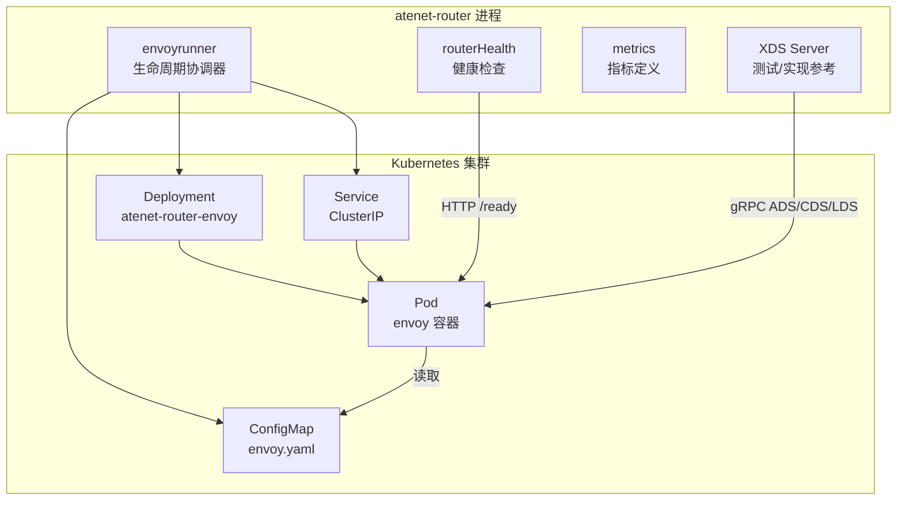
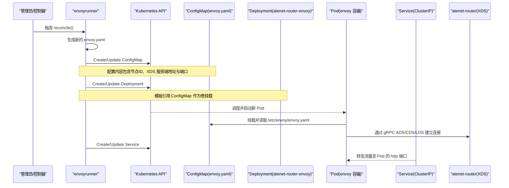
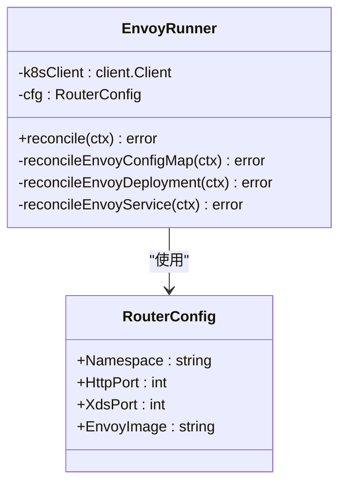
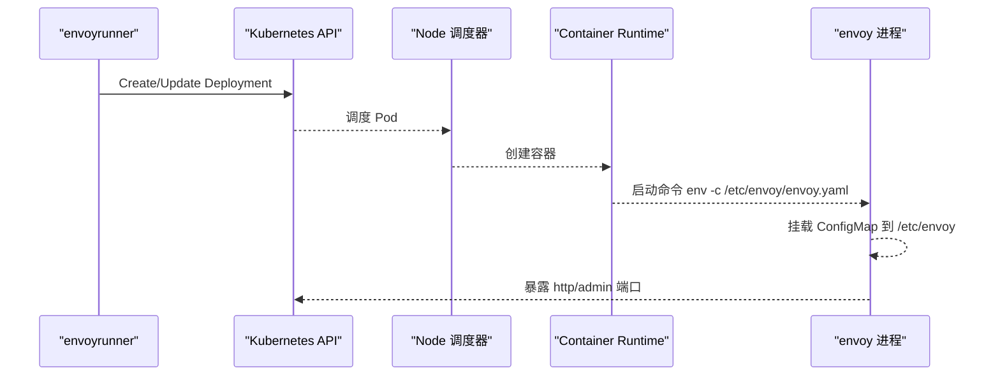
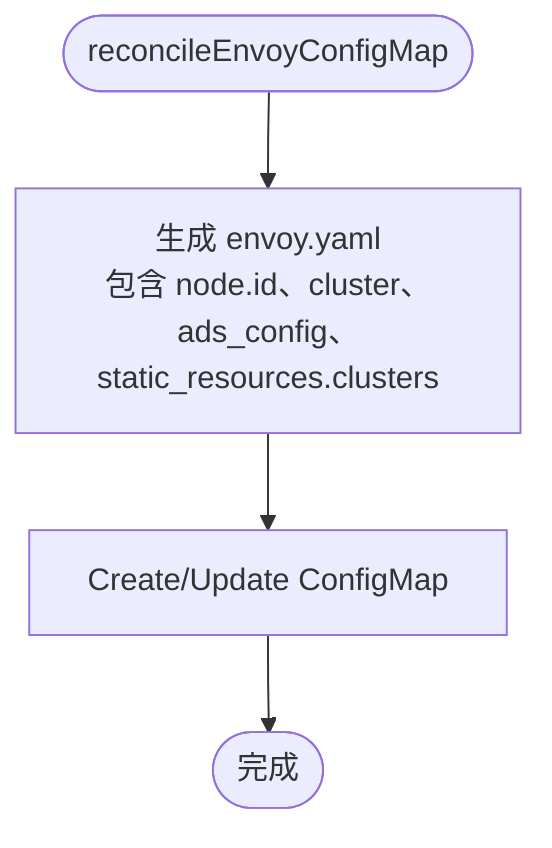
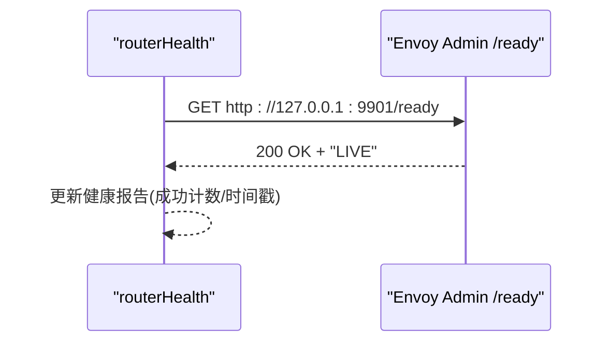
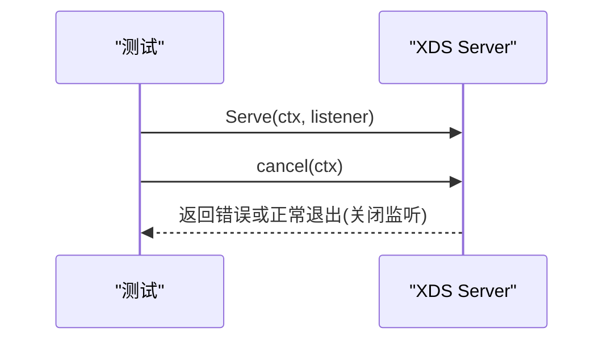
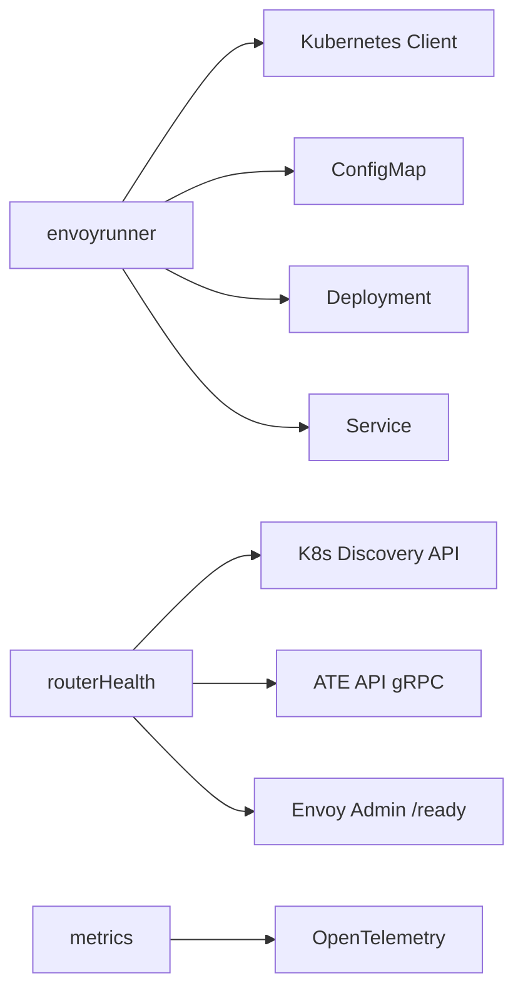
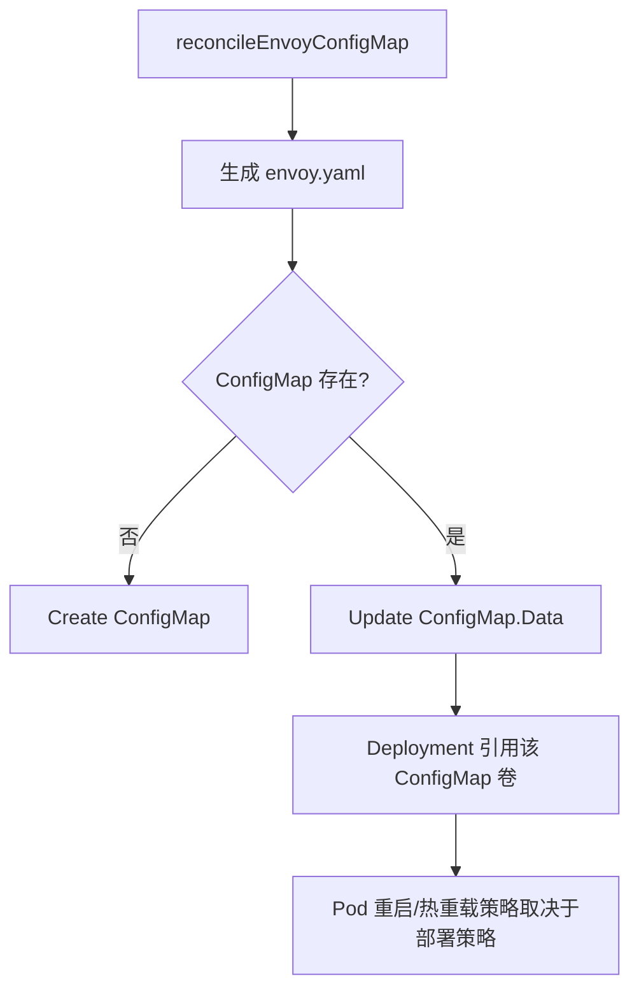

# Envoy生命周期管理

<cite>
**本文引用的文件**   
- [envoyrunner.go](file://cmd/atenet/internal/router/envoyrunner.go)
- [health.go](file://cmd/atenet/internal/router/health.go)
- [metrics.go](file://cmd/atenet/internal/router/metrics.go)
- [xds_test.go](file://cmd/atenet/internal/router/xds_test.go)
</cite>

## 目录
1. [简介](#简介)
2. [项目结构](#项目结构)
3. [核心组件](#核心组件)
4. [架构总览](#架构总览)
5. [详细组件分析](#详细组件分析)
6. [依赖关系分析](#依赖关系分析)
7. [性能与可观测性](#性能与可观测性)
8. [故障恢复与高可用](#故障恢复与高可用)
9. [资源管理与网络端口](#资源管理与网络端口)
10. [配置同步与滚动更新](#配置同步与滚动更新)
11. [监控指标、日志聚合与性能分析](#监控指标日志聚合与性能分析)
12. [结论](#结论)

## 简介
本文件围绕 EnvoyRunner 的进程生命周期管理机制展开，系统性阐述以下方面：
- Envoy 实例在 Kubernetes 中的启动流程（Deployment 创建、Pod 调度、容器初始化）
- 配置同步机制（ConfigMap 驱动、XDS 连接、版本控制与滚动更新策略）
- 故障恢复机制（健康检查、自动重启、优雅关闭）
- 资源管理策略（CPU/内存限制、存储卷挂载、网络端口分配）
- 监控指标收集、日志聚合与性能分析方法
- 从配置变更到 Envoy 实例更新的完整数据流架构图

## 项目结构
EnvoyRunner 位于 atenet-router 模块中，负责以声明式方式在集群内动态管理 Envoy 的运行态。其关键职责包括：
- 生成并维护 Envoy 的引导配置（ConfigMap）
- 创建并同步 Envoy 的 Deployment 与 Service
- 通过 XDS 协议与运行中的 Envoy 建立控制面连接
- 提供健康检查与基础指标采集能力

图表来源
- [envoyrunner.go:50-64](file://cmd/atenet/internal/router/envoyrunner.go#L50-L64)
- [envoyrunner.go:66-137](file://cmd/atenet/internal/router/envoyrunner.go#L66-L137)
- [envoyrunner.go:139-222](file://cmd/atenet/internal/router/envoyrunner.go#L139-L222)
- [envoyrunner.go:224-258](file://cmd/atenet/internal/router/envoyrunner.go#L224-L258)
- [health.go:74-89](file://cmd/atenet/internal/router/health.go#L74-L89)
- [health.go:149-179](file://cmd/atenet/internal/router/health.go#L149-L179)
- [xds_test.go:184-212](file://cmd/atenet/internal/router/xds_test.go#L184-L212)

章节来源
- [envoyrunner.go:50-64](file://cmd/atenet/internal/router/envoyrunner.go#L50-L64)
- [envoyrunner.go:66-137](file://cmd/atenet/internal/router/envoyrunner.go#L66-L137)
- [envoyrunner.go:139-222](file://cmd/atenet/internal/router/envoyrunner.go#L139-L222)
- [envoyrunner.go:224-258](file://cmd/atenet/internal/router/envoyrunner.go#L224-L258)
- [health.go:74-89](file://cmd/atenet/internal/router/health.go#L74-L89)
- [health.go:149-179](file://cmd/atenet/internal/router/health.go#L149-L179)
- [xds_test.go:184-212](file://cmd/atenet/internal/router/xds_test.go#L184-L212)

## 核心组件
- envoyrunner：负责 ConfigMap、Deployment、Service 的 reconcile 循环，确保实际状态与期望状态一致。
- routerHealth：周期性对 Envoy、K8s API、ATE API 进行健康探测，输出健康报告。
- metrics：基于 OpenTelemetry 定义路由时延等指标。
- XDS 相关：Envoy 通过 gRPC ADS/CDS/LDS 向 atenet-router 拉取动态配置；服务端的优雅关闭在测试中有体现。

章节来源
- [envoyrunner.go:36-48](file://cmd/atenet/internal/router/envoyrunner.go#L36-L48)
- [health.go:47-72](file://cmd/atenet/internal/router/health.go#L47-L72)
- [metrics.go:24-51](file://cmd/atenet/internal/router/metrics.go#L24-L51)
- [xds_test.go:184-212](file://cmd/atenet/internal/router/xds_test.go#L184-L212)

## 架构总览
下图展示了从配置变更到 Envoy 实例更新的端到端数据流。

图表来源
- [envoyrunner.go:50-64](file://cmd/atenet/internal/router/envoyrunner.go#L50-L64)
- [envoyrunner.go:66-137](file://cmd/atenet/internal/router/envoyrunner.go#L66-L137)
- [envoyrunner.go:139-222](file://cmd/atenet/internal/router/envoyrunner.go#L139-L222)
- [envoyrunner.go:224-258](file://cmd/atenet/internal/router/envoyrunner.go#L224-L258)

## 详细组件分析

### EnvoyRunner 类图与职责

图表来源
- [envoyrunner.go:36-48](file://cmd/atenet/internal/router/envoyrunner.go#L36-L48)
- [envoyrunner.go:50-64](file://cmd/atenet/internal/router/envoyrunner.go#L50-L64)

章节来源
- [envoyrunner.go:36-48](file://cmd/atenet/internal/router/envoyrunner.go#L36-L48)
- [envoyrunner.go:50-64](file://cmd/atenet/internal/router/envoyrunner.go#L50-L64)

### 启动流程时序（Deployment 创建 -> Pod 调度 -> 容器初始化）

图表来源
- [envoyrunner.go:139-222](file://cmd/atenet/internal/router/envoyrunner.go#L139-L222)
- [envoyrunner.go:164-191](file://cmd/atenet/internal/router/envoyrunner.go#L164-L191)
- [envoyrunner.go:193-204](file://cmd/atenet/internal/router/envoyrunner.go#L193-L204)

章节来源
- [envoyrunner.go:139-222](file://cmd/atenet/internal/router/envoyrunner.go#L139-L222)

### 配置同步机制（ConfigMap -> XDS）

图表来源
- [envoyrunner.go:66-137](file://cmd/atenet/internal/router/envoyrunner.go#L66-L137)

章节来源
- [envoyrunner.go:66-137](file://cmd/atenet/internal/router/envoyrunner.go#L66-L137)

### 健康检查流程（Envoy /ready）

图表来源
- [health.go:149-179](file://cmd/atenet/internal/router/health.go#L149-L179)
- [health.go:74-89](file://cmd/atenet/internal/router/health.go#L74-L89)

章节来源
- [health.go:149-179](file://cmd/atenet/internal/router/health.go#L149-L179)
- [health.go:74-89](file://cmd/atenet/internal/router/health.go#L74-L89)

### XDS 服务端优雅关闭（参考测试）

图表来源
- [xds_test.go:184-212](file://cmd/atenet/internal/router/xds_test.go#L184-L212)

章节来源
- [xds_test.go:184-212](file://cmd/atenet/internal/router/xds_test.go#L184-L212)

## 依赖关系分析
- envoyrunner 依赖 Kubernetes Client（client.Client）操作 ConfigMap、Deployment、Service。
- routerHealth 依赖 kubernetes.Interface 与 ATE API gRPC 客户端，用于探测外部依赖可用性。
- metrics 依赖 OpenTelemetry MeterProvider 注册指标。
- Envoy 运行时依赖 ConfigMap 提供的引导配置，并通过 XDS 与 atenet-router 通信。

图表来源
- [envoyrunner.go:50-64](file://cmd/atenet/internal/router/envoyrunner.go#L50-L64)
- [health.go:74-89](file://cmd/atenet/internal/router/health.go#L74-L89)
- [metrics.go:24-51](file://cmd/atenet/internal/router/metrics.go#L24-L51)

章节来源
- [envoyrunner.go:50-64](file://cmd/atenet/internal/router/envoyrunner.go#L50-L64)
- [health.go:74-89](file://cmd/atenet/internal/router/health.go#L74-L89)
- [metrics.go:24-51](file://cmd/atenet/internal/router/metrics.go#L24-L51)

## 性能与可观测性
- 指标：定义了 atenet.router.route.duration 直方图，单位秒，桶边界覆盖毫秒到数十秒范围，便于评估路由解析阶段延迟。
- 健康：周期性探测 Envoy /ready、K8s API 与 ATE API，记录成功/失败次数与最近成功/失败时间。
- 追踪：健康检查 HTTP 客户端已集成 OpenTelemetry 传输层，便于链路追踪。

章节来源
- [metrics.go:24-51](file://cmd/atenet/internal/router/metrics.go#L24-L51)
- [health.go:74-89](file://cmd/atenet/internal/router/health.go#L74-L89)
- [health.go:149-179](file://cmd/atenet/internal/router/health.go#L149-L179)

## 故障恢复与高可用
- 健康检查：routerHealth 定时调用 Envoy Admin /ready 接口，若返回非 LIVE 则标记不健康并记录错误日志。
- 自动重启：当前 Deployment 副本数为 1，未显式设置 Liveness/Readiness Probe；Envoy 崩溃后由 Kubelet 依据默认重启策略重启容器。
- 优雅关闭：XDS 服务端在取消上下文后能正确关闭监听，避免残留连接。

建议增强点（概念性建议，非现有实现）：
- 为 Envoy 容器添加 Liveness/Readiness Probe，提升自愈与流量切分可靠性。
- 将 Deployment 副本数提升至多副本并结合 PodDisruptionBudget，提高可用性。
- 在 Envoy 侧启用 graceful shutdown 参数，配合 K8s PreStop Hook 平滑下线。

章节来源
- [health.go:149-179](file://cmd/atenet/internal/router/health.go#L149-L179)
- [envoyrunner.go:139-151](file://cmd/atenet/internal/router/envoyrunner.go#L139-L151)
- [xds_test.go:184-212](file://cmd/atenet/internal/router/xds_test.go#L184-L212)

## 资源管理与网络端口
- CPU/内存限制：当前代码未显式设置容器的 resources.limits/resources.requests，需按需补充。
- 存储卷挂载：通过 ConfigMap 卷将 envoy.yaml 挂载到 /etc/envoy，供容器启动加载。
- 网络端口：
  - 容器端口：http（来自配置）、admin（9901）
  - Service：ClusterIP，映射 http 端口至目标端口名称 "http"
  - XDS：Envoy 静态配置指向 atenet-router 的 XDS 端口

章节来源
- [envoyrunner.go:164-191](file://cmd/atenet/internal/router/envoyrunner.go#L164-L191)
- [envoyrunner.go:193-204](file://cmd/atenet/internal/router/envoyrunner.go#L193-L204)
- [envoyrunner.go:224-258](file://cmd/atenet/internal/router/envoyrunner.go#L224-L258)
- [envoyrunner.go:91-111](file://cmd/atenet/internal/router/envoyrunner.go#L91-L111)

## 配置同步与滚动更新
- 配置生成：reconcileEnvoyConfigMap 生成包含 node.id、cluster、ads_config、static_resources.clusters 的引导配置，写入 ConfigMap。
- 版本控制：每次更新直接覆写 ConfigMap.Data，未引入独立版本号字段；可通过 ConfigMap 的 resourceVersion 或元数据注解实现外部版本化。
- 滚动更新：当 Deployment.Spec.Template 变化（例如镜像或环境变量）时，Kubernetes 会执行滚动更新；当前代码将 Deployment.Spec 整体替换，若仅修改 ConfigMap 不会触发 Pod 重建。如需热重载，可在 Envoy 侧启用配置热重载或通过 Sidecar 触发。

图表来源
- [envoyrunner.go:66-137](file://cmd/atenet/internal/router/envoyrunner.go#L66-L137)
- [envoyrunner.go:139-222](file://cmd/atenet/internal/router/envoyrunner.go#L139-L222)

章节来源
- [envoyrunner.go:66-137](file://cmd/atenet/internal/router/envoyrunner.go#L66-L137)
- [envoyrunner.go:139-222](file://cmd/atenet/internal/router/envoyrunner.go#L139-L222)

## 监控指标、日志聚合与性能分析
- 指标采集
  - 自定义指标：atnet.router.route.duration（路由解析耗时），通过 OpenTelemetry 导出。
  - 健康指标：routerHealth.Report() 暴露各组件健康状态与计数。
- 日志聚合
  - 使用 slog 结构化日志，便于集中采集与分析。
  - Envoy 容器启动参数包含组件级日志级别，便于定位上游、路由、扩展处理问题。
- 性能分析
  - 结合 Prometheus/Grafana 可视化路由时延分布。
  - 利用 OpenTelemetry 追踪请求路径，识别瓶颈环节。

章节来源
- [metrics.go:24-51](file://cmd/atenet/internal/router/metrics.go#L24-L51)
- [health.go:74-89](file://cmd/atenet/internal/router/health.go#L74-L89)
- [envoyrunner.go:168-174](file://cmd/atenet/internal/router/envoyrunner.go#L168-L174)

## 结论
EnvoyRunner 通过“配置即资源”的方式，在 Kubernetes 中以最小权限原则管理 Envoy 的生命周期：生成引导配置、创建/同步 Deployment 与 Service、并通过 XDS 提供动态配置。健康检查与指标体系为运维提供了基本可观测性。针对生产环境，建议补充健康探针、资源配额、滚动更新策略与优雅关闭流程，以提升稳定性与可维护性。
