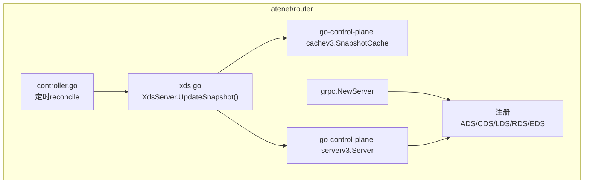
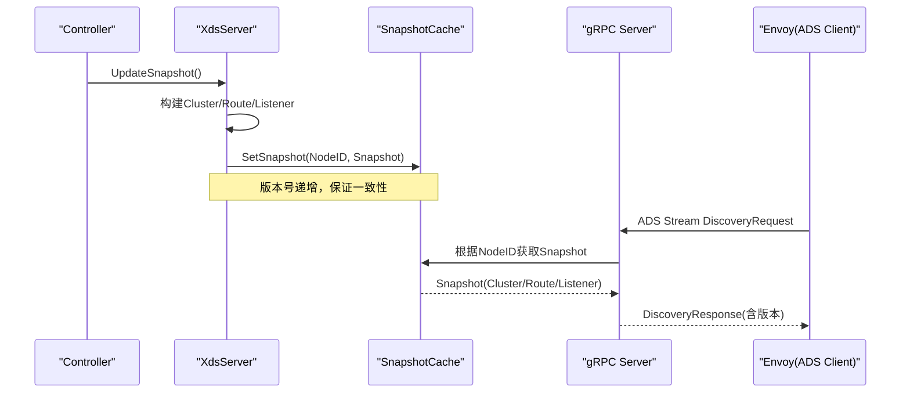
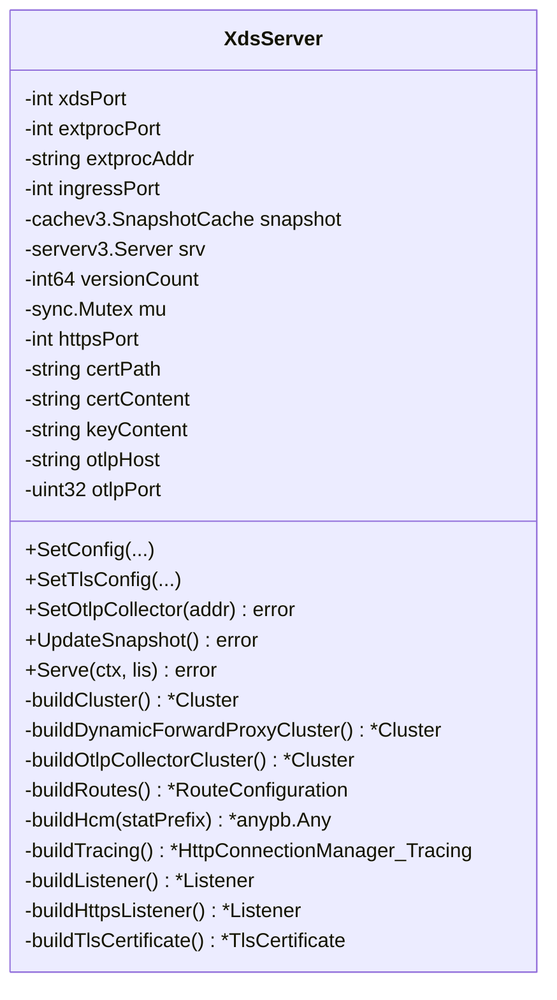
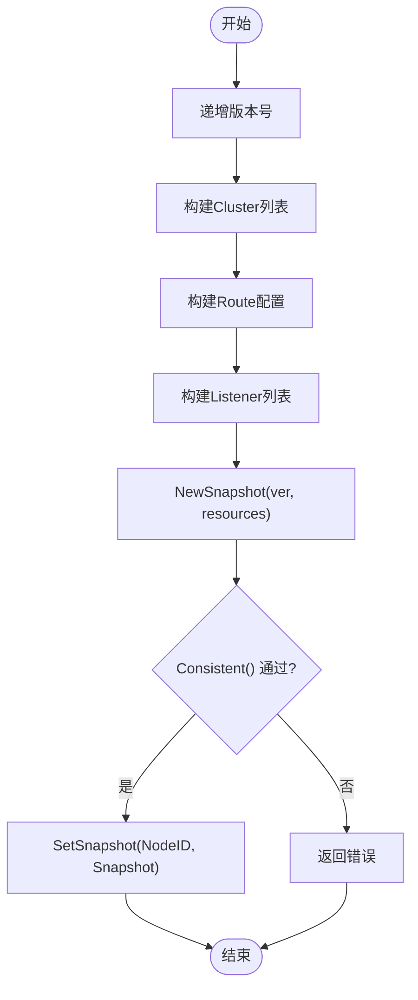
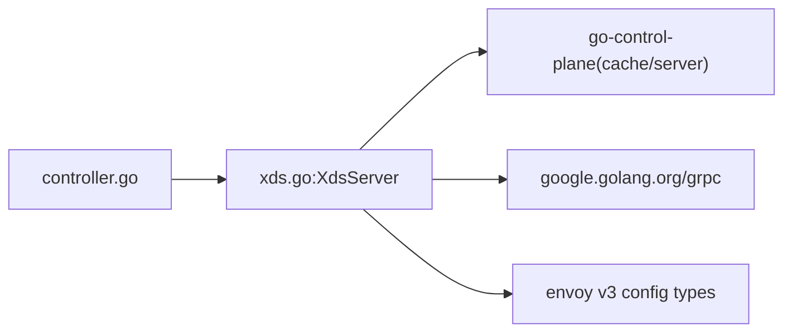
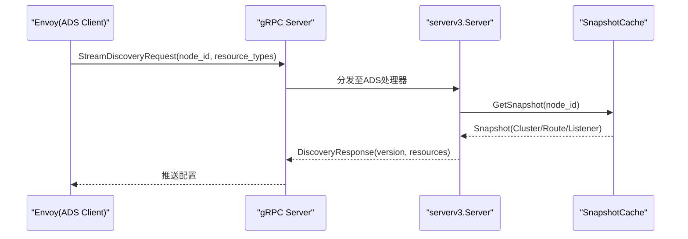

# XDS协议实现

<cite>
**本文引用的文件**   
- [xds.go](file://cmd/atenet/internal/router/xds.go)
- [controller.go](file://cmd/atenet/internal/router/controller.go)
- [xds_test.go](file://cmd/atenet/internal/router/xds_test.go)
</cite>

## 目录
1. [简介](#简介)
2. [项目结构](#项目结构)
3. [核心组件](#核心组件)
4. [架构总览](#架构总览)
5. [详细组件分析](#详细组件分析)
6. [依赖关系分析](#依赖关系分析)
7. [性能与扩展性](#性能与扩展性)
8. [故障排查指南](#故障排查指南)
9. [结论](#结论)
10. [附录：通信流程与数据包结构](#附录通信流程与数据包结构)

## 简介
本文件围绕 Substrate 项目中基于 go-control-plane 的 XDS（Envoy 控制面）gRPC 服务实现，重点阐述 ADS（聚合发现服务）接口的实现细节、资源动态推送机制、配置版本控制与一致性保障、负载均衡策略、超时与重试、以及连接建立与优雅关闭等。同时给出关键流程图与数据包结构说明，帮助读者快速理解并扩展该实现。

## 项目结构
XDS 相关代码位于 atenet 路由模块中，核心由以下文件构成：
- xds.go：XDS gRPC 服务器、Snapshot 构建与发布、Listener/Cluster/Route/HCM 等 Envoy 资源配置生成
- controller.go：控制器循环触发 Snapshot 更新，协调外部处理服务与 Envoy 运行器
- xds_test.go：对 Snapshot 生成、HTTPS Listener、Serve 优雅关闭等进行验证

图表来源
- [xds.go:196-225](file://cmd/atenet/internal/router/xds.go#L196-L225)
- [controller.go:67-110](file://cmd/atenet/internal/router/controller.go#L67-L110)

章节来源
- [xds.go:1-607](file://cmd/atenet/internal/router/xds.go#L1-607)
- [controller.go:1-111](file://cmd/atenet/internal/router/controller.go#L1-111)
- [xds_test.go:1-213](file://cmd/atenet/internal/router/xds_test.go#L1-213)

## 核心组件
- XdsServer：封装了 gRPC 服务生命周期管理、Snapshot 构建与发布、Envoy 资源对象构造（Cluster/Listener/Route/HCM/Tracing/TLS）。
- SnapshotCache：go-control-plane 提供的按 NodeID 分片的快照缓存，用于原子化推送多资源集合。
- Server：go-control-plane 的 ADS/CDS/LDS/RDS/EDS 服务端实现，负责与 Envoy 客户端的流式交互。
- Controller：周期性 reconcile，读取模板或 K8s 状态，调用 XdsServer.UpdateSnapshot 生成并发布新快照。

章节来源
- [xds.go:71-104](file://cmd/atenet/internal/router/xds.go#L71-L104)
- [xds.go:148-194](file://cmd/atenet/internal/router/xds.go#L148-L194)
- [controller.go:67-110](file://cmd/atenet/internal/router/controller.go#L67-L110)

## 架构总览
下图展示了从控制器到 Envoy 的整体数据与控制流：控制器周期触发更新；XdsServer 将 Cluster/Route/Listener 打包为一致快照写入缓存；Envoy 通过 ADS 拉取最新配置。

图表来源
- [controller.go:88-110](file://cmd/atenet/internal/router/controller.go#L88-L110)
- [xds.go:148-194](file://cmd/atenet/internal/router/xds.go#L148-L194)
- [xds.go:196-225](file://cmd/atenet/internal/router/xds.go#L196-L225)

## 详细组件分析

### XdsServer 类与方法
- 字段与职责
  - 端口与监听：ingressPort、httpsPort
  - 外部处理服务：extprocAddr/extprocPort
  - 追踪：otlpHost/otlpPort
  - 版本计数：versionCount（字符串化后作为 Snapshot 版本）
  - 并发保护：mu
  - 缓存与服务：snapshot、srv
- 关键方法
  - NewXdsServer：初始化 SnapshotCache 与 serverv3.Server
  - SetConfig/SetTlsConfig/SetOtlpCollector：运行时参数注入
  - UpdateSnapshot：构建资源集合并写入缓存
  - Serve：启动 gRPC 并注册所有发现服务

图表来源
- [xds.go:71-104](file://cmd/atenet/internal/router/xds.go#L71-L104)
- [xds.go:148-194](file://cmd/atenet/internal/router/xds.go#L148-L194)
- [xds.go:196-225](file://cmd/atenet/internal/router/xds.go#L196-L225)
- [xds.go:227-355](file://cmd/atenet/internal/router/xds.go#L227-L355)
- [xds.go:357-466](file://cmd/atenet/internal/router/xds.go#L357-L466)
- [xds.go:478-501](file://cmd/atenet/internal/router/xds.go#L478-L501)
- [xds.go:503-576](file://cmd/atenet/internal/router/xds.go#L503-L576)
- [xds.go:578-606](file://cmd/atenet/internal/router/xds.go#L578-L606)

章节来源
- [xds.go:71-104](file://cmd/atenet/internal/router/xds.go#L71-L104)
- [xds.go:148-194](file://cmd/atenet/internal/router/xds.go#L148-L194)
- [xds.go:196-225](file://cmd/atenet/internal/router/xds.go#L196-L225)

### 资源构建与推送流程
- 版本控制
  - 每次 UpdateSnapshot 递增 versionCount，并以十进制字符串作为 Snapshot 版本，确保每次变更可被下游感知。
- 一致性校验
  - 使用 cachev3.NewSnapshot 创建包含 Cluster/Route/Listener 的快照，并通过 Consistent() 进行完整性检查，避免不一致的资源组合下发。
- 推送目标
  - 以 NodeID 为键写入 SnapshotCache，Envoy 通过相同 NodeID 拉取对应快照。

图表来源
- [xds.go:148-194](file://cmd/atenet/internal/router/xds.go#L148-L194)

章节来源
- [xds.go:148-194](file://cmd/atenet/internal/router/xds.go#L148-L194)

### 负载均衡算法配置与管理
- 当前实现
  - 静态集群与 OTLP 集群均设置 LbPolicy 为 ROUND_ROBIN（轮询）。
  - 动态转发代理集群使用 CLUSTER_PROVIDED，由 dynamic_forward_proxy 自定义实现提供负载均衡。
- 可扩展点
  - 如需最少连接、随机选择等策略，可在 buildCluster/buildOtlpCollectorCluster 中将 LbPolicy 设置为 LEAST_REQUEST 或 RANDOM，或通过 LOAD_BALANCING_POLICY_CONFIG 指定更复杂的策略。

章节来源
- [xds.go:227-272](file://cmd/atenet/internal/router/xds.go#L227-L272)
- [xds.go:289-334](file://cmd/atenet/internal/router/xds.go#L289-L334)
- [xds.go:336-355](file://cmd/atenet/internal/router/xds.go#L336-L355)

### 超时、重试与熔断
- 连接与消息超时
  - 上游连接超时：在 Cluster 上设置 ConnectTimeout。
  - 外部处理消息超时：在 HCM 的 ext_proc 过滤器中设置 MessageTimeout 与 GrpcService.Timeout。
  - 路由级超时：在 RouteAction 中设置 Timeout。
- 重试与熔断
  - 当前实现未显式配置重试与熔断策略。若需支持，可在 Cluster 上添加 RetryPolicy 与 CircuitBreakers，或在 RouteAction 中配置重试条件与次数。

章节来源
- [xds.go:227-272](file://cmd/atenet/internal/router/xds.go#L227-L272)
- [xds.go:386-466](file://cmd/atenet/internal/router/xds.go#L386-L466)
- [xds.go:357-384](file://cmd/atenet/internal/router/xds.go#L357-L384)

### TLS 与 HTTPS 监听器
- 支持两种证书来源：文件路径或内联内容。
- 当 httpsPort > 0 时，额外生成一个带 TLS 的 Listener，并在 FilterChain 中挂载 transport_socket.tls。

章节来源
- [xds.go:533-576](file://cmd/atenet/internal/router/xds.go#L533-L576)
- [xds.go:578-606](file://cmd/atenet/internal/router/xds.go#L578-L606)

### 追踪集成（OpenTelemetry）
- 通过 SetOtlpCollector 配置 OTLP 收集器地址与端口。
- 启用后，HCM 的 Tracing 指向 OpenTelemetry 提供者，并使用专用 Cluster 发送 spans。

章节来源
- [xds.go:126-146](file://cmd/atenet/internal/router/xds.go#L126-L146)
- [xds.go:478-501](file://cmd/atenet/internal/router/xds.go#L478-L501)
- [xds.go:289-334](file://cmd/atenet/internal/router/xds.go#L289-L334)

### 控制器与调度
- 启动时执行一次 eager reconcile，随后每 5 秒触发一次 reconcile。
- reconcile 会读取模板源（文件或 K8s），然后调用 XdsServer.UpdateSnapshot 生成并推送新快照。

章节来源
- [controller.go:67-110](file://cmd/atenet/internal/router/controller.go#L67-L110)

## 依赖关系分析
- 内部依赖
  - controller.go 依赖 xds.go 的 XdsServer 接口（SetConfig/UpdateSnapshot/Serve）。
  - xds.go 依赖 go-control-plane 的 cachev3.SnapshotCache 与 serverv3.Server。
- 外部依赖
  - gRPC 服务注册：ADS/CDS/LDS/RDS/EDS。
  - Envoy v3 配置类型：Cluster/Listener/Route/HCM/TLS/ExtProc/Dynamic Forward Proxy 等。

图表来源
- [controller.go:67-110](file://cmd/atenet/internal/router/controller.go#L67-L110)
- [xds.go:196-225](file://cmd/atenet/internal/router/xds.go#L196-L225)

章节来源
- [controller.go:67-110](file://cmd/atenet/internal/router/controller.go#L67-L110)
- [xds.go:196-225](file://cmd/atenet/internal/router/xds.go#L196-L225)

## 性能与扩展性
- 快照原子性与一致性
  - 通过 SnapshotCache 的原子 SetSnapshot 与 Consistent() 校验，避免部分更新导致的中间态下发。
- 并发安全
  - UpdateSnapshot 使用互斥锁保护版本计数与资源构建过程，防止并发写冲突。
- 扩展建议
  - 增量更新：当前实现采用全量快照模式。若需减少带宽与内存占用，可引入增量快照（仅变更资源）与差异检测逻辑，但需注意保持全局一致性。
  - 负载均衡策略：可按业务需求切换至最少连接或随机策略，或接入更高级的策略配置。
  - 重试与熔断：建议在 Cluster 与 Route 层增加重试与熔断配置，提升鲁棒性。

[本节为通用指导，不直接分析具体文件]

## 故障排查指南
- 初始快照失败
  - 现象：Serve 启动日志出现“初始 xDS 设置更新失败”警告。
  - 排查：检查 UpdateSnapshot 返回值与日志，确认资源构建是否成功、Consistent() 是否通过。
- 版本不生效
  - 现象：Envoy 未收到新配置。
  - 排查：确认 Controller 是否周期性调用 UpdateSnapshot；检查 NodeID 是否与 Envoy 一致；查看 SnapshotCache 中是否存在对应节点快照。
- HTTPS 监听器缺失
  - 现象：未开启 443 或自定义端口监听。
  - 排查：确认 SetTlsConfig 已正确设置 httpsPort 与证书；验证 UpdateSnapshot 生成的 Listener 数量与端口。
- 优雅关闭
  - 现象：进程退出后 gRPC 服务未停止。
  - 排查：确认 Serve 在 context 取消后调用 GracefulStop；测试用例覆盖了优雅关闭场景。

章节来源
- [xds.go:196-225](file://cmd/atenet/internal/router/xds.go#L196-L225)
- [xds_test.go:184-212](file://cmd/atenet/internal/router/xds_test.go#L184-L212)
- [xds_test.go:141-182](file://cmd/atenet/internal/router/xds_test.go#L141-L182)

## 结论
本项目基于 go-control-plane 实现了完整的 XDS gRPC 服务，提供了稳定的 ADS 接口与一致的快照推送机制。当前实现覆盖 HTTP/HTTPS 监听、动态转发代理、外部处理过滤器、OpenTelemetry 追踪等能力，并通过版本控制与一致性校验保障下发的可靠性。后续可在增量更新、负载均衡策略、重试与熔断等方面进一步扩展，以满足更复杂的生产场景。

[本节为总结，不直接分析具体文件]

## 附录：通信流程与数据包结构

### ADS 请求/响应序列

图表来源
- [xds.go:196-225](file://cmd/atenet/internal/router/xds.go#L196-L225)
- [xds.go:148-194](file://cmd/atenet/internal/router/xds.go#L148-L194)

### 数据包结构要点
- DiscoveryRequest
  - node_id：与 SnapshotCache 的 NodeID 匹配
  - resource_types：如 ["cluster", "route", "listener"]
- DiscoveryResponse
  - version_info：由 UpdateSnapshot 生成的版本号（十进制字符串）
  - resources：包含 Cluster、Route、Listener 等资源对象
- 一致性
  - 同一 Snapshot 内的资源必须满足 Consistent() 约束，避免跨资源引用不一致

章节来源
- [xds.go:148-194](file://cmd/atenet/internal/router/xds.go#L148-L194)
- [xds.go:196-225](file://cmd/atenet/internal/router/xds.go#L196-L225)
