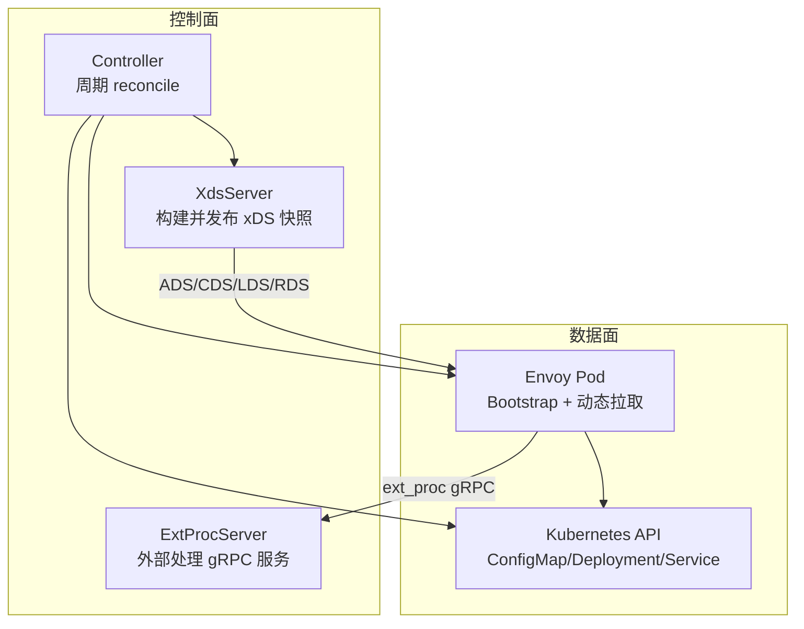
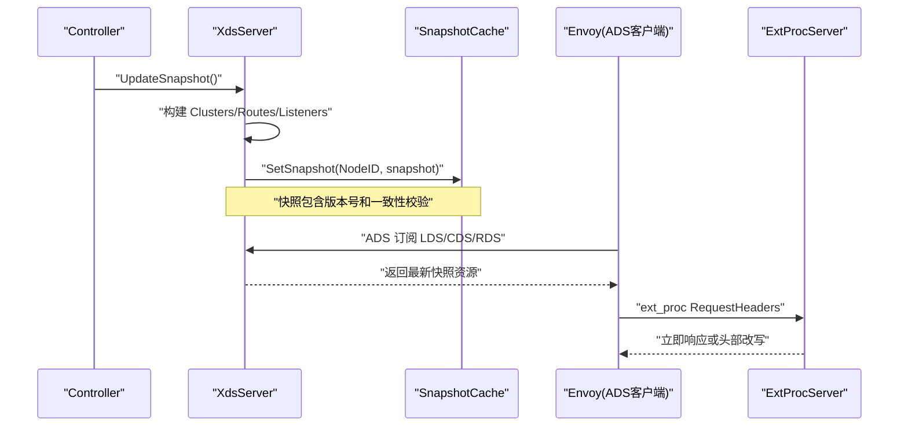
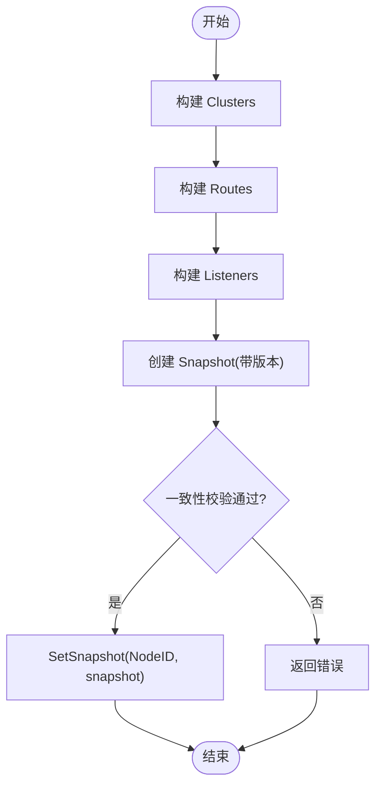
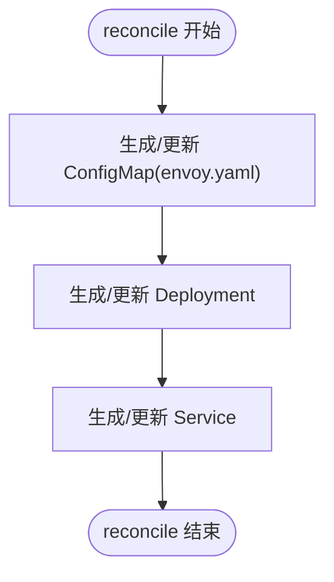
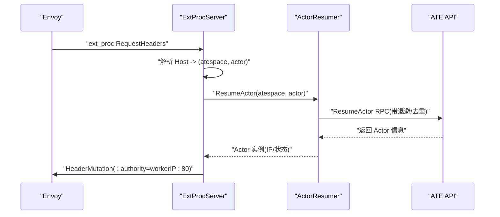
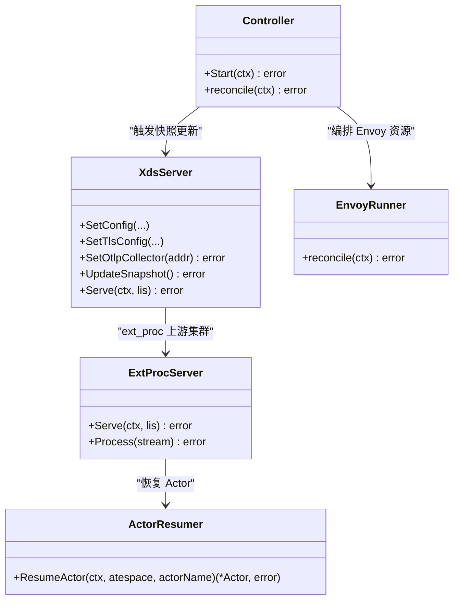
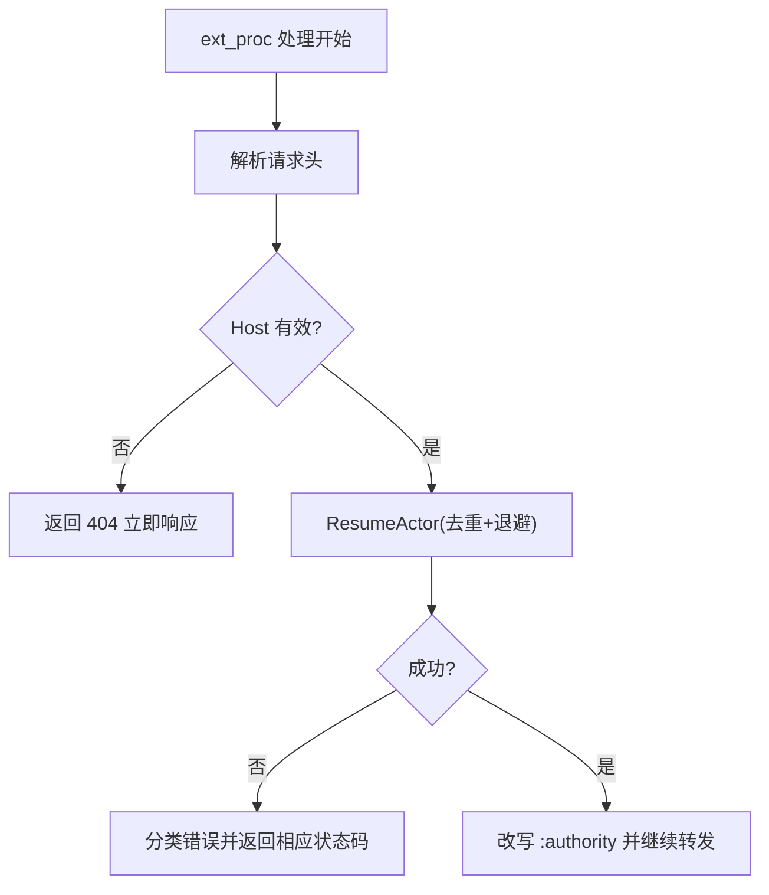

# 配置同步机制

<cite>
**本文引用的文件**
- [xds.go](file://cmd/atenet/internal/router/xds.go)
- [envoyrunner.go](file://cmd/atenet/internal/router/envoyrunner.go)
- [extproc.go](file://cmd/atenet/internal/router/extproc.go)
- [extproc_in.go](file://cmd/atenet/internal/router/extproc_in.go)
- [extproc_out.go](file://cmd/atenet/internal/router/extproc_out.go)
- [resumer.go](file://cmd/atenet/internal/router/resumer.go)
- [controller.go](file://cmd/atenet/internal/router/controller.go)
- [xds_test.go](file://cmd/atenet/internal/router/xds_test.go)
</cite>

## 目录
1. [简介](#简介)
2. [项目结构](#项目结构)
3. [核心组件](#核心组件)
4. [架构总览](#架构总览)
5. [详细组件分析](#详细组件分析)
6. [依赖关系分析](#依赖关系分析)
7. [性能考量](#性能考量)
8. [故障排查指南](#故障排查指南)
9. [结论](#结论)
10. [附录](#附录)

## 简介
本文件围绕 Envoy 配置的生成、分发与同步机制展开，重点覆盖以下方面：
- 静态资源配置的生成过程：包括 bootstrap 配置、集群定义、监听器配置等。
- 动态配置推送的实现：XDS 资源构建、快照一致性校验、序列化传输、客户端接收。
- 配置验证与一致性保证：语法检查、语义验证、冲突检测。
- 配置热更新策略：增量更新、批量更新、回滚机制。
- 配置管理最佳实践：模板化、参数化、版本管理。
- 配置同步时序图与错误处理流程图。

## 项目结构
本项目在 atenet-router 模块中实现了完整的 Envoy 控制面与数据面协同方案：
- 控制面（XDS Server）：负责根据运行时参数构建 Cluster/Route/Listener 等资源，并以 Snapshot 形式发布到 go-control-plane 缓存，供 Envoy 通过 ADS 拉取。
- 外部处理（ExtProc）：作为 Envoy 的外部处理器，基于请求 Host 解析目标 Actor，并动态唤醒与路由。
- 运行期编排（Envoy Runner）：在 Kubernetes 中生成并维护 Envoy 的 Bootstrap 配置（ConfigMap）、Deployment 与 Service，使 Envoy 以动态模式连接 XDS。
- 控制器（Controller）：周期性协调 xDS 快照更新与 Envoy 资源对象的一致性。

图表来源
- [xds.go:148-194](file://cmd/atenet/internal/router/xds.go#L148-L194)
- [envoyrunner.go:66-137](file://cmd/atenet/internal/router/envoyrunner.go#L66-L137)
- [controller.go:88-110](file://cmd/atenet/internal/router/controller.go#L88-L110)

章节来源
- [xds.go:148-194](file://cmd/atenet/internal/router/xds.go#L148-L194)
- [envoyrunner.go:66-137](file://cmd/atenet/internal/router/envoyrunner.go#L66-L137)
- [controller.go:88-110](file://cmd/atenet/internal/router/controller.go#L88-L110)

## 核心组件
- XdsServer：实现聚合发现服务（ADS），提供 Cluster/Route/Listener 资源的构建与快照发布；支持 HTTP/HTTPS 监听器、OTLP 追踪集成、动态转发代理集群等。
- ExtProcServer：实现 Envoy ext_proc 协议，解析请求头、恢复 Actor、改写 :authority 进行动态路由。
- ActorResumer：对 Actor 恢复调用做去重与退避重试，避免并发风暴。
- envoyrunner：在 Kubernetes 中生成并维护 Envoy 的 bootstrap 配置（ConfigMap）、Deployment 与 Service。
- Controller：定时触发 reconcile，确保 xDS 快照与 Envoy 资源对象一致。

章节来源
- [xds.go:72-104](file://cmd/atenet/internal/router/xds.go#L72-L104)
- [extproc.go:38-56](file://cmd/atenet/internal/router/extproc.go#L38-L56)
- [resumer.go:31-41](file://cmd/atenet/internal/router/resumer.go#L31-L41)
- [envoyrunner.go:36-48](file://cmd/atenet/internal/router/envoyrunner.go#L36-L48)
- [controller.go:26-37](file://cmd/atenet/internal/router/controller.go#L26-L37)

## 架构总览
下图展示了从控制器触发生成快照到 Envoy 动态拉取并应用的全链路流程。

图表来源
- [controller.go:88-110](file://cmd/atenet/internal/router/controller.go#L88-L110)
- [xds.go:148-194](file://cmd/atenet/internal/router/xds.go#L148-L194)
- [extproc.go:80-128](file://cmd/atenet/internal/router/extproc.go#L80-L128)

## 详细组件分析

### XdsServer：动态配置构建与发布
- 资源构建
  - Cluster：静态后端（ext_proc）与动态转发代理集群；可选 OTLP Collector 集群。
  - Route：单一虚拟主机匹配所有域名，统一走动态转发代理。
  - Listener：HTTP 监听器；若启用 HTTPS，则增加 TLS 监听器。
- 快照发布
  - 递增版本号，构建 Snapshot，执行一致性检查后写入缓存。
- 服务启动
  - 注册 ADS/CDS/LDS/RDS gRPC 服务，优雅关闭。

图表来源
- [xds.go:148-194](file://cmd/atenet/internal/router/xds.go#L148-L194)

章节来源
- [xds.go:148-194](file://cmd/atenet/internal/router/xds.go#L148-L194)
- [xds.go:227-272](file://cmd/atenet/internal/router/xds.go#L227-L272)
- [xds.go:336-355](file://cmd/atenet/internal/router/xds.go#L336-L355)
- [xds.go:357-384](file://cmd/atenet/internal/router/xds.go#L357-L384)
- [xds.go:503-531](file://cmd/atenet/internal/router/xds.go#L503-L531)
- [xds.go:533-576](file://cmd/atenet/internal/router/xds.go#L533-L576)
- [xds.go:578-606](file://cmd/atenet/internal/router/xds.go#L578-L606)
- [xds.go:196-225](file://cmd/atenet/internal/router/xds.go#L196-L225)

### Envoy Runner：Bootstrap 与资源编排
- Bootstrap 配置生成
  - 设置 node.id、cluster、dynamic_resources（ADS V3）。
  - static_resources 中定义 xds_cluster，指向 atenet-router 的 XDS 端口。
- 资源对象维护
  - ConfigMap：挂载为 /etc/envoy/envoy.yaml。
  - Deployment：单副本，暴露 HTTP 与 Admin 端口。
  - Service：ClusterIP 类型，将 HTTP 端口暴露给集群内访问。

图表来源
- [envoyrunner.go:66-137](file://cmd/atenet/internal/router/envoyrunner.go#L66-L137)
- [envoyrunner.go:139-222](file://cmd/atenet/internal/router/envoyrunner.go#L139-L222)
- [envoyrunner.go:224-258](file://cmd/atenet/internal/router/envoyrunner.go#L224-L258)

章节来源
- [envoyrunner.go:66-137](file://cmd/atenet/internal/router/envoyrunner.go#L66-L137)
- [envoyrunner.go:139-222](file://cmd/atenet/internal/router/envoyrunner.go#L139-L222)
- [envoyrunner.go:224-258](file://cmd/atenet/internal/router/envoyrunner.go#L224-L258)

### ExtProcServer：请求级动态路由
- 处理流程
  - 解析请求头，提取 host/path。
  - 解析 actor 引用（atespace/actorName）。
  - 调用 ActorResumer 确保 Actor 运行，获取 worker IP。
  - 改写 :authority 为 targetAddr，交由动态转发代理集群出站。
- 错误处理
  - 构造 reqError 映射为 HTTP 状态码，立即响应。
  - 记录指标与日志，便于观测。

图表来源
- [extproc.go:80-128](file://cmd/atenet/internal/router/extproc.go#L80-L128)
- [extproc_in.go:31-57](file://cmd/atenet/internal/router/extproc_in.go#L31-L57)
- [extproc_in.go:64-72](file://cmd/atenet/internal/router/extproc_in.go#L64-L72)
- [extproc_out.go:35-44](file://cmd/atenet/internal/router/extproc_out.go#L35-L44)
- [resumer.go:46-104](file://cmd/atenet/internal/router/resumer.go#L46-L104)

章节来源
- [extproc.go:80-128](file://cmd/atenet/internal/router/extproc.go#L80-L128)
- [extproc_in.go:31-57](file://cmd/atenet/internal/router/extproc_in.go#L31-L57)
- [extproc_in.go:64-72](file://cmd/atenet/internal/router/extproc_in.go#L64-L72)
- [extproc_out.go:35-44](file://cmd/atenet/internal/router/extproc_out.go#L35-L44)
- [resumer.go:46-104](file://cmd/atenet/internal/router/resumer.go#L46-L104)

### 控制器：周期同步与初始就绪
- 启动时执行一次 eager reconcile。
- 每 5 秒轮询，读取 ActorTemplates 并触发 xDS 快照更新。
- 在非 standalone 且未使用模板文件时，同时 reconcile Envoy 相关资源。

章节来源
- [controller.go:67-86](file://cmd/atenet/internal/router/controller.go#L67-L86)
- [controller.go:88-110](file://cmd/atenet/internal/router/controller.go#L88-L110)

## 依赖关系分析
- 组件耦合
  - Controller 依赖 XdsServer 与 envoyrunner，分别负责动态配置与静态资源编排。
  - XdsServer 依赖 go-control-plane 的 cache/server 实现快照管理与 gRPC 服务。
  - ExtProcServer 依赖 ATE API 与 resumer，完成 Actor 生命周期与路由决策。
- 外部依赖
  - Kubernetes API：用于 ConfigMap/Deployment/Service 的 CRUD。
  - OpenTelemetry：gRPC 服务端统计与 tracing 集成。

图表来源
- [controller.go:26-37](file://cmd/atenet/internal/router/controller.go#L26-L37)
- [xds.go:72-104](file://cmd/atenet/internal/router/xds.go#L72-L104)
- [extproc.go:38-56](file://cmd/atenet/internal/router/extproc.go#L38-L56)
- [resumer.go:31-41](file://cmd/atenet/internal/router/resumer.go#L31-L41)
- [envoyrunner.go:36-48](file://cmd/atenet/internal/router/envoyrunner.go#L36-L48)

章节来源
- [controller.go:26-37](file://cmd/atenet/internal/router/controller.go#L26-L37)
- [xds.go:72-104](file://cmd/atenet/internal/router/xds.go#L72-L104)
- [extproc.go:38-56](file://cmd/atenet/internal/router/extproc.go#L38-L56)
- [resumer.go:31-41](file://cmd/atenet/internal/router/resumer.go#L31-L41)
- [envoyrunner.go:36-48](file://cmd/atenet/internal/router/envoyrunner.go#L36-L48)

## 性能考量
- 快照构建与一致性
  - 每次 UpdateSnapshot 会递增版本号并执行一致性检查，避免不一致的资源组合下发。
- 并发与去重
  - ActorResumer 使用 singleflight 对同一 Actor 的恢复请求进行去重，降低 API 压力。
- 超时与重试
  - ResumeActor 采用指数退避与抖动，避免雪崩；消息超时与 gRPC 超时合理配置，保障稳定性。
- 追踪与可观测性
  - gRPC 服务端启用 otelgrpc 统计；HCM 层可选开启 OpenTelemetry 追踪，便于端到端观测。

章节来源
- [xds.go:148-194](file://cmd/atenet/internal/router/xds.go#L148-L194)
- [resumer.go:46-104](file://cmd/atenet/internal/router/resumer.go#L46-L104)
- [extproc.go:58-78](file://cmd/atenet/internal/router/extproc.go#L58-L78)

## 故障排查指南
- 常见问题定位
  - 快照构建失败：检查 UpdateSnapshot 返回值与一致性校验错误。
  - 监听器未生效：确认 HTTPS 是否启用及证书路径/内容是否正确。
  - ext_proc 报错：查看请求头解析与 Actor 恢复错误分类。
- 错误分类与响应
  - 使用 reqError 携带 HTTP 状态码，立即响应以避免长尾。
  - 区分取消/超时、NotFound、其他错误，便于上层观测与告警。

图表来源
- [extproc.go:80-128](file://cmd/atenet/internal/router/extproc.go#L80-L128)
- [extproc_out.go:46-67](file://cmd/atenet/internal/router/extproc_out.go#L46-L67)
- [resumer.go:46-104](file://cmd/atenet/internal/router/resumer.go#L46-L104)

章节来源
- [extproc.go:80-128](file://cmd/atenet/internal/router/extproc.go#L80-L128)
- [extproc_out.go:46-67](file://cmd/atenet/internal/router/extproc_out.go#L46-L67)
- [resumer.go:46-104](file://cmd/atenet/internal/router/resumer.go#L46-L104)

## 结论
该方案通过“静态 bootstrap + 动态 xDS”的组合，实现了 Envoy 的高可用与灵活扩展：
- 静态 bootstrap 由控制器在 Kubernetes 中生成并维护，确保 Envoy 能稳定连接控制面。
- 动态 xDS 通过快照版本与一致性校验，保证下发的 Cluster/Route/Listener 组合正确。
- ext_proc 提供请求级的动态路由能力，结合 Actor 恢复与去重，兼顾性能与可靠性。
- 配合 OTLP 追踪与指标采集，形成完善的可观测体系。

## 附录

### 配置验证与一致性保证
- 语法检查
  - 通过 go-control-plane 的 Snapshot.Consistent() 对资源完整性进行检查，防止缺失引用或不一致组合。
- 语义验证
  - 监听器绑定地址与端口、TLS 证书来源（文件或内联）需与运行时参数一致。
  - 路由规则与动态转发代理集群名称需匹配。
- 冲突检测
  - 多监听器端口冲突、重复集群名等在构建阶段即被规避。

章节来源
- [xds.go:187-190](file://cmd/atenet/internal/router/xds.go#L187-L190)
- [xds.go:533-576](file://cmd/atenet/internal/router/xds.go#L533-L576)
- [xds.go:357-384](file://cmd/atenet/internal/router/xds.go#L357-L384)

### 配置热更新策略
- 增量更新
  - 通过 ADS 流式推送，Envoy 按需拉取变更资源，减少带宽与重启开销。
- 批量更新
  - 控制器周期性 reconcile，合并多次变更在一次快照中发布，提升吞吐。
- 回滚机制
  - 快照版本号单调递增，Envoy 仅接受更高版本；若新版本异常，可通过回退到上一份已知正确的快照实现快速回滚。

章节来源
- [controller.go:67-86](file://cmd/atenet/internal/router/controller.go#L67-L86)
- [xds.go:148-194](file://cmd/atenet/internal/router/xds.go#L148-L194)

### 配置管理最佳实践
- 模板化
  - 使用模板文件（非 standalone 模式）或 Kubernetes 资源模板，集中管理配置片段。
- 参数化
  - 将端口、证书、OTLP 收集器等关键参数外置，便于不同环境复用。
- 版本管理
  - 利用快照版本号与审计日志，建立配置变更的可追溯性。

章节来源
- [controller.go:48-53](file://cmd/atenet/internal/router/controller.go#L48-L53)
- [xds.go:126-146](file://cmd/atenet/internal/router/xds.go#L126-L146)
- [xds.go:114-121](file://cmd/atenet/internal/router/xds.go#L114-L121)

### 测试与断言参考
- 单元测试覆盖了快照构建、HTTPS 监听器、服务优雅关闭等场景，可作为回归基线。

章节来源
- [xds_test.go:31-139](file://cmd/atenet/internal/router/xds_test.go#L31-L139)
- [xds_test.go:141-182](file://cmd/atenet/internal/router/xds_test.go#L141-L182)
- [xds_test.go:184-213](file://cmd/atenet/internal/router/xds_test.go#L184-L213)
