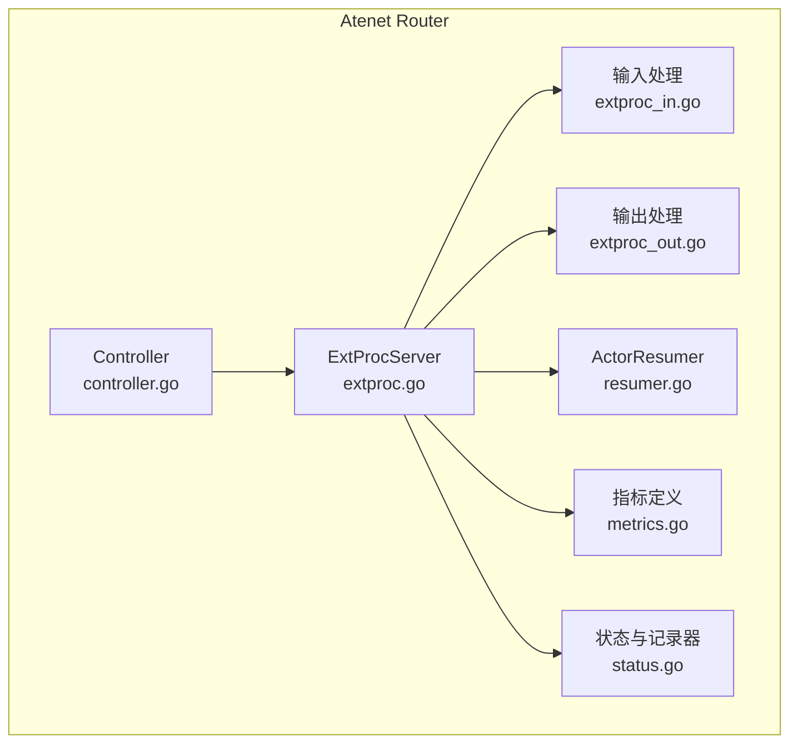
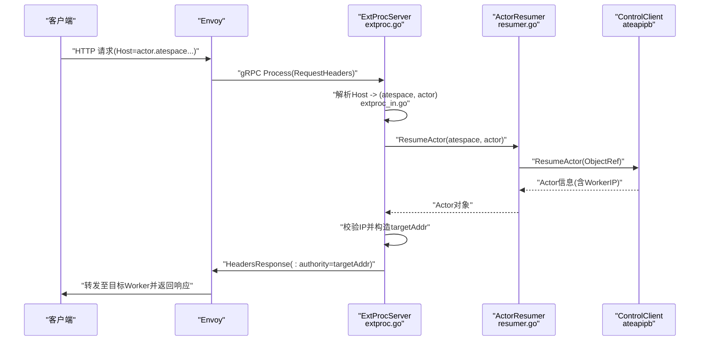
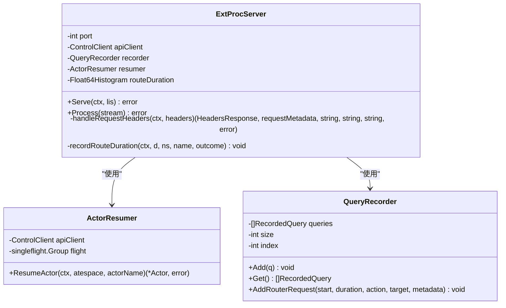
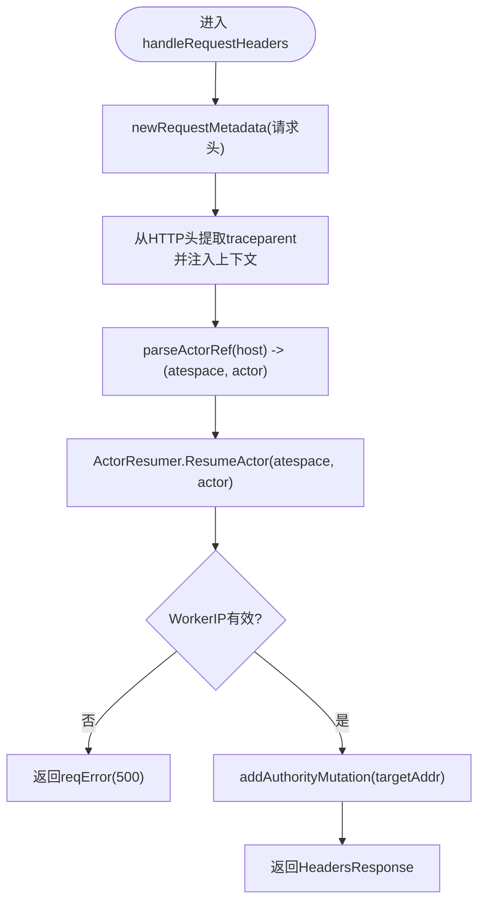
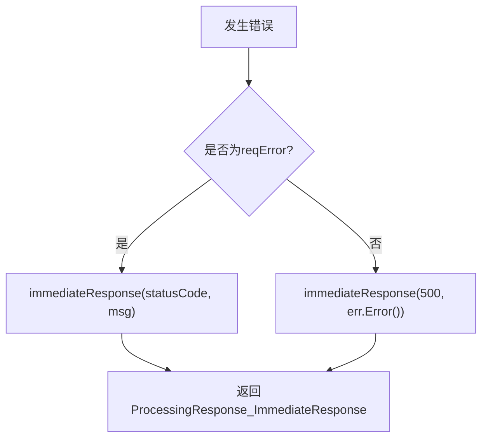
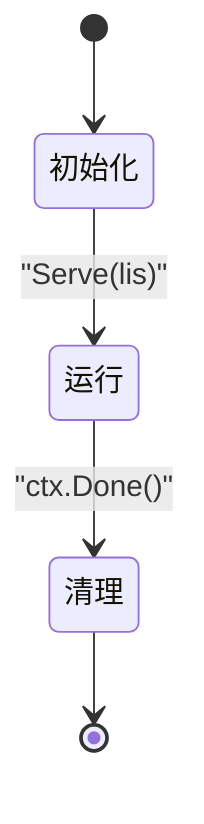
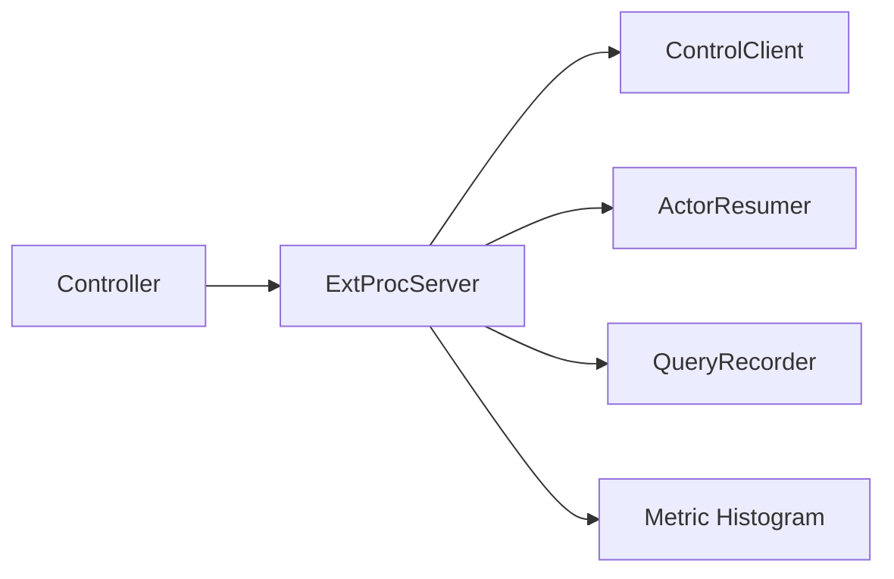

# ExtProc扩展程序

<cite>
**本文引用的文件**
- [extproc.go](file://cmd/atenet/internal/router/extproc.go)
- [extproc_in.go](file://cmd/atenet/internal/router/extproc_in.go)
- [extproc_out.go](file://cmd/atenet/internal/router/extproc_out.go)
- [resumer.go](file://cmd/atenet/internal/router/resumer.go)
- [metrics.go](file://cmd/atenet/internal/router/metrics.go)
- [status.go](file://cmd/atenet/internal/router/status.go)
- [controller.go](file://cmd/atenet/internal/router/controller.go)
- [extproc_test.go](file://cmd/atenet/internal/router/extproc_test.go)
</cite>

## 目录
1. [简介](#简介)
2. [项目结构](#项目结构)
3. [核心组件](#核心组件)
4. [架构总览](#架构总览)
5. [详细组件分析](#详细组件分析)
6. [依赖关系分析](#依赖关系分析)
7. [性能考量](#性能考量)
8. [故障排查指南](#故障排查指南)
9. [结论](#结论)
10. [附录：开发指南与最佳实践](#附录开发指南与最佳实践)

## 简介
本文件系统性阐述 atenet 中 Envoy ExtProc（外部处理程序）的实现机制与应用场景。重点覆盖：
- 外部处理程序的接口定义与调用时序
- 输入处理流程（extproc_in）：请求头解析、Host 路由解析、上下文传播等
- 输出处理流程（extproc_out）：头部改写、即时响应、错误映射
- 扩展程序生命周期：初始化、运行、优雅关闭
- 自定义扩展程序开发指南：接口实现、错误处理、可观测性与性能优化

## 项目结构
ExtProc 相关代码位于 atenet 的 router 子包，主要文件如下：
- extproc.go：ExtProc gRPC 服务实现、请求处理主循环、指标记录
- extproc_in.go：请求元数据提取、Host 解析为 (atespace, actor)
- extproc_out.go：请求错误类型、头部改写、即时响应构造
- resumer.go：Actor 恢复协调器（去重、重试、超时隔离）
- metrics.go：路由耗时直方图指标定义
- status.go：查询记录器与状态页展示（用于调试与排障）
- controller.go：控制器集成（将 ExtProcServer 注入到 Router 控制面）

图表来源
- [extproc.go:38-78](file://cmd/atenet/internal/router/extproc.go#L38-L78)
- [extproc_in.go:25-72](file://cmd/atenet/internal/router/extproc_in.go#L25-L72)
- [extproc_out.go:23-68](file://cmd/atenet/internal/router/extproc_out.go#L23-L68)
- [resumer.go:31-104](file://cmd/atenet/internal/router/resumer.go#L31-L104)
- [metrics.go:24-51](file://cmd/atenet/internal/router/metrics.go#L24-L51)
- [status.go:49-130](file://cmd/atenet/internal/router/status.go#L49-L130)
- [controller.go:28-65](file://cmd/atenet/internal/router/controller.go#L28-L65)

章节来源
- [extproc.go:38-78](file://cmd/atenet/internal/router/extproc.go#L38-L78)
- [extproc_in.go:25-72](file://cmd/atenet/internal/router/extproc_in.go#L25-L72)
- [extproc_out.go:23-68](file://cmd/atenet/internal/router/extproc_out.go#L23-L68)
- [resumer.go:31-104](file://cmd/atenet/internal/router/resumer.go#L31-L104)
- [metrics.go:24-51](file://cmd/atenet/internal/router/metrics.go#L24-L51)
- [status.go:49-130](file://cmd/atenet/internal/router/status.go#L49-L130)
- [controller.go:28-65](file://cmd/atenet/internal/router/controller.go#L28-L65)

## 核心组件
- ExtProcServer：实现 Envoy ExternalProcessor gRPC 服务，负责接收请求、解析 Host、恢复 Actor、改写 :authority 并返回响应；同时记录指标与查询日志。
- ActorResumer：对并发请求进行去重与指数退避重试，确保 Actor 被安全唤醒并返回其工作节点 IP。
- 输入处理（extproc_in）：从 HTTP 头中提取 path/host，解析出 (atespace, actor)，并建立请求元数据。
- 输出处理（extproc_out）：封装 reqError、头部改写与即时响应构造，保证错误不泄露内部细节。
- 指标与状态：记录路由耗时直方图，提供最近请求记录用于诊断。

章节来源
- [extproc.go:38-128](file://cmd/atenet/internal/router/extproc.go#L38-L128)
- [resumer.go:31-104](file://cmd/atenet/internal/router/resumer.go#L31-L104)
- [extproc_in.go:25-72](file://cmd/atenet/internal/router/extproc_in.go#L25-L72)
- [extproc_out.go:23-68](file://cmd/atenet/internal/router/extproc_out.go#L23-L68)
- [metrics.go:24-51](file://cmd/atenet/internal/router/metrics.go#L24-L51)
- [status.go:49-130](file://cmd/atenet/internal/router/status.go#L49-L130)

## 架构总览
Envoy 在 HTTP 过滤器链中启用 ext_proc，并在请求头阶段回调 Atenet 的 ExtProcServer。Atenet 根据 Host 解析目标 Actor，通过控制面 API 唤醒对应 Worker，并将 Worker Pod IP 作为新的 :authority 写回给 Envoy，从而完成动态路由。

图表来源
- [extproc.go:80-128](file://cmd/atenet/internal/router/extproc.go#L80-L128)
- [extproc_in.go:59-72](file://cmd/atenet/internal/router/extproc_in.go#L59-L72)
- [resumer.go:46-104](file://cmd/atenet/internal/router/resumer.go#L46-L104)

## 详细组件分析

### ExtProcServer 类与方法
ExtProcServer 实现了 Envoy 的外部处理 gRPC 接口，包含以下关键方法：
- Serve：启动 gRPC 服务器，注册 ExternalProcessor 服务，支持优雅关闭。
- Process：主循环读取 ProcessingRequest，仅处理 RequestHeaders 分支，其他分支返回空修改。
- handleRequestHeaders：核心逻辑，包括上下文传播、Host 解析、Actor 恢复、目标地址计算与头部改写。
- recordRouteDuration：记录路由耗时直方图指标。

图表来源
- [extproc.go:38-128](file://cmd/atenet/internal/router/extproc.go#L38-L128)
- [resumer.go:31-104](file://cmd/atenet/internal/router/resumer.go#L31-L104)
- [status.go:49-130](file://cmd/atenet/internal/router/status.go#L49-L130)

章节来源
- [extproc.go:38-128](file://cmd/atenet/internal/router/extproc.go#L38-L128)
- [resumer.go:31-104](file://cmd/atenet/internal/router/resumer.go#L31-L104)
- [status.go:49-130](file://cmd/atenet/internal/router/status.go#L49-L130)

### 输入处理流程（extproc_in）
- newRequestMetadata：遍历请求头，构建小写键的 map，并提取 :path、:authority/host。
- parseActorRef：去除端口后，按约定域名格式解析出 (atespace, actor)。

图表来源
- [extproc.go:130-188](file://cmd/atenet/internal/router/extproc.go#L130-L188)
- [extproc_in.go:31-72](file://cmd/atenet/internal/router/extproc_in.go#L31-L72)
- [extproc_out.go:35-44](file://cmd/atenet/internal/router/extproc_out.go#L35-L44)

章节来源
- [extproc_in.go:31-72](file://cmd/atenet/internal/router/extproc_in.go#L31-L72)
- [extproc.go:130-188](file://cmd/atenet/internal/router/extproc.go#L130-L188)

### 输出处理流程（extproc_out）
- reqError：携带 HTTP 状态码与安全消息，保留原始错误链以便日志审计。
- addAuthorityMutation：设置 :authority 为目标 worker 地址。
- immediateResponse：构造即时响应（如 404/500），设置 content-type 为 text/plain。

图表来源
- [extproc_out.go:23-68](file://cmd/atenet/internal/router/extproc_out.go#L23-L68)
- [extproc.go:97-111](file://cmd/atenet/internal/router/extproc.go#L97-L111)

章节来源
- [extproc_out.go:23-68](file://cmd/atenet/internal/router/extproc_out.go#L23-L68)
- [extproc.go:97-111](file://cmd/atenet/internal/router/extproc.go#L97-L111)

### 扩展程序生命周期管理
- 初始化：NewExtProcServer 创建实例，注入 ControlClient、QueryRecorder、ActorResumer 与指标直方图。
- 运行：Serve 启动 gRPC 服务，Process 持续处理来自 Envoy 的请求。
- 清理：Context 取消时执行 GracefulStop，确保连接优雅关闭。

图表来源
- [extproc.go:48-78](file://cmd/atenet/internal/router/extproc.go#L48-L78)

章节来源
- [extproc.go:48-78](file://cmd/atenet/internal/router/extproc.go#L48-L78)

### 错误处理与状态映射
- 无效 Host：返回 404，消息包含 host 标识。
- 非 gRPC 错误：折叠为 500，不泄露内部细节。
- gRPC 状态码映射：FailedPrecondition/Unavailable 映射为 503，NotFound 映射为 404，DeadlineExceeded 映射为 504。
- 非法 WorkerIP：返回 500，避免泄露内部地址。

章节来源
- [extproc_test.go:106-176](file://cmd/atenet/internal/router/extproc_test.go#L106-L176)
- [extproc.go:145-172](file://cmd/atenet/internal/router/extproc.go#L145-L172)

### 可观测性与诊断
- 指标：记录 atenet.router.route.duration 直方图，维度包含模板命名空间、名称与结果分类。
- 查询记录：QueryRecorder 保存最近 N 条请求摘要，路径中的查询字符串会被脱敏。
- 状态页：暴露 /statusz 接口，支持 JSON 或 HTML 视图，便于运维查看。

章节来源
- [metrics.go:24-51](file://cmd/atenet/internal/router/metrics.go#L24-L51)
- [status.go:107-130](file://cmd/atenet/internal/router/status.go#L107-L130)
- [status.go:180-281](file://cmd/atenet/internal/router/status.go#L180-L281)

## 依赖关系分析
- ExtProcServer 依赖：
  - ateapipb.ControlClient：用于调用控制面 API 恢复 Actor。
  - ActorResumer：并发去重与重试。
  - QueryRecorder：记录最近请求。
  - metric.Float64Histogram：记录路由耗时。
- Controller 将 ExtProcServer 注入到 Router 控制面，统一协调 xDS 与 Envoy Runner。

图表来源
- [extproc.go:38-56](file://cmd/atenet/internal/router/extproc.go#L38-L56)
- [controller.go:28-65](file://cmd/atenet/internal/router/controller.go#L28-L65)

章节来源
- [extproc.go:38-56](file://cmd/atenet/internal/router/extproc.go#L38-L56)
- [controller.go:28-65](file://cmd/atenet/internal/router/controller.go#L28-L65)

## 性能考量
- 并发去重：ActorResumer 使用 singleflight 对同一 Actor 的恢复请求进行合并，避免重复唤醒。
- 指数退避：对控制面调用采用指数退避与抖动，提高稳定性。
- 上下文隔离：后台操作使用固定超时背景上下文，防止上游断开导致长时间挂起。
- 指标桶边界：路由耗时直方图设置了细粒度桶，有助于低延迟场景的观测。

章节来源
- [resumer.go:54-93](file://cmd/atenet/internal/router/resumer.go#L54-L93)
- [metrics.go:34-51](file://cmd/atenet/internal/router/metrics.go#L34-L51)

## 故障排查指南
- 敏感信息泄露检查：测试用例验证日志与查询记录不包含敏感值（如 token、cookie）。
- 常见错误定位：
  - 404：Host 不符合预期域名后缀。
  - 500：Actor 恢复失败或 WorkerIP 非法。
  - 503：资源不可用或无空闲 Worker。
  - 504：控制面超时。
- 诊断入口：访问 /statusz 获取最近请求、健康状态与配置参数。

章节来源
- [extproc_test.go:45-91](file://cmd/atenet/internal/router/extproc_test.go#L45-L91)
- [status.go:180-281](file://cmd/atenet/internal/router/status.go#L180-L281)

## 结论
Atenet 的 ExtProc 扩展程序以轻量、可扩展的方式实现了基于 Host 的动态路由与 Actor 按需唤醒。通过严格的错误映射、上下文传播、指标与诊断能力，提供了高可用与可观测的网关扩展点。当前实现聚焦于请求头阶段的拦截与头部改写，未涉及请求体与响应体的处理。

## 附录：开发指南与最佳实践

### 接口定义与扩展点
- 当前实现的扩展点集中在 RequestHeaders 阶段：
  - 输入：HttpHeaders（包含 :authority、:path、:method 等）
  - 输出：HeadersResponse（HeaderMutation 可改写 :authority）
- 如需扩展请求体读取与响应修改，可在 Process 中增加对相应请求类型的分支处理，并遵循现有错误与指标记录模式。

章节来源
- [extproc.go:92-122](file://cmd/atenet/internal/router/extproc.go#L92-L122)

### 自定义扩展程序开发步骤
- 新增处理分支：在 Process 的 switch 中添加新请求类型分支。
- 输入处理：复用 newRequestMetadata 与 parseActorRef 解析请求上下文。
- 业务逻辑：调用 ActorResumer 或其他服务完成业务决策。
- 输出处理：使用 addAuthorityMutation 或 immediateResponse 构造响应。
- 错误处理：使用 reqError 包装错误，保持对外消息安全，保留原始错误链。
- 可观测性：记录指标与查询记录，必要时添加新的度量项。

章节来源
- [extproc_in.go:31-72](file://cmd/atenet/internal/router/extproc_in.go#L31-L72)
- [extproc_out.go:23-68](file://cmd/atenet/internal/router/extproc_out.go#L23-L68)
- [extproc.go:190-199](file://cmd/atenet/internal/router/extproc.go#L190-L199)
- [status.go:113-130](file://cmd/atenet/internal/router/status.go#L113-L130)

### 错误处理最佳实践
- 对外消息不应泄露内部细节，使用 reqError 包装。
- 对 gRPC 状态码进行明确映射，确保 HTTP 语义清晰。
- 对非法输入（如 Host、WorkerIP）快速失败，返回合适的状态码。

章节来源
- [extproc_out.go:23-68](file://cmd/atenet/internal/router/extproc_out.go#L23-L68)
- [extproc_test.go:106-176](file://cmd/atenet/internal/router/extproc_test.go#L106-L176)

### 性能优化建议
- 复用单飞与退避策略，减少控制面压力。
- 避免在热点路径中进行昂贵 I/O 或序列化操作。
- 合理设置指标桶与采样策略，降低开销。

章节来源
- [resumer.go:54-93](file://cmd/atenet/internal/router/resumer.go#L54-L93)
- [metrics.go:34-51](file://cmd/atenet/internal/router/metrics.go#L34-L51)
