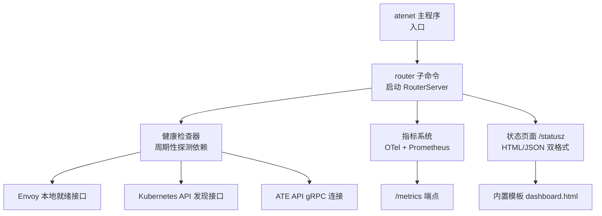
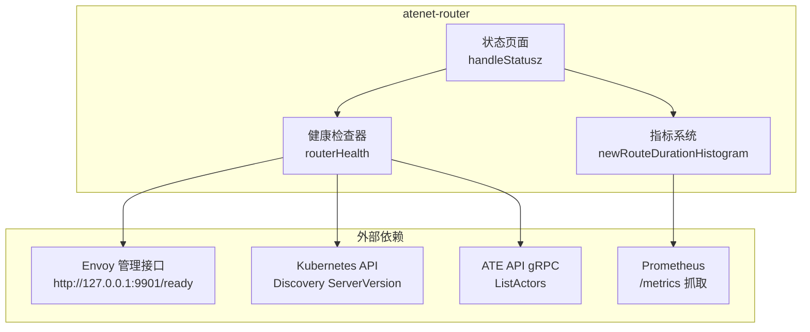
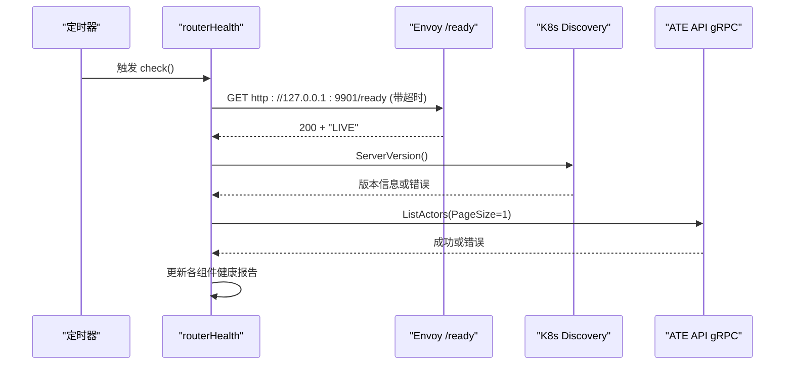
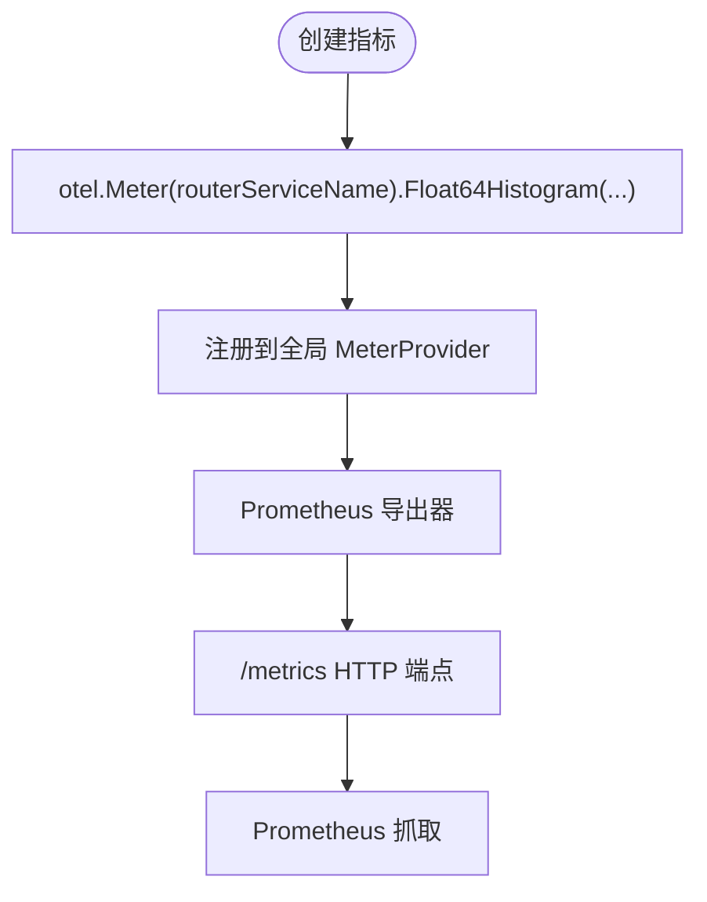
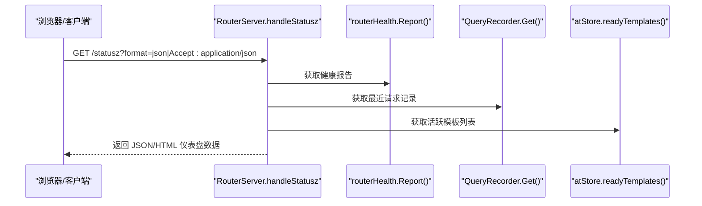
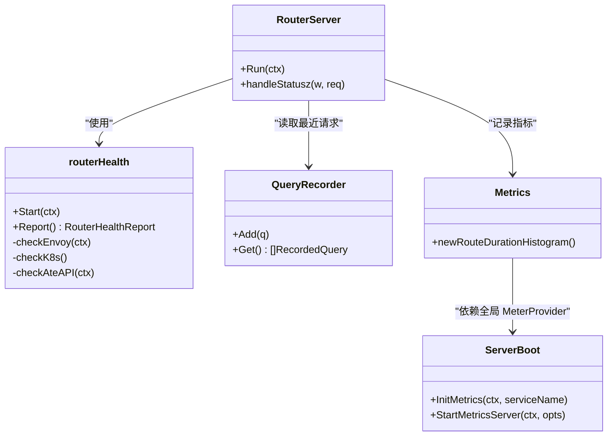
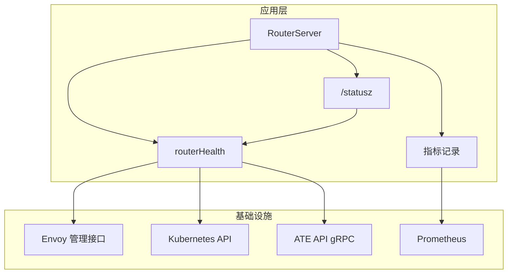

# 健康检查和监控

<cite>
**本文引用的文件**   
- [cmd/atenet/main.go](file://cmd/atenet/main.go)
- [cmd/atenet/internal/root.go](file://cmd/atenet/internal/root.go)
- [cmd/atenet/internal/router.go](file://cmd/atenet/internal/router.go)
- [cmd/atenet/internal/router/health.go](file://cmd/atenet/internal/router/health.go)
- [cmd/atenet/internal/router/metrics.go](file://cmd/atenet/internal/router/metrics.go)
- [cmd/atenet/internal/router/status.go](file://cmd/atenet/internal/router/status.go)
- [cmd/atenet/internal/router/dashboard.html](file://cmd/atenet/internal/router/dashboard.html)
- [cmd/atenet/internal/router/status_test.go](file://cmd/atenet/internal/router/status_test.go)
- [internal/serverboot/serverboot.go](file://internal/serverboot/serverboot.go)
- [manifests/ate-install/atenet-router-monitoring.yaml](file://manifests/ate-install/atenet-router-monitoring.yaml)
</cite>

## 目录
1. [简介](#简介)
2. [项目结构](#项目结构)
3. [核心组件](#核心组件)
4. [架构总览](#架构总览)
5. [详细组件分析](#详细组件分析)
6. [依赖关系分析](#依赖关系分析)
7. [性能与可观测性考量](#性能与可观测性考量)
8. [故障排查指南](#故障排查指南)
9. [结论](#结论)
10. [附录](#附录)

## 简介
本文件聚焦于 atenet 网络层（atenet-router）的健康检查机制与监控体系，覆盖以下方面：
- 健康检查实现原理：服务可用性检测、依赖组件状态监控、资源使用率检查策略。
- 监控指标收集与导出：Prometheus 指标定义、自定义度量标准、性能统计。
- Web 仪表板：实时状态展示、图表可视化、告警通知能力说明。
- 健康检查策略配置：检查间隔、超时设置、失败阈值等参数。
- 监控数据分析方法、告警规则建议与故障诊断工具。
- 提供架构图与数据流向图，展示可观测性体系的完整设计。

## 项目结构
atenet 作为统一网络守护进程，包含路由、DNS 等子命令；其中路由子命令负责 xDS、Envoy ExtProc 网关处理与健康检查、指标采集、状态页等服务。

**图示来源** 
- [cmd/atenet/main.go:19-21](file://cmd/atenet/main.go#L19-L21)
- [cmd/atenet/internal/root.go:39-42](file://cmd/atenet/internal/root.go#L39-L42)
- [cmd/atenet/internal/router.go:27-41](file://cmd/atenet/internal/router.go#L27-L41)
- [cmd/atenet/internal/router/health.go:74-89](file://cmd/atenet/internal/router/health.go#L74-L89)
- [cmd/atenet/internal/router/metrics.go:34-51](file://cmd/atenet/internal/router/metrics.go#L34-L51)
- [cmd/atenet/internal/router/status.go:180-281](file://cmd/atenet/internal/router/status.go#L180-L281)
- [cmd/atenet/internal/router/dashboard.html:1-459](file://cmd/atenet/internal/router/dashboard.html#L1-L459)

**章节来源**
- [cmd/atenet/main.go:19-21](file://cmd/atenet/main.go#L19-L21)
- [cmd/atenet/internal/root.go:39-42](file://cmd/atenet/internal/root.go#L39-L42)
- [cmd/atenet/internal/router.go:27-41](file://cmd/atenet/internal/router.go#L27-L41)

## 核心组件
- 健康检查器：周期性探测 Envoy、Kubernetes API、ATE API 的可用性与连通性，维护最近成功/失败时间与计数。
- 指标系统：基于 OpenTelemetry SDK 创建 Histogram 指标，并通过 Prometheus 导出器暴露 /metrics。
- 状态页面：/statusz 支持 HTML 与 JSON 两种输出，聚合运行信息、端口分配、健康报告、最近请求记录与模板列表。
- 监控集成：通过 serverboot 初始化 OTel Tracer/Meter Provider，并启动 Prometheus HTTP 服务器。

**章节来源**
- [cmd/atenet/internal/router/health.go:47-89](file://cmd/atenet/internal/router/health.go#L47-L89)
- [cmd/atenet/internal/router/metrics.go:24-51](file://cmd/atenet/internal/router/metrics.go#L24-L51)
- [cmd/atenet/internal/router/status.go:180-281](file://cmd/atenet/internal/router/status.go#L180-L281)
- [internal/serverboot/serverboot.go:121-193](file://internal/serverboot/serverboot.go#L121-L193)

## 架构总览
atenet-router 的可观测性由“健康检查 + 指标 + 状态页”三部分组成，并与外部系统（Envoy、Kubernetes API、ATE API、Prometheus）交互。

**图示来源** 
- [cmd/atenet/internal/router/health.go:149-208](file://cmd/atenet/internal/router/health.go#L149-L208)
- [cmd/atenet/internal/router/metrics.go:34-51](file://cmd/atenet/internal/router/metrics.go#L34-L51)
- [cmd/atenet/internal/router/status.go:180-281](file://cmd/atenet/internal/router/status.go#L180-L281)
- [internal/serverboot/serverboot.go:176-193](file://internal/serverboot/serverboot.go#L176-L193)

## 详细组件分析

### 健康检查器（routerHealth）
- 功能要点
  - 周期性执行健康检查，默认间隔可通过命令行参数调整。
  - 检查目标包括：
    - Envoy 本地就绪接口：HTTP GET /ready，期望响应体为 LIVE。
    - Kubernetes API：调用 Discovery ServerVersion，若未配置则跳过。
    - ATE API gRPC：调用 ListActors 以验证连通性。
  - 每次检查更新对应组件的健康状态、消息、最近成功/失败时间以及成功/失败计数。
  - 所有对外访问均带超时控制，避免阻塞。
- 关键流程
  - 启动后先立即执行一次检查，随后按固定间隔循环。
  - 并发安全：使用读写锁保护报告结构。
  - 日志：失败时记录错误上下文，便于定位问题。

**图示来源** 
- [cmd/atenet/internal/router/health.go:74-89](file://cmd/atenet/internal/router/health.go#L74-L89)
- [cmd/atenet/internal/router/health.go:149-208](file://cmd/atenet/internal/router/health.go#L149-L208)

**章节来源**
- [cmd/atenet/internal/router/health.go:47-89](file://cmd/atenet/internal/router/health.go#L47-L89)
- [cmd/atenet/internal/router/health.go:149-208](file://cmd/atenet/internal/router/health.go#L149-L208)

### 指标系统与导出（OTel + Prometheus）
- 自定义指标
  - 名称：atenet.router.route.duration
  - 类型：Float64Histogram
  - 单位：秒
  - 描述：从 ext_proc 接收请求到解析出目标 worker 端点的延迟（不含 Actor 执行与响应）。
  - 桶边界：细粒度毫秒级到数十秒，覆盖常见延迟分布。
- 导出方式
  - 通过 serverboot 初始化全局 MeterProvider，注册 Prometheus 导出器。
  - 启动独立 HTTP 服务器暴露 /metrics，供 Prometheus 抓取。
- 指标使用位置
  - 在路由处理路径中记录该直方图，用于评估路由阶段耗时。

**图示来源** 
- [cmd/atenet/internal/router/metrics.go:34-51](file://cmd/atenet/internal/router/metrics.go#L34-L51)
- [internal/serverboot/serverboot.go:121-147](file://internal/serverboot/serverboot.go#L121-L147)
- [internal/serverboot/serverboot.go:176-193](file://internal/serverboot/serverboot.go#L176-L193)

**章节来源**
- [cmd/atenet/internal/router/metrics.go:24-51](file://cmd/atenet/internal/router/metrics.go#L24-L51)
- [internal/serverboot/serverboot.go:121-193](file://internal/serverboot/serverboot.go#L121-L193)

### Web 仪表板（/statusz）
- 功能要点
  - 支持 HTML 与 JSON 两种返回格式，可通过 Accept 头或 format=json 参数切换。
  - 聚合信息包括：
    - 构建标签与服务 ClusterIP（如适用）。
    - 端口分配：Http、Xds、Extproc、Status。
    - 运行参数与 Flags。
    - 健康报告：Envoy、K8s API、ATE API 的状态、消息、成功/失败计数与最近成功时间。
    - 最近处理的请求记录（最多 N 条），含时间戳、客户端、Host、Path、Method、Action、Target、Duration。
    - 当前活跃的 ActorTemplates 列表。
  - 前端模板 dashboard.html 提供搜索过滤与自动刷新选项。
- 数据源
  - 健康报告来自 routerHealth.Report()。
  - 请求记录来自 extproc 的请求记录器（环形缓冲区）。
  - 模板列表来自 atStore.readyTemplates()。

**图示来源** 
- [cmd/atenet/internal/router/status.go:180-281](file://cmd/atenet/internal/router/status.go#L180-L281)
- [cmd/atenet/internal/router/dashboard.html:1-459](file://cmd/atenet/internal/router/dashboard.html#L1-L459)

**章节来源**
- [cmd/atenet/internal/router/status.go:132-171](file://cmd/atenet/internal/router/status.go#L132-171)
- [cmd/atenet/internal/router/status.go:180-281](file://cmd/atenet/internal/router/status.go#L180-L281)
- [cmd/atenet/internal/router/dashboard.html:1-459](file://cmd/atenet/internal/router/dashboard.html#L1-L459)
- [cmd/atenet/internal/router/status_test.go:92-144](file://cmd/atenet/internal/router/status_test.go#L92-L144)

### 健康检查策略配置
- 检查间隔
  - 通过 --health-interval 配置，默认 1 秒。
- 超时设置
  - Envoy 就绪检查：500ms 超时。
  - ATE API gRPC 检查：500ms 超时。
- 失败阈值
  - 当前实现未内置“连续失败次数”判定，仅记录 SuccessCount/FailureCount 与最近成功/失败时间。
  - 可在上层监控系统（如 Prometheus Alertmanager）基于这些计数与时间字段制定阈值告警。
- 其他相关端口与模式
  - --port-http、--port-xds、--port-extproc、--status-port 等影响服务暴露与可达性。
  - --standalone 模式下跳过 K8s 相关检查。

**章节来源**
- [cmd/atenet/internal/router.go:44-65](file://cmd/atenet/internal/router.go#L44-65)
- [cmd/atenet/internal/router/health.go:149-208](file://cmd/atenet/internal/router/health.go#L149-L208)

## 依赖关系分析
- 组件耦合
  - routerHealth 依赖 kubernetes.Interface 与 ateapipb.ControlClient，分别用于 K8s 与 ATE API 探测。
  - statusz 处理器依赖 routerHealth 的报告、extproc 的请求记录器与 atStore 的模板查询。
  - metrics 模块依赖全局 OTel MeterProvider，并由 serverboot 初始化。
- 外部依赖
  - Envoy 管理接口（本地 9901）。
  - Kubernetes API（Discovery）。
  - ATE API（gRPC）。
  - Prometheus（抓取 /metrics）。

**图示来源** 
- [cmd/atenet/internal/router/status.go:180-281](file://cmd/atenet/internal/router/status.go#L180-L281)
- [cmd/atenet/internal/router/health.go:47-89](file://cmd/atenet/internal/router/health.go#L47-L89)
- [cmd/atenet/internal/router/metrics.go:34-51](file://cmd/atenet/internal/router/metrics.go#L34-L51)
- [internal/serverboot/serverboot.go:121-193](file://internal/serverboot/serverboot.go#L121-L193)

**章节来源**
- [cmd/atenet/internal/router/status.go:180-281](file://cmd/atenet/internal/router/status.go#L180-L281)
- [cmd/atenet/internal/router/health.go:47-89](file://cmd/atenet/internal/router/health.go#L47-L89)
- [cmd/atenet/internal/router/metrics.go:34-51](file://cmd/atenet/internal/router/metrics.go#L34-L51)
- [internal/serverboot/serverboot.go:121-193](file://internal/serverboot/serverboot.go#L121-L193)

## 性能与可观测性考量
- 指标粒度与桶边界
  - 路由阶段延迟直方图采用多段桶边界，兼顾低延迟场景与长尾分布。
- 健康检查开销
  - 短超时与轻量探测（HTTP GET、gRPC 最小请求）降低对业务流量的影响。
- 状态页负载
  - 最近请求记录采用环形缓冲，限制内存占用；模板列表按需查询。
- 外部监控集成
  - 通过 PodMonitoring 抓取 Envoy 的 /stats/prometheus，补充端到端上下文指标（非 SLI 指标）。

[本节为通用指导，不直接分析具体文件]

## 故障排查指南
- 快速定位
  - 访问 /statusz（HTML/JSON）查看健康报告、端口分配、最近请求与模板列表。
  - 关注健康报告中各组件的 Message 与 LastSuccess/LastFailure 时间。
- 常见问题
  - Envoy 就绪失败：确认本地 9901 端口可达且响应体为 LIVE。
  - K8s API 不可达：检查 kubeconfig 与网络连通性；standalone 模式会跳过此检查。
  - ATE API 不可用：确认地址、认证模式与证书/令牌配置正确。
- 指标与日志
  - 抓取 /metrics 查看 atenet.router.route.duration 分布。
  - 结合 slog 日志中的健康检查失败上下文进行根因分析。
- 测试验证
  - 参考状态页集成测试用例，验证 JSON 输出结构与字段完整性。

**章节来源**
- [cmd/atenet/internal/router/status_test.go:92-144](file://cmd/atenet/internal/router/status_test.go#L92-L144)
- [cmd/atenet/internal/router/health.go:149-208](file://cmd/atenet/internal/router/health.go#L149-L208)
- [internal/serverboot/serverboot.go:176-193](file://internal/serverboot/serverboot.go#L176-L193)

## 结论
atenet-router 的健康检查与监控体系围绕“轻量探测 + 标准化指标 + 直观状态页”展开：
- 健康检查覆盖关键依赖，具备超时与计数能力，便于上层告警。
- 指标系统遵循 OTel 规范，提供路由阶段延迟直方图，并通过 Prometheus 导出。
- 状态页提供一站式运维视图，支持 HTML/JSON 双格式与前端过滤刷新。
- 配合 PodMonitoring 抓取 Envoy 指标，形成端到端可观测闭环。

[本节为总结性内容，不直接分析具体文件]

## 附录

### 监控架构图与数据流向图

**图示来源** 
- [cmd/atenet/internal/router/health.go:149-208](file://cmd/atenet/internal/router/health.go#L149-L208)
- [cmd/atenet/internal/router/status.go:180-281](file://cmd/atenet/internal/router/status.go#L180-L281)
- [cmd/atenet/internal/router/metrics.go:34-51](file://cmd/atenet/internal/router/metrics.go#L34-L51)
- [internal/serverboot/serverboot.go:176-193](file://internal/serverboot/serverboot.go#L176-L193)

### 告警规则建议（概念性）
- 健康失败比率：基于 SuccessCount/FailureCount 计算失败率，超过阈值触发告警。
- 最近成功时间：LastSuccess 长时间未更新表示持续不可用。
- 路由延迟：基于 atenet.router.route.duration 的 P95/P99 分位数设定阈值。
- 外部指标：结合 Envoy 的下游请求延迟直方图进行端到端异常检测。

[本节为概念性建议，不直接分析具体文件]

### 配置文件与清单
- 环境变量与 CLI 参数
  - --health-interval：健康检查间隔。
  - --metrics-listen-addr：Prometheus 指标监听地址。
  - --port-http/--port-xds/--port-extproc/--status-port：服务端口。
  - --standalone：是否跳过 K8s 相关检查。
- 监控抓取清单
  - PodMonitoring 抓取 Envoy 的 /stats/prometheus，补充端到端上下文。

**章节来源**
- [cmd/atenet/internal/router.go:44-65](file://cmd/atenet/internal/router.go#L44-65)
- [manifests/ate-install/atenet-router-monitoring.yaml:15-36](file://manifests/ate-install/atenet-router-monitoring.yaml#L15-L36)
