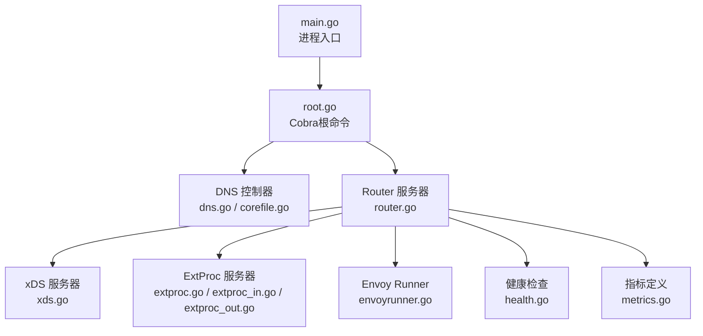
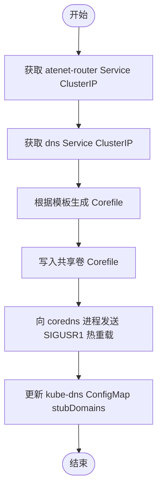
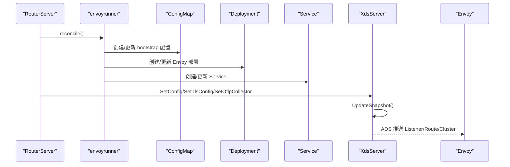
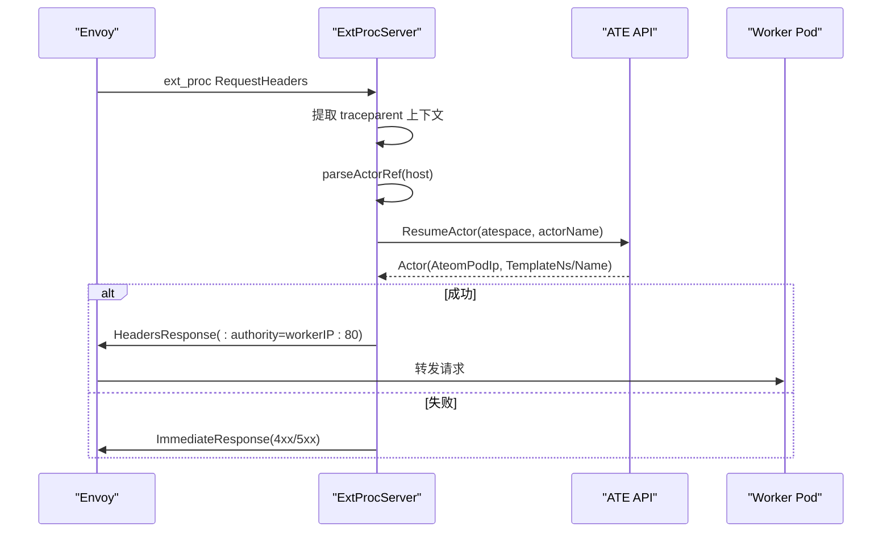
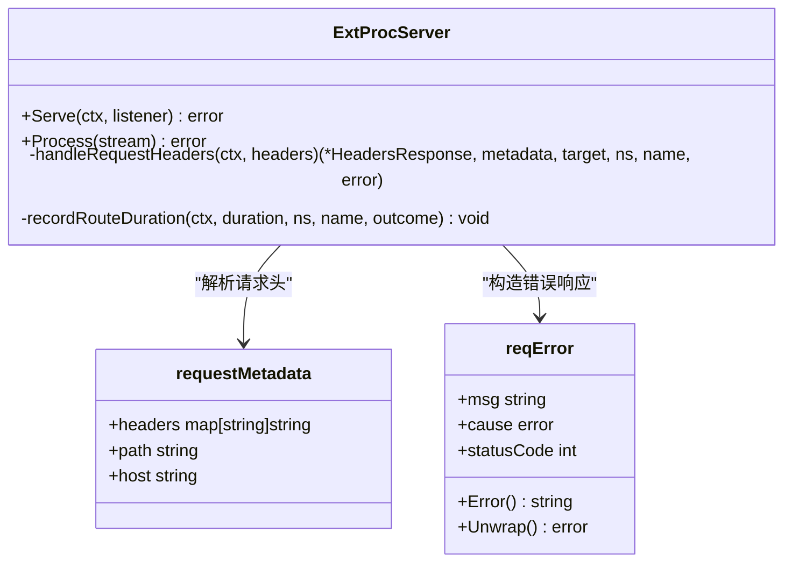
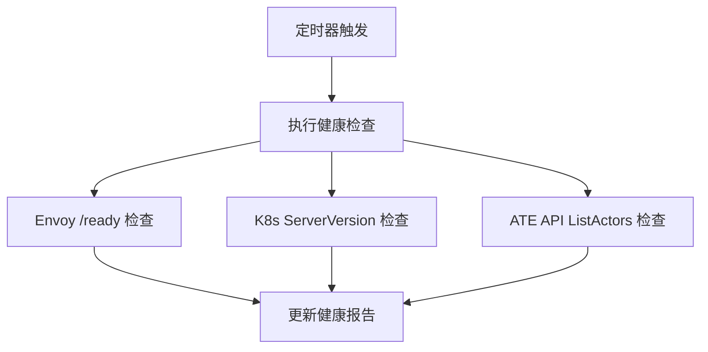
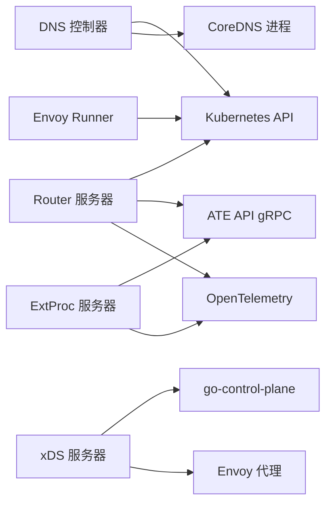

# 网络层 (atenet)

<cite>
**本文引用的文件**   
- [cmd/atenet/main.go](file://cmd/atenet/main.go)
- [cmd/atenet/internal/root.go](file://cmd/atenet/internal/root.go)
- [cmd/atenet/internal/dns/dns.go](file://cmd/atenet/internal/dns/dns.go)
- [cmd/atenet/internal/dns/corefile.go](file://cmd/atenet/internal/dns/corefile.go)
- [cmd/atenet/internal/router/router.go](file://cmd/atenet/internal/router/router.go)
- [cmd/atenet/internal/router/xds.go](file://cmd/atenet/internal/router/xds.go)
- [cmd/atenet/internal/router/envoyrunner.go](file://cmd/atenet/internal/router/envoyrunner.go)
- [cmd/atenet/internal/router/extproc.go](file://cmd/atenet/internal/router/extproc.go)
- [cmd/atenet/internal/router/extproc_in.go](file://cmd/atenet/internal/router/extproc_in.go)
- [cmd/atenet/internal/router/extproc_out.go](file://cmd/atenet/internal/router/extproc_out.go)
- [cmd/atenet/internal/router/health.go](file://cmd/atenet/internal/router/health.go)
- [cmd/atenet/internal/router/metrics.go](file://cmd/atenet/internal/router/metrics.go)
- [manifests/ate-install/atenet-dns.yaml](file://manifests/ate-install/atenet-dns.yaml)
</cite>

## 目录
1. [简介](#简介)
2. [项目结构](#项目结构)
3. [核心组件](#核心组件)
4. [架构总览](#架构总览)
5. [详细组件分析](#详细组件分析)
6. [依赖关系分析](#依赖关系分析)
7. [性能与优化建议](#性能与优化建议)
8. [故障排查指南](#故障排查指南)
9. [结论](#结论)
10. [附录：配置与指标](#附录配置与指标)

## 简介
本文件系统性阐述 atenet 网络层的架构设计与实现细节，覆盖以下关键主题：
- DNS 服务：Corefile 动态生成、域名解析规则、与 kube-dns 的集成。
- Envoy 代理：动态配置更新、xDS 协议支持、负载均衡策略、TLS 与追踪。
- 路由系统：请求转发规则、健康检查机制、错误分类与可观测性。
- ExtProc 扩展程序：请求拦截、响应处理、元数据传递与链路追踪。
- 配置选项、性能优化建议与监控指标说明。
- 提供网络拓扑图与数据流图，帮助理解组件交互。

## 项目结构
atenet 是一个组合型守护进程，提供 DNS 控制面与 Router（含 xDS 与 ExtProc）两大子系统。入口命令通过 Cobra 注册子命令，分别启动 DNS 控制器与 Router 服务。



**图表来源**
- [cmd/atenet/main.go:15-22](file://cmd/atenet/main.go#L15-L22)
- [cmd/atenet/internal/root.go:25-43](file://cmd/atenet/internal/root.go#L25-L43)
- [cmd/atenet/internal/dns/dns.go:42-69](file://cmd/atenet/internal/dns/dns.go#L42-L69)
- [cmd/atenet/internal/dns/corefile.go:25-65](file://cmd/atenet/internal/dns/corefile.go#L25-L65)
- [cmd/atenet/internal/router/router.go:93-150](file://cmd/atenet/internal/router/router.go#L93-L150)
- [cmd/atenet/internal/router/xds.go:71-104](file://cmd/atenet/internal/router/xds.go#L71-L104)
- [cmd/atenet/internal/router/envoyrunner.go:36-64](file://cmd/atenet/internal/router/envoyrunner.go#L36-L64)
- [cmd/atenet/internal/router/health.go:47-89](file://cmd/atenet/internal/router/health.go#L47-L89)
- [cmd/atenet/internal/router/metrics.go:24-51](file://cmd/atenet/internal/router/metrics.go#L24-L51)

**章节来源**
- [cmd/atenet/main.go:15-22](file://cmd/atenet/main.go#L15-L22)
- [cmd/atenet/internal/root.go:25-43](file://cmd/atenet/internal/root.go#L25-L43)

## 核心组件
- DNS 控制器：周期性拉取集群资源，动态生成 CoreDNS 的 Corefile，并触发 CoreDNS 热重载；同时维护 kube-dns 的 stubDomains 以将自定义域指向 ate-system 的 DNS 服务。
- Router 服务器：协调 xDS 服务器、ExtProc 服务器、健康检查、指标与可选的 Envoy 部署管理。
- xDS 服务器：基于 go-control-plane 实现聚合发现服务，向 Envoy 推送 Listener/Route/Cluster 等快照。
- ExtProc 服务器：在请求头阶段拦截，解析 Host 到 Actor 引用，调用 ATE API 获取 Worker IP，改写 :authority 完成动态转发。
- Envoy Runner：在 Kubernetes 中创建/更新 ConfigMap、Deployment、Service，使 Envoy 通过 xDS 动态获取配置。
- 健康检查：周期探测 Envoy、Kubernetes API、ATE API 的健康状态。
- 指标：记录路由耗时直方图等可观测性数据。

**章节来源**
- [cmd/atenet/internal/dns/dns.go:42-117](file://cmd/atenet/internal/dns/dns.go#L42-L117)
- [cmd/atenet/internal/dns/corefile.go:25-65](file://cmd/atenet/internal/dns/corefile.go#L25-L65)
- [cmd/atenet/internal/router/router.go:93-150](file://cmd/atenet/internal/router/router.go#L93-L150)
- [cmd/atenet/internal/router/xds.go:71-104](file://cmd/atenet/internal/router/xds.go#L71-L104)
- [cmd/atenet/internal/router/extproc.go:38-78](file://cmd/atenet/internal/router/extproc.go#L38-L78)
- [cmd/atenet/internal/router/envoyrunner.go:36-64](file://cmd/atenet/internal/router/envoyrunner.go#L36-L64)
- [cmd/atenet/internal/router/health.go:47-89](file://cmd/atenet/internal/router/health.go#L47-L89)
- [cmd/atenet/internal/router/metrics.go:24-51](file://cmd/atenet/internal/router/metrics.go#L24-L51)

## 架构总览
整体数据流：客户端请求经 DNS 解析到 Router 服务，由 Envoy 作为入站网关，通过 xDS 动态配置，进入 ExtProc 进行请求头处理与路由决策，最终转发至目标 Actor 工作节点。

```mermaid
graph TB
subgraph "外部"
Client["客户端"]
end
subgraph "DNS 层"
KubeDNS["kube-dns<br/>stubDomains"]
CoreDNS["CoreDNS<br/>Corefile 模板匹配"]
end
subgraph "Router 子系统"
Envoy["Envoy 代理<br/>HTTP/HTTPS 监听"]
XDS["xDS 服务器<br/>Snapshot 推送"]
ExtProc["ExtProc 服务器<br/>请求头处理"]
Health["健康检查"]
Metrics["指标采集"]
end
subgraph "后端"
AteAPI["ATE API gRPC"]
Worker["Actor 工作节点 Pod"]
end
Client --> |DNS 查询| KubeDNS
KubeDNS --> |Stub 转发| CoreDNS
CoreDNS --> |返回 Router ClusterIP| Client
Client --> |HTTP/HTTPS| Envoy
Envoy <- --> |xDS ADS/CDS/RDS/LDS| XDS
Envoy --> |ext_proc 请求头| ExtProc
ExtProc --> |ResumeActor| AteAPI
ExtProc --> |设置 :authority| Envoy
Envoy --> |转发| Worker
Health --> Envoy
Health --> AteAPI
Metrics --> ExtProc
```

**图表来源**
- [cmd/atenet/internal/dns/dns.go:71-117](file://cmd/atenet/internal/dns/dns.go#L71-L117)
- [cmd/atenet/internal/dns/corefile.go:32-65](file://cmd/atenet/internal/dns/corefile.go#L32-L65)
- [cmd/atenet/internal/router/xds.go:148-194](file://cmd/atenet/internal/router/xds.go#L148-L194)
- [cmd/atenet/internal/router/extproc.go:80-128](file://cmd/atenet/internal/router/extproc.go#L80-L128)
- [cmd/atenet/internal/router/health.go:91-147](file://cmd/atenet/internal/router/health.go#L91-L147)
- [cmd/atenet/internal/router/metrics.go:24-51](file://cmd/atenet/internal/router/metrics.go#L24-L51)

## 详细组件分析

### DNS 控制器与 Corefile 生成
- 控制器循环拉取 ate-system 命名空间下的 atenet-router Service 与 dns Service，获取其 ClusterIP。
- 使用模板生成 Corefile，启用 log、errors、health、ready、reload 插件，并通过 template IN A 指令对 <actor>.<atespace>.actors.resources.substrate.ate.dev 模式进行正则匹配，统一返回 Router 的 ClusterIP。
- 将生成的 Corefile 写入共享卷，并向 coredns 进程发送 SIGUSR1 触发热重载。
- 同步 kube-system 下 kube-dns 的 ConfigMap，为 actors.resources.substrate.ate.dev 添加 stubDomains 指向 ate-system:dns 的 ClusterIP。



**图表来源**
- [cmd/atenet/internal/dns/dns.go:71-117](file://cmd/atenet/internal/dns/dns.go#L71-L117)
- [cmd/atenet/internal/dns/dns.go:119-141](file://cmd/atenet/internal/dns/dns.go#L119-L141)
- [cmd/atenet/internal/dns/dns.go:144-189](file://cmd/atenet/internal/dns/dns.go#L144-L189)
- [cmd/atenet/internal/dns/corefile.go:32-65](file://cmd/atenet/internal/dns/corefile.go#L32-L65)

**章节来源**
- [cmd/atenet/internal/dns/dns.go:50-117](file://cmd/atenet/internal/dns/dns.go#L50-L117)
- [cmd/atenet/internal/dns/dns.go:119-189](file://cmd/atenet/internal/dns/dns.go#L119-L189)
- [cmd/atenet/internal/dns/corefile.go:25-65](file://cmd/atenet/internal/dns/corefile.go#L25-L65)
- [manifests/ate-install/atenet-dns.yaml:74-131](file://manifests/ate-install/atenet-dns.yaml#L74-L131)

### Envoy 代理集成与 xDS 动态配置
- Envoy Runner 负责在 Kubernetes 中创建/更新：
  - ConfigMap：包含 Envoy bootstrap 配置，指定 ADS 连接至 atenet-router 的 xDS 端口。
  - Deployment：运行 Envoy 容器，挂载 ConfigMap，暴露 HTTP 与 Admin 端口。
  - Service：ClusterIP 类型，对外暴露 HTTP 端口。
- xDS 服务器提供聚合发现服务，构建 Snapshot 并推送给 Envoy：
  - Clusters：本地 ExtProc 集群、动态转发代理集群、可选 OTLP Collector 集群。
  - Routes：前缀匹配“/”路由到 dynamic_forward_proxy_cluster。
  - Listeners：HTTP 监听器，可选 HTTPS 监听器（支持证书路径或内联内容）。
  - HCM 过滤器链：ext_proc -> dynamic_forward_proxy -> router，开启访问日志与可选 OpenTelemetry 追踪。
- 负载均衡策略：ExtProc 集群采用 ROUND_ROBIN；OTLP 集群同样为 ROUND_ROBIN。



**图表来源**
- [cmd/atenet/internal/router/envoyrunner.go:50-137](file://cmd/atenet/internal/router/envoyrunner.go#L50-L137)
- [cmd/atenet/internal/router/envoyrunner.go:139-222](file://cmd/atenet/internal/router/envoyrunner.go#L139-L222)
- [cmd/atenet/internal/router/envoyrunner.go:224-258](file://cmd/atenet/internal/router/envoyrunner.go#L224-L258)
- [cmd/atenet/internal/router/xds.go:148-194](file://cmd/atenet/internal/router/xds.go#L148-L194)
- [cmd/atenet/internal/router/xds.go:227-272](file://cmd/atenet/internal/router/xds.go#L227-L272)
- [cmd/atenet/internal/router/xds.go:336-355](file://cmd/atenet/internal/router/xds.go#L336-L355)
- [cmd/atenet/internal/router/xds.go:357-384](file://cmd/atenet/internal/router/xds.go#L357-L384)
- [cmd/atenet/internal/router/xds.go:503-531](file://cmd/atenet/internal/router/xds.go#L503-L531)
- [cmd/atenet/internal/router/xds.go:533-576](file://cmd/atenet/internal/router/xds.go#L533-L576)

**章节来源**
- [cmd/atenet/internal/router/envoyrunner.go:36-64](file://cmd/atenet/internal/router/envoyrunner.go#L36-L64)
- [cmd/atenet/internal/router/envoyrunner.go:66-137](file://cmd/atenet/internal/router/envoyrunner.go#L66-L137)
- [cmd/atenet/internal/router/envoyrunner.go:139-222](file://cmd/atenet/internal/router/envoyrunner.go#L139-L222)
- [cmd/atenet/internal/router/envoyrunner.go:224-258](file://cmd/atenet/internal/router/envoyrunner.go#L224-L258)
- [cmd/atenet/internal/router/xds.go:71-104](file://cmd/atenet/internal/router/xds.go#L71-L104)
- [cmd/atenet/internal/router/xds.go:148-194](file://cmd/atenet/internal/router/xds.go#L148-L194)
- [cmd/atenet/internal/router/xds.go:227-272](file://cmd/atenet/internal/router/xds.go#L227-L272)
- [cmd/atenet/internal/router/xds.go:336-355](file://cmd/atenet/internal/router/xds.go#L336-L355)
- [cmd/atenet/internal/router/xds.go:357-384](file://cmd/atenet/internal/router/xds.go#L357-L384)
- [cmd/atenet/internal/router/xds.go:386-466](file://cmd/atenet/internal/router/xds.go#L386-L466)
- [cmd/atenet/internal/router/xds.go:503-576](file://cmd/atenet/internal/router/xds.go#L503-L576)

### 路由系统与请求转发逻辑
- 路由入口：Envoy 监听 HTTP/HTTPS，HCM 过滤器链顺序为 ext_proc -> dynamic_forward_proxy -> router。
- 动态转发：dynamic_forward_proxy 根据请求 Host 解析上游地址，结合 DNS 缓存配置提升性能。
- ExtProc 处理流程：
  - 从 ProcessingRequest 中提取 traceparent 上下文，建立跨组件链路。
  - 解析 Host 得到 atespace 与 actorName，调用 ATE API ResumeActor 获取 Worker Pod IP。
  - 若解析失败或无有效 IP，构造 reqError 并返回即时响应（如 404/500），否则设置 :authority 为 workerIP:80。
  - 记录路由耗时直方图，按 outcome 分类（ok/cancelled/not_found/error）。



**图表来源**
- [cmd/atenet/internal/router/xds.go:386-466](file://cmd/atenet/internal/router/xds.go#L386-L466)
- [cmd/atenet/internal/router/extproc.go:80-128](file://cmd/atenet/internal/router/extproc.go#L80-L128)
- [cmd/atenet/internal/router/extproc.go:130-188](file://cmd/atenet/internal/router/extproc.go#L130-L188)
- [cmd/atenet/internal/router/extproc_in.go:25-57](file://cmd/atenet/internal/router/extproc_in.go#L25-L57)
- [cmd/atenet/internal/router/extproc_out.go:23-67](file://cmd/atenet/internal/router/extproc_out.go#L23-L67)

**章节来源**
- [cmd/atenet/internal/router/xds.go:357-384](file://cmd/atenet/internal/router/xds.go#L357-L384)
- [cmd/atenet/internal/router/extproc.go:80-128](file://cmd/atenet/internal/router/extproc.go#L80-L128)
- [cmd/atenet/internal/router/extproc.go:130-188](file://cmd/atenet/internal/router/extproc.go#L130-L188)
- [cmd/atenet/internal/router/extproc_in.go:25-57](file://cmd/atenet/internal/router/extproc_in.go#L25-L57)
- [cmd/atenet/internal/router/extproc_out.go:23-67](file://cmd/atenet/internal/router/extproc_out.go#L23-L67)

### ExtProc 扩展程序实现细节
- 请求拦截：仅处理 RequestHeaders 阶段，其他阶段忽略并记录异常日志。
- 元数据传递：从 HTTP 头提取 path、host、traceparent，注入到 OpenTelemetry 上下文，确保链路完整。
- 响应处理：
  - 成功：返回 HeaderMutation 修改 :authority。
  - 失败：返回 ImmediateResponse，携带文本体与 content-type:text/plain。
- 错误模型：reqError 封装 HTTP 状态码与消息，保留 cause 用于日志，不泄露敏感信息。
- 指标记录：routeDuration 直方图，标签包括模板命名空间、名称与 outcome。



**图表来源**
- [cmd/atenet/internal/router/extproc.go:38-78](file://cmd/atenet/internal/router/extproc.go#L38-L78)
- [cmd/atenet/internal/router/extproc.go:80-128](file://cmd/atenet/internal/router/extproc.go#L80-L128)
- [cmd/atenet/internal/router/extproc.go:130-188](file://cmd/atenet/internal/router/extproc.go#L130-L188)
- [cmd/atenet/internal/router/extproc_in.go:25-57](file://cmd/atenet/internal/router/extproc_in.go#L25-L57)
- [cmd/atenet/internal/router/extproc_out.go:23-67](file://cmd/atenet/internal/router/extproc_out.go#L23-L67)

**章节来源**
- [cmd/atenet/internal/router/extproc.go:38-78](file://cmd/atenet/internal/router/extproc.go#L38-L78)
- [cmd/atenet/internal/router/extproc.go:80-128](file://cmd/atenet/internal/router/extproc.go#L80-L128)
- [cmd/atenet/internal/router/extproc.go:130-188](file://cmd/atenet/internal/router/extproc.go#L130-L188)
- [cmd/atenet/internal/router/extproc_in.go:25-57](file://cmd/atenet/internal/router/extproc_in.go#L25-L57)
- [cmd/atenet/internal/router/extproc_out.go:23-67](file://cmd/atenet/internal/router/extproc_out.go#L23-L67)

### 健康检查机制
- 周期任务：每间隔检查一次，立即执行一次初始检查。
- 检查项：
  - Envoy：HTTP GET /ready，期望返回 LIVE。
  - Kubernetes API：Discovery ServerVersion。
  - ATE API：ListActors 最小页大小调用。
- 报告：内部维护 RouterHealthReport，供 /statusz 页面展示。



**图表来源**
- [cmd/atenet/internal/router/health.go:74-89](file://cmd/atenet/internal/router/health.go#L74-L89)
- [cmd/atenet/internal/router/health.go:91-147](file://cmd/atenet/internal/router/health.go#L91-L147)
- [cmd/atenet/internal/router/health.go:149-208](file://cmd/atenet/internal/router/health.go#L149-L208)

**章节来源**
- [cmd/atenet/internal/router/health.go:47-89](file://cmd/atenet/internal/router/health.go#L47-L89)
- [cmd/atenet/internal/router/health.go:91-147](file://cmd/atenet/internal/router/health.go#L91-L147)
- [cmd/atenet/internal/router/health.go:149-208](file://cmd/atenet/internal/router/health.go#L149-L208)

## 依赖关系分析
- DNS 控制器依赖 Kubernetes API 读取 Service 与 ConfigMap，并通过进程信号通知 CoreDNS 热重载。
- Router 服务器依赖：
  - Kubernetes API（可选，standalone 模式可通过文件存储替代）。
  - ATE API gRPC（用于 ResumeActor 与列表操作）。
  - OpenTelemetry（Tracing/Metrics）。
- xDS 服务器依赖 go-control-plane 库，向 Envoy 推送配置。
- Envoy Runner 依赖 Kubernetes API 管理 Deployment/Service/ConfigMap。
- ExtProc 服务器依赖 ATE API 与 OpenTelemetry。



**图表来源**
- [cmd/atenet/internal/dns/dns.go:71-117](file://cmd/atenet/internal/dns/dns.go#L71-L117)
- [cmd/atenet/internal/router/router.go:106-150](file://cmd/atenet/internal/router/router.go#L106-L150)
- [cmd/atenet/internal/router/xds.go:71-104](file://cmd/atenet/internal/router/xds.go#L71-L104)
- [cmd/atenet/internal/router/envoyrunner.go:36-64](file://cmd/atenet/internal/router/envoyrunner.go#L36-L64)
- [cmd/atenet/internal/router/extproc.go:38-78](file://cmd/atenet/internal/router/extproc.go#L38-L78)

**章节来源**
- [cmd/atenet/internal/dns/dns.go:71-117](file://cmd/atenet/internal/dns/dns.go#L71-L117)
- [cmd/atenet/internal/router/router.go:106-150](file://cmd/atenet/internal/router/router.go#L106-L150)
- [cmd/atenet/internal/router/xds.go:71-104](file://cmd/atenet/internal/router/xds.go#L71-L104)
- [cmd/atenet/internal/router/envoyrunner.go:36-64](file://cmd/atenet/internal/router/envoyrunner.go#L36-L64)
- [cmd/atenet/internal/router/extproc.go:38-78](file://cmd/atenet/internal/router/extproc.go#L38-L78)

## 性能与优化建议
- DNS 解析：
  - 合理设置 CoreDNS 的 reload 频率与模板匹配范围，避免过大正则导致解析延迟。
  - 利用 kube-dns 的 stubDomains 减少跨命名空间解析开销。
- Envoy 配置：
  - 启用 dynamic_forward_proxy 的 DNS 缓存，降低上游解析次数。
  - 调整 ext_proc 的 MessageTimeout 与超时阈值，避免长尾请求阻塞。
  - 按需开启 HTTPS 监听与 TLS 证书，生产环境建议使用外部证书管理。
- 路由与 ExtProc：
  - 限制请求头处理阶段的日志输出，避免敏感信息泄露与高吞吐场景下的 IO 压力。
  - 使用合适的采样策略与下游 NeverSample 策略配合，控制追踪开销。
- 指标与可观测性：
  - 关注 atenet.router.route.duration 直方图，定位热点模板与异常分支。
  - 结合健康检查报告快速定位 Envoy/K8s/ATE API 问题。

[本节为通用指导，无需具体文件引用]

## 故障排查指南
- DNS 未生效：
  - 确认 CoreDNS Corefile 已更新且进程收到 SIGUSR1。
  - 检查 kube-dns ConfigMap 的 stubDomains 是否包含自定义后缀与 DNS 服务 IP。
- Envoy 无法连接 xDS：
  - 检查 ConfigMap 中的 xds_cluster 端点是否正确指向 atenet-router 的 xDS 端口。
  - 查看 Envoy 日志与 /ready 状态。
- ExtProc 返回 404/500：
  - 检查 Host 是否符合 <actor>.<atespace>.actors.resources.substrate.ate.dev 格式。
  - 核对 ATE API 连通性与 ResumeActor 返回结果。
- 健康检查失败：
  - 查看 Router 健康报告，逐项检查 Envoy、K8s、ATE API 的状态与最近失败时间。

**章节来源**
- [cmd/atenet/internal/dns/dns.go:119-189](file://cmd/atenet/internal/dns/dns.go#L119-L189)
- [cmd/atenet/internal/router/envoyrunner.go:66-137](file://cmd/atenet/internal/router/envoyrunner.go#L66-L137)
- [cmd/atenet/internal/router/extproc.go:80-128](file://cmd/atenet/internal/router/extproc.go#L80-L128)
- [cmd/atenet/internal/router/health.go:91-147](file://cmd/atenet/internal/router/health.go#L91-L147)

## 结论
atenet 网络层通过 DNS 控制器与 Router 子系统协同工作，实现了基于 xDS 的动态路由与可扩展的请求处理管道。DNS 层将特定域名解析到 Router，Envoy 作为高性能网关，ExtProc 在请求头阶段完成 Actor 定位与转发决策，辅以健康检查与指标采集，形成稳定、可观测的网络基础设施。

[本节为总结性内容，无需具体文件引用]

## 附录：配置与指标
- Router 配置项（部分）：
  - Standalone：是否独立运行（不使用 K8s 对象）。
  - Namespace：Envoy 相关资源所在命名空间。
  - HttpPort/XdsPort/ExtprocPort/HttpsPort：监听端口。
  - EnvoyImage：Envoy 镜像。
  - OtlpCollectorAddress：Envoy 侧追踪上报地址。
  - AteapiAuthMode/AteapiCAFile/AteapiServerName/AteapiTokenFile：ATE API 认证参数。
- 指标：
  - atenet.router.route.duration：ExtProc 处理请求头的耗时直方图，标签包含模板命名空间、名称与 outcome。
- 部署清单：
  - DNS 相关资源（Deployment/Service/Role/RoleBinding/ConfigMap）位于 manifests/ate-install/atenet-dns.yaml。

**章节来源**
- [cmd/atenet/internal/router/router.go:65-91](file://cmd/atenet/internal/router/router.go#L65-L91)
- [cmd/atenet/internal/router/metrics.go:24-51](file://cmd/atenet/internal/router/metrics.go#L24-L51)
- [manifests/ate-install/atenet-dns.yaml:15-73](file://manifests/ate-install/atenet-dns.yaml#L15-L73)
