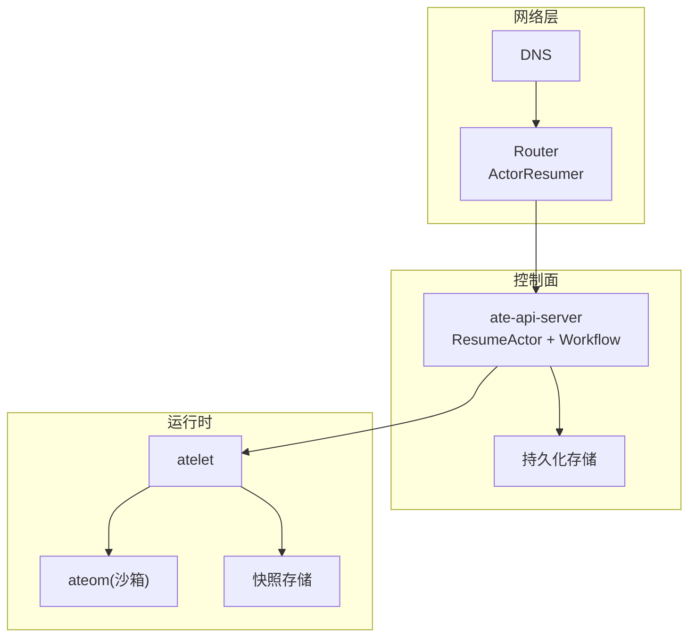
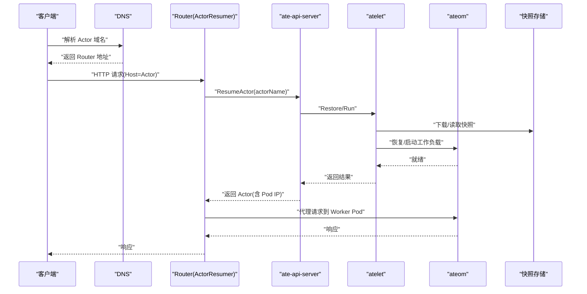
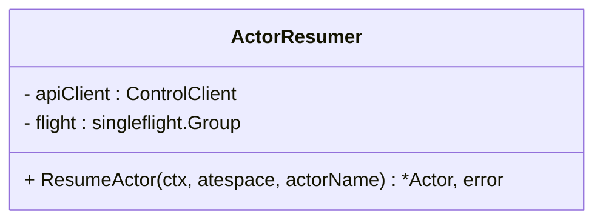
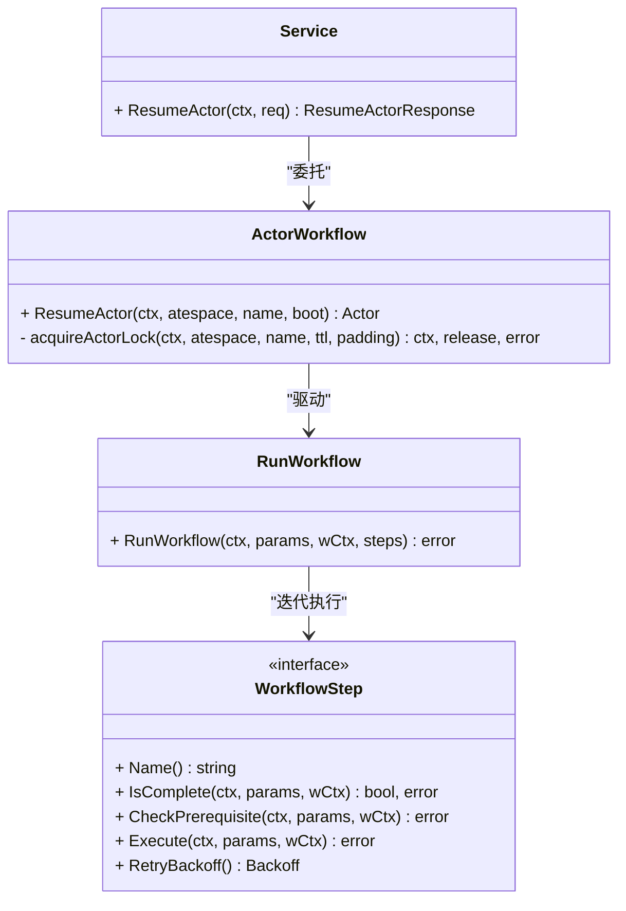
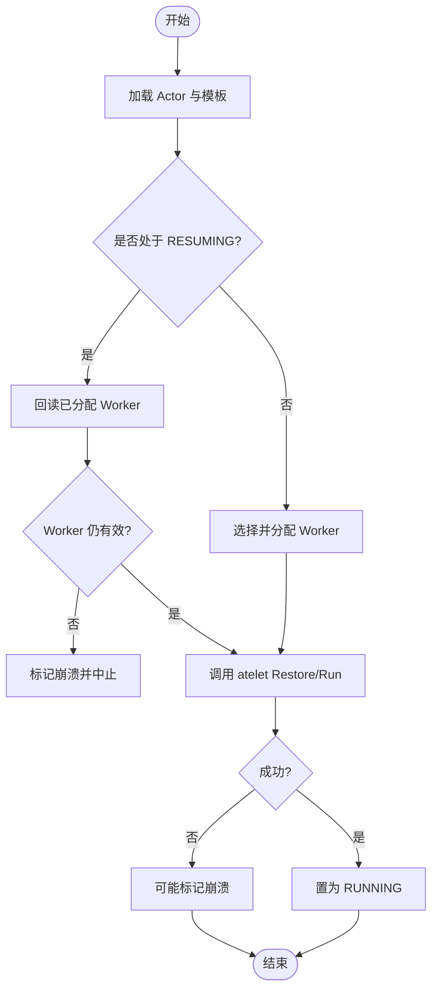
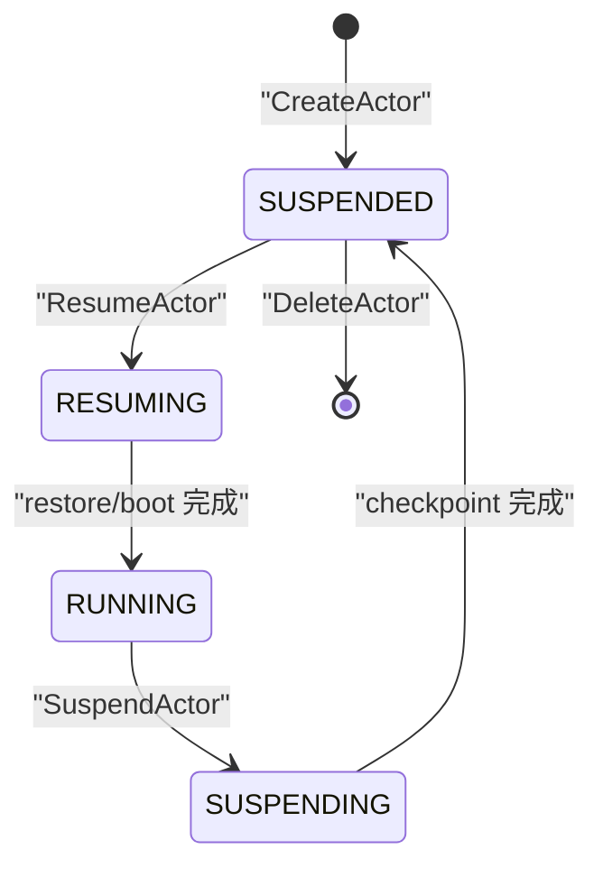
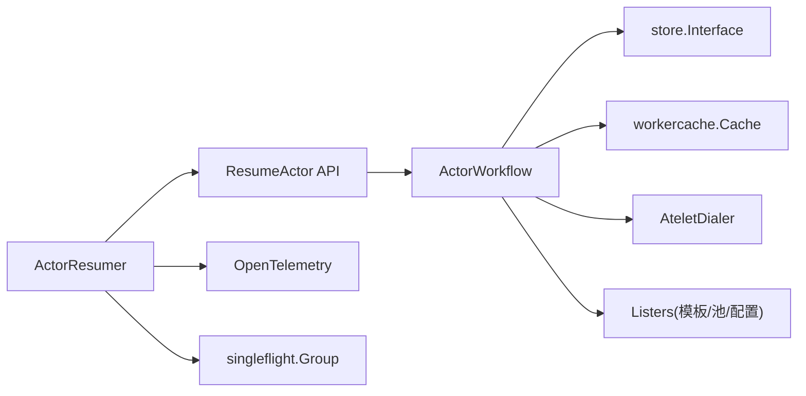
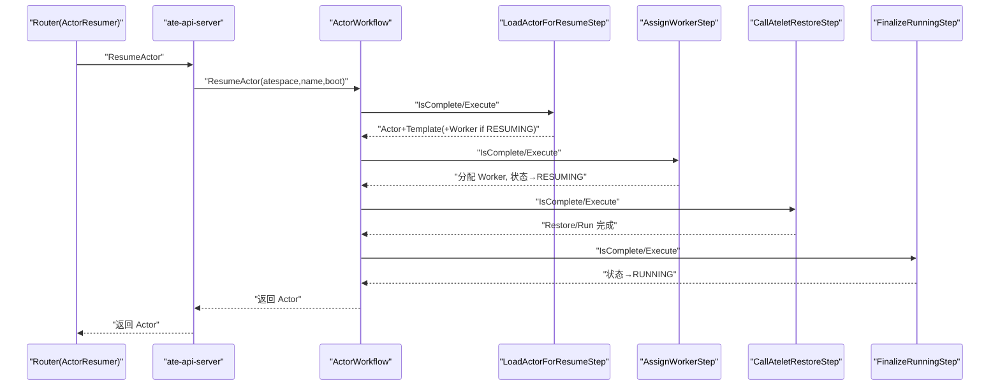

# 唤醒恢复系统

<cite>
**本文引用的文件**   
- [resumer.go](file://cmd/atenet/internal/router/resumer.go)
- [resume_actor.go](file://cmd/ateapi/internal/controlapi/resume_actor.go)
- [workflow_resume.go](file://cmd/ateapi/internal/controlapi/workflow_resume.go)
- [workflow.go](file://cmd/ateapi/internal/controlapi/workflow.go)
- [architecture.md](file://docs/architecture.md)
- [ateapi.pb.go](file://pkg/proto/ateapipb/ateapi.pb.go)
- [main.go](file://cmd/atelet/main.go)
</cite>

## 目录
1. [简介](#简介)
2. [项目结构](#项目结构)
3. [核心组件](#核心组件)
4. [架构总览](#架构总览)
5. [详细组件分析](#详细组件分析)
6. [依赖关系分析](#依赖关系分析)
7. [性能考量](#性能考量)
8. [故障排查指南](#故障排查指南)
9. [结论](#结论)
10. [附录](#附录)

## 简介
本文件系统性阐述 Resumer 唤醒恢复系统的核心机制，覆盖 Actor 生命周期管理、快照恢复流程、资源分配策略、并发控制与竞争处理，以及唤醒性能优化实践。文档通过时序图与状态机图帮助读者理解从网络请求到工作进程恢复的完整链路，并给出可操作的排障建议与最佳实践。

## 项目结构
唤醒恢复相关代码主要分布在以下模块：
- atenet 路由器侧的 ActorResumer：负责并发去重、指数退避重试、超时隔离等
- ate-api-server 控制面：ResumeActor API 入口、ActorWorkflow 编排、步骤化执行、锁与幂等
- atelet 运行时守护：接收 Restore/Run 指令，完成镜像准备、快照下载与还原、调用 ateom 启动或恢复
- 协议定义：Actor 状态枚举、API 消息类型

图表来源
- [resumer.go:1-105](file://cmd/atenet/internal/router/resumer.go#L1-L105)
- [resume_actor.go:1-65](file://cmd/ateapi/internal/controlapi/resume_actor.go#L1-L65)
- [workflow.go:165-194](file://cmd/ateapi/internal/controlapi/workflow.go#L165-L194)
- [architecture.md:353-396](file://docs/architecture.md#L353-L396)

章节来源
- [resumer.go:1-105](file://cmd/atenet/internal/router/resumer.go#L1-L105)
- [resume_actor.go:1-65](file://cmd/ateapi/internal/controlapi/resume_actor.go#L1-L65)
- [workflow.go:165-194](file://cmd/ateapi/internal/controlapi/workflow.go#L165-L194)
- [architecture.md:353-396](file://docs/architecture.md#L353-L396)

## 核心组件
- ActorResumer（atenet）：对同一 Actor 的并发 Resume 请求进行单飞去重；内部使用固定后台超时与指数退避重试；将 Aborted 视为可重试冲突错误，其他错误透传以保留语义。
- ResumeActor API（ate-api-server）：参数校验、设置追踪属性、委托 ActorWorkflow 执行。
- ActorWorkflow（ate-api-server）：基于通用工作流引擎 RunWorkflow 驱动步骤化执行；提供分布式锁、幂等检查、前置条件校验、持久化冲突重试。
- 步骤实现（ate-api-server）：
  - LoadActorForResumeStep：加载 Actor 与模板；若处于 RESUMING 则回读已分配的 Worker，避免重复分配。
  - AssignWorkerStep：选择可用 Worker，更新分配与 Actor 状态为 RESUMING。
  - CallAteletRestoreStep：根据是否有本地/外部快照或黄金快照，决定走 Restore 还是 Run；必要时解析沙箱资产。
  - FinalizeRunningStep：将 Actor 状态置为 RUNNING。
- atelet：统计并记录 Restore 耗时分解（下载、解包、restore），最终返回成功。

章节来源
- [resumer.go:31-105](file://cmd/atenet/internal/router/resumer.go#L31-L105)
- [resume_actor.go:29-48](file://cmd/ateapi/internal/controlapi/resume_actor.go#L29-L48)
- [workflow.go:165-194](file://cmd/ateapi/internal/controlapi/workflow.go#L165-L194)
- [workflow_resume.go:55-115](file://cmd/ateapi/internal/controlapi/workflow_resume.go#L55-L115)
- [workflow_resume.go:142-252](file://cmd/ateapi/internal/controlapi/workflow_resume.go#L142-L252)
- [workflow_resume.go:296-446](file://cmd/ateapi/internal/controlapi/workflow_resume.go#L296-L446)
- [workflow_resume.go:448-478](file://cmd/ateapi/internal/controlapi/workflow_resume.go#L448-L478)
- [main.go:577-583](file://cmd/atelet/main.go#L577-L583)

## 架构总览
下图展示一次典型“暂停后唤醒”的端到端时序：客户端经 DNS 解析至 Router，Router 触发 ResumeActor，API 侧通过工作流分配 Worker 并调用 atelet 执行 Restore/Run，最终返回运行中的 Actor 信息。

图表来源
- [architecture.md:353-396](file://docs/architecture.md#L353-L396)
- [resumer.go:46-104](file://cmd/atenet/internal/router/resumer.go#L46-L104)
- [resume_actor.go:29-48](file://cmd/ateapi/internal/controlapi/resume_actor.go#L29-L48)
- [workflow_resume.go:296-446](file://cmd/ateapi/internal/controlapi/workflow_resume.go#L296-L446)

## 详细组件分析

### 组件一：ActorResumer（atenet 路由侧）
职责与特性
- 并发去重：按 (atespace, actorName) 维度 singleflight 合并相同唤醒请求，避免风暴式重复唤醒。
- 超时隔离：内部使用固定后台超时上下文，确保首个调用者断开时，底层唤醒仍可继续，后续等待者可复用结果。
- 指数退避重试：针对 Aborted 冲突错误自动重试；其他错误原样返回，便于上层映射。
- 可观测性：带 OpenTelemetry Span 与属性标注。

图表来源
- [resumer.go:31-41](file://cmd/atenet/internal/router/resumer.go#L31-L41)
- [resumer.go:46-104](file://cmd/atenet/internal/router/resumer.go#L46-L104)

章节来源
- [resumer.go:31-105](file://cmd/atenet/internal/router/resumer.go#L31-L105)

### 组件二：ResumeActor API 与工作流（ate-api-server）
职责与特性
- 参数校验与追踪：校验请求体、注入追踪属性。
- 工作流编排：RunWorkflow 驱动步骤执行，支持幂等快进、前置条件校验、持久化冲突重试。
- 分布式锁：acquireActorLock 保证同一 Actor 的并发操作互斥，TTL 与超时分离，失败释放锁。

图表来源
- [resume_actor.go:29-48](file://cmd/ateapi/internal/controlapi/resume_actor.go#L29-L48)
- [workflow.go:36-108](file://cmd/ateapi/internal/controlapi/workflow.go#L36-L108)
- [workflow.go:165-194](file://cmd/ateapi/internal/controlapi/workflow.go#L165-L194)
- [workflow.go:256-279](file://cmd/ateapi/internal/controlapi/workflow.go#L256-L279)

章节来源
- [resume_actor.go:29-48](file://cmd/ateapi/internal/controlapi/resume_actor.go#L29-L48)
- [workflow.go:36-108](file://cmd/ateapi/internal/controlapi/workflow.go#L36-L108)
- [workflow.go:165-194](file://cmd/ateapi/internal/controlapi/workflow.go#L165-L194)
- [workflow.go:256-279](file://cmd/ateapi/internal/controlapi/workflow.go#L256-L279)

### 组件三：恢复步骤详解（ate-api-server）
- LoadActorForResumeStep
  - 加载 Actor 与 ActorTemplate；若 Actor 处于 RESUMING，则直接回读已分配的 Worker，避免重复分配。
  - 异常路径：找不到 Actor 返回 NotFound；发现 Worker 被删除或字段缺失，触发崩溃清理。
- AssignWorkerStep
  - 优先复用历史分配但不再符合选择器的 Worker 并尝试释放；否则在候选池中挑选空闲且符合条件的 Worker。
  - 更新 Worker 分配与 Actor 状态为 RESUMING，并持久化。
  - 具备短间隔指数退避，用于应对持久化冲突。
- CallAteletRestoreStep
  - 有本地快照：走 Restore(Local)，指定快照前缀与作用域。
  - 无本地快照但有黄金快照：走 Restore(External)。
  - 均无快照：解析沙箱资产，走 Run(Spec) 从零启动。
  - 任何失败都会尝试将 Actor 标记为崩溃，防止悬挂。
- FinalizeRunningStep
  - 将 Actor 状态置为 RUNNING，完成恢复。

图表来源
- [workflow_resume.go:55-115](file://cmd/ateapi/internal/controlapi/workflow_resume.go#L55-L115)
- [workflow_resume.go:142-252](file://cmd/ateapi/internal/controlapi/workflow_resume.go#L142-L252)
- [workflow_resume.go:296-446](file://cmd/ateapi/internal/controlapi/workflow_resume.go#L296-L446)
- [workflow_resume.go:448-478](file://cmd/ateapi/internal/controlapi/workflow_resume.go#L448-L478)

章节来源
- [workflow_resume.go:55-115](file://cmd/ateapi/internal/controlapi/workflow_resume.go#L55-L115)
- [workflow_resume.go:142-252](file://cmd/ateapi/internal/controlapi/workflow_resume.go#L142-L252)
- [workflow_resume.go:296-446](file://cmd/ateapi/internal/controlapi/workflow_resume.go#L296-L446)
- [workflow_resume.go:448-478](file://cmd/ateapi/internal/controlapi/workflow_resume.go#L448-L478)

### 组件四：运行时恢复（atelet）
- 记录 Restore 关键阶段耗时：下载、OCI 解包、ateom restore，便于定位瓶颈。
- 支持本地拷贝与远程拉取两种快照来源。

章节来源
- [main.go:577-583](file://cmd/atelet/main.go#L577-L583)

### 组件五：Actor 生命周期与状态机
状态定义与转换
- 状态枚举包含：RESUMING、RUNNING、SUSPENDING、SUSPENDED、PAUSING、PAUSED、CRASHED 等。
- 典型转换：
  - CreateActor → SUSPENDED
  - ResumeActor → RESUMING → RUNNING
  - SuspendActor → SUSPENDING → SUSPENDED
  - DeleteActor → 终止

图表来源
- [architecture.md:386-396](file://docs/architecture.md#L386-L396)
- [ateapi.pb.go:41-76](file://pkg/proto/ateapipb/ateapi.pb.go#L41-L76)

章节来源
- [architecture.md:386-396](file://docs/architecture.md#L386-L396)
- [ateapi.pb.go:41-76](file://pkg/proto/ateapipb/ateapi.pb.go#L41-L76)

## 依赖关系分析
- 控制面依赖：
  - store.Interface：读写 Actor/Worker、加锁/解锁、版本冲突信号
  - workercache.Cache：获取候选 Worker 列表
  - AteletDialer：按 Worker Pod 建立 gRPC 连接
  - listers：ActorTemplate、WorkerPool、SandboxConfig
  - kubernetes.Interface：环境变量/Secret 解析
- 网络面依赖：
  - singleflight.Group：进程内并发去重
  - OpenTelemetry：Span 与属性埋点
  - gRPC codes/status：错误码映射

图表来源
- [workflow.go:131-163](file://cmd/ateapi/internal/controlapi/workflow.go#L131-L163)
- [resumer.go:17-29](file://cmd/atenet/internal/router/resumer.go#L17-L29)

章节来源
- [workflow.go:131-163](file://cmd/ateapi/internal/controlapi/workflow.go#L131-L163)
- [resumer.go:17-29](file://cmd/atenet/internal/router/resumer.go#L17-L29)

## 性能考量
- 并发去重与退避
  - 使用 singleflight 合并同 Actor 的并发唤醒，显著降低热点 Actor 的唤醒风暴。
  - 指数退避仅对 Aborted 冲突错误生效，避免放大非冲突错误的抖动。
- 超时隔离
  - 内部使用固定后台超时，避免上游断开导致唤醒中断，提升整体成功率。
- 幂等与快进
  - 工作流每个步骤支持 IsComplete 快进，断点续跑减少重复开销。
- 快照路径选择
  - 优先本地快照，其次黄金快照，最后全量启动；合理配置 OnPause/OnCommit 快照策略可降低冷启动成本。
- 可观测性
  - 利用 Span 与 atelet 的 Restore 耗时分解快速定位瓶颈（下载、解包、restore）。

[本节为通用指导，不直接分析具体文件]

## 故障排查指南
- 常见错误码与含义
  - Aborted：并发更新冲突或锁冲突，应重试。
  - NotFound：Actor 不存在。
  - FailedPrecondition：前置条件不满足（如状态不允许该步执行）。
- 定位要点
  - 查看 Router 层日志确认是否发生多次重试与去重效果。
  - 检查 WorkFlow 各步骤日志，确认是否命中幂等快进或前置条件失败。
  - 核对 atelet 的 Restore 耗时分解，判断是否为 I/O 或镜像解包瓶颈。
  - 关注 Worker 分配与选择器匹配逻辑，确认是否存在“悬挂分配”或“不可用 Worker”。
- 恢复策略
  - 对于 Aborted，客户端应遵循指数退避重试。
  - 对于 Found 但状态异常（如 CRASHED），需结合业务重试或告警。

章节来源
- [resume_actor.go:35-48](file://cmd/ateapi/internal/controlapi/resume_actor.go#L35-L48)
- [workflow.go:110-129](file://cmd/ateapi/internal/controlapi/workflow.go#L110-L129)
- [workflow_resume.go:154-161](file://cmd/ateapi/internal/controlapi/workflow_resume.go#L154-L161)
- [main.go:577-583](file://cmd/atelet/main.go#L577-L583)

## 结论
Resumer 唤醒恢复系统通过“路由层并发去重 + 控制面工作流编排 + 运行时高效恢复”的分层设计，实现了高可靠、低抖动的 Actor 唤醒能力。其幂等、锁与重试机制保障了复杂场景下的正确性与一致性；配合快照与黄金快照策略，可在冷启动与热恢复之间取得良好平衡。

[本节为总结性内容，不直接分析具体文件]

## 附录

### 唤醒时序图（代码级）

图表来源
- [resumer.go:46-104](file://cmd/atenet/internal/router/resumer.go#L46-L104)
- [resume_actor.go:29-48](file://cmd/ateapi/internal/controlapi/resume_actor.go#L29-L48)
- [workflow.go:165-194](file://cmd/ateapi/internal/controlapi/workflow.go#L165-L194)
- [workflow_resume.go:55-115](file://cmd/ateapi/internal/controlapi/workflow_resume.go#L55-L115)
- [workflow_resume.go:142-252](file://cmd/ateapi/internal/controlapi/workflow_resume.go#L142-L252)
- [workflow_resume.go:296-446](file://cmd/ateapi/internal/controlapi/workflow_resume.go#L296-L446)
- [workflow_resume.go:448-478](file://cmd/ateapi/internal/controlapi/workflow_resume.go#L448-L478)
