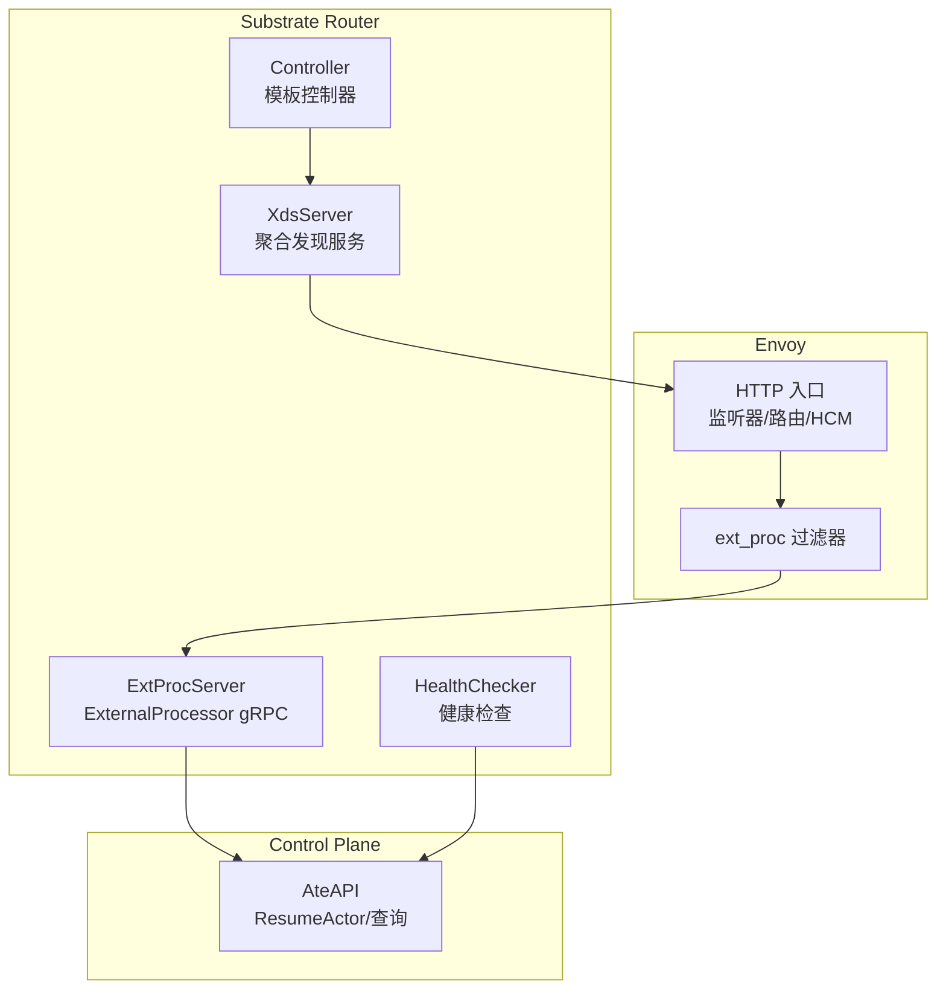
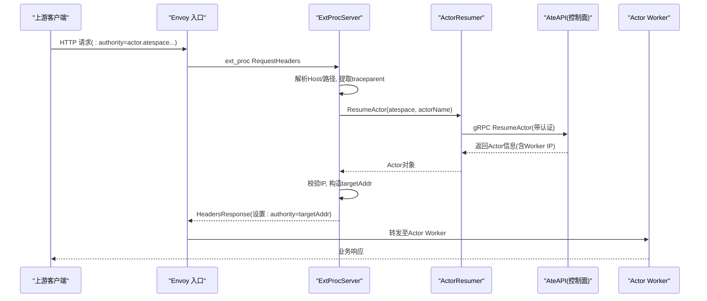
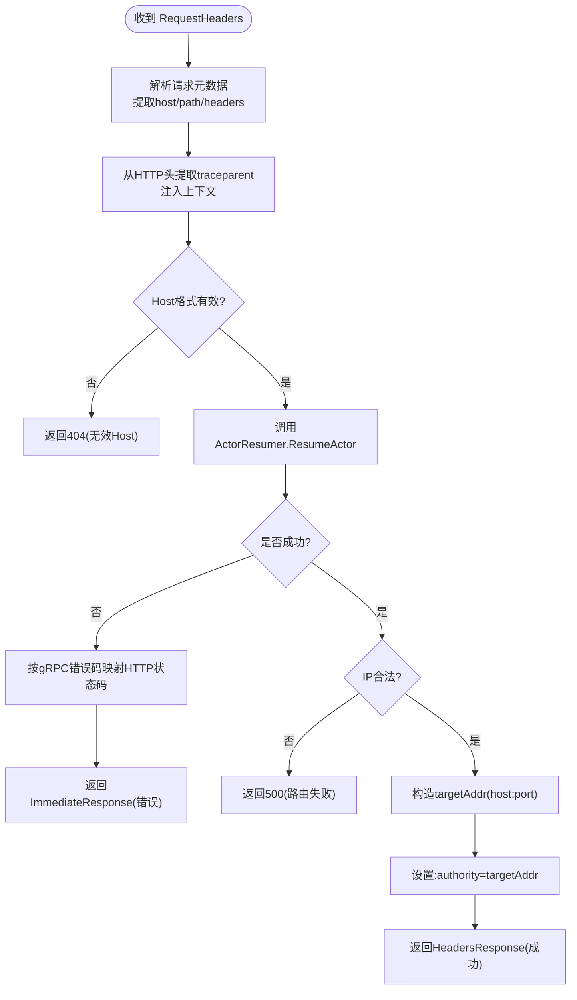
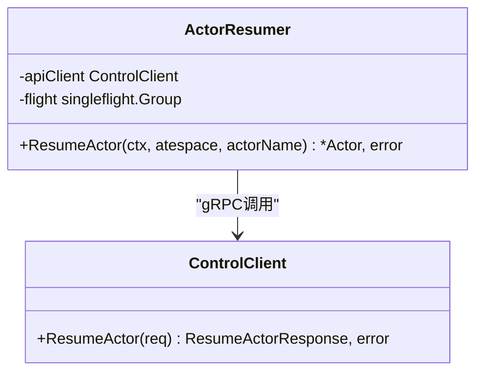
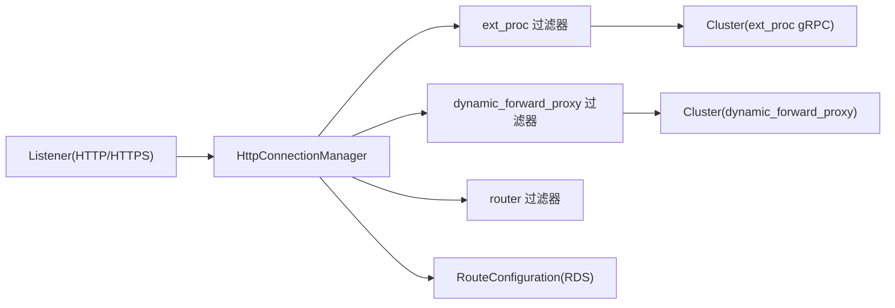
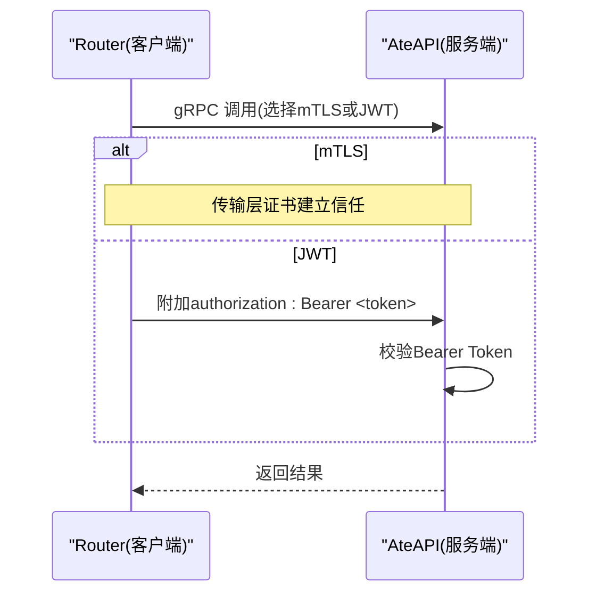
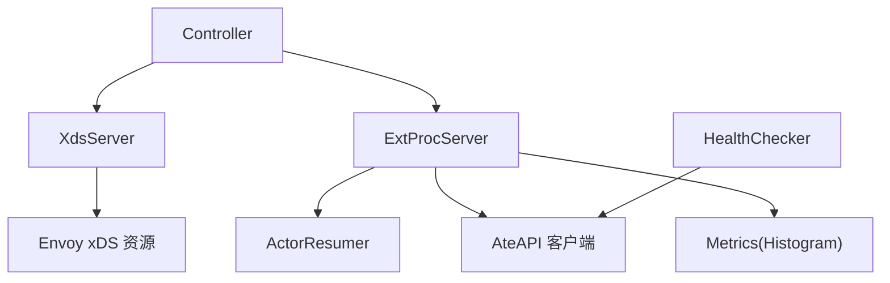

# 外部处理网关

<cite>
**本文引用的文件**   
- [extproc.go](file://cmd/atenet/internal/router/extproc.go)
- [extproc_in.go](file://cmd/atenet/internal/router/extproc_in.go)
- [extproc_out.go](file://cmd/atenet/internal/router/extproc_out.go)
- [resumer.go](file://cmd/atenet/internal/router/resumer.go)
- [metrics.go](file://cmd/atenet/internal/router/metrics.go)
- [xds.go](file://cmd/atenet/internal/router/xds.go)
- [router.go](file://cmd/atenet/internal/router/router.go)
- [controller.go](file://cmd/atenet/internal/router/controller.go)
- [actor.go](file://internal/resources/actor.go)
- [client.go](file://internal/ateapiauth/client.go)
- [server.go](file://internal/ateapiauth/server.go)
- [extproc_test.go](file://cmd/atenet/internal/router/extproc_test.go)
</cite>

## 目录
1. [简介](#简介)
2. [项目结构](#项目结构)
3. [核心组件](#核心组件)
4. [架构总览](#架构总览)
5. [详细组件分析](#详细组件分析)
6. [依赖关系分析](#依赖关系分析)
7. [性能与可观测性](#性能与可观测性)
8. [故障排查指南](#故障排查指南)
9. [结论](#结论)
10. [附录：配置与指标](#附录配置与指标)

## 简介
本文件系统性阐述 Substrate 中基于 Envoy External Processing（ExtProc）的外部处理网关实现机制。重点覆盖：
- Envoy ExtProc 协议在请求头阶段的拦截、路由决策与响应修改
- Actor 发现、健康检查、故障转移与负载均衡策略
- 输入输出处理管道：消息序列化、异步处理、错误传播
- 认证授权：mTLS、JWT Bearer Token 校验与权限控制
- 配置项、监控指标与调试方法
- 关键流程图与错误处理策略

## 项目结构
该功能位于 atenet 子系统的 router 包，围绕 xDS 动态配置与 ExtProc gRPC 服务展开：
- xDS 服务器负责向 Envoy 推送监听器、路由、集群等配置，并启用 ext_proc 过滤器
- ExtProc 服务接收来自 Envoy 的 RequestHeaders 事件，解析 Host 以定位 Actor，调用控制面恢复/唤醒目标 Worker，返回头部改写指令
- 控制器周期性拉取模板状态并更新 xDS 快照；健康检查模块定期探测服务可用性
- 认证模块为 ateapi 客户端提供 mTLS/JWT 两种模式

图示来源
- [xds.go:386-466](file://cmd/atenet/internal/router/xds.go#L386-L466)
- [extproc.go:80-128](file://cmd/atenet/internal/router/extproc.go#L80-L128)
- [router.go:224-287](file://cmd/atenet/internal/router/router.go#L224-L287)
- [controller.go:88-110](file://cmd/atenet/internal/router/controller.go#L88-L110)

章节来源
- [router.go:152-315](file://cmd/atenet/internal/router/router.go#L152-L315)
- [controller.go:67-110](file://cmd/atenet/internal/router/controller.go#L67-L110)
- [xds.go:148-225](file://cmd/atenet/internal/router/xds.go#L148-L225)

## 核心组件
- ExtProcServer：实现 Envoy ExternalProcessor gRPC 接口，仅处理 RequestHeaders 阶段，完成 Actor 发现与 :authority 重写
- ActorResumer：并发去重与指数退避重试，确保 Actor 被安全唤醒并返回可用 Worker 地址
- XdsServer：构建并推送 xDS 快照，配置 HCM 中的 ext_proc 过滤器、动态转发代理与可选 HTTPS/TLS
- Controller：周期 reconcile，读取模板状态并更新 xDS 快照，必要时协调本地 Envoy 实例
- HealthChecker：定时探测服务可用性，驱动 xDS 端点健康状态
- AteAPI 认证客户端：支持 mTLS 与 JWT Bearer Token 两种模式，构造安全的 gRPC 拨号选项

章节来源
- [extproc.go:38-78](file://cmd/atenet/internal/router/extproc.go#L38-L78)
- [resumer.go:31-104](file://cmd/atenet/internal/router/resumer.go#L31-L104)
- [xds.go:71-146](file://cmd/atenet/internal/router/xds.go#L71-L146)
- [controller.go:26-65](file://cmd/atenet/internal/router/controller.go#L26-L65)
- [client.go:57-95](file://internal/ateapiauth/client.go#L57-L95)

## 架构总览
下图展示一次完整请求从进入 Envoy 到由 ExtProc 完成路由决策的关键流程。

图示来源
- [extproc.go:130-188](file://cmd/atenet/internal/router/extproc.go#L130-L188)
- [resumer.go:46-104](file://cmd/atenet/internal/router/resumer.go#L46-L104)
- [xds.go:386-466](file://cmd/atenet/internal/router/xds.go#L386-L466)

## 详细组件分析

### ExtProc 请求处理管道
- 输入：Envoy 通过 gRPC 流发送 ProcessingRequest(RequestHeaders)
- 处理：
  - 解析请求元数据（headers、path、host），从 HTTP 头中提取 traceparent 以关联链路
  - 解析 Host 得到 (atespace, actorName)，调用 ActorResumer 确保 Actor 运行并获取 Worker Pod IP
  - 校验 IP 合法性，拼接 targetAddr（当前固定端口 80）
  - 生成 HeaderMutation，设置 :authority 为目标地址
- 输出：
  - 成功：返回 HeadersResponse，包含头部改写指令
  - 失败：返回 ImmediateResponse，携带映射后的 HTTP 状态码与安全消息体

图示来源
- [extproc.go:130-188](file://cmd/atenet/internal/router/extproc.go#L130-L188)
- [extproc_out.go:35-67](file://cmd/atenet/internal/router/extproc_out.go#L35-L67)
- [extproc_in.go:31-72](file://cmd/atenet/internal/router/extproc_in.go#L31-L72)

章节来源
- [extproc.go:80-128](file://cmd/atenet/internal/router/extproc.go#L80-L128)
- [extproc.go:130-188](file://cmd/atenet/internal/router/extproc.go#L130-L188)
- [extproc_out.go:23-67](file://cmd/atenet/internal/router/extproc_out.go#L23-L67)
- [extproc_in.go:25-72](file://cmd/atenet/internal/router/extproc_in.go#L25-L72)

### Actor 发现与并发控制
- 使用 singleflight 对同一 Actor 的并发唤醒进行去重，避免风暴式唤醒
- 采用指数退避重试，针对 Aborted 错误自动重试，其他错误原样上抛
- 将首次调用的上下文与后台超时解耦，保证后续等待者也能获得结果

图示来源
- [resumer.go:31-104](file://cmd/atenet/internal/router/resumer.go#L31-L104)

章节来源
- [resumer.go:46-104](file://cmd/atenet/internal/router/resumer.go#L46-L104)

### xDS 配置与 ExtProc 集成
- 在 HCM 中插入 ext_proc 过滤器，指定 gRPC 服务目标为本地 ExtProcServer
- 设置 MutationRules.AllowAllRouting=true，允许 ExtProc 改写路由相关头部
- 显式配置 MessageTimeout 与 ProcessingMode，仅处理 RequestHeader，跳过 Body/Trailer
- 可选开启 HTTPS 监听与 TLS 证书，支持自签或外部证书
- 可选配置 OTLP Collector 集群，用于 Envoy 侧 OpenTelemetry 追踪

图示来源
- [xds.go:386-466](file://cmd/atenet/internal/router/xds.go#L386-L466)
- [xds.go:227-272](file://cmd/atenet/internal/router/xds.go#L227-L272)
- [xds.go:503-576](file://cmd/atenet/internal/router/xds.go#L503-L576)

章节来源
- [xds.go:148-225](file://cmd/atenet/internal/router/xds.go#L148-L225)
- [xds.go:357-384](file://cmd/atenet/internal/router/xds.go#L357-L384)

### 认证与授权
- 客户端（Router）连接 AteAPI 时支持两种模式：
  - mTLS：传输层身份由证书建立（测试环境默认 InsecureSkipVerify）
  - JWT：校验服务端 CA，每 RPC 附带 Bearer Token（从文件读取，支持旋转）
- 服务端（AteAPI）提供拦截器，可在 ModeJWT 下校验 Bearer Token，未提供则拒绝访问

图示来源
- [client.go:57-95](file://internal/ateapiauth/client.go#L57-L95)
- [server.go:81-103](file://internal/ateapiauth/server.go#L81-L103)

章节来源
- [client.go:57-117](file://internal/ateapiauth/client.go#L57-L117)
- [server.go:35-103](file://internal/ateapiauth/server.go#L35-L103)

### 请求路由决策逻辑
- Actor 发现：从 Host 解析出 (atespace, actorName)，调用控制面恢复 Actor
- 健康检查：健康检查模块定期探测，结合 xDS 快照更新端点状态
- 故障转移：当 Worker 不可用时，错误码映射为合适的 HTTP 状态码（如 503/504）
- 负载均衡：当前为静态单端点（Actor 对应单个 Worker Pod），未来可扩展多端点与 LB 策略

章节来源
- [extproc.go:130-188](file://cmd/atenet/internal/router/extproc.go#L130-L188)
- [resumer.go:46-104](file://cmd/atenet/internal/router/resumer.go#L46-L104)
- [xds.go:227-272](file://cmd/atenet/internal/router/xds.go#L227-L272)

### 错误处理策略
- 无效 Host：返回 404，消息中包含 Host 标识但不泄露敏感信息
- 控制面错误：
  - NotFound → 404
  - FailedPrecondition/Unavailable → 503
  - DeadlineExceeded → 504
  - 其他错误 → 500
- 内部错误：保留原始错误链以便日志审计，但对外只返回安全消息体

章节来源
- [extproc_test.go:93-254](file://cmd/atenet/internal/router/extproc_test.go#L93-L254)
- [extproc_out.go:23-67](file://cmd/atenet/internal/router/extproc_out.go#L23-L67)

## 依赖关系分析
- ExtProcServer 依赖：
  - AteAPI 客户端（ResumeActor）
  - ActorResumer（并发去重与重试）
  - 指标记录（route duration histogram）
  - 请求记录器（statusz 调试）
- XdsServer 依赖：
  - Envoy xDS v3 资源模型（Cluster/Route/Listener）
  - ext_proc 过滤器配置
  - 可选 OTLP Collector 集群
- Controller 依赖：
  - K8s 客户端与模板存储
  - XdsServer 与 ExtProcServer
  - 本地 Envoy Runner（非 standalone 模式）

图示来源
- [extproc.go:38-78](file://cmd/atenet/internal/router/extproc.go#L38-L78)
- [resumer.go:31-104](file://cmd/atenet/internal/router/resumer.go#L31-L104)
- [metrics.go:24-51](file://cmd/atenet/internal/router/metrics.go#L24-L51)
- [xds.go:71-146](file://cmd/atenet/internal/router/xds.go#L71-L146)
- [controller.go:26-65](file://cmd/atenet/internal/router/controller.go#L26-L65)

章节来源
- [extproc.go:38-78](file://cmd/atenet/internal/router/extproc.go#L38-L78)
- [xds.go:71-146](file://cmd/atenet/internal/router/xds.go#L71-L146)
- [controller.go:26-65](file://cmd/atenet/internal/router/controller.go#L26-L65)

## 性能与可观测性
- 指标
  - atenet.router.route.duration：从接收 RequestHeaders 到解析出目标 Worker 的耗时直方图，维度包括模板命名空间、模板名称与 outcome（ok/error/not_found/cancelled）
- 追踪
  - ExtProc 服务内创建 span，并从 HTTP 头提取 traceparent 以链接 Envoy 入口 span
  - 可选启用 Envoy 侧 OpenTelemetry 追踪，上报至 OTLP Collector
- 日志
  - 不记录敏感字段（如 token、cookie、query secret），仅记录必要路由上下文

章节来源
- [metrics.go:24-51](file://cmd/atenet/internal/router/metrics.go#L24-L51)
- [extproc.go:137-143](file://cmd/atenet/internal/router/extproc.go#L137-L143)
- [xds.go:468-501](file://cmd/atenet/internal/router/xds.go#L468-L501)
- [extproc_test.go:45-91](file://cmd/atenet/internal/router/extproc_test.go#L45-L91)

## 故障排查指南
- 常见问题
  - Host 不匹配预期后缀：确认域名形如 "<actor>.<atespace>.actors.resources.substrate.ate.dev"
  - Actor 不可用：查看 503/504 映射原因，检查控制面健康与 Worker 资源
  - 认证失败：确认客户端模式（mTLS/JWT）与服务端一致，Token 文件可读且非空
- 诊断步骤
  - 查看 statusz 最近请求记录（QueryRecorder）
  - 检查 route duration 指标分布与 outcome 分类
  - 核对 xDS 快照版本与监听器/过滤器配置
  - 验证 OTLP Collector 可达性与采样策略

章节来源
- [extproc_test.go:93-254](file://cmd/atenet/internal/router/extproc_test.go#L93-L254)
- [metrics.go:24-51](file://cmd/atenet/internal/router/metrics.go#L24-L51)
- [xds.go:148-194](file://cmd/atenet/internal/router/xds.go#L148-L194)

## 结论
本实现通过 Envoy ExtProc 在请求头阶段完成轻量级、低延迟的路由决策，结合 ActorResumer 的并发去重与重试机制，保障 Actor 按需唤醒与稳定接入。配合 xDS 动态配置与健康检查，系统具备高扩展性与可观测性。认证层面支持 mTLS 与 JWT，满足生产环境的安全需求。

## 附录：配置与指标

### 关键配置项（RouterConfig）
- Standalone：是否独立运行（不管理 K8s 资源）
- Namespace/Kubeconfig：Kubernetes 连接参数
- AteapiAddr/AteapiAuthMode/AteapiCAFile/AteapiServerName/AteapiTokenFile：控制面连接与认证
- HttpPort/XdsPort/ExtprocPort/ExtprocAddr：监听与 ExtProc 服务地址
- HttpsPort/EnvoyCertPath：HTTPS 与证书路径（为空时自动生成自签）
- TemplatesFile：离线模板文件（standalone 模式）
- StatusPort：HTTP 状态端口的端口号
- HealthInterval：健康检查间隔
- MetricsAddr：Prometheus 指标暴露地址
- OtlpCollectorAddress：OTLP Collector 地址（启用 Envoy 侧追踪）

章节来源
- [router.go:66-91](file://cmd/atenet/internal/router/router.go#L66-L91)
- [router.go:152-315](file://cmd/atenet/internal/router/router.go#L152-L315)

### 指标定义
- atenet.router.route.duration
  - 类型：Float64Histogram
  - 单位：秒
  - 描述：从接收 RequestHeaders 到解析出目标 Worker 的耗时（不含 Actor 执行与响应）
  - 维度：actor_template_namespace、actor_template_name、outcome

章节来源
- [metrics.go:24-51](file://cmd/atenet/internal/router/metrics.go#L24-L51)
