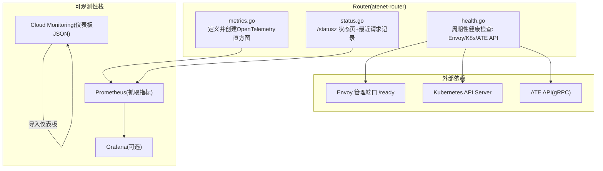
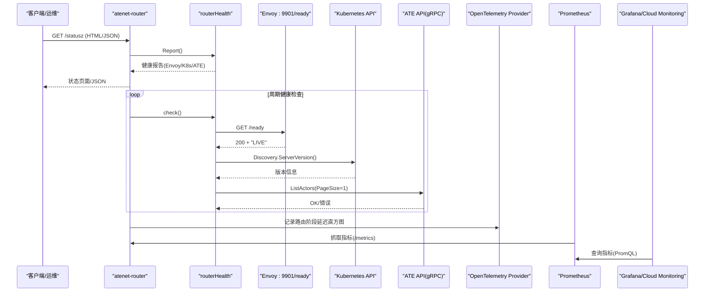
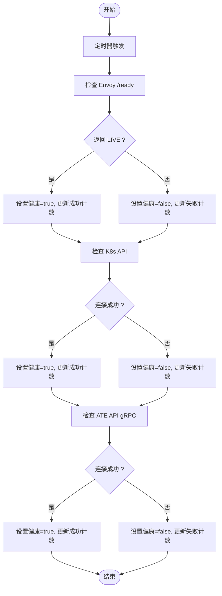
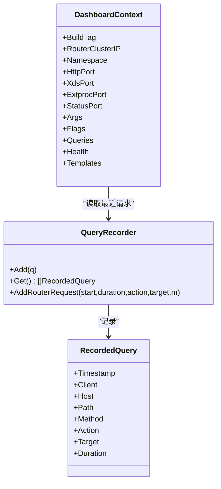
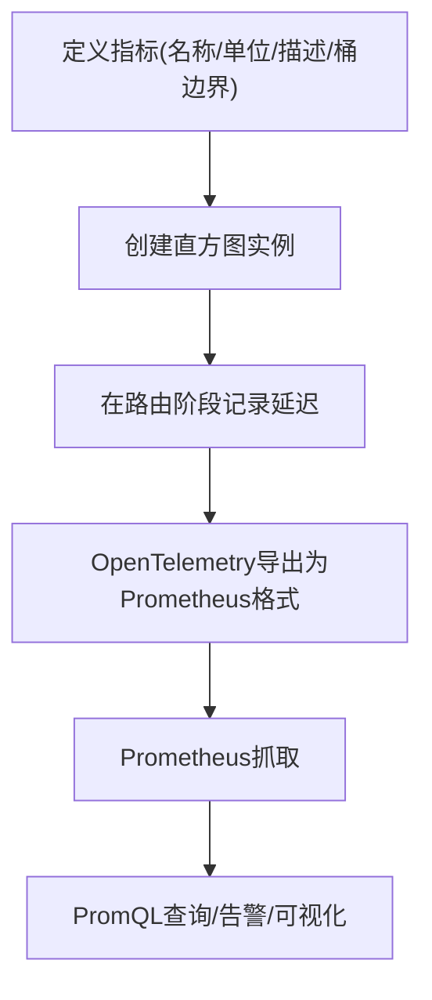
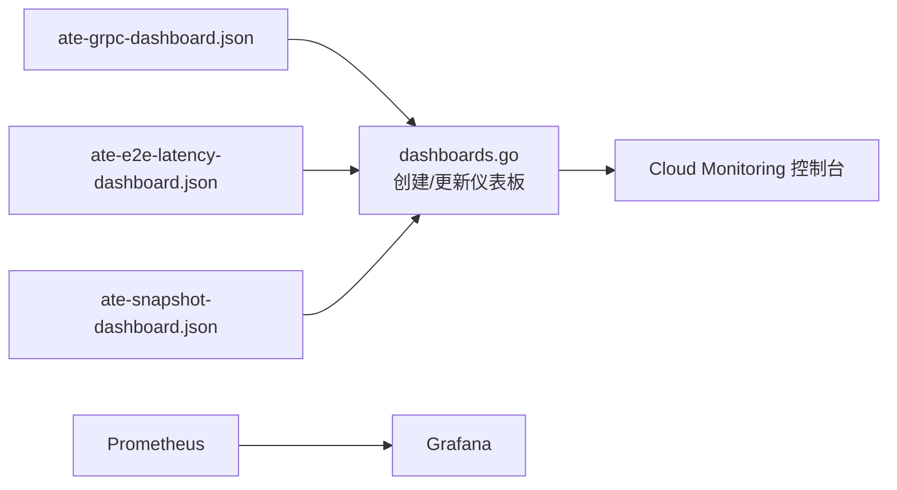
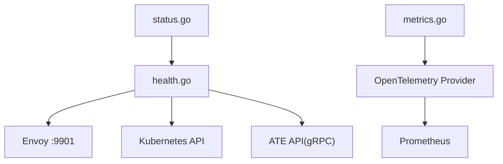

# 状态监控

<cite>
**本文引用的文件**   
- [cmd/atenet/internal/router/metrics.go](file://cmd/atenet/internal/router/metrics.go)
- [cmd/atenet/internal/router/status.go](file://cmd/atenet/internal/router/status.go)
- [cmd/atenet/internal/router/health.go](file://cmd/atenet/internal/router/health.go)
- [tools/setup-gcp/dashboards/ate-e2e-latency-dashboard.json](file://tools/setup-gcp/dashboards/ate-e2e-latency-dashboard.json)
- [tools/setup-gcp/dashboards/ate-grpc-dashboard.json](file://tools/setup-gcp/dashboards/ate-grpc-dashboard.json)
- [tools/setup-gcp/dashboards/ate-snapshot-dashboard.json](file://tools/setup-gcp/dashboards/ate-snapshot-dashboard.json)
- [tools/setup-gcp/cmd/dashboards.go](file://tools/setup-gcp/cmd/dashboards.go)
- [benchmarking/monitoring.yaml](file://benchmarking/monitoring.yaml)
</cite>

## 目录
1. [简介](#简介)
2. [项目结构](#项目结构)
3. [核心组件](#核心组件)
4. [架构总览](#架构总览)
5. [详细组件分析](#详细组件分析)
6. [依赖关系分析](#依赖关系分析)
7. [性能考量](#性能考量)
8. [故障排查指南](#故障排查指南)
9. [结论](#结论)
10. [附录](#附录)

## 简介
本文件聚焦于路由系统（atenet-router）的状态监控与健康检查机制，涵盖健康检查端点、状态API、Prometheus指标定义与导出、告警规则配置思路、以及Grafana/Cloud Monitoring仪表板搭建方法。目标是帮助读者建立完整的可观测性体系：从依赖服务检测、资源使用统计、性能指标收集，到可视化与告警闭环。

## 项目结构
与“状态监控”直接相关的代码与配置主要分布在以下位置：
- 路由侧指标定义与采集：cmd/atenet/internal/router/metrics.go
- 路由状态页与查询记录器：cmd/atenet/internal/router/status.go
- 路由健康检查器（Envoy/K8s API/ATE API）：cmd/atenet/internal/router/health.go
- 仪表板模板（Cloud Monitoring JSON）：tools/setup-gcp/dashboards/*.json
- 仪表板部署工具：tools/setup-gcp/cmd/dashboards.go
- Prometheus/Grafana 部署清单（示例）：benchmarking/monitoring.yaml

图表来源
- [cmd/atenet/internal/router/metrics.go:1-52](file://cmd/atenet/internal/router/metrics.go#L1-L52)
- [cmd/atenet/internal/router/status.go:1-285](file://cmd/atenet/internal/router/status.go#L1-L285)
- [cmd/atenet/internal/router/health.go:1-218](file://cmd/atenet/internal/router/health.go#L1-L218)
- [tools/setup-gcp/dashboards/ate-e2e-latency-dashboard.json:1-217](file://tools/setup-gcp/dashboards/ate-e2e-latency-dashboard.json#L1-L217)
- [tools/setup-gcp/dashboards/ate-grpc-dashboard.json:1-159](file://tools/setup-gcp/dashboards/ate-grpc-dashboard.json#L1-L159)
- [tools/setup-gcp/dashboards/ate-snapshot-dashboard.json:1-137](file://tools/setup-gcp/dashboards/ate-snapshot-dashboard.json#L1-L137)
- [tools/setup-gcp/cmd/dashboards.go:1-118](file://tools/setup-gcp/cmd/dashboards.go#L1-L118)
- [benchmarking/monitoring.yaml:15-118](file://benchmarking/monitoring.yaml#L15-L118)

章节来源
- [cmd/atenet/internal/router/metrics.go:1-52](file://cmd/atenet/internal/router/metrics.go#L1-L52)
- [cmd/atenet/internal/router/status.go:1-285](file://cmd/atenet/internal/router/status.go#L1-L285)
- [cmd/atenet/internal/router/health.go:1-218](file://cmd/atenet/internal/router/health.go#L1-L218)
- [tools/setup-gcp/dashboards/ate-e2e-latency-dashboard.json:1-217](file://tools/setup-gcp/dashboards/ate-e2e-latency-dashboard.json#L1-L217)
- [tools/setup-gcp/dashboards/ate-grpc-dashboard.json:1-159](file://tools/setup-gcp/dashboards/ate-grpc-dashboard.json#L1-L159)
- [tools/setup-gcp/dashboards/ate-snapshot-dashboard.json:1-137](file://tools/setup-gcp/dashboards/ate-snapshot-dashboard.json#L1-L137)
- [tools/setup-gcp/cmd/dashboards.go:1-118](file://tools/setup-gcp/cmd/dashboards.go#L1-L118)
- [benchmarking/monitoring.yaml:15-118](file://benchmarking/monitoring.yaml#L15-L118)

## 核心组件
- 指标定义与导出
  - 通过OpenTelemetry MeterProvider创建直方图指标，用于度量路由阶段延迟（例如从接收请求到解析目标worker的耗时）。
  - 指标名称、单位、桶边界在代码中集中定义，便于统一管理与后续告警/可视化对接。
- 状态API（/statusz）
  - 提供HTML或JSON格式的路由运行态信息：构建版本、启动参数、端口、最近请求记录、健康报告、已就绪模板等。
  - 内置最近请求环形记录器，支持按时间倒序查看最近的若干条处理记录，便于快速定位问题。
- 健康检查器
  - 定时任务周期性探测关键依赖：Envoy本地管理接口、Kubernetes API、ATE API gRPC。
  - 维护每个组件的健康状态、最近成功/失败时间与计数，供状态API聚合展示。

章节来源
- [cmd/atenet/internal/router/metrics.go:1-52](file://cmd/atenet/internal/router/metrics.go#L1-L52)
- [cmd/atenet/internal/router/status.go:1-285](file://cmd/atenet/internal/router/status.go#L1-L285)
- [cmd/atenet/internal/router/health.go:1-218](file://cmd/atenet/internal/router/health.go#L1-L218)

## 架构总览
下图展示了路由组件如何暴露指标与状态，以及如何被外部可观测性组件消费。

图表来源
- [cmd/atenet/internal/router/status.go:180-281](file://cmd/atenet/internal/router/status.go#L180-L281)
- [cmd/atenet/internal/router/health.go:74-147](file://cmd/atenet/internal/router/health.go#L74-L147)
- [cmd/atenet/internal/router/metrics.go:32-51](file://cmd/atenet/internal/router/metrics.go#L32-L51)

## 详细组件分析

### 健康检查器（routerHealth）
- 功能要点
  - 周期性触发健康检查，默认间隔为秒级。
  - 检查项：
    - Envoy：HTTP GET 本地管理端口 /ready，期望返回体为"LIVE"。
    - Kubernetes API：调用Discovery ServerVersion，若未启用则跳过。
    - ATE API：gRPC ListActors(PageSize=1)，校验连通性。
  - 结果写入内部报告，包含是否健康、消息、最近成功/失败时间与计数。
- 并发安全
  - 使用读写锁保护报告对象，避免竞态。
- 可观测性集成
  - HTTP客户端使用OpenTelemetry传输包装，便于链路追踪。

图表来源
- [cmd/atenet/internal/router/health.go:74-147](file://cmd/atenet/internal/router/health.go#L74-L147)
- [cmd/atenet/internal/router/health.go:149-208](file://cmd/atenet/internal/router/health.go#L149-L208)

章节来源
- [cmd/atenet/internal/router/health.go:1-218](file://cmd/atenet/internal/router/health.go#L1-L218)

### 状态API（/statusz）
- 功能要点
  - 输出HTML或JSON两种格式，支持通过Accept头或format参数切换。
  - 聚合信息包括：
    - 构建标签与源码修订
    - 进程参数与命令行标志
    - 最近请求记录（环形缓冲区，脱敏路径）
    - 健康报告（来自routerHealth）
    - 已就绪ActorTemplate列表
- 最近请求记录器（QueryRecorder）
  - 固定容量环形缓冲，线程安全，支持逆序读取最新N条。
  - 自动对URL查询串进行脱敏，避免敏感信息泄露。

图表来源
- [cmd/atenet/internal/router/status.go:38-130](file://cmd/atenet/internal/router/status.go#L38-L130)
- [cmd/atenet/internal/router/status.go:137-161](file://cmd/atenet/internal/router/status.go#L137-L161)
- [cmd/atenet/internal/router/status.go:180-281](file://cmd/atenet/internal/router/status.go#L180-L281)

章节来源
- [cmd/atenet/internal/router/status.go:1-285](file://cmd/atenet/internal/router/status.go#L1-L285)

### 指标定义与导出（OpenTelemetry → Prometheus）
- 指标定义
  - 使用OpenTelemetry MeterProvider创建Float64Histogram，度量“从接收请求到解析目标worker”的阶段延迟，单位为秒，显式桶边界覆盖毫秒到数十秒范围。
- 指标导出
  - 通过OpenTelemetry Exporter将指标导出为Prometheus格式，Prometheus以固定间隔抓取。
- 典型维度
  - 服务名（top_level_controller_name）、分位值（le）、结果（outcome）等，具体维度可在仪表板中按需要聚合。

图表来源
- [cmd/atenet/internal/router/metrics.go:24-51](file://cmd/atenet/internal/router/metrics.go#L24-L51)

章节来源
- [cmd/atenet/internal/router/metrics.go:1-52](file://cmd/atenet/internal/router/metrics.go#L1-L52)

### 仪表板与可视化
- Cloud Monitoring仪表板
  - 提供三类JSON模板：gRPC服务端延迟/QPS/错误、端到端路由与E2E延迟、快照大小与QPS。
  - 通过工具命令按displayName幂等创建或更新仪表板。
- Prometheus/Grafana（示例）
  - 提供Kubernetes环境下的Prometheus与Grafana部署清单，包含ServiceAccount、RBAC、ConfigMap、Deployment与Service。

图表来源
- [tools/setup-gcp/dashboards/ate-grpc-dashboard.json:1-159](file://tools/setup-gcp/dashboards/ate-grpc-dashboard.json#L1-L159)
- [tools/setup-gcp/dashboards/ate-e2e-latency-dashboard.json:1-217](file://tools/setup-gcp/dashboards/ate-e2e-latency-dashboard.json#L1-L217)
- [tools/setup-gcp/dashboards/ate-snapshot-dashboard.json:1-137](file://tools/setup-gcp/dashboards/ate-snapshot-dashboard.json#L1-L137)
- [tools/setup-gcp/cmd/dashboards.go:32-118](file://tools/setup-gcp/cmd/dashboards.go#L32-L118)
- [benchmarking/monitoring.yaml:15-118](file://benchmarking/monitoring.yaml#L15-L118)

章节来源
- [tools/setup-gcp/cmd/dashboards.go:1-118](file://tools/setup-gcp/cmd/dashboards.go#L1-L118)
- [tools/setup-gcp/dashboards/ate-grpc-dashboard.json:1-159](file://tools/setup-gcp/dashboards/ate-grpc-dashboard.json#L1-L159)
- [tools/setup-gcp/dashboards/ate-e2e-latency-dashboard.json:1-217](file://tools/setup-gcp/dashboards/ate-e2e-latency-dashboard.json#L1-L217)
- [tools/setup-gcp/dashboards/ate-snapshot-dashboard.json:1-137](file://tools/setup-gcp/dashboards/ate-snapshot-dashboard.json#L1-L137)
- [benchmarking/monitoring.yaml:15-118](file://benchmarking/monitoring.yaml#L15-L118)

## 依赖关系分析
- 组件耦合
  - routerHealth 依赖 Envoy管理接口、Kubernetes API、ATE API；对外仅暴露Report()给状态API。
  - status.go 聚合健康报告、最近请求、模板信息等，作为单一入口呈现。
  - metrics.go 通过全局MeterProvider创建指标，不直接依赖外部存储，由Exporter完成导出。
- 外部依赖
  - OpenTelemetry SDK/Exporter负责指标导出。
  - Prometheus抓取指标，Grafana/Cloud Monitoring消费指标。
- 潜在风险
  - 健康检查超时与重试策略需合理配置，避免雪崩。
  - 最近请求记录器容量有限，高吞吐下仅保留窗口内数据。

图表来源
- [cmd/atenet/internal/router/health.go:74-147](file://cmd/atenet/internal/router/health.go#L74-L147)
- [cmd/atenet/internal/router/status.go:180-281](file://cmd/atenet/internal/router/status.go#L180-L281)
- [cmd/atenet/internal/router/metrics.go:32-51](file://cmd/atenet/internal/router/metrics.go#L32-L51)

章节来源
- [cmd/atenet/internal/router/health.go:1-218](file://cmd/atenet/internal/router/health.go#L1-L218)
- [cmd/atenet/internal/router/status.go:1-285](file://cmd/atenet/internal/router/status.go#L1-L285)
- [cmd/atenet/internal/router/metrics.go:1-52](file://cmd/atenet/internal/router/metrics.go#L1-L52)

## 性能考量
- 健康检查间隔与超时
  - 建议根据集群规模与服务SLA调整检查间隔与超时，避免频繁探测造成额外开销。
- 指标粒度与桶边界
  - 直方图桶边界应覆盖业务延迟分布，避免尾部丢失；必要时增加细粒度桶。
- 最近请求记录器容量
  - 在高QPS场景下，适当增大容量，但需权衡内存占用。
- 指标导出与抓取频率
  - Prometheus抓取间隔与指标数量需平衡，避免过度采样导致存储压力。

[本节为通用指导，无需特定文件引用]

## 故障排查指南
- 健康检查失败
  - 检查Envoy /ready是否返回"LIVE"，确认管理端口可达。
  - 验证Kubernetes API连通性与权限。
  - 确认ATE API gRPC连通性与鉴权。
- 状态页异常
  - 通过/format=json获取结构化数据，核对字段完整性。
  - 关注最近请求记录的Target与Duration，定位慢请求或失败路径。
- 指标缺失或异常
  - 确认OpenTelemetry导出器已正确初始化。
  - 检查Prometheus抓取目标与指标命名空间/标签一致性。
- 仪表板无数据
  - 确认Prometheus已抓取到对应指标。
  - 核对仪表板PromQL中的指标名与标签是否与运行时一致。

章节来源
- [cmd/atenet/internal/router/health.go:149-208](file://cmd/atenet/internal/router/health.go#L149-L208)
- [cmd/atenet/internal/router/status.go:180-281](file://cmd/atenet/internal/router/status.go#L180-L281)
- [cmd/atenet/internal/router/metrics.go:32-51](file://cmd/atenet/internal/router/metrics.go#L32-L51)

## 结论
该路由系统提供了完善的状态监控与健康检查能力：通过OpenTelemetry定义并导出关键延迟指标，通过/statusz暴露运行态与最近请求，通过routerHealth持续探测关键依赖。结合Prometheus与Grafana/Cloud Monitoring，可实现从指标采集、可视化到告警的完整闭环。建议在现有基础上补充更多业务维度标签（如actor_template_name、outcome），并完善告警规则与抑制策略，进一步提升可观测性与运维自动化水平。

[本节为总结性内容，无需特定文件引用]

## 附录

### 指标定义表（节选）
- atenet.router.route.duration
  - 类型：直方图（Float64Histogram）
  - 单位：秒
  - 描述：从路由器接收到请求到解析出目标worker端点的延迟（不含执行与响应）
  - 典型维度：top_level_controller_name、le、outcome（可按需扩展）
  - 参考实现：[cmd/atenet/internal/router/metrics.go:24-51](file://cmd/atenet/internal/router/metrics.go#L24-L51)

### 健康检查端点与状态API
- 健康检查
  - 组件：Envoy、Kubernetes API、ATE API
  - 行为：周期性探测，记录成功/失败次数与最近时间戳
  - 参考实现：[cmd/atenet/internal/router/health.go:74-147](file://cmd/atenet/internal/router/health.go#L74-L147)
- 状态API
  - 路径：/statusz
  - 输出：HTML或JSON（Accept或format参数控制）
  - 内容：构建信息、参数、最近请求、健康报告、模板列表
  - 参考实现：[cmd/atenet/internal/router/status.go:180-281](file://cmd/atenet/internal/router/status.go#L180-L281)

### 仪表板模板与部署
- Cloud Monitoring仪表板
  - ate-grpc-dashboard.json：gRPC延迟/QPS/错误
  - ate-e2e-latency-dashboard.json：路由与端到端延迟
  - ate-snapshot-dashboard.json：快照大小与QPS
  - 参考实现：[tools/setup-gcp/dashboards/*.json:1-159](file://tools/setup-gcp/dashboards/ate-grpc-dashboard.json#L1-L159)
- 部署工具
  - dashboards.go：按displayName幂等创建/更新仪表板
  - 参考实现：[tools/setup-gcp/cmd/dashboards.go:32-118](file://tools/setup-gcp/cmd/dashboards.go#L32-L118)
- Prometheus/Grafana（示例）
  - 参考清单：[benchmarking/monitoring.yaml:15-118](file://benchmarking/monitoring.yaml#L15-L118)
