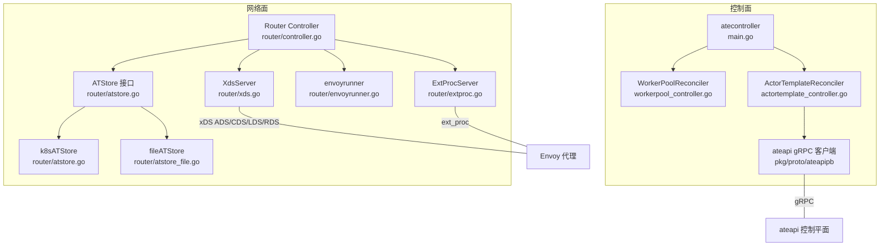
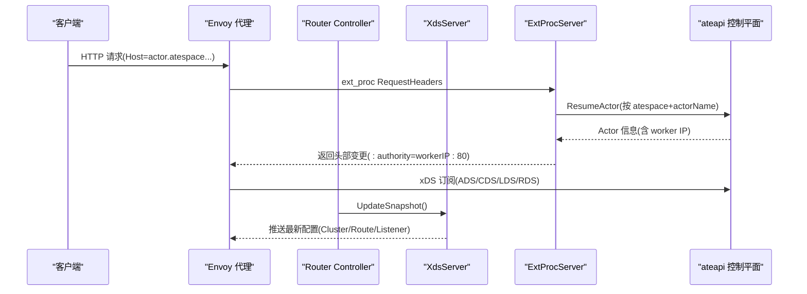
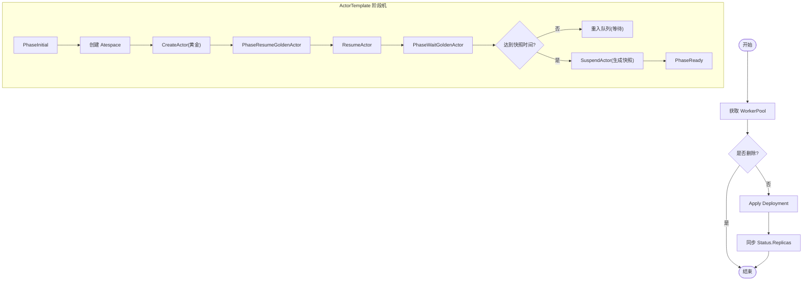
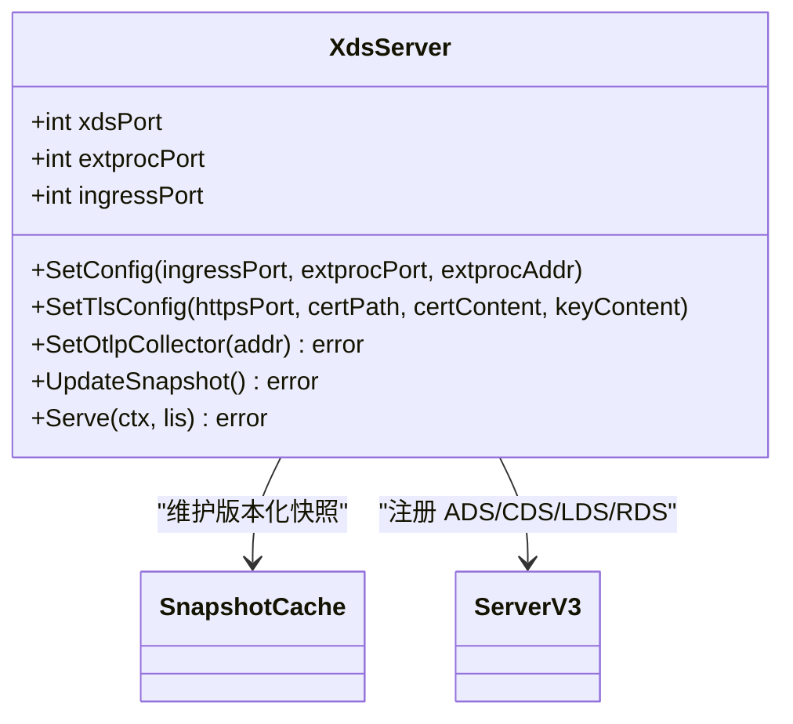
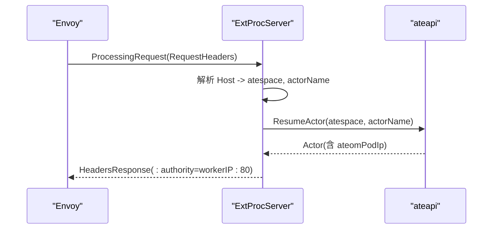
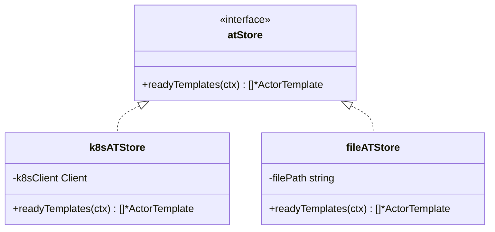
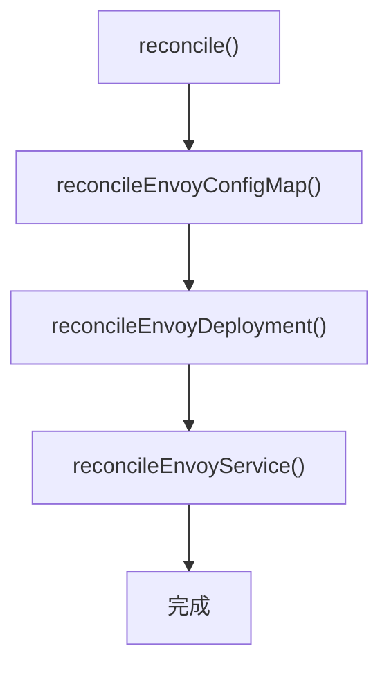
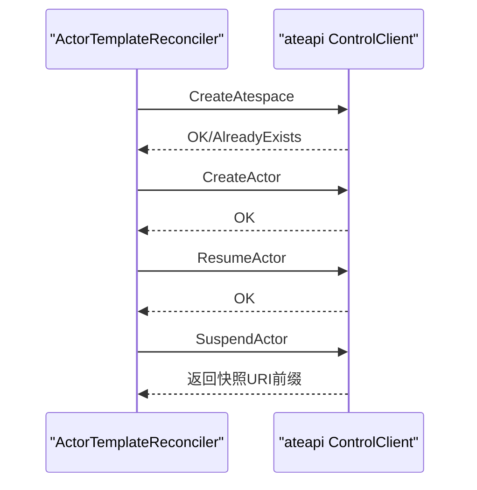
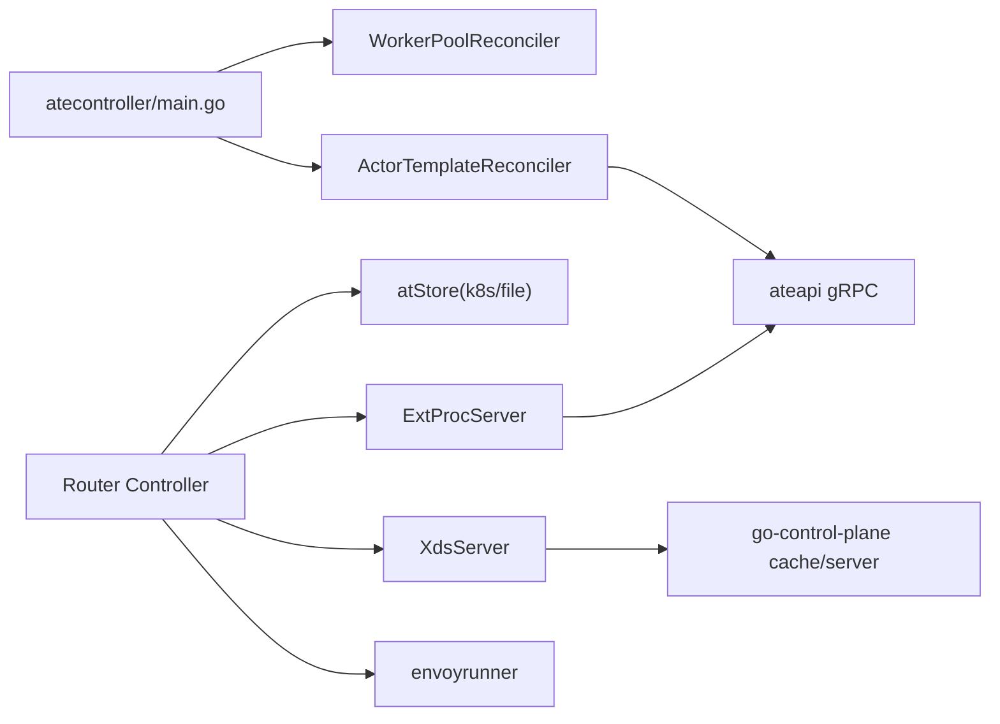

# 路由控制器

<cite>
**本文引用的文件**   
- [cmd/atecontroller/main.go](file://cmd/atecontroller/main.go)
- [cmd/atecontroller/internal/controllers/workerpool_controller.go](file://cmd/atecontroller/internal/controllers/workerpool_controller.go)
- [cmd/atecontroller/internal/controllers/actortemplate_controller.go](file://cmd/atecontroller/internal/controllers/actortemplate_controller.go)
- [pkg/api/v1alpha1/workerpool_types.go](file://pkg/api/v1alpha1/workerpool_types.go)
- [pkg/api/v1alpha1/actortemplate_types.go](file://pkg/api/v1alpha1/actortemplate_types.go)
- [cmd/atenet/internal/router/controller.go](file://cmd/atenet/internal/router/controller.go)
- [cmd/atenet/internal/router/xds.go](file://cmd/atenet/internal/router/xds.go)
- [cmd/atenet/internal/router/extproc.go](file://cmd/atenet/internal/router/extproc.go)
- [cmd/atenet/internal/router/envoyrunner.go](file://cmd/atenet/internal/router/envoyrunner.go)
- [cmd/atenet/internal/router/atstore.go](file://cmd/atenet/internal/router/atstore.go)
- [cmd/atenet/internal/router/atstore_file.go](file://cmd/atenet/internal/router/atstore_file.go)
</cite>

## 目录
1. [简介](#简介)
2. [项目结构](#项目结构)
3. [核心组件](#核心组件)
4. [架构总览](#架构总览)
5. [详细组件分析](#详细组件分析)
6. [依赖关系分析](#依赖关系分析)
7. [性能考虑](#性能考虑)
8. [故障排查指南](#故障排查指南)
9. [结论](#结论)
10. [附录](#附录)

## 简介
本文件聚焦于“路由控制器”的核心实现，围绕以下目标展开：
- Kubernetes 资源监听机制与自定义资源（ActorTemplate、WorkerPool）的 watch 事件处理流程
- xDS 服务器实现原理：动态配置推送、Envoy 集群管理、负载均衡策略
- ATStore 存储层设计：ActorTemplate 就绪集合的获取与缓存策略
- 控制器与 ateapi 控制平面的交互协议：gRPC 调用、错误处理、超时与重试建议
- 控制器配置参数详解与性能调优建议
- 架构图与数据流图，帮助理解组件协作关系

## 项目结构
本项目包含两个关键子系统：
- 控制面控制器（atecontroller）：基于 controller-runtime 监听并协调 WorkerPool 与 ActorTemplate 等 CRD，驱动底层资源与 ateapi 控制平面交互
- 网络路由器（atenet/router）：提供 xDS 服务、外部处理（ext_proc）服务，并管理 Envoy 实例生命周期与配置

图表来源
- [cmd/atecontroller/main.go:53-123](file://cmd/atecontroller/main.go#L53-L123)
- [cmd/atenet/internal/router/controller.go:26-111](file://cmd/atenet/internal/router/controller.go#L26-L111)
- [cmd/atenet/internal/router/xds.go:71-225](file://cmd/atenet/internal/router/xds.go#L71-L225)
- [cmd/atenet/internal/router/extproc.go:38-78](file://cmd/atenet/internal/router/extproc.go#L38-L78)
- [cmd/atenet/internal/router/envoyrunner.go:36-64](file://cmd/atenet/internal/router/envoyrunner.go#L36-L64)
- [cmd/atenet/internal/router/atstore.go:25-56](file://cmd/atenet/internal/router/atstore.go#L25-L56)
- [cmd/atenet/internal/router/atstore_file.go:32-131](file://cmd/atenet/internal/router/atstore_file.go#L32-L131)

章节来源
- [cmd/atecontroller/main.go:53-123](file://cmd/atecontroller/main.go#L53-L123)
- [cmd/atenet/internal/router/controller.go:26-111](file://cmd/atenet/internal/router/controller.go#L26-L111)

## 核心组件
- WorkerPool 控制器：监听 WorkerPool CRD，创建/更新 Deployment，同步状态
- ActorTemplate 控制器：初始化“黄金 Actor”，通过 ateapi 完成启动、等待就绪、挂起并生成快照，最终标记模板 Ready
- Router Controller：周期性拉取就绪的 ActorTemplate，构建 xDS Snapshot 并推送给 Envoy；同时可选地管理 Envoy 部署与服务
- XdsServer：实现聚合发现服务（ADS），维护 Cluster/Route/Listener 等资源，支持 OTLP 追踪与 HTTPS 监听
- ExtProcServer：实现 Envoy ext_proc，解析 Host 头，触发 Actor 恢复并改写 :authority 进行动态路由
- ATStore：抽象 ActorTemplate 源，支持从 k8s 或离线文件读取就绪模板列表

章节来源
- [cmd/atecontroller/internal/controllers/workerpool_controller.go:35-121](file://cmd/atecontroller/internal/controllers/workerpool_controller.go#L35-L121)
- [cmd/atecontroller/internal/controllers/actortemplate_controller.go:48-211](file://cmd/atecontroller/internal/controllers/actortemplate_controller.go#L48-L211)
- [cmd/atenet/internal/router/controller.go:26-111](file://cmd/atenet/internal/router/controller.go#L26-L111)
- [cmd/atenet/internal/router/xds.go:71-225](file://cmd/atenet/internal/router/xds.go#L71-L225)
- [cmd/atenet/internal/router/extproc.go:38-78](file://cmd/atenet/internal/router/extproc.go#L38-L78)
- [cmd/atenet/internal/router/atstore.go:25-56](file://cmd/atenet/internal/router/atstore.go#L25-L56)
- [cmd/atenet/internal/router/atstore_file.go:32-131](file://cmd/atenet/internal/router/atstore_file.go#L32-L131)

## 架构总览
下图展示了控制面与网络面的整体交互：控制器通过 ateapi 管理 Actor 生命周期，路由器通过 xDS 向 Envoy 推送动态配置，并通过 ext_proc 在请求到达时动态激活目标 Actor。

图表来源
- [cmd/atenet/internal/router/extproc.go:80-188](file://cmd/atenet/internal/router/extproc.go#L80-L188)
- [cmd/atenet/internal/router/xds.go:148-225](file://cmd/atenet/internal/router/xds.go#L148-L225)
- [cmd/atenet/internal/router/controller.go:88-110](file://cmd/atenet/internal/router/controller.go#L88-L110)

## 详细组件分析

### Kubernetes 资源监听与 Reconcile 循环
- WorkerPoolReconciler
  - 监听 WorkerPool 变更，应用 Deployment，并将副本数同步回 status
  - 使用 FieldOwner 与 ForceOwnership 确保声明式所有权
- ActorTemplateReconciler
  - 阶段化推进：Initial → ResumeGoldenActor → WaitGoldenActor → Ready
  - 通过 ateapi 创建 Atespace、创建 Actor、Resume、Suspend 以生成“黄金快照”
  - 根据容器 Readyz 探针决定是否等待预热时间再取快照

图表来源
- [cmd/atecontroller/internal/controllers/workerpool_controller.go:47-121](file://cmd/atecontroller/internal/controllers/workerpool_controller.go#L47-L121)
- [cmd/atecontroller/internal/controllers/actortemplate_controller.go:66-188](file://cmd/atecontroller/internal/controllers/actortemplate_controller.go#L66-L188)

章节来源
- [cmd/atecontroller/internal/controllers/workerpool_controller.go:47-121](file://cmd/atecontroller/internal/controllers/workerpool_controller.go#L47-L121)
- [cmd/atecontroller/internal/controllers/actortemplate_controller.go:66-188](file://cmd/atecontroller/internal/controllers/actortemplate_controller.go#L66-L188)

### xDS 服务器与动态配置推送
- XdsServer
  - 维护 SnapshotCache，周期性地构建 Cluster/Route/Listener 并 SetSnapshot
  - 支持 OTLP 追踪与 HTTPS 监听（证书可内联或文件）
  - 默认启用动态转发代理与 ext_proc 过滤器
- 负载均衡策略
  - 主集群采用 ROUND_ROBIN
  - 动态转发代理集群由扩展类型提供策略

图表来源
- [cmd/atenet/internal/router/xds.go:71-225](file://cmd/atenet/internal/router/xds.go#L71-L225)
- [cmd/atenet/internal/router/xds.go:227-355](file://cmd/atenet/internal/router/xds.go#L227-L355)
- [cmd/atenet/internal/router/xds.go:357-501](file://cmd/atenet/internal/router/xds.go#L357-L501)
- [cmd/atenet/internal/router/xds.go:503-606](file://cmd/atenet/internal/router/xds.go#L503-L606)

章节来源
- [cmd/atenet/internal/router/xds.go:148-225](file://cmd/atenet/internal/router/xds.go#L148-L225)
- [cmd/atenet/internal/router/xds.go:227-355](file://cmd/atenet/internal/router/xds.go#L227-L355)
- [cmd/atenet/internal/router/xds.go:357-501](file://cmd/atenet/internal/router/xds.go#L357-L501)
- [cmd/atenet/internal/router/xds.go:503-606](file://cmd/atenet/internal/router/xds.go#L503-L606)

### 外部处理（ext_proc）与动态路由
- ExtProcServer
  - 接收 Envoy 的 RequestHeaders 事件，解析 Host 得到 atespace 与 actorName
  - 调用 ateapi ResumeActor，获得 worker IP，重写 :authority 为 workerIP:80
  - 记录路由耗时指标，分类错误结果用于观测
- 与 xDS 协同
  - 动态转发代理将流量指向 ext_proc 所在集群，再由 ext_proc 决定实际后端

图表来源
- [cmd/atenet/internal/router/extproc.go:80-188](file://cmd/atenet/internal/router/extproc.go#L80-L188)

章节来源
- [cmd/atenet/internal/router/extproc.go:80-188](file://cmd/atenet/internal/router/extproc.go#L80-L188)

### ATStore 存储层设计与缓存策略
- 接口 atStore
  - readyTemplates(ctx) 返回已就绪的 ActorTemplate 列表
- 实现
  - k8sATStore：通过 client.List 列出所有 ActorTemplate，仅过滤 Status.Phase == Ready
  - fileATStore：从 YAML/JSON 文件解析单个或多个 ActorTemplate（支持 List/ActorTemplateList/单文档）
- 缓存策略
  - 当前为每次 reconcile 拉取最新列表，无本地持久缓存
  - 可通过引入内存缓存与增量更新提升性能

图表来源
- [cmd/atenet/internal/router/atstore.go:25-56](file://cmd/atenet/internal/router/atstore.go#L25-L56)
- [cmd/atenet/internal/router/atstore_file.go:32-131](file://cmd/atenet/internal/router/atstore_file.go#L32-L131)

章节来源
- [cmd/atenet/internal/router/atstore.go:41-55](file://cmd/atenet/internal/router/atstore.go#L41-L55)
- [cmd/atenet/internal/router/atstore_file.go:44-131](file://cmd/atenet/internal/router/atstore_file.go#L44-L131)

### Envoy 管理与 Bootstrap 配置
- envoyrunner
  - 管理 ConfigMap（bootstrap 配置）、Deployment、Service
  - bootstrap 中静态定义 xds_cluster 指向 atenet-router:xdsPort，启用 ADS
- Router Controller
  - 非 Standalone 且未使用文件模式时，周期性 reconcile 上述资源

图表来源
- [cmd/atenet/internal/router/envoyrunner.go:50-64](file://cmd/atenet/internal/router/envoyrunner.go#L50-L64)
- [cmd/atenet/internal/router/envoyrunner.go:66-137](file://cmd/atenet/internal/router/envoyrunner.go#L66-L137)
- [cmd/atenet/internal/router/envoyrunner.go:139-222](file://cmd/atenet/internal/router/envoyrunner.go#L139-L222)
- [cmd/atenet/internal/router/envoyrunner.go:224-258](file://cmd/atenet/internal/router/envoyrunner.go#L224-L258)
- [cmd/atenet/internal/router/controller.go:88-110](file://cmd/atenet/internal/router/controller.go#L88-L110)

章节来源
- [cmd/atenet/internal/router/envoyrunner.go:50-64](file://cmd/atenet/internal/router/envoyrunner.go#L50-L64)
- [cmd/atenet/internal/router/controller.go:88-110](file://cmd/atenet/internal/router/controller.go#L88-L110)

### 控制器与 ateapi 控制平面交互协议
- 连接建立
  - 通过命令行参数指定 ateapi 地址与认证方式（mtls/jwt）
  - 使用 grpc.NewClient 建立连接，构造 ControlClient
- 主要 RPC 调用
  - CreateAtespace / CreateActor / ResumeActor / SuspendActor
- 错误与重试建议
  - 当前代码对错误直接返回，未内置指数退避重试
  - 建议在调用处增加可配置的重试策略（如 backoff/v5）与上下文超时控制
- 超时处理
  - 建议在 gRPC 调用链路上设置合理的 per-call timeout 与全局 deadline

图表来源
- [cmd/atecontroller/main.go:53-80](file://cmd/atecontroller/main.go#L53-L80)
- [cmd/atecontroller/internal/controllers/actortemplate_controller.go:81-188](file://cmd/atecontroller/internal/controllers/actortemplate_controller.go#L81-L188)

章节来源
- [cmd/atecontroller/main.go:53-80](file://cmd/atecontroller/main.go#L53-L80)
- [cmd/atecontroller/internal/controllers/actortemplate_controller.go:81-188](file://cmd/atecontroller/internal/controllers/actortemplate_controller.go#L81-L188)

## 依赖关系分析
- 控制面
  - main 初始化 scheme、注册 CRD、创建 manager 与 reconciler
  - WorkerPoolReconciler 依赖 apps/v1 Deployment
  - ActorTemplateReconciler 依赖 ateapi gRPC 客户端
- 网络面
  - Router Controller 依赖 atStore（k8s 或文件）、XdsServer、ExtProcServer、envoyrunner
  - XdsServer 依赖 go-control-plane 的 server/cache 与 Envoy v3 配置模型
  - ExtProcServer 依赖 ateapi gRPC 客户端与 OpenTelemetry 指标/追踪

图表来源
- [cmd/atecontroller/main.go:53-123](file://cmd/atecontroller/main.go#L53-L123)
- [cmd/atenet/internal/router/controller.go:26-111](file://cmd/atenet/internal/router/controller.go#L26-L111)
- [cmd/atenet/internal/router/xds.go:71-225](file://cmd/atenet/internal/router/xds.go#L71-L225)
- [cmd/atenet/internal/router/extproc.go:38-78](file://cmd/atenet/internal/router/extproc.go#L38-L78)
- [cmd/atenet/internal/router/envoyrunner.go:36-64](file://cmd/atenet/internal/router/envoyrunner.go#L36-L64)

章节来源
- [cmd/atecontroller/main.go:53-123](file://cmd/atecontroller/main.go#L53-L123)
- [cmd/atenet/internal/router/controller.go:26-111](file://cmd/atenet/internal/router/controller.go#L26-L111)

## 性能考虑
- 控制器层面
  - WorkerPoolReconciler 使用 Apply 与 FieldOwner 减少冲突与覆盖风险
  - ActorTemplateReconciler 阶段推进避免重复操作，利用 Readyz 探针缩短预热等待
- 路由器层面
  - XdsServer 使用 SnapshotCache 的版本化快照，保证一致性推送
  - Router Controller 每 5 秒轮询一次，可根据规模调整轮询间隔
  - ExtProcServer 记录路由耗时与分类指标，便于定位热点与瓶颈
- 网络与追踪
  - 可选开启 OTLP 追踪，注意采样率与下游链路采样策略配合
  - HTTPS 监听需合理配置证书与端口，避免额外握手开销

[本节为通用指导，不直接分析具体文件]

## 故障排查指南
- 常见错误与定位
  - xDS 快照不一致：检查 UpdateSnapshot 返回值与日志中的版本号
  - ext_proc 路由失败：确认 Host 解析、ResumeActor 返回的 worker IP 是否为合法地址
  - Envoy 无法连接 xDS：检查 bootstrap 中 xds_cluster 的 DNS 与端口
- 观察点
  - 控制器日志：Reconcile 错误、阶段转换、快照时间计算
  - 路由器日志：xDS 推送、ext_proc 处理耗时与错误分类
  - 指标：路由耗时直方图、错误分类计数
- 建议
  - 为 ateapi 调用增加可配置的重试与超时
  - 为 Router Controller 的轮询间隔提供可调参数
  - 为 ExtProcServer 的错误路径增加更细粒度的指标维度

章节来源
- [cmd/atenet/internal/router/extproc.go:190-212](file://cmd/atenet/internal/router/extproc.go#L190-L212)
- [cmd/atenet/internal/router/xds.go:148-194](file://cmd/atenet/internal/router/xds.go#L148-L194)
- [cmd/atenet/internal/router/envoyrunner.go:66-137](file://cmd/atenet/internal/router/envoyrunner.go#L66-L137)

## 结论
路由控制器体系通过“控制面 + 网络面”的解耦设计，实现了：
- 基于 CRD 的声明式编排与自动化生命周期管理
- 基于 xDS 的动态配置推送与按需激活
- 基于 ext_proc 的请求级动态路由与快速冷启动
- 面向生产环境的可观测性与可扩展性基础

后续优化方向包括：增强重试与容错、引入 ATStore 缓存与增量更新、细化指标与告警、以及更多负载均衡策略的可插拔支持。

[本节为总结性内容，不直接分析具体文件]

## 附录

### 控制器与路由器配置参数要点
- atecontroller
  - --ateapi-conn-spec：ateapi 连接地址（DNS/直连）
  - --ateapi-auth：认证模式（mtls/jwt）
  - --ateapi-ca-file、--ateapi-server-name、--ateapi-token-file：JWT 模式所需 CA/SNI/Token
- atenet/router
  - Standalone 模式与 TemplatesFile：是否托管 Envoy 及是否从文件加载模板
  - HttpPort/ExtprocPort/ExtprocAddr：HTTP 入口与 ext_proc 服务地址
  - XdsPort：xDS 服务端口
  - OTLP 收集器地址：启用 Envoy 侧追踪
  - HTTPS 证书：支持文件路径或内联内容

章节来源
- [cmd/atecontroller/main.go:40-46](file://cmd/atecontroller/main.go#L40-L46)
- [cmd/atenet/internal/router/controller.go:39-65](file://cmd/atenet/internal/router/controller.go#L39-L65)
- [cmd/atenet/internal/router/xds.go:106-146](file://cmd/atenet/internal/router/xds.go#L106-L146)
- [cmd/atenet/internal/router/envoyrunner.go:66-137](file://cmd/atenet/internal/router/envoyrunner.go#L66-L137)

### 自定义资源定义概览
- WorkerPool
  - spec.replicas、spec.ateomImage、spec.template（调度与资源）、spec.sandboxClass、spec.sandboxConfigName
  - status.replicas
- ActorTemplate
  - spec.containers、spec.snapshotsConfig、spec.sandboxClass、spec.workerSelector、spec.volumes
  - status.phase、goldenActorID、takeGoldenSnapshotAt、goldenSnapshot、conditions

章节来源
- [pkg/api/v1alpha1/workerpool_types.go:54-136](file://pkg/api/v1alpha1/workerpool_types.go#L54-L136)
- [pkg/api/v1alpha1/actortemplate_types.go:278-390](file://pkg/api/v1alpha1/actortemplate_types.go#L278-L390)
