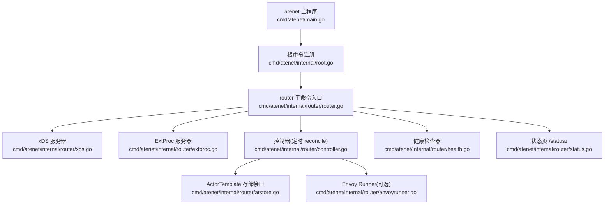
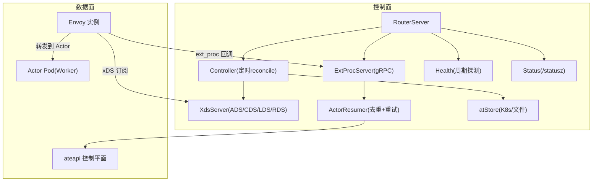
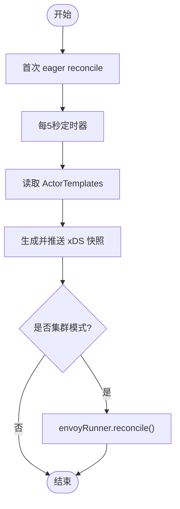
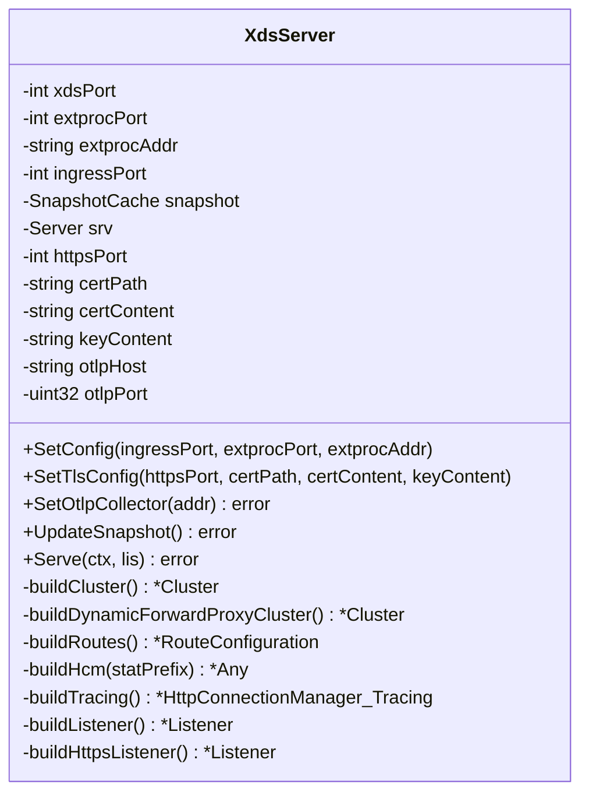
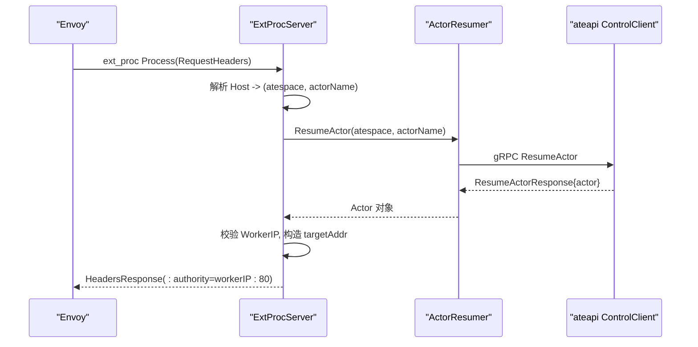
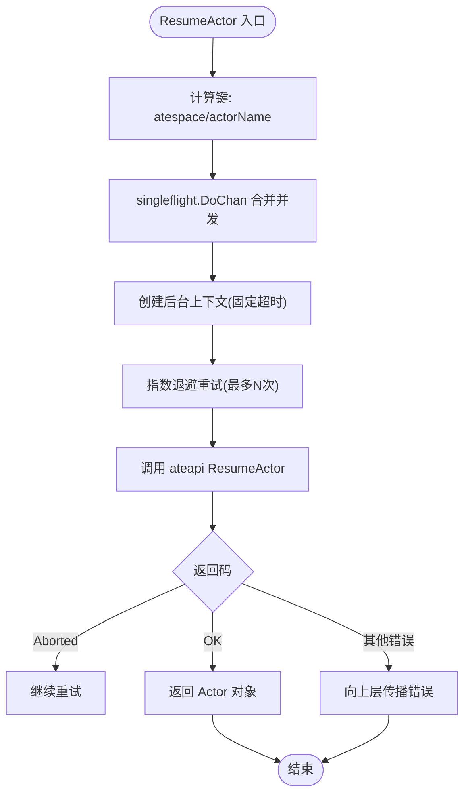
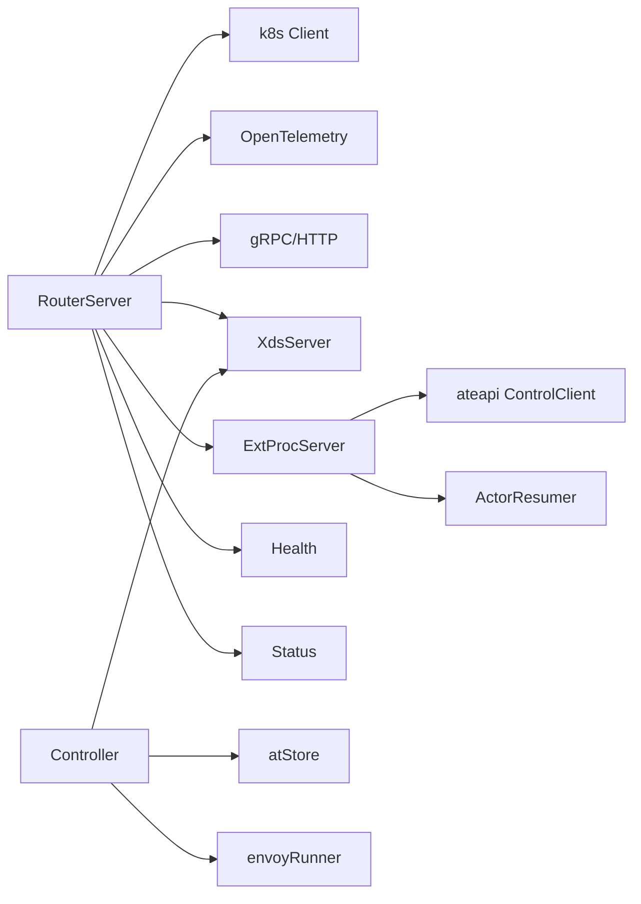
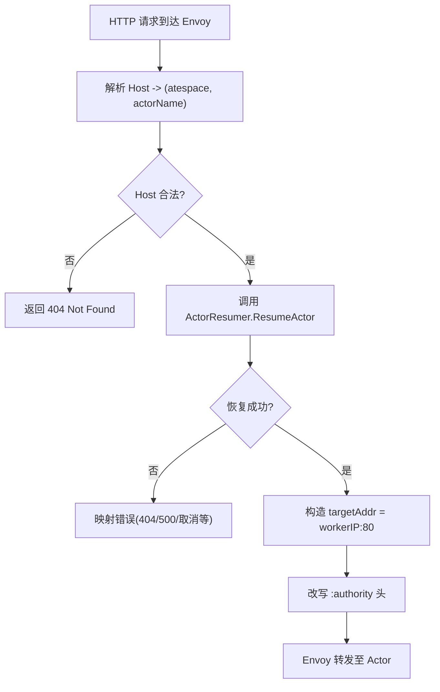
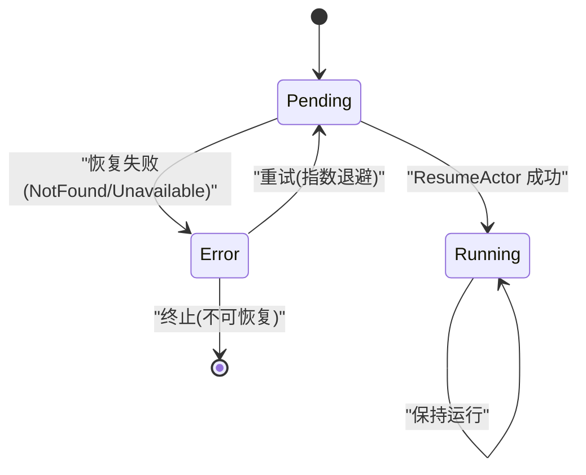

# 路由系统

<cite>
**本文引用的文件**
- [cmd/atenet/main.go](file://cmd/atenet/main.go)
- [cmd/atenet/internal/root.go](file://cmd/atenet/internal/root.go)
- [cmd/atenet/internal/router/router.go](file://cmd/atenet/internal/router/router.go)
- [cmd/atenet/internal/router/controller.go](file://cmd/atenet/internal/router/controller.go)
- [cmd/atenet/internal/router/xds.go](file://cmd/atenet/internal/router/xds.go)
- [cmd/atenet/internal/router/extproc.go](file://cmd/atenet/internal/router/extproc.go)
- [cmd/atenet/internal/router/resumer.go](file://cmd/atenet/internal/router/resumer.go)
- [cmd/atenet/internal/router/atstore.go](file://cmd/atenet/internal/router/atstore.go)
- [cmd/atenet/internal/router/errors.go](file://cmd/atenet/internal/router/errors.go)
- [cmd/atenet/internal/router/health.go](file://cmd/atenet/internal/router/health.go)
- [cmd/atenet/internal/router/status.go](file://cmd/atenet/internal/router/status.go)
- [cmd/atenet/internal/router/metrics.go](file://cmd/atenet/internal/router/metrics.go)
- [cmd/atenet/internal/router/envoyrunner.go](file://cmd/atenet/internal/router/envoyrunner.go)
- [pkg/api/v1alpha1/actortemplate_types.go](file://pkg/api/v1alpha1/actortemplate_types.go)
</cite>

## 目录
1. [简介](#简介)
2. [项目结构](#项目结构)
3. [核心组件](#核心组件)
4. [架构总览](#架构总览)
5. [详细组件分析](#详细组件分析)
6. [依赖关系分析](#依赖关系分析)
7. [性能与容量规划](#性能与容量规划)
8. [故障排查指南](#故障排查指南)
9. [结论](#结论)
10. [附录：配置最佳实践与监控告警](#附录配置最佳实践与监控告警)

## 简介
本文件系统性阐述 atenet 路由系统的核心架构与调度逻辑，重点覆盖以下方面：
- 路由控制器（Controller）对 Kubernetes 资源的监听、状态同步与事件处理机制
- 请求路由的核心算法：目标 Actor 定位、健康检查、故障转移策略
- Resumer 组件的工作流程：Actor 唤醒、去重并发、重试与错误映射
- 路由状态管理：活跃连接跟踪、资源使用统计、容量规划建议
- 配置最佳实践、性能优化与监控告警设置
- 关键流程图与状态转换图，帮助理解请求处理的内部逻辑

## 项目结构
atenet 作为统一网络守护进程，提供 DNS 与 Router 两大子命令。Router 子命令负责 Envoy xDS 配置下发、外部处理服务（ExtProc）、健康检查与状态页等能力。

图表来源
- [cmd/atenet/main.go:19-21](file://cmd/atenet/main.go#L19-L21)
- [cmd/atenet/internal/root.go:39-42](file://cmd/atenet/internal/root.go#L39-L42)
- [cmd/atenet/internal/router/router.go:152-315](file://cmd/atenet/internal/router/router.go#L152-L315)
- [cmd/atenet/internal/router/xds.go:196-225](file://cmd/atenet/internal/router/xds.go#L196-L225)
- [cmd/atenet/internal/router/extproc.go:58-78](file://cmd/atenet/internal/router/extproc.go#L58-L78)
- [cmd/atenet/internal/router/controller.go:67-110](file://cmd/atenet/internal/router/controller.go#L67-L110)
- [cmd/atenet/internal/router/health.go:74-89](file://cmd/atenet/internal/router/health.go#L74-L89)
- [cmd/atenet/internal/router/status.go:226-284](file://cmd/atenet/internal/router/status.go#L226-L284)
- [cmd/atenet/internal/router/atstore.go:25-55](file://cmd/atenet/internal/router/atstore.go#L25-L55)
- [cmd/atenet/internal/router/envoyrunner.go:1-200](file://cmd/atenet/internal/router/envoyrunner.go#L1-L200)

章节来源
- [cmd/atenet/main.go:19-21](file://cmd/atenet/main.go#L19-L21)
- [cmd/atenet/internal/root.go:39-42](file://cmd/atenet/internal/root.go#L39-L42)
- [cmd/atenet/internal/router/router.go:152-315](file://cmd/atenet/internal/router/router.go#L152-L315)

## 核心组件
- RouterServer：协调各子系统生命周期，初始化追踪、指标、gRPC/HTTP 服务，启动控制器、健康检查、xDS 与 ExtProc 服务。
- Controller：周期性拉取 ActorTemplate 列表，生成并推送 xDS 快照；在集群模式下协调 Envoy 部署。
- XdsServer：实现 Envoy ADS/CDS/LDS/RDS 聚合发现服务，动态构建 Listener/Route/Cluster 配置，支持 TLS 与 OTLP 追踪。
- ExtProcServer：实现 Envoy External Processor gRPC 服务，解析 Host 头，触发 Actor 恢复，改写 :authority 完成动态转发。
- ActorResumer：对同一 Actor 的恢复调用进行去重与指数退避重试，屏蔽并发冲突，保证幂等性。
- atStore：抽象 ActorTemplate 数据源，支持 K8s 或本地文件两种后端。
- Health：周期探测 K8s API、ateapi 连通性与自身状态，输出健康报告。
- Status：暴露 /statusz 页面，汇总运行参数、模板清单与健康信息。

章节来源
- [cmd/atenet/internal/router/router.go:94-150](file://cmd/atenet/internal/router/router.go#L94-L150)
- [cmd/atenet/internal/router/controller.go:26-65](file://cmd/atenet/internal/router/controller.go#L26-L65)
- [cmd/atenet/internal/router/xds.go:71-104](file://cmd/atenet/internal/router/xds.go#L71-L104)
- [cmd/atenet/internal/router/extproc.go:38-56](file://cmd/atenet/internal/router/extproc.go#L38-L56)
- [cmd/atenet/internal/router/resumer.go:31-41](file://cmd/atenet/internal/router/resumer.go#L31-L41)
- [cmd/atenet/internal/router/atstore.go:25-39](file://cmd/atenet/internal/router/atstore.go#L25-L39)
- [cmd/atenet/internal/router/health.go:47-72](file://cmd/atenet/internal/router/health.go#L47-L72)
- [cmd/atenet/internal/router/status.go:132-161](file://cmd/atenet/internal/router/status.go#L132-L161)

## 架构总览
整体采用“控制面 + 数据面”解耦设计：
- 控制面：RouterServer 内嵌 Controller、XdsServer、ExtProcServer、Health、Status 等模块，负责配置生成、服务编排与可观测性。
- 数据面：Envoy 通过 xDS 获取 Listener/Route/Cluster 配置，并在请求进入时回调 ExtProc 进行动态决策与转发。

图表来源
- [cmd/atenet/internal/router/router.go:222-315](file://cmd/atenet/internal/router/router.go#L222-L315)
- [cmd/atenet/internal/router/controller.go:88-110](file://cmd/atenet/internal/router/controller.go#L88-L110)
- [cmd/atenet/internal/router/xds.go:148-194](file://cmd/atenet/internal/router/xds.go#L148-L194)
- [cmd/atenet/internal/router/extproc.go:80-128](file://cmd/atenet/internal/router/extproc.go#L80-L128)
- [cmd/atenet/internal/router/resumer.go:46-104](file://cmd/atenet/internal/router/resumer.go#L46-L104)
- [cmd/atenet/internal/router/health.go:74-89](file://cmd/atenet/internal/router/health.go#L74-L89)
- [cmd/atenet/internal/router/status.go:226-284](file://cmd/atenet/internal/router/status.go#L226-L284)
- [cmd/atenet/internal/router/atstore.go:41-55](file://cmd/atenet/internal/router/atstore.go#L41-L55)

## 详细组件分析

### 路由控制器（Controller）
职责
- 周期性执行 reconcile，读取 ActorTemplate 集合，生成 xDS 快照并推送给 Envoy。
- 在非 Standalone 且非文件模式时，协调 Envoy 部署对象与集群实体。

关键流程
- 启动即执行一次 eager reconcile，随后每 5 秒循环触发。
- 从 atStore 获取 Ready 状态的 ActorTemplate，更新 xDS 快照。
- 若启用集群模式，调用 envoyRunner.reconcile 维护 Envoy Deployment 等资源。

图表来源
- [cmd/atenet/internal/router/controller.go:67-110](file://cmd/atenet/internal/router/controller.go#L67-L110)
- [cmd/atenet/internal/router/atstore.go:41-55](file://cmd/atenet/internal/router/atstore.go#L41-L55)
- [cmd/atenet/internal/router/xds.go:148-194](file://cmd/atenet/internal/router/xds.go#L148-L194)

章节来源
- [cmd/atenet/internal/router/controller.go:67-110](file://cmd/atenet/internal/router/controller.go#L67-L110)
- [cmd/atenet/internal/router/atstore.go:41-55](file://cmd/atenet/internal/router/atstore.go#L41-L55)

### xDS 服务器（XdsServer）
职责
- 实现 Envoy 聚合发现服务（ADS），提供 Cluster/Listener/Route 配置。
- 根据运行时配置动态构建 HCM、ext_proc 过滤器、动态转发代理过滤器与路由规则。
- 支持 HTTPS 监听与 OTLP 追踪上报。

关键点
- 所有资源以 Snapshot 形式原子发布，确保一致性。
- ext_proc 过滤器允许头部修改，消息超时与处理模式显式配置。
- 动态转发代理（dynamic_forward_proxy）用于按 Host 解析上游地址。

图表来源
- [cmd/atenet/internal/router/xds.go:71-104](file://cmd/atenet/internal/router/xds.go#L71-L104)
- [cmd/atenet/internal/router/xds.go:148-194](file://cmd/atenet/internal/router/xds.go#L148-L194)
- [cmd/atenet/internal/router/xds.go:227-272](file://cmd/atenet/internal/router/xds.go#L227-L272)
- [cmd/atenet/internal/router/xds.go:336-355](file://cmd/atenet/internal/router/xds.go#L336-L355)
- [cmd/atenet/internal/router/xds.go:357-384](file://cmd/atenet/internal/router/xds.go#L357-L384)
- [cmd/atenet/internal/router/xds.go:386-466](file://cmd/atenet/internal/router/xds.go#L386-L466)
- [cmd/atenet/internal/router/xds.go:478-501](file://cmd/atenet/internal/router/xds.go#L478-L501)
- [cmd/atenet/internal/router/xds.go:503-531](file://cmd/atenet/internal/router/xds.go#L503-L531)
- [cmd/atenet/internal/router/xds.go:533-576](file://cmd/atenet/internal/router/xds.go#L533-L576)
- [cmd/atenet/internal/router/xds.go:578-606](file://cmd/atenet/internal/router/xds.go#L578-L606)

章节来源
- [cmd/atenet/internal/router/xds.go:148-194](file://cmd/atenet/internal/router/xds.go#L148-L194)
- [cmd/atenet/internal/router/xds.go:386-466](file://cmd/atenet/internal/router/xds.go#L386-L466)

### 外部处理服务（ExtProcServer）
职责
- 响应 Envoy 的 ext_proc 请求，在 RequestHeaders 阶段解析 Host，触发 Actor 恢复，并将 :authority 改写为 Worker IP:80，完成动态转发。

核心流程
- 接收 ProcessingRequest，提取 traceparent 上下文，解析 (atespace, actorName)。
- 调用 ActorResumer.ResumeActor 确保 Actor 运行，返回 Actor 元数据（包含模板命名空间、名称与 Worker Pod IP）。
- 校验 Worker IP 合法性，构造 targetAddr，写入 HeaderMutation 返回给 Envoy。
- 记录路由耗时直方图与最近请求记录。

图表来源
- [cmd/atenet/internal/router/extproc.go:80-128](file://cmd/atenet/internal/router/extproc.go#L80-L128)
- [cmd/atenet/internal/router/extproc.go:130-188](file://cmd/atenet/internal/router/extproc.go#L130-L188)
- [cmd/atenet/internal/router/resumer.go:46-104](file://cmd/atenet/internal/router/resumer.go#L46-L104)

章节来源
- [cmd/atenet/internal/router/extproc.go:80-128](file://cmd/atenet/internal/router/extproc.go#L80-L128)
- [cmd/atenet/internal/router/extproc.go:130-188](file://cmd/atenet/internal/router/extproc.go#L130-L188)

### Resumer 组件（ActorResumer）
职责
- 对同一 Actor 的恢复调用进行去重与指数退避重试，屏蔽并发冲突，保证幂等性。

关键特性
- 基于 singleflight.Group 对相同 (atespace/actorName) 的请求合并，避免重复唤醒。
- 使用固定后台超时与指数退避（步数、初始间隔、因子、抖动）重试，兼容 Aborted 并发冲突。
- 将 gRPC 错误原样返回，以便上层 HTTP 边界做精确映射。

图表来源
- [cmd/atenet/internal/router/resumer.go:46-104](file://cmd/atenet/internal/router/resumer.go#L46-L104)

章节来源
- [cmd/atenet/internal/router/resumer.go:46-104](file://cmd/atenet/internal/router/resumer.go#L46-L104)

### 健康检查与状态页
- Health：周期探测 K8s Discovery 与 ateapi ListActors，维护 RouterHealthReport。
- Status：/statusz 输出 JSON 或 HTML 仪表盘，包含构建标签、端口、参数、查询记录、健康信息与模板清单。

章节来源
- [cmd/atenet/internal/router/health.go:74-89](file://cmd/atenet/internal/router/health.go#L74-L89)
- [cmd/atenet/internal/router/health.go:181-217](file://cmd/atenet/internal/router/health.go#L181-L217)
- [cmd/atenet/internal/router/status.go:226-284](file://cmd/atenet/internal/router/status.go#L226-L284)

### 错误处理
- 定义 reqError 类型，封装 Envoy 状态码与消息体，便于 ExtProc 快速返回即时响应。
- 常见错误如 actorNotFoundErr 直接映射为 404。

章节来源
- [cmd/atenet/internal/router/errors.go:25-37](file://cmd/atenet/internal/router/errors.go#L25-L37)

## 依赖关系分析
- RouterServer 依赖：
  - k8s client-go 与 controller-runtime 客户端（K8s 集成）
  - OpenTelemetry 追踪与指标
  - gRPC 与 HTTP 服务
  - Envoy xDS 库与过滤器配置
- Controller 依赖：
  - atStore（K8s 或文件）
  - XdsServer（配置推送）
  - envoyRunner（可选，集群模式）
- ExtProcServer 依赖：
  - ateapi ControlClient（Actor 恢复）
  - ActorResumer（去重与重试）
  - 指标记录器（路由耗时直方图）

图表来源
- [cmd/atenet/internal/router/router.go:152-315](file://cmd/atenet/internal/router/router.go#L152-L315)
- [cmd/atenet/internal/router/controller.go:67-110](file://cmd/atenet/internal/router/controller.go#L67-L110)
- [cmd/atenet/internal/router/extproc.go:58-78](file://cmd/atenet/internal/router/extproc.go#L58-L78)
- [cmd/atenet/internal/router/resumer.go:46-104](file://cmd/atenet/internal/router/resumer.go#L46-L104)

章节来源
- [cmd/atenet/internal/router/router.go:152-315](file://cmd/atenet/internal/router/router.go#L152-L315)
- [cmd/atenet/internal/router/controller.go:67-110](file://cmd/atenet/internal/router/controller.go#L67-L110)
- [cmd/atenet/internal/router/extproc.go:58-78](file://cmd/atenet/internal/router/extproc.go#L58-L78)

## 性能与容量规划
- 路由延迟度量
  - ExtProc 记录 route-duration 直方图，按模板命名空间与名称维度区分，便于定位热点模板。
- 并发与去重
  - ActorResumer 使用 singleflight 合并相同 Actor 的恢复请求，降低唤醒风暴。
- 重试与退避
  - 指数退避与抖动避免雪崩，Aborted 错误自动重试，提升鲁棒性。
- 连接与超时
  - ext_proc 消息超时与 HCM 过滤链超时显式配置，避免长尾阻塞。
- 追踪采样
  - Envoy 侧随机采样 100%，但下游服务默认 NeverSample，避免无父上下文的噪声流量放大。
- 容量规划建议
  - 依据峰值 QPS 与 P99 延迟评估 ExtProc 与 ateapi 的 CPU/内存配额。
  - 合理设置 Actor 副本与 Worker 资源，结合模板规模预估 xDS 快照大小。
  - 开启 OTLP 收集时需评估 collector 吞吐与带宽。

章节来源
- [cmd/atenet/internal/router/extproc.go:190-199](file://cmd/atenet/internal/router/extproc.go#L190-L199)
- [cmd/atenet/internal/router/resumer.go:61-86](file://cmd/atenet/internal/router/resumer.go#L61-L86)
- [cmd/atenet/internal/router/xds.go:386-466](file://cmd/atenet/internal/router/xds.go#L386-L466)
- [cmd/atenet/internal/router/xds.go:478-501](file://cmd/atenet/internal/router/xds.go#L478-L501)

## 故障排查指南
- 常见问题定位
  - Host 解析失败：ExtProc 会返回 4xx 错误，检查 Host 格式是否为 atespace/actorName。
  - Actor 未找到：返回 404，确认 Actor 是否存在于 atespace 中。
  - Worker IP 非法：返回 500，检查 Actor 状态与 Worker Pod 分配。
  - 并发冲突：Aborted 错误会被 Resumer 自动重试，观察重试次数与最终结果。
- 健康检查
  - 查看 /statusz 的健康报告，确认 K8s 与 ateapi 连通性。
  - 关注 Health 周期探测日志，定位超时或拒绝访问问题。
- 追踪与指标
  - 通过 OTLP 收集链路，验证 Envoy 与 atenet 的 span 关联。
  - 使用 route-duration 直方图分析不同模板的延迟分布。

章节来源
- [cmd/atenet/internal/router/extproc.go:130-188](file://cmd/atenet/internal/router/extproc.go#L130-L188)
- [cmd/atenet/internal/router/resumer.go:79-86](file://cmd/atenet/internal/router/resumer.go#L79-L86)
- [cmd/atenet/internal/router/health.go:181-217](file://cmd/atenet/internal/router/health.go#L181-L217)
- [cmd/atenet/internal/router/status.go:226-284](file://cmd/atenet/internal/router/status.go#L226-L284)

## 结论
atenet 路由系统通过“控制面 + 数据面”的清晰分层，实现了高可扩展的按需唤醒与动态转发。控制器周期性同步 ActorTemplate，xDS 动态下发配置，ExtProc 在请求路径上完成 Actor 定位与恢复，Resumer 保障幂等与容错。配合健康检查、状态页与可观测性体系，形成完整的运维闭环。

## 附录：配置最佳实践与监控告警

### 配置要点
- 端口与监听
  - 合理划分 xdsPort、extprocPort、httpPort、httpsPort，避免冲突。
  - 生产环境建议启用 HTTPS，并提供证书路径或使用自签证书仅用于测试。
- 认证与安全
  - 配置 AteapiAuthMode、CAFile、ServerName、TokenFile，确保与 ateapi 的安全通道。
- 追踪与指标
  - 设置 OtlpCollectorAddress 以启用 Envoy 侧追踪；同时启用 atenet 的 Metrics 导出端点。
- 运行模式
  - Standalone 模式适合开发调试；集群模式需确保 K8s 可用并正确配置 TemplatesFile 或 Kubeconfig。

章节来源
- [cmd/atenet/internal/router/router.go:66-91](file://cmd/atenet/internal/router/router.go#L66-L91)
- [cmd/atenet/internal/router/router.go:196-218](file://cmd/atenet/internal/router/router.go#L196-L218)
- [cmd/atenet/internal/router/xds.go:126-146](file://cmd/atenet/internal/router/xds.go#L126-L146)

### 监控与告警建议
- 指标
  - route-duration 直方图：按模板命名空间与名称维度，设置 P95/P99 阈值告警。
  - 健康检查失败率：K8s 与 ateapi 连通性异常持续 N 分钟触发告警。
  - 错误分类：not_found、cancelled、error 三类错误占比突增告警。
- 追踪
  - 端到端链路：Envoy -> ExtProc -> ateapi -> Actor，确保 span 完整与采样可控。
- 日志
  - 集中采集 atenet 与 Envoy 日志，关联 request ID 与 trace ID，便于排障。

章节来源
- [cmd/atenet/internal/router/extproc.go:190-199](file://cmd/atenet/internal/router/extproc.go#L190-L199)
- [cmd/atenet/internal/router/health.go:181-217](file://cmd/atenet/internal/router/health.go#L181-L217)

### 路由决策流程图

图表来源
- [cmd/atenet/internal/router/extproc.go:130-188](file://cmd/atenet/internal/router/extproc.go#L130-L188)
- [cmd/atenet/internal/router/resumer.go:46-104](file://cmd/atenet/internal/router/resumer.go#L46-L104)
- [cmd/atenet/internal/router/errors.go:25-37](file://cmd/atenet/internal/router/errors.go#L25-L37)

### 状态转换图（Actor 恢复）

图表来源
- [cmd/atenet/internal/router/resumer.go:61-86](file://cmd/atenet/internal/router/resumer.go#L61-L86)
