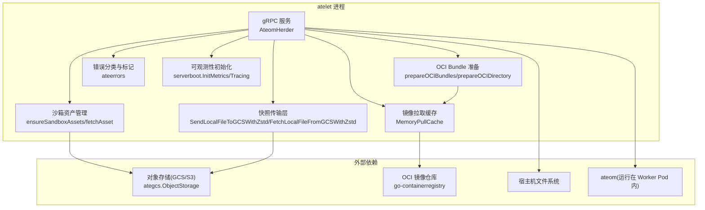
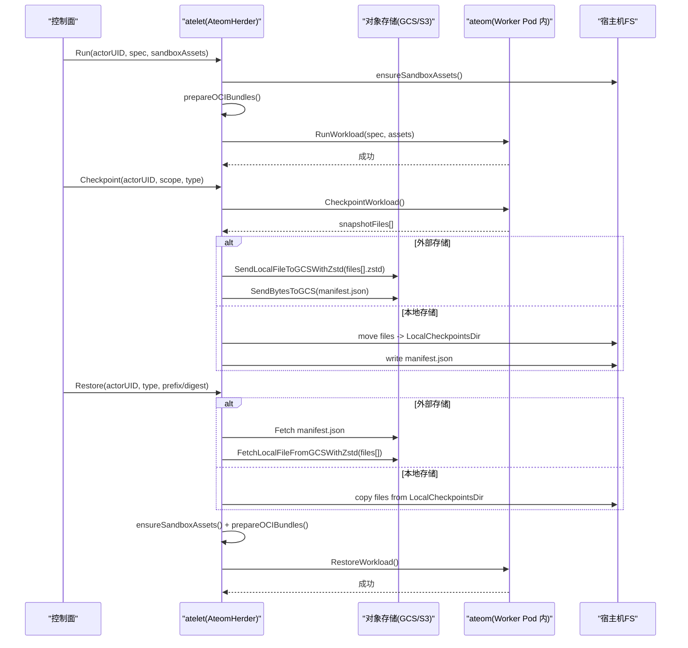
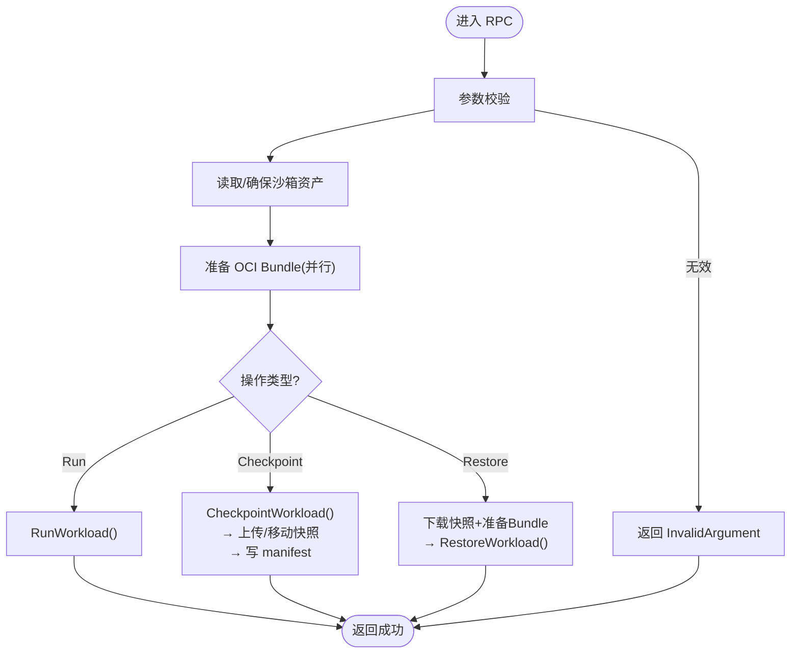
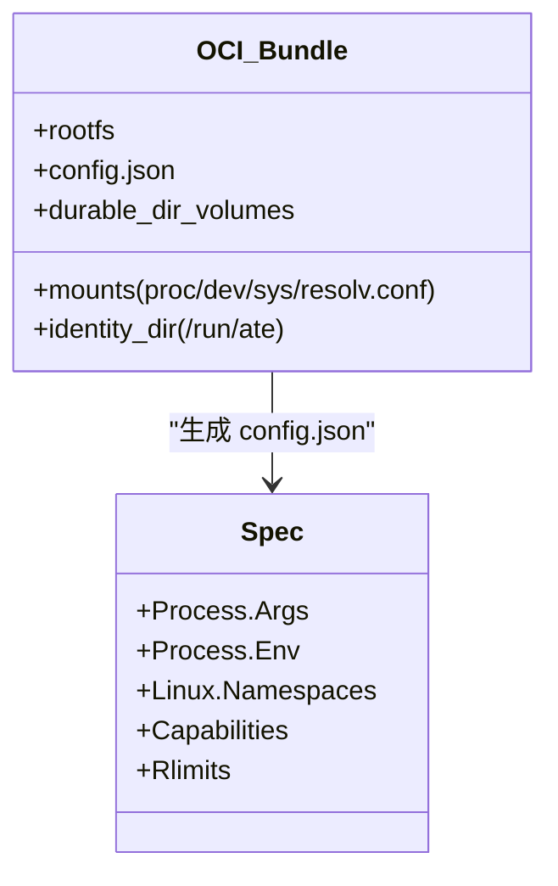
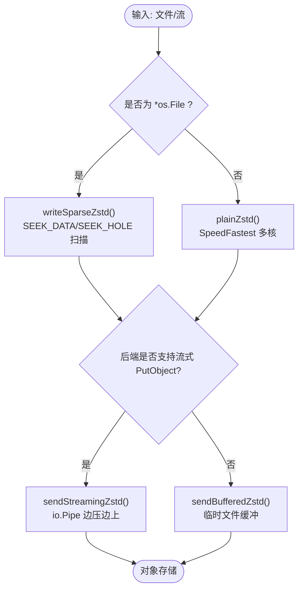
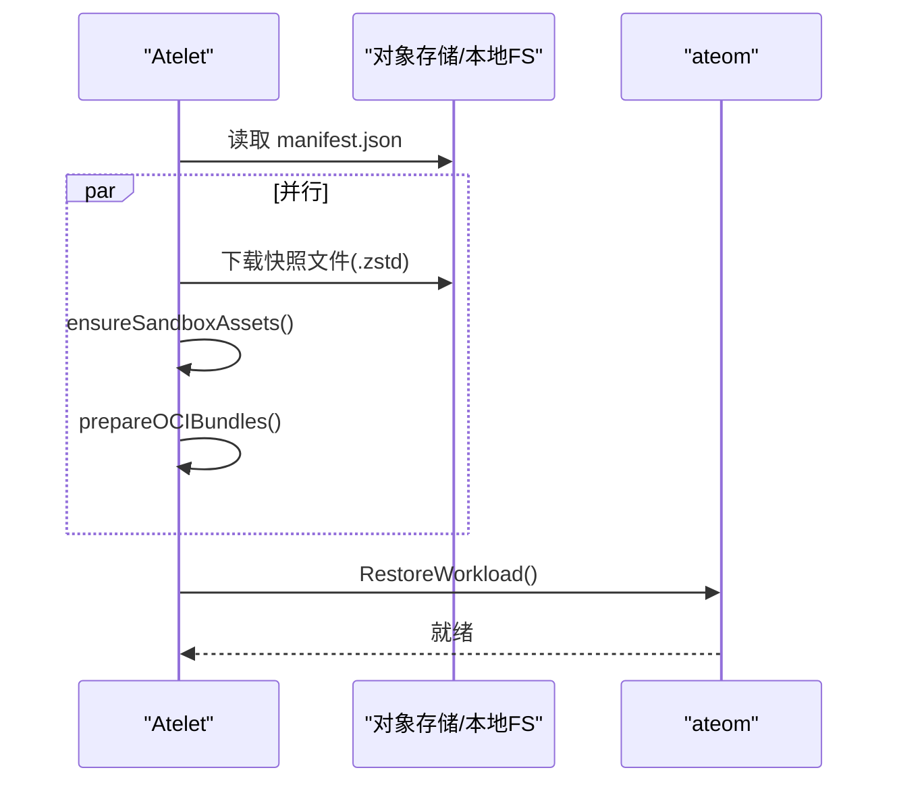
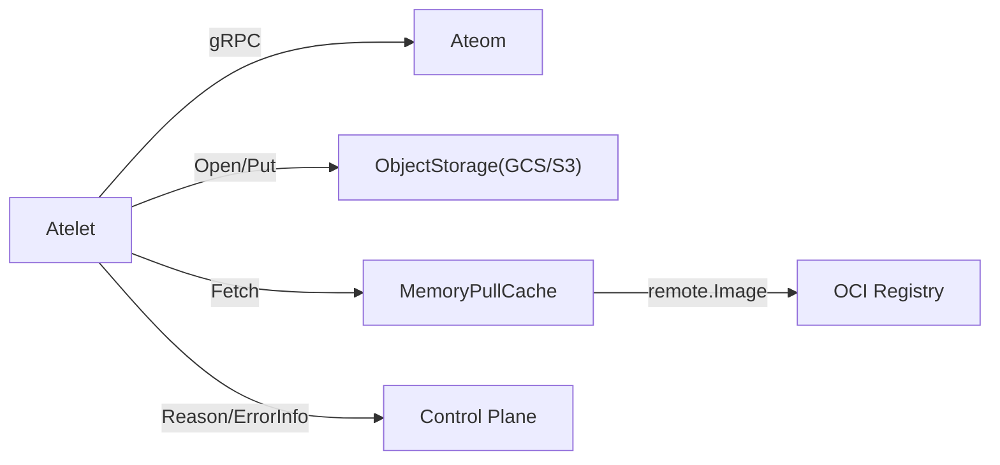

# 节点代理 (atelet)

<cite>
**本文引用的文件**   
- [cmd/atelet/main.go](file://cmd/atelet/main.go)
- [cmd/atelet/oci.go](file://cmd/atelet/oci.go)
- [cmd/atelet/sandbox_assets.go](file://cmd/atelet/sandbox_assets.go)
- [cmd/atelet/internal/ategcs/objects.go](file://cmd/atelet/internal/ategcs/objects.go)
- [cmd/atelet/internal/ategcs/gcs.go](file://cmd/atelet/internal/ategcs/gcs.go)
- [cmd/atelet/internal/ategcs/sparsezstd.go](file://cmd/atelet/internal/ategcs/sparsezstd.go)
- [cmd/atelet/internal/memorypullcache/memorypullcache.go](file://cmd/atelet/internal/memorypullcache/memorypullcache.go)
- [internal/ateerrors/ateerrors.go](file://internal/ateerrors/ateerrors.go)
- [internal/serverboot/serverboot.go](file://internal/serverboot/serverboot.go)
- [docs/architecture.md](file://docs/architecture.md)
</cite>

## 目录
1. [简介](#简介)
2. [项目结构](#项目结构)
3. [核心组件](#核心组件)
4. [架构总览](#架构总览)
5. [详细组件分析](#详细组件分析)
6. [依赖关系分析](#依赖关系分析)
7. [性能与调优](#性能与调优)
8. [故障排查指南](#故障排查指南)
9. [结论](#结论)
10. [附录：监控指标与日志规范](#附录监控指标与日志规范)

## 简介
本文件系统性阐述 atelet 节点代理的工作机制与实现细节，覆盖工作负载管理（Run/Checkpoint/Restore）、OCI 镜像拉取与缓存、快照系统（内存转储、稀疏压缩、增量备份语义）、恢复流程（下载、重建、重启）、安全校验、配置项、性能调优与可观测性。文档面向不同技术背景的读者，提供从高层到代码级的渐进式说明与可视化图示。

## 项目结构
atelet 作为节点级守护进程，以 gRPC 服务对外暴露工作负载编排能力，内部围绕“沙箱资产获取”“OCI Bundle 准备”“快照上传/下载”“与 ateom 的交互”四大主线展开。

图表来源
- [cmd/atelet/main.go:163-183](file://cmd/atelet/main.go#L163-L183)
- [cmd/atelet/sandbox_assets.go:95-111](file://cmd/atelet/sandbox_assets.go#L95-L111)
- [cmd/atelet/oci.go:60-116](file://cmd/atelet/oci.go#L60-L116)
- [cmd/atelet/internal/ategcs/objects.go:95-118](file://cmd/atelet/internal/ategcs/objects.go#L95-L118)
- [cmd/atelet/internal/memorypullcache/memorypullcache.go:73-198](file://cmd/atelet/internal/memorypullcache/memorypullcache.go#L73-L198)
- [internal/serverboot/serverboot.go:124-192](file://internal/serverboot/serverboot.go#L124-L192)

章节来源
- [cmd/atelet/main.go:74-183](file://cmd/atelet/main.go#L74-L183)
- [docs/architecture.md:323-341](file://docs/architecture.md#L323-L341)

## 核心组件
- AteomHerder：atelet 的核心服务，封装 Run/Checkpoint/Restore 等生命周期操作，协调沙箱资产、OCI Bundle、快照传输与 ateom 调用。
- 沙箱资产管理：按架构选择并内容寻址地拉取 runsc 或 microvm 相关二进制，本地缓存并按 SHA256 校验。
- OCI Bundle 准备：基于 go-containerregistry 拉取镜像，解压 rootfs，生成 config.json，挂载身份卷与持久化目录。
- 快照传输层：对大对象采用 zstd 压缩；支持稀疏格式（仅压缩非零区域），并区分流式与缓冲上传路径。
- 镜像拉取缓存：内存 LRU 缓存小镜像，避免重复网络 IO；支持本地仓库重写与 GCP 认证。
- 错误分类：统一 Reason 枚举与 gRPC ErrorInfo，控制面据此决定是否崩溃 Actor。
- 可观测性：Prometheus + OTLP 指标导出，OpenTelemetry 追踪。

章节来源
- [cmd/atelet/main.go:185-213](file://cmd/atelet/main.go#L185-L213)
- [cmd/atelet/sandbox_assets.go:48-111](file://cmd/atelet/sandbox_assets.go#L48-L111)
- [cmd/atelet/oci.go:60-116](file://cmd/atelet/oci.go#L60-L116)
- [cmd/atelet/internal/ategcs/objects.go:156-251](file://cmd/atelet/internal/ategcs/objects.go#L156-L251)
- [cmd/atelet/internal/memorypullcache/memorypullcache.go:35-70](file://cmd/atelet/internal/memorypullcache/memorypullcache.go#L35-L70)
- [internal/ateerrors/ateerrors.go:44-55](file://internal/ateerrors/ateerrors.go#L44-L55)
- [internal/serverboot/serverboot.go:124-192](file://internal/serverboot/serverboot.go#L124-L192)

## 架构总览
atelet 通过 gRPC 接收来自控制面的指令，完成以下关键任务：
- 启动工作负载：准备沙箱二进制与 OCI Bundle，调用 ateom.RunWorkload。
- 检查点：调用 ateom.CheckpointWorkload，将返回的快照文件列表上传至对象存储或移动到本地目录，并写入 manifest.json。
- 恢复：根据类型从对象存储或本地目录下载快照，并行准备沙箱二进制与 OCI Bundle，再调用 ateom.RestoreWorkload。

图表来源
- [cmd/atelet/main.go:215-271](file://cmd/atelet/main.go#L215-L271)
- [cmd/atelet/main.go:309-380](file://cmd/atelet/main.go#L309-L380)
- [cmd/atelet/main.go:454-583](file://cmd/atelet/main.go#L454-L583)
- [cmd/atelet/internal/ategcs/objects.go:95-118](file://cmd/atelet/internal/ategcs/objects.go#L95-L118)
- [cmd/atelet/internal/ategcs/objects.go:270-328](file://cmd/atelet/internal/ategcs/objects.go#L270-L328)

## 详细组件分析

### 工作负载管理：Run/Checkpoint/Restore
- Run
  - 解析请求，确保沙箱资产，记录当前沙箱版本，准备 OCI Bundle，拨号 ateom 并执行 RunWorkload。
- Checkpoint
  - 读取本地记录的沙箱版本，确保对应资产，调用 ateom.CheckpointWorkload，依据返回的文件列表进行外部上传或本地移动，并写入 manifest.json。
- Restore
  - 根据类型加载 manifest.json，并发下载快照与准备 OCI Bundle，最后调用 ateom.RestoreWorkload，并重新写回沙箱记录。

图表来源
- [cmd/atelet/main.go:215-271](file://cmd/atelet/main.go#L215-L271)
- [cmd/atelet/main.go:309-380](file://cmd/atelet/main.go#L309-L380)
- [cmd/atelet/main.go:454-583](file://cmd/atelet/main.go#L454-L583)

章节来源
- [cmd/atelet/main.go:215-271](file://cmd/atelet/main.go#L215-L271)
- [cmd/atelet/main.go:309-380](file://cmd/atelet/main.go#L309-L380)
- [cmd/atelet/main.go:454-583](file://cmd/atelet/main.go#L454-L583)

### 容器生命周期管理与资源隔离
- 容器定义
  - 为 pause 与应用容器分别构建 OCI Bundle，设置进程 argv/env、命名空间、只读 sysfs、proc/dev 挂载、身份卷绑定、持久化目录挂载。
- 资源与安全
  - 使用 Linux Namespaces(pid/net/ipc/uts/mount)，限制 Capabilities，设置 Rlimits，rootfs 使用 os.OpenRoot 约束写入范围，tar 解压时拒绝越界路径与符号链接攻击。
- 身份注入
  - 每个 actor 拥有独立身份目录，以只读方式挂载到 /run/ate，避免环境变量被快照冻结导致恢复后不一致。

图表来源
- [cmd/atelet/oci.go:60-116](file://cmd/atelet/oci.go#L60-L116)
- [cmd/atelet/oci.go:177-300](file://cmd/atelet/oci.go#L177-L300)
- [cmd/atelet/oci.go:338-493](file://cmd/atelet/oci.go#L338-L493)

章节来源
- [cmd/atelet/oci.go:60-116](file://cmd/atelet/oci.go#L60-L116)
- [cmd/atelet/oci.go:177-300](file://cmd/atelet/oci.go#L177-L300)
- [cmd/atelet/oci.go:338-493](file://cmd/atelet/oci.go#L338-L493)

### 快照系统：内存转储、文件系统增量、压缩传输
- 快照来源
  - 由 ateom.CheckpointWorkload 返回具体快照文件列表（如 gVisor 的 image 文件或 microvm 的快照集）。
- 压缩与稀疏
  - 针对大对象（内存镜像）采用 zstd SpeedFastest 多核压缩；当源为文件时使用稀疏格式（仅编码非零 extent），显著降低体积与传输时间。
- 上传策略
  - 流式后端（GCS）：边压缩边上传，无需临时文件。
  - 缓冲后端（S3/rustfs）：先压缩到可 seek 的临时文件，再上传。
- 下载与还原
  - 自动识别稀疏格式与纯 zstd 流；若目标为文件则写入稀疏文件（跳过全零块），否则普通解压。

图表来源
- [cmd/atelet/internal/ategcs/objects.go:141-154](file://cmd/atelet/internal/ategcs/objects.go#L141-L154)
- [cmd/atelet/internal/ategcs/objects.go:156-251](file://cmd/atelet/internal/ategcs/objects.go#L156-L251)
- [cmd/atelet/internal/ategcs/sparsezstd.go:47-135](file://cmd/atelet/internal/ategcs/sparsezstd.go#L47-L135)
- [cmd/atelet/internal/ategcs/sparsezstd.go:137-196](file://cmd/atelet/internal/ategcs/sparsezstd.go#L137-L196)

章节来源
- [cmd/atelet/main.go:309-380](file://cmd/atelet/main.go#L309-L380)
- [cmd/atelet/internal/ategcs/objects.go:95-118](file://cmd/atelet/internal/ategcs/objects.go#L95-L118)
- [cmd/atelet/internal/ategcs/objects.go:270-328](file://cmd/atelet/internal/ategcs/objects.go#L270-L328)
- [cmd/atelet/internal/ategcs/sparsezstd.go:47-135](file://cmd/atelet/internal/ategcs/sparsezstd.go#L47-L135)

### 恢复机制：快照下载、状态重建、服务重启
- 外部快照
  - 先拉取 manifest.json，再并发下载所有 .zstd 快照文件，随后准备沙箱资产与 OCI Bundle，最终调用 ateom.RestoreWorkload。
- 本地快照
  - 直接从本地目录复制快照文件，其余流程相同。
- 并发优化
  - 下载与 Bundle 准备并行执行，缩短冷启动延迟。

图表来源
- [cmd/atelet/main.go:454-583](file://cmd/atelet/main.go#L454-L583)
- [cmd/atelet/internal/ategcs/objects.go:270-328](file://cmd/atelet/internal/ategcs/objects.go#L270-L328)

章节来源
- [cmd/atelet/main.go:454-583](file://cmd/atelet/main.go#L454-L583)

### OCI 镜像管理：拉取、缓存、安全验证
- 拉取与缓存
  - MemoryPullCache 使用 LRU 缓存镜像 tarball 与配置，命中则直接返回；超过阈值的大镜像不缓存，直接流式解压。
- 本地仓库兼容
  - 支持将 localhost/127.x 替换为指定镜像仓库地址，允许 HTTP 拉取以便开发环境。
- 认证
  - 对 GCR/pkg.dev 等仓库启用 GCP 应用默认凭据（可选开关）。
- 安全
  - 镜像根文件系统解压使用 os.OpenRoot 限制路径，拒绝越界与符号链接攻击；目录权限在解压后恢复。

章节来源
- [cmd/atelet/internal/memorypullcache/memorypullcache.go:73-198](file://cmd/atelet/internal/memorypullcache/memorypullcache.go#L73-L198)
- [cmd/atelet/oci.go:338-493](file://cmd/atelet/oci.go#L338-L493)

### 沙箱资产与版本锁定
- 按架构选择资产，内容寻址（SHA256）下载到静态缓存目录，失败时立即终止以避免不一致。
- 每次 Run/Restore 会写回沙箱记录，使后续 Checkpoint 能复现同一版本的二进制。
- 快照 manifest.json 包含快照文件清单与沙箱资产信息，保证跨节点恢复自描述。

章节来源
- [cmd/atelet/sandbox_assets.go:48-111](file://cmd/atelet/sandbox_assets.go#L48-L111)
- [cmd/atelet/sandbox_assets.go:120-184](file://cmd/atelet/sandbox_assets.go#L120-L184)
- [cmd/atelet/sandbox_assets.go:206-241](file://cmd/atelet/sandbox_assets.go#L206-L241)

## 依赖关系分析
- atelet 与 ateom：通过 gRPC 通信，传递 WorkloadSpec、运行时资产路径与快照作用域。
- atelet 与对象存储：抽象 ObjectStorage 接口，GCS 实现支持流式 PutObject；S3 走缓冲路径。
- atelet 与镜像仓库：go-containerregistry 负责拉取与提取，MemoryPullCache 提供内存缓存。
- 错误处理：统一 Reason 与 gRPC ErrorInfo，控制面据此判定是否需要崩溃 Actor。

图表来源
- [cmd/atelet/main.go:755-763](file://cmd/atelet/main.go#L755-L763)
- [cmd/atelet/internal/ategcs/gcs.go:31-66](file://cmd/atelet/internal/ategcs/gcs.go#L31-L66)
- [cmd/atelet/internal/memorypullcache/memorypullcache.go:149-198](file://cmd/atelet/internal/memorypullcache/memorypullcache.go#L149-L198)
- [internal/ateerrors/ateerrors.go:68-99](file://internal/ateerrors/ateerrors.go#L68-L99)

章节来源
- [cmd/atelet/main.go:755-763](file://cmd/atelet/main.go#L755-L763)
- [cmd/atelet/internal/ategcs/gcs.go:31-66](file://cmd/atelet/internal/ategcs/gcs.go#L31-L66)
- [cmd/atelet/internal/memorypullcache/memorypullcache.go:149-198](file://cmd/atelet/internal/memorypullcache/memorypullcache.go#L149-L198)
- [internal/ateerrors/ateerrors.go:68-99](file://internal/ateerrors/ateerrors.go#L68-L99)

## 性能与调优
- 快照压缩
  - 使用 zstd SpeedFastest 与多核编码器，最大化吞吐；稀疏格式避免扫描全量逻辑大小，显著减少 CPU 与 IO。
- 上传路径
  - 优先使用流式上传（GCS），避免中间文件与额外拷贝；S3 场景下缓冲路径仍保持端到端正确性。
- 镜像拉取
  - 对小镜像启用内存缓存，减少网络往返；大镜像直接流式解压，避免内存峰值。
- 并发
  - 恢复阶段快照下载与 Bundle 准备并行，缩短冷启动时间。
- 指标
  - 提供 atelet.snapshot.size 直方图，便于评估快照体积分布。

章节来源
- [cmd/atelet/internal/ategcs/objects.go:156-251](file://cmd/atelet/internal/ategcs/objects.go#L156-L251)
- [cmd/atelet/internal/ategcs/sparsezstd.go:47-135](file://cmd/atelet/internal/ategcs/sparsezstd.go#L47-L135)
- [cmd/atelet/internal/memorypullcache/memorypullcache.go:166-198](file://cmd/atelet/internal/memorypullcache/memorypullcache.go#L166-L198)
- [cmd/atelet/main.go:273-307](file://cmd/atelet/main.go#L273-L307)

## 故障排查指南
- 常见错误分类
  - TERMINAL_FILE_SYSTEM_ERROR：不可恢复的文件系统错误（不存在、权限不足、循环等）。
  - INVALID_SANDBOX_ASSET：沙箱资产哈希不匹配或 URL 非法。
  - INVALID_CHECKPOINT_RESULT：ateom 未返回快照文件。
  - FAILED_SAVE_SNAPSHOT：快照保存失败（上传/移动失败）。
  - INVALID_OBJECT_URL：对象存储 URL 解析失败。
  - FAILED_GET_EXTERNAL_OBJECT：远程对象获取失败。
  - INVALID_CONTAINER_CONFIG：无法生成可执行进程（缺少 ENTRYPOINT/CMD 且未提供 command/args）。
- 定位建议
  - 查看 gRPC 错误详情中的 Reason 与 metadata，确认是否要求崩溃 Actor。
  - 核对对象存储访问（匿名/主客户端）与 URL 前缀是否正确。
  - 检查本地磁盘空间与权限，尤其是静态文件目录与快照目录。
  - 观察 restore 时序日志（download/oci_unpack/ateom_restore）定位瓶颈。

章节来源
- [internal/ateerrors/ateerrors.go:44-55](file://internal/ateerrors/ateerrors.go#L44-L55)
- [internal/ateerrors/ateerrors.go:101-130](file://internal/ateerrors/ateerrors.go#L101-L130)
- [cmd/atelet/main.go:454-583](file://cmd/atelet/main.go#L454-L583)

## 结论
atelet 通过“沙箱资产内容寻址 + OCI Bundle 预构建 + 稀疏压缩快照 + 并发恢复”的组合，实现了高吞吐、低延迟的节点级工作负载管理。其错误分类与可观测性设计便于在生产环境中快速定位问题并进行容量与性能调优。

## 附录：监控指标与日志规范
- 指标
  - atelet.snapshot.size：直方图，单位字节，标签包括 kind、actor_template_namespace、actor_template_name。
- 日志关键字段
  - 恢复阶段耗时分解：download、oci_unpack、ateom_restore、total。
  - 压缩上传/解压统计：object、sparse、logical_bytes、populated_bytes/written_bytes、streaming、took。
- 采集方式
  - Prometheus 端口由 --metrics-listen-addr 配置，默认 :9090。
  - OpenTelemetry Tracing 已集成，可通过 StatsHandler 与 Interceptor 输出链路。

章节来源
- [cmd/atelet/main.go:273-307](file://cmd/atelet/main.go#L273-L307)
- [cmd/atelet/main.go:577-582](file://cmd/atelet/main.go#L577-L582)
- [cmd/atelet/internal/ategcs/objects.go:207-211](file://cmd/atelet/internal/ategcs/objects.go#L207-L211)
- [cmd/atelet/internal/ategcs/objects.go:246-250](file://cmd/atelet/internal/ategcs/objects.go#L246-L250)
- [cmd/atelet/internal/ategcs/objects.go:324-327](file://cmd/atelet/internal/ategcs/objects.go#L324-L327)
- [internal/serverboot/serverboot.go:176-192](file://internal/serverboot/serverboot.go#L176-L192)
