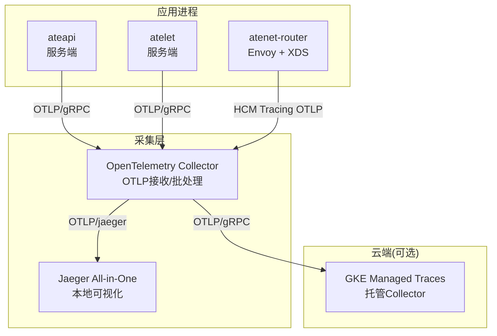
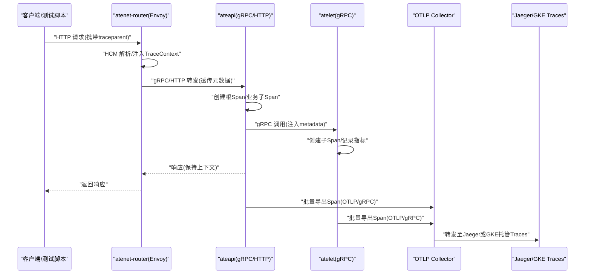
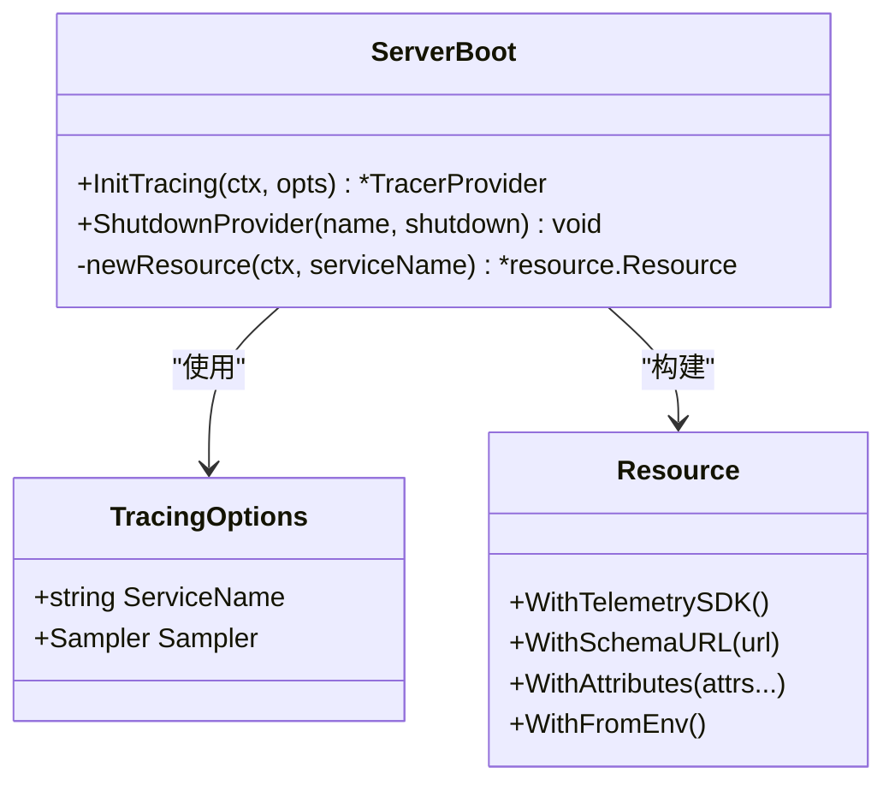
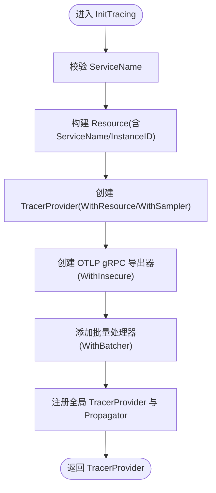
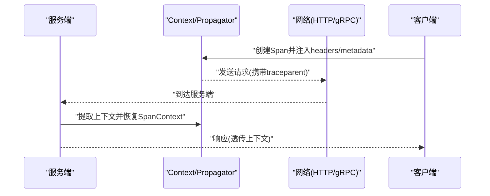
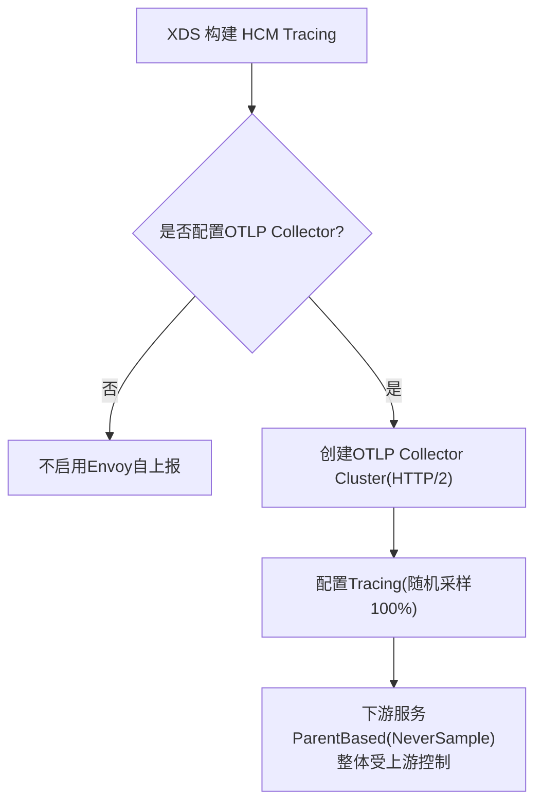
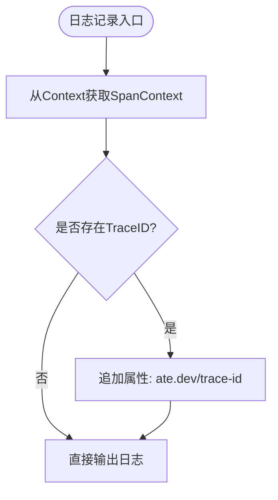
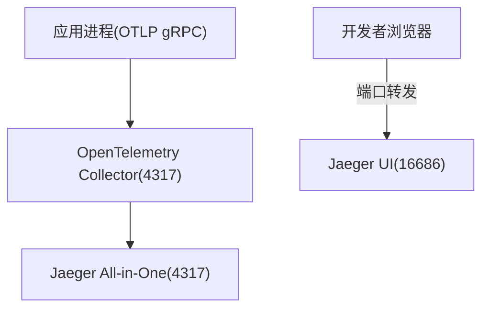
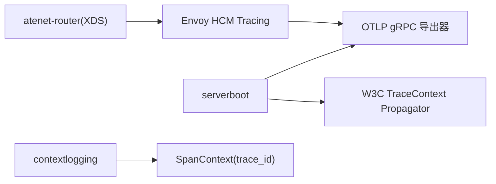

# 分布式追踪

<cite>
**本文引用的文件**   
- [internal/serverboot/serverboot.go](file://internal/serverboot/serverboot.go)
- [cmd/ateapi/main.go](file://cmd/ateapi/main.go)
- [cmd/atelet/main.go](file://cmd/atelet/main.go)
- [cmd/atenet/internal/router/xds.go](file://cmd/atenet/internal/router/xds.go)
- [manifests/ate-install/kind/otel-collector.yaml](file://manifests/ate-install/kind/otel-collector.yaml)
- [docs/dev/best-practices/tracing.md](file://docs/dev/best-practices/tracing.md)
- [internal/contextlogging/contextlogging.go](file://internal/contextlogging/contextlogging.go)
- [internal/ateclient/builder.go](file://internal/ateclient/builder.go)
- [benchmarking/locust/common/trace.py](file://benchmarking/locust/common/trace.py)
</cite>

## 目录
1. [简介](#简介)
2. [项目结构](#项目结构)
3. [核心组件](#核心组件)
4. [架构总览](#架构总览)
5. [详细组件分析](#详细组件分析)
6. [依赖关系分析](#依赖关系分析)
7. [性能考量](#性能考量)
8. [故障排查指南](#故障排查指南)
9. [结论](#结论)
10. [附录](#附录)

## 简介
本文件系统性梳理 Agent Substrate 中基于 OpenTelemetry 的分布式追踪实现，覆盖 Span 创建、上下文传播、采样策略、端到端请求追踪流程、本地开发环境（Jaeger）配置与使用、GKE 环境下 Google Cloud Trace 集成方法，以及自定义追踪中间件的开发要点、性能影响分析与调试技巧。文档面向不同技术背景的读者，提供从概念到代码级映射的渐进式说明。

## 项目结构
本项目在多个服务进程内统一初始化 OpenTelemetry TracerProvider，并通过 OTLP gRPC 将追踪数据导出至收集器；在 Kind 本地环境中通过 OpenTelemetry Collector 转发至 Jaeger，在 GKE 生产环境中则指向集群内的托管 OTEL Collector。

图表来源
- [internal/serverboot/serverboot.go:91-119](file://internal/serverboot/serverboot.go#L91-L119)
- [cmd/atenet/internal/router/xds.go:286-334](file://cmd/atenet/internal/router/xds.go#L286-L334)
- [manifests/ate-install/kind/otel-collector.yaml:26-54](file://manifests/ate-install/kind/otel-collector.yaml#L26-L54)

章节来源
- [internal/serverboot/serverboot.go:15-42](file://internal/serverboot/serverboot.go#L15-L42)
- [manifests/ate-install/kind/otel-collector.yaml:15-54](file://manifests/ate-install/kind/otel-collector.yaml#L15-L54)

## 核心组件
- 追踪提供者与资源：统一封装 TracerProvider 初始化、Resource 构建（含 ServiceName/ServiceInstanceID）、全局 Propagator 设置与批量导出器装配。
- 采样策略：按服务角色选择 ParentBased(AlwaysSample) 或 ParentBased(NeverSample)，并结合客户端注入的父上下文决定最终是否采样。
- 上下文传播：采用 W3C TraceContext TextMap 传播器，HTTP/gRPC 自动注入/提取 traceparent/tracestate。
- 日志关联：日志处理器自动附加当前 SpanContext 的 trace_id，便于跨系统定位。
- Envoy 侧追踪：XDS 动态生成 HCM Tracing 配置与 OTLP Collector Cluster，使 Envoy 自身也能上报链路数据。

章节来源
- [internal/serverboot/serverboot.go:57-119](file://internal/serverboot/serverboot.go#L57-L119)
- [internal/contextlogging/contextlogging.go:38-46](file://internal/contextlogging/contextlogging.go#L38-L46)
- [cmd/atenet/internal/router/xds.go:468-479](file://cmd/atenet/internal/router/xds.go#L468-L479)

## 架构总览
下图展示从客户端发起请求到跨服务调用的端到端追踪路径，包括 HTTP/gRPC 客户端注入、服务端自动提取、子 Span 创建、下游调用传播、以及最终由 OTLP 导出至 Collector/Jaeger 或 GKE Managed Traces。

图表来源
- [docs/dev/best-practices/tracing.md:97-138](file://docs/dev/best-practices/tracing.md#L97-L138)
- [internal/serverboot/serverboot.go:91-119](file://internal/serverboot/serverboot.go#L91-L119)
- [cmd/atenet/internal/router/xds.go:468-479](file://cmd/atenet/internal/router/xds.go#L468-L479)

## 详细组件分析

### 组件一：追踪初始化与资源管理（serverboot）
- 职责
  - 构建共享 Resource（包含 SDK 信息、Schema URL、ServiceName、ServiceInstanceID），并允许 OTEL_* 环境变量覆盖默认值。
  - 创建 TracerProvider，装配 OTLP gRPC 导出器与批量处理器，注册全局 Propagator（W3C TraceContext）。
  - 提供统一的 Shutdown 辅助函数，确保优雅退出时 flush 数据。
- 关键点
  - 采样策略由调用方传入，典型用法：服务端按需采样（ParentBased(NeverSample) 或 AlwaysSample），内部工具进程默认不采样。
  - 导出器以 WithInsecure() 方式连接 GKE 托管 Collector（集群内 mTLS 由平台保障）。
- 复杂度与性能
  - 初始化为一次性开销；批量导出降低网络与序列化成本。
  - Resource 合并可能产生部分成功警告（ErrPartialResource/ErrSchemaURLConflict），不影响功能。

图表来源
- [internal/serverboot/serverboot.go:57-119](file://internal/serverboot/serverboot.go#L57-L119)

章节来源
- [internal/serverboot/serverboot.go:57-119](file://internal/serverboot/serverboot.go#L57-L119)

### 组件二：采样策略与服务差异
- ateapi：通常启用 AlwaysSample（或根据开关控制），以便对外暴露可观测性。
- atelet/atenet-router/ateom-gvisor/microvm：默认 NeverSample，避免内部流量放大。
- 客户端/压测：可按概率采样（如 Python Locust 的 UpdatableSampler），支持运行时调整概率。

图表来源
- [internal/serverboot/serverboot.go:91-119](file://internal/serverboot/serverboot.go#L91-L119)

章节来源
- [cmd/ateapi/main.go:89-90](file://cmd/ateapi/main.go#L89-L90)
- [cmd/atelet/main.go:84-86](file://cmd/atelet/main.go#L84-L86)
- [cmd/atenet/internal/router/xds.go:475-477](file://cmd/atenet/internal/router/xds.go#L475-L477)
- [benchmarking/locust/common/trace.py:35-59](file://benchmarking/locust/common/trace.py#L35-L59)

### 组件三：上下文传播（HTTP/gRPC）
- 服务器端
  - gRPC：通过 StatsHandler 自动注入/提取 metadata。
  - HTTP：通过 otelhttp 包装路由，自动处理 traceparent/tracestate。
- 客户端
  - gRPC：客户端 StatsHandler 注入 metadata。
  - HTTP：Transport 包装自动注入 headers。
- 文本映射传播器：全局设置为 W3C TraceContext。

图表来源
- [docs/dev/best-practices/tracing.md:97-138](file://docs/dev/best-practices/tracing.md#L97-L138)
- [internal/serverboot/serverboot.go:116-118](file://internal/serverboot/serverboot.go#L116-L118)
- [internal/ateclient/builder.go:332-332](file://internal/ateclient/builder.go#L332-L332)

章节来源
- [docs/dev/best-practices/tracing.md:97-138](file://docs/dev/best-practices/tracing.md#L97-L138)
- [internal/serverboot/serverboot.go:116-118](file://internal/serverboot/serverboot.go#L116-L118)
- [internal/ateclient/builder.go:311-332](file://internal/ateclient/builder.go#L311-L332)

### 组件四：Envoy 侧追踪（atenet-router）
- 动态生成 OTLP Collector Cluster（STRICT_DNS，HTTP/2），用于 HCM Tracing 上报。
- buildTracing 配置随机采样策略（对无父上下文的请求始终采样），但下游服务采用 ParentBased(NeverSample)，整体仍受上游客户端控制。

图表来源
- [cmd/atenet/internal/router/xds.go:286-334](file://cmd/atenet/internal/router/xds.go#L286-L334)
- [cmd/atenet/internal/router/xds.go:468-479](file://cmd/atenet/internal/router/xds.go#L468-L479)

章节来源
- [cmd/atenet/internal/router/xds.go:286-334](file://cmd/atenet/internal/router/xds.go#L286-L334)
- [cmd/atenet/internal/router/xds.go:468-479](file://cmd/atenet/internal/router/xds.go#L468-L479)

### 组件五：日志与追踪关联
- 日志处理器从 Context 中提取当前 SpanContext 的 trace_id，并以固定键名写入日志，便于在日志系统中快速定位对应 Trace。

图表来源
- [internal/contextlogging/contextlogging.go:38-46](file://internal/contextlogging/contextlogging.go#L38-L46)

章节来源
- [internal/contextlogging/contextlogging.go:38-46](file://internal/contextlogging/contextlogging.go#L38-L46)

### 组件六：本地开发环境（Kind + Jaeger）
- 部署 OpenTelemetry Collector 与 Jaeger All-in-One，Collector 接收 OTLP 后转发至 Jaeger。
- 关键端口
  - Collector OTLP gRPC: 4317
  - Collector OTLP HTTP: 4318
  - Jaeger Query UI: 16686
- 使用方法
  - 将服务进程的 OTEL_EXPORTER_OTLP_ENDPOINT 指向 Collector 的 OTLP gRPC 地址。
  - 本地端口转发访问 Jaeger UI，输入 Trace ID 查看链路。

图表来源
- [manifests/ate-install/kind/otel-collector.yaml:26-54](file://manifests/ate-install/kind/otel-collector.yaml#L26-L54)
- [manifests/ate-install/kind/otel-collector.yaml:116-163](file://manifests/ate-install/kind/otel-collector.yaml#L116-L163)

章节来源
- [manifests/ate-install/kind/otel-collector.yaml:26-54](file://manifests/ate-install/kind/otel-collector.yaml#L26-L54)
- [manifests/ate-install/kind/otel-collector.yaml:116-163](file://manifests/ate-install/kind/otel-collector.yaml#L116-L163)

### 组件七：GKE 环境集成（Google Cloud Trace）
- 服务端通过 OTLP gRPC 将追踪数据发送至集群内的托管 OTEL Collector（mTLS 由平台管理）。
- 环境变量
  - OTEL_EXPORTER_OTLP_ENDPOINT：指向托管 Collector 的 OTLP gRPC 地址。
- 注意
  - 代码中使用 WithInsecure() 是因为托管 Collector 不支持客户端验证其 TLS 证书。

章节来源
- [docs/dev/best-practices/tracing.md:83-95](file://docs/dev/best-practices/tracing.md#L83-L95)
- [internal/serverboot/serverboot.go:106-109](file://internal/serverboot/serverboot.go#L106-L109)

### 组件八：自定义追踪中间件开发指南
- 目标
  - 在不侵入业务逻辑的前提下，为特定接口或模块增加 Span 与属性。
- 步骤建议
  - 在服务启动阶段完成 TracerProvider 与 Propagator 初始化（复用 serverboot.InitTracing）。
  - 针对 HTTP：使用 otelhttp 包装路由或在 Handler 中手动创建 Span。
  - 针对 gRPC：使用 StatsHandler 自动注入/提取；必要时在业务层创建子 Span。
  - 为关键操作添加属性（如用户标识、租户、外部请求 ID），并确保敏感字段脱敏。
  - 结合日志处理器，自动附带 trace_id，提升排障效率。
- 参考实践
  - 服务端最佳实践与示例见“最佳实践”文档。
  - 客户端注入示例见 Go/Python 示例片段路径。

章节来源
- [docs/dev/best-practices/tracing.md:97-138](file://docs/dev/best-practices/tracing.md#L97-L138)
- [docs/dev/best-practices/tracing.md:140-200](file://docs/dev/best-practices/tracing.md#L140-L200)
- [internal/contextlogging/contextlogging.go:38-46](file://internal/contextlogging/contextlogging.go#L38-L46)

## 依赖关系分析
- 组件耦合
  - serverboot 作为基础设施层，被各服务进程复用，负责 TracerProvider/MeterProvider 初始化与导出器装配。
  - atenet-router 通过 XDS 动态下发 Envoy 配置，包含 HCM Tracing 与 OTLP Collector 集群定义。
  - contextlogging 与 tracing 解耦，仅读取 SpanContext 中的 trace_id，低耦合高内聚。
- 外部依赖
  - OpenTelemetry SDK/Exporter（OTLP gRPC）
  - Envoy（通过 XDS 配置）
  - Jaeger（本地开发）
  - GKE Managed Traces（生产）

图表来源
- [internal/serverboot/serverboot.go:91-119](file://internal/serverboot/serverboot.go#L91-L119)
- [cmd/atenet/internal/router/xds.go:468-479](file://cmd/atenet/internal/router/xds.go#L468-L479)
- [internal/contextlogging/contextlogging.go:38-46](file://internal/contextlogging/contextlogging.go#L38-L46)

章节来源
- [internal/serverboot/serverboot.go:91-119](file://internal/serverboot/serverboot.go#L91-L119)
- [cmd/atenet/internal/router/xds.go:468-479](file://cmd/atenet/internal/router/xds.go#L468-L479)
- [internal/contextlogging/contextlogging.go:38-46](file://internal/contextlogging/contextlogging.go#L38-L46)

## 性能考量
- 采样策略
  - 服务端默认 NeverSample，避免内部流量放大；仅在需要时开启 AlwaysSample 或基于父上下文采样。
  - 压测场景可使用概率采样（TraceIdRatioBased），支持运行时调整概率。
- 批量导出
  - 使用 WithBatcher 聚合 Span，减少网络与序列化开销。
- 资源开销
  - Resource 构建与合并可能产生警告，但不影响功能；尽量复用全局 Provider，避免重复初始化。
- 日志关联
  - 自动附加 trace_id 的开销极低，有助于快速定位问题。

[本节为通用指导，无需具体文件引用]

## 故障排查指南
- 无法看到 Trace
  - 检查 OTEL_EXPORTER_OTLP_ENDPOINT 是否正确指向 Collector。
  - 确认采样策略是否为 NeverSample，导致未采样。
  - 确认客户端是否注入了 traceparent/tracestate。
- 本地 Jaeger 无数据
  - 确认 Collector 与 Jaeger 已部署且端口可达。
  - 使用端口转发访问 Jaeger UI，输入 Trace ID 查询。
- 日志缺少 trace_id
  - 确认日志处理器已启用并从 Context 提取 SpanContext。
- 导出失败
  - 检查网络连通性与权限（GKE 托管 Collector 使用平台 mTLS）。
  - 关注 provider.Shutdown 是否被调用，确保数据 flush。

章节来源
- [docs/dev/best-practices/tracing.md:83-95](file://docs/dev/best-practices/tracing.md#L83-L95)
- [internal/serverboot/serverboot.go:156-164](file://internal/serverboot/serverboot.go#L156-L164)
- [internal/contextlogging/contextlogging.go:38-46](file://internal/contextlogging/contextlogging.go#L38-L46)

## 结论
Agent Substrate 通过统一的 serverboot 初始化 OpenTelemetry，结合 W3C TraceContext 传播与灵活的采样策略，实现了跨服务的端到端追踪。本地开发借助 Collector + Jaeger 提供可视化能力，生产环境对接 GKE 托管 Traces，兼顾易用性与可靠性。建议在新增服务或中间件时遵循最佳实践，合理设置采样与属性，充分利用日志与追踪的联动进行高效排障。

[本节为总结，无需具体文件引用]

## 附录
- 关键环境变量
  - OTEL_EXPORTER_OTLP_ENDPOINT：OTLP 导出端点（gRPC/HTTP）
  - OTEL_SERVICE_NAME：服务名称（可通过 Resource 覆盖）
- 常用端口
  - Collector OTLP gRPC: 4317
  - Collector OTLP HTTP: 4318
  - Jaeger UI: 16686
- 参考实现路径
  - 服务端初始化与采样：[internal/serverboot/serverboot.go:91-119](file://internal/serverboot/serverboot.go#L91-L119)
  - 服务端采样差异：[cmd/ateapi/main.go:89-90](file://cmd/ateapi/main.go#L89-L90)、[cmd/atelet/main.go:84-86](file://cmd/atelet/main.go#L84-L86)
  - Envoy 侧追踪配置：[cmd/atenet/internal/router/xds.go:286-334](file://cmd/atenet/internal/router/xds.go#L286-L334)、[cmd/atenet/internal/router/xds.go:468-479](file://cmd/atenet/internal/router/xds.go#L468-L479)
  - 本地 Jaeger 部署：[manifests/ate-install/kind/otel-collector.yaml:26-54](file://manifests/ate-install/kind/otel-collector.yaml#L26-L54)、[manifests/ate-install/kind/otel-collector.yaml:116-163](file://manifests/ate-install/kind/otel-collector.yaml#L116-L163)
  - 客户端注入示例（Go/Python）：[docs/dev/best-practices/tracing.md:140-200](file://docs/dev/best-practices/tracing.md#L140-L200)、[benchmarking/locust/common/trace.py:70-118](file://benchmarking/locust/common/trace.py#L70-L118)
  - 日志关联 trace_id：[internal/contextlogging/contextlogging.go:38-46](file://internal/contextlogging/contextlogging.go#L38-L46)
