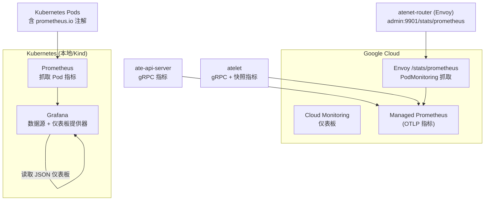
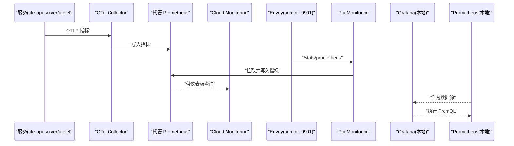
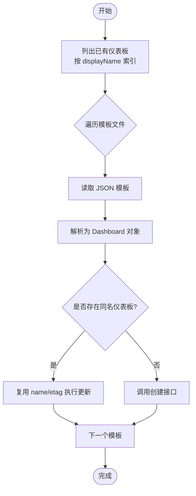
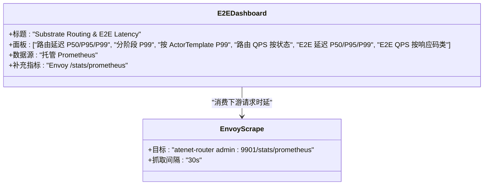
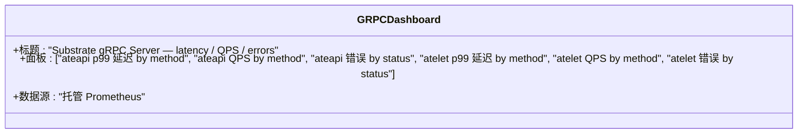
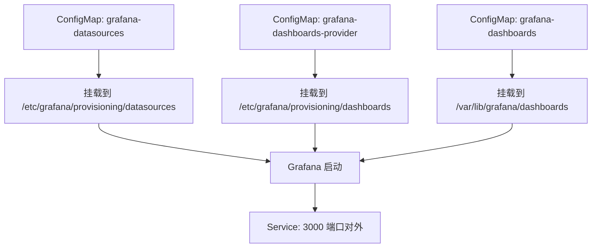
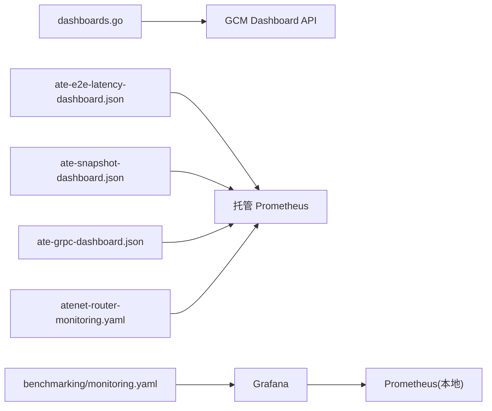

# 可视化仪表板

<cite>
**本文引用的文件**   
- [tools/setup-gcp/dashboards/README.md](file://tools/setup-gcp/dashboards/README.md)
- [tools/setup-gcp/cmd/dashboards.go](file://tools/setup-gcp/cmd/dashboards.go)
- [tools/setup-gcp/dashboards/ate-grpc-dashboard.json](file://tools/setup-gcp/dashboards/ate-grpc-dashboard.json)
- [tools/setup-gcp/dashboards/ate-e2e-latency-dashboard.json](file://tools/setup-gcp/dashboards/ate-e2e-latency-dashboard.json)
- [tools/setup-gcp/dashboards/ate-snapshot-dashboard.json](file://tools/setup-gcp/dashboards/ate-snapshot-dashboard.json)
- [manifests/ate-install/atenet-router-monitoring.yaml](file://manifests/ate-install/atenet-router-monitoring.yaml)
- [benchmarking/monitoring.yaml](file://benchmarking/monitoring.yaml)
</cite>

## 目录
1. [简介](#简介)
2. [项目结构](#项目结构)
3. [核心组件](#核心组件)
4. [架构总览](#架构总览)
5. [详细组件分析](#详细组件分析)
6. [依赖关系分析](#依赖关系分析)
7. [性能与可观测性建议](#性能与可观测性建议)
8. [故障排查指南](#故障排查指南)
9. [结论](#结论)
10. [附录：自定义仪表板开发指南](#附录自定义仪表板开发指南)

## 简介
本文件面向在 Google Cloud Monitoring（GCM）和 Grafana 上构建 ATE 系统可视化监控的工程师，提供以下能力说明与实践指导：
- 预定义仪表板的创建、更新与使用方式
- 关键监控视图的设计思路（系统健康度、性能指标、资源利用率等）
- 自定义仪表板的开发流程（PromQL 查询、图表类型选择、布局设计）
- 告警规则配置、通知渠道设置与故障响应流程的最佳实践

## 项目结构
仓库中与可视化仪表板相关的核心内容集中在如下位置：
- GCM 仪表板 JSON 模板与工具：tools/setup-gcp/dashboards/*
- GCM 仪表板自动化部署命令：tools/setup-gcp/cmd/dashboards.go
- Envoy E2E 指标抓取配置：manifests/ate-install/atenet-router-monitoring.yaml
- 本地基准测试环境中的 Grafana 部署与数据源/仪表板提供器：benchmarking/monitoring.yaml

图示来源
- [tools/setup-gcp/cmd/dashboards.go:32-36](file://tools/setup-gcp/cmd/dashboards.go#L32-L36)
- [manifests/ate-install/atenet-router-monitoring.yaml:15-35](file://manifests/ate-install/atenet-router-monitoring.yaml#L15-L35)
- [benchmarking/monitoring.yaml:134-166](file://benchmarking/monitoring.yaml#L134-L166)
- [benchmarking/monitoring.yaml:517-574](file://benchmarking/monitoring.yaml#L517-L574)

章节来源
- [tools/setup-gcp/dashboards/README.md:1-26](file://tools/setup-gcp/dashboards/README.md#L1-L26)
- [tools/setup-gcp/cmd/dashboards.go:32-36](file://tools/setup-gcp/cmd/dashboards.go#L32-L36)
- [manifests/ate-install/atenet-router-monitoring.yaml:15-35](file://manifests/ate-install/atenet-router-monitoring.yaml#L15-L35)
- [benchmarking/monitoring.yaml:134-166](file://benchmarking/monitoring.yaml#L134-L166)
- [benchmarking/monitoring.yaml:517-574](file://benchmarking/monitoring.yaml#L517-L574)

## 核心组件
- GCM 仪表板模板
  - ate-grpc-dashboard.json：按方法维度展示 gRPC 延迟（p50/p95/p99）、请求速率与错误率
  - ate-e2e-latency-dashboard.json：路由 P50/P95/P99、分阶段 P99、按 ActorTemplate 的 P99、QPS 分类；以及基于 Envoy 的端到端上下文延迟与 QPS
  - ate-snapshot-dashboard.json：快照镜像大小分布（P50/P95/P99）、按 ActorTemplate 的 P99、快照 QPS 与直方图热力图
- 仪表板自动化工具
  - dashboards.go：列出并比对现有仪表板，按 displayName 实现幂等创建或更新
- Envoy E2E 指标抓取
  - atenet-router-monitoring.yaml：通过 PodMonitoring 抓取 Envoy admin /stats/prometheus，将下游请求时延等指标送入托管 Prometheus
- 本地 Grafana 环境
  - monitoring.yaml：包含 Prometheus 抓取、Grafana 数据源与仪表板提供器的 ConfigMap，以及 Grafana Deployment 与 Service

章节来源
- [tools/setup-gcp/dashboards/README.md:1-26](file://tools/setup-gcp/dashboards/README.md#L1-L26)
- [tools/setup-gcp/cmd/dashboards.go:42-102](file://tools/setup-gcp/cmd/dashboards.go#L42-L102)
- [manifests/ate-install/atenet-router-monitoring.yaml:15-35](file://manifests/ate-install/atenet-router-monitoring.yaml#L15-L35)
- [benchmarking/monitoring.yaml:134-166](file://benchmarking/monitoring.yaml#L134-L166)
- [benchmarking/monitoring.yaml:517-574](file://benchmarking/monitoring.yaml#L517-L574)

## 架构总览
下图展示了从服务侧指标采集到 GCM/Grafana 可视化的整体链路。ATE 组件通过 OTLP 上报指标至托管 Prometheus，Envoy 通过 PodMonitoring 暴露的 /stats/prometheus 被采集后进入同一存储；GCM 仪表板直接消费这些指标进行渲染。本地基准环境中，Prometheus 抓取 Kubernetes Pod 指标，Grafana 通过数据源与仪表板提供器加载 JSON 仪表板。

图示来源
- [tools/setup-gcp/dashboards/README.md:1-26](file://tools/setup-gcp/dashboards/README.md#L1-L26)
- [manifests/ate-install/atenet-router-monitoring.yaml:15-35](file://manifests/ate-install/atenet-router-monitoring.yaml#L15-L35)
- [benchmarking/monitoring.yaml:59-85](file://benchmarking/monitoring.yaml#L59-L85)
- [benchmarking/monitoring.yaml:134-166](file://benchmarking/monitoring.yaml#L134-L166)

## 详细组件分析

### 组件一：GCM 仪表板模板与自动化应用
- 模板清单与用途
  - ate-grpc-dashboard.json：聚焦 gRPC 服务端延迟、吞吐与错误
  - ate-e2e-latency-dashboard.json：聚焦路由与端到端上下文延迟、QPS 分类
  - ate-snapshot-dashboard.json：聚焦快照大小分布与吞吐
- 自动化应用流程
  - 工具会列举当前项目的仪表板，按 displayName 匹配决定“创建”或“更新”，保证幂等
  - 支持通过命令行参数指定仪表板目录，默认指向 tools/setup-gcp/dashboards

图示来源
- [tools/setup-gcp/cmd/dashboards.go:42-102](file://tools/setup-gcp/cmd/dashboards.go#L42-L102)
- [tools/setup-gcp/cmd/dashboards.go:32-36](file://tools/setup-gcp/cmd/dashboards.go#L32-L36)

章节来源
- [tools/setup-gcp/dashboards/README.md:13-26](file://tools/setup-gcp/dashboards/README.md#L13-L26)
- [tools/setup-gcp/cmd/dashboards.go:42-102](file://tools/setup-gcp/cmd/dashboards.go#L42-L102)

### 组件二：E2E 延迟仪表板（Substrate Routing & E2E Latency）
- 设计要点
  - 路由延迟：P50/P95/P99 趋势
  - 分阶段 P99：对比 substrate routing、ateapi ResumeActor、atelet Restore
  - 按 ActorTemplate 的 P99：定位慢路径
  - 路由 QPS 按状态：观察吞吐与健康
  - 端到端上下文延迟：来自 Envoy 的下游请求时延（ms），用于理解用户视角的整体体验
  - 端到端 QPS 按响应码类：观察成功/失败比例
- 数据来源
  - OTLP 指标经托管 Prometheus 聚合
  - Envoy 指标通过 PodMonitoring 抓取 /stats/prometheus

图示来源
- [tools/setup-gcp/dashboards/ate-e2e-latency-dashboard.json:1-217](file://tools/setup-gcp/dashboards/ate-e2e-latency-dashboard.json#L1-L217)
- [manifests/ate-install/atenet-router-monitoring.yaml:15-35](file://manifests/ate-install/atenet-router-monitoring.yaml#L15-L35)

章节来源
- [tools/setup-gcp/dashboards/ate-e2e-latency-dashboard.json:1-217](file://tools/setup-gcp/dashboards/ate-e2e-latency-dashboard.json#L1-L217)
- [manifests/ate-install/atenet-router-monitoring.yaml:15-35](file://manifests/ate-install/atenet-router-monitoring.yaml#L15-L35)

### 组件三：gRPC 性能仪表板（Substrate gRPC Server — latency / QPS / errors）
- 设计要点
  - 按方法维度统计 p99 延迟
  - 按方法维度统计请求速率
  - 非 OK 状态的错误速率
  - 覆盖 ate-api-server 与 atelet 两个服务
- 适用场景
  - 快速定位热点方法与异常状态码
  - 评估扩容与优化效果

图示来源
- [tools/setup-gcp/dashboards/ate-grpc-dashboard.json:1-159](file://tools/setup-gcp/dashboards/ate-grpc-dashboard.json#L1-L159)

章节来源
- [tools/setup-gcp/dashboards/ate-grpc-dashboard.json:1-159](file://tools/setup-gcp/dashboards/ate-grpc-dashboard.json#L1-L159)

### 组件四：快照状态仪表板（Substrate Snapshot Size & QPS）
- 设计要点
  - 快照镜像大小分布：P50/P95/P99
  - 按 ActorTemplate 的 P99 大小：识别大镜像模板
  - 快照 QPS：评估吞吐能力
  - 直方图热力图：直观观察大小分布变化
- 适用场景
  - 容量规划与成本优化
  - 发现异常增长或退化

图示来源
- [tools/setup-gcp/dashboards/ate-snapshot-dashboard.json:1-137](file://tools/setup-gcp/dashboards/ate-snapshot-dashboard.json#L1-L137)

章节来源
- [tools/setup-gcp/dashboards/ate-snapshot-dashboard.json:1-137](file://tools/setup-gcp/dashboards/ate-snapshot-dashboard.json#L1-L137)

### 组件五：本地 Grafana 环境（基准测试）
- 数据源与仪表板提供器
  - 通过 ConfigMap 注入 Prometheus 数据源
  - 通过仪表板提供器从文件加载 JSON 仪表板
- 部署与服务
  - Grafana Deployment 挂载三个卷：数据源、提供器、仪表板文件
  - 暴露 3000 端口访问 UI

图示来源
- [benchmarking/monitoring.yaml:134-166](file://benchmarking/monitoring.yaml#L134-L166)
- [benchmarking/monitoring.yaml:517-574](file://benchmarking/monitoring.yaml#L517-L574)

章节来源
- [benchmarking/monitoring.yaml:134-166](file://benchmarking/monitoring.yaml#L134-L166)
- [benchmarking/monitoring.yaml:517-574](file://benchmarking/monitoring.yaml#L517-L574)

## 依赖关系分析
- 代码与配置耦合
  - dashboards.go 依赖 dashboard API 客户端与 Cobra CLI，管理 JSON 模板的生命周期
  - E2E 仪表板依赖 Envoy 指标的可用性（由 PodMonitoring 保障）
  - 本地 Grafana 依赖 Prometheus 与 ConfigMap 提供的数据源与仪表板
- 外部依赖
  - Google Cloud Monitoring API
  - Managed Prometheus（OTLP 接收）
  - Kubernetes PodMonitoring 控制器

图示来源
- [tools/setup-gcp/cmd/dashboards.go:42-102](file://tools/setup-gcp/cmd/dashboards.go#L42-L102)
- [manifests/ate-install/atenet-router-monitoring.yaml:15-35](file://manifests/ate-install/atenet-router-monitoring.yaml#L15-L35)
- [benchmarking/monitoring.yaml:134-166](file://benchmarking/monitoring.yaml#L134-L166)

章节来源
- [tools/setup-gcp/cmd/dashboards.go:42-102](file://tools/setup-gcp/cmd/dashboards.go#L42-L102)
- [manifests/ate-install/atenet-router-monitoring.yaml:15-35](file://manifests/ate-install/atenet-router-monitoring.yaml#L15-L35)
- [benchmarking/monitoring.yaml:134-166](file://benchmarking/monitoring.yaml#L134-L166)

## 性能与可观测性建议
- 指标粒度与窗口
  - 延迟直方图建议使用 5m 滑动窗口计算分位数，兼顾实时性与稳定性
  - 快照大小分布可使用更长窗口（如 1h）以平滑波动
- 标签与维度
  - 合理保留 actor_template_name、rpc.method、outcome 等维度，便于定位问题
  - 避免高基数标签导致查询变慢
- 图表类型选择
  - 趋势与阈值：折线图
  - 分布与长尾：热力图
  - 多指标对比：双轴或多数据集
- 端到端视角
  - 结合 Envoy 的下游请求时延，区分系统内部开销与网络/网关影响

[本节为通用建议，不直接分析具体文件]

## 故障排查指南
- 无法看到 E2E 延迟曲线
  - 检查 atenet-router 的 PodMonitoring 是否生效，确认 /stats/prometheus 可达且被周期性抓取
- 仪表板未更新
  - 确认 dashboards.go 运行时的 project-id 与 dashboard-dir 是否正确
  - 查看是否有同名仪表板导致更新失败（注意 etag 冲突）
- Grafana 无数据
  - 确认 Prometheus 已抓取到 Pod 指标（prometheus.io 注解）
  - 检查 Grafana 数据源 URL 与权限

章节来源
- [manifests/ate-install/atenet-router-monitoring.yaml:15-35](file://manifests/ate-install/atenet-router-monitoring.yaml#L15-L35)
- [tools/setup-gcp/cmd/dashboards.go:104-118](file://tools/setup-gcp/cmd/dashboards.go#L104-L118)
- [benchmarking/monitoring.yaml:59-85](file://benchmarking/monitoring.yaml#L59-L85)
- [benchmarking/monitoring.yaml:134-166](file://benchmarking/monitoring.yaml#L134-L166)

## 结论
本项目提供了完整的 GCM 仪表板模板与自动化应用工具，并结合 Envoy 的 E2E 指标与本地 Grafana 环境，形成从采集、聚合到可视化的闭环。通过合理的指标维度、窗口与图表类型，能够快速定位性能瓶颈与异常，支撑生产环境的稳定运行与持续优化。

[本节为总结性内容，不直接分析具体文件]

## 附录：自定义仪表板开发指南

### 在 GCM 中创建/更新仪表板
- 使用工具
  - 运行 create dashboards 子命令，自动幂等地创建或更新仪表板
  - 也可手动通过 gcloud 命令对单个 JSON 文件进行 apply
- 模板组织
  - 将 JSON 模板放入 tools/setup-gcp/dashboards 目录，或通过 --dir 指定其他目录

章节来源
- [tools/setup-gcp/dashboards/README.md:13-26](file://tools/setup-gcp/dashboards/README.md#L13-L26)
- [tools/setup-gcp/cmd/dashboards.go:104-118](file://tools/setup-gcp/cmd/dashboards.go#L104-L118)

### 编写 PromQL 查询
- 常用模式
  - 分位数：histogram_quantile(0.99, sum by (le) (rate(...[5m])))
  - 速率：sum by (...) (rate(...[5m]))
  - 过滤：使用 metric.labels 与正则表达式限定范围
- 单位与时间窗口
  - 根据指标语义选择合适的 unitOverride（秒、毫秒、字节、每秒）
  - 短窗口用于实时，长窗口用于平滑

章节来源
- [tools/setup-gcp/dashboards/ate-e2e-latency-dashboard.json:1-217](file://tools/setup-gcp/dashboards/ate-e2e-latency-dashboard.json#L1-L217)
- [tools/setup-gcp/dashboards/ate-grpc-dashboard.json:1-159](file://tools/setup-gcp/dashboards/ate-grpc-dashboard.json#L1-L159)
- [tools/setup-gcp/dashboards/ate-snapshot-dashboard.json:1-137](file://tools/setup-gcp/dashboards/ate-snapshot-dashboard.json#L1-L137)

### 图表类型与布局
- 图表类型
  - 折线图：趋势、阈值、多指标对比
  - 热力图：分布与长尾
- 布局建议
  - 将关键健康度指标置顶
  - 将详细维度（按方法、按模板）置于下方
  - 控制每行面板数量，保持可读性

章节来源
- [tools/setup-gcp/dashboards/ate-e2e-latency-dashboard.json:1-217](file://tools/setup-gcp/dashboards/ate-e2e-latency-dashboard.json#L1-L217)
- [tools/setup-gcp/dashboards/ate-snapshot-dashboard.json:1-137](file://tools/setup-gcp/dashboards/ate-snapshot-dashboard.json#L1-L137)

### 本地 Grafana 仪表板加载
- 数据源
  - 通过 ConfigMap 注入 Prometheus 地址
- 仪表板提供器
  - 通过 file 类型提供器从 /var/lib/grafana/dashboards 加载 JSON
- 部署
  - 使用 Deployment 挂载三个卷，并暴露 3000 端口

章节来源
- [benchmarking/monitoring.yaml:134-166](file://benchmarking/monitoring.yaml#L134-L166)
- [benchmarking/monitoring.yaml:517-574](file://benchmarking/monitoring.yaml#L517-L574)

### 告警规则配置与通知渠道（最佳实践）
- 告警策略
  - 针对关键 SLI（如 p99 延迟、错误率、QPS 下降）设置阈值与持续时间
  - 结合多维度（方法、模板、状态）细化告警，减少误报
- 通知渠道
  - 邮件、IM、电话等多通道组合，确保重要告警必达
- 故障响应流程
  - 明确责任人、升级路径与回滚预案
  - 建立复盘机制，持续优化阈值与告警规则

[本节为通用实践建议，不直接分析具体文件]
