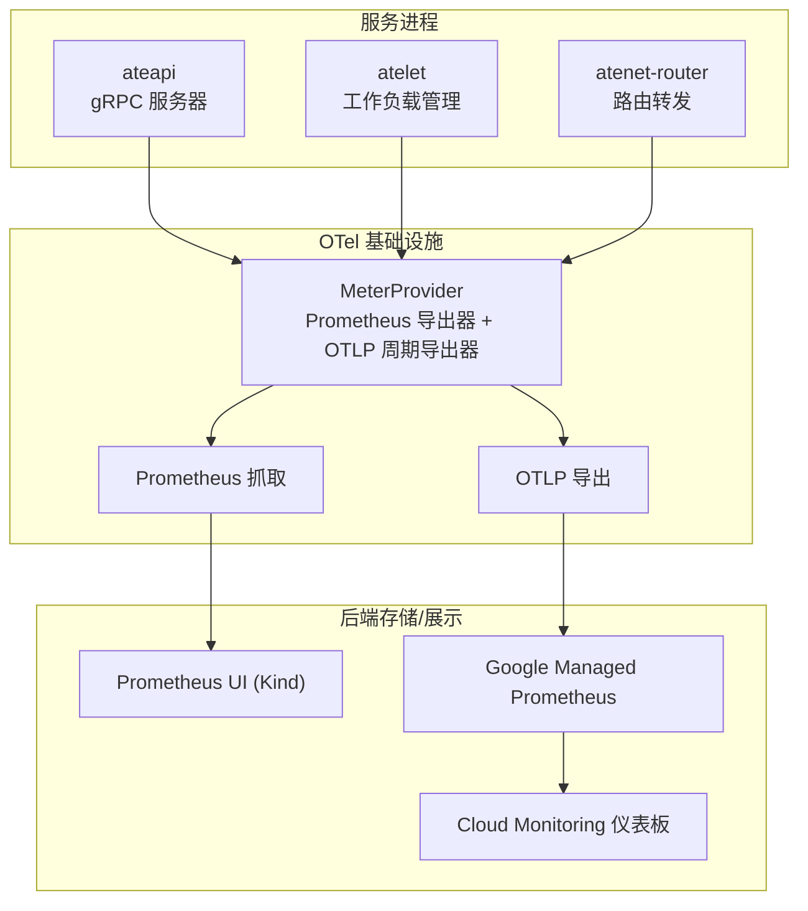
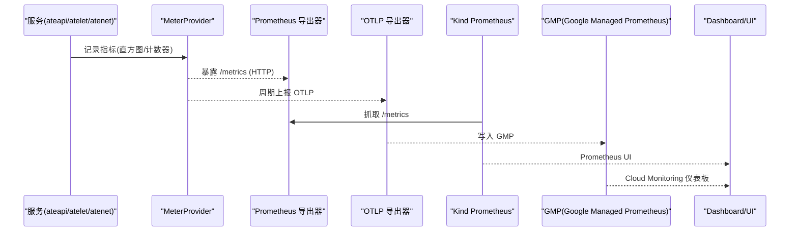
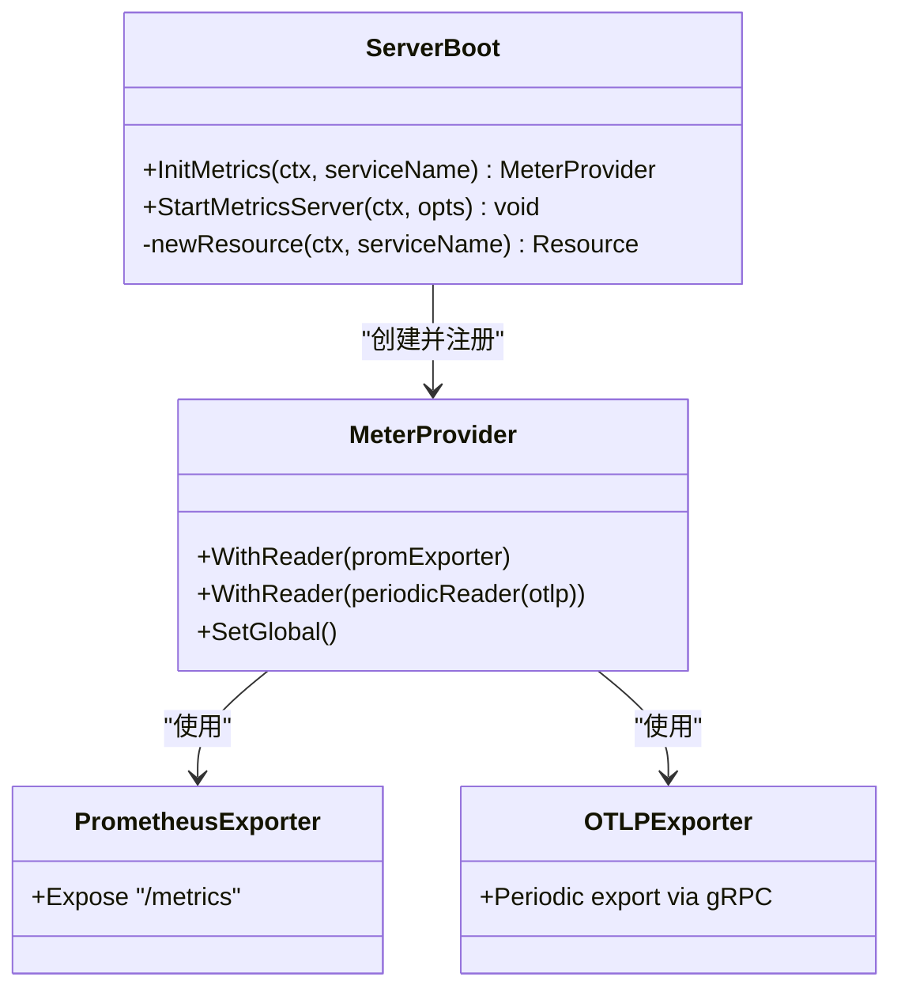
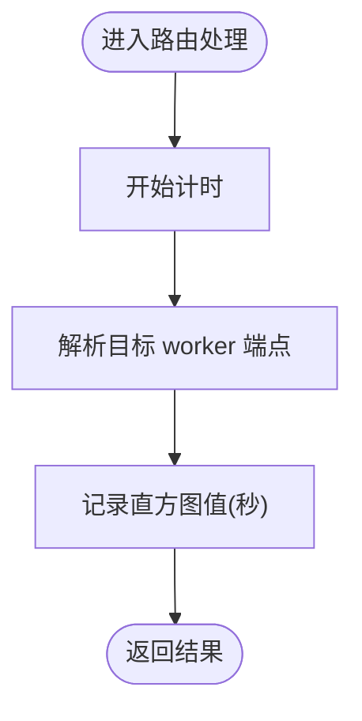
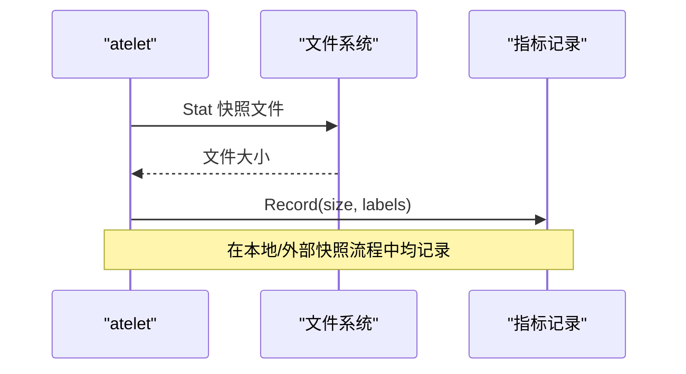
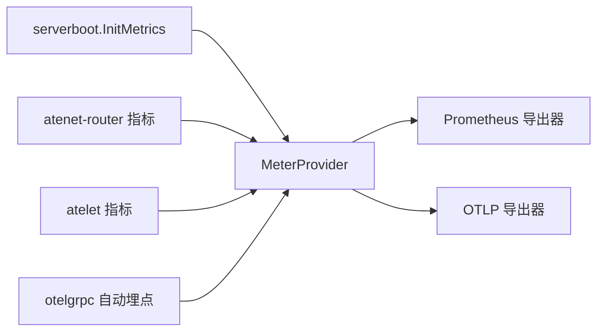

# 指标监控

<cite>
**本文引用的文件**   
- [internal/serverboot/serverboot.go](file://internal/serverboot/serverboot.go)
- [cmd/atenet/internal/router/metrics.go](file://cmd/atenet/internal/router/metrics.go)
- [cmd/atelet/main.go](file://cmd/atelet/main.go)
- [docs/observability.md](file://docs/observability.md)
- [manifests/ate-install/kind/prometheus.yaml](file://manifests/ate-install/kind/prometheus.yaml)
- [manifests/ate-install/atenet-router-monitoring.yaml](file://manifests/ate-install/atenet-router-monitoring.yaml)
- [tools/setup-gcp/dashboards/ate-grpc-dashboard.json](file://tools/setup-gcp/dashboards/ate-grpc-dashboard.json)
- [tools/setup-gcp/dashboards/ate-e2e-latency-dashboard.json](file://tools/setup-gcp/dashboards/ate-e2e-latency-dashboard.json)
- [tools/setup-gcp/dashboards/ate-snapshot-dashboard.json](file://tools/setup-gcp/dashboards/ate-snapshot-dashboard.json)
</cite>

## 目录
1. [简介](#简介)
2. [项目结构](#项目结构)
3. [核心组件](#核心组件)
4. [架构总览](#架构总览)
5. [详细组件分析](#详细组件分析)
6. [依赖关系分析](#依赖关系分析)
7. [性能考量](#性能考量)
8. [故障排查指南](#故障排查指南)
9. [结论](#结论)
10. [附录](#附录)

## 简介
本文件面向 Agent Substrate 的指标监控，系统性说明 OpenTelemetry 指标收集机制与关键指标定义、标签与用法；并给出在 Kind 集群中通过 Prometheus 进行自动发现、端口转发与查询的方法，以及在 GKE 环境下集成 Google Managed Prometheus（GMP）的配置要点。同时提供告警规则建议、容量规划与性能调优最佳实践，帮助运维与研发人员高效观测系统健康与业务表现。

## 项目结构
Agent Substrate 的指标体系由“服务内埋点 + OTel SDK + 双出口（Prometheus 本地 / OTLP 远端）”构成：
- 服务启动时初始化 MeterProvider，注册 Prometheus 导出器与 OTLP 周期性导出器
- 各服务按职责暴露系统级、业务级与性能类指标
- Kind 环境内置 Prometheus 对 Pod 进行自动发现抓取；GKE 环境通过 GMP 采集 OTLP 指标

图表来源
- [internal/serverboot/serverboot.go:121-147](file://internal/serverboot/serverboot.go#L121-L147)
- [manifests/ate-install/kind/prometheus.yaml:64-110](file://manifests/ate-install/kind/prometheus.yaml#L64-L110)
- [docs/observability.md:170-182](file://docs/observability.md#L170-L182)

章节来源
- [internal/serverboot/serverboot.go:121-147](file://internal/serverboot/serverboot.go#L121-L147)
- [manifests/ate-install/kind/prometheus.yaml:64-110](file://manifests/ate-install/kind/prometheus.yaml#L64-L110)
- [docs/observability.md:170-182](file://docs/observability.md#L170-L182)

## 核心组件
- 指标提供者与导出器
  - 统一通过 serverboot 初始化 MeterProvider，同时启用 Prometheus 导出器与 OTLP 周期导出器，实现“本地可查 + 云端可采”的双通道能力
- 关键指标
  - rpc.server.call.duration：gRPC 服务端调用延迟直方图（按方法、状态码维度）
  - atenet.router.route.duration：端到端路由阶段耗时（从接收请求到解析目标 worker）
  - atelet.snapshot.size：快照镜像未压缩大小（按模板命名空间/名称、kind 维度）
- 指标分类
  - 系统级：gRPC 服务端延迟、错误率、QPS
  - 业务级：路由阶段耗时、快照大小分布
  - 性能级：P50/P95/P99 分位、热图分布等

章节来源
- [internal/serverboot/serverboot.go:121-147](file://internal/serverboot/serverboot.go#L121-L147)
- [docs/observability.md:108-113](file://docs/observability.md#L108-L113)
- [cmd/atenet/internal/router/metrics.go:24-51](file://cmd/atenet/internal/router/metrics.go#L24-L51)
- [cmd/atelet/main.go:273-307](file://cmd/atelet/main.go#L273-L307)

## 架构总览
下图展示了指标从服务侧埋点到不同后端的完整链路，以及 Kind 与 GKE 的差异。

图表来源
- [internal/serverboot/serverboot.go:121-147](file://internal/serverboot/serverboot.go#L121-L147)
- [manifests/ate-install/kind/prometheus.yaml:64-110](file://manifests/ate-install/kind/prometheus.yaml#L64-L110)
- [docs/observability.md:170-182](file://docs/observability.md#L170-L182)

## 详细组件分析

### 组件A：OpenTelemetry 指标提供者与导出器
- 功能要点
  - 初始化资源（ServiceName、ServiceInstanceID），设置全局 MeterProvider
  - 注册 Prometheus 导出器（用于本地 /metrics 抓取）
  - 注册 OTLP 周期导出器（用于 GMP 或 Collector）
- 复杂度与影响
  - 双导出器并行运行，避免单点瓶颈；Prometheus 导出器仅暴露 HTTP，OTLP 为 gRPC 长连接
- 错误处理
  - 创建导出器失败将导致启动失败（fail-fast）

图表来源
- [internal/serverboot/serverboot.go:121-147](file://internal/serverboot/serverboot.go#L121-L147)
- [internal/serverboot/serverboot.go:176-192](file://internal/serverboot/serverboot.go#L176-L192)

章节来源
- [internal/serverboot/serverboot.go:121-147](file://internal/serverboot/serverboot.go#L121-L147)
- [internal/serverboot/serverboot.go:176-192](file://internal/serverboot/serverboot.go#L176-L192)

### 组件B：atenet-router 路由延迟指标
- 指标定义
  - 名称：atenet.router.route.duration
  - 类型：Float64Histogram，单位秒
  - 含义：从 ext_proc 接收请求到解析出目标 worker 的耗时（不含 actor 执行与响应）
  - 桶边界：细粒度毫秒级至数十秒，覆盖短尾与长尾
- 使用方式
  - 通过 otel.Meter("atenet-router") 获取实例并 Record
  - 结合 outcome 等标签区分成功/失败路径

图表来源
- [cmd/atenet/internal/router/metrics.go:24-51](file://cmd/atenet/internal/router/metrics.go#L24-L51)

章节来源
- [cmd/atenet/internal/router/metrics.go:24-51](file://cmd/atenet/internal/router/metrics.go#L24-L51)

### 组件C：atelet 快照大小指标
- 指标定义
  - 名称：atelet.snapshot.size
  - 类型：Int64Histogram，单位字节
  - 含义：每次 checkpoint 写出的 gVisor 快照镜像未压缩大小
  - 标签：kind、actor_template_namespace、actor_template_name
- 触发时机
  - 本地快照移动与外部快照上传前，统计文件大小并记录
- 用途
  - 评估快照体积变化趋势、按模板维度对比、定位异常大快照

图表来源
- [cmd/atelet/main.go:273-307](file://cmd/atelet/main.go#L273-L307)

章节来源
- [cmd/atelet/main.go:273-307](file://cmd/atelet/main.go#L273-L307)

### 组件D：gRPC 服务端指标（rpc.server.call.duration）
- 指标定义
  - 名称：rpc.server.call.duration
  - 类型：直方图（otelgrpc 自动注入）
  - 维度：rpc.method、rpc.response.status_code
  - 用途：控制面与服务端接口延迟、QPS、错误率观测
- 典型查询
  - 按方法聚合 p99 延迟
  - 非 OK 状态码的错误速率

章节来源
- [docs/observability.md:108-113](file://docs/observability.md#L108-L113)
- [tools/setup-gcp/dashboards/ate-grpc-dashboard.json:16-78](file://tools/setup-gcp/dashboards/ate-grpc-dashboard.json#L16-L78)

## 依赖关系分析
- 组件耦合
  - 所有服务共享 serverboot 的指标初始化逻辑，降低重复代码与不一致风险
  - atenet-router 与 atelet 各自定义业务指标，独立于通用 gRPC 指标
- 外部依赖
  - Prometheus 客户端库（/metrics 暴露）
  - OTLP gRPC 导出器（上报至 GMP 或 Collector）
- 潜在循环依赖
  - 无直接循环；指标记录为单向数据流

图表来源
- [internal/serverboot/serverboot.go:121-147](file://internal/serverboot/serverboot.go#L121-L147)
- [cmd/atenet/internal/router/metrics.go:24-51](file://cmd/atenet/internal/router/metrics.go#L24-L51)
- [cmd/atelet/main.go:273-307](file://cmd/atelet/main.go#L273-L307)

章节来源
- [internal/serverboot/serverboot.go:121-147](file://internal/serverboot/serverboot.go#L121-L147)
- [cmd/atenet/internal/router/metrics.go:24-51](file://cmd/atenet/internal/router/metrics.go#L24-L51)
- [cmd/atelet/main.go:273-307](file://cmd/atelet/main.go#L273-L307)

## 性能考量
- 指标采样与桶配置
  - 路由延迟直方图采用多段桶边界，兼顾低延迟与长尾场景
  - 快照大小直方图以字节为单位，覆盖 MB 到 GB 量级
- 导出开销
  - Prometheus 导出器为拉取模型，避免额外网络开销
  - OTLP 周期导出器需关注批量大小与间隔，避免拥塞
- 标签基数
  - 控制高基数标签数量，避免存储与查询压力过大
  - 针对模板维度（namespace/name）合理聚合

[本节为通用指导，不直接分析具体文件]

## 故障排查指南
- 本地 Prometheus 不可用
  - 确认 Service 与 Pod 就绪探针正常
  - 检查抓取目标列表与 relabel 规则是否匹配
- 指标缺失
  - 确认服务已启动 MetricsServer 并暴露 /metrics
  - 确认 OTLP 导出器地址可达（GKE 环境）
- 路由指标未入库（Kind）
  - 注意：在 Kind 中 atenet-router 默认仍指向 GKE 收集端，本地不会采集该指标

章节来源
- [manifests/ate-install/kind/prometheus.yaml:64-110](file://manifests/ate-install/kind/prometheus.yaml#L64-L110)
- [docs/observability.md:170-182](file://docs/observability.md#L170-L182)

## 结论
Agent Substrate 基于 OpenTelemetry 构建了统一的指标采集框架，既支持本地快速验证（Prometheus），也无缝对接生产环境（GMP）。围绕 gRPC 服务端、路由阶段与快照体积的关键指标，配合标准标签与可视化面板，可有效支撑系统健康度与业务性能的持续优化。

[本节为总结性内容，不直接分析具体文件]

## 附录

### 关键指标清单与使用方法
- rpc.server.call.duration
  - 含义：gRPC 服务端调用延迟（按方法与状态码维度）
  - 用途：控制面与服务端接口延迟、QPS、错误率
  - 参考仪表盘：ate-grpc-dashboard
- atenet.router.route.duration
  - 含义：从接收请求到解析目标 worker 的耗时（不含 actor 执行与响应）
  - 用途：端到端路由阶段延迟与成功率
  - 参考仪表盘：ate-e2e-latency-dashboard
- atelet.snapshot.size
  - 含义：快照镜像未压缩大小（按模板与 kind 维度）
  - 用途：快照体积趋势与异常检测
  - 参考仪表盘：ate-snapshot-dashboard

章节来源
- [docs/observability.md:108-113](file://docs/observability.md#L108-L113)
- [tools/setup-gcp/dashboards/ate-grpc-dashboard.json:16-78](file://tools/setup-gcp/dashboards/ate-grpc-dashboard.json#L16-L78)
- [tools/setup-gcp/dashboards/ate-e2e-latency-dashboard.json:16-41](file://tools/setup-gcp/dashboards/ate-e2e-latency-dashboard.json#L16-L41)
- [tools/setup-gcp/dashboards/ate-snapshot-dashboard.json:16-42](file://tools/setup-gcp/dashboards/ate-snapshot-dashboard.json#L16-L42)

### Kind 集群中的 Prometheus 自动配置与查询
- 自动发现
  - 通过 kubernetes_sd_configs 抓取 ate-system 与 otel-system 命名空间下的 Pod
  - 使用注解 prometheus_io_scrape、prometheus_io_path、prometheus_io_port 控制抓取
- 端口转发与访问
  - 使用 kubectl port-forward 暴露 Prometheus Service 的 9090 端口
  - 浏览器访问 http://localhost:9090
- 常用查询
  - up：确认目标抓取状态
  - 探索 rpc_* 系列指标，查看 per-method 延迟与错误
- 注意事项
  - 存储为 emptyDir，重启后数据丢失

章节来源
- [manifests/ate-install/kind/prometheus.yaml:64-110](file://manifests/ate-install/kind/prometheus.yaml#L64-L110)
- [docs/observability.md:119-131](file://docs/observability.md#L119-L131)

### GKE 环境下 Google Managed Prometheus 的配置与集成
- 指标路径
  - 服务 → Google Managed Prometheus（GMP）
- 采集方式
  - 通过 OTLP 周期导出器上报指标
  - Envoy sidecar 通过 PodMonitoring 抓取其 /stats/prometheus 端点，作为 E2E 上下文补充
- 仪表板
  - 使用 tools/setup-gcp 工具创建/更新 Cloud Monitoring 仪表板

章节来源
- [docs/observability.md:170-182](file://docs/observability.md#L170-L182)
- [manifests/ate-install/atenet-router-monitoring.yaml:15-35](file://manifests/ate-install/atenet-router-monitoring.yaml#L15-L35)
- [tools/setup-gcp/dashboards/ate-grpc-dashboard.json:16-78](file://tools/setup-gcp/dashboards/ate-grpc-dashboard.json#L16-L78)
- [tools/setup-gcp/dashboards/ate-e2e-latency-dashboard.json:16-41](file://tools/setup-gcp/dashboards/ate-e2e-latency-dashboard.json#L16-L41)
- [tools/setup-gcp/dashboards/ate-snapshot-dashboard.json:16-42](file://tools/setup-gcp/dashboards/ate-snapshot-dashboard.json#L16-L42)

### 指标告警规则建议
- 可用性
  - 当 up 指标为 0 超过阈值时触发
- 延迟
  - rpc.server.call.duration 的 p99/p95 超过 SLI 阈值
  - atenet.router.route.duration 的 p99 突增
- 错误率
  - rpc.response.status_code 非 OK 的比率上升
- 快照
  - atelet.snapshot.size 的 p99 显著增长，或某模板下出现异常大快照

[本节为通用建议，不直接分析具体文件]

### 容量规划建议
- 存储
  - Prometheus 本地存储为临时存储，生产建议使用持久化或迁移至 GMP
- 抓取频率
  - 根据 QPS 与指标基数调整 scrape_interval
- 标签基数
  - 控制高基数标签数量，必要时聚合或丢弃无关标签

[本节为通用建议，不直接分析具体文件]

### 性能调优最佳实践
- 直方图桶边界
  - 根据业务延迟分布定制桶，减少近似误差
- 导出器参数
  - 调整 OTLP 批量大小与周期，平衡吞吐与延迟
- 查询优化
  - 优先使用 rate/histogram_quantile 等函数，避免全表扫描

[本节为通用建议，不直接分析具体文件]
