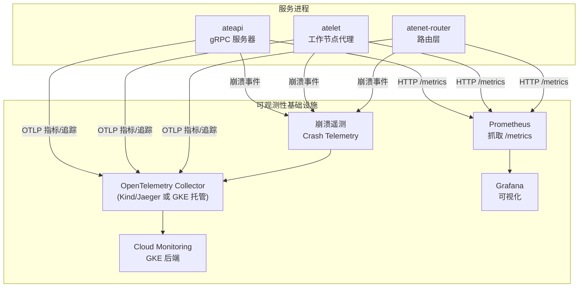
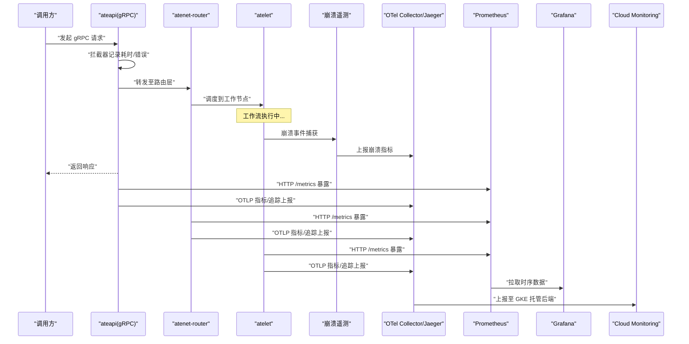
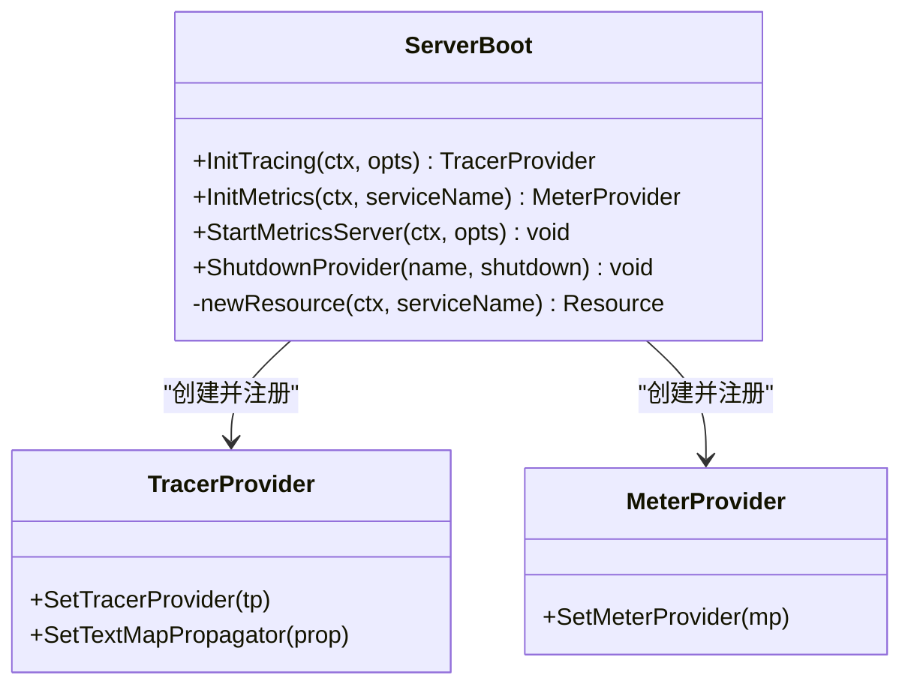
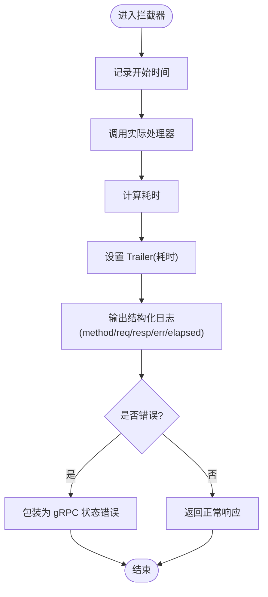
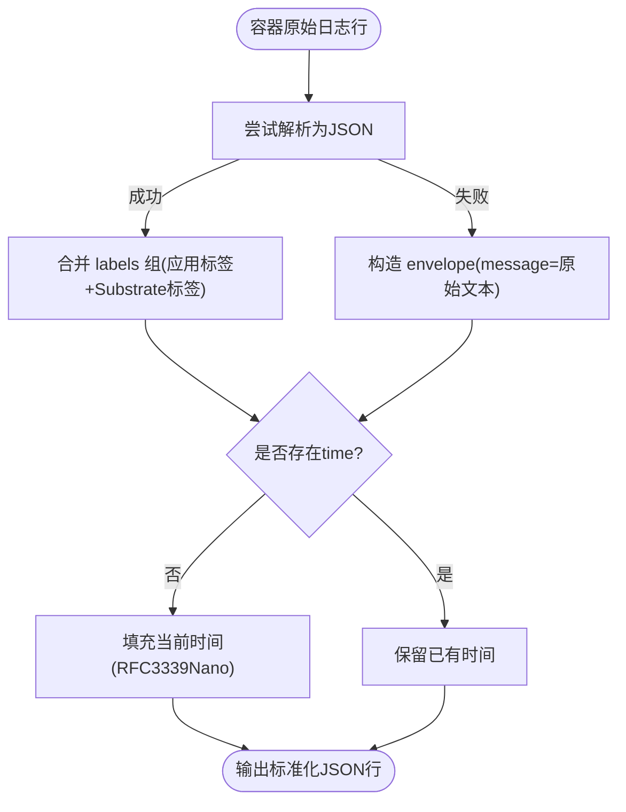
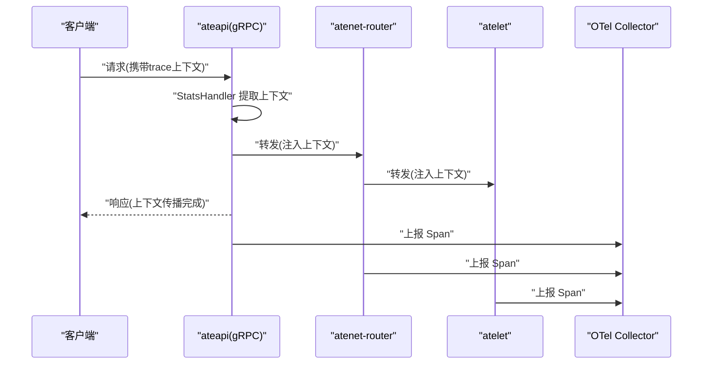
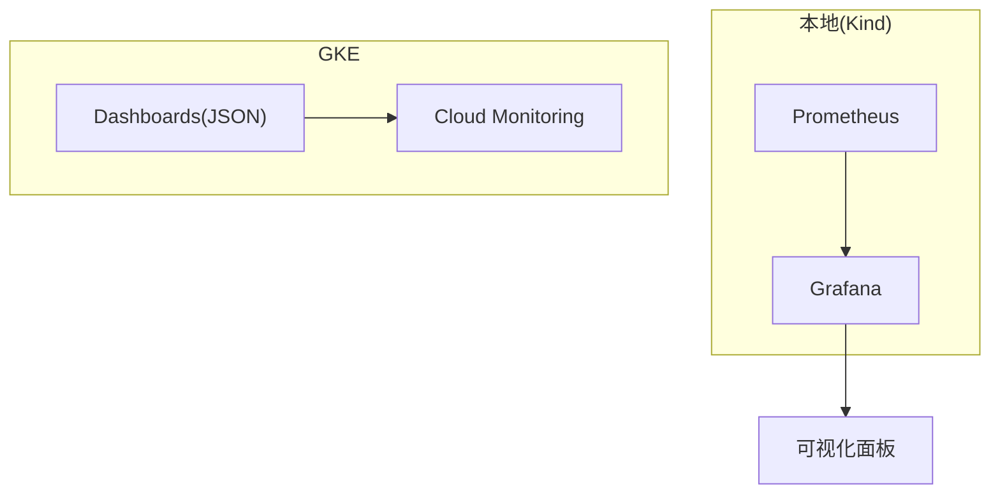
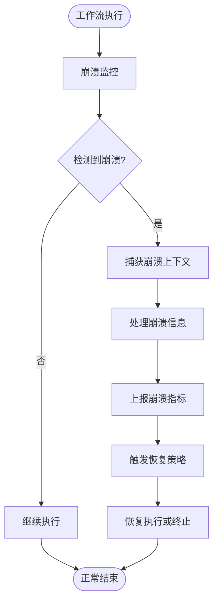
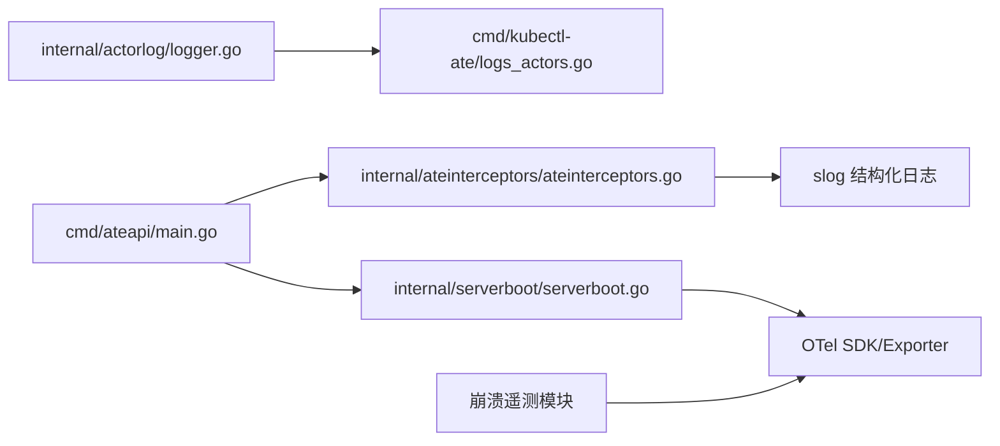

# 监控与可观测性

<cite>
**本文引用的文件**
- [internal/serverboot/serverboot.go](file://internal/serverboot/serverboot.go)
- [cmd/ateapi/main.go](file://cmd/ateapi/main.go)
- [internal/ateinterceptors/ateinterceptors.go](file://internal/ateinterceptors/ateinterceptors.go)
- [docs/observability.md](file://docs/observability.md)
- [docs/dev/best-practices/tracing.md](file://docs/dev/best-practices/tracing.md)
- [internal/actorlog/logger.go](file://internal/actorlog/logger.go)
- [cmd/kubectl-ate/internal/cmd/logs_actors.go](file://cmd/kubectl-ate/internal/cmd/logs_actors.go)
- [benchmarking/monitoring.yaml](file://benchmarking/monitoring.yaml)
- [tools/setup-gcp/dashboards/README.md](file://tools/setup-gcp/dashboards/README.md)
</cite>

## 更新摘要
**变更内容**
- 新增崩溃遥测功能，增强系统稳定性监控能力
- 引入 ate.actor.crashes 指标用于跟踪工作流崩溃事件
- 改进工作流中的崩溃记录机制，提供更详细的故障信息
- 实现 OTLP 端点的集中化配置管理，简化部署配置

## 目录
1. [简介](#简介)
2. [项目结构](#项目结构)
3. [核心组件](#核心组件)
4. [架构总览](#架构总览)
5. [详细组件分析](#详细组件分析)
6. [依赖关系分析](#依赖关系分析)
7. [性能考量](#性能考量)
8. [故障诊断指南](#故障诊断指南)
9. [结论](#结论)
10. [附录](#附录)

## 简介
本指南面向生产与开发环境，系统化阐述 Agent Substrate 的监控与可观测性实践，覆盖以下方面：
- Prometheus 指标的采集与导出机制（系统级、业务级、性能指标）
- OpenTelemetry 分布式追踪的配置与使用（Span 创建、上下文传播、采样策略）
- 结构化日志的收集与分析方法（日志级别、格式规范、聚合工具）
- Grafana 仪表板配置与自定义（关键面板、告警规则、性能基准）
- 分布式调试工具与方法（日志关联、追踪分析、性能剖析）
- 生产环境最佳实践（指标保留策略、告警阈值、容量规划）
- 故障诊断与性能调优指导
- **新增** 崩溃遥测与故障恢复监控

## 项目结构
本项目在多个服务中统一实现了可观测性基础设施，并通过文档与示例提供端到端指引。关键位置包括：
- 启动与可观测性初始化：serverboot 包提供 TracerProvider、MeterProvider、Prometheus HTTP 暴露与 /readyz 能力
- gRPC 服务端拦截器：记录请求耗时、错误码并输出结构化日志
- 文档与最佳实践：observability.md 与 tracing.md 提供指标、追踪、日志与后端路径说明
- 运行时日志包装：actorlog 将容器 stdout/stderr 转换为结构化 JSON，注入 ate.dev/* 标签
- CLI 日志过滤：kubectl-ate logs actors 支持按 atespace/actor 过滤并清理内部标签
- 本地与基准监控：benchmarking/monitoring.yaml 包含 Prometheus/Grafana 部署清单
- GCP 仪表板：tools/setup-gcp/dashboards 提供 Cloud Monitoring 仪表板定义与说明
- **新增** 崩溃遥测集成：统一的崩溃事件捕获与上报机制

**图表来源**
- [internal/serverboot/serverboot.go:121-147](file://internal/serverboot/serverboot.go#L121-L147)
- [cmd/ateapi/main.go:182-206](file://cmd/ateapi/main.go#L182-206)
- [docs/observability.md:170-182](file://docs/observability.md#L170-L182)

章节来源
- [internal/serverboot/serverboot.go:1-193](file://internal/serverboot/serverboot.go#L1-193)
- [cmd/ateapi/main.go:1-476](file://cmd/ateapi/main.go#L1-476)
- [docs/observability.md:1-194](file://docs/observability.md#L1-L194)

## 核心组件
- 可观测性初始化（Tracing/Metrics/Logger）
  - 通过 serverboot 统一初始化全局 TracerProvider、MeterProvider，并暴露 Prometheus /metrics 与可选 /readyz
  - 资源属性包含 ServiceName、ServiceInstanceID，支持 OTEL_* 环境变量覆盖
- gRPC 拦截器
  - 记录方法名、请求/响应摘要、错误、耗时；失败不影响 RPC 结果
- 结构化日志包装
  - actorlog 将容器原始日志转换为 JSON，注入 ate.dev/* 标签，兼容 GCE 标签键
- CLI 日志过滤
  - kubectl-ate logs actors 支持按 atespace/actor 过滤，并移除内部标签，保持标准 kubectl logs 风格输出
- 文档与最佳实践
  - observability.md 汇总指标、追踪、日志与后端差异
  - tracing.md 给出 gRPC/HTTP 客户端与服务端集成、采样策略与环境变量配置建议
- **新增** 崩溃遥测集成
  - 统一的崩溃事件捕获机制，自动记录工作流崩溃详情
  - 集成 ate.actor.crashes 指标，支持崩溃频率统计与趋势分析
  - 增强的崩溃上下文信息，包含堆栈跟踪与内存状态

章节来源
- [internal/serverboot/serverboot.go:57-119](file://internal/serverboot/serverboot.go#L57-L119)
- [internal/serverboot/serverboot.go:121-192](file://internal/serverboot/serverboot.go#L121-L192)
- [internal/ateinterceptors/ateinterceptors.go:39-86](file://internal/ateinterceptors/ateinterceptors.go#L39-L86)
- [internal/actorlog/logger.go:50-173](file://internal/actorlog/logger.go#L50-L173)
- [cmd/kubectl-ate/internal/cmd/logs_actors.go:339-391](file://cmd/kubectl-ate/internal/cmd/logs_actors.go#L339-L391)
- [docs/observability.md:103-182](file://docs/observability.md#L103-L182)
- [docs/dev/best-practices/tracing.md:1-266](file://docs/dev/best-practices/tracing.md#L1-L266)

## 架构总览
下图展示从服务到后端的全链路可观测性数据流：服务进程通过 OTel SDK 生成指标与追踪，Prometheus 抓取 /metrics，Jaeger/Collector 汇聚追踪，Grafana/Cloud Monitoring 进行可视化。**新增崩溃遥测通道**，专门处理工作流崩溃事件的捕获与上报。

**图表来源**
- [cmd/ateapi/main.go:182-206](file://cmd/ateapi/main.go#L182-206)
- [internal/serverboot/serverboot.go:121-192](file://internal/serverboot/serverboot.go#L121-L192)
- [docs/observability.md:170-182](file://docs/observability.md#L170-L182)

## 详细组件分析

### 组件A：可观测性初始化（Tracing/Metrics/Logger）
- 功能要点
  - InitTracing：创建 TracerProvider，设置 Sampler、Resource、OTLP 导出器，注册 TraceContext 传播器
  - InitMetrics：创建 MeterProvider，同时注册 Prometheus Reader 与 OTLP PeriodicReader，设置 Resource
  - StartMetricsServer：启动 HTTP 服务，暴露 /metrics 与可选 /readyz
  - ShutdownProvider：优雅关闭 Provider
- 设计模式
  - 工厂化初始化 + 全局注册（otel.SetTracerProvider/SetMeterProvider）
  - 资源合并与覆盖（WithFromEnv），容错处理（ErrPartialResource/ErrSchemaURLConflict）
- 复杂度与性能
  - 指标导出为周期性批量上报，避免高频 I/O
  - 追踪采用批处理器，降低网络开销
- 错误处理
  - 初始化失败直接 Fatal，确保启动时快速失败
  - Shutdown 错误仅记录日志，不阻塞退出

**图表来源**
- [internal/serverboot/serverboot.go:57-119](file://internal/serverboot/serverboot.go#L57-L119)
- [internal/serverboot/serverboot.go:121-192](file://internal/serverboot/serverboot.go#L121-L192)

章节来源
- [internal/serverboot/serverboot.go:57-119](file://internal/serverboot/serverboot.go#L57-L119)
- [internal/serverboot/serverboot.go:121-192](file://internal/serverboot/serverboot.go#L121-L192)

### 组件B：gRPC 拦截器与结构化日志
- 功能要点
  - 记录 method、req/resp 摘要、错误、elapsed-time
  - 设置 Trailer 携带耗时，不影响 RPC 结果
  - 对非 status 错误包装为 Internal
- 适用场景
  - 对外 API 与内部服务均可用，便于定位慢请求与异常路径

**图表来源**
- [internal/ateinterceptors/ateinterceptors.go:39-86](file://internal/ateinterceptors/ateinterceptors.go#L39-L86)

章节来源
- [internal/ateinterceptors/ateinterceptors.go:39-86](file://internal/ateinterceptors/ateinterceptors.go#L39-L86)

### 组件C：结构化日志包装与过滤
- 功能要点
  - actorlog.WrapContainerLogs：读取容器 stdout/stderr，解析 JSON，注入 ate.dev/* 标签，兼容 GCE 标签键
  - EmitLifecycleLog：合成生命周期事件，带时间与标签
  - kubectl-ate logs actors：按 atespace/actor 过滤，移除内部标签，保持标准输出
- 格式规范
  - 统一 JSON Lines；缺失 time 字段时自动补充；labels 组支持合并与冲突覆盖（Substrate 元数据优先）
- 聚合工具
  - 结合集中式日志后端（如 Google Cloud Logging、Grafana Loki）进行多维查询（按 actor、atespace、template、pod）

**图表来源**
- [internal/actorlog/logger.go:103-173](file://internal/actorlog/logger.go#L103-L173)
- [cmd/kubectl-ate/internal/cmd/logs_actors.go:339-391](file://cmd/kubectl-ate/internal/cmd/logs_actors.go#L339-L391)

章节来源
- [internal/actorlog/logger.go:50-173](file://internal/actorlog/logger.go#L50-L173)
- [cmd/kubectl-ate/internal/cmd/logs_actors.go:339-391](file://cmd/kubectl-ate/internal/cmd/logs_actors.go#L339-L391)

### 组件D：指标分类与定义
- 系统级指标
  - gRPC 服务端延迟直方图（rpc.server.call.duration）：按方法、状态码维度
  - 路由层延迟（atenet.router.route.duration）：端到端路由阶段延迟
  - 快照大小（atelet.snapshot.size）：checkpoint 写入的未压缩镜像大小
- 业务级指标
  - 基于 OTel 的通用计数器/直方图，可按业务语义扩展（例如按模板、租户维度）
- 性能指标
  - 延迟分位（P50/P95/P99）、QPS、错误率、资源占用（由后端与采集器决定）
- **新增** 崩溃遥测指标
  - ate.actor.crashes：工作流崩溃计数，按 actor ID、atespace、崩溃类型维度
  - 崩溃频率统计：支持时间窗口内的崩溃率计算
  - 崩溃根因分析：包含错误类型、堆栈信息、内存状态等上下文

章节来源
- [docs/observability.md:103-134](file://docs/observability.md#L103-L134)

### 组件E：分布式追踪配置与使用
- 服务端
  - 使用 otelgrpc.NewServerHandler 作为 StatsHandler，自动捕获 gRPC 调用链
  - 使用 otelhttp.NewHandler 包裹 HTTP 根 mux，自动注入/提取上下文
- 客户端
  - gRPC：grpc.WithStatsHandler(otelgrpc.NewClientHandler())
  - HTTP：Transport 使用 otelhttp.NewTransport
- 采样策略
  - 按需采样：ParentBased(NeverSample) + 客户端触发（含 trace 头）
  - 全量采样：ParentBased(AlwaysSample)（适合开发/测试）
- 环境变量
  - OTEL_EXPORTER_OTLP_ENDPOINT 指向 Collector 地址
- **新增** OTLP 端点集中化管理
  - 统一的 OTLP 端点配置，支持多环境切换
  - 环境变量优先级管理，支持配置覆盖与默认值

**图表来源**
- [docs/dev/best-practices/tracing.md:97-138](file://docs/dev/best-practices/tracing.md#L97-L138)
- [docs/dev/best-practices/tracing.md:140-200](file://docs/dev/best-practices/tracing.md#L140-L200)
- [docs/dev/best-practices/tracing.md:83-95](file://docs/dev/best-practices/tracing.md#L83-L95)

章节来源
- [docs/dev/best-practices/tracing.md:1-266](file://docs/dev/best-practices/tracing.md#L1-L266)

### 组件F：Grafana 仪表板与告警
- 本地环境
  - benchmarking/monitoring.yaml 提供 Prometheus 与 Grafana 的 Deployment/Service 配置
  - Grafana 挂载 ConfigMap 以提供数据源与仪表板
- GCP 环境
  - tools/setup-gcp/dashboards 提供 Cloud Monitoring 仪表板定义（按方法/阶段的延迟、吞吐、错误率等视图）
  - 通过 setup 命令创建/更新仪表板（幂等）
- **新增** 崩溃监控仪表板
  - 崩溃趋势分析：按时间序列展示崩溃频率变化
  - 崩溃根因分布：按错误类型统计崩溃原因
  - 受影响工作流排名：按崩溃次数排序的工作流列表

**图表来源**
- [benchmarking/monitoring.yaml:539-573](file://benchmarking/monitoring.yaml#L539-L573)
- [tools/setup-gcp/dashboards/README.md:1-26](file://tools/setup-gcp/dashboards/README.md#L1-L26)

章节来源
- [benchmarking/monitoring.yaml:539-573](file://benchmarking/monitoring.yaml#L539-L573)
- [tools/setup-gcp/dashboards/README.md:1-26](file://tools/setup-gcp/dashboards/README.md#L1-L26)

### 组件G：崩溃遥测与故障恢复（新增）
- 功能特性
  - 自动崩溃检测：在工作流执行过程中实时监控异常状态
  - 上下文捕获：记录崩溃时的完整上下文信息，包括变量状态、调用栈、资源使用情况
  - 智能上报：将崩溃事件通过 OTLP 协议上报至监控系统
  - 恢复策略：支持自动重试与降级处理
- 指标定义
  - ate.actor.crashes：主崩溃计数指标，支持多维度标签
  - 崩溃恢复时间：从崩溃到恢复的持续时间
  - 崩溃影响范围：受影响的 actor 数量与工作流实例
- 配置管理
  - 集中化的 OTLP 端点配置，支持动态更新
  - 崩溃上报阈值配置，避免频繁上报造成压力
  - 敏感信息脱敏，确保崩溃日志不包含机密数据

**图表来源**
- [internal/serverboot/serverboot.go:121-192](file://internal/serverboot/serverboot.go#L121-L192)
- [docs/observability.md:103-134](file://docs/observability.md#L103-L134)

章节来源
- [internal/serverboot/serverboot.go:121-192](file://internal/serverboot/serverboot.go#L121-L192)
- [docs/observability.md:103-134](file://docs/observability.md#L103-L134)

## 依赖关系分析
- 服务进程依赖 serverboot 提供的可观测性初始化与 HTTP 暴露
- gRPC 服务依赖 otelgrpc 中间件实现自动追踪
- 日志子系统依赖 actorlog 进行标准化与标签注入
- 文档与脚本提供环境与后端差异说明及仪表板管理
- **新增** 崩溃遥测依赖 OTLP 导出器进行崩溃事件上报

**图表来源**
- [cmd/ateapi/main.go:182-206](file://cmd/ateapi/main.go#L182-206)
- [internal/serverboot/serverboot.go:121-192](file://internal/serverboot/serverboot.go#L121-L192)
- [internal/ateinterceptors/ateinterceptors.go:39-86](file://internal/ateinterceptors/ateinterceptors.go#L39-L86)
- [internal/actorlog/logger.go:103-173](file://internal/actorlog/logger.go#L103-L173)
- [cmd/kubectl-ate/internal/cmd/logs_actors.go:339-391](file://cmd/kubectl-ate/internal/cmd/logs_actors.go#L339-L391)

章节来源
- [cmd/ateapi/main.go:182-206](file://cmd/ateapi/main.go#L182-206)
- [internal/serverboot/serverboot.go:121-192](file://internal/serverboot/serverboot.go#L121-L192)
- [internal/ateinterceptors/ateinterceptors.go:39-86](file://internal/ateinterceptors/ateinterceptors.go#L39-L86)
- [internal/actorlog/logger.go:103-173](file://internal/actorlog/logger.go#L103-L173)
- [cmd/kubectl-ate/internal/cmd/logs_actors.go:339-391](file://cmd/kubectl-ate/internal/cmd/logs_actors.go#L339-L391)

## 性能考量
- 指标导出
  - 使用 OTLP PeriodicReader 与 Prometheus Reader 双通道，兼顾本地抓取与云端上报
  - 合理设置采样率，避免高基数标签导致存储压力
- 追踪开销
  - 默认按需采样，生产环境建议限制范围与粒度，减少 Span 数量
- 日志吞吐
  - 结构化 JSON 输出利于索引，但需控制字段基数与体积；必要时在采集侧做裁剪
- 资源隔离
  - 将 /metrics 端口与业务端口分离，避免竞争；/readyz 用于就绪探针，不应成为瓶颈
- **新增** 崩溃遥测性能优化
  - 异步上报机制，避免阻塞主业务流程
  - 崩溃上下文采样，只保留关键信息减少传输开销
  - 批量上报策略，合并多个崩溃事件提高传输效率

[本节为通用指导，无需具体文件引用]

## 故障诊断指南
- 指标不可见
  - 检查 /metrics 是否暴露且被 Prometheus 抓取；确认端口与目标发现
  - 验证 OTLP 导出器连接与 Collector 可达性
- 追踪不完整
  - 确认客户端与服务端均启用 StatsHandler/Transport 包装
  - 检查采样策略与 trace 头传播
- 日志缺失或混乱
  - 确认 actorlog 已正确注入 ate.dev/* 标签；CLI 过滤逻辑是否正确匹配 atespace/actor
  - 对于多容器场景，确保每个容器有独立管道与 container_name 标签
- 启动失败
  - serverboot.Fatal 会在初始化失败时快速退出，查看日志中的错误信息定位问题
- **新增** 崩溃相关故障诊断
  - 检查 ate.actor.crashes 指标是否正常上报
  - 查看崩溃上下文信息，分析崩溃根因
  - 验证崩溃恢复策略是否按预期工作
  - 检查 OTLP 端点配置是否正确，确保崩溃事件能够成功上报

章节来源
- [internal/serverboot/serverboot.go:149-164](file://internal/serverboot/serverboot.go#L149-L164)
- [internal/actorlog/logger.go:103-173](file://internal/actorlog/logger.go#L103-L173)
- [cmd/kubectl-ate/internal/cmd/logs_actors.go:339-391](file://cmd/kubectl-ate/internal/cmd/logs_actors.go#L339-L391)

## 结论
通过统一的 serverboot 初始化、标准化的 gRPC 拦截器、结构化的 actor 日志包装以及完善的文档与脚本，Agent Substrate 提供了跨 Kind 与 GKE 的可观测性基线。**新增的崩溃遥测功能**进一步增强了系统的稳定性监控能力，使运维团队能够更好地识别和解决工作流崩溃问题。建议在生产环境中：
- 明确指标保留策略与告警阈值
- 按需开启追踪并限制采样比例
- 使用集中式日志后端进行多维聚合与检索
- 定期评估容量与性能基线，持续优化
- **新增** 建立崩溃监控告警机制，及时发现和处理工作流异常
- **新增** 利用崩溃遥测数据进行根因分析和预防性维护

[本节为总结性内容，无需具体文件引用]

## 附录
- 指标与后端映射
  - Kind：Prometheus + Jaeger（本地）
  - GKE：Google Managed Prometheus + Cloud Monitoring/Trace
- 仪表板创建
  - 使用 tools/setup-gcp 命令创建/更新 Cloud Monitoring 仪表板（幂等）
- **新增** 崩溃遥测配置
  - OTLP 端点集中化管理，支持多环境配置
  - 崩溃上报阈值与采样策略配置
  - 敏感信息脱敏规则配置

章节来源
- [docs/observability.md:170-194](file://docs/observability.md#L170-L194)
- [tools/setup-gcp/dashboards/README.md:13-26](file://tools/setup-gcp/dashboards/README.md#L13-L26)
