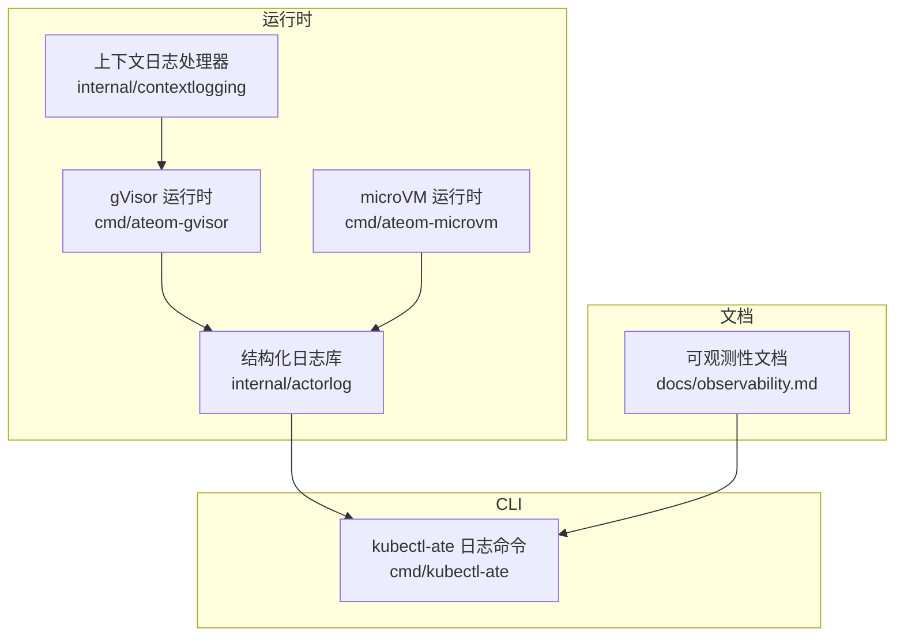
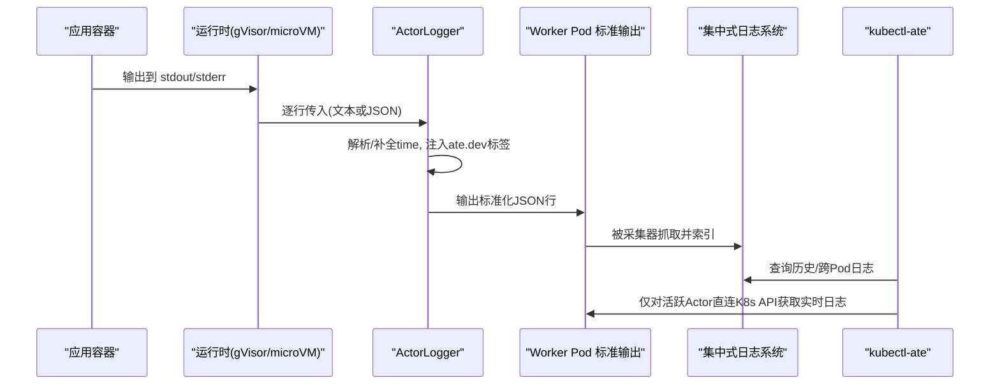
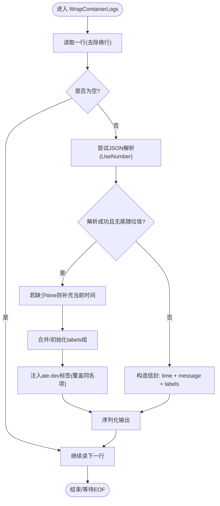
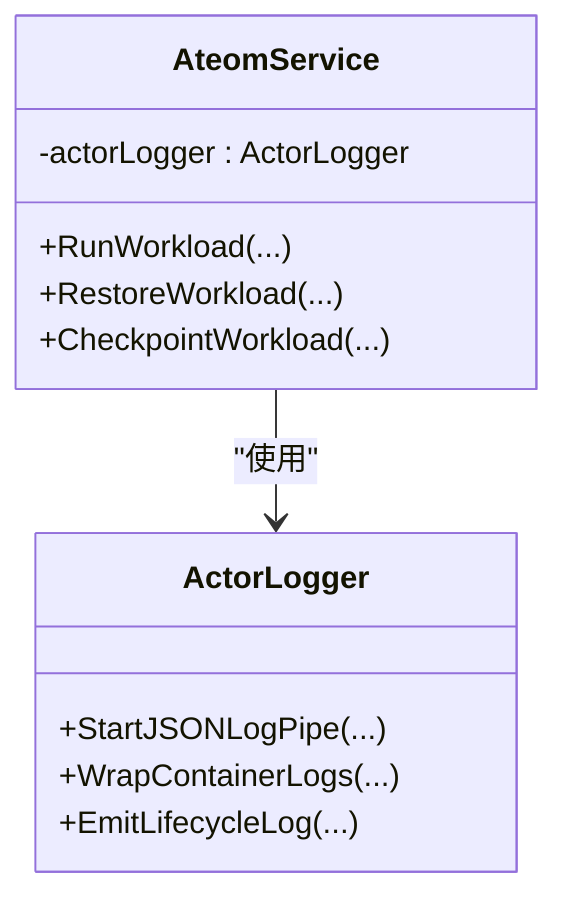
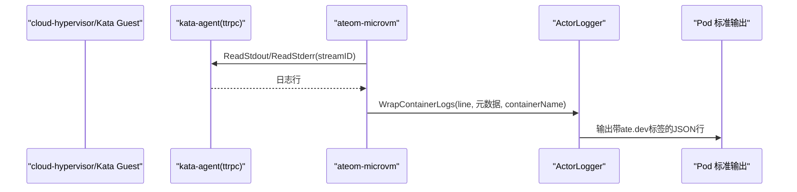
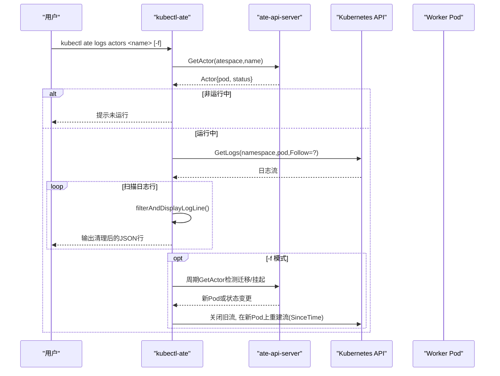
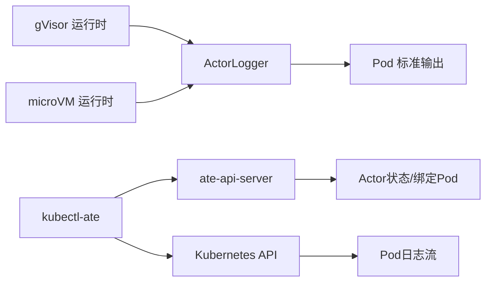

# 结构化日志

<cite>
**本文引用的文件**   
- [internal/actorlog/logger.go](file://internal/actorlog/logger.go)
- [internal/actorlog/logger_test.go](file://internal/actorlog/logger_test.go)
- [cmd/ateom-gvisor/main.go](file://cmd/ateom-gvisor/main.go)
- [cmd/ateom-microvm/run.go](file://cmd/ateom-microvm/run.go)
- [cmd/kubectl-ate/internal/cmd/logs_actors.go](file://cmd/kubectl-ate/internal/cmd/logs_actors.go)
- [cmd/kubectl-ate/README.md](file://cmd/kubectl-ate/README.md)
- [docs/observability.md](file://docs/observability.md)
- [internal/contextlogging/contextlogging.go](file://internal/contextlogging/contextlogging.go)
</cite>

## 目录
1. [简介](#简介)
2. [项目结构](#项目结构)
3. [核心组件](#核心组件)
4. [架构总览](#架构总览)
5. [详细组件分析](#详细组件分析)
6. [依赖关系分析](#依赖关系分析)
7. [性能与容量规划](#性能与容量规划)
8. [故障排查指南](#故障排查指南)
9. [结论](#结论)
10. [附录](#附录)

## 简介
本文件面向 Agent Substrate 的结构化日志体系，系统性说明：
- 容器标准输出捕获、JSON 包装与元数据注入机制
- ate.dev 标签体系（actor_name、actor_atespace、actor_uid 等）的含义与用途
- kubectl ate logs 命令的用法：实时查看、流式跟踪与跨 Pod 迁移处理
- 集中式日志后端集成最佳实践（Grafana Loki、Google Cloud Logging 等）
- 多租户隔离、日志轮转策略与存储优化建议

## 项目结构
围绕日志的关键代码分布在以下位置：
- 运行时日志封装与标注：internal/actorlog
- gVisor 运行时入口与管道接入：cmd/ateom-gvisor
- microVM 运行时日志转发：cmd/ateom-microvm
- CLI 日志聚合与过滤：cmd/kubectl-ate
- 可观测性文档与查询示例：docs/observability.md
- 上下文追踪 ID 注入：internal/contextlogging

图表来源
- [cmd/ateom-gvisor/main.go:139-146](file://cmd/ateom-gvisor/main.go#L139-L146)
- [cmd/ateom-microvm/run.go:554-557](file://cmd/ateom-microvm/run.go#L554-L557)
- [internal/actorlog/logger.go:50-66](file://internal/actorlog/logger.go#L50-L66)
- [internal/contextlogging/contextlogging.go:24-46](file://internal/contextlogging/contextlogging.go#L24-L46)
- [cmd/kubectl-ate/internal/cmd/logs_actors.go:44-57](file://cmd/kubectl-ate/internal/cmd/logs_actors.go#L44-L57)
- [docs/observability.md:1-18](file://docs/observability.md#L1-L18)

章节来源
- [cmd/ateom-gvisor/main.go:139-146](file://cmd/ateom-gvisor/main.go#L139-L146)
- [cmd/ateom-microvm/run.go:554-557](file://cmd/ateom-microvm/run.go#L554-L557)
- [internal/actorlog/logger.go:50-66](file://internal/actorlog/logger.go#L50-L66)
- [internal/contextlogging/contextlogging.go:24-46](file://internal/contextlogging/contextlogging.go#L24-L46)
- [cmd/kubectl-ate/internal/cmd/logs_actors.go:44-57](file://cmd/kubectl-ate/internal/cmd/logs_actors.go#L44-L57)
- [docs/observability.md:1-18](file://docs/observability.md#L1-L18)

## 核心组件
- ActorLogger：负责将容器 stdout/stderr 行解析为统一 JSON 信封，并注入 ate.dev/* 标签；支持在 GCE 环境下使用 logging.googleapis.com/labels 键名。
- StartJSONLogPipe/WrapContainerLogs：创建管道并将每行日志标准化输出，兼容纯文本与 JSON 输入，保留已有 time 字段，缺失则补充当前时间。
- 上下文日志处理器：从 OpenTelemetry SpanContext 提取 trace-id，写入 ate.dev/trace-id 字段，便于关联请求链路。
- kubectl-ate logs actors：按 atespace+actor_name 过滤、去重 ate.dev 标签、保持时间戳，并在 follow 模式下自动重连与跨 Pod 迁移感知。

章节来源
- [internal/actorlog/logger.go:50-173](file://internal/actorlog/logger.go#L50-L173)
- [internal/contextlogging/contextlogging.go:24-46](file://internal/contextlogging/contextlogging.go#L24-L46)
- [cmd/kubectl-ate/internal/cmd/logs_actors.go:309-391](file://cmd/kubectl-ate/internal/cmd/logs_actors.go#L309-L391)

## 架构总览
Agent Substrate 通过运行时将容器标准输出经 actorlog 包装后写入 worker Pod 的标准输出，再由集中式日志采集器抓取。CLI 提供对活跃 Actor 的即时查看能力，而历史与跨迁移视图需依赖集中式后端。

图表来源
- [cmd/ateom-gvisor/main.go:214-227](file://cmd/ateom-gvisor/main.go#L214-L227)
- [cmd/ateom-microvm/run.go:554-557](file://cmd/ateom-microvm/run.go#L554-L557)
- [internal/actorlog/logger.go:103-173](file://internal/actorlog/logger.go#L103-L173)
- [cmd/kubectl-ate/internal/cmd/logs_actors.go:111-145](file://cmd/kubectl-ate/internal/cmd/logs_actors.go#L111-L145)

## 详细组件分析

### 组件A：ActorLogger 与日志包装流程
- 功能要点
  - 检测运行环境是否为 GCE，动态选择 labels 键名（labels 或 logging.googleapis.com/labels）。
  - 对每行日志进行 JSON 解码；若失败则作为纯文本包裹进 message 字段，并生成 RFC3339Nano 时间戳。
  - 若输入已是 JSON，则保留原有字段（如 level、msg、自定义属性），确保 time 存在；否则补充 time。
  - 注入 ate.dev/actor_name、ate.dev/actor_atespace、ate.dev/actor_uid、ate.dev/actor_template_namespace、ate.dev/actor_template_name、ate.dev/container_name 等标签。
  - 并发安全：对外提供 SyncedWriter 保证多 goroutine 写 pod 标准输出不交错。

图表来源
- [internal/actorlog/logger.go:103-173](file://internal/actorlog/logger.go#L103-L173)

章节来源
- [internal/actorlog/logger.go:32-85](file://internal/actorlog/logger.go#L32-85)
- [internal/actorlog/logger.go:87-101](file://internal/actorlog/logger.go#L87-L101)
- [internal/actorlog/logger.go:103-173](file://internal/actorlog/logger.go#L103-L173)
- [internal/actorlog/logger_test.go:25-75](file://internal/actorlog/logger_test.go#L25-L75)
- [internal/actorlog/logger_test.go:77-110](file://internal/actorlog/logger_test.go#L77-L110)
- [internal/actorlog/logger_test.go:239-268](file://internal/actorlog/logger_test.go#L239-L268)

### 组件B：gVisor 运行时接入点
- 启动时创建 ActorLogger，并根据是否运行于 GCE 决定 labels 键名。
- 每个应用容器独立创建 JSON 日志管道，确保 container_name 正确区分多容器场景。
- 生命周期事件（开始、恢复、检查点等）通过 EmitLifecycleLog 输出结构化日志。

图表来源
- [cmd/ateom-gvisor/main.go:139-146](file://cmd/ateom-gvisor/main.go#L139-L146)
- [cmd/ateom-gvisor/main.go:214-227](file://cmd/ateom-gvisor/main.go#L214-L227)
- [cmd/ateom-gvisor/main.go:180-237](file://cmd/ateom-gvisor/main.go#L180-L237)
- [internal/actorlog/logger.go:50-85](file://internal/actorlog/logger.go#L50-L85)

章节来源
- [cmd/ateom-gvisor/main.go:139-146](file://cmd/ateom-gvisor/main.go#L139-L146)
- [cmd/ateom-gvisor/main.go:214-227](file://cmd/ateom-gvisor/main.go#L214-L227)
- [cmd/ateom-gvisor/main.go:180-237](file://cmd/ateom-gvisor/main.go#L180-L237)

### 组件C：microVM 运行时日志转发
- 通过 kata-agent 的 ttrpc 接口读取容器 stdout/stderr，交由 ActorLogger.WrapContainerLogs 处理。
- 以 overlay workload id 作为 streamID，确保多容器场景下能正确区分来源。

图表来源
- [cmd/ateom-microvm/run.go:554-557](file://cmd/ateom-microvm/run.go#L554-L557)
- [internal/actorlog/logger.go:103-173](file://internal/actorlog/logger.go#L103-L173)

章节来源
- [cmd/ateom-microvm/run.go:554-557](file://cmd/ateom-microvm/run.go#L554-L557)

### 组件D：kubectl-ate logs actors 命令
- 一次性模式：查询控制面获取当前运行的 Pod，直接拉取该 Pod 日志。
- Follow 模式：周期性轮询控制面，检测状态变化与 Pod 迁移；基于 lastSeenTime 实现断点续传；后台监控 goroutine 在迁移或挂起时主动取消流并重连。
- 过滤与清洗：按 atespace+actor_name 匹配，剔除 ate.dev 前缀标签，保留 time 字段以便后续排序与续传。

图表来源
- [cmd/kubectl-ate/internal/cmd/logs_actors.go:111-145](file://cmd/kubectl-ate/internal/cmd/logs_actors.go#L111-L145)
- [cmd/kubectl-ate/internal/cmd/logs_actors.go:147-244](file://cmd/kubectl-ate/internal/cmd/logs_actors.go#L147-L244)
- [cmd/kubectl-ate/internal/cmd/logs_actors.go:246-277](file://cmd/kubectl-ate/internal/cmd/logs_actors.go#L246-L277)
- [cmd/kubectl-ate/internal/cmd/logs_actors.go:309-391](file://cmd/kubectl-ate/internal/cmd/logs_actors.go#L309-L391)

章节来源
- [cmd/kubectl-ate/internal/cmd/logs_actors.go:44-57](file://cmd/kubectl-ate/internal/cmd/logs_actors.go#L44-L57)
- [cmd/kubectl-ate/internal/cmd/logs_actors.go:111-145](file://cmd/kubectl-ate/internal/cmd/logs_actors.go#L111-L145)
- [cmd/kubectl-ate/internal/cmd/logs_actors.go:147-244](file://cmd/kubectl-ate/internal/cmd/logs_actors.go#L147-L244)
- [cmd/kubectl-ate/internal/cmd/logs_actors.go:246-277](file://cmd/kubectl-ate/internal/cmd/logs_actors.go#L246-L277)
- [cmd/kubectl-ate/internal/cmd/logs_actors.go:309-391](file://cmd/kubectl-ate/internal/cmd/logs_actors.go#L309-L391)
- [cmd/kubectl-ate/README.md:167-177](file://cmd/kubectl-ate/README.md#L167-L177)

### 组件E：上下文追踪 ID 注入
- 通过 slog.Handler 包装，从 SpanContext 中提取 trace-id，写入 ate.dev/trace-id，便于与日志关联。

章节来源
- [internal/contextlogging/contextlogging.go:24-46](file://internal/contextlogging/contextlogging.go#L24-L46)

## 依赖关系分析
- 运行时与日志库耦合度低：gVisor/microVM 仅调用 ActorLogger 的公开方法，便于替换或扩展。
- CLI 与控制面、K8s API 解耦：通过接口抽象 AteAPIClient 与 PodLogsStreamer，利于测试与替换。
- 标签键名适配：根据是否运行于 GCE 动态切换 labels 键名，避免平台差异导致的索引不一致。

图表来源
- [cmd/ateom-gvisor/main.go:214-227](file://cmd/ateom-gvisor/main.go#L214-L227)
- [cmd/ateom-microvm/run.go:554-557](file://cmd/ateom-microvm/run.go#L554-L557)
- [cmd/kubectl-ate/internal/cmd/logs_actors.go:59-77](file://cmd/kubectl-ate/internal/cmd/logs_actors.go#L59-L77)

章节来源
- [cmd/ateom-gvisor/main.go:214-227](file://cmd/ateom-gvisor/main.go#L214-L227)
- [cmd/ateom-microvm/run.go:554-557](file://cmd/ateom-microvm/run.go#L554-L557)
- [cmd/kubectl-ate/internal/cmd/logs_actors.go:59-77](file://cmd/kubectl-ate/internal/cmd/logs_actors.go#L59-L77)

## 性能与容量规划
- 单行缓冲上限：CLI 默认支持最大约 1MB 的单行日志，避免超长行导致内存膨胀。
- 时间戳解析：优先 RFC3339Nano，其次 RFC3339，减少解析失败带来的丢弃。
- 并发写入：使用同步写入器避免多 goroutine 竞争造成输出交错。
- 流式重连：follow 模式采用定时器轮询与 SinceTime 续传，降低丢失概率。

章节来源
- [cmd/kubectl-ate/internal/cmd/logs_actors.go:211-214](file://cmd/kubectl-ate/internal/cmd/logs_actors.go#L211-L214)
- [cmd/kubectl-ate/internal/cmd/logs_actors.go:317-324](file://cmd/kubectl-ate/internal/cmd/logs_actors.go#L317-L324)
- [internal/actorlog/logger.go:32-48](file://internal/actorlog/logger.go#L32-48)

## 故障排查指南
- 常见错误
  - 非运行态：当 Actor 未绑定到 Worker Pod 或非 RUNNING 状态，CLI 会返回明确错误信息。
  - 流读取异常：网络抖动或 Pod 重启会导致流中断，CLI 会在 follow 模式下自动重连。
  - 超长行：超过缓冲限制会报错，建议应用侧避免超大单行日志。
- 定位手段
  - 使用 kubectl-ate logs actors 配合 --follow 观察迁移与重连过程。
  - 在集中式后端按 ate.dev/actor_name、ate.dev/actor_atespace、ate.dev/container_name 等多维筛选。
  - 结合 ate.dev/trace-id 关联分布式追踪，快速定位端到端问题。

章节来源
- [cmd/kubectl-ate/internal/cmd/logs_actors.go:111-145](file://cmd/kubectl-ate/internal/cmd/logs_actors.go#L111-L145)
- [cmd/kubectl-ate/internal/cmd/logs_actors.go:226-244](file://cmd/kubectl-ate/internal/cmd/logs_actors.go#L226-L244)
- [docs/observability.md:68-99](file://docs/observability.md#L68-L99)

## 结论
Agent Substrate 通过统一的 ActorLogger 将容器日志标准化并注入 ate.dev 标签，既保证了本地调试体验，又为集中式后端的多维检索提供了坚实基础。CLI 在 follow 模式下具备跨 Pod 迁移感知与断点续传能力，适合在线排障；历史与跨迁移视图应依托集中式日志系统。

## 附录

### ate.dev 标签体系与含义
- ate.dev/actor_name：Actor 名称，用于唯一标识一个业务实例。
- ate.dev/actor_atespace：所属 atespace，体现租户/空间维度。
- ate.dev/actor_uid：服务端分配的 UID，贯穿 Actor 整个生命周期。
- ate.dev/actor_template_name：ActorTemplate 名称。
- ate.dev/actor_template_namespace：ActorTemplate 所在命名空间。
- ate.dev/container_name：产生日志的容器名，用于多容器 Actor 的分流。

章节来源
- [docs/observability.md:9-17](file://docs/observability.md#L9-L17)
- [internal/actorlog/logger.go:132-159](file://internal/actorlog/logger.go#L132-L159)

### kubectl ate logs 使用要点
- 基本语法：kubectl ate logs actors <actor-name> [--follow / -f]
- 要求：必须指定 --atespace；仅在 Actor 处于 RUNNING 时可直连 Pod 拉取日志。
- 行为：默认输出干净 JSON 行（已剥离 ate.dev 标签），保留 time 字段；follow 模式支持迁移重连。

章节来源
- [cmd/kubectl-ate/README.md:167-177](file://cmd/kubectl-ate/README.md#L167-L177)
- [docs/observability.md:25-63](file://docs/observability.md#L25-L63)
- [cmd/kubectl-ate/internal/cmd/logs_actors.go:309-391](file://cmd/kubectl-ate/internal/cmd/logs_actors.go#L309-L391)

### 集中式日志后端集成建议
- 通用原则
  - 使用支持结构化 JSON 索引的后端（如 Grafana Loki、Google Cloud Logging）。
  - 利用 ate.dev 标签作为主查询维度：按 actor_name、actor_atespace、actor_template_name 等聚合。
  - 保留 time 字段，便于时序分析与断点续查。
- Google Cloud Logging
  - 使用 logging.googleapis.com/labels 键名（由 ActorLogger 在 GCE 环境自动选择）。
  - 参考文档中的 Log Explorer 查询示例，按 labels.actor_* 进行多维检索。
- Grafana Loki
  - 将 labels 映射为 Loki 标签，按 {actor_name="...", atespace="..."} 等组合查询。
  - 建议开启分片与压缩，合理设置行大小限制与批大小。

章节来源
- [internal/actorlog/logger.go:57-66](file://internal/actorlog/logger.go#L57-L66)
- [docs/observability.md:68-99](file://docs/observability.md#L68-L99)

### 多租户隔离与日志轮转策略
- 多租户隔离
  - 以 atespace 为边界，结合 actor_name 与 actor_uid 做细粒度隔离。
  - 在采集层按 atespace 分流到不同索引/项目，避免越权访问。
- 日志轮转与存储优化
  - 应用侧避免超大单行日志，必要时拆分为多条短行。
  - 后端侧启用压缩与冷热分层，按时间窗口滚动归档。
  - 对高频模板（actor_template_name）建立专用索引或看板，提升检索效率。

[本节为通用指导，无需源码引用]
