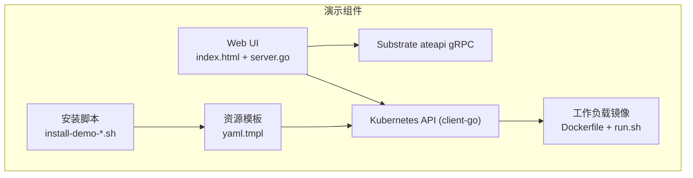
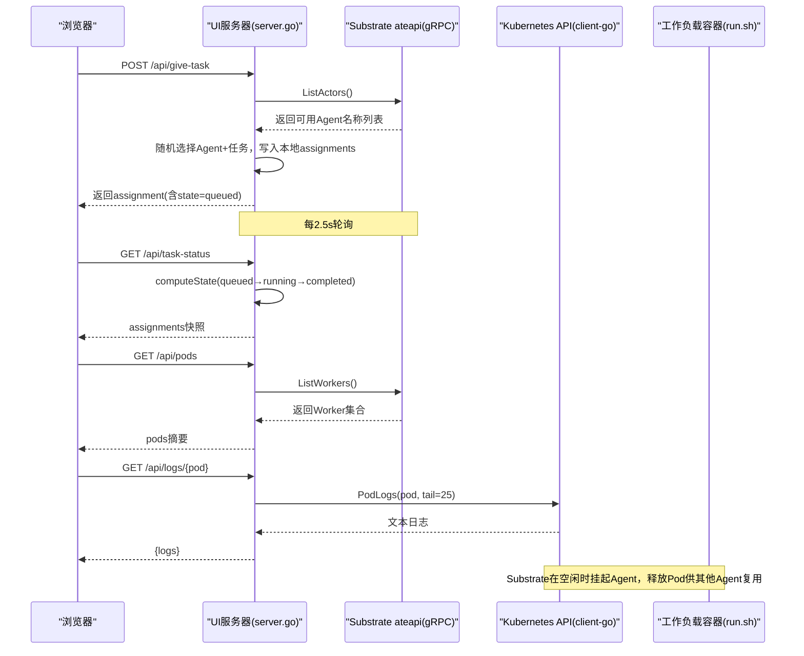
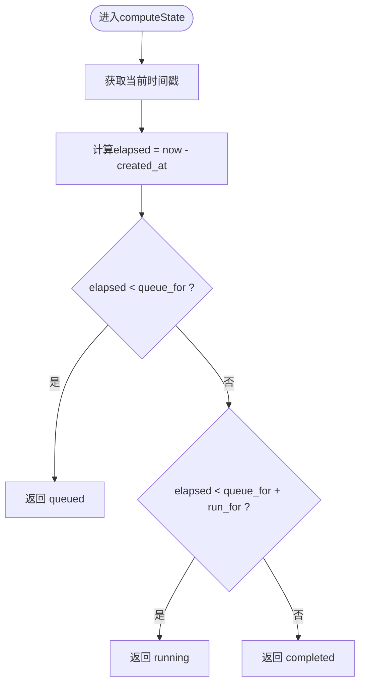
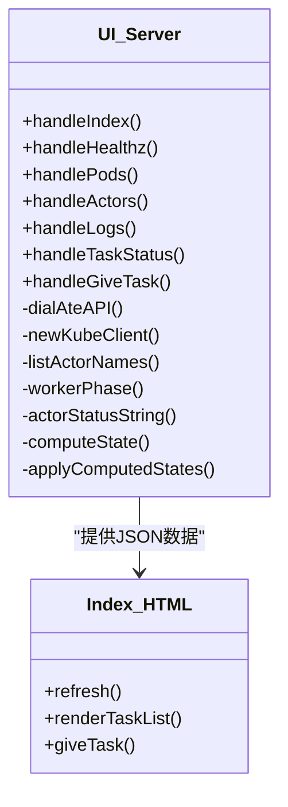
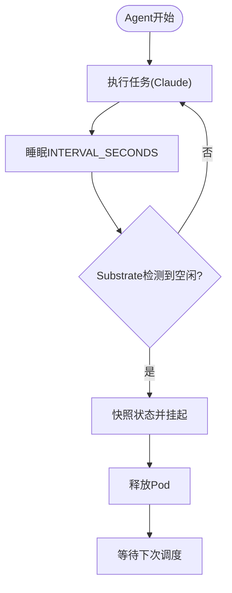
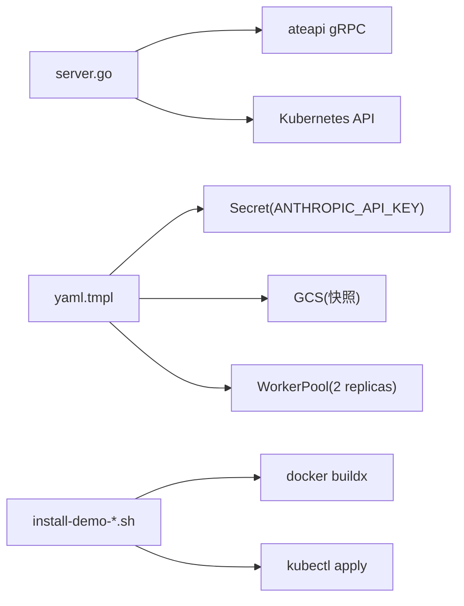

# Claude Code多路复用演示

<cite>
**本文引用的文件**   
- [demos/claude-code-multiplex/README.md](file://demos/claude-code-multiplex/README.md)
- [demos/claude-code-multiplex/ui/index.html](file://demos/claude-code-multiplex/ui/index.html)
- [demos/claude-code-multiplex/ui/server.go](file://demos/claude-code-multiplex/ui/server.go)
- [demos/claude-code-multiplex/workload/Dockerfile](file://demos/claude-code-multiplex/workload/Dockerfile)
- [demos/claude-code-multiplex/workload/run.sh](file://demos/claude-code-multiplex/workload/run.sh)
- [demos/claude-code-multiplex/claude-code-multiplex.yaml.tmpl](file://demos/claude-code-multiplex/claude-code-multiplex.yaml.tmpl)
- [hack/install-demo-claude-code-multiplex.sh](file://hack/install-demo-claude-code-multiplex.sh)
</cite>

## 目录
1. [简介](#简介)
2. [项目结构](#项目结构)
3. [核心组件](#核心组件)
4. [架构总览](#架构总览)
5. [详细组件分析](#详细组件分析)
6. [依赖关系分析](#依赖关系分析)
7. [性能与优化](#性能与优化)
8. [部署指南](#部署指南)
9. [故障排查](#故障排查)
10. [结论](#结论)
11. [附录：API与数据模型](#附录api与数据模型)

## 简介
本演示展示了如何在有限的工作节点（WorkerPod）上，将多个Claude Code驱动的AI代理实例进行“资源超分”与“多路复用”。通过Substrate的挂起/恢复机制，空闲代理会被快照并释放其工作节点，从而让其他代理复用该节点。演示包含三个Agent（luna、mars、orion）共享两个WorkerPod，配合一个轻量Web UI实时展示任务队列、运行状态与日志滚动。

## 项目结构
- 演示说明与入口
  - demos/claude-code-multiplex/README.md：整体说明、前置条件、运行步骤与注意事项
- 工作负载镜像与启动脚本
  - demos/claude-code-multiplex/workload/Dockerfile：基于Node构建，安装Claude CLI
  - demos/claude-code-multiplex/workload/run.sh：循环执行任务并休眠，形成可被挂起的空闲窗口
- 资源模板
  - demos/claude-code-multiplex/claude-code-multiplex.yaml.tmpl：命名空间、Secret、WorkerPool与三个ActorTemplate
- Web UI
  - demos/claude-code-multiplex/ui/index.html：前端页面与轮询逻辑
  - demos/claude-code-multiplex/ui/server.go：Go HTTP服务，聚合ateapi gRPC与Kubernetes API数据
- 部署脚本
  - hack/install-demo-claude-code-multiplex.sh：构建镜像、注入变量、应用/删除资源

图表来源
- [demos/claude-code-multiplex/ui/server.go:501-546](file://demos/claude-code-multiplex/ui/server.go#L501-L546)
- [demos/claude-code-multiplex/ui/index.html:246-422](file://demos/claude-code-multiplex/ui/index.html#L246-L422)
- [demos/claude-code-multiplex/claude-code-multiplex.yaml.tmpl:44-149](file://demos/claude-code-multiplex/claude-code-multiplex.yaml.tmpl#L44-L149)
- [hack/install-demo-claude-code-multiplex.sh:55-82](file://hack/install-demo-claude-code-multiplex.sh#L55-L82)

章节来源
- [demos/claude-code-multiplex/README.md:37-44](file://demos/claude-code-multiplex/README.md#L37-L44)

## 核心组件
- 工作负载镜像与进程
  - Dockerfile：以node:20-slim为基础，全局安装Claude CLI，复制run.sh作为入口
  - run.sh：读取环境变量（ANTHROPIC_API_KEY、TASK、INTERVAL_SECONDS），周期性调用Claude并休眠，形成可被Substrate识别的空闲窗口
- 资源模板
  - WorkerPool：2个副本，标签workload=claude-multiplex
  - ActorTemplate×3：分别定义agent-luna/mars/orion，使用同一镜像但不同TASK与ACTOR_NAME；通过Secret注入ANTHROPIC_API_KEY；配置快照位置到GCS
- Web UI
  - index.html：每2.5秒轮询后端接口，渲染Pods、Actors、任务列表与每个Pod的最后N行日志
  - server.go：提供REST端点，聚合ateapi gRPC（ListWorkers/ListActors）与Kubernetes API（Pod Logs），维护本地任务分配状态机（queued→running→completed）
- 安装脚本
  - 校验环境变量，构建并推送工作负载镜像，解析sha256 digest，替换模板变量后apply到集群

章节来源
- [demos/claude-code-multiplex/workload/Dockerfile:15-30](file://demos/claude-code-multiplex/workload/Dockerfile#L15-L30)
- [demos/claude-code-multiplex/workload/run.sh:26-51](file://demos/claude-code-multiplex/workload/run.sh#L26-L51)
- [demos/claude-code-multiplex/claude-code-multiplex.yaml.tmpl:44-149](file://demos/claude-code-multiplex/claude-code-multiplex.yaml.tmpl#L44-L149)
- [demos/claude-code-multiplex/ui/server.go:166-202](file://demos/claude-code-multiplex/ui/server.go#L166-L202)
- [demos/claude-code-multiplex/ui/index.html:246-422](file://demos/claude-code-multiplex/ui/index.html#L246-L422)
- [hack/install-demo-claude-code-multiplex.sh:36-82](file://hack/install-demo-claude-code-multiplex.sh#L36-L82)

## 架构总览
下图展示了从用户点击“Give a task”到UI刷新、再到Substrate调度与日志拉取的完整链路。

图表来源
- [demos/claude-code-multiplex/ui/server.go:484-533](file://demos/claude-code-multiplex/ui/server.go#L484-L533)
- [demos/claude-code-multiplex/ui/server.go:365-441](file://demos/claude-code-multiplex/ui/server.go#L365-L441)
- [demos/claude-code-multiplex/ui/server.go:445-473](file://demos/claude-code-multiplex/ui/server.go#L445-L473)
- [demos/claude-code-multiplex/ui/index.html:246-422](file://demos/claude-code-multiplex/ui/index.html#L246-L422)

## 详细组件分析

### 会话管理与并发控制（UI侧）
- 用户身份识别
  - 当前演示未实现用户鉴权，按“点击即触发”的简单交互设计
- 会话状态维护
  - 本地内存数组assignments记录最近的任务分配，按时间戳驱动状态机：
    - queued：等待绑定Pod
    - running：已绑定Pod并运行
    - completed：运行结束，等待下一次调度或挂起
- 并发控制
  - 使用互斥锁保护assignments读写，避免并发竞态
  - 所有外部I/O（gRPC、K8s）均设置超时上下文，防止阻塞

图表来源
- [demos/claude-code-multiplex/ui/server.go:256-268](file://demos/claude-code-multiplex/ui/server.go#L256-L268)

章节来源
- [demos/claude-code-multiplex/ui/server.go:126-136](file://demos/claude-code-multiplex/ui/server.go#L126-L136)
- [demos/claude-code-multiplex/ui/server.go:272-289](file://demos/claude-code-multiplex/ui/server.go#L272-L289)
- [demos/claude-code-multiplex/ui/server.go:295-319](file://demos/claude-code-multiplex/ui/server.go#L295-L319)

### Web UI界面与后端API
- 前端
  - 每2.5秒轮询/api/pods、/api/actors、/api/task-status，并针对每个Pod拉取最后25行日志
  - 根据phase字段渲染badge颜色（running/pending/failed）
- 后端
  - /healthz：健康检查，报告kube client是否就绪
  - /api/pods：调用ateapi.ListWorkers，过滤namespace，映射为podSummary
  - /api/actors：调用ateapi.ListActors，过滤namespace，映射为actorSummary
  - /api/logs/{pod}：调用Kubernetes API拉取Pod日志
  - /api/task-status：返回本地assignments快照
  - /api/give-task：POST创建新任务，随机选择Agent与预置任务文本

图表来源
- [demos/claude-code-multiplex/ui/server.go:338-533](file://demos/claude-code-multiplex/ui/server.go#L338-L533)
- [demos/claude-code-multiplex/ui/index.html:246-422](file://demos/claude-code-multiplex/ui/index.html#L246-L422)

章节来源
- [demos/claude-code-multiplex/ui/server.go:353-360](file://demos/claude-code-multiplex/ui/server.go#L353-L360)
- [demos/claude-code-multiplex/ui/server.go:365-441](file://demos/claude-code-multiplex/ui/server.go#L365-L441)
- [demos/claude-code-multiplex/ui/server.go:445-473](file://demos/claude-code-multiplex/ui/server.go#L445-L473)
- [demos/claude-code-multiplex/ui/server.go:475-499](file://demos/claude-code-multiplex/ui/server.go#L475-L499)
- [demos/claude-code-multiplex/ui/index.html:246-422](file://demos/claude-code-multiplex/ui/index.html#L246-L422)

### 工作负载与多路复用原理
- 工作负载行为
  - run.sh循环执行一次Claude任务，然后sleep INTERVAL_SECONDS，形成可被Substrate检测到的空闲窗口
- 多路复用
  - 三个Agent竞争两个WorkerPod，当某Agent空闲时，Substrate将其挂起（快照状态），释放Pod给其他Agent复用
  - 资源超分体现在“Pod数 < Agent数”，通过挂起/恢复提升利用率

图表来源
- [demos/claude-code-multiplex/workload/run.sh:38-51](file://demos/claude-code-multiplex/workload/run.sh#L38-L51)
- [demos/claude-code-multiplex/claude-code-multiplex.yaml.tmpl:44-149](file://demos/claude-code-multiplex/claude-code-multiplex.yaml.tmpl#L44-L149)

章节来源
- [demos/claude-code-multiplex/workload/run.sh:26-51](file://demos/claude-code-multiplex/workload/run.sh#L26-L51)
- [demos/claude-code-multiplex/claude-code-multiplex.yaml.tmpl:44-149](file://demos/claude-code-multiplex/claude-code-multiplex.yaml.tmpl#L44-L149)

## 依赖关系分析
- UI依赖
  - ateapi gRPC客户端：用于列出Workers与Actors
  - Kubernetes client-go：用于拉取Pod日志
- 资源模板依赖
  - Secret：存储ANTHROPIC_API_KEY
  - GCS bucket：用于快照持久化
  - WorkerPool标签：匹配ActorTemplate的workerSelector
- 安装脚本依赖
  - docker buildx：构建并推送工作负载镜像
  - jq：解析镜像digest
  - sed：替换模板变量

图表来源
- [demos/claude-code-multiplex/ui/server.go:166-202](file://demos/claude-code-multiplex/ui/server.go#L166-L202)
- [demos/claude-code-multiplex/claude-code-multiplex.yaml.tmpl:24-89](file://demos/claude-code-multiplex/claude-code-multiplex.yaml.tmpl#L24-L89)
- [hack/install-demo-claude-code-multiplex.sh:36-82](file://hack/install-demo-claude-code-multiplex.sh#L36-L82)

章节来源
- [demos/claude-code-multiplex/ui/server.go:166-202](file://demos/claude-code-multiplex/ui/server.go#L166-L202)
- [demos/claude-code-multiplex/claude-code-multiplex.yaml.tmpl:24-89](file://demos/claude-code-multiplex/claude-code-multiplex.yaml.tmpl#L24-L89)
- [hack/install-demo-claude-code-multiplex.sh:36-82](file://hack/install-demo-claude-code-multiplex.sh#L36-L82)

## 性能与优化
- 内存共享
  - 当前演示未实现跨进程内存共享；如需进一步优化，可在同一Pod内采用共享卷或进程间通信（IPC）策略
- CPU时间片分配
  - 通过WorkerPool副本数限制并发上限；合理设置INTERVAL_SECONDS可增加多路复用机会
- 网络连接复用
  - UI对ateapi与K8s API的请求设置了超时，建议在生产中启用连接池与重试退避
- I/O与缓存
  - UI轮询间隔2.5s，可根据场景调整；日志拉取仅tail=25行，减少带宽占用

[本节为通用指导，不直接分析具体文件]

## 部署指南
- 前置条件
  - 已安装Agent Substrate的Kubernetes集群
  - kubectl已配置
  - 暴露ateapi端口转发（例如：kubectl port-forward svc/api 8080:443 -n ate-system）
  - ANTHROPIC_API_KEY、BUCKET_NAME、KO_DOCKER_REPO环境变量
- 一键部署
  - 执行安装脚本：./hack/install-ate.sh --deploy-demo-claude-code-multiplex
  - 脚本会构建并推送工作负载镜像，解析sha256 digest，替换模板变量后apply到集群
- 启动Dashboard
  - cd demos/claude-code-multiplex/ui
  - PORT=8090 ATEAPI_ADDR=localhost:8080 go run .
  - 访问http://localhost:8090
- 清理
  - ./hack/install-ate.sh --delete-demo-claude-code-multiplex

章节来源
- [demos/claude-code-multiplex/README.md:46-89](file://demos/claude-code-multiplex/README.md#L46-L89)
- [hack/install-demo-claude-code-multiplex.sh:55-82](file://hack/install-demo-claude-code-multiplex.sh#L55-L82)

## 故障排查
- 常见问题
  - 无法拉取日志：确认kube client初始化成功（/healthz logs字段），并确保DEMO_NAMESPACE正确
  - ateapi不可达：确认端口转发或服务可达，检查ATEAPI_ADDR
  - 无可用Agent：确保ActorTemplates已创建且处于可调度状态
- 诊断方法
  - 查看Pod日志：/api/logs/{pod}
  - 观察Actors状态：/api/actors
  - 检查Worker状态：/api/pods

章节来源
- [demos/claude-code-multiplex/ui/server.go:353-360](file://demos/claude-code-multiplex/ui/server.go#L353-L360)
- [demos/claude-code-multiplex/ui/server.go:365-441](file://demos/claude-code-multiplex/ui/server.go#L365-L441)
- [demos/claude-code-multiplex/ui/server.go:445-473](file://demos/claude-code-multiplex/ui/server.go#L445-L473)

## 结论
本演示通过“Pod数 < Agent数”的资源超分策略，结合Substrate的挂起/恢复能力，实现了多路复用。Web UI提供了直观的任务与状态可视化，便于理解调度与复用过程。生产环境中可进一步引入鉴权、连接池、指标采集与弹性伸缩等能力以提升稳定性与可观测性。

[本节为总结，不直接分析具体文件]

## 附录：API与数据模型
- REST端点
  - GET /healthz：返回ok、namespace、ateapi_addr、logs布尔值
  - GET /api/pods：返回pods数组（name、node、phase、ready、started_at）
  - GET /api/actors：返回actors数组（kind、name、phase、message）
  - GET /api/logs/{pod}：返回{logs, stderr}
  - GET /api/task-status：返回assignments数组（id、agent、task、state、created_at、started_at、completed_at、queue_for、run_for）
  - POST /api/give-task：创建新任务，返回assignment对象
- 数据结构
  - assignment：任务分配记录，含生命周期时间与状态
  - podSummary：Worker聚合视图，映射substrate语义到UI友好字段
  - actorSummary：Actor聚合视图，映射substrate状态枚举到可读phase

章节来源
- [demos/claude-code-multiplex/ui/server.go:338-533](file://demos/claude-code-multiplex/ui/server.go#L338-L533)
- [demos/claude-code-multiplex/ui/server.go:90-124](file://demos/claude-code-multiplex/ui/server.go#L90-L124)
