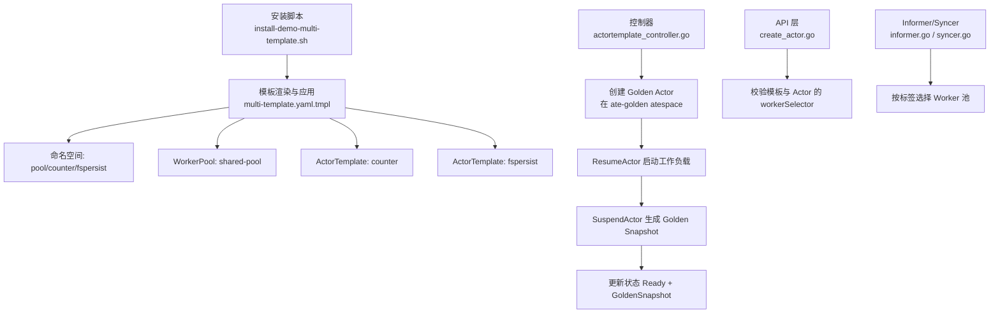
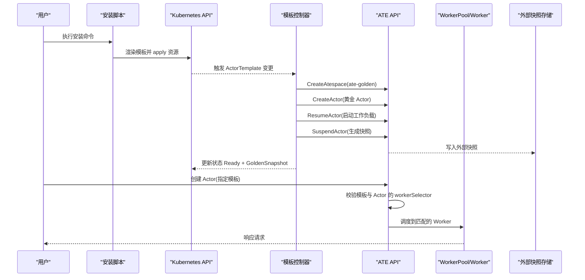
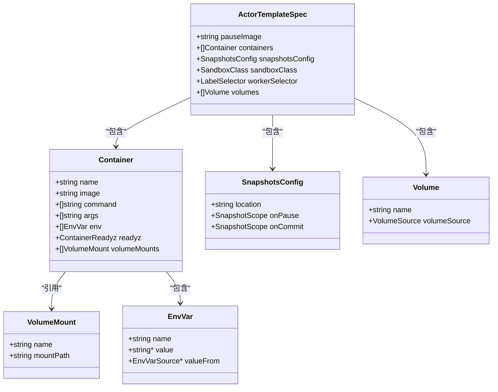
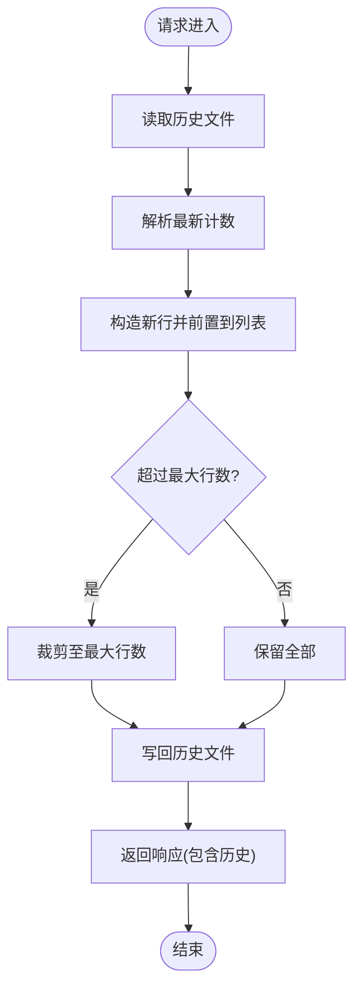
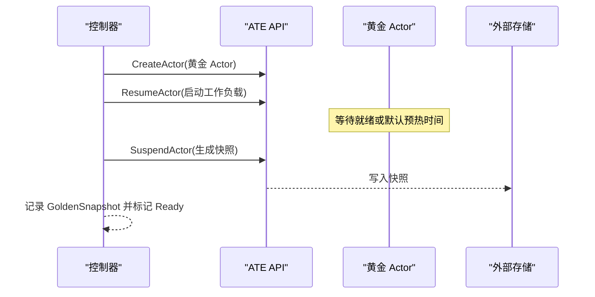
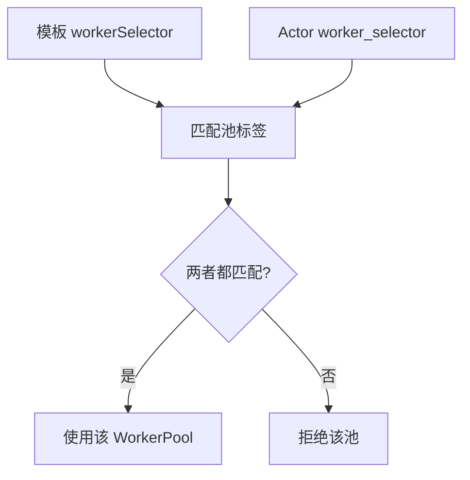
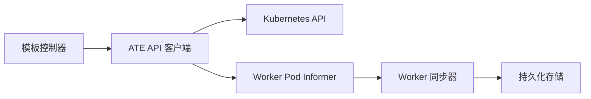

# 多模板演示

<cite>
**本文引用的文件**   
- [demos/multi-template/README.md](file://demos/multi-template/README.md)
- [demos/multi-template/multi-template.yaml.tmpl](file://demos/multi-template/multi-template.yaml.tmpl)
- [demos/multi-template/fspersist/fspersist.go](file://demos/multi-template/fspersist/fspersist.go)
- [demos/counter/counter.go](file://demos/counter/counter.go)
- [pkg/api/v1alpha1/actortemplate_types.go](file://pkg/api/v1alpha1/actortemplate_types.go)
- [cmd/atecontroller/internal/controllers/actortemplate_controller.go](file://cmd/atecontroller/internal/controllers/actortemplate_controller.go)
- [hack/install-demo-multi-template.sh](file://hack/install-demo-multi-template.sh)
- [cmd/ateapi/internal/controlapi/create_actor.go](file://cmd/ateapi/internal/controlapi/create_actor.go)
- [cmd/ateapi/internal/controlapi/syncer.go](file://cmd/ateapi/internal/controlapi/syncer.go)
- [cmd/ateapi/internal/controlapi/informer.go](file://cmd/ateapi/internal/controlapi/informer.go)
</cite>

## 目录
1. [简介](#简介)
2. [项目结构](#项目结构)
3. [核心组件](#核心组件)
4. [架构总览](#架构总览)
5. [详细组件分析](#详细组件分析)
6. [依赖关系分析](#依赖关系分析)
7. [性能考虑](#性能考虑)
8. [故障排查指南](#故障排查指南)
9. [结论](#结论)
10. [附录](#附录)

## 简介
本“多模板演示”展示了两个不同的 ActorTemplate（分别运行不同二进制）可以共享同一个 WorkerPool，即使它们位于不同命名空间。每个 ActorTemplate 通过 workerSelector 与池的标签进行匹配，选择范围是集群级而非命名空间级。该示例还演示了：
- 模板参数化与环境变量注入（安装脚本对模板中的占位符进行替换）
- 快照与持久化（Golden Snapshot、外部存储位置）
- 版本控制与回滚（镜像固定、Golden Snapshot 作为稳定基线）
- 文件系统持久化的行为验证（fspersist 示例）

## 项目结构
本演示相关的关键文件与职责如下：
- demos/multi-template/multi-template.yaml.tmpl：定义命名空间、WorkerPool 和两个 ActorTemplate，包含环境变量占位符
- demos/multi-template/README.md：演示说明、部署与使用步骤
- demos/multi-template/fspersist/fspersist.go：演示文件系统的跨检查点/恢复持久化
- demos/counter/counter.go：演示内存与文件的跨检查点/恢复持久化
- pkg/api/v1alpha1/actortemplate_types.go：ActorTemplate CRD 类型定义（容器、环境变量、快照配置、workerSelector 等）
- cmd/atecontroller/internal/controllers/actortemplate_controller.go：控制器实现，负责创建并预热 Golden Actor，生成 Golden Snapshot
- hack/install-demo-multi-template.sh：安装脚本，执行模板渲染与资源应用，等待就绪
- cmd/ateapi/internal/controlapi/create_actor.go：创建 Actor 时的校验逻辑（含 selector 校验）
- cmd/ateapi/internal/controlapi/syncer.go：Worker 同步器，监听 Pod 事件并维护工作节点状态
- cmd/ateapi/internal/controlapi/informer.go：基于标签选择器的 Worker Pod Informer

图表来源
- [hack/install-demo-multi-template.sh:32-43](file://hack/install-demo-multi-template.sh#L32-L43)
- [demos/multi-template/multi-template.yaml.tmpl:40-82](file://demos/multi-template/multi-template.yaml.tmpl#L40-L82)
- [cmd/atecontroller/internal/controllers/actortemplate_controller.go:81-187](file://cmd/atecontroller/internal/controllers/actortemplate_controller.go#L81-L187)
- [cmd/ateapi/internal/controlapi/create_actor.go:122-152](file://cmd/ateapi/internal/controlapi/create_actor.go#L122-L152)
- [cmd/ateapi/internal/controlapi/informer.go:53-75](file://cmd/ateapi/internal/controlapi/informer.go#L53-L75)
- [cmd/ateapi/internal/controlapi/syncer.go:50-86](file://cmd/ateapi/internal/controlapi/syncer.go#L50-L86)

章节来源
- [demos/multi-template/README.md:1-108](file://demos/multi-template/README.md#L1-L108)
- [demos/multi-template/multi-template.yaml.tmpl:1-82](file://demos/multi-template/multi-template.yaml.tmpl#L1-L82)
- [hack/install-demo-multi-template.sh:1-53](file://hack/install-demo-multi-template.sh#L1-L53)

## 核心组件
- ActorTemplate：描述要运行的容器镜像、环境变量、就绪探针、卷挂载以及快照策略；通过 workerSelector 限制可使用的 WorkerPool。
- WorkerPool：提供计算容量（Pod），由 ateom 管理；模板通过标签选择器与池匹配，选择范围是集群级。
- Golden Snapshot：控制器为每个模板创建一个“黄金 Actor”，引导后挂起以生成稳定的快照，作为后续实例化的基线。
- 安装脚本：将模板中的占位符替换为实际值（如 GCS 桶名），然后应用资源并等待就绪。

章节来源
- [pkg/api/v1alpha1/actortemplate_types.go:278-340](file://pkg/api/v1alpha1/actortemplate_types.go#L278-L340)
- [cmd/atecontroller/internal/controllers/actortemplate_controller.go:81-187](file://cmd/atecontroller/internal/controllers/actortemplate_controller.go#L81-L187)
- [hack/install-demo-multi-template.sh:32-43](file://hack/install-demo-multi-template.sh#L32-L43)

## 架构总览
下图展示了从安装到运行时调用的关键流程：安装脚本渲染模板并应用资源；控制器驱动 Golden Actor 生命周期；API 层根据模板与 Actor 的 workerSelector 选择匹配的 WorkerPool；Informer/Syncer 维护 Worker 状态。

图表来源
- [hack/install-demo-multi-template.sh:32-43](file://hack/install-demo-multi-template.sh#L32-L43)
- [cmd/atecontroller/internal/controllers/actortemplate_controller.go:81-187](file://cmd/atecontroller/internal/controllers/actortemplate_controller.go#L81-L187)
- [cmd/ateapi/internal/controlapi/create_actor.go:122-152](file://cmd/ateapi/internal/controlapi/create_actor.go#L122-L152)

## 详细组件分析

### 模板管理机制
- 模板继承与组合
  - 模板通过 spec.containers 声明工作负载镜像、入口、参数和环境变量；通过 spec.sandboxClass 选择沙箱族；通过 spec.volumes 与 volumeMounts 声明持久卷挂载。
  - 模板不直接持有运行时状态，而是通过 Golden Snapshot 固化初始状态，从而避免重复初始化开销。
- 配置合并与参数化
  - 安装脚本在部署前对模板进行文本替换（例如 ${BUCKET_NAME}），实现环境参数化。
  - 模板中不支持 $(VAR_NAME) 展开，环境变量需显式声明或通过 valueFrom 引用 Secret。
- 版本控制与回滚
  - 所有镜像必须固定（包含 digest），确保镜像变更会失效快照，强制重新构建 Golden Snapshot，保证一致性。
  - Golden Snapshot 作为模板的稳定基线，便于回滚到已知版本。

图表来源
- [pkg/api/v1alpha1/actortemplate_types.go:80-136](file://pkg/api/v1alpha1/actortemplate_types.go#L80-L136)
- [pkg/api/v1alpha1/actortemplate_types.go:169-234](file://pkg/api/v1alpha1/actortemplate_types.go#L169-L234)
- [pkg/api/v1alpha1/actortemplate_types.go:250-276](file://pkg/api/v1alpha1/actortemplate_types.go#L250-L276)
- [pkg/api/v1alpha1/actortemplate_types.go:283-340](file://pkg/api/v1alpha1/actortemplate_types.go#L283-L340)

章节来源
- [pkg/api/v1alpha1/actortemplate_types.go:80-136](file://pkg/api/v1alpha1/actortemplate_types.go#L80-L136)
- [pkg/api/v1alpha1/actortemplate_types.go:169-234](file://pkg/api/v1alpha1/actortemplate_types.go#L169-L234)
- [pkg/api/v1alpha1/actortemplate_types.go:250-276](file://pkg/api/v1alpha1/actortemplate_types.go#L250-L276)
- [pkg/api/v1alpha1/actortemplate_types.go:283-340](file://pkg/api/v1alpha1/actortemplate_types.go#L283-L340)
- [hack/install-demo-multi-template.sh:32-43](file://hack/install-demo-multi-template.sh#L32-L43)

### 文件系统持久化与数据同步
- 演示目标
  - fspersist 在每个请求中将一行记录追加到根文件系统上的历史文件，并在每次请求时读取该文件以返回累积历史。这用于验证文件系统内容在检查点/恢复周期内保持一致。
- 同步策略与一致性
  - 工作负载进程在本地写文件；当 Actor 被挂起时，系统会将当前文件系统增量与内存快照一起持久化到外部存储（由模板的 snapshotsConfig.location 指定）。
  - 恢复时，系统将快照还原到新的 Worker 上，使文件内容与计数保持连续。
- 冲突解决
  - 控制器在生成 Golden Snapshot 时会调用 SuspendActor；若出现冲突，控制器注释指出需要更健壮地处理并从已挂起的 Actor 读取快照信息。

图表来源
- [demos/multi-template/fspersist/fspersist.go:86-119](file://demos/multi-template/fspersist/fspersist.go#L86-L119)

章节来源
- [demos/multi-template/fspersist/fspersist.go:1-154](file://demos/multi-template/fspersist/fspersist.go#L1-L154)
- [cmd/atecontroller/internal/controllers/actortemplate_controller.go:153-167](file://cmd/atecontroller/internal/controllers/actortemplate_controller.go#L153-L167)

### 模板的版本控制与回滚机制
- 镜像固定
  - 模板要求所有镜像必须包含 digest，防止镜像漂移导致快照不一致。
- Golden Snapshot 作为基线
  - 控制器为每个模板创建黄金 Actor，引导完成后挂起并生成快照，随后模板状态标记为 Ready，并记录 GoldenSnapshot 路径。
- 回滚策略
  - 若新版本存在风险，可将模板恢复到旧版本的镜像与快照，确保应用升级的安全性。

图表来源
- [cmd/atecontroller/internal/controllers/actortemplate_controller.go:81-187](file://cmd/atecontroller/internal/controllers/actortemplate_controller.go#L81-L187)

章节来源
- [pkg/api/v1alpha1/actortemplate_types.go:283-340](file://pkg/api/v1alpha1/actortemplate_types.go#L283-L340)
- [cmd/atecontroller/internal/controllers/actortemplate_controller.go:81-187](file://cmd/atecontroller/internal/controllers/actortemplate_controller.go#L81-L187)

### 多个 Actor 模板与 WorkerPool 共享
- 模板选择池
  - 模板通过 workerSelector 指定标签选择器，仅选择与该选择器匹配的 WorkerPool。
- 集群级选择
  - 选择范围是集群级，不受命名空间限制；因此不同命名空间的模板可以选择同一池。
- 双重选择器约束
  - 最终可用的 WorkerPool 必须同时满足模板的 workerSelector 与 Actor 的 worker_selector（二者取交集）。

图表来源
- [cmd/ateapi/internal/controlapi/create_actor.go:122-152](file://cmd/ateapi/internal/controlapi/create_actor.go#L122-L152)
- [cmd/ateapi/internal/controlapi/informer.go:53-75](file://cmd/ateapi/internal/controlapi/informer.go#L53-L75)

章节来源
- [cmd/ateapi/internal/controlapi/create_actor.go:122-152](file://cmd/ateapi/internal/controlapi/create_actor.go#L122-L152)
- [cmd/ateapi/internal/controlapi/informer.go:53-75](file://cmd/ateapi/internal/controlapi/informer.go#L53-L75)

### 环境变量注入与动态配置更新
- 环境变量注入
  - 模板支持在容器中声明环境变量，可通过 value 或 valueFrom.secretKeyRef 注入。
  - 不支持 Kubernetes 风格的 $(VAR_NAME) 展开，需显式声明。
- 动态配置更新
  - 模板 spec 是不可变的；如需更新配置，应创建新版本的模板（新镜像与新快照），并通过切换模板名称或引用实现灰度发布。

章节来源
- [pkg/api/v1alpha1/actortemplate_types.go:169-234](file://pkg/api/v1alpha1/actortemplate_types.go#L169-L234)
- [pkg/api/v1alpha1/actortemplate_types.go:283-340](file://pkg/api/v1alpha1/actortemplate_types.go#L283-L340)

### 安装与部署流程
- 安装脚本
  - 将模板中的 ${BUCKET_NAME} 替换为实际值，然后应用资源。
  - 等待 WorkerPool 部署就绪，并等待两个 ActorTemplate 均达到 Ready 条件。
- 使用方式
  - 先创建 atespace，再为每个模板创建 Actor，通过 atenet router 访问。

章节来源
- [hack/install-demo-multi-template.sh:32-43](file://hack/install-demo-multi-template.sh#L32-L43)
- [demos/multi-template/README.md:15-51](file://demos/multi-template/README.md#L15-L51)

## 依赖关系分析
- 控制器依赖
  - 控制器通过 ATE API 客户端操作 Atespace、Actor 的创建、恢复与挂起，并更新模板状态。
- API 层依赖
  - API 层在创建 Actor 时校验模板与 Actor 的选择器，确保只有匹配的 WorkerPool 可用。
- Informer/Syncer 依赖
  - Informer 基于标签选择器监听 Worker Pod；Syncer 在 Pod 增删改时同步 Worker 状态，并在删除时释放绑定到该 Worker 的 Actor。

图表来源
- [cmd/atecontroller/internal/controllers/actortemplate_controller.go:81-187](file://cmd/atecontroller/internal/controllers/actortemplate_controller.go#L81-L187)
- [cmd/ateapi/internal/controlapi/create_actor.go:122-152](file://cmd/ateapi/internal/controlapi/create_actor.go#L122-L152)
- [cmd/ateapi/internal/controlapi/informer.go:53-75](file://cmd/ateapi/internal/controlapi/informer.go#L53-L75)
- [cmd/ateapi/internal/controlapi/syncer.go:50-86](file://cmd/ateapi/internal/controlapi/syncer.go#L50-L86)

章节来源
- [cmd/atecontroller/internal/controllers/actortemplate_controller.go:81-187](file://cmd/atecontroller/internal/controllers/actortemplate_controller.go#L81-L187)
- [cmd/ateapi/internal/controlapi/create_actor.go:122-152](file://cmd/ateapi/internal/controlapi/create_actor.go#L122-L152)
- [cmd/ateapi/internal/controlapi/informer.go:53-75](file://cmd/ateapi/internal/controlapi/informer.go#L53-L75)
- [cmd/ateapi/internal/controlapi/syncer.go:50-86](file://cmd/ateapi/internal/controlapi/syncer.go#L50-L86)

## 性能考虑
- Golden Snapshot 预热
  - 控制器在 ResumeActor 后会根据是否声明 readyz 决定等待时间；若无就绪探针，则采用默认预热时间，以减少冷启动开销。
- 快照范围
  - 通过 SnapshotsConfig 的 onPause/onCommit 控制快照范围（Full 或 Data），有助于平衡快照大小与恢复速度。
- 镜像固定
  - 固定镜像可减少因镜像漂移导致的额外重建与缓存失效，提升稳定性与性能。

章节来源
- [cmd/atecontroller/internal/controllers/actortemplate_controller.go:195-210](file://cmd/atecontroller/internal/controllers/actortemplate_controller.go#L195-L210)
- [pkg/api/v1alpha1/actortemplate_types.go:250-276](file://pkg/api/v1alpha1/actortemplate_types.go#L250-L276)
- [pkg/api/v1alpha1/actortemplate_types.go:283-340](file://pkg/api/v1alpha1/actortemplate_types.go#L283-L340)

## 故障排查指南
- 模板未就绪
  - 检查控制器日志，确认黄金 Actor 是否成功 Resume 与 Suspend，以及 GoldenSnapshot 是否正确写入外部存储。
- 选择器不匹配
  - 确认模板的 workerSelector 与 Actor 的 worker_selector 同时匹配目标 WorkerPool 的标签。
- Worker 异常
  - 观察 Informer/Syncer 日志，确认 Worker Pod 的增删改事件是否被正确处理，是否存在无法释放绑定的 Actor。
- 快照冲突
  - 若 SuspendActor 返回冲突，控制器注释建议从已挂起的 Actor 读取快照信息，增强鲁棒性。

章节来源
- [cmd/atecontroller/internal/controllers/actortemplate_controller.go:153-167](file://cmd/atecontroller/internal/controllers/actortemplate_controller.go#L153-L167)
- [cmd/ateapi/internal/controlapi/syncer.go:50-86](file://cmd/ateapi/internal/controlapi/syncer.go#L50-L86)
- [cmd/ateapi/internal/controlapi/informer.go:53-75](file://cmd/ateapi/internal/controlapi/informer.go#L53-L75)

## 结论
多模板演示清晰展示了：
- 模板与 WorkerPool 解耦，通过集群级标签选择器灵活复用池资源
- Golden Snapshot 作为模板的稳定基线，简化初始化并支持回滚
- 文件系统与内存状态在检查点/恢复周期内保持一致
- 安装脚本的环境变量注入与模板不可变性共同保障部署一致性与安全性

## 附录
- 使用示例
  - 参考 README 中的 curl 示例，验证计数器与文件历史的行为。
- 最佳实践
  - 始终固定镜像版本（包含 digest）
  - 为工作负载提供就绪探针，减少预热时间
  - 合理设置快照范围，权衡大小与恢复速度
  - 使用不同命名空间隔离模板与池，提高可维护性

章节来源
- [demos/multi-template/README.md:61-90](file://demos/multi-template/README.md#L61-L90)
- [demos/counter/counter.go:83-94](file://demos/counter/counter.go#L83-L94)
- [pkg/api/v1alpha1/actortemplate_types.go:250-276](file://pkg/api/v1alpha1/actortemplate_types.go#L250-L276)
- [pkg/api/v1alpha1/actortemplate_types.go:283-340](file://pkg/api/v1alpha1/actortemplate_types.go#L283-L340)
