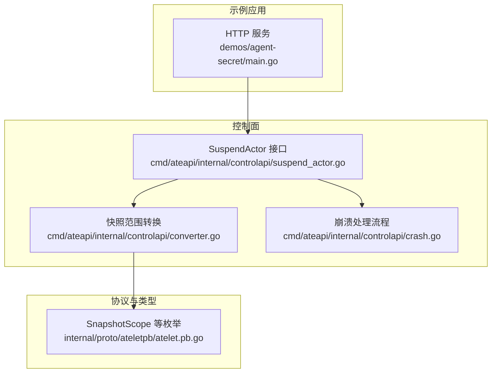
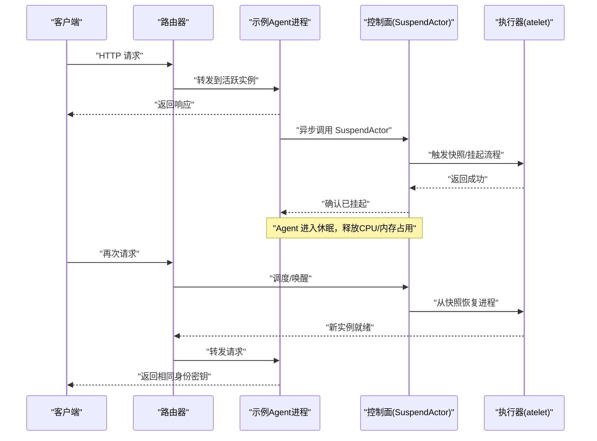
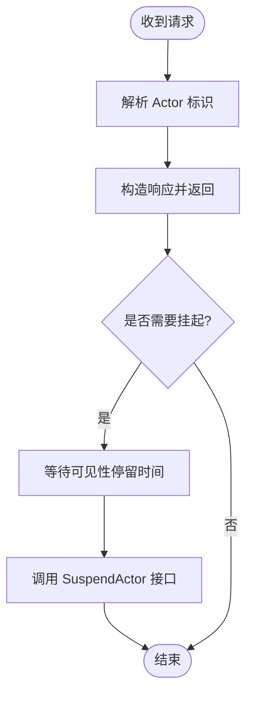
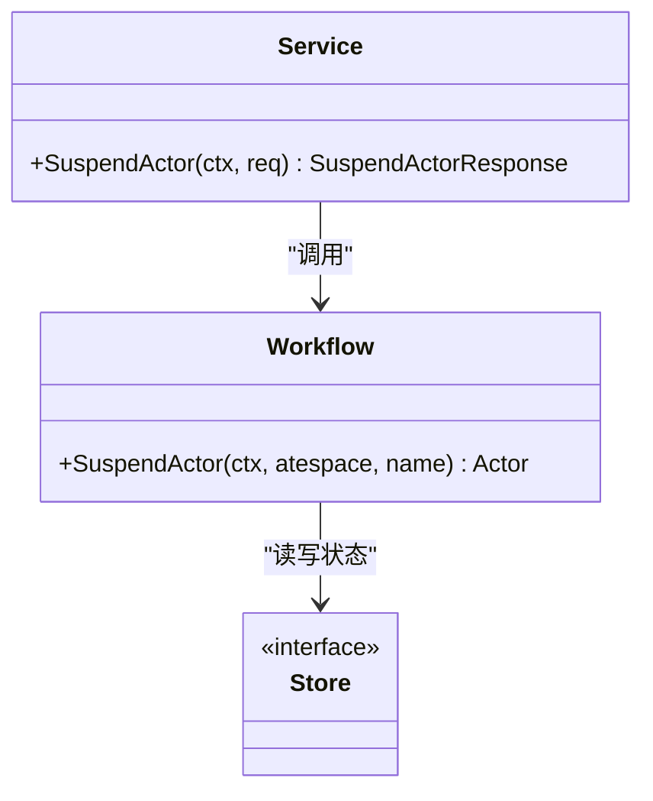
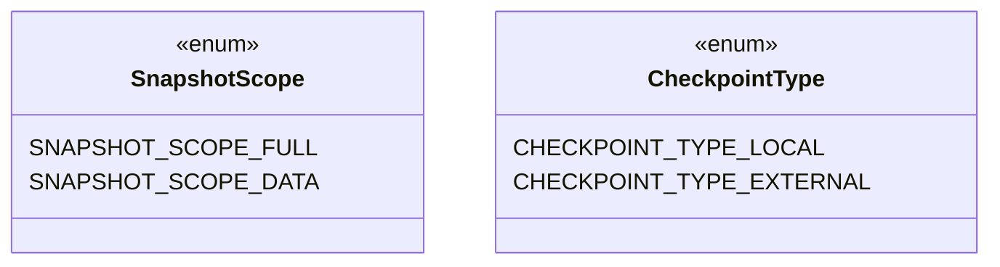
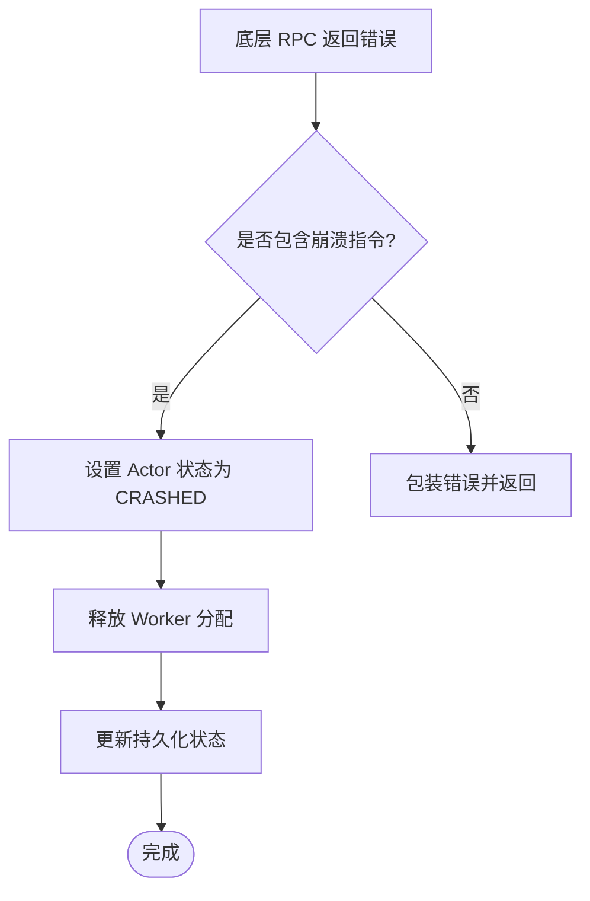
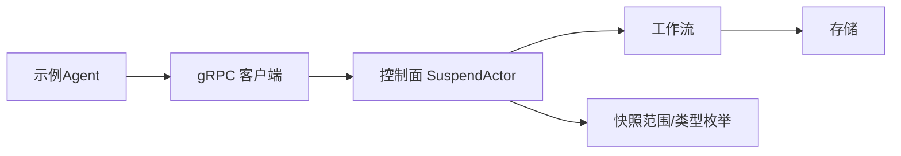
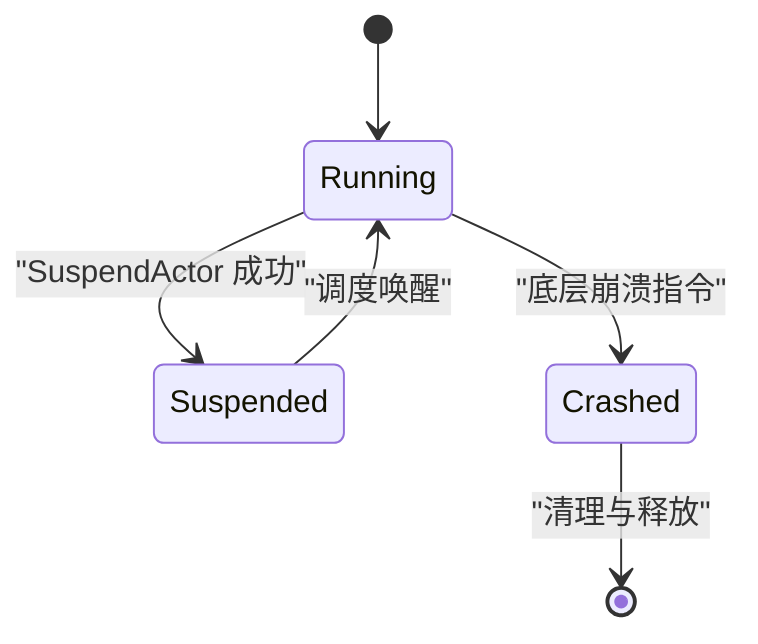

# 安全代理示例

<cite>
**本文引用的文件列表**
- [demos/agent-secret/README.md](file://demos/agent-secret/README.md)
- [demos/agent-secret/main.go](file://demos/agent-secret/main.go)
- [cmd/ateapi/internal/controlapi/suspend_actor.go](file://cmd/ateapi/internal/controlapi/suspend_actor.go)
- [cmd/ateapi/internal/controlapi/converter.go](file://cmd/ateapi/internal/controlapi/converter.go)
- [internal/proto/ateletpb/atelet.pb.go](file://internal/proto/ateletpb/atelet.pb.go)
- [cmd/ateapi/internal/controlapi/crash.go](file://cmd/ateapi/internal/controlapi/crash.go)
- [hack/install-demo-agent-secret.sh](file://hack/install-demo-agent-secret.sh)
</cite>

## 目录
1. [简介](#简介)
2. [项目结构](#项目结构)
3. [核心组件](#核心组件)
4. [架构总览](#架构总览)
5. [详细组件分析](#详细组件分析)
6. [依赖关系分析](#依赖关系分析)
7. [性能与资源特性](#性能与资源特性)
8. [监控与调试](#监控与调试)
9. [生产部署与配置建议](#生产部署与配置建议)
10. [故障恢复与容错](#故障恢复与容错)
11. [结论](#结论)

## 简介
本示例演示“零空闲自挂起”的 Agent 生命周期：Agent 在处理完请求后自动调用控制面 API 进行自我挂起，释放计算资源；同时通过进程内随机生成的“身份密钥”驻留内存，证明在物理节点迁移或重启后，进程的完整内存状态（包括敏感信息）可被持久化并快速恢复。该机制适用于高并发、低延迟、多租户隔离的会话型工作负载。

## 项目结构
- 示例应用位于 demos/agent-secret，包含一个极简 HTTP 服务，演示：
  - 进程启动时生成驻留内存的“身份密钥”
  - 处理请求后异步触发“自我挂起”
  - 健康检查端点
- 控制面 SuspendActor 接口实现位于 cmd/ateapi/internal/controlapi
- 快照范围枚举定义于 internal/proto/ateletpb/atelet.pb.go
- 安装脚本位于 hack/install-demo-agent-secret.sh

图表来源
- [demos/agent-secret/main.go:41-136](file://demos/agent-secret/main.go#L41-L136)
- [cmd/ateapi/internal/controlapi/suspend_actor.go:29-48](file://cmd/ateapi/internal/controlapi/suspend_actor.go#L29-L48)
- [cmd/ateapi/internal/controlapi/converter.go:24-35](file://cmd/ateapi/internal/controlapi/converter.go#L24-L35)
- [internal/proto/ateletpb/atelet.pb.go:136-162](file://internal/proto/ateletpb/atelet.pb.go#L136-L162)
- [cmd/ateapi/internal/controlapi/crash.go:30-75](file://cmd/ateapi/internal/controlapi/crash.go#L30-L75)

章节来源
- [demos/agent-secret/README.md:1-93](file://demos/agent-secret/README.md#L1-L93)
- [demos/agent-secret/main.go:1-136](file://demos/agent-secret/main.go#L1-L136)
- [cmd/ateapi/internal/controlapi/suspend_actor.go:1-65](file://cmd/ateapi/internal/controlapi/suspend_actor.go#L1-L65)
- [cmd/ateapi/internal/controlapi/converter.go:1-36](file://cmd/ateapi/internal/controlapi/converter.go#L1-L36)
- [internal/proto/ateletpb/atelet.pb.go:136-162](file://internal/proto/ateletpb/atelet.pb.go#L136-L162)
- [cmd/ateapi/internal/controlapi/crash.go:1-116](file://cmd/ateapi/internal/controlapi/crash.go#L1-L116)

## 核心组件
- 示例 Agent 进程
  - 启动时生成驻留内存的“身份密钥”，用于验证跨挂起/恢复后的进程一致性
  - 提供 /health 健康检查与根路径业务处理
  - 响应完成后，异步等待一段“可见性停留时间”，随后调用控制面 SuspendActor 接口实现自我挂起
- 控制面 SuspendActor
  - 校验请求参数
  - 调用工作流完成挂起，返回最新 Actor 状态
  - 对持久化冲突与未找到错误进行语义化 gRPC 状态码映射
- 快照范围与类型
  - SnapshotScope 支持“全量（内存+文件系统增量）”和“仅数据卷”两种范围
  - CheckpointType 支持本地与外部对象存储两类快照目标
- 崩溃处理
  - 当底层执行器上报崩溃指令时，控制面将 Actor 置为 CRASHED，并释放其占用的 Worker 资源

章节来源
- [demos/agent-secret/main.go:34-136](file://demos/agent-secret/main.go#L34-L136)
- [cmd/ateapi/internal/controlapi/suspend_actor.go:29-48](file://cmd/ateapi/internal/controlapi/suspend_actor.go#L29-L48)
- [internal/proto/ateletpb/atelet.pb.go:84-162](file://internal/proto/ateletpb/atelet.pb.go#L84-L162)
- [cmd/ateapi/internal/controlapi/crash.go:30-75](file://cmd/ateapi/internal/controlapi/crash.go#L30-L75)

## 架构总览
下图展示了“零空闲自挂起”的关键交互：Agent 在完成请求后主动挂起，控制面协调底层执行器完成内存快照与状态保存，后续请求到来时由调度系统快速唤醒同一逻辑进程。

图表来源
- [demos/agent-secret/main.go:103-136](file://demos/agent-secret/main.go#L103-L136)
- [cmd/ateapi/internal/controlapi/suspend_actor.go:29-48](file://cmd/ateapi/internal/controlapi/suspend_actor.go#L29-L48)
- [internal/proto/ateletpb/atelet.pb.go:136-162](file://internal/proto/ateletpb/atelet.pb.go#L136-L162)

## 详细组件分析

### 示例 Agent 进程（零空闲自挂起）
- 关键行为
  - 进程初始化阶段生成驻留内存的“身份密钥”，作为会话唯一标识
  - 处理请求后，根据 Host/Header 解析 Actor 名称与 atespace
  - 响应完成后，使用 goroutine 异步等待固定时长（示例中为 7 秒），再调用控制面 SuspendActor 接口
  - 健康检查端点 /health 返回 OK
- 设计要点
  - 非阻塞挂起：避免影响当前请求的响应链路
  - 可见性停留：便于观察运行态到挂起态的状态切换
  - 身份一致性：即使在不同物理节点恢复，仍返回相同密钥，体现“进程级状态迁移”

图表来源
- [demos/agent-secret/main.go:60-136](file://demos/agent-secret/main.go#L60-L136)

章节来源
- [demos/agent-secret/main.go:34-136](file://demos/agent-secret/main.go#L34-L136)

### 控制面 SuspendActor 接口
- 职责
  - 校验请求参数（Atespace、Name 等）
  - 调用工作流完成挂起，返回最新 Actor 状态
  - 对持久化冲突与未找到错误进行语义化映射
- 错误处理
  - 持久化冲突：返回 Aborted，提示重试
  - 未找到：返回 NotFound
  - 其他错误：透传包装错误

图表来源
- [cmd/ateapi/internal/controlapi/suspend_actor.go:29-48](file://cmd/ateapi/internal/controlapi/suspend_actor.go#L29-L48)

章节来源
- [cmd/ateapi/internal/controlapi/suspend_actor.go:1-65](file://cmd/ateapi/internal/controlapi/suspend_actor.go#L1-L65)

### 快照范围与类型
- SnapshotScope
  - FULL：捕获进程内存 + 基于 OCI 镜像的文件系统增量（含挂载的数据卷）
  - DATA：仅捕获支持快照的数据卷内容，不包含内存与根文件系统
- CheckpointType
  - LOCAL：仅保存到本地文件系统
  - EXTERNAL：保存到外部对象存储

图表来源
- [internal/proto/ateletpb/atelet.pb.go:84-162](file://internal/proto/ateletpb/atelet.pb.go#L84-L162)

章节来源
- [internal/proto/ateletpb/atelet.pb.go:84-162](file://internal/proto/ateletpb/atelet.pb.go#L84-L162)
- [cmd/ateapi/internal/controlapi/converter.go:24-35](file://cmd/ateapi/internal/controlapi/converter.go#L24-L35)

### 崩溃处理流程
- 当底层执行器返回“要求崩溃”的错误时，控制面将 Actor 标记为 CRASHED，并释放其占用的 Worker，以便复用资源
- 清理相关 Pod 与 Worker 分配信息，保留 InProgressSnapshot 用于调试

图表来源
- [cmd/ateapi/internal/controlapi/crash.go:30-75](file://cmd/ateapi/internal/controlapi/crash.go#L30-L75)

章节来源
- [cmd/ateapi/internal/controlapi/crash.go:1-116](file://cmd/ateapi/internal/controlapi/crash.go#L1-L116)

## 依赖关系分析
- 示例 Agent 依赖
  - 标准库 net/http 提供 HTTP 服务
  - 控制面 gRPC 客户端调用 SuspendActor
  - 内部资源解析工具解析 Actor DNS 名称
- 控制面依赖
  - 工作流与存储抽象（Store/Workflow）
  - gRPC 状态码与错误包装
  - 快照范围枚举与类型定义

图表来源
- [demos/agent-secret/main.go:103-136](file://demos/agent-secret/main.go#L103-L136)
- [cmd/ateapi/internal/controlapi/suspend_actor.go:29-48](file://cmd/ateapi/internal/controlapi/suspend_actor.go#L29-L48)
- [internal/proto/ateletpb/atelet.pb.go:84-162](file://internal/proto/ateletpb/atelet.pb.go#L84-L162)

章节来源
- [demos/agent-secret/main.go:1-136](file://demos/agent-secret/main.go#L1-L136)
- [cmd/ateapi/internal/controlapi/suspend_actor.go:1-65](file://cmd/ateapi/internal/controlapi/suspend_actor.go#L1-L65)
- [internal/proto/ateletpb/atelet.pb.go:84-162](file://internal/proto/ateletpb/atelet.pb.go#L84-L162)

## 性能与资源特性
- 零空闲自挂起
  - 请求结束后立即进入挂起流程，显著降低空闲时的 CPU/内存占用
  - 通过“可见性停留时间”平衡观测性与资源回收速度
- 高密度复用
  - 多个会话可在少量物理节点上轮转运行，提升集群密度
- 快速唤醒
  - 基于进程级快照恢复，减少冷启动开销，提高首包延迟表现

[本节为通用指导，不直接分析具体文件]

## 监控与调试
- 日志收集
  - 示例 Agent 输出请求与挂起过程日志，便于定位问题
- 指标导出
  - 可通过平台侧的监控组件采集控制面与执行器的指标（如挂起成功率、恢复耗时等）
- 问题诊断
  - 若出现“并发更新冲突”，应遵循 Aborted 提示进行重试
  - 若出现“未找到 Actor”，需检查路由与命名空间是否正确

章节来源
- [demos/agent-secret/main.go:60-136](file://demos/agent-secret/main.go#L60-L136)
- [cmd/ateapi/internal/controlapi/suspend_actor.go:35-48](file://cmd/ateapi/internal/controlapi/suspend_actor.go#L35-L48)

## 生产部署与配置建议
- 安装与部署
  - 使用安装脚本一键构建镜像并应用清单，简化环境准备
- 工作池规模
  - 根据峰值并发与“可见性停留时间”估算所需物理节点数量，确保足够的并行度
- 网络与安全
  - 控制面地址与 TLS 配置需符合企业安全策略
- 资源配额
  - 合理设置 CPU/内存限制，避免单实例过度占用导致抖动

章节来源
- [hack/install-demo-agent-secret.sh](file://hack/install-demo-agent-secret.sh)
- [demos/agent-secret/README.md:19-31](file://demos/agent-secret/README.md#L19-L31)
- [demos/agent-secret/main.go:114-126](file://demos/agent-secret/main.go#L114-L126)

## 故障恢复与容错
- 崩溃处理
  - 当底层执行器指示崩溃时，控制面将 Actor 置为 CRASHED，并释放 Worker，保证资源可用
- 持久化冲突
  - 遇到并发更新冲突时，返回 Aborted，客户端应实施退避重试
- 不可用场景
  - 未找到 Actor 时返回 NotFound，需检查路由与命名空间配置

图表来源
- [cmd/ateapi/internal/controlapi/crash.go:30-75](file://cmd/ateapi/internal/controlapi/crash.go#L30-L75)
- [cmd/ateapi/internal/controlapi/suspend_actor.go:35-48](file://cmd/ateapi/internal/controlapi/suspend_actor.go#L35-L48)

章节来源
- [cmd/ateapi/internal/controlapi/crash.go:1-116](file://cmd/ateapi/internal/controlapi/crash.go#L1-L116)
- [cmd/ateapi/internal/controlapi/suspend_actor.go:1-65](file://cmd/ateapi/internal/controlapi/suspend_actor.go#L1-L65)

## 结论
本示例通过“零空闲自挂起”与“进程级状态迁移”，展示了在高密度、低延迟场景下如何高效利用资源并保持会话一致性。结合控制面的崩溃处理与快照范围选择，可以在保障安全与稳定性的前提下，显著提升整体吞吐与弹性能力。
