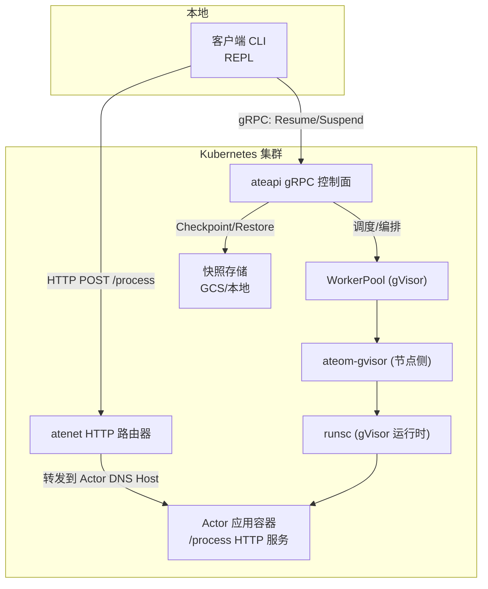
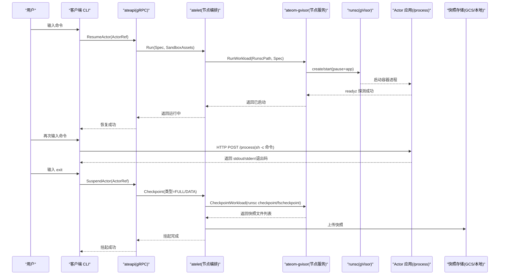
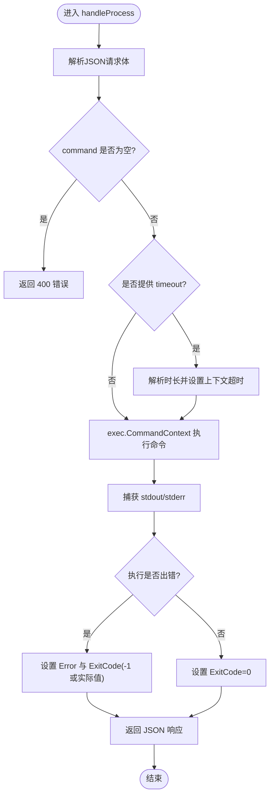
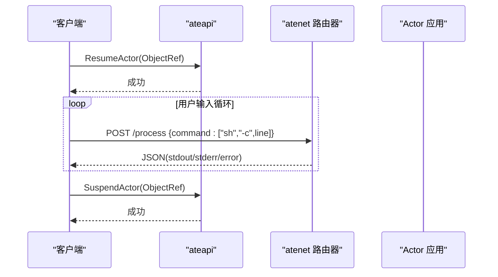
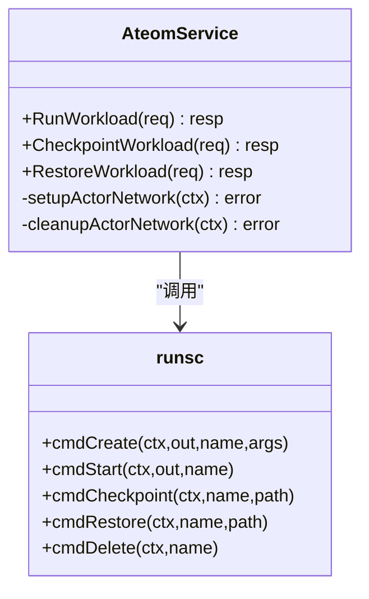
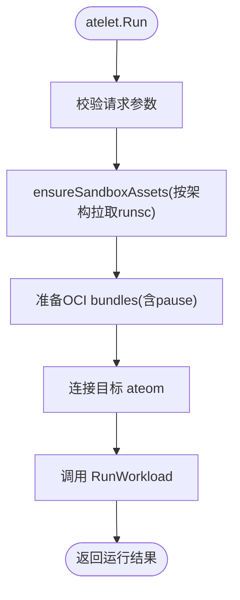
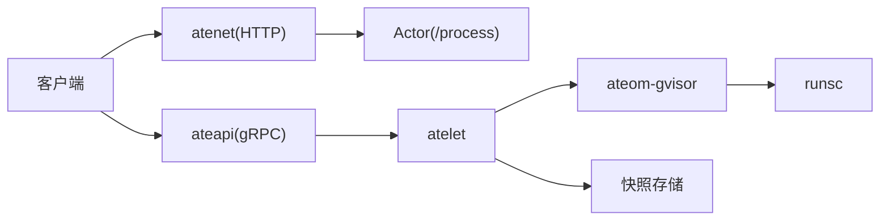

# 沙箱演示

<cite>
**本文引用的文件**   
- [demos/sandbox/README.md](file://demos/sandbox/README.md)
- [demos/sandbox/main.go](file://demos/sandbox/main.go)
- [demos/sandbox/client/main.go](file://demos/sandbox/client/main.go)
- [demos/sandbox/sandbox.yaml.tmpl](file://demos/sandbox/sandbox.yaml.tmpl)
- [pkg/proto/ateapipb/ateapi.proto](file://pkg/proto/ateapipb/ateapi.proto)
- [cmd/atelet/main.go](file://cmd/atelet/main.go)
- [cmd/atelet/sandbox_assets.go](file://cmd/atelet/sandbox_assets.go)
- [internal/proto/ateletpb/atelet.pb.go](file://internal/proto/ateletpb/atelet.pb.go)
- [cmd/ateom-gvisor/main.go](file://cmd/ateom-gvisor/main.go)
- [cmd/ateom-gvisor/runsc.go](file://cmd/ateom-gvisor/runsc.go)
- [pkg/api/v1alpha1/sandboxconfig_types.go](file://pkg/api/v1alpha1/sandboxconfig_types.go)
</cite>

## 目录
1. [简介](#简介)
2. [项目结构](#项目结构)
3. [核心组件](#核心组件)
4. [架构总览](#架构总览)
5. [详细组件分析](#详细组件分析)
6. [依赖关系分析](#依赖关系分析)
7. [性能考量](#性能考量)
8. [故障排查指南](#故障排查指南)
9. [结论](#结论)
10. [附录](#附录)

## 简介
本文件面向“Sandbox 演示”，围绕基于 gVisor 的安全隔离机制，系统阐述进程隔离、文件系统快照（Checkpoint/Restore）、网络隔离等安全特性；解释客户端与沙箱应用的通信协议（HTTP 接口），并说明如何通过 Agent Substrate 的 gRPC 控制面完成沙箱生命周期管理（创建、启动、运行、暂停、恢复、销毁）。文档同时给出资源限制与安全策略的配置要点，提供端到端源码分析与优化建议。

## 项目结构
该演示位于 demos/sandbox 目录，包含：
- 服务端：在 Actor 容器内运行的无状态 HTTP 服务，暴露 /process 执行命令。
- 客户端：本地 CLI REPL，通过 ateapi gRPC 控制面恢复/挂起 Actor，并通过 atenet HTTP 路由器转发命令到目标 Actor。
- 部署模板：WorkerPool + ActorTemplate，指定 ateom-gvisor 运行时与镜像、快照存储位置等。

图表来源
- [demos/sandbox/client/main.go](file://demos/sandbox/client/main.go)
- [demos/sandbox/main.go](file://demos/sandbox/main.go)
- [demos/sandbox/sandbox.yaml.tmpl](file://demos/sandbox/sandbox.yaml.tmpl)
- [cmd/ateom-gvisor/main.go](file://cmd/ateom-gvisor/main.go)
- [cmd/atelet/main.go](file://cmd/atelet/main.go)

章节来源
- [demos/sandbox/README.md](file://demos/sandbox/README.md)
- [demos/sandbox/sandbox.yaml.tmpl](file://demos/sandbox/sandbox.yaml.tmpl)

## 核心组件
- 沙箱服务端（Actor 应用）
  - 提供 HTTP POST /process，接收 JSON 请求，使用 exec 执行命令，返回 stdout/stderr/退出码。
  - 支持可选超时、工作目录与环境变量注入。
- 沙箱客户端（CLI REPL）
  - 连接 ateapi gRPC，调用 ResumeActor/SuspendActor 管理 Actor 生命周期。
  - 通过 atenet HTTP 路由器向 Actor 发送 /process 请求，封装为 sh -c 执行用户输入的命令。
- 运行时与编排
  - WorkerPool 指定 ateom-gvisor 作为运行时。
  - ateom-gvisor 负责网络命名空间、veth 对、nftables 规则、runsc 子进程管理、就绪探针等待。
  - atelet 负责拉取 runsc 资产、准备 OCI bundle、触发 Checkpoint/Restore、上传/下载快照。

章节来源
- [demos/sandbox/main.go](file://demos/sandbox/main.go)
- [demos/sandbox/client/main.go](file://demos/sandbox/client/main.go)
- [demos/sandbox/sandbox.yaml.tmpl](file://demos/sandbox/sandbox.yaml.tmpl)
- [cmd/ateom-gvisor/main.go](file://cmd/ateom-gvisor/main.go)
- [cmd/atelet/main.go](file://cmd/atelet/main.go)

## 架构总览
下图展示从客户端到 gVisor 隔离环境的完整链路，包括控制面与数据面交互。

图表来源
- [demos/sandbox/client/main.go](file://demos/sandbox/client/main.go)
- [pkg/proto/ateapipb/ateapi.proto](file://pkg/proto/ateapipb/ateapi.proto)
- [cmd/atelet/main.go](file://cmd/atelet/main.go)
- [cmd/ateom-gvisor/main.go](file://cmd/ateom-gvisor/main.go)
- [cmd/ateom-gvisor/runsc.go](file://cmd/ateom-gvisor/runsc.go)

## 详细组件分析

### 组件A：沙箱服务端（/process）
- 职责
  - 解析 JSON 请求体，校验必要字段。
  - 根据请求设置上下文超时、工作目录与环境变量。
  - 使用 exec 执行命令，捕获 stdout/stderr，返回结构化响应。
- 错误处理
  - 参数缺失或格式错误返回 400。
  - 非零退出码时填充 ExitCode，未知错误返回 -1。
- 安全注意
  - 当前实现未做命令白名单或权限控制，仅用于演示。

图表来源
- [demos/sandbox/main.go](file://demos/sandbox/main.go)

章节来源
- [demos/sandbox/main.go](file://demos/sandbox/main.go)

### 组件B：沙箱客户端（CLI REPL）
- 职责
  - 解析命令行参数（name、atespace、ateapi、atenet）。
  - 建立 TLS gRPC 连接到 ateapi，调用 ResumeActor 恢复 Actor。
  - 进入 REPL 循环，读取用户输入，构造 HTTP POST /process 请求发送至 atenet 路由器。
  - 退出时调用 SuspendActor 挂起 Actor。
- 关键细节
  - 请求 Host 设置为 Actor 的 DNS 名称，确保路由到正确实例。
  - 将用户输入包装为 sh -c 以支持 shell 语法。

图表来源
- [demos/sandbox/client/main.go](file://demos/sandbox/client/main.go)
- [pkg/proto/ateapipb/ateapi.proto](file://pkg/proto/ateapipb/ateapi.proto)

章节来源
- [demos/sandbox/client/main.go](file://demos/sandbox/client/main.go)

### 组件C：gVisor 运行时与网络隔离（ateom-gvisor）
- 职责
  - 监听本地 Unix Socket，提供 ateom gRPC 服务。
  - 创建内部网络命名空间，建立 veth 对，配置地址与默认路由。
  - 安装 nftables 规则：入站 DNAT 至 Actor veth IP，出站 Masquerade，转发放行。
  - 调用 runsc 创建/启动 pause 与应用容器，等待 readyz 就绪。
  - 支持 Checkpoint/Restore：全量或仅持久卷数据快照。
- 安全特性
  - 进程隔离：由 gVisor 提供用户态内核隔离。
  - 网络隔离：独立 netns + veth + nftables 规则，限制访问面。
  - 快照隔离：内存与文件系统快照，保证可恢复性与一致性。

图表来源
- [cmd/ateom-gvisor/main.go](file://cmd/ateom-gvisor/main.go)
- [cmd/ateom-gvisor/runsc.go](file://cmd/ateom-gvisor/runsc.go)

章节来源
- [cmd/ateom-gvisor/main.go](file://cmd/ateom-gvisor/main.go)
- [cmd/ateom-gvisor/runsc.go](file://cmd/ateom-gvisor/runsc.go)

### 组件D：编排与快照（atelet）
- 职责
  - 解析 RunRequest，按架构拉取 runsc 二进制（内容寻址缓存）。
  - 准备 OCI bundle（含 pause 容器），记录使用的 sandbox 资产以便后续 Checkpoint/Restore 复现。
  - 发起 Checkpoint：调用 ateom CheckpointWorkload，收集快照文件列表并上传。
  - 发起 Restore：并发下载快照与准备 assets/OCI，再调用 ateom RestoreWorkload。
- 关键数据结构
  - RunRequest 携带 TargetAteomUid、Atespace、ActorName、Spec、SandboxAssets。
  - SandboxAssets 描述运行时家族与按架构组织的资产映射（gVisor 需要 "runsc"）。

图表来源
- [cmd/atelet/main.go](file://cmd/atelet/main.go)
- [cmd/atelet/sandbox_assets.go](file://cmd/atelet/sandbox_assets.go)
- [internal/proto/ateletpb/atelet.pb.go](file://internal/proto/ateletpb/atelet.pb.go)

章节来源
- [cmd/atelet/main.go](file://cmd/atelet/main.go)
- [cmd/atelet/sandbox_assets.go](file://cmd/atelet/sandbox_assets.go)
- [internal/proto/ateletpb/atelet.pb.go](file://internal/proto/ateletpb/atelet.pb.go)

### 组件E：控制面协议（ateapi gRPC）
- 控制面服务 Control 提供 Actor 与 Atespace 的管理能力，包括：
  - Get/Create/Update/Delete Actor
  - Pause/Resume/Suspend Actor
  - List Workers/Actors
  - Create/Get/List/Delete Atespace
- 客户端通过 ResumeActor 恢复 Actor，随后通过 HTTP 与 Actor 通信；退出时调用 SuspendActor 生成快照。

章节来源
- [pkg/proto/ateapipb/ateapi.proto](file://pkg/proto/ateapipb/ateapi.proto)
- [demos/sandbox/client/main.go](file://demos/sandbox/client/main.go)

### 组件F：资源限制与安全策略
- 资源限制
  - 通过 OCI LinuxResources 定义 CPU/Memory/Pids/BlockIO/Network 等限制，供底层运行时应用。
- 安全策略
  - SandboxConfig 声明运行时家族与资产集合，结合 VAP 进行准入校验（例如 gVisor 必须提供 "runsc" 资产且校验 URL/SHA256）。
  - 演示环境未启用鉴权，生产需配合认证与授权。

章节来源
- [pkg/api/v1alpha1/sandboxconfig_types.go](file://pkg/api/v1alpha1/sandboxconfig_types.go)

## 依赖关系分析
- 客户端依赖
  - ateapi gRPC 控制面（Resume/Suspend）
  - atenet HTTP 路由器（转发 /process）
- 服务端依赖
  - OS exec 执行命令
  - 标准库 HTTP 服务器
- 运行时依赖
  - ateom-gvisor 依赖 runsc、netlink/nftables、netns
  - atelet 依赖 GCS/本地对象存储、OCI 工具链、ateom gRPC

图表来源
- [demos/sandbox/client/main.go](file://demos/sandbox/client/main.go)
- [demos/sandbox/main.go](file://demos/sandbox/main.go)
- [cmd/atelet/main.go](file://cmd/atelet/main.go)
- [cmd/ateom-gvisor/main.go](file://cmd/ateom-gvisor/main.go)

## 性能考量
- 启动与恢复
  - 冷启动涉及 runsc 资产拉取与 OCI 镜像解压，可通过本地缓存与并行化降低延迟。
  - Restore 流程中，快照下载与 assets/OCI 准备可并发执行，减少整体耗时。
- 快照大小与频率
  - FULL 快照包含内存页，体积较大；DATA 快照仅持久卷，适合频繁落盘。
  - 合理选择快照范围与频率，平衡恢复速度与数据一致性。
- 网络路径
  - 当前采用 veth + nftables 兼容路径，后续可引入透明 TCP 捕获与默认拒绝策略，提升安全性与可控性。

[本节为通用指导，不直接分析具体文件]

## 故障排查指南
- 客户端无法恢复/挂起
  - 检查 ateapi 连通性与证书配置（示例中跳过证书验证）。
  - 确认 Actor 名称与 atespace 正确。
- 命令执行失败
  - 查看 /process 返回的 stderr 与 ExitCode。
  - 确认 Actor 容器镜像中包含所需命令与依赖。
- 网络不可达
  - 检查 atenet 路由器端口转发与 Host 头是否正确。
  - 确认 nftables 规则与 veth 配置未被破坏。
- 快照异常
  - 检查 GCS/本地存储路径与权限。
  - 核对 SandboxConfig 资产版本与 SHA256 一致。

章节来源
- [demos/sandbox/client/main.go](file://demos/sandbox/client/main.go)
- [demos/sandbox/main.go](file://demos/sandbox/main.go)
- [cmd/ateom-gvisor/main.go](file://cmd/ateom-gvisor/main.go)
- [cmd/atelet/main.go](file://cmd/atelet/main.go)

## 结论
本演示展示了在 Agent Substrate 之上，基于 gVisor 的进程与网络隔离、以及完整的快照生命周期管理能力。通过 ateapi 控制面与 atenet 数据面的解耦设计，用户可以以简单 HTTP 接口与受控的 CLI 体验交互式沙箱。生产环境中应补充鉴权、最小权限策略与更严格的网络策略，并结合资源限制与快照策略达成安全与性能的平衡。

## 附录

### 快速开始（参考 README）
- 构建与部署
  - 使用安装脚本构建镜像并应用清单，等待模板就绪。
- 创建 Atespace 与 Actor
  - 先创建 atespace，再基于模板创建 Actor。
- 端口转发与服务访问
  - 转发 ateapi 与 atenet 服务，本地运行客户端 REPL。
- 卸载
  - 使用对应脚本删除演示资源。

章节来源
- [demos/sandbox/README.md](file://demos/sandbox/README.md)

### 部署模板要点
- WorkerPool 指定 ateomImage 为 ateom-gvisor。
- ActorTemplate 指定 pause 镜像与应用容器镜像及环境变量。
- snapshotsConfig 指定快照存储位置（GCS）。

章节来源
- [demos/sandbox/sandbox.yaml.tmpl](file://demos/sandbox/sandbox.yaml.tmpl)
