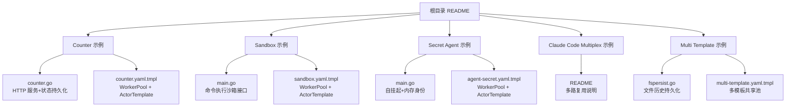
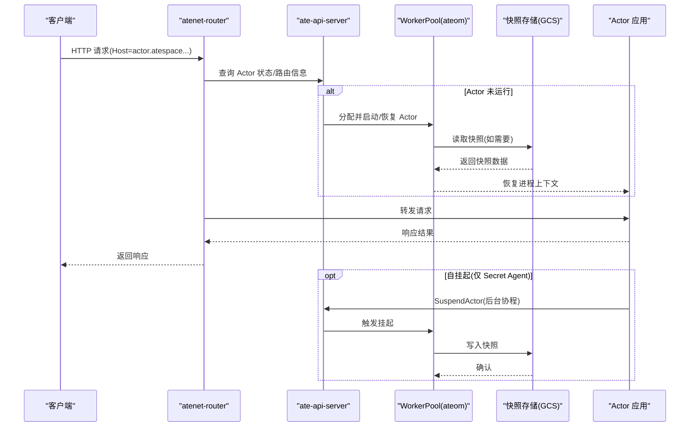
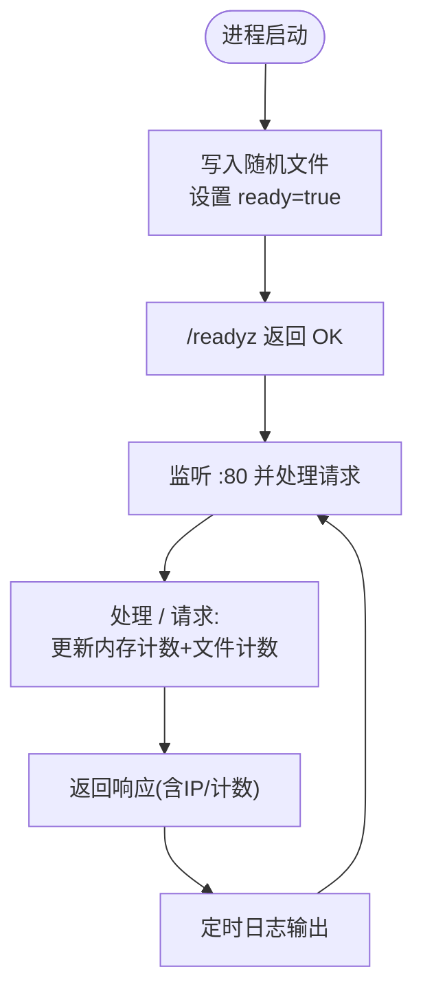
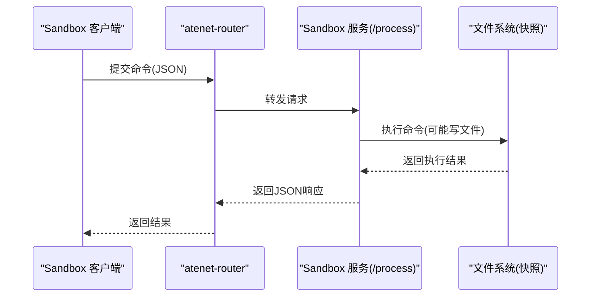
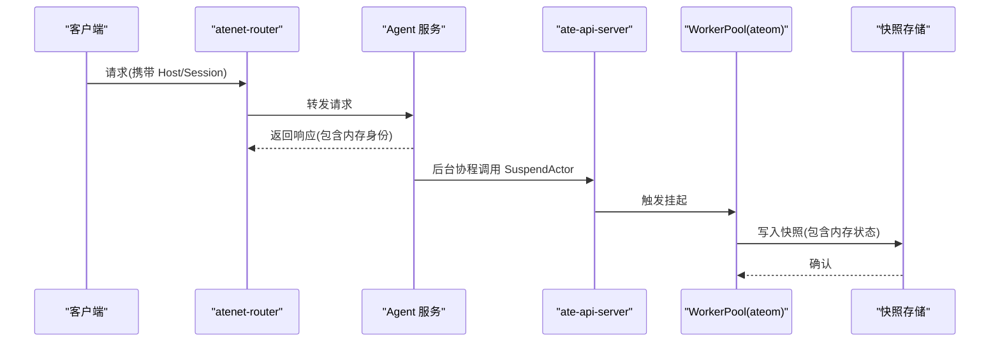
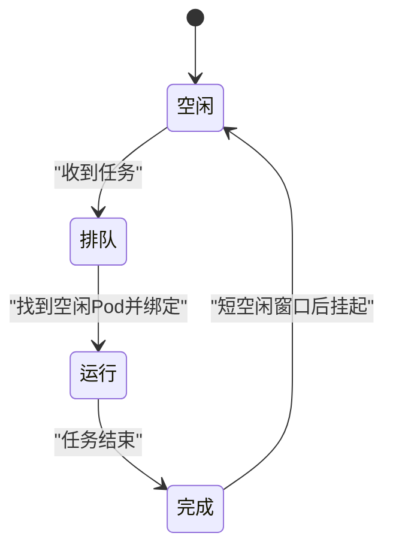
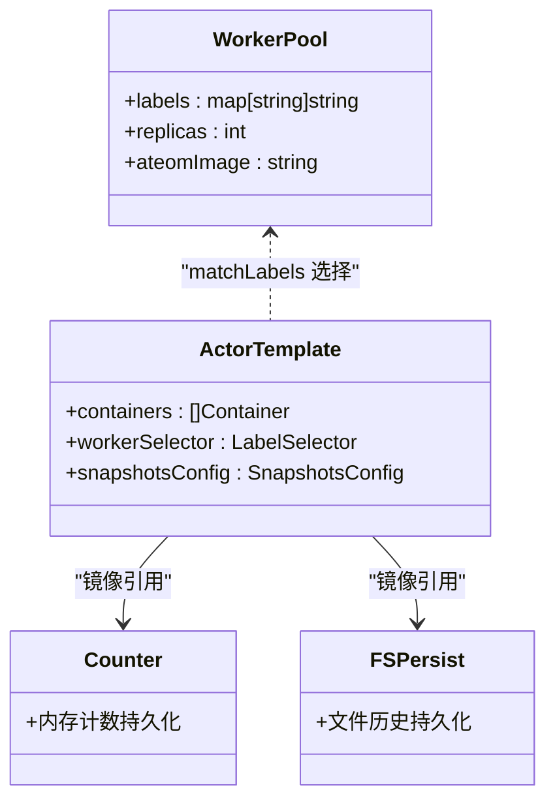
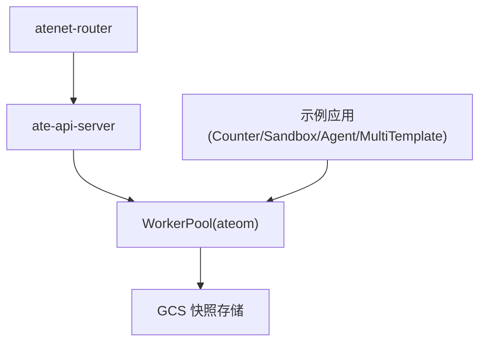

# 示例演示

<cite>
**本文引用的文件**   
- [README.md](file://README.md)
- [demos/counter/README.md](file://demos/counter/README.md)
- [demos/counter/counter.go](file://demos/counter/counter.go)
- [demos/counter/counter.yaml.tmpl](file://demos/counter/counter.yaml.tmpl)
- [demos/sandbox/README.md](file://demos/sandbox/README.md)
- [demos/sandbox/main.go](file://demos/sandbox/main.go)
- [demos/sandbox/sandbox.yaml.tmpl](file://demos/sandbox/sandbox.yaml.tmpl)
- [demos/agent-secret/README.md](file://demos/agent-secret/README.md)
- [demos/agent-secret/main.go](file://demos/agent-secret/main.go)
- [demos/agent-secret/agent-secret.yaml.tmpl](file://demos/agent-secret/agent-secret.yaml.tmpl)
- [demos/claude-code-multiplex/README.md](file://demos/claude-code-multiplex/README.md)
- [demos/multi-template/README.md](file://demos/multi-template/README.md)
- [demos/multi-template/fspersist/fspersist.go](file://demos/multi-template/fspersist/fspersist.go)
- [demos/multi-template/multi-template.yaml.tmpl](file://demos/multi-template/multi-template.yaml.tmpl)
</cite>

## 目录
1. [简介](#简介)
2. [项目结构](#项目结构)
3. [核心组件](#核心组件)
4. [架构总览](#架构总览)
5. [详细组件分析](#详细组件分析)
6. [依赖分析](#依赖分析)
7. [性能考量](#性能考量)
8. [故障排查指南](#故障排查指南)
9. [结论](#结论)
10. [附录：自定义示例开发指南](#附录自定义示例开发指南)

## 简介
本文件面向希望基于 Substrate 构建与运行“代理型”工作负载的开发者，提供完整的示例与演示应用指南。内容覆盖以下示例：
- Counter 示例：状态管理、Actor 生命周期、网络路由配置
- Sandbox 演示：安全隔离机制（文件系统快照、进程隔离、资源限制）
- Secret Agent 示例：零空闲自挂起机制（内存快照、状态恢复、自动休眠）
- Claude Code Multiplex：多路复用演示（资源超分、会话管理、性能优化）
- Multi Template 示例：模板管理机制（模板选择、共享池、版本化镜像）

每个示例均包含源代码分析、配置文件说明、部署步骤与测试结果要点，并在最后给出自定义示例的开发指南，帮助读者基于 Substrate 快速搭建自己的应用。

## 项目结构
仓库根目录下的 demos 子目录包含了所有示例。每个示例通常包含：
- README：使用说明、前置条件、部署与卸载步骤
- main.go 或业务代码：示例应用的实现
- *.yaml.tmpl：Kubernetes 清单模板（WorkerPool、ActorTemplate、Namespace 等），由安装脚本注入环境变量后应用
- 可选 UI/客户端：用于交互或可视化展示

图表来源
- [README.md:195-208](file://README.md#L195-L208)
- [demos/counter/README.md:1-116](file://demos/counter/README.md#L1-L116)
- [demos/sandbox/README.md:1-106](file://demos/sandbox/README.md#L1-L106)
- [demos/agent-secret/README.md:1-93](file://demos/agent-secret/README.md#L1-L93)
- [demos/claude-code-multiplex/README.md:1-117](file://demos/claude-code-multiplex/README.md#L1-L117)
- [demos/multi-template/README.md:1-108](file://demos/multi-template/README.md#L1-L108)

章节来源
- [README.md:195-208](file://README.md#L195-L208)

## 核心组件
- WorkerPool：定义物理 worker 节点池（Pod 集合），承载 ateom 守护进程，负责容器的检查点与恢复。
- ActorTemplate：描述一个可被实例化为 Actor 的应用模板，包括容器镜像、就绪探针、卷挂载、快照策略、以及通过标签选择器匹配 WorkerPool。
- atespace：逻辑命名空间，用于组织和管理 Actor 实例。
- Router（atenet-router）：对外暴露统一入口，根据 Host 头解析目标 Actor，并动态调度到可用 worker。

这些组件共同实现了“按需激活、跨节点迁移、状态快照”的核心能力。

章节来源
- [demos/counter/counter.yaml.tmpl:22-62](file://demos/counter/counter.yaml.tmpl#L22-L62)
- [demos/sandbox/sandbox.yaml.tmpl:20-49](file://demos/sandbox/sandbox.yaml.tmpl#L20-L49)
- [demos/agent-secret/agent-secret.yaml.tmpl:48-77](file://demos/agent-secret/agent-secret.yaml.tmpl#L48-L77)
- [demos/multi-template/multi-template.yaml.tmpl:40-82](file://demos/multi-template/multi-template.yaml.tmpl#L40-L82)

## 架构总览
下图展示了从外部请求到 Actor 激活、处理、再到自挂起的端到端流程，涵盖 Router、Control Plane、WorkerPool 与 Snapshot 存储。

图表来源
- [demos/agent-secret/main.go:103-135](file://demos/agent-secret/main.go#L103-L135)
- [demos/counter/README.md:56-79](file://demos/counter/README.md#L56-L79)
- [demos/sandbox/README.md:60-97](file://demos/sandbox/README.md#L60-L97)
- [demos/agent-secret/README.md:34-92](file://demos/agent-secret/README.md#L34-L92)

## 详细组件分析

### Counter 示例
Counter 示例是一个简单的 Go HTTP 服务，演示了：
- 内存计数器与文件计数器的双重持久化验证
- 就绪探针 /readyz 确保在快照恢复后健康检查立即生效
- 通过 Router 的动态路由与按 Host 头的会话识别

关键实现要点：
- 主函数注册 HTTP 路由，处理根路径请求，输出当前 Pod IP、内存计数与文件计数
- 初始化阶段写入随机文件，设置 ready 标志位，/readyz 仅在初始化完成后返回成功
- 使用互斥锁保护文件读写，避免并发竞争

图表来源
- [demos/counter/counter.go:64-124](file://demos/counter/counter.go#L64-L124)
- [demos/counter/counter.go:83-94](file://demos/counter/counter.go#L83-L94)

部署与使用要点：
- 通过安装脚本构建镜像并创建 Namespace、WorkerPool、ActorTemplate
- 创建 atespace 与 Actor 实例
- 端口转发 Router 后，使用 curl 发送带 Host 的请求以访问特定 Actor
- 支持手动挂起与删除 Actor

章节来源
- [demos/counter/README.md:1-116](file://demos/counter/README.md#L1-L116)
- [demos/counter/counter.go:1-166](file://demos/counter/counter.go#L1-L166)
- [demos/counter/counter.yaml.tmpl:15-62](file://demos/counter/counter.yaml.tmpl#L15-L62)

### Sandbox 演示
Sandbox 演示提供了一个安全的沙箱执行环境，允许在受控容器中执行任意命令，并通过 Actor 的生命周期保持文件系统状态。

关键实现要点：
- 服务端提供 POST /process 接口，接收 JSON 参数（命令、环境变量、工作目录、超时）
- 使用 exec.CommandContext 执行命令，捕获 stdout/stderr 与退出码
- 通过 Actor 的快照机制，将文件系统变更持久化，跨挂起/恢复保持一致

图表来源
- [demos/sandbox/main.go:42-118](file://demos/sandbox/main.go#L42-L118)

部署与使用要点：
- 安装脚本构建 Alpine 基础镜像并创建相关资源
- 创建 atespace 与 Actor 实例
- 本地端口转发 API 与 Router，使用 CLI REPL 交互式执行命令
- 退出时自动触发挂起，保留文件系统状态

章节来源
- [demos/sandbox/README.md:1-106](file://demos/sandbox/README.md#L1-L106)
- [demos/sandbox/main.go:1-119](file://demos/sandbox/main.go#L1-L119)
- [demos/sandbox/sandbox.yaml.tmpl:15-49](file://demos/sandbox/sandbox.yaml.tmpl#L15-L49)

### Secret Agent 示例
Secret Agent 示例展示了“零空闲自挂起”机制：
- 进程启动时在易失性内存中生成唯一身份标识
- 处理请求后，后台协程延迟一段时间调用 Control Plane 的 SuspendActor 接口，主动释放计算资源
- 再次访问同一 Actor 时，即使调度到不同 worker，也能恢复相同的内存身份

图表来源
- [demos/agent-secret/main.go:60-135](file://demos/agent-secret/main.go#L60-L135)

部署与使用要点：
- 安装脚本构建镜像并创建资源，建议扩展 WorkerPool 副本数以演示高密度复用
- 创建 atespace 与 Actor 实例，通过 Router 发送请求观察自动挂起行为
- 多次请求验证身份一致性，证明内存快照跨节点恢复有效

章节来源
- [demos/agent-secret/README.md:1-93](file://demos/agent-secret/README.md#L1-L93)
- [demos/agent-secret/main.go:1-136](file://demos/agent-secret/main.go#L1-L136)
- [demos/agent-secret/agent-secret.yaml.tmpl:15-77](file://demos/agent-secret/agent-secret.yaml.tmpl#L15-L77)

### Claude Code Multiplex 多路复用演示
该演示展示了多个 Claude Code 驱动的 Agent 共享少量 worker 的能力：
- 三个 Agent 作为 Actor 注册，两个 worker Pod 承载
- 当任务到达时，Substrate 将 Agent 绑定到空闲 Pod；完成后再挂起，释放资源
- 提供轻量 Web UI 驱动任务并展示队列/运行/完成状态

图表来源
- [demos/claude-code-multiplex/README.md:1-117](file://demos/claude-code-multiplex/README.md#L1-L117)

部署与使用要点：
- 准备 Anthropic API Key 与 GCS 快照桶
- 安装脚本构建 workload 镜像并创建资源
- 启动 Dashboard 服务，点击“Give a task”观察状态流转

章节来源
- [demos/claude-code-multiplex/README.md:1-117](file://demos/claude-code-multiplex/README.md#L1-L117)

### Multi Template 示例
Multi Template 示例展示了不同二进制（counter 与 fspersist）的 ActorTemplate 可以共享同一个 WorkerPool，且模板位于不同命名空间：
- 通过 workerSelector 的 matchLabels 进行集群级选择，不受命名空间限制
- counter 演示内存计数持久化，fspersist 演示文件历史持久化
- 挂起与恢复后，两种状态均能正确延续

图表来源
- [demos/multi-template/multi-template.yaml.tmpl:40-82](file://demos/multi-template/multi-template.yaml.tmpl#L40-L82)
- [demos/multi-template/fspersist/fspersist.go:1-154](file://demos/multi-template/fspersist/fspersist.go#L1-L154)

部署与使用要点：
- 安装脚本构建两个镜像并创建三个命名空间与共享池
- 在同一个 atespace 下创建来自不同模板的 Actor
- 通过 Router 访问验证状态持久化与跨节点迁移

章节来源
- [demos/multi-template/README.md:1-108](file://demos/multi-template/README.md#L1-L108)
- [demos/multi-template/fspersist/fspersist.go:1-154](file://demos/multi-template/fspersist/fspersist.go#L1-L154)
- [demos/multi-template/multi-template.yaml.tmpl:1-82](file://demos/multi-template/multi-template.yaml.tmpl#L1-L82)

## 依赖分析
各示例对 Substrate 核心组件的依赖关系如下：
- Router（atenet-router）：负责 DNS 解析与请求路由
- Control Plane（ate-api-server）：提供 gRPC 控制面，管理 Actor 生命周期
- WorkerPool（ateom-gvisor）：在 worker Pod 内执行检查点与恢复
- 快照存储（GCS）：保存 Actor 的内存与文件系统快照

图表来源
- [README.md:211-224](file://README.md#L211-L224)
- [demos/counter/counter.yaml.tmpl:22-62](file://demos/counter/counter.yaml.tmpl#L22-L62)
- [demos/sandbox/sandbox.yaml.tmpl:20-49](file://demos/sandbox/sandbox.yaml.tmpl#L20-L49)
- [demos/agent-secret/agent-secret.yaml.tmpl:48-77](file://demos/agent-secret/agent-secret.yaml.tmpl#L48-L77)
- [demos/multi-template/multi-template.yaml.tmpl:40-82](file://demos/multi-template/multi-template.yaml.tmpl#L40-L82)

章节来源
- [README.md:211-224](file://README.md#L211-L224)

## 性能考量
- 资源超分：通过挂起/恢复机制，将大量有状态的 Actor 映射到少量 worker，显著提升密度
- 就绪探针：利用 /readyz 减少冷启动等待，提高首包延迟表现
- 快照粒度：Full/Data 策略平衡恢复速度与存储开销
- 并发与锁：示例中对文件操作加锁，避免竞态导致的状态不一致

[本节为通用指导，不直接分析具体文件]

## 故障排查指南
- 就绪失败：检查 /readyz 是否返回成功，确认初始化逻辑已完成
- 路由错误：确认 Host 头格式符合 actor.atespace.actors.resources.substrate.ate.dev
- 快照异常：核对 GCS 桶权限与 location 配置是否正确
- 自挂起失败：检查 Control Plane 地址与 TLS 配置，确认 SuspendActor 调用成功

章节来源
- [demos/counter/counter.go:83-94](file://demos/counter/counter.go#L83-L94)
- [demos/agent-secret/main.go:114-135](file://demos/agent-secret/main.go#L114-L135)
- [demos/counter/counter.yaml.tmpl:55-62](file://demos/counter/counter.yaml.tmpl#L55-L62)
- [demos/sandbox/sandbox.yaml.tmpl:47-49](file://demos/sandbox/sandbox.yaml.tmpl#L47-L49)
- [demos/agent-secret/agent-secret.yaml.tmpl:75-77](file://demos/agent-secret/agent-secret.yaml.tmpl#L75-L77)
- [demos/multi-template/multi-template.yaml.tmpl:64-82](file://demos/multi-template/multi-template.yaml.tmpl#L64-L82)

## 结论
以上示例覆盖了 Substrate 的关键能力：状态持久化、Actor 生命周期管理、网络路由、安全隔离、零空闲自挂起与多路复用。通过这些示例，开发者可以快速理解如何在 Kubernetes 之上构建高并发、低延迟、强一致的代理型应用，并在此基础上扩展更多场景。

[本节为总结，不直接分析具体文件]

## 附录：自定义示例开发指南
- 编写应用服务：实现 HTTP/gRPC 接口，注意就绪探针与健康检查
- 设计状态模型：明确哪些状态需持久化（内存/文件/外部存储）
- 定义 WorkerPool 与 ActorTemplate：选择合适的快照策略与卷挂载
- 配置 Router 与 atespace：确保 Host 头与路由规则一致
- 测试与验证：模拟挂起/恢复、跨节点迁移、并发访问与压力测试
- 部署与运维：使用安装脚本或 kubectl 应用清单，监控指标与日志

章节来源
- [demos/counter/README.md:14-45](file://demos/counter/README.md#L14-L45)
- [demos/sandbox/README.md:22-58](file://demos/sandbox/README.md#L22-L58)
- [demos/agent-secret/README.md:19-47](file://demos/agent-secret/README.md#L19-L47)
- [demos/multi-template/README.md:15-51](file://demos/multi-template/README.md#L15-L51)
